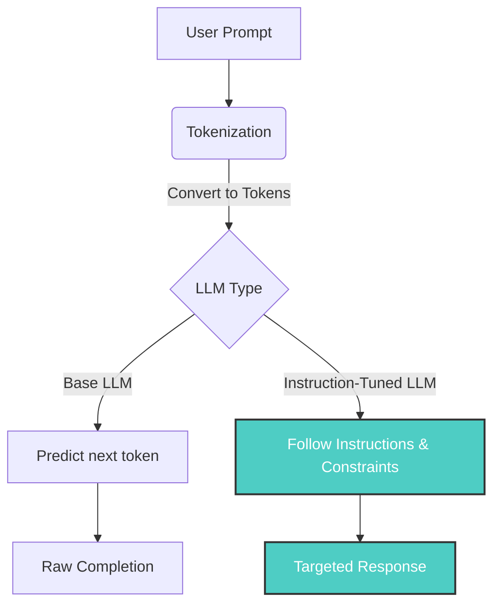

import Term from '@site/src/components/Term';

## 1. Agenda

**Thời gian đọc ước tính:** ~10 phút

### Learning outcome:
- ✅ **Hiểu** được Prompt Engineering là gì và tại sao nó lại quan trọng khi làm việc với LLMs.
- ✅ **Giải thích** được các thành phần cấu tạo nên một prompt hoàn chỉnh.
- ✅ **Phân biệt** được các kỹ thuật Zero-shot, One-shot, và Few-shot prompting.
- ✅ **Áp dụng** được các nguyên tắc thực hành tốt nhất (best practices) để tối ưu hóa đầu ra của mô hình AI.

<!-- truncate -->

[](https://youtu.be/GElCu2kUlRs?si=qrXsBvXnCW12epb8)

## 2. Glossary & Vocabulary

**2.1. Technical Terms (Thuật ngữ kỹ thuật):**
| Term | Vietnamese Meaning & Quick Explain |
| :--- | :--- |
| **Prompt Engineering** | Kỹ thuật thiết kế câu lệnh: Quá trình thiết kế và tối ưu hóa đầu vào để dẫn dắt mô hình AI tạo ra đầu ra mong muốn. |
| **Tokenization** | Tiền xử lý văn bản: Quá trình chia nhỏ văn bản thành các đơn vị nhỏ hơn (token) để mô hình có thể hiểu và xử lý. |
| **Instruction-Tuned LLMs** | Mô hình được tinh chỉnh theo chỉ thị: Các mô hình ngôn ngữ lớn đã được huấn luyện đặc biệt để làm theo các hướng dẫn cụ thể thay vì chỉ dự đoán từ tiếp theo. |
| **Fabrication (Hallucination)** | Bịa đặt thông tin: Hiện tượng mô hình AI tạo ra thông tin sai lệch nhưng trình bày một cách rất tự tin do những hạn chế trong dữ liệu huấn luyện. |
| **Stochastic** | Tính ngẫu nhiên: Bản chất của các mô hình sinh ra văn bản, nơi cùng một đầu vào có thể tạo ra các kết quả khác nhau qua các lần chạy. |
| **Zero-shot Prompting** | Kỹ thuật yêu cầu mô hình thực hiện nhiệm vụ ngay mà không cung cấp ví dụ mẫu nào. |
| **Few-shot Prompting** | Kỹ thuật cung cấp một vài ví dụ (input/output) để mô hình học theo mẫu trước khi trả lời. |

**2.2. Vocabulary Support (Từ vựng học thuật/B1+):**
| Word | Meaning in Context (Nghĩa trong ngữ cảnh) |
| :--- | :--- |
| **Anthropomorphize (v)** | Nhân hóa (gán đặc điểm của con người cho máy móc). |
| **Iteratively (adv)** | Lặp đi lặp lại có tính cải tiến. |
| **Cues (n)** | Gợi ý, tín hiệu định hướng cho mô hình. |
| **Fallback (n)** | Phương án dự phòng. |

## 3. Vấn đề & Tại sao cần Prompt Engineering?

**Vấn đề (Problem Statement):**
1. **Tính ngẫu nhiên (Stochastic behavior):** Cùng một câu lệnh có thể sinh ra các kết quả khác nhau trên cùng một mô hình ở các thời điểm khác nhau.
2. **Khả năng bịa đặt thông tin (Fabrication):** Mô hình có thể tạo ra các câu trả lời sai lệch hoàn toàn so với thực tế nhưng lại được diễn đạt rất thuyết phục.

3. **Sự khác biệt về khả năng giữa các mô hình:** Các phiên bản mô hình khác nhau (VD: GPT-3.5 vs GPT-4) xử lý ngữ cảnh và chỉ thị theo các cách khác nhau.

**Giải pháp (Solution):**
Prompt Engineering đóng vai trò như một giao diện lập trình (*programming interface*). Bằng cách thiết kế và tối ưu hóa các câu lệnh, chúng ta thiết lập các "lan can bảo vệ" (*guardrails*), giảm thiểu tính ngẫu nhiên, hạn chế thông tin sai lệch và đảm bảo mô hình trả về kết quả nhất quán, chính xác với mục tiêu của ứng dụng.

## 4. Bản chất của Prompt Engineering (WHAT)

**Định nghĩa:** Prompt Engineering là quá trình thiết kế, tinh chỉnh và tối ưu hóa các đầu vào văn bản để điều hướng các Large Language Models (LLMs) sinh ra kết quả phù hợp, chính xác và có thể dự đoán được.

[](https://github.com/microsoft/generative-ai-for-beginners/blob/main/04-prompt-engineering-fundamentals/images/04-prompt-engineering-sketchnote.png)

**Giải phẫu định nghĩa (Definition Anatomy):**
- **Thiết kế & Tinh chỉnh (Design & Optimization):** Không chỉ viết câu lệnh một lần, mà là quá trình lặp đi lặp lại (*iteratively*) để kiểm thử và cải thiện.
- **Tokenization:** Mô hình ngôn ngữ nhìn prompt như một chuỗi các tokens. Việc cắt chữ thành token rất quan trọng.

- **Điều hướng (Guide):** Hướng mô hình đi theo đúng định dạng, ngữ cảnh và mục tiêu cụ thể.
- **Dự đoán được (Consistent):** Giảm thiểu sự ngẫu nhiên, đảm bảo đầu ra luôn đạt chất lượng tiêu chuẩn.

**Kiến trúc xử lý Prompt của LLMs:**



**Sự khác biệt thực tế giữa Base LLM và Instruction-Tuned LLM:**

*Base LLM chỉ cố gắng dự đoán token tiếp theo:*


*Instruction-Tuned LLM tuân thủ theo chỉ thị của người dùng:*


## 5. Kỹ thuật cấu trúc Prompt (HOW)

Để kiểm soát đầu ra của AI, một prompt phức tạp thường được chia thành các thành phần cụ thể.

### 5.1. Sử dụng Instruction và Content

Một cấu trúc hiệu quả chia prompt thành hai phần: **Instruction** (Mệnh lệnh) và **Primary Content** (Nội dung chính).

```text
# filename: instruction_pattern.txt

Nội dung: Jupiter là hành tinh thứ năm tính từ Mặt Trời và lớn nhất trong Hệ Mặt Trời...

Chỉ thị: Hãy tóm tắt nội dung trên thành đúng 2 câu ngắn gọn.
```
*Ghi chú (WHY):* Việc phân tách rõ ràng giúp mô hình hiểu đâu là dữ liệu cần xử lý và đâu là hành động cần thực hiện.

### 5.2. Kỹ thuật Few-shot Prompting

Thay vì chỉ ra lệnh, chúng ta cung cấp các ví dụ để mô hình tự suy luận ra mẫu (pattern).

```text
# filename: few_shot_example.txt

The player ran the bases => Baseball
The player hit an ace => Tennis
The player hit a six => Cricket
The player made a slam-dunk =>
```
*Output mong đợi:* `Basketball`

*Ghi chú (WHY):* Mô hình ngôn ngữ rất giỏi trong việc nhận diện mẫu. Few-shot prompting tận dụng khả năng này để hướng dẫn mô hình định dạng đầu ra mà không cần viết các chỉ thị dài dòng.

### 5.3. Sử dụng Prompt Cues

Prompt Cues (*Gợi ý*) là việc bạn viết sẵn những từ đầu tiên của câu trả lời để định hướng mô hình tiếp tục theo đúng mạch đó.

```text
# filename: prompt_cue.txt

Nội dung: Jupiter là hành tinh thứ năm...
Chỉ thị: Tóm tắt 3 ý chính của đoạn trên.

Top 3 điều chúng ta học được là:
1. 
```
*Ghi chú (WHY):* Cue ép mô hình bắt đầu sinh text theo một định dạng cụ thể (ở đây là danh sách có đánh số), tránh việc mô hình tự ý mở bài dài dòng.

## 6. Các nguyên tắc thực hành tốt nhất (Best Practices)

1. **Rõ ràng và cụ thể (Be specific and clear):** Cung cấp chi tiết về bối cảnh, định dạng đầu ra, độ dài mong muốn và phong cách.
2. **Sử dụng Dấu phân cách (Delimiters):** Sử dụng các dấu như `"""`, `---`, hoặc thẻ XML `<context>` để phân tách rạch ròi giữa chỉ thị và dữ liệu đầu vào.
3. **Cung cấp phương án dự phòng (Give the model an "out"):** Yêu cầu mô hình trả lời "Tôi không có đủ thông tin" nếu không tìm thấy dữ liệu, giúp hạn chế hiện tượng Fabrication.
4. **Chú ý đến thứ tự (Order Matters):** Do xu hướng thiên vị thông tin gần nhất (*Recency bias*), mô hình thường chú ý nhiều hơn đến các lệnh ở phần cuối của prompt. Hãy đặt những chỉ thị quan trọng nhất ở cuối.

## 7. Câu hỏi thảo luận

1. Theo bạn, tại sao hiện tượng "Fabrication" lại nguy hiểm hơn việc mô hình trả lời sai một cách rõ ràng?
2. Trong trường hợp nào việc sử dụng Zero-shot prompting mang lại hiệu quả tốt hơn so với Few-shot prompting? Đánh đổi (Trade-offs) của việc sử dụng quá nhiều ví dụ trong Few-shot là gì?
3. Thiết kế hệ thống Prompt như thế nào để ứng dụng của bạn không phụ thuộc quá nhiều vào một phiên bản LLM cụ thể (ví dụ khi nâng cấp từ GPT-3.5 lên GPT-4)?

## 8. References
- Dựa trên [Generative AI for Beginners - Microsoft](https://github.com/microsoft/generative-ai-for-beginners/blob/main/04-prompt-engineering-fundamentals/README.md).

---
*Made by Anh Tu - Share to be share*
