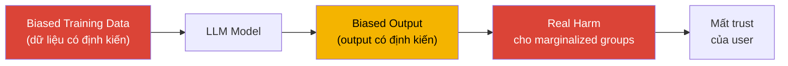
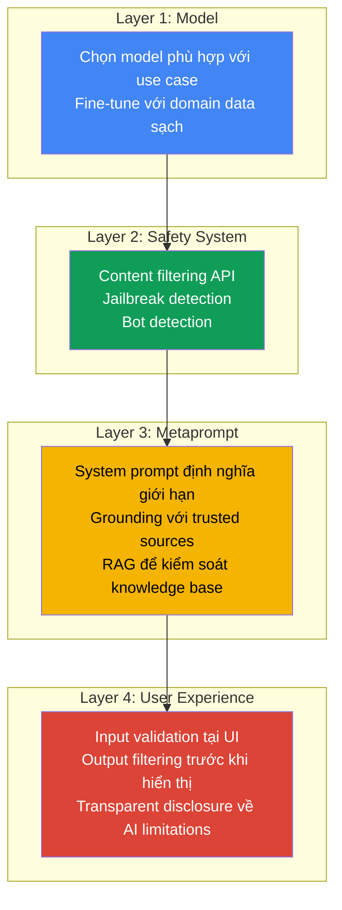

import Term from '@site/src/components/Term';

> **Synthesized from:** [Using Generative AI Responsibly — Microsoft Generative AI for Beginners, Lesson 03](https://github.com/microsoft/generative-ai-for-beginners/blob/main/03-using-generative-ai-responsibly/README.md)
>
> Bài viết được tổng hợp và tái cấu trúc học thuật từ nguồn aha-mind:blog.

<!-- truncate -->

## Agenda

**Estimated reading time:** ~16 minutes

### Learning Outcomes:

- Giải thích được 6 nguyên tắc Responsible AI và tại sao chúng là yêu cầu kỹ thuật, không phải chỉ là đạo đức
- Phân tích được 3 loại harm chính từ LLMs với ví dụ cụ thể và hậu quả thực tế
- Áp dụng được mô hình 4 lớp giảm thiểu (Mitigation Layers) vào thiết kế hệ thống AI
- Xây dựng được checklist vận hành (Operate) cho một Responsible AI product

---

## 1. Glossary and Vocabulary

**1.1. Technical Terms:**

| Term | Vietnamese Meaning and Quick Explain |
| :--- | :--- |
| **Responsible AI** | AI có trách nhiệm — Tập hợp nguyên tắc và thực hành đảm bảo hệ thống AI hoạt động công bằng, an toàn, minh bạch và có thể giải trình. |
| **Hallucination** | Ảo giác — LLM tạo ra thông tin sai sự thật hoặc vô nghĩa nhưng được trình bày với độ tự tin cao. |
| **Bias** | Định kiến trong dữ liệu huấn luyện khiến AI đưa ra quyết định bất công hoặc lệch lạc với một nhóm người cụ thể. |
| **Jailbreak** | Tấn công khai thác — Dùng prompt được thiết kế khéo léo để lừa AI vượt qua các rào cản bảo mật và đạo đức. |
| **Metaprompt** | System prompt cấp cao được thiết lập sẵn để định hình hành vi, giới hạn và vai trò của AI trước khi người dùng tương tác. |
| **Grounding** | Kỹ thuật buộc AI chỉ sử dụng các nguồn dữ liệu thực tế, đáng tin cậy được cung cấp sẵn — không tự suy diễn. |
| **Content Safety** | Hệ thống lọc và phát hiện nội dung có hại trong pipeline AI trước khi trả về cho người dùng. |
| **Stakeholder** | Các bên liên quan có lợi ích hoặc chịu ảnh hưởng bởi kết quả của hệ thống AI. |

**1.2. Vocabulary Support (B1+):**

| Word | Meaning in Context |
| :--- | :--- |
| **Inclusiveness (n)** | Tính bao trùm — Đảm bảo AI phục vụ và tôn trọng tất cả mọi người, không phân biệt. |
| **Accountability (n)** | Trách nhiệm giải trình — Tổ chức/cá nhân phải chịu trách nhiệm về hành động và quyết định của AI. |
| **Marginalized (adj)** | Bị gạt ra ngoài lề — Các nhóm yếu thế ít có tiếng nói và quyền lợi trong xã hội. |
| **Compliant (adj)** | Tuân thủ đầy đủ các quy định pháp lý và chính sách quản lý. |
| **Rollback (n)** | Khôi phục hệ thống về trạng thái ổn định trước đó khi có sự cố. |
| **Demeaning (adj)** | Hạ thấp danh dự, gây tổn hại đến lòng tự trọng của người khác. |

---

## 2. Problem Statement

### 2.1. Responsible AI Không Phải Là Vấn Đề Đạo Đức — Đây Là Vấn Đề Kỹ Thuật

Trong cộng đồng developer, Responsible AI thường bị nhầm là "soft topic" — phần dành cho policy team, không phải engineer. Nhận thức này sai về bản chất:

1. **Hallucination là bug kỹ thuật có thể đo lường được** — Accuracy, groundedness, và fabrication rate là metrics cụ thể, không phải cảm nhận.
2. **Bias trong output ảnh hưởng trực tiếp đến product quality** — Model phân loại CV thiên vị giới tính, model hỗ trợ học tập phân biệt ngôn ngữ → churn rate tăng, reputation giảm.
3. **Jailbreak là attack vector có thể được khai thác** — Không phải chỉ là người dùng nghịch ngợm. Đây là bề mặt tấn công bảo mật thực sự.

### 2.2. Chi Phí Của Việc Không Làm Responsible AI

| Loại harm | Hậu quả kỹ thuật | Hậu quả kinh doanh |
| :--- | :--- | :--- |
| Hallucination | User trust giảm | Reputation damage, churn |
| Harmful content | Safety incident | Legal liability |
| Bias | Exclusion của user groups | Regulatory fine, discrimination lawsuit |
| Jailbreak | Security breach | Data exposure, brand damage |

---

## 3. 6 Nguyên Tắc Responsible AI

Microsoft định nghĩa 6 nguyên tắc làm nền tảng cho mọi hệ thống AI có trách nhiệm:

| Nguyên tắc | Định nghĩa cốt lõi |
| :--- | :--- |
| **Fairness** | Output không phân biệt đối xử với bất kỳ nhóm người nào |
| **Inclusiveness** | AI tiếp cận được với tất cả mọi người, không chỉ nhóm đa số |
| **Reliability and Safety** | Hoạt động nhất quán, đúng thiết kế, kể cả với adversarial input |
| **Security and Privacy** | Bảo vệ dữ liệu người dùng, chống attack vector đặc thù của AI |
| **Transparency** | Người dùng hiểu AI đang làm gì, tại sao, và giới hạn của nó |
| **Accountability** | Luôn có người/tổ chức chịu trách nhiệm về hành động của AI |

### 3.1. Định Nghĩa và Use Case Từng Nguyên Tắc

#### Fairness — Công Bằng

**Định nghĩa:** AI phải tạo ra output nhất quán và không thiên vị với mọi cá nhân, bất kể chủng tộc, giới tính, quốc tịch, độ tuổi, hay bất kỳ đặc điểm nhân khẩu học nào.

**Bản chất vấn đề:** Bias không phải do AI "cố tình phân biệt" — nó là phản chiếu của dữ liệu huấn luyện. Internet chứa đựng toàn bộ định kiến lịch sử của con người, và LLM học từ đó.

**Use case vi phạm:** Amazon từng dùng AI để sàng lọc CV (2018). Model học từ 10 năm lịch sử tuyển dụng — vốn nghiêng về nam giới trong engineering — và tự động hạ điểm CV có từ *"women's"* (ví dụ: "women's chess club"). Amazon phải tắt tool này.

**Use case đúng:** AI tuyển dụng được calibrate để đánh giá đồng đều ứng viên theo năng lực, mù thông tin về giới tính và sắc tộc khi so sánh điểm số.

---

#### Inclusiveness — Bao Trùm

**Định nghĩa:** AI phải thiết kế để phục vụ được mọi người dùng, kể cả những nhóm thường bị bỏ qua: người khuyết tật, người dùng ngôn ngữ thiểu số, người có trình độ đọc viết thấp, người ở vùng băng thông hạn chế.

**Sự khác biệt với Fairness:**
- **Fairness** = Xử lý công bằng khi người dùng đã có access
- **Inclusiveness** = Đảm bảo mọi người đều có access ngay từ đầu

**Use case vi phạm:** Một AI chatbot giáo dục chỉ hoạt động tốt bằng tiếng Anh vì phần lớn training data là tiếng Anh. Học sinh ở vùng nông thôn Việt Nam, Nigeria hay Bangladesh bị loại ra khỏi cơ hội học.

**Use case đúng:** Microsoft Seeing AI — ứng dụng đọc mô tả ảnh cho người khiếm thị. AI tạo ra alt text tự động, giúp người khiếm thị truy cập nội dung số bình đẳng với người sáng mắt.

---

#### Reliability and Safety — Tin Cậy và An Toàn

**Định nghĩa:** AI phải hoạt động nhất quán và đúng như thiết kế trong mọi điều kiện — kể cả adversarial input — và không được tạo ra output gây hại thể chất, tâm lý hoặc xã hội.

**Tại sao LLM đặc biệt khó đảm bảo:** LLM là *probabilistic systems* — cùng một input, mỗi lần chạy có thể cho output khác nhau. Không thể viết unit test kiểu deterministic như software truyền thống.

**Use case vi phạm:** AI health assistant tự tin đưa ra liều lượng thuốc khi không có đủ thông tin về bệnh nhân — reliability thấp ở đây là safety risk trực tiếp có thể gây hại thể chất.

**Use case đúng:** GitHub Copilot sử dụng nhiều lớp kiểm tra để đảm bảo code suggestion không chứa security vulnerability đã biết, và từ chối suggest code liên quan đến exploit pattern.

---

#### Security and Privacy — Bảo Mật và Quyền Riêng Tư

**Định nghĩa:** Hệ thống AI phải chống lại các vector tấn công đặc thù (prompt injection, jailbreak, data extraction) và bảo vệ dữ liệu cá nhân người dùng không bị rò rỉ hoặc lạm dụng ngoài phạm vi đã được consent.

**Attack vector đặc thù của LLM (không tồn tại trong software truyền thống):**
- **Prompt Injection** — kẻ tấn công inject instruction vào input để override system prompt, tương tự SQL Injection nhưng ở cấp ngôn ngữ tự nhiên
- **Training Data Extraction** — khai thác model để "nhớ lại" và xuất ra thông tin nhạy cảm từ training corpus

**Use case vi phạm:** Chatbot bệnh viện lưu toàn bộ lịch sử hội thoại (bao gồm thông tin bệnh lý) dưới dạng plain text, không mã hóa. Vi phạm GDPR và HIPAA.

**Use case đúng:** Hệ thống AI banking dùng PII detection để tự động redact số tài khoản và thông tin định danh trước khi log conversation để phân tích.

---

#### Transparency — Minh Bạch

**Định nghĩa:** Các bên liên quan — người dùng, developers, tổ chức — phải có thể hiểu được: (1) đây có phải AI không, (2) AI đang làm gì, (3) tại sao AI đưa ra quyết định cụ thể, và (4) giới hạn của nó là gì.

**Transparency không có nghĩa là "công bố model weights"** — đây là lầm tưởng phổ biến. Transparency hoạt động ở cấp độ người dùng: disclosure rõ ràng, không pretend là người thật, và express uncertainty khi không chắc.

**Use case vi phạm:** Air Canada Chatbot (2024) cam kết với khách hàng về chính sách hoàn tiền không tồn tại. Khi bị kiện, Air Canada lập luận chatbot là "separate legal entity". Tòa án Canada bác bỏ — Air Canada phải bồi thường. Đây là hậu quả của việc AI không transparent về giới hạn của mình.

**Use case đúng:** ChatGPT hiển thị rõ "I may be wrong" và khuyến khích user verify thông tin quan trọng. Khi không biết, model nói "I don't have information about that" thay vì fabricate.

---

#### Accountability — Trách Nhiệm Giải Trình

**Định nghĩa:** Phải luôn có một cá nhân hoặc tổ chức có thể bị quy trách nhiệm pháp lý và đạo đức về hành động của hệ thống AI — kể cả khi quyết định được đưa ra hoàn toàn tự động bởi model.

**Accountability Gap — vấn đề cấu trúc:** Trong chuỗi AI deployment (model provider → cloud provider → app builder → end user), không ai tự nguyện nhận trách nhiệm khi AI gây harm. Luật pháp đang dần buộc **App Builder** chịu trách nhiệm cuối cùng với người dùng của họ.

**Use case vi phạm:** Một công ty fintech dùng AI để tự động từ chối khoản vay mà không cung cấp lý do — người dùng không thể kháng cáo, không ai có thể giải thích tại sao AI quyết định như vậy.

**Use case đúng:** Theo EU AI Act (2025), các hệ thống AI high-risk (tuyển dụng, giáo dục, tín dụng) bắt buộc phải có human-in-the-loop review cho quyết định ảnh hưởng đến quyền lợi cá nhân, và phải duy trì audit trail để giải trình.

---


---


## 4. 3 Loại Harm Chính Cần Phòng Ngừa

### 4.1. Hallucination — Nguy Hiểm Nhất Vì Trông Đáng Tin

[](https://github.com/microsoft/generative-ai-for-beginners/blob/main/03-using-generative-ai-responsibly/images/ChatGPT-titanic-survivor-prompt.webp)

**Case study từ bài gốc:** Sinh viên hỏi LLM "Who was the sole survivor of the Titanic?" — Model trả lời chi tiết, tự tin, và sai hoàn toàn. Titanic có hơn 700 người sống sót.

**Tại sao hallucination đặc biệt nguy hiểm:**
- Output trông **persuasive và authoritative** — người dùng không có lý do để nghi ngờ
- Thường xảy ra với **thông tin ít phổ biến** hoặc **câu hỏi mang tính factual cụ thể** — không phải câu hỏi chung chung
- **LLM không biết nó đang sai** — cơ chế probability distribution không có khái niệm "tôi không biết"

**Hậu quả trong education app:** Sinh viên học thông tin sai → lây lan thông tin sai → mất trust vào product.

### 4.2. Harmful Content — Rủi Ro Có Thể Bị Khai Thác

Harmful content bao gồm:

- Hướng dẫn hoặc khuyến khích tự làm hại bản thân / gây hại cho người khác
- Nội dung thù ghét hoặc hạ thấp danh dự
- Lập kế hoạch tấn công hoặc hành vi bạo lực
- Hướng dẫn truy cập nội dung/hành vi phi pháp
- Nội dung khiêu dâm

**Lưu ý kỹ thuật:** Harmful content không chỉ đến từ user cố tình — nó có thể xuất hiện trong response về chủ đề bình thường nếu model chưa được align đúng. Một chatbot hỗ trợ học tập có thể vô tình cung cấp thông tin nguy hiểm khi sinh viên hỏi về lịch sử chiến tranh.

### 4.3. Lack of Fairness — Harm Âm Thầm Nhất

Bias không hiển thị rõ ràng như harmful content. Nó hoạt động âm thầm qua:

- Model recommend học bổng STEM ít hơn cho học sinh nữ
- Chatbot phản hồi chậm hơn hoặc kém chất lượng hơn với câu hỏi bằng tiếng địa phương
- AI chấm điểm essay ưu tiên phong cách viết của văn hóa phương Tây



---

## 5. Framework 4 Bước: Measure → Mitigate → Operate → Evaluate

[](https://github.com/microsoft/generative-ai-for-beginners/blob/main/03-using-generative-ai-responsibly/images/mitigate-cycle.png)

### 5.1. Measure — Đo Lường Trước Khi Sửa

Không thể mitigate những gì chưa được đo lường. Bước đầu là xây dựng test suite:

- **Domain-specific prompts** — Danh sách các prompt phản ánh use case thực tế của ứng dụng
- **Edge cases và adversarial prompts** — Các input cực đoan, mơ hồ, hoặc cố tình phá vỡ constraint
- **Metrics cần đo:**
  - *Accuracy* — Output đúng về mặt factual so với ground truth
  - *Groundedness* — Output có được support bởi context được cung cấp không
  - *Relevance* — Output có trả lời đúng câu hỏi không
  - *Fabrication rate* — Tỉ lệ output chứa thông tin bịa đặt

### 5.2. Mitigate — Mô Hình 4 Lớp

[](https://github.com/microsoft/generative-ai-for-beginners/blob/main/03-using-generative-ai-responsibly/images/mitigation-layers.png)

Đây là phần kỹ thuật cốt lõi. 4 lớp hoạt động theo nguyên tắc **defense in depth** — không có lớp nào là đủ một mình:



**Lớp 1 — Model:**

Chọn model nhỏ hơn, chuyên biệt hơn cho use case giới hạn. GPT-4 đủ mạnh để bị khai thác theo những cách phức tạp hơn — không phải lúc nào "model lớn hơn" cũng là lựa chọn tốt hơn về safety. Fine-tuning với curated data làm giảm khả năng model tạo harmful content.

**Lớp 2 — Safety System:**

Azure AI Content Safety, AWS Guardrails, Llama Guard — các công cụ này chạy như một layer độc lập, scan input và output, phát hiện harmful content trước khi đến được người dùng. Cũng xử lý jailbreak detection và rate limiting cho bot attacks.

**Lớp 3 — Metaprompt và Grounding:**

System prompt là "bản tính" của AI trong ứng dụng của bạn. Ví dụ cho education app:

```
System: You are an educational assistant for high school students.
- Only answer questions related to the school curriculum.
- If asked about topics outside the curriculum, redirect politely.
- Never provide medical, legal, or financial advice.
- Always cite your sources when providing factual information.
- If you are unsure about a fact, say so explicitly.
```

Kết hợp với RAG: model chỉ được phép trả lời dựa trên documents trong approved knowledge base — không tự suy diễn từ training data.

**Lớp 4 — User Experience:**

- **Input constraints** — Giới hạn loại input user có thể gửi (chọn từ dropdown thay vì free text khi có thể)
- **Output filtering** — Chạy content check một lần nữa trước khi render cho user
- **Transparency disclosure** — Hiển thị rõ "Đây là câu trả lời do AI tạo ra. Vui lòng xác minh thông tin quan trọng."
- **Confidence indicator** — Nếu model có uncertainty cao, hiển thị cảnh báo

### 5.3. Operate — Vận Hành Liên Tục

Launch không phải là điểm kết thúc. Responsible AI là vận hành liên tục:

- **Legal và Compliance review** — Đặc biệt quan trọng với GDPR (châu Âu), PDPA (Việt Nam), và các quy định AI mới đang được ban hành
- **Incident response plan** — Khi model tạo ra harmful output, ai chịu trách nhiệm xử lý? Trong bao lâu? Rollback như thế nào?
- **Monitoring và alerting** — Theo dõi metrics harm rate, user reports, safety system trigger rate
- **Regular red teaming** — Định kỳ thuê chuyên gia tìm cách break model để phát hiện lỗ hổng mới

### 5.4. Evaluate — Đánh Giá Liên Tục

Model không static — LLM providers thường xuyên update model. Mỗi update cần re-evaluate:

| Metric | Mô tả | Công cụ đo |
| :--- | :--- | :--- |
| **Accuracy** | Output đúng về factual | Manual review + automated fact-check |
| **Groundedness** | Output có grounded trong context không | Azure AI Evaluation, RAGAs |
| **Relevance** | Output có liên quan đến câu hỏi không | Cosine similarity với expected answer |
| **Fabrication rate** | Tỉ lệ thông tin bịa đặt | Human evaluation sample |
| **Safety rate** | Tỉ lệ harmful content bị chặn thành công | Content Safety logs |

---

## 6. Tooling Ecosystem

Responsible AI không còn chỉ là quy trình thủ công. Ecosystem tool đang phát triển nhanh:

| Tool | Provider | Tính năng chính |
| :--- | :--- | :--- |
| **Azure AI Content Safety** | Microsoft | Detect harmful text/image qua API, category-level scoring |
| **Llama Guard** | Meta (Open Source) | Input/output safety classification, chạy local |
| **AWS Guardrails for Bedrock** | Amazon | Content filtering cho các model trên Bedrock |
| **Azure AI Evaluation** | Microsoft | Đo groundedness, relevance, coherence tự động |
| **RAGAs** | Open Source | Evaluate RAG pipeline quality |
| **Garak** | Open Source | LLM vulnerability scanner, red teaming tự động |

---

## 7. Limitations and Trade-offs

1. **Safety vs. Utility trade-off** — Safety system quá aggressive sẽ block cả câu hỏi hợp lệ (false positive). Metaprompt quá hạn chế sẽ làm model kém hữu ích. Không có cấu hình nào hoàn hảo — phải calibrate liên tục dựa trên production data.

2. **Bias không thể loại bỏ hoàn toàn** — Dữ liệu internet phản ánh bias của xã hội. Model train trên internet data sẽ inherits bias đó. Fine-tuning cải thiện nhưng không eliminate được.

3. **Accountability gap trong shared responsibility** — Khi bạn dùng GPT-4 của OpenAI qua Azure OpenAI Service, ai chịu trách nhiệm khi model hallucinate? Model provider (OpenAI)? Cloud provider (Microsoft)? Application builder (bạn)? Câu trả lời pháp lý đang được xác định và thay đổi theo từng jurisdiction.

4. **Jailbreak là race không có hồi kết** — Mỗi khi safety system được cải thiện, cộng đồng lại tìm ra phương pháp jailbreak mới. Đây là adversarial problem — không có giải pháp vĩnh viễn.

5. **Chi phí evaluation không nhỏ** — Red teaming, human evaluation, và monitoring liên tục tốn resource đáng kể. Với startup nhỏ, đây là trade-off thực tế giữa speed và safety.

---

## 8. Responsible AI Checklist — Dành Cho Application Builders

Trước khi launch bất kỳ Generative AI feature nào:

**Measure:**
- [ ] Đã xây dựng test suite với domain-specific và adversarial prompts chưa?
- [ ] Đã đo baseline fabrication rate, accuracy, groundedness chưa?
- [ ] Đã test với diverse user groups (ngôn ngữ, văn hóa, nền tảng khác nhau) chưa?

**Mitigate:**
- [ ] Model có phù hợp với scope của use case không (tránh dùng model quá powerful)?
- [ ] Đã deploy content safety layer (Azure AI Content Safety hoặc tương đương) chưa?
- [ ] System prompt có định nghĩa rõ giới hạn và behavior không?
- [ ] RAG hoặc grounding có giới hạn knowledge base về trusted sources không?
- [ ] UI có giới hạn input và hiển thị transparency disclosure không?

**Operate:**
- [ ] Đã có incident response plan (ai chịu trách nhiệm, trong bao lâu, rollback như thế nào)?
- [ ] Đã review với Legal/Compliance về regulatory requirements chưa?
- [ ] Monitoring và alerting cho safety metrics đã được thiết lập chưa?

**Evaluate:**
- [ ] Có kế hoạch re-evaluate sau mỗi model update không?
- [ ] Có cơ chế thu thập user feedback về harmful output không?

---

## 9. Discussion Questions

1. **Accountability Distribution** — Khi một LLM chatbot trong ứng dụng giáo dục cung cấp thông tin y tế sai lệch cho học sinh, trách nhiệm pháp lý thuộc về ai: model provider (OpenAI/Anthropic), cloud provider (Microsoft/AWS), hay startup đã build application? Nên có framework pháp lý nào để giải quyết vấn đề này?

2. **Safety vs. Censorship** — Content safety system block một số câu hỏi về lịch sử chiến tranh để tránh violent content. Nhưng đây là nội dung học thuật hợp lệ. Ranh giới giữa "content safety" và "censorship" nằm ở đâu? Ai có quyền quyết định?

3. **Bias In, Bias Out** — Training data của LLMs phần lớn là text tiếng Anh từ internet phương Tây. Khi deploy AI education tool ở Việt Nam hoặc các nước đang phát triển, những bias nào có thể xuất hiện? Có cách nào mitigate không, hay phải train model riêng?

---

## 10. References

| Source | Type | URL |
| :--- | :--- | :--- |
| Microsoft — Generative AI for Beginners, Lesson 03 | Tier 1 (Official Curriculum) | [github.com/microsoft](https://github.com/microsoft/generative-ai-for-beginners/blob/main/03-using-generative-ai-responsibly/README.md) |
| Microsoft — Responsible AI Principles | Tier 1 (Official) | [microsoft.com/ai/responsible-ai](https://www.microsoft.com/en-us/ai/responsible-ai) |
| Azure AI Content Safety Documentation | Tier 1 (Official Docs) | [learn.microsoft.com](https://learn.microsoft.com/azure/ai-services/content-safety/overview) |
| NIST AI Risk Management Framework | Tier 1 (Government Standard) | [nist.gov/artificial-intelligence](https://www.nist.gov/artificial-intelligence) |
| Flying Bisons — Responsible AI in Practice | Tier 2 (Industry Blog) | [flyingbisons.com](https://flyingbisons.com) |

---
*Made by Anh Tu - Share to be share*
