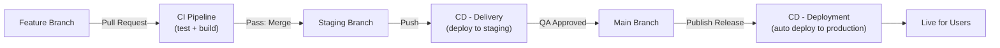

import Term from '@site/src/components/Term';

## Agenda

**Thời gian đọc ước tính:** ~25 phút

### Learning outcome:

- Phân biệt chính xác ba khái niệm **Continuous Integration**, **Continuous Delivery** và **Continuous Deployment** — không còn dùng lẫn lộn
- Giải thích được vai trò của từng môi trường (local, staging, production) trong vòng đời phần mềm chuyên nghiệp
- Tự tay thiết lập CI/CD workflow bằng GitHub Actions, Docker Hub và Google Cloud Run cho dự án Node.js thực tế

<!-- truncate -->

---

## Glossary & Vocabulary

**1. Technical Terms (Thuật ngữ kỹ thuật):**

| Term | Vietnamese Meaning & Quick Explain |
| :--- | :--- |
| **CI — Continuous Integration** | Tích hợp liên tục — tự động test và gộp code từ feature branch vào nhánh chính sau mỗi thay đổi. |
| **Continuous Delivery** | Chuyển giao liên tục — tự động deploy lên staging, cần human approval trước khi lên production. |
| **Continuous Deployment** | Triển khai liên tục — tự động deploy thẳng lên production khi vượt qua automated tests. |
| **Pipeline** | Chuỗi bước tự động (test → build → deploy) thực thi tuần tự sau mỗi sự kiện trigger. |
| **Staging Environment** | Môi trường thử nghiệm giống hệt production, dành cho QA team kiểm thử thủ công. |
| **Feature Branch** | Nhánh code riêng để developer phát triển tính năng mới mà không ảnh hưởng nhánh chính. |
| **Service Account (GCP)** | Tài khoản đặc biệt cho pipeline tự động xác thực với Google Cloud, không phải tài khoản người dùng. |
| **YAML** | Ngôn ngữ định dạng dữ liệu dễ đọc, dùng để viết file cấu hình CI/CD workflow. |

**2. Vocabulary Support (Từ vựng B1+):**

| Word | Meaning in Context |
| :--- | :--- |
| **Interchangeable (adj)** | Có thể hoán đổi cho nhau — dùng để chỉ các khái niệm hay bị nhầm lẫn là giống nhau. |
| **Foolproof (adj)** | Không thể sai — chỉ cơ chế thiết kế để loại bỏ hoàn toàn lỗi con người. |
| **Edge case (n)** | Tình huống ngoại lệ hiếm gặp, thường bị bỏ quên khi viết automated tests. |
| **Incrementally (adv)** | Từng bước nhỏ, tích lũy dần theo thời gian. |
| **Rigorous (adj)** | Nghiêm ngặt, đòi hỏi độ chính xác cao. |
| **Boilerplate (n)** | Mã nguồn mẫu chuẩn viết sẵn, tái sử dụng cho nhiều dự án. |

---

## 1. CI/CD là gì?


Nếu bạn làm trong lĩnh vực tech, chắc chắn đã gặp các thuật ngữ **Continuous Integration (CI)**, **Continuous Delivery (CD)** và <Term definition="Mức độ tự động hóa cao nhất trong CD, nơi mọi thay đổi vượt qua các vòng kiểm thử tự động sẽ ngay lập tức được triển khai trực tiếp lên môi trường thực tế cho người dùng cuối mà không cần bất kỳ sự can thiệp thủ công nào. (Ví dụ: Giống như vòi nước tự động cảm ứng, chỉ cần bạn đưa tay vào (code vượt qua test) là nước tự động chảy ra (code lên thẳng production) ngay lập tức.)">Continuous Deployment</Term>. Ba khái niệm này có vẻ <Term definition="Có thể thay thế hoặc dùng thay thế cho nhau mà không làm thay đổi ý nghĩa hoặc cách thức hoạt động. Trong kỹ thuật, các khái niệm thường bị nhầm lẫn là giống nhau nhưng thực chất có sự khác biệt nhỏ. (Ví dụ: Giống như hai viên pin AA cùng kích cỡ và hiệu điện thế, bạn có thể tráo đổi vị trí của chúng cho nhau trong điều khiển TV mà thiết bị vẫn chạy bình thường.)">interchangeable</Term> nhưng thực chất phục vụ các mục đích khác nhau trong vòng đời phát triển phần mềm.

Bài viết này sẽ giải thích rõ từng khái niệm, sau đó hướng dẫn thực hành xây dựng pipeline hoàn chỉnh bao gồm:

- Setup dự án Node.js với automated tests (Jest)
- Cấu hình CI/CD <Term definition="Một chuỗi các bước hoặc công việc được thiết lập sẵn theo một trình tự logic để hoàn thành một nhiệm vụ cụ thể. Trong GitHub Actions, workflow định nghĩa cách tự động hóa các bước build, test và deploy. (Ví dụ: Giống như quy trình làm việc tại quán cà phê: Nhận order -> Pha chế -> Thu tiền -> Giao đồ uống cho khách, mọi bước phải theo đúng thứ tự.)">workflow</Term> bằng GitHub Actions
- Build và publish Docker image lên Docker Hub
- Deploy lên <Term definition="Môi trường chạy thử nghiệm có cấu hình và dữ liệu giả lập giống hệt như môi trường thực tế (production). Đây là nơi để đội ngũ QA/QC và khách hàng kiểm thử thủ công lần cuối trước khi phát hành chính thức. (Ví dụ: Giống như một buổi tổng duyệt sân khấu trước đêm diễn chính thức, mọi thứ từ ánh sáng, âm thanh đến trang phục đều phải y như thật để phát hiện lỗi phút chót.)">staging environment</Term> và <Term definition="Môi trường vận hành thực tế của ứng dụng, nơi người dùng cuối trực tiếp truy cập và sử dụng dịch vụ. Bất kỳ lỗi nào xảy ra ở đây đều ảnh hưởng trực tiếp đến trải nghiệm khách hàng và doanh thu. (Ví dụ: Giống như đêm diễn chính thức của một vở kịch trước hàng ngàn khán giả mua vé, không được phép có bất kỳ sai sót nào xảy ra.)">production environment</Term> trên Google Cloud Run

---

### 1.1. Continuous Integration (CI) — Tích hợp liên tục

**Vấn đề gốc rễ:** Hãy tưởng tượng một team 6 developer cùng làm việc trên một project. Anh A đang build login feature, chị B đang fix bug search bar, anh C đang chỉnh dashboard UI — cùng một lúc. Nếu tất cả đều sửa trực tiếp vào cùng một codebase, hậu quả sẽ rất rõ: *"Ai vừa làm hỏng app?!"*

Để giải quyết, các team dùng **Version Control Systems (VCS)** như GitHub, GitLab, hoặc BitBucket — nơi mọi người có thể cộng tác an toàn mà không giẫm lên nhau.

CI phù hợp vào quy trình theo từng bước sau:

**Bước 1 — The Main Branch (Nhánh chính):** Đây là "nguồn sự thật duy nhất" — chứa codebase ổn định đang chạy trên live app. Quy tắc cứng: chỉ code đã được test và approved mới được merge vào đây.

**Bước 2 — Feature Branches (Nhánh tính năng):** Khi anh A muốn làm tính năng mới, anh tạo một **feature branch** — bản sao riêng của main branch để anh <Term definition="Hành động tự mày mò, sửa chữa vặt hoặc thử nghiệm thay đổi các chi tiết nhỏ của một hệ thống/mã nguồn để hiểu cách nó hoạt động hoặc cải tiến nó. (Ví dụ: Giống như việc bạn tháo tung chiếc đồng hồ hỏng ra để chọc ngoáy, chỉnh sửa các bánh răng nhỏ xem nó có chạy lại được không.)">tinker</Term>, viết code, test mà không ảnh hưởng người khác.

**Bước 3 — Merging Changes (CI Workflow):** Khi anh A hài lòng với feature, CI đảm bảo merge được thực hiện an toàn:

- **Automated Tests:** CI tools tự động chạy tests trên code của anh A, hoạt động như một <Term definition="Người bảo vệ đứng ở cửa các quán bar/vũ trường để kiểm tra danh tính và ngăn chặn những người không đủ điều kiện đi vào. Trong CI, các công cụ kiểm thử tự động đóng vai trò như 'bouncer' để chặn code lỗi không cho gộp vào nhánh chính. (Ví dụ: Giống như bảo vệ tòa nhà kiểm tra thẻ nhân viên ở sảnh, ai không có thẻ hoặc thẻ hết hạn thì không được bước vào thang máy.)">bouncer</Term> bảo vệ main branch.
- **Build Verification:** Code được "build" (chuyển thành phiên bản deployable của app) để xác nhận hoạt động đúng.

Hành động merge thường xuyên như vậy chính là **Continuous Integration**.

---

### 1.2. Continuous Delivery (CD) — Chuyển giao liên tục

CI chỉ xử lý feature branch và main branch. Nhưng merge thẳng từ feature vào main (vốn đang chạy live) là rủi ro. Tại sao? Vì automated tests không <Term definition="Được thiết kế cực kỳ đơn giản, rõ ràng và an toàn đến mức ngay cả người không có kinh nghiệm hoặc bất cẩn nhất cũng không thể làm sai hoặc gây hỏng hóc. (Ví dụ: Giống như thiết kế của khay sim điện thoại, nó có một góc vát chéo khiến bạn chỉ có thể lắp sim theo đúng một chiều duy nhất, không thể nhét ngược được.)">foolproof</Term> — vẫn có những <Term definition="Các tình huống cực kỳ đặc biệt, hiếm khi xảy ra hoặc nằm ở ranh giới giới hạn của hệ thống mà lập trình viên thường bỏ quên khi viết code. (Ví dụ: Giống như việc thiết kế cửa thang máy tự động mở khi có người chắn, nhưng 'edge case' là khi một tờ giấy cực mỏng hoặc một sợi dây mảnh đi qua, cảm biến có thể không nhận diện được.)">edge cases</Term> lọt qua.

**Staging branch** và **staging environment** ra đời để giải quyết vấn đề này.

Trước khi đưa thay đổi đến người dùng thật, codebase từ feature branches được merge vào staging branch và deploy lên **staging environment** — bản sao chính xác của production, chỉ dùng bởi **QA team**. QA team đóng vai "test driver", chạy platform như người dùng thật để phát hiện lỗi usability, edge cases mà automated tests bỏ sót. Nếu mọi thứ pass, codebase mới được phép lên production.

Quy trình merge vào staging branch và deploy lên staging environment đó chính là **Continuous Delivery**. Điểm khác biệt then chốt: Continuous Delivery **không tự động push lên production** — nó dừng lại và chờ QA team hoặc stakeholders quyết định có tiếp tục hay không.

---

### 1.3. Continuous Deployment — Triển khai liên tục

Continuous Deployment đưa automation lên mức cao nhất. Sự khác biệt nằm ở **bước cuối cùng**: không cần manual approval. Sau khi trải qua quy trình <Term definition="Cực kỳ nghiêm ngặt, cẩn thận, đòi hỏi độ chính xác cao và không bỏ sót bất kỳ chi tiết nhỏ nào để đảm bảo chất lượng tuyệt đối. (Ví dụ: Giống như quy trình kiểm tra an ninh nghiêm ngặt tại sân bay, nơi hành lý của bạn phải đi qua máy quét và chính bạn cũng phải cởi thắt lưng, giày để kiểm tra kỹ lưỡng.)">rigorous</Term> của CI và đã deploy lên staging environment, bước tiếp theo lên production diễn ra **tự động** khi:

- Một Pull Request (PR) được merge vào **main branch**
- Một **release version** mới được tạo
- Một commit được push thẳng vào production branch (ít phổ biến)



---

### 1.4. Bảng so sánh ba khái niệm

| Khía cạnh | Continuous Integration | Continuous Delivery | Continuous Deployment |
| :--- | :--- | :--- | :--- |
| **Mục tiêu chính** | Merge feature branch vào main/staging | Deploy code đã test lên staging để QA | Tự động deploy lên production |
| **Mức độ automation** | Tự động hóa test và build | Tự động deploy lên staging sau test | Tự động hoàn toàn lên production |
| **Phạm vi test** | Automated tests trên feature branch trước khi merge | Automated tests + QA manual testing trên staging | Automated tests là kiểm tra cuối |
| **Branch liên quan** | Feature → main/staging | Staging branch (bước trung gian) | Main branch → production |
| **Môi trường target** | CI pipeline (VM) | Staging/test environment | Production/live environment |
| **Approval** | Không cần | QA team/lead phê duyệt | Không cần — hoàn toàn tự động |
| **Trigger** | PR được tạo | Push vào staging branch | Publish release hoặc merge vào main |

---

## 2. Thực hành: Xây dựng CI/CD Pipeline cho Node.js

### 2.1. Setup dự án Node.js

**Bước 1 — Cài Node.js:**

Tải và cài đặt tại [nodejs.org/en/download/package-manager](https://nodejs.org/en/download/package-manager). Kiểm tra sau khi cài:

```bash
node -v
```

**Bước 2 — Clone starter repository:**

```bash
# Clone chỉ nhánh initial — tránh tải toàn bộ history
git clone --single-branch --branch initial https://github.com/onukwilip/ci-cd-tutorial
cd ci-cd-tutorial
```

Lệnh này download project files từ nhánh `initial` — <Term definition="Đoạn mã nguồn mẫu tiêu chuẩn được viết sẵn, có thể tái sử dụng nhiều lần cho các dự án khác nhau mà không cần phải viết lại từ đầu. (Ví dụ: Giống như một mẫu hợp đồng thuê nhà có sẵn trên mạng, bạn chỉ cần tải về, điền tên và địa chỉ vào là dùng được ngay mà không cần tự soạn thảo các điều khoản pháp lý.)">boilerplate</Term> code cho Node.js web server.

**Bước 3 — Cài dependencies và kiểm tra:**

```bash
npm install --force
npm test    # Phải thấy 2 test cases PASS
```


**Bước 4 — Chạy web server:**

```bash
npm start
# Truy cập http://localhost:5000
```


---

### 2.2. Tạo GitHub Repository

**Bước 1 — Đăng nhập GitHub** tại [github.com](https://github.com/).

**Bước 2 — Tạo repository mới.** Nhấn dấu "+" góc trên phải → **New repository**.


Điền thông tin:
- **Repository Name:** `ci-cd-tutorial`
- **Visibility:** Public
- **Quan trọng:** Không tích ô *Add a README file* — sẽ gây conflict khi push


**Bước 3 — Trỏ remote và push:**

```bash
# Cập nhật remote URL về repo mới tạo
git remote set-url origin <your-repo-url>

# Đổi tên nhánh về main (nếu đang là tên khác)
git branch -M main

# Push lên
git add .
git commit -m 'Created boilerplate'
git push -u origin main
```

---

### 2.3. Cấu hình CI/CD Workflows

Tạo feature branch trước khi thêm pipeline — đây là thực hành chuẩn trong team:

```bash
git checkout -b feature/ci-cd-pipeline
```

Tạo thư mục `.github/workflows/` trong root project. Bất kỳ file <Term definition="Một ngôn ngữ định dạng dữ liệu dễ đọc với con người, thường được sử dụng để viết các file cấu hình cho các công cụ DevOps như GitHub Actions, Docker Compose hay Kubernetes. (Ví dụ: Giống như một danh sách việc cần làm được viết thụt lề rõ ràng bằng gạch đầu dòng trên giấy, giúp người đọc nhìn vào là biết việc nào thuộc nhóm nào ngay lập tức.)">YAML</Term> nào đặt trong thư mục này sẽ được GitHub Actions tự động nhận diện và đăng ký là workflow.

#### CI Pipeline — `ci-pipeline.yml`

Tạo file `.github/workflows/ci-pipeline.yml`:

```yaml
name: CI Pipeline to staging/production environment
on:
  pull_request:
    branches:
      - staging
      - main
jobs:
  test:
    runs-on: ubuntu-latest
    name: Setup, test, and build project
    env:
      PORT: 5001
    steps:
      - name: Checkout
        uses: actions/checkout@v3

      - name: Install dependencies
        run: npm ci

      - name: Test application
        run: npm test

      - name: Build application
        run: |
          echo "Run command to build the application if present"
          npm run build --if-present
```

**Giải thích từng thành phần:**

- `name`: Tiêu đề workflow — hiển thị trong GitHub Actions dashboard
- `on`: Xác định **events kích hoạt** workflow. Ví dụ cấu hình trên:

```yaml
 on:
   pull_request:
     branches:
       - main
       - staging
```

Nghĩa là workflow chạy khi có PR tới `main` hoặc `staging`. Có thể thêm nhiều trigger:

```yaml
 on:
   pull_request:
     branches:
       - main
       - staging
   push:
     branches:
       - main
```

Lúc này workflow kích hoạt khi: PR tới main/staging **hoặc** push trực tiếp vào main.

> 📘 Tìm hiểu thêm về triggers: [GitHub Actions Events documentation](https://docs.github.com/en/actions/writing-workflows/choosing-when-your-workflow-runs/events-that-trigger-workflows)

- `jobs`: Danh sách các task cần thực thi. Mỗi job chạy trên một **VM riêng biệt** — môi trường hoàn toàn độc lập, không overlap giữa các jobs.

  - Jobs có thể chạy **tuần tự** (job sau chờ job trước xong) hoặc **song song** (tiết kiệm thời gian với jobs độc lập)
  - Workflow này có một job duy nhất `test`: cài dependencies → chạy tests → build app

> 📘 Tìm hiểu thêm về jobs: [GitHub Actions Jobs documentation](https://docs.github.com/en/actions/writing-workflows/choosing-what-your-workflow-does/using-jobs-in-a-workflow)

- `runs-on: ubuntu-latest`: OS của VM runner
- `env`: Environment variables cho job — ở đây định nghĩa PORT cho app
- `steps`: Các bước tuần tự trong job:
  - `Checkout`: Clone code từ feature branch vào VM — không có bước này, pipeline không có code
  - `Install dependencies`: `npm ci` cài đúng version theo `package-lock.json`
  - `Test application`: Chạy `npm test` — validate codebase
  - `Build application`: Build app nếu có build script. `--if-present` đảm bảo không lỗi nếu chưa có

#### CD Pipeline — `cd-pipeline.yml`

Tạo file `.github/workflows/cd-pipeline.yml`:

```yaml
name: CD Pipeline to Google Cloud Run (staging and production)
on:
  push:
    branches:
      - staging
  workflow_dispatch: {}
  release:
    types: published

env:
  PORT: 5001
  IMAGE: ${{vars.IMAGE}}:${{github.sha}}
jobs:
  test:
    runs-on: ubuntu-latest
    name: Setup, test, and build project
    steps:
      - name: Checkout
        uses: actions/checkout@v3

      - name: Install dependencies
        run: npm ci

      - name: Test application
        run: npm test
  build:
    needs: test
    runs-on: ubuntu-latest
    name: Setup project, Authorize GitHub Actions to GCP and Docker Hub, and deploy
    steps:
      - name: Checkout
        uses: actions/checkout@v3

      - name: Authenticate for GCP
        id: gcp-auth
        uses: google-github-actions/auth@v0
        with:
          credentials_json: ${{ secrets.GCP_SERVICE_ACCOUNT }}

      - name: Set up Cloud SDK
        uses: google-github-actions/setup-gcloud@v0

      - name: Authenticate for Docker Hub
        id: docker-auth
        env:
          D_USER: ${{secrets.DOCKER_USER}}
          D_PASS: ${{secrets.DOCKER_PASSWORD}}
        run: |
          docker login -u $D_USER -p $D_PASS
      - name: Build and tag Image
        run: |
          docker build -t ${{env.IMAGE}} .
      - name: Push the image to Docker hub
        run: |
          docker push ${{env.IMAGE}}
      - name: Enable the Billing API
        run: |
          gcloud services enable cloudbilling.googleapis.com --project=${{secrets.GCP_PROJECT_ID}}
      - name: Deploy to GCP Run - Production environment (If a new release was published from the master branch)
        if: github.event_name == 'release' && github.event.action == 'published' && github.event.release.target_commitish == 'main'
        run: |
          gcloud run deploy ${{vars.GCR_PROJECT_NAME}} \
          --region ${{vars.GCR_REGION}} \
          --image ${{env.IMAGE}} \
          --platform "managed" \
          --allow-unauthenticated \
          --tag production \
      - name: Deploy to GCP Run - Staging environment
        if: github.ref != 'refs/heads/main'
        run: |
          echo "Deploying to staging environment"
          # Deploy service with to staging environment
          gcloud run deploy ${{vars.GCR_STAGING_PROJECT_NAME}} \
          --region ${{vars.GCR_REGION}} \
          --image ${{env.IMAGE}} \
          --platform "managed" \
          --allow-unauthenticated \
          --tag staging \
```

**CD pipeline kết hợp cả Continuous Delivery và Continuous Deployment vào một file.** Giải thích:

**1. Workflow Triggers:**
- `push` vào `staging`: Kích hoạt Continuous Delivery (deploy lên staging env)
- `workflow_dispatch`: Cho phép chạy thủ công qua GitHub Actions UI
- `release` khi publish: Kích hoạt Continuous Deployment (deploy lên production)

**2. Job 1 — Testing:** Đảm bảo codebase hoạt động và không có lỗi trước khi tiến hành delivery/deployment.

**3. Job 2 — Build (chạy SAU khi test job thành công):** Đây là luồng tuần tự theo đúng mô hình pipeline.

- **Authorization cho GCP và Docker Hub:** Workflow xác thực với GCP qua action `google-github-actions/auth@v0` dùng <Term definition="Một loại tài khoản đặc biệt không dành cho con người sử dụng, mà dành cho các ứng dụng, dịch vụ hoặc công cụ tự động (như CI/CD pipeline) để chúng có thể xác thực và tương tác an toàn với các tài nguyên đám mây. (Ví dụ: Giống như một chiếc thẻ từ nội bộ cấp riêng cho robot hút bụi tự động để nó có thể tự mở cửa và đi vào các phòng dọn dẹp mà không cần con người quẹt thẻ hộ.)">service account</Term> credentials lưu dưới dạng secrets. Docker Hub tương tự — đăng nhập bằng stored credentials.
- **Build và Push Docker Image:** App được build thành Docker image, tag với unique identifier (`$\{\{env.IMAGE\}\}`), push lên Docker Hub để deploy.
- **Deploy lên Google Cloud Run:** Dựa vào event kích hoạt — push vào `staging` → deploy staging (Continuous Delivery); release từ `main` → deploy production (Continuous Deployment).

**Tại sao dùng GitHub Secrets thay vì hardcode?** Workflow YAML files là một phần của repository — ai có quyền truy cập repo đều đọc được. Nếu API keys hoặc passwords bị hardcode vào đây, chúng sẽ bị lộ. GitHub Secrets mã hóa và chỉ cho phép workflows truy cập, không expose ra ngoài.

Các secrets và variables sẽ được thiết lập <Term definition="Cách thức thực hiện từng bước một, tích lũy dần dần theo thời gian thay vì làm tất cả mọi thứ cùng một lúc. (Ví dụ: Giống như việc bạn xây một ngôi nhà bằng cách đặt từng viên gạch mỗi ngày, thay vì cố gắng dựng cả mảng tường lớn lên ngay lập tức.)">incrementally</Term> trong các bước tiếp theo.

---

## 3. Cấu hình Docker Hub

### 3.1. Tạo tài khoản và Access Token

**Bước 1-2:** Đăng ký tại [hub.docker.com](https://hub.docker.com/) và đăng nhập.

**Bước 3 — Tạo Access Token** (dùng cho CI/CD pipeline):

Vào **Account Settings → Security → Personal access tokens → Generate new token**. Đặt tên (ví dụ: "GitHub Actions CI/CD"), chọn permission **Read & Write**.


**Sao chép token ngay lập tức** — Docker Hub không cho xem lại sau khi thoát trang.


**Bước 4 — Thêm token vào GitHub Secrets:**

Vào GitHub repo → **Settings → Secrets and variables → Actions**.


Tạo hai secrets:
- `DOCKER_PASSWORD`: access token vừa copy
- `DOCKER_USER`: Docker Hub username

### 3.2. Tạo Dockerfile

Trước khi build và publish image, cần tạo `Dockerfile` trong root folder của project:

```dockerfile
FROM node:18-slim

WORKDIR /app

COPY package.json .

RUN npm install -f

COPY . .

# EXPOSE 5001
EXPOSE 5001

CMD ["npm", "start"]
```

Giải thích:
- `FROM node:18-slim`: Base image — phiên bản slim của Node.js 18, nhẹ hơn image đầy đủ
- `WORKDIR /app`: Working directory trong container
- `COPY package.json .`: Copy package.json trước — tận dụng Docker layer cache
- `RUN npm install -f`: Cài dependencies
- `COPY . .`: Copy toàn bộ source code
- `EXPOSE 5001`: Khai báo port app sẽ lắng nghe
- `CMD ["npm", "start"]`: Lệnh mặc định khi container khởi động

---

## 4. Cấu hình Google Cloud

### 4.1. Tạo Account, Project và Billing

**Bước 1 — Đăng nhập Google Cloud Console** tại [console.cloud.google.com](https://console.cloud.google.com/). Tạo tài khoản nếu chưa có (Google cung cấp $300 free credits).

**Bước 2 — Tạo Project mới:**

Nhấn dropdown bên cạnh logo Google Cloud góc trên trái → **New Project**.


Nhập tên project (ví dụ `gcr-ci-cd-project`) → **Create**.

**Bước 3 — Liên kết Billing Account:**

Navigation Menu → **Billing** → **Link a billing account**.


Tạo billing account mới với thông tin thanh toán, sau đó liên kết với project vừa tạo.


---

### 4.2. Tạo Service Account cho CD Pipeline

**Tại sao cần Service Account?** Pipeline chạy trên VM của GitHub — cần một "thẻ nhân viên" cấp cho pipeline để nó tự xác thực với Google Cloud và deploy mà không cần người dùng đăng nhập thủ công.

**Bước 1:** Vào **IAM & Admin → Service Accounts**.


**Bước 2 — Tạo Service Account** với tên `ci-cd-sa`.

**Bước 3 — Gán các Roles (Permissions):**

- `Cloud Run Admin`: Quản lý Cloud Run services
- `Service Account User`: Dùng service accounts
- `Service Usage Admin`: Enable/disable APIs
- `Viewer`: Read-only access


**Bước 5 — Generate Service Account Key:**

Tìm service account vừa tạo → Actions → **Manage Keys → Add Key → Create New Key → JSON → Create**.


File JSON sẽ tự động download về máy. **Giữ bí mật — đây là credentials nhạy cảm.**

**Bước 6 — Thêm vào GitHub Secrets:**

Vào GitHub repo → **Settings → Secrets and variables → Actions**:
- `GCP_SERVICE_ACCOUNT`: Toàn bộ nội dung file JSON key
- `GCP_PROJECT_ID`: Project ID từ Google Cloud Console

**Bước 7 — Thêm GitHub Variables:**

Cùng trang, tab **Variables**:

| Variable | Giá trị |
| :--- | :--- |
| `GCR_PROJECT_NAME` | Tên Cloud Run service (production), ví dụ `gcr-ci-cd-app` |
| `GCR_STAGING_PROJECT_NAME` | Tên Cloud Run service (staging), ví dụ `gcr-ci-cd-staging` |
| `GCR_REGION` | Region deploy, ví dụ `us-central1` |
| `IMAGE` | `<dockerhub-username>/ci-cd-tutorial-app` |

**Bật Service Usage API:** APIs & Services → Library → tìm "Service Usage API" → Enable.


---

## 5. Chạy pipeline: CI + Continuous Delivery (Feature → Staging)

### 5.1. Tạo Staging Branch

Tạo nhánh `staging` trực tiếp trên GitHub: Nhấn dropdown nhánh → gõ `staging` → **Create branch: staging**.


### 5.2. Merge Feature Branch vào Staging

**Bước 1 — Commit và push feature branch:**

```bash
git status
git checkout feature/ci-cd-pipeline  # Đảm bảo đang trên đúng branch
git add .
git commit -m "Set up CI/CD pipelines for the project"
git push origin feature/ci-cd-pipeline
```

Xác nhận commit:
```bash
git log
```

**Bước 2 — Tạo Pull Request:**

Trên GitHub, tạo PR từ `feature/ci-cd-pipeline` → `staging`. Base branch phải là `staging`, compare branch là `feature/ci-cd-pipeline`.

Ví dụ title/description:
- **Title:** "Merge CI/CD setup changes from feature branch"
- **Description:** "This pull request adds the CI/CD pipelines for GitHub Actions and Docker Hub integration."

**CI tự động kích hoạt khi PR được tạo:**


**CI Process:** `ci-pipeline.yml` kích hoạt → setup môi trường → `npm ci` → `npm test` → build. Nếu tất cả pass → CI xác nhận feature branch ổn định và sẵn sàng merge.

**Bước 3 — Merge PR:**

Sau khi review, nhấn **Merge pull request → Confirm merge**.

### 5.3. Continuous Delivery Pipeline kích hoạt

Sau khi merge vào staging, **CD pipeline tự động chạy**. Vào **Actions tab** → tìm workflow **"CD Pipeline to Google Cloud Run (staging and production)"**.


Trong log sẽ thấy: bước deploy lên **production bị skip**, bước deploy lên **staging được thực thi** — đúng với logic điều kiện trong `cd-pipeline.yml`.

**CD Pipeline làm gì:**
1. **Test Job:** Setup môi trường và chạy `npm test`. Nếu pass → tiếp tục
2. **Build Job:** Build Docker image, tag, push lên Docker Hub
3. **Deploy to GCP:** Vì event là push vào `staging` → deploy lên staging environment

### 5.4. Truy cập ứng dụng trên Staging

Vào [console.cloud.google.com](https://console.cloud.google.com/) → **Cloud Run** → chọn service staging (ví dụ `gcr-ci-cd-staging`).


Nhấn vào **Service URL** để mở ứng dụng trong staging environment.


---

## 6. Chạy pipeline: CI + Continuous Deployment (Staging → Production)

### 6.1. Merge Staging vào Main

Tạo PR mới: **staging → main**. CI pipeline lại chạy để xác nhận tính ổn định khi tích hợp vào main:
- Checkout code từ main branch
- Cài dependencies
- Chạy automated tests

### 6.2. Tạo Release để trigger Continuous Deployment

**Tại sao dùng Release thay vì push?**

Nếu trigger bằng mọi push vào main, mọi commit — kể cả các feature chưa hoàn thiện — sẽ lên production ngay lập tức. Bằng cách yêu cầu tạo release, team kiểm soát được *khi nào* updates xuất hiện trước người dùng. Developer có thể push thường xuyên vào main (tránh merge conflicts), test kỹ trên staging, rồi mới tạo release khi đã sẵn sàng.

Vào GitHub repo → **Releases → Draft a new release**.


- **Target branch:** main
- **Tag version:** `v1.0.0` (theo semantic versioning)
- **Release title** và description tùy chọn

Nhấn **Publish Release**.


### 6.3. Continuous Deployment Pipeline kích hoạt

Vào **Actions tab** → CD workflow đã kích hoạt trên main branch.


Lần này pipeline deploy lên **production/live environment**.

### 6.4. Truy cập ứng dụng Live

Google Cloud Console → **Cloud Run** → chọn service production (ví dụ `gcr-ci-cd-app`) → **Service URL**.

---

## 7. Kết luận & Trade-offs

Pipeline hoàn chỉnh đã xây dựng:
- **CI:** Automated testing mỗi khi có PR vào staging/main
- **Continuous Delivery:** Auto-deploy lên staging sau khi merge feature vào staging
- **Continuous Deployment:** Auto-deploy lên production chỉ khi publish release từ main

| Khía cạnh | Ưu điểm | Hạn chế |
| :--- | :--- | :--- |
| **Trigger by Release** | Kiểm soát có chủ đích khi nào lên production | Cần thêm bước manual tạo release |
| **Docker + Cloud Run** | Scale tự động, stateless, dễ rollback | Chi phí GCP billing, cold start latency |
| **Một file CD cho cả staging + production** | Đơn giản, ít file quản lý | Logic điều kiện phức tạp hơn |
| **GitHub Secrets** | Mã hóa credentials, không expose | Phụ thuộc vào GitHub platform |

## 8. Câu hỏi thảo luận

1. **Điểm thất bại duy nhất:** Nếu Docker Hub downtime trong lúc CD pipeline đang chạy, deployment bị block hoàn toàn. Bạn sẽ thiết kế kiến trúc như thế nào để giảm phụ thuộc vào một registry duy nhất?

2. **Test coverage và Continuous Deployment:** Bài này chỉ có 2 test cases. Trong thực tế, một team muốn triển khai Continuous Deployment hoàn toàn cần đạt coverage mức nào và cần thêm loại test nào ngoài unit test?

3. **Monorepo vs. Multi-repo:** Nếu bạn có 5 microservices trong cùng một monorepo, tổ chức CI/CD workflows như thế nào để tránh trigger deploy toàn bộ 5 services khi chỉ thay đổi một service?

## References

- Bài gốc: [The CI/CD Handbook — freeCodeCamp](https://www.freecodecamp.org/news/learn-continuous-integration-delivery-and-deployment/) — by Prince Onukwili
- [GitHub Actions — Events that trigger workflows](https://docs.github.com/en/actions/writing-workflows/choosing-when-your-workflow-runs/events-that-trigger-workflows)
- [GitHub Actions — Using jobs in a workflow](https://docs.github.com/en/actions/writing-workflows/choosing-what-your-workflow-does/using-jobs-in-a-workflow)
- [Google Cloud Run Documentation](https://cloud.google.com/run/docs)

---
*Made by Anh Tu - Share to be share*
