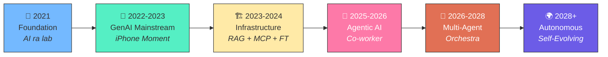
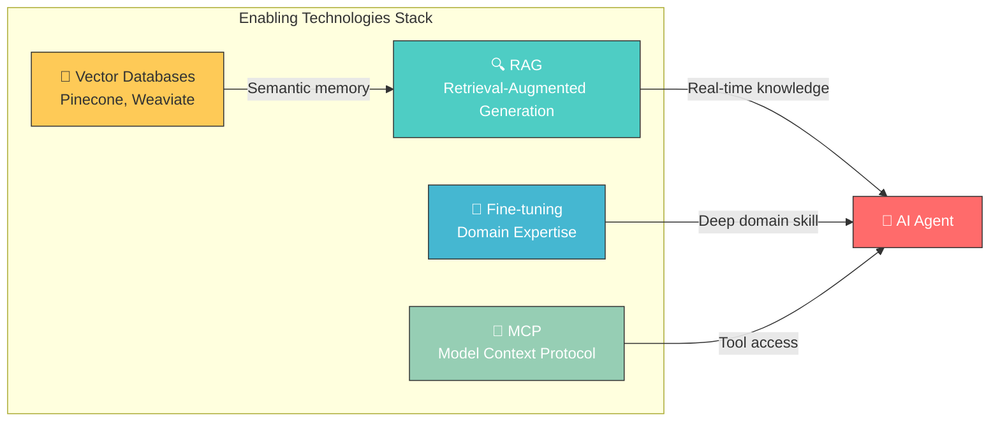
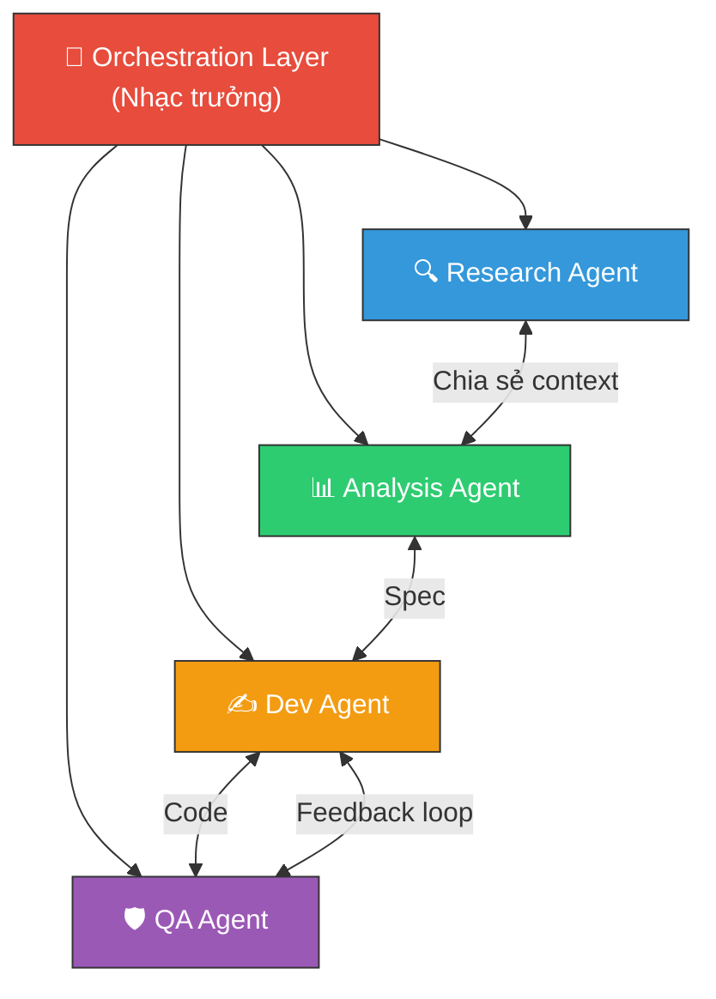

## 📋 Agenda

**Thời gian đọc ước tính:** ~10 phút

### Sau bài này, bạn sẽ:
- ✅ **Hiểu** được bức tranh toàn cảnh 5 giai đoạn tiến hóa của AI từ 2021 đến sau 2028.
- ✅ **Giải thích** được tại sao AI Coding Agent không phải một "era" riêng biệt mà chỉ là một mảnh ghép của Agentic AI.
- ✅ **Phân biệt** được vai trò của các công nghệ cốt lõi RAG, MCP, Fine-Tuning trong hệ sinh thái AI doanh nghiệp.
- ✅ **Khám phá** được 4 xu hướng tương lai "What's Next?" sau kỷ nguyên Agentic AI.

### Yêu cầu đầu vào (Prerequisites):
- 🔹 Biết sơ lược các khái niệm như RAG, Agent, Prompt Engineering.
- 🔹 Có quan tâm đến xu hướng công nghệ.

<!--truncate-->

---

## ❓ Tại sao chúng ta cần hiểu timeline này?

**Vấn đề (Problem Statement):**
- Ngành công nghệ quá nhiều "buzzwords": GenAI, RAG, MCP, Copilot, Agentic AI, Autonomous AI... khiến developer và leader dễ bị ngợp.
- Nhiều người (ví dụ bản thân người viết ban đầu) lầm tưởng AI Coding Agent (Cursor, Devin) là một "era" riêng biệt đại diện cho AI, dẫn đến cái nhìn bị lệch (bias) về toàn cục.

**Giải pháp (Solution):**
Bài viết này sẽ "giải phẫu" mental model về AI, mapping các xu hướng và công nghệ vào một timeline lịch sử 5 giai đoạn rõ ràng. Việc này giúp Developer biết mình đang ở đâu, cần học gì tiếp theo, và Tech Lead biết đâu là "Hype" (ảo vọng) đâu là "Reality" (thực tế).

---

## 📖 Bức Tranh Toàn Cảnh: Evolution Arc

Thay vì nhìn các công nghệ như những đợt sóng độc lập, hãy nhìn chúng theo **sự xếp chồng (stacking)**. Lớp công nghệ sau sẽ xây trên nền tảng lớp trước.

### Phase 1 & 2: Foundation & Mainstream (2021 - 2023)
> **Key concept:** Chuyển đổi từ AI chuyên nghiên cứu sang "iPhone Moment" với ChatGPT. Sự bùng nổ của **Prompt Engineering**.

| Era | Bài toán giải quyết | Bài toán để lại |
|:---|:---|:---|
| **Foundation (2021)** | AI có thể sáng tạo văn bản/hình ảnh không? ✅ | Khó dùng, chỉ dành cho dân kỹ thuật. |
| **GenAI (2022-2023)** | Đưa AI đến tay người dùng đại chúng (ChatGPT). ✅ | Bị ảo giác (Hallucination), không có data thời gian thực. |

---

## 🔨 Phase 3: Xây Dựng Hạ Tầng "Infrastructure" (2023-2024)

Khi doanh nghiệp thấy sức mạnh của GenAI, họ nhận ra: *LLM rất thông minh, nhưng nó chả biết công ty tôi đang làm gì*.

Đây không phải là thời của Agent, đây là lúc chúng ta đẻ ra các **công nghệ kết nối** (Enabling Technologies).

- **RAG & Vector DB:** Đảm nhiệm việc "mớm" data mới nhất / nội bộ vào cho LLM trước khi nó trả lời.
- **MCP (Model Context Protocol):** Sinh ra cuối 2024. Đóng vai trò như "cổng USB-C", cho phép AI gọi các tool bên ngoài thống nhất thay vì mỗi tool một kiểu API rối rắm.

⚠️ **Bài toán RAG/MCP giải quyết xong, vấn đề mới hiện ra:** "AI giờ đã có data, có đồ nghề, nhưng tại sao lúc nào nó cũng đợi tôi ra lệnh (prompt)?"

---

## 🚀 Phase 4: Agentic AI — Kỷ nguyên "Co-worker" (2025-2026)

Đây là thay đổi **Paradigm Shift** vĩ đại nhất:

| Tính chất | Generative AI (Cũ) | Agentic AI (Mới) |
|:---|:---|:---|
| **Vai trò** | "Armchair AI" — Viết text, sinh ảnh. | "Co-worker AI" — Thực thi công việc. |
| **Tương tác** | Single prompt → Single response | Vòng lặp: Perceive → Reason → Plan → Act |
| **Mục tiêu** | Bổ trợ con người sáng tạo. | Hoàn thành task phức tạp end-to-end. |

### Đâu là vị trí của AI Coding Agent?
Ban đầu, tôi từng nhầm tưởng AI Coding Agent (RAG, Cursor, Copilot Workspace) là một kỷ nguyên riêng. Thực chất, nó chỉ là một **Vertical Application** (ứng dụng ngành dọc) rất nổi tiếng của Agentic AI.

| Ngành dọc | Agentic App nổi bật |
|:---|:---|
| **Software Engineering** | Cursor, Devin, GitHub Workspace |
| **Customer Service** | Intercom Fin, Zendesk AI |
| **Finance/Trading** | Bloomberg GPT Autonomous Workflows |
| **SRE/DevOps** | PagerDuty AI (Tự fix lỗi hệ thống) |

---

## 🔮 Phase 5: Hướng tới Multi-Agent Orchestration (2026-2028)

Theo dự báo của Gartner và Microsoft, Agentic AI giải quyết tốt task độc lập. Còn task liên phòng ban (phức tạp) thì sao? Sẽ cần **Multi-Agent Ecosystem**.

### 3 Đặc Điểm Của Thời Đại Mới Này:

1. **Orchestrated Autonomy:** Không một Agent nào "ôm show". Có một lớp "Orchestration" giữa các Agent để giao việc, trao đổi dữ liệu.
2. **Physical AI:** Từ trong màn hình, AI bước ra robot (Embodied AI), dọn kho, phân loại hàng với tính năng "Predictive".
3. **Governed / Self-Evolving:** Governance không còn là option mà là core. Các hệ thống agentic có firewall chặn chúng không phá hoại database công ty.

---

## 💡 WHAT IF — Thực tế và Lời cảnh báo

Nếu mọi thứ nghe quá hoàn hảo, hãy nhìn lại cảnh báo từ Gartner (2026-2027):

> 🚨 **Dự báo:** Hơn 40% dự án Agentic AI doanh nghiệp sẽ bị **HỦY BỎ** trước cuối 2027.

Tại sao?

| ✅ Thực Tế Tốt | ❌ Bẫy hay gặp (Pitfalls) |
|:---|:---|
| AI có thể giải quyết các workflow có quy tắc tĩnh rõ ràng. | **Chi phí ngầm khổng lồ:** Việc Multi-agent tương tác (chat) qua lại ngốn token khủng khiếp. |
| Giúp dev tăng 40-50% hiệu suất qua các IDE agentic. | **Agent-washing:** Đừng tin mọi tool ghi chữ `Agentic`. Nhiều tool chỉ là Bot cũ khoác áo mới. Lợi ích kinh doanh không tương xứng. |
|  | **Thiếu Guardrails:** Cho một agent tự xử lý billings mà thiếu Identity Verification có thể dẫn đến hậu quả pháp lý. |

### Đúc kết 

Xu hướng vận động không phải là *thay thế* mà là *xếp chồng* (Stacking). GenAI không biến mất khi Agent có mặt — nó trở thành cục máy tính bên trong Agent. Agent không mất đi — nó tham gia vào hội nhóm Multi-Agent. Quan trọng nhất là chúng ta nắm đúng **Mental Model** để dồn lực học đúng lớp công nghệ.

> Hỏi nhanh: Ở hiện tại, nếu team dev của bạn build 1 internal tool, bạn sẽ làm 1 con Chatbot RAG (Phase 3) hay đóng gói thành 1 Agent (Phase 4)? Tại sao?

---

*Made by Anh Tu - Share to be shared*
