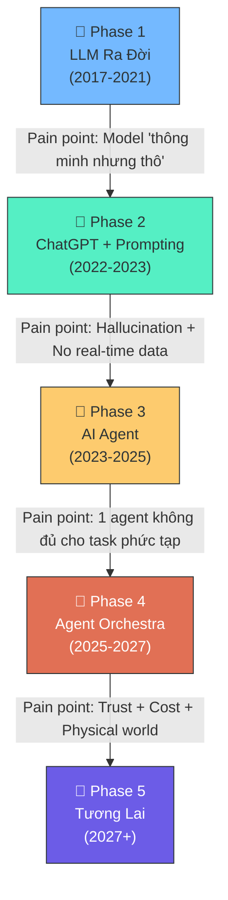
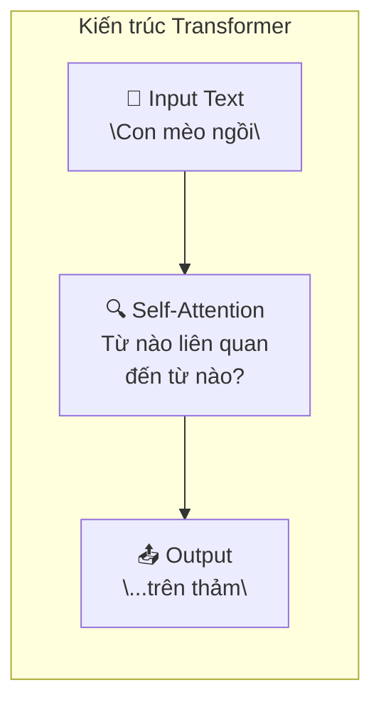
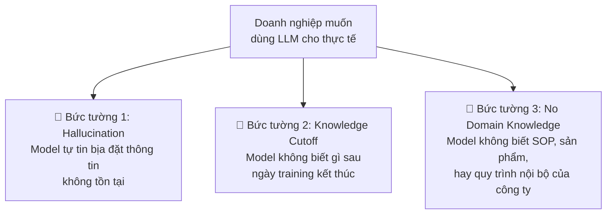
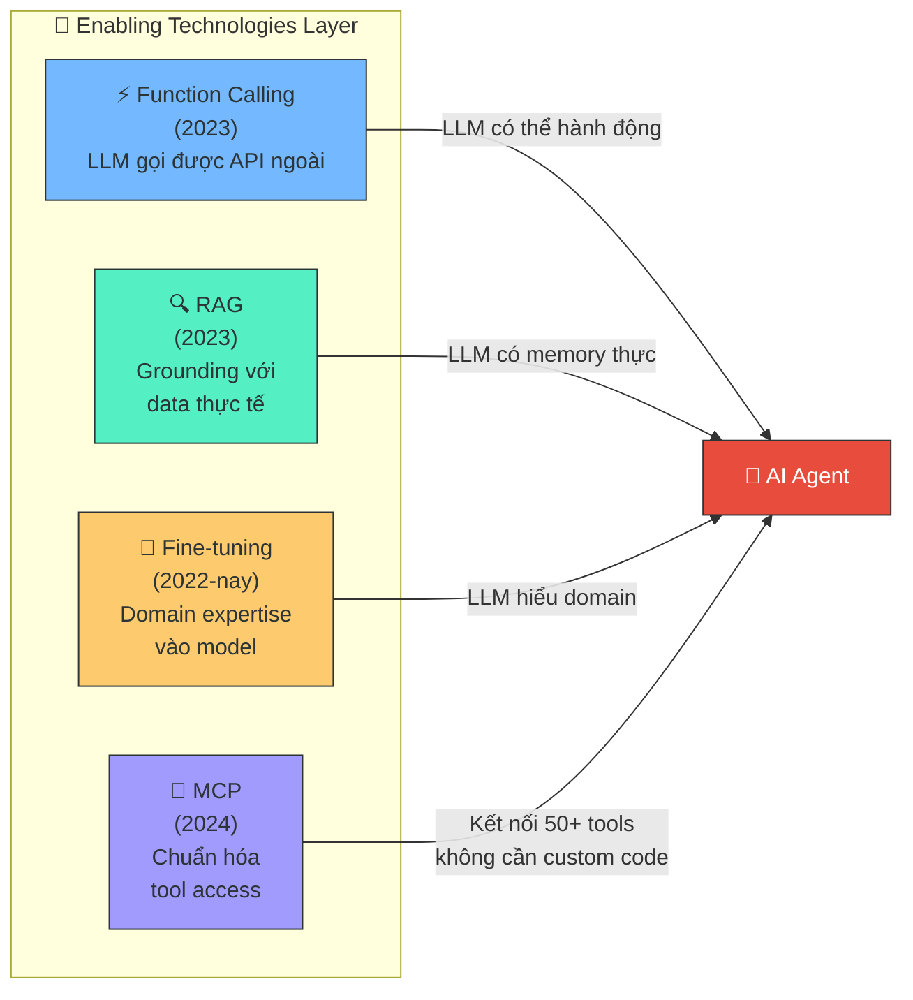
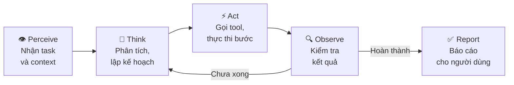
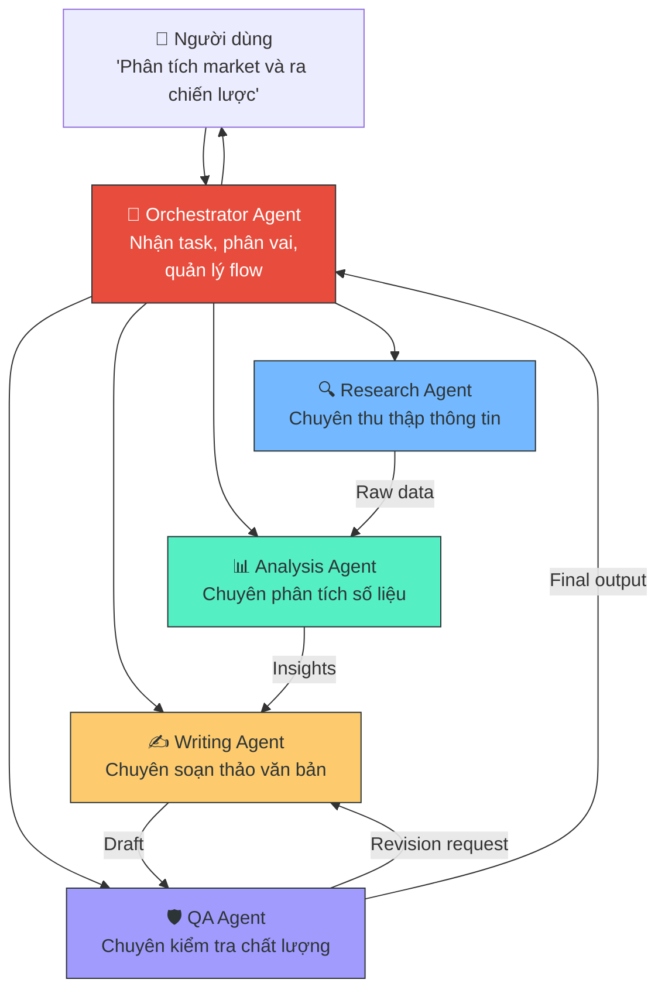
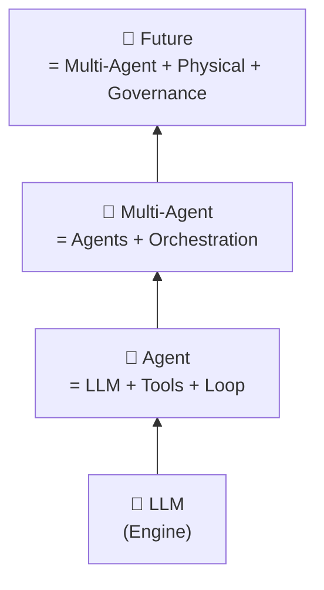

## 📋 Agenda

**Thời gian đọc ước tính:** ~12 phút

### Sau bài này, bạn sẽ:
- ✅ **Hiểu** được vì sao mỗi "làn sóng" AI ra đời — không phải vì hype, mà vì pain point thực sự.
- ✅ **Phân tích** được vai trò của RAG, MCP, Function Calling, Fine-tuning: chúng là **công cụ xuyên suốt**, không phải một "era" riêng biệt.
- ✅ **Tranh luận** được 3 kịch bản tương lai khác nhau của AI — không phải chỉ có 1 con đường tươi hồng.
- ✅ **Tự hỏi** được: "Team mình đang ở Phase nào? Cần chuẩn bị gì cho phase tiếp?"

### Prerequisites:
- 🔹 Biết sơ lược về LLM, Chatbot, và AI Coding tools.
- 🔹 Sẵn sàng bị đặt câu hỏi ngược lại 😄

<!--truncate-->

---

## ❓ Tại Sao Phải Hiểu Về Timeline AI?

**Vấn đề:**
- Công nghệ AI đang thay đổi quá nhanh: Tuần này MCP, tuần sau AI Agent, tháng sau Multi-Agent… Dev và Leader không biết đâu là hype và đâu là thực sự quan trọng.
- Khi không hiểu "vì sao" một công nghệ ra đời, chúng ta dễ học sai thứ, áp dụng sai chỗ, lãng phí nguồn lực.

**Chìa khóa để không bị lạc:**

> **Mỗi giai đoạn AI sinh ra là để giải quyết một pain point cụ thể của giai đoạn trước. Hiểu pain point = hiểu bản chất.**

Bài viết này sẽ đi theo đúng mạch tư duy đó — từ LLM đến tương lai.

---

## 📖 Bức Tranh Tổng Thể

Trước khi đi vào từng giai đoạn, hãy nhìn toàn cảnh. Đây không phải là những "era" tách biệt nhau — chúng là chuỗi nhân quả liên tục.



---

## 🧠 Phase 1: LLM Ra Đời — "Máy Tính Biết Nói"

### Bài toán cần giải quyết

Trước 2017, AI chỉ giỏi một việc cụ thể: nhận diện ảnh, dịch thuật, chơi cờ... Mỗi model được train riêng cho một task. Muốn làm 10 task = cần 10 model riêng biệt.

**Câu hỏi lớn đặt ra:** *Liệu có thể tạo ra một model "nền" đủ thông minh để học nhiều task khác nhau không?*

### Transformer và GPT — Câu trả lời là Có

Năm 2017, Google Brain công bố kiến trúc **Transformer** ("Attention Is All You Need"). Đây là nền tảng của mọi LLM hiện đại.



- **2020:** GPT-3 ra đời (175 tỷ tham số). Lần đầu tiên một model có thể viết văn, dịch, code... chỉ bằng cách đọc hàng nghìn tỷ từ từ internet.
- **Nhưng có một vấn đề nghiêm trọng:** GPT-3 khi được hỏi "Cách làm bom xăng?" sẽ vui vẻ trả lời. Nó thông minh nhưng không có **giá trị quan** (values). Nó không biết cái gì nên nói và cái gì không.

### 📌 Pain Point — Cầu Nối Sang Phase 2

> ⚠️ **GPT-3 thô và nguy hiểm.** Model có thể viết bất kỳ thứ gì — kể cả nội dung độc hại, sai lệch. Đồng thời, interface vẫn là API kỹ thuật, người thường không thể tiếp cận.

**Giải pháp được sinh ra:** **RLHF (Reinforcement Learning from Human Feedback)** — kỹ thuật "thuần hóa" model bằng cách cho người đánh giá phản hồi tốt/xấu, rồi model tự học qua đó. RLHF là mảnh ghép còn thiếu để biến GPT-3 thành ChatGPT.

---

## 💬 Phase 2: ChatGPT & Prompt Engineering — "AI Cho Mọi Người"

### Bài toán cần giải quyết

RLHF đã thuần hóa được model. Nhưng câu hỏi tiếp theo là: *Làm sao để người dùng thường giao tiếp với một thứ vốn chỉ dành cho researcher?*

### Tháng 11/2022 — "iPhone Moment" của AI

ChatGPT ra mắt với giao diện chat đơn giản. Trong **2 tháng**, 100 triệu người dùng đăng ký — kỷ lục tăng trưởng nhanh nhất lịch sử phần mềm.

Cùng với đó, cộng đồng developer khám phá ra: *cách bạn hỏi ảnh hưởng cực kỳ lớn đến chất lượng câu trả lời*. **Prompt Engineering** ra đời.

| Kỹ thuật | Mô tả | Khi nào dùng |
|:---|:---|:---|
| **Zero-shot** | Hỏi thẳng, không cho ví dụ | Task đơn giản, rõ ràng |
| **Few-shot** | Cho 2-3 ví dụ trước khi hỏi | Muốn format output cụ thể |
| **Chain-of-Thought (CoT)** | "Hãy suy nghĩ từng bước" | Toán học, logic phức tạp |
| **Role Prompting** | "Bạn là senior dev với 10 năm kinh nghiệm..." | Cần tone/expertise cụ thể |

### 📌 Pain Point — Cầu Nối Sang Phase 3

Doanh nghiệp bắt đầu muốn dùng ChatGPT cho công việc thực tế. Và họ va ngay vào **3 bức tường**:



> ⚠️ **Vấn đề cốt lõi:** LLM là một "bộ não khổng lồ nhưng bị cô lập". Nó không thể tự tìm kiếm thêm thông tin. Nó không thể gọi API. Nó không có tác vụ — chỉ có phản hồi. Và đây là lúc các **Enabling Technologies** ra đời.

---

## 🤖 Phase 3: AI Agent — "Từ Phản Ứng Đến Hành Động"

### Enabling Technologies: Không Phải 1 Phase, Mà Là Layer Xuyên Suốt

> **Lưu ý quan trọng:** RAG, Function Calling, MCP, Fine-tuning không phải là "một giai đoạn riêng" — chúng là **lớp công cụ (tool layer)** được xây dựng liên tục để enable cho mỗi phase tiếp theo. Dưới đây là câu chuyện của từng công cụ.



**Câu chuyện của từng công cụ:**

- **Function Calling (OpenAI, 11/2023):** Lần đầu tiên LLM có thể *"gọi"* một hàm bên ngoài như `searchGoogle()`, `sendEmail()`, `queryDatabase()`. Đây là bước ngoặt — model hết bị giam trong "hộp text".

- **RAG (Retrieval-Augmented Generation):** Giải bài toán Hallucination + Knowledge Cutoff. Trước khi trả lời, model sẽ *tìm kiếm* tài liệu liên quan từ Vector DB, rồi dùng tài liệu đó như context. Kết quả: ít bịa, nhiều thật hơn.

- **Fine-tuning:** Nhúng domain knowledge sâu vào weights của model. Dùng khi cần model "thấm nhuần" style, quy tắc, terminology của một công ty/ngành cụ thể — thay vì chỉ "mớm" thông tin qua RAG mỗi lần.

- **MCP — Model Context Protocol (Anthropic, 11/2024):** Giải bài toán "N Agent × M Tools = N×M integrations thủ công". MCP đóng vai trò như **USB-C** — một chuẩn kết nối thống nhất. Agent nào cũng nói chuyện với tool nào qua cùng 1 giao thức.

### Bài Toán Cần Giải Quyết: Thoát Khỏi "Reactive Mode"

Khi đã có đủ tools, câu hỏi mới xuất hiện:

*"AI giờ có data, có đồ nghề — nhưng tại sao lúc nào cũng phải ngồi đợi tôi ra lệnh từng bước?"*

**AI Agent** là câu trả lời: Thay vì nhận 1 prompt → trả 1 response, Agent vận hành theo **vòng lặp tự chủ**:



**Ví dụ thực tế — Cursor (AI Coding Agent):**
1. *Perceive:* Nhận yêu cầu "Fix bug trong file auth.ts"
2. *Think:* "Tôi cần đọc file auth.ts, hiểu lỗi, tìm pattern đúng"
3. *Act:* Gọi `read_file("auth.ts")` → `search_codebase("auth pattern")` → `edit_file(...)`
4. *Observe:* Chạy test → test fail → quay lại Think
5. *Report:* "Đã fix, dưới đây là explanation"

### 📌 Pain Point — Cầu Nối Sang Phase 4

Một con Agent giỏi trong domain của nó. Nhưng task thực tế của doanh nghiệp phức tạp hơn nhiều:

> "Hãy phân tích dữ liệu sales Q1, viết báo cáo chiến lược, tạo slide thuyết trình, gửi email cho ban lãnh đạo và tự lên lịch meeting tiếp theo."

Một Agent "biết tuốt" sẽ mediocre ở tất cả. Cần có **sự phân công chuyên môn**.

---

## 🎼 Phase 4: Agent Orchestra — "Dàn Nhạc Giao Hưởng"

### Bài Toán Cần Giải Quyết

Giống như trong một dàn nhạc — không ai mong chờ một người vừa đánh violin vừa thổi kèn. Mỗi nhạc sĩ chuyên biệt một nhạc cụ. Và cần một *nhạc trưởng* để phối hợp.

**Multi-Agent System** áp dụng tư duy đó vào AI:



### 3 Thay Đổi Lớn Của Thời Đại Này

**1. Từ "Solo" sang "Synergy":** Mỗi agent chỉ làm 1 việc nhưng làm cực tốt. Không agent nào ôm hết.

**2. Shared Memory & Context:** Các agent cần có "ký ức chung" để không làm lại công việc nhau đã làm. Đây là bài toán kỹ thuật phức tạp nhất của Multi-Agent.

**3. Governed Autonomy — Tự chủ Có Giám Sát:** Với quyền lực lớn hơn (nhiều agent, nhiều tool, nhiều action) đến trách nhiệm lớn hơn. Governance không còn là "add-on" — nó phải được build-in vào kiến trúc.

### 📌 Pain Point — Cầu Nối Sang Phase 5

```
❓ Ai chịu trách nhiệm khi một agent trong chuỗi làm sai?
❓ Chi phí LLM call nhân lên khi nhiều agent chat qua lại → tốn kém khổng lồ.
❓ Tất cả vẫn đang sống trong màn hình máy tính — còn thế giới vật lý thì sao?
```

---

## 🔮 Phase 5: Tương Lai — 3 Kịch Bản Đang Tranh Luận

Không ai biết chắc tương lai sẽ ra sao. Nhưng ngành đang nghiêng về **3 hướng khác nhau**, không hướng nào là chắc chắn.

### Kịch Bản A: Continuum Path — "Đường Thẳng Tiến Lên"

*Gartner, Microsoft, OpenAI đang vẽ lộ trình này.*

```
Multi-Agent → Physical AI (Robot) → Self-Evolving AI → AGI
```

- **Physical AI (2026-2028):** AI bước ra khỏi màn hình, vào robot trong kho hàng, nhà máy, bệnh viện. NVIDIA gọi 2026 là "Dawn of Physical AI". Humanoid robots (Figure, Tesla Optimus) bắt đầu pilot.
- **Self-Evolving AI:** Agent không chỉ thực thi kế hoạch của người dùng — nó tự **viết lại chiến lược** khi điều kiện thay đổi. Không cần retrain.
- **AGI:** Trí tuệ nhân tạo tổng quát — có thể học và làm bất kỳ task nào mà con người làm được.

⚠️ **Rủi ro của kịch bản này:** Optimistic linear thinking. Thực tế là Gartner cũng dự báo **>40% dự án Agentic AI doanh nghiệp sẽ bị hủy trước 2027** vì chi phí và thiếu business value thực sự.

---

### Kịch Bản B: Bifurcation Path — "Chia Làm Hai Nhánh"

*Xu hướng đang mạnh lên ở 2025-2026, chưa được chú ý đủ.*

Thay vì một con đường, AI phân nhánh thành **hai thị trường hoàn toàn khác nhau**:

| | Nhánh "Thu Nhỏ" | Nhánh "Phình To" |
|:---|:---|:---|
| **Model Size** | SLM (Small Language Model) | Frontier Models (GPT-5, Gemini Ultra...) |
| **Nơi chạy** | On-device (phone, laptop) | Cloud datacenter |
| **Ưu điểm** | Privacy-first, offline, rẻ | Khả năng suy luận sâu, đa modal |
| **Ví dụ** | Apple Intelligence, Phi-3-mini | GPT-4o, Claude Sonnet |
| **Phục vụ ai** | Người dùng cá nhân, SME | Enterprise, Research |

> **Insight quan trọng:** Nhánh "Thu Nhỏ" đang **âm thầm phát triển** nhanh và có thể disrupt Agentic AI cloud-heavy vì chi phí và privacy. Developer Việt Nam nên chú ý Phi-3, Gemma, Llama 3 — các SLM có thể run local.

---

### Kịch Bản C: Regulatory Disruption — "Bị Chặn Bởi Luật"

*Kịch bản ít được bàn nhưng có xác suất xảy ra không nhỏ.*

- **EU AI Act** đã có hiệu lực (2024). Yêu cầu transparency, human oversight, audit trail cho mọi "high-risk AI system".
- Một **"AI accident" quy mô lớn** (ví dụ: Autonomous Agent gây thiệt hại tài chính nghiêm trọng cho hàng nghìn người) có thể kích hoạt moratorium (đình chỉ phát triển) như cách FDA regulate dược phẩm sau thảm họa.
- Kịch bản này không có nghĩa AI sẽ chết — nhưng tốc độ sẽ chậm lại đáng kể, và compliance sẽ trở thành engineering skill quan trọng ngang với system design.

---

## 💡 Đúc Kết: Mental Model Cho Developer

### Nguyên Tắc Cốt Lõi

> **Xu hướng vận động của AI không phải "thay thế" mà là "xếp chồng" (Stacking).** LLM không biến mất khi Agent ra đời — nó là engine bên trong Agent. Agent không biến mất khi Multi-Agent đến — nó là thành viên trong dàn nhạc.



### Câu Hỏi Để Tự Định Vị

| Câu hỏi | Trả lời → Bạn ở Phase... |
|:---|:---|
| Team đang dùng ChatGPT/Copilot để tăng tốc workflow? | Phase 2 (Prompting) |
| Đã build RAG chatbot với dữ liệu nội bộ? | Phase 3 (Tools) |
| Đang build agent tự động hóa một quy trình cụ thể? | Phase 3→4 (Agent) |
| Nghĩ đến việc nhiều agent phối hợp với nhau? | Phase 4 (Orchestra) |

> 🤔 **Câu hỏi thảo luận:** Nếu hôm nay bạn được giao build một "AI assistant cho phòng HR" — bạn sẽ làm RAG chatbot (Phase 3) hay Autonomous HR Agent (Phase 4)? Hai lựa chọn này khác nhau ở đâu về kỹ thuật AND về rủi ro kinh doanh?

---

*Made by Anh Tu - Share to be shared*
