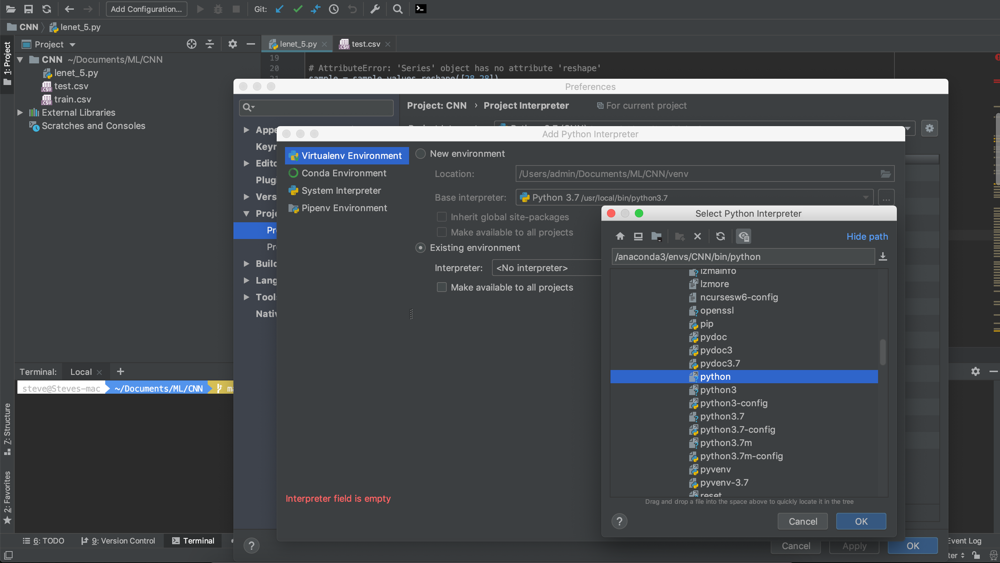

### Anaconda common command  
1. conda env list : lists all environments
2. source activate `env name` : activate an environment
3. source deactivate: deactivate an environment
4. conda list : list all packages installed
5. conda create --name `env name` python=3 astroid babel : create new environment, specify version of python, and install packages
6. WINDOWS NOTE: SOURCE is not recognized. When deactivating and activating in the anaconda command prompt, skip 'source' and just type 'deactivate' or 'activate' depending on what you are trying to do.
7. conda env export > environment.yml: export conda environment requirements list to a file

### Apply anaconda env into PyCharm
* Mỗi một dự án đều cần được bọc bởi interpreter để lấy các thư viện ra và sử dụng
từ trong interpreter đó. Nhiệm vụ bây là thay đổi interpreter măc định (môi trường
máy tính global).
##### Bước 1: tạo interpreter bằng anaconda 
* Có thể tạo interpreter environment bằng `conda create --name <env name>` hoặc
tạo bằng GUI của pyCharm
##### Bước 2: Adđ interpreter vào Project interpreter 
a. Project interpreter => Add interpreter => Existing Environment
b. Pick anaconda3/envs/`interpreter name`/bin/python => Apply

 
