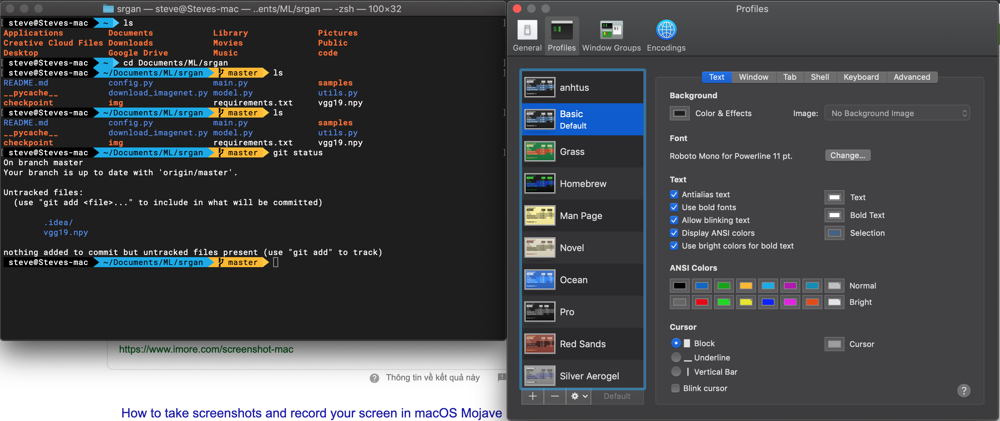

 ### Step 1: Install ZSH
- ZSH (Z Shell) là một Unix shell cái mà được build on top của bash (shell mặc định của mac)
và thêm một số tính năng khác
```
brew install zsh
``` 

 ### Step 2: Install Oh My Zsh
- Oh my Zsh là một framework cho việc quản lí cấu hình zsh. Ở đấy có thể tuỳ chỉnh rất nhiều 
thứ trong đó có theme của terminal

```
sh -c "$(curl -fsSL https://raw.githubusercontent.com/robbyrussell/oh-my-zsh/master/tools/install.sh)"
```

 ### Step 3: Install Powerline fonts
- Là một bộ font được hỗ trợ các kí tự đặc biệt cho terminal

```
git clone https://github.com/powerline/fonts.git --depth=1
cd fonts
./install.sh
cd ..
rm -rf fonts
```

 ### Step 4: Change theme and font 

Change theme: mở terminal ở thư mục ~ 
```
vim .zshrc
```
Search từ khoá ZSH_THEME="theme name", thay thế bằng ZSH_THEME="default"

```
ZSH_THEME="agnoster"
```
Lưu ý:
   - Lúc này khi reset terminal theme đã được apply nhưng mà lỗi font :( 
   - Có thể thay rất nhiều theme khác nhau, các theme này đã dược define mặc định trong khi 
cài Oh my 

Change font and color of font
Open terminal lên > Terminal > Preference > Profile > Font > Change : chọn Rotobo Mono for Powerline 
Thay đổi màu từ mặc định cho hợp với style và cá tính của bạn trong Profile > ANSI color

Thế là done rồi :)

