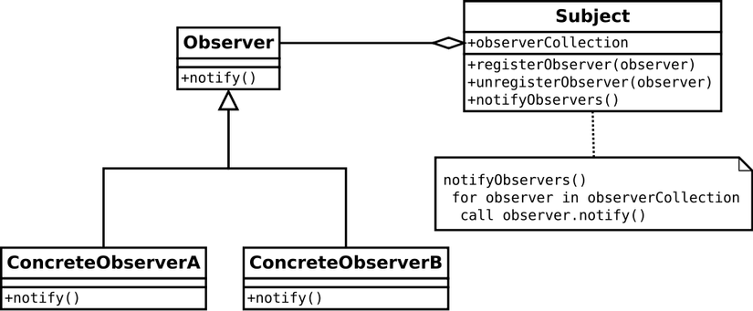

### Introduction Observation state management solution:
* Lấy cảm hứng từ ý tưởng `Observer pattern` cùng việc học hỏi theo một trainer(FOZG) của mình tại FPT
đã viết một công cụ có thể làm việc như là một thư viện quản lí trạng thái.
* Trong dự án tôi sử dụng 2 pattern chính là `Observer Pattern` và `Singleton Pattern`, trong một bài viết khác
mình sẽ đề cấp đến một số pattern được sử dụng rất nhiều trong các dự án Javascript

#### Observer Pattern:

* Như được biểu diễn trong sơ đồ UML, các đối tượng cần thiết là subject, observer và các đối tượng cụ thể.
 Subject có chứa tham chiếu đến các observers cụ thể để thông báo cho bất kỳ thay đổi.
 Đối tượng Observer là một lớp trừu tượng cho phép các observers cụ thể thực hiện phương thức thông báo
 
```javascript
let Subject = function() {
  // Một stack các observers subscribe Subject
  this.observers = [];

  return {
    subscribeObserver: function(observer) {
      this.observers.push(observer);
    },
    unsubscribeObserver: function(observer) {
      let index = this.observers.indexOf(observer);
      if(index > -1) {
        this.observers.splice(index, 1);
      }
    },
    notifyObserver: function(observer) {
      let index = this.observers.indexOf(observer);
      if(index > -1) {
        this.observers[index].notify(index);
      }
    },
    notifyAllObservers: function() {
      for(let i = 0; i < this.observers.length; i++){
        this.observers[i].notify(i);
      };
    }
  };
};

let Observer = function() {
  return {
    notify: function(index) {
      console.log("Observer " + index + " is notified!");
    }
  }
}

let subject = new Subject();

let observer1 = new Observer();
let observer2 = new Observer();
let observer3 = new Observer();
let observer4 = new Observer();

subject.subscribeObserver(observer1);
subject.subscribeObserver(observer2);
subject.subscribeObserver(observer3);
subject.subscribeObserver(observer4);

subject.notifyObserver(observer2); // Observer 2 is notified!

subject.notifyAllObservers();
// Observer 1 is notified!
// Observer 2 is notified!
// Observer 3 is notified!
// Observer 4 is notified!
```

* Tư tưởng chính: ta xây dựng một nơi quản lí state tập trung của cả dự án gọi là `Store`,
tại đây dự liệu sẽ được cập nhật => báo cho các `component` `subscribe` `Store` biết là đã có sự thay đổi
store và hãy render lại đi (đã có dữ liệu mới rồi)

* Implement thế nào? 
Từ ý tưởng và khi implement là cả môt sự khác biết rất lớn:
1. Đầu tiên là vấn đề `Store` (Ở đây là ứng với Subject): Nơi lưu trữ dữ liệu, subscribe component và update dữ liệu
Nhưng mà vấn đề ở chỗ là không thể cứ component nào cũng tạo ra một Store được vì như thế còn gì là 
quản lí tập trung nữa. Điều này làm ta phải nghĩ ngay đến Singleton Pattern :)))) 
Khó càng thêm khó => Lại thêm một pattern nữa mình băn khoăn (Xem định nghĩa ở dưới nhé)
Có thể hiểu là mình cần phải tạo một object (đóng vai trò như là Singleton), tạo một lần 
dùng mãi mãi :))))
Tạm thời tắc tịt ở đây !!!

2. Bây là vấn đề Observer: Cái gì là đóng vai trò thông báo cho component biết khi nào cần phải render
lại ???. Câu trả lời là: hàm setState của HOC chứa component => Vì khi hàm setState này được
trigger thì component subscribe (HOC) sẽ được render lại => Component chính được render lại
 
3. Ngon rồi, đã clear hơn một chút về phần subscribe và render lại => Tuy nhiên vấn đề 1
thì còn nan giải. Vậy là cần phải tạo một `instance` của `Store` tổng để import vào HOC => Một cách
để tạo ra Singleton.

Nhưng mình đang cần phải tạo ra nhiều Store để phục vụ các ứng dựng rỉêng => Giống redux nên thay vì tạo 
singleton là Store ta sẽ tạo `singleton` là các Observation chứ hàm connect HOC với component 

Chi tiết code xem tại đây: https://github.com/vuanhtu1993/observation-state
 
#### Singleton Pattern 
