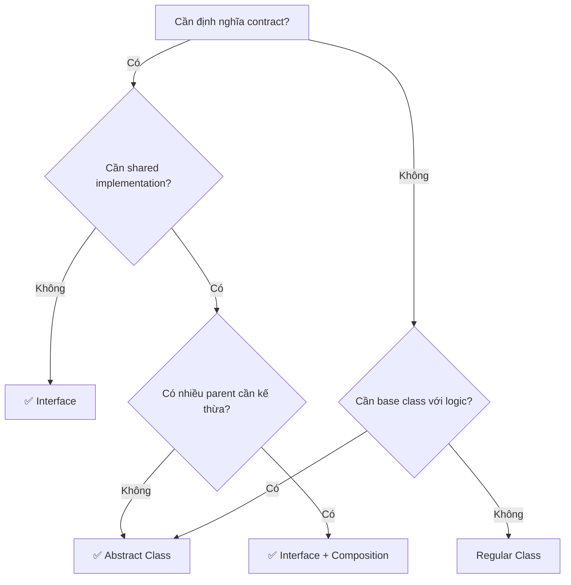

# 📐 OOP trong NestJS (Phần 3): Interface vs Abstract Class

> 🎯 **Mục tiêu**: Phân biệt rõ ràng Interface và Abstract Class, áp dụng vào `UserService` với Repository Pattern.

<!--truncate-->

---

## 📌 Recap từ Phần 1 & 2

- **Phần 1**: Chuyển từ functions sang `UserService` class
- **Phần 2**: Thêm encapsulation và decorators

**Vấn đề hiện tại**: `UserService` đang lưu data trong `Map`. Nếu muốn đổi sang Database?

```typescript
// Hiện tại - Hardcoded Map
@Injectable()
export class UserService {
  private readonly users = new Map<string, User>();  // ← Muốn đổi sang PostgreSQL?
  
  async create(dto: CreateUserDto): Promise<UserResponse> {
    this.users.set(email, user);  // ← Phải sửa toàn bộ code!
  }
}
```

**Giải pháp**: **Interface** và **Abstract Class** cho phép tách biệt "hợp đồng" khỏi "implementation".

---

## 1. INTERFACE - HỢP ĐỒNG COMPILE-TIME

### 1.1 Interface là gì?

```typescript
// Interface = "Hợp đồng" - nói rằng object PHẢI có những gì
interface IUserRepository {
  create(user: User): Promise<User>;
  findByEmail(email: string): Promise<User | null>;
  findById(id: string): Promise<User | null>;
  update(id: string, data: Partial<User>): Promise<User>;
  delete(id: string): Promise<void>;
}
```

**Đặc điểm:**
- ❌ Không có implementation (methods body)
- ❌ Không tồn tại ở runtime (TypeScript only)
- ✅ Type checking mạnh
- ✅ Có thể implement nhiều interfaces

### 1.2 Implementing Interface

```typescript
// Implementation 1: In-Memory
class InMemoryUserRepository implements IUserRepository {
  private users = new Map<string, User>();

  async create(user: User): Promise<User> {
    this.users.set(user.id, user);
    return user;
  }

  async findByEmail(email: string): Promise<User | null> {
    return [...this.users.values()].find(u => u.email === email) || null;
  }

  async findById(id: string): Promise<User | null> {
    return this.users.get(id) || null;
  }

  async update(id: string, data: Partial<User>): Promise<User> {
    const user = this.users.get(id);
    if (!user) throw new Error('User not found');
    const updated = { ...user, ...data };
    this.users.set(id, updated);
    return updated;
  }

  async delete(id: string): Promise<void> {
    this.users.delete(id);
  }
}

// Implementation 2: PostgreSQL
class PostgresUserRepository implements IUserRepository {
  constructor(private db: Pool) {}

  async create(user: User): Promise<User> {
    const result = await this.db.query(
      'INSERT INTO users (id, email, name) VALUES ($1, $2, $3) RETURNING *',
      [user.id, user.email, user.name]
    );
    return result.rows[0];
  }

  async findByEmail(email: string): Promise<User | null> {
    const result = await this.db.query(
      'SELECT * FROM users WHERE email = $1',
      [email]
    );
    return result.rows[0] || null;
  }

  // ... other methods
}
```

### 1.3 Interface Biến Mất Ở Runtime!

```typescript
// TypeScript code
interface ILogger {
  log(message: string): void;
}

class ConsoleLogger implements ILogger {
  log(message: string) {
    console.log(message);
  }
}

// Compiled JavaScript - Interface không còn!
class ConsoleLogger {
  log(message) {
    console.log(message);
  }
}
```

> ⚠️ **Quan trọng**: Vì interface không tồn tại ở runtime, NestJS DI cần cách khác để inject. Chúng ta sẽ thấy ở Phần 4.

---

## 2. ABSTRACT CLASS - MẪU VỚI LOGIC CƠ BẢN

### 2.1 Abstract Class là gì?

```typescript
// Abstract class = "Mẫu" - có thể có implementation sẵn
abstract class BaseRepository<T> {
  // Abstract methods - BẮT BUỘC subclass implement
  abstract create(entity: T): Promise<T>;
  abstract findById(id: string): Promise<T | null>;
  abstract update(id: string, data: Partial<T>): Promise<T>;
  abstract delete(id: string): Promise<void>;

  // Concrete methods - Có sẵn implementation
  protected generateId(): string {
    return `${Date.now()}_${Math.random().toString(36).substr(2, 9)}`;
  }

  protected logOperation(operation: string, id: string): void {
    console.log(`[${this.constructor.name}] ${operation}: ${id}`);
  }
}
```

**Đặc điểm:**
- ✅ Có thể có implementation sẵn
- ✅ Tồn tại ở runtime
- ✅ Có thể có constructor
- ❌ Chỉ extend được 1 class

### 2.2 Extending Abstract Class

```typescript
// UserRepository extends BaseRepository
class UserRepository extends BaseRepository<User> {
  private users = new Map<string, User>();

  async create(user: User): Promise<User> {
    // Dùng method từ abstract class
    const id = this.generateId();
    const newUser = { ...user, id };
    this.users.set(id, newUser);
    this.logOperation('CREATE', id);  // Từ BaseRepository
    return newUser;
  }

  async findById(id: string): Promise<User | null> {
    this.logOperation('FIND', id);
    return this.users.get(id) || null;
  }

  async update(id: string, data: Partial<User>): Promise<User> {
    const user = this.users.get(id);
    if (!user) throw new Error('User not found');
    const updated = { ...user, ...data };
    this.users.set(id, updated);
    this.logOperation('UPDATE', id);
    return updated;
  }

  async delete(id: string): Promise<void> {
    this.users.delete(id);
    this.logOperation('DELETE', id);
  }

  // Thêm method riêng cho UserRepository
  async findByEmail(email: string): Promise<User | null> {
    return [...this.users.values()].find(u => u.email === email) || null;
  }
}
```

---

## 3. SO SÁNH CHI TIẾT

### 3.1 Bảng So Sánh

| Đặc điểm | Interface | Abstract Class |
|----------|-----------|----------------|
| **Implementation** | ❌ Không có | ✅ Có thể có |
| **Runtime existence** | ❌ Không | ✅ Có |
| **Multiple inheritance** | ✅ Nhiều interfaces | ❌ 1 class |
| **Constructor** | ❌ Không | ✅ Có |
| **Properties** | Type only | Có giá trị |
| **DI trong NestJS** | Cần token | Trực tiếp |

### 3.2 Ví dụ Kết Hợp

```typescript
// Interface cho CONTRACT
interface IRepository<T> {
  create(entity: T): Promise<T>;
  findById(id: string): Promise<T | null>;
  update(id: string, data: Partial<T>): Promise<T>;
  delete(id: string): Promise<void>;
}

// Interface riêng cho User operations
interface IUserRepository extends IRepository<User> {
  findByEmail(email: string): Promise<User | null>;
  validatePassword(email: string, password: string): Promise<boolean>;
}

// Abstract class cho SHARED LOGIC
abstract class BaseRepository<T> implements IRepository<T> {
  protected abstract tableName: string;

  constructor(protected db: DatabaseConnection) {}

  async create(entity: T): Promise<T> {
    return this.db.insert(this.tableName, entity);
  }

  async findById(id: string): Promise<T | null> {
    return this.db.findOne(this.tableName, { id });
  }

  async update(id: string, data: Partial<T>): Promise<T> {
    return this.db.update(this.tableName, id, data);
  }

  async delete(id: string): Promise<void> {
    await this.db.delete(this.tableName, id);
  }
}

// Concrete class KẾT HỢP cả hai
class UserRepository extends BaseRepository<User> implements IUserRepository {
  protected tableName = 'users';

  async findByEmail(email: string): Promise<User | null> {
    return this.db.findOne(this.tableName, { email });
  }

  async validatePassword(email: string, password: string): Promise<boolean> {
    const user = await this.findByEmail(email);
    if (!user) return false;
    return bcrypt.compare(password, user.password);
  }
}
```

---

## 4. DECISION TREE - KHI NÀO DÙNG GÌ?



### 4.1 Dùng Interface khi:

```typescript
// 1. Chỉ cần type contract, không cần logic
interface ILogger {
  log(message: string): void;
  error(message: string): void;
}

// 2. Cần implement nhiều contracts
interface ISerializable {
  toJSON(): string;
}

interface IComparable<T> {
  compareTo(other: T): number;
}

class User implements ISerializable, IComparable<User> {
  toJSON(): string { return JSON.stringify(this); }
  compareTo(other: User): number { return this.id.localeCompare(other.id); }
}
```

### 4.2 Dùng Abstract Class khi:

```typescript
// 1. Có shared implementation
abstract class BaseController {
  protected formatResponse<T>(data: T): ApiResponse<T> {
    return { success: true, data, timestamp: new Date() };
  }

  protected formatError(message: string): ApiResponse<null> {
    return { success: false, data: null, error: message, timestamp: new Date() };
  }
}

// 2. Cần constructor để setup
abstract class ConfigurableService {
  constructor(protected config: ServiceConfig) {
    this.validateConfig();
  }

  private validateConfig(): void {
    if (!this.config.apiKey) throw new Error('API key required');
  }

  abstract execute(): Promise<void>;
}
```

---

## 5. REFACTOR USERSERVICE VỚI REPOSITORY

### 5.1 Định nghĩa Interface

```typescript
// interfaces/user-repository.interface.ts
export interface IUserRepository {
  create(user: CreateUserData): Promise<User>;
  findByEmail(email: string): Promise<User | null>;
  findById(id: string): Promise<User | null>;
  update(id: string, data: Partial<User>): Promise<User>;
  delete(id: string): Promise<void>;
}

// Types
export interface CreateUserData {
  email: string;
  password: string;
  name: string;
}

export interface User {
  id: string;
  email: string;
  password: string;
  name: string;
  createdAt: Date;
}
```

### 5.2 Abstract Base Repository

```typescript
// repositories/base.repository.ts
export abstract class BaseRepository<T> {
  protected abstract entityName: string;

  protected generateId(): string {
    return `${this.entityName}_${Date.now()}_${Math.random().toString(36).substr(2, 9)}`;
  }

  protected log(operation: string, details?: any): void {
    console.log(`[${this.entityName}Repository] ${operation}`, details || '');
  }
}
```

### 5.3 In-Memory Implementation

```typescript
// repositories/in-memory-user.repository.ts
import { Injectable } from '@nestjs/common';

@Injectable()
export class InMemoryUserRepository 
  extends BaseRepository<User> 
  implements IUserRepository {
  
  protected entityName = 'User';
  private users = new Map<string, User>();

  async create(data: CreateUserData): Promise<User> {
    const user: User = {
      id: this.generateId(),
      ...data,
      createdAt: new Date()
    };
    this.users.set(user.id, user);
    this.log('CREATE', { id: user.id, email: user.email });
    return user;
  }

  async findByEmail(email: string): Promise<User | null> {
    const user = [...this.users.values()].find(u => u.email === email);
    this.log('FIND_BY_EMAIL', { email, found: !!user });
    return user || null;
  }

  async findById(id: string): Promise<User | null> {
    const user = this.users.get(id);
    this.log('FIND_BY_ID', { id, found: !!user });
    return user || null;
  }

  async update(id: string, data: Partial<User>): Promise<User> {
    const user = this.users.get(id);
    if (!user) throw new NotFoundException('User not found');
    
    const updated = { ...user, ...data };
    this.users.set(id, updated);
    this.log('UPDATE', { id });
    return updated;
  }

  async delete(id: string): Promise<void> {
    const deleted = this.users.delete(id);
    this.log('DELETE', { id, success: deleted });
  }
}
```

### 5.4 Refactored UserService

```typescript
// user.service.ts - Sử dụng Repository
import { Injectable, ConflictException } from '@nestjs/common';
import * as bcrypt from 'bcrypt';

@Injectable()
export class UserService {
  private readonly SALT_ROUNDS = 10;

  constructor(
    // Inject bằng interface (cần token - xem Phần 4)
    private readonly userRepository: IUserRepository
  ) {}

  async create(dto: CreateUserDto): Promise<UserResponse> {
    // Check duplicate
    const existing = await this.userRepository.findByEmail(dto.email);
    if (existing) {
      throw new ConflictException('Email already exists');
    }

    // Hash password
    const hashedPassword = await bcrypt.hash(dto.password, this.SALT_ROUNDS);

    // Create user via repository
    const user = await this.userRepository.create({
      email: dto.email,
      password: hashedPassword,
      name: dto.name
    });

    return this.toPublicUser(user);
  }

  async findByEmail(email: string): Promise<User | null> {
    return this.userRepository.findByEmail(email);
  }

  async validatePassword(email: string, password: string): Promise<boolean> {
    const user = await this.userRepository.findByEmail(email);
    if (!user) return false;
    return bcrypt.compare(password, user.password);
  }

  private toPublicUser(user: User): UserResponse {
    const { password, ...publicUser } = user;
    return publicUser;
  }
}
```

### 5.5 Lợi ích của Refactor

```typescript
// Giờ đây chuyển sang PostgreSQL rất dễ:

// 1. Tạo implementation mới
@Injectable()
class PostgresUserRepository 
  extends BaseRepository<User> 
  implements IUserRepository {
  
  constructor(@InjectRepository(UserEntity) private repo: Repository<UserEntity>) {
    super();
  }

  async create(data: CreateUserData): Promise<User> {
    const entity = this.repo.create(data);
    return this.repo.save(entity);
  }
  // ... other methods
}

// 2. Đổi provider trong module - UserService KHÔNG CẦN SỬA!
@Module({
  providers: [
    UserService,
    {
      provide: 'IUserRepository',
      useClass: PostgresUserRepository  // Đổi từ InMemoryUserRepository
    }
  ]
})
```

---

## 6. BÀI TẬP THỰC HÀNH

### 📝 Câu hỏi Lý thuyết

| # | Câu hỏi | Gợi ý đáp án |
|---|---------|--------------|
| 1 | Interface có tồn tại ở runtime không? | Không, chỉ TypeScript compile-time |
| 2 | Có thể extend nhiều abstract class không? | Không, chỉ 1 class |
| 3 | Khi nào dùng interface thay vì abstract class? | Khi chỉ cần contract, không cần shared logic |
| 4 | Tại sao Repository pattern hữu ích? | Tách data layer, dễ đổi implementation |

### 💻 Bài tập Code

**Tạo Abstract Class và Interface cho Notification System:**

```typescript
// interface/notification.interface.ts
interface INotificationService {
  send(to: string, message: string): Promise<boolean>;
  sendBulk(recipients: string[], message: string): Promise<number>;
}

// abstract class (hint: có shared logic validate recipient)
abstract class BaseNotificationService implements INotificationService {
  // TODO: Implement
}

// Implementations:
// - EmailNotificationService
// - SMSNotificationService  
// - PushNotificationService
```

---

## 🔗 Tiếp theo

**[Phần 4: Dependency Injection - IoC Container →](./part4_dependency_injection)**

Trong phần tiếp theo, chúng ta sẽ:
- Hiểu DI và IoC Container
- Cách inject interface trong NestJS (dùng token)
- Custom Providers: useClass, useValue, useFactory
- Hoàn thiện inject `IUserRepository` vào `UserService`

---

## 📚 Tóm tắt Phần 3

| Concept | Interface | Abstract Class |
|---------|-----------|----------------|
| **Mục đích** | Type contract | Base template với logic |
| **Runtime** | Không tồn tại | Tồn tại |
| **Inheritance** | Nhiều | Một |
| **Khi dùng** | Chỉ cần contract | Cần shared implementation |

> 💡 **Takeaway**: Interface định nghĩa "cái gì", Abstract Class định nghĩa "cái gì + cách làm cơ bản". Kết hợp cả hai cho flexibility tối đa.
