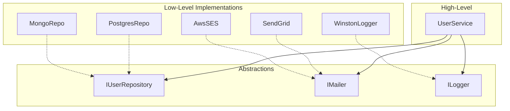

# 🏛️ OOP trong NestJS (Phần 5): SOLID Principles

> 🎯 **Mục tiêu**: Hiểu 5 nguyên tắc SOLID và áp dụng vào code NestJS thực tế.

<!--truncate-->

---

## 📌 Recap từ Series

| Phần | Đã học | UserService evolution |
|------|--------|----------------------|
| 1 | Class, `this`, Constructor | Functional → Class |
| 2 | Encapsulation, Decorators | @Injectable, private |
| 3 | Interface, Abstract Class | IUserRepository |
| 4 | DI, IoC Container | Inject IUserRepository |

**Bây giờ**: Học các nguyên tắc thiết kế để code NestJS **bền vững, dễ maintain**.

---

## 1. SOLID LÀ GÌ?

```
S - Single Responsibility Principle (SRP)
O - Open/Closed Principle (OCP)  
L - Liskov Substitution Principle (LSP)
I - Interface Segregation Principle (ISP)
D - Dependency Inversion Principle (DIP)
```

> 💡 Đây là 5 nguyên tắc giúp code **flexible, maintainable, testable**.

---

## 2. S - SINGLE RESPONSIBILITY PRINCIPLE

### 2.1 Định nghĩa

> **Một class chỉ nên có MỘT lý do để thay đổi.**

### 2.2 Vi phạm SRP

```typescript
// ❌ Vi phạm SRP - UserService làm quá nhiều việc
@Injectable()
export class UserService {
  constructor(
    @Inject(USER_REPOSITORY) private userRepo: IUserRepository,
    private mailer: MailerService,
    private smsService: SmsService,
  ) {}

  async createUser(dto: CreateUserDto) {
    // 1. Business logic - tạo user
    const user = await this.userRepo.create(dto);
    
    // 2. Gửi email - KHÔNG PHẢI VIỆC CỦA USER SERVICE!
    await this.mailer.send({
      to: user.email,
      subject: 'Welcome!',
      template: 'welcome',
      context: { name: user.name }
    });
    
    // 3. Gửi SMS - KHÔNG PHẢI VIỆC CỦA USER SERVICE!
    await this.smsService.send({
      to: user.phone,
      message: `Chào ${user.name}, cảm ơn bạn đã đăng ký!`
    });
    
    // 4. Log analytics - KHÔNG PHẢI VIỆC CỦA USER SERVICE!
    console.log(`New user: ${user.id} at ${new Date()}`);
    
    return user;
  }
}

// Vấn đề:
// - Thay đổi email template → sửa UserService
// - Thêm push notification → sửa UserService
// - Thay đổi analytics → sửa UserService
```

### 2.3 Áp dụng SRP

```typescript
// ✅ Tách thành các service riêng biệt

// 1. UserService - CHỈ quản lý user
@Injectable()
export class UserService {
  constructor(
    @Inject(USER_REPOSITORY) private userRepo: IUserRepository,
    private eventEmitter: EventEmitter2,  // Dùng events
  ) {}

  async createUser(dto: CreateUserDto): Promise<User> {
    const user = await this.userRepo.create(dto);
    
    // Emit event thay vì gọi trực tiếp
    this.eventEmitter.emit('user.created', new UserCreatedEvent(user));
    
    return user;
  }
}

// 2. NotificationService - CHỈ xử lý notifications
@Injectable()
export class NotificationService {
  constructor(
    private mailer: MailerService,
    private smsService: SmsService,
    private pushService: PushNotificationService,
  ) {}

  @OnEvent('user.created')
  async handleUserCreated(event: UserCreatedEvent) {
    await this.sendWelcomeEmail(event.user);
    await this.sendWelcomeSms(event.user);
  }

  private async sendWelcomeEmail(user: User) {
    await this.mailer.send({
      to: user.email,
      subject: 'Welcome!',
      template: 'welcome',
      context: { name: user.name }
    });
  }

  private async sendWelcomeSms(user: User) {
    if (user.phone) {
      await this.smsService.send({
        to: user.phone,
        message: `Chào ${user.name}, cảm ơn bạn đã đăng ký!`
      });
    }
  }
}

// 3. AnalyticsService - CHỈ xử lý analytics
@Injectable()
export class AnalyticsService {
  @OnEvent('user.created')
  async trackUserCreation(event: UserCreatedEvent) {
    await this.track('user_signup', {
      userId: event.user.id,
      email: event.user.email,
      timestamp: new Date()
    });
  }
}
```

### 2.4 Lợi ích SRP

| Trước (vi phạm SRP) | Sau (áp dụng SRP) |
|---------------------|-------------------|
| 1 file lớn, khó đọc | Nhiều files nhỏ, rõ ràng |
| Test phức tạp | Test từng service riêng |
| Thay đổi email = risk toàn bộ | Thay đổi email = chỉ NotificationService |

---

## 3. O - OPEN/CLOSED PRINCIPLE

### 3.1 Định nghĩa

> **Open for extension, closed for modification.**
> Có thể mở rộng behavior mà KHÔNG sửa code hiện tại.

### 3.2 Vi phạm OCP

```typescript
// ❌ Vi phạm OCP - Phải sửa code khi thêm notification type
@Injectable()
export class NotificationService {
  async send(type: string, to: string, message: string) {
    if (type === 'email') {
      await this.sendEmail(to, message);
    } else if (type === 'sms') {
      await this.sendSms(to, message);
    } else if (type === 'push') {  // ← Thêm type = sửa code!
      await this.sendPush(to, message);
    } else if (type === 'slack') { // ← Lại sửa code!
      await this.sendSlack(to, message);
    }
    // Mỗi lần thêm type → sửa file này
  }
}
```

### 3.3 Áp dụng OCP với Strategy Pattern

```typescript
// ✅ Áp dụng OCP - Thêm notification KHÔNG cần sửa code cũ

// 1. Interface cho strategy
export interface INotificationChannel {
  readonly type: string;
  send(to: string, message: string): Promise<void>;
}

// 2. Các implementations
@Injectable()
export class EmailChannel implements INotificationChannel {
  readonly type = 'email';
  
  constructor(private mailer: MailerService) {}
  
  async send(to: string, message: string): Promise<void> {
    await this.mailer.send({ to, subject: 'Notification', body: message });
  }
}

@Injectable()
export class SmsChannel implements INotificationChannel {
  readonly type = 'sms';
  
  constructor(private smsService: SmsService) {}
  
  async send(to: string, message: string): Promise<void> {
    await this.smsService.send({ to, message });
  }
}

@Injectable()
export class PushChannel implements INotificationChannel {
  readonly type = 'push';
  
  constructor(private pushService: PushService) {}
  
  async send(to: string, message: string): Promise<void> {
    await this.pushService.send({ deviceId: to, message });
  }
}

// 3. NotificationService - KHÔNG CẦN SỬA khi thêm channel mới
@Injectable()
export class NotificationService {
  private channels = new Map<string, INotificationChannel>();

  constructor(
    @Inject('NOTIFICATION_CHANNELS')
    channels: INotificationChannel[]
  ) {
    // Đăng ký tất cả channels
    channels.forEach(channel => {
      this.channels.set(channel.type, channel);
    });
  }

  async send(type: string, to: string, message: string): Promise<void> {
    const channel = this.channels.get(type);
    if (!channel) {
      throw new Error(`Unknown notification type: ${type}`);
    }
    await channel.send(to, message);
  }

  async sendAll(to: string, message: string): Promise<void> {
    await Promise.all(
      Array.from(this.channels.values()).map(ch => ch.send(to, message))
    );
  }
}

// 4. Module configuration
@Module({
  providers: [
    NotificationService,
    EmailChannel,
    SmsChannel,
    PushChannel,
    {
      provide: 'NOTIFICATION_CHANNELS',
      useFactory: (email: EmailChannel, sms: SmsChannel, push: PushChannel) => {
        return [email, sms, push];
      },
      inject: [EmailChannel, SmsChannel, PushChannel]
    }
  ]
})
export class NotificationModule {}

// 5. Thêm Slack channel - KHÔNG sửa NotificationService!
@Injectable()
export class SlackChannel implements INotificationChannel {
  readonly type = 'slack';
  
  async send(to: string, message: string): Promise<void> {
    // Slack implementation
  }
}

// Chỉ cần thêm vào providers và factory
```

---

## 4. L - LISKOV SUBSTITUTION PRINCIPLE

### 4.1 Định nghĩa

> **Subclass phải thay thế được base class mà không làm hỏng program.**

### 4.2 Vi phạm LSP

```typescript
// ❌ Vi phạm LSP
class Bird {
  fly(): void {
    console.log('Flying...');
  }
}

class Penguin extends Bird {
  fly(): void {
    throw new Error("Penguins can't fly!");  // ← Vi phạm!
  }
}

function makeBirdFly(bird: Bird) {
  bird.fly();  // Crash nếu là Penguin!
}
```

### 4.3 Áp dụng LSP

```typescript
// ✅ Áp dụng LSP
abstract class Bird {
  abstract move(): void;
}

class FlyingBird extends Bird {
  move(): void {
    console.log('Flying...');
  }
}

class Penguin extends Bird {
  move(): void {
    console.log('Swimming...');  // ✅ Hợp lệ
  }
}

function makeBirdMove(bird: Bird) {
  bird.move();  // Hoạt động với mọi Bird!
}
```

### 4.4 LSP trong NestJS - Repository Example

```typescript
// ✅ Repository implementations phải tuân thủ interface contract
interface IUserRepository {
  findById(id: string): Promise<User | null>;
  create(data: CreateUserData): Promise<User>;
}

// Implementation 1: In-Memory
class InMemoryUserRepository implements IUserRepository {
  async findById(id: string): Promise<User | null> {
    return this.users.get(id) || null;  // Trả về null nếu không tìm thấy
  }
  
  async create(data: CreateUserData): Promise<User> {
    const user = { id: this.generateId(), ...data };
    this.users.set(user.id, user);
    return user;  // Luôn trả về User mới tạo
  }
}

// Implementation 2: PostgreSQL
class PostgresUserRepository implements IUserRepository {
  async findById(id: string): Promise<User | null> {
    const result = await this.db.query('SELECT * FROM users WHERE id = $1', [id]);
    return result.rows[0] || null;  // Cùng behavior: null nếu không tìm thấy
  }
  
  async create(data: CreateUserData): Promise<User> {
    const result = await this.db.query(
      'INSERT INTO users (...) VALUES (...) RETURNING *',
      [...]
    );
    return result.rows[0];  // Cùng behavior: trả về User mới tạo
  }
}

// UserService hoạt động với BẤT KỲ implementation nào
@Injectable()
export class UserService {
  constructor(@Inject(USER_REPOSITORY) private repo: IUserRepository) {}
  
  async getUser(id: string): Promise<User> {
    const user = await this.repo.findById(id);
    if (!user) throw new NotFoundException();
    return user;
  }
}
```

---

## 5. I - INTERFACE SEGREGATION PRINCIPLE

### 5.1 Định nghĩa

> **Nhiều interfaces nhỏ tốt hơn một interface lớn.**
> Client không nên bị ép implement methods không cần.

### 5.2 Vi phạm ISP

```typescript
// ❌ Vi phạm ISP - Interface quá lớn
interface IUserRepository {
  // CRUD operations
  create(data: CreateUserData): Promise<User>;
  findById(id: string): Promise<User | null>;
  findByEmail(email: string): Promise<User | null>;
  findAll(): Promise<User[]>;
  update(id: string, data: UpdateUserData): Promise<User>;
  delete(id: string): Promise<void>;
  
  // Authentication - không phải mọi repo đều cần!
  validatePassword(email: string, password: string): Promise<boolean>;
  updatePassword(id: string, newPassword: string): Promise<void>;
  
  // Reporting - không phải mọi repo đều cần!
  countByMonth(): Promise<MonthlyStats[]>;
  getActiveUsers(days: number): Promise<User[]>;
  
  // Notifications - không liên quan!
  getNotificationPreferences(id: string): Promise<NotificationPrefs>;
}

// Vấn đề: ReadOnlyUserRepository phải implement methods không cần
class ReadOnlyUserRepository implements IUserRepository {
  validatePassword() { throw new Error('Not supported'); }  // ❌
  updatePassword() { throw new Error('Not supported'); }     // ❌
  countByMonth() { throw new Error('Not supported'); }       // ❌
  // ...
}
```

### 5.3 Áp dụng ISP

```typescript
// ✅ Áp dụng ISP - Tách thành nhiều interfaces nhỏ

// 1. Base CRUD
interface IUserReader {
  findById(id: string): Promise<User | null>;
  findByEmail(email: string): Promise<User | null>;
  findAll(): Promise<User[]>;
}

interface IUserWriter {
  create(data: CreateUserData): Promise<User>;
  update(id: string, data: UpdateUserData): Promise<User>;
  delete(id: string): Promise<void>;
}

// 2. Full CRUD = Reader + Writer
interface IUserRepository extends IUserReader, IUserWriter {}

// 3. Authentication riêng
interface IUserAuthRepository {
  validatePassword(email: string, password: string): Promise<boolean>;
  updatePassword(id: string, newPassword: string): Promise<void>;
}

// 4. Reporting riêng
interface IUserStatsRepository {
  countByMonth(): Promise<MonthlyStats[]>;
  getActiveUsers(days: number): Promise<User[]>;
}

// Implementations chỉ implement những gì cần
@Injectable()
class InMemoryUserRepository implements IUserRepository {
  // Chỉ CRUD, không cần auth hay stats
}

@Injectable() 
class PostgresUserRepository 
  implements IUserRepository, IUserAuthRepository, IUserStatsRepository {
  // Full features
}

// Services inject đúng interface cần
@Injectable()
class UserQueryService {
  constructor(@Inject('USER_READER') private reader: IUserReader) {}
  // Chỉ cần đọc, không cần write
}

@Injectable()
class AuthService {
  constructor(@Inject('USER_AUTH') private authRepo: IUserAuthRepository) {}
  // Chỉ cần auth methods
}

@Injectable()
class ReportService {
  constructor(@Inject('USER_STATS') private statsRepo: IUserStatsRepository) {}
  // Chỉ cần stats methods
}
```

---

## 6. D - DEPENDENCY INVERSION PRINCIPLE

### 6.1 Định nghĩa

> **High-level modules không nên depend on low-level modules.**
> Cả hai nên depend on abstractions.

### 6.2 Vi phạm DIP

```typescript
// ❌ Vi phạm DIP - High-level phụ thuộc vào low-level
@Injectable()
export class UserService {
  // Phụ thuộc trực tiếp vào concrete class!
  private repository = new PostgresUserRepository();
  private mailer = new SendGridMailer();
  private logger = new WinstonLogger();

  async createUser(dto: CreateUserDto) {
    this.logger.log('Creating user...');
    const user = await this.repository.create(dto);
    await this.mailer.send(user.email, 'Welcome!');
    return user;
  }
}

// Vấn đề:
// - Không thể đổi PostgreSQL sang MongoDB
// - Không thể mock mailer khi test
// - Tight coupling
```

### 6.3 Áp dụng DIP

```typescript
// ✅ Áp dụng DIP - Depend on abstractions

// 1. Abstractions (interfaces)
interface IUserRepository {
  create(data: CreateUserData): Promise<User>;
  findById(id: string): Promise<User | null>;
}

interface IMailer {
  send(to: string, subject: string, body: string): Promise<void>;
}

interface ILogger {
  log(message: string): void;
  error(message: string, trace?: string): void;
}

// 2. High-level module depends on abstractions
@Injectable()
export class UserService {
  constructor(
    @Inject(USER_REPOSITORY) private repository: IUserRepository,
    @Inject('MAILER') private mailer: IMailer,
    @Inject('LOGGER') private logger: ILogger,
  ) {}

  async createUser(dto: CreateUserDto): Promise<User> {
    this.logger.log('Creating user...');
    const user = await this.repository.create(dto);
    await this.mailer.send(user.email, 'Welcome!', 'Welcome to our app!');
    return user;
  }
}

// 3. Low-level modules implement abstractions
@Injectable()
class PostgresUserRepository implements IUserRepository { /* ... */ }

@Injectable()
class MongoUserRepository implements IUserRepository { /* ... */ }

@Injectable()
class SendGridMailer implements IMailer { /* ... */ }

@Injectable()
class AwsSesMailer implements IMailer { /* ... */ }

// 4. Module wires everything together
@Module({
  providers: [
    UserService,
    {
      provide: USER_REPOSITORY,
      useClass: process.env.DB === 'mongo' 
        ? MongoUserRepository 
        : PostgresUserRepository
    },
    {
      provide: 'MAILER',
      useClass: process.env.MAILER === 'ses'
        ? AwsSesMailer
        : SendGridMailer
    },
    {
      provide: 'LOGGER',
      useClass: WinstonLogger
    }
  ]
})
export class UserModule {}
```

### 6.4 Dependency Graph



---

## 7. USERSERVICE - ÁP DỤNG TẤT CẢ SOLID

```typescript
// interfaces/user.interfaces.ts
// ISP: Tách nhỏ interfaces
export interface IUserReader {
  findById(id: string): Promise<User | null>;
  findByEmail(email: string): Promise<User | null>;
}

export interface IUserWriter {
  create(data: CreateUserData): Promise<User>;
  update(id: string, data: Partial<User>): Promise<User>;
  delete(id: string): Promise<void>;
}

export interface IUserRepository extends IUserReader, IUserWriter {}

export interface IPasswordHasher {
  hash(password: string): Promise<string>;
  compare(password: string, hash: string): Promise<boolean>;
}

// services/user.service.ts
// SRP: Chỉ xử lý business logic cho User
@Injectable()
export class UserService {
  constructor(
    // DIP: Depend on abstractions
    @Inject(USER_REPOSITORY) private readonly userRepo: IUserRepository,
    @Inject('PASSWORD_HASHER') private readonly hasher: IPasswordHasher,
    private readonly eventEmitter: EventEmitter2,
  ) {}

  async create(dto: CreateUserDto): Promise<UserResponse> {
    await this.ensureEmailNotExists(dto.email);
    
    const hashedPassword = await this.hasher.hash(dto.password);
    const user = await this.userRepo.create({
      ...dto,
      password: hashedPassword
    });

    // SRP: Event thay vì gọi notification trực tiếp
    this.eventEmitter.emit('user.created', new UserCreatedEvent(user));

    return this.toPublicUser(user);
  }

  async validateCredentials(email: string, password: string): Promise<User | null> {
    const user = await this.userRepo.findByEmail(email);
    if (!user) return null;
    
    const isValid = await this.hasher.compare(password, user.password);
    return isValid ? user : null;
  }

  private async ensureEmailNotExists(email: string): Promise<void> {
    const existing = await this.userRepo.findByEmail(email);
    if (existing) {
      throw new ConflictException('Email already exists');
    }
  }

  private toPublicUser(user: User): UserResponse {
    const { password, ...publicUser } = user;
    return publicUser;
  }
}

// services/notification.service.ts
// SRP: Chỉ xử lý notifications
// OCP: Strategy pattern cho channels
@Injectable()
export class NotificationService {
  private channels = new Map<string, INotificationChannel>();

  constructor(
    @Inject('NOTIFICATION_CHANNELS') channels: INotificationChannel[]
  ) {
    channels.forEach(ch => this.channels.set(ch.type, ch));
  }

  @OnEvent('user.created')
  async onUserCreated(event: UserCreatedEvent) {
    await this.send('email', event.user.email, 'Welcome!');
  }

  async send(type: string, to: string, message: string): Promise<void> {
    const channel = this.channels.get(type);
    if (!channel) throw new Error(`Unknown channel: ${type}`);
    await channel.send(to, message);
  }
}
```

---

## 8. BÀI TẬP THỰC HÀNH

### 📝 Câu hỏi Lý thuyết

| # | Principle | Câu hỏi | Gợi ý |
|---|-----------|---------|-------|
| 1 | SRP | Khi nào một class vi phạm SRP? | Khi có nhiều hơn 1 lý do để thay đổi |
| 2 | OCP | Pattern nào giúp áp dụng OCP? | Strategy, Template Method |
| 3 | LSP | Subclass vi phạm LSP khi nào? | Khi không thể thay thế base class |
| 4 | ISP | Tại sao nhiều interface nhỏ tốt hơn? | Client không bị ép implement methods không cần |
| 5 | DIP | DI và DIP khác nhau thế nào? | DI là kỹ thuật, DIP là nguyên tắc thiết kế |

### 💻 Bài tập Code

**Refactor PaymentService theo SOLID:**

```typescript
// ❌ Vi phạm nhiều nguyên tắc
class PaymentService {
  async processPayment(method: string, amount: number, details: any) {
    if (method === 'stripe') {
      // Stripe implementation
      const stripe = new Stripe('sk_test_...');
      await stripe.charges.create({ amount, currency: 'usd' });
      console.log('Payment via Stripe: $' + amount);
      await this.sendReceipt(details.email);
    } else if (method === 'paypal') {
      // PayPal implementation
      const paypal = new PayPal('client_id');
      await paypal.pay(amount);
      console.log('Payment via PayPal: $' + amount);
    }
    // Thêm method mới = sửa code
  }
}

// TODO: Refactor với:
// - Strategy pattern (OCP)
// - Interfaces (DIP)
// - Separate services (SRP)
```

---

## 🔗 Tiếp theo

**[Phần 6: Design Patterns →](./part6_design_patterns)**

Trong phần cuối, chúng ta sẽ:
- Factory Pattern với `useFactory`
- Module Pattern trong NestJS
- Repository Pattern hoàn chỉnh
- Tổng kết series

---

## 📚 Tóm tắt Phần 5

| Principle | Tóm tắt | NestJS Application |
|-----------|---------|-------------------|
| **SRP** | 1 class = 1 responsibility | Tách service theo domain |
| **OCP** | Extend không modify | Strategy pattern |
| **LSP** | Subclass thay thế được | Repository implementations |
| **ISP** | Interfaces nhỏ | Tách IReader, IWriter |
| **DIP** | Depend on abstractions | Constructor injection |

> 💡 **Takeaway**: SOLID không phải rules cứng nhắc - chúng là guidelines. Áp dụng khi làm code tốt hơn, không phải để cho fancy.
