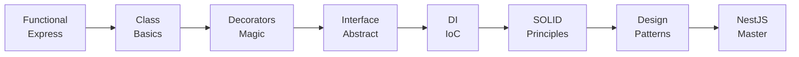

# 🏗️ OOP trong NestJS (Phần 6): Design Patterns

> 🎯 **Mục tiêu**: Tổng hợp các Design Patterns trong NestJS và hoàn thiện kiến thức OOP.

<!--truncate-->

---

## 📌 Tổng Quan Series

| Phần | Chủ đề | Áp dụng vào UserService |
|------|--------|------------------------|
| 1 | Class, Constructor | Functional → Class-based |
| 2 | Decorators | @Injectable, @LogExecution |
| 3 | Interface/Abstract | IUserRepository, BaseRepository |
| 4 | DI, IoC | Inject dependencies |
| 5 | SOLID | Tách services, Strategy pattern |
| **6** | **Design Patterns** | **Factory, Repository, Module** |

---

## 1. FACTORY PATTERN

### 1.1 Factory là gì?

> **Factory = Class/function chịu trách nhiệm tạo objects.**
> Client không biết object được tạo như thế nào.

### 1.2 Simple Factory

```typescript
// Không dùng Factory
const logger = process.env.ENV === 'production'
  ? new CloudWatchLogger()
  : new ConsoleLogger();

// ❌ Logic tạo object rải rác khắp nơi
```

```typescript
// ✅ Dùng Factory
class LoggerFactory {
  static create(): ILogger {
    if (process.env.ENV === 'production') {
      return new CloudWatchLogger();
    }
    return new ConsoleLogger();
  }
}

// Client
const logger = LoggerFactory.create();
```

### 1.3 Factory trong NestJS - useFactory

```typescript
// factories/database.factory.ts
export const DatabaseFactory = {
  provide: 'DATABASE_CONNECTION',
  useFactory: async (config: ConfigService): Promise<DataSource> => {
    const type = config.get<string>('DB_TYPE', 'postgres');
    
    const dataSource = new DataSource({
      type: type as any,
      host: config.get('DB_HOST'),
      port: config.get('DB_PORT'),
      username: config.get('DB_USER'),
      password: config.get('DB_PASS'),
      database: config.get('DB_NAME'),
      entities: [__dirname + '/../**/*.entity{.ts,.js}'],
      synchronize: config.get('NODE_ENV') !== 'production',
    });

    await dataSource.initialize();
    console.log(`Database connected: ${type}`);
    
    return dataSource;
  },
  inject: [ConfigService],
};

// Module
@Module({
  providers: [DatabaseFactory],
  exports: ['DATABASE_CONNECTION']
})
export class DatabaseModule {}
```

### 1.4 Dynamic Module Factory

```typescript
// notification.module.ts
@Module({})
export class NotificationModule {
  static register(options: NotificationOptions): DynamicModule {
    return {
      module: NotificationModule,
      providers: [
        {
          provide: 'NOTIFICATION_OPTIONS',
          useValue: options,
        },
        {
          provide: 'NOTIFICATION_CHANNELS',
          useFactory: (opts: NotificationOptions) => {
            const channels: INotificationChannel[] = [];
            
            if (opts.email) {
              channels.push(new EmailChannel(opts.email));
            }
            if (opts.sms) {
              channels.push(new SmsChannel(opts.sms));
            }
            if (opts.push) {
              channels.push(new PushChannel(opts.push));
            }
            
            return channels;
          },
          inject: ['NOTIFICATION_OPTIONS'],
        },
        NotificationService,
      ],
      exports: [NotificationService],
    };
  }
}

// Sử dụng
@Module({
  imports: [
    NotificationModule.register({
      email: { apiKey: process.env.SENDGRID_KEY },
      sms: { accountSid: process.env.TWILIO_SID },
      // push: không enable
    }),
  ],
})
export class AppModule {}
```

---

## 2. REPOSITORY PATTERN

### 2.1 Repository là gì?

> **Repository = Abstraction layer giữa domain và data layer.**
> Business logic không quan tâm data lưu ở đâu.

### 2.2 Complete Repository Implementation

```typescript
// 1. Base Interface
export interface IRepository<T> {
  findById(id: string): Promise<T | null>;
  findAll(options?: FindOptions): Promise<T[]>;
  create(data: Partial<T>): Promise<T>;
  update(id: string, data: Partial<T>): Promise<T>;
  delete(id: string): Promise<void>;
  count(filter?: FilterOptions): Promise<number>;
}

// 2. User-specific Interface
export interface IUserRepository extends IRepository<User> {
  findByEmail(email: string): Promise<User | null>;
  findByUsername(username: string): Promise<User | null>;
  existsByEmail(email: string): Promise<boolean>;
}

// 3. Abstract Base Repository với common logic
export abstract class BaseRepository<T extends { id: string }> 
  implements IRepository<T> {
  
  protected abstract get entityName(): string;

  abstract findById(id: string): Promise<T | null>;
  abstract findAll(options?: FindOptions): Promise<T[]>;
  abstract create(data: Partial<T>): Promise<T>;
  abstract update(id: string, data: Partial<T>): Promise<T>;
  abstract delete(id: string): Promise<void>;
  abstract count(filter?: FilterOptions): Promise<number>;

  // Shared utility methods
  protected generateId(): string {
    return `${this.entityName}_${Date.now()}_${Math.random().toString(36).substr(2, 9)}`;
  }

  protected log(operation: string, details?: object): void {
    console.log(`[${this.entityName}Repository] ${operation}`, details || '');
  }
}

// 4. Concrete Implementation - TypeORM
@Injectable()
export class TypeOrmUserRepository 
  extends BaseRepository<User> 
  implements IUserRepository {
  
  protected get entityName() { return 'User'; }

  constructor(
    @InjectRepository(UserEntity)
    private readonly repo: Repository<UserEntity>,
  ) {
    super();
  }

  async findById(id: string): Promise<User | null> {
    this.log('findById', { id });
    return this.repo.findOne({ where: { id } });
  }

  async findAll(options?: FindOptions): Promise<User[]> {
    this.log('findAll', options);
    return this.repo.find({
      skip: options?.offset,
      take: options?.limit,
      order: options?.orderBy,
    });
  }

  async findByEmail(email: string): Promise<User | null> {
    this.log('findByEmail', { email });
    return this.repo.findOne({ where: { email } });
  }

  async findByUsername(username: string): Promise<User | null> {
    this.log('findByUsername', { username });
    return this.repo.findOne({ where: { username } });
  }

  async existsByEmail(email: string): Promise<boolean> {
    const count = await this.repo.count({ where: { email } });
    return count > 0;
  }

  async create(data: Partial<User>): Promise<User> {
    this.log('create', { email: data.email });
    const entity = this.repo.create(data);
    return this.repo.save(entity);
  }

  async update(id: string, data: Partial<User>): Promise<User> {
    this.log('update', { id });
    await this.repo.update(id, data);
    return this.findById(id);
  }

  async delete(id: string): Promise<void> {
    this.log('delete', { id });
    await this.repo.delete(id);
  }

  async count(filter?: FilterOptions): Promise<number> {
    return this.repo.count({ where: filter });
  }
}
```

### 2.3 Unit of Work Pattern (Bonus)

```typescript
// Unit of Work quản lý transactions
export interface IUnitOfWork {
  userRepository: IUserRepository;
  orderRepository: IOrderRepository;
  
  beginTransaction(): Promise<void>;
  commit(): Promise<void>;
  rollback(): Promise<void>;
}

@Injectable()
export class TypeOrmUnitOfWork implements IUnitOfWork {
  private queryRunner: QueryRunner;

  constructor(
    private dataSource: DataSource,
    @Inject(USER_REPOSITORY) public userRepository: IUserRepository,
    @Inject(ORDER_REPOSITORY) public orderRepository: IOrderRepository,
  ) {}

  async beginTransaction(): Promise<void> {
    this.queryRunner = this.dataSource.createQueryRunner();
    await this.queryRunner.connect();
    await this.queryRunner.startTransaction();
  }

  async commit(): Promise<void> {
    await this.queryRunner.commitTransaction();
    await this.queryRunner.release();
  }

  async rollback(): Promise<void> {
    await this.queryRunner.rollbackTransaction();
    await this.queryRunner.release();
  }
}

// Sử dụng
@Injectable()
export class OrderService {
  constructor(private unitOfWork: IUnitOfWork) {}

  async createOrderWithUser(orderDto: CreateOrderDto, userDto: CreateUserDto) {
    await this.unitOfWork.beginTransaction();
    
    try {
      const user = await this.unitOfWork.userRepository.create(userDto);
      const order = await this.unitOfWork.orderRepository.create({
        ...orderDto,
        userId: user.id,
      });
      
      await this.unitOfWork.commit();
      return { user, order };
    } catch (error) {
      await this.unitOfWork.rollback();
      throw error;
    }
  }
}
```

---

## 3. SINGLETON PATTERN

### 3.1 Singleton trong NestJS

> **Mặc định, NestJS providers là SINGLETON** - chỉ tạo 1 instance.

```typescript
@Injectable()  // Singleton by default
export class ConfigService {
  private readonly config: Map<string, any>;

  constructor() {
    console.log('ConfigService created');  // Chỉ log 1 lần!
    this.config = this.loadConfig();
  }

  get<T>(key: string): T {
    return this.config.get(key);
  }
}

// Cả app chỉ có 1 instance ConfigService
// UserModule và OrderModule dùng chung instance
```

### 3.2 Các Scopes trong NestJS

```typescript
import { Scope } from '@nestjs/common';

// Scope.DEFAULT (Singleton)
@Injectable({ scope: Scope.DEFAULT })
export class SingletonService {}

// Scope.REQUEST - Mới instance cho mỗi request
@Injectable({ scope: Scope.REQUEST })
export class RequestScopedService {
  constructor(@Inject(REQUEST) private request: Request) {
    // Access request-specific data
    console.log(this.request.headers);
  }
}

// Scope.TRANSIENT - Mới instance mỗi lần inject
@Injectable({ scope: Scope.TRANSIENT })
export class TransientService {
  private readonly id = Math.random();
  
  getId() { return this.id; }  // Mỗi inject = id khác nhau
}
```

### 3.3 Khi nào dùng scope nào?

| Scope | Use Case | Ví dụ |
|-------|----------|-------|
| **DEFAULT** | Stateless services | ConfigService, UserService |
| **REQUEST** | Cần request context | LoggerService với request ID |
| **TRANSIENT** | Mỗi consumer cần instance riêng | ít dùng |

---

## 4. DECORATOR PATTERN

### 4.1 Decorator Pattern là gì?

> **Decorator = Wrap object để thêm behavior mà không sửa original.**

### 4.2 NestJS Decorators = Decorator Pattern

```typescript
// Decorator function wrap method
function CacheResult(ttl: number): MethodDecorator {
  return (target, propertyKey, descriptor: PropertyDescriptor) => {
    const originalMethod = descriptor.value;
    const cache = new Map<string, { value: any; expiry: number }>();

    descriptor.value = async function (...args: any[]) {
      const key = JSON.stringify(args);
      const cached = cache.get(key);
      
      if (cached && cached.expiry > Date.now()) {
        console.log(`[Cache HIT] ${String(propertyKey)}`);
        return cached.value;
      }

      console.log(`[Cache MISS] ${String(propertyKey)}`);
      const result = await originalMethod.apply(this, args);
      cache.set(key, { value: result, expiry: Date.now() + ttl });
      
      return result;
    };

    return descriptor;
  };
}

// Sử dụng
@Injectable()
export class UserService {
  @CacheResult(60000)  // Cache 60 seconds
  async findById(id: string): Promise<User> {
    console.log('Fetching from database...');
    return this.userRepo.findById(id);
  }
}

// Gọi 2 lần liên tiếp:
// [Cache MISS] findById
// Fetching from database...
// [Cache HIT] findById  ← Không fetch lại!
```

### 4.3 Composing Multiple Decorators

```typescript
// Combine nhiều behaviors
@Injectable()
export class UserService {
  
  @LogExecution()      // Log time
  @CacheResult(60000)  // Cache result
  @RetryOnFailure(3)   // Retry if fails
  async findById(id: string): Promise<User> {
    return this.userRepo.findById(id);
  }
}

// Order: LogExecution → CacheResult → RetryOnFailure → originalMethod
```

---

## 5. MODULE PATTERN

### 5.1 NestJS Module = Organized Factory

```typescript
// Module đóng gói một feature hoàn chỉnh
@Module({
  imports: [
    TypeOrmModule.forFeature([UserEntity]),
    ConfigModule,
  ],
  controllers: [UserController],
  providers: [
    UserService,
    {
      provide: USER_REPOSITORY,
      useClass: TypeOrmUserRepository,
    },
    {
      provide: 'PASSWORD_HASHER',
      useClass: BcryptPasswordHasher,
    },
  ],
  exports: [UserService],  // Public API của module
})
export class UserModule {}
```

### 5.2 Core Module Pattern

```typescript
// core.module.ts - Shared singleton services
@Global()  // Available everywhere without import
@Module({
  providers: [
    ConfigService,
    LoggerService,
    EventBusService,
  ],
  exports: [
    ConfigService,
    LoggerService,
    EventBusService,
  ],
})
export class CoreModule {}

// app.module.ts
@Module({
  imports: [
    CoreModule,  // Import 1 lần
    UserModule,
    OrderModule,
    // UserModule và OrderModule tự động có access đến CoreModule services
  ],
})
export class AppModule {}
```

### 5.3 Feature Module Structure

```
src/
├── core/
│   ├── core.module.ts
│   ├── services/
│   │   ├── config.service.ts
│   │   └── logger.service.ts
│   └── index.ts
│
├── users/
│   ├── users.module.ts
│   ├── controllers/
│   │   └── user.controller.ts
│   ├── services/
│   │   └── user.service.ts
│   ├── repositories/
│   │   ├── user.repository.interface.ts
│   │   └── typeorm-user.repository.ts
│   ├── entities/
│   │   └── user.entity.ts
│   ├── dto/
│   │   ├── create-user.dto.ts
│   │   └── update-user.dto.ts
│   └── index.ts
│
├── orders/
│   ├── orders.module.ts
│   └── ...
│
└── app.module.ts
```

---

## 6. TỔNG KẾT: USERSERVICE HOÀN CHỈNH

### 6.1 Áp dụng tất cả Patterns

```typescript
// interfaces/user-repository.interface.ts
export const USER_REPOSITORY = 'USER_REPOSITORY';

export interface IUserRepository {
  findById(id: string): Promise<User | null>;
  findByEmail(email: string): Promise<User | null>;
  existsByEmail(email: string): Promise<boolean>;
  create(data: CreateUserData): Promise<User>;
  update(id: string, data: Partial<User>): Promise<User>;
  delete(id: string): Promise<void>;
}

// repositories/typeorm-user.repository.ts
@Injectable()
export class TypeOrmUserRepository 
  extends BaseRepository<User>  // Template Method Pattern
  implements IUserRepository {
  
  protected get entityName() { return 'User'; }

  constructor(
    @InjectRepository(UserEntity) private repo: Repository<UserEntity>,
  ) {
    super();
  }

  // ... implementations
}

// services/password-hasher.interface.ts
export interface IPasswordHasher {
  hash(password: string): Promise<string>;
  compare(password: string, hash: string): Promise<boolean>;
}

// services/bcrypt-password-hasher.ts
@Injectable()
export class BcryptPasswordHasher implements IPasswordHasher {
  private readonly SALT_ROUNDS = 10;

  async hash(password: string): Promise<string> {
    return bcrypt.hash(password, this.SALT_ROUNDS);
  }

  async compare(password: string, hash: string): Promise<boolean> {
    return bcrypt.compare(password, hash);
  }
}

// decorators/log-execution.decorator.ts
export function LogExecution(): MethodDecorator {
  return (target, key, descriptor: PropertyDescriptor) => {
    const original = descriptor.value;
    
    descriptor.value = async function (...args: any[]) {
      const className = target.constructor.name;
      const start = Date.now();
      console.log(`[${className}] ${String(key)} started`);
      
      try {
        const result = await original.apply(this, args);
        console.log(`[${className}] ${String(key)} completed in ${Date.now() - start}ms`);
        return result;
      } catch (error) {
        console.error(`[${className}] ${String(key)} failed:`, error.message);
        throw error;
      }
    };

    return descriptor;
  };
}

// services/user.service.ts
@Injectable()
export class UserService {
  constructor(
    @Inject(USER_REPOSITORY) 
    private readonly userRepository: IUserRepository,  // DIP
    
    @Inject('PASSWORD_HASHER')
    private readonly passwordHasher: IPasswordHasher,  // DIP
    
    private readonly eventEmitter: EventEmitter2,       // SRP - events
  ) {}

  @LogExecution()  // Decorator Pattern
  async create(dto: CreateUserDto): Promise<UserResponse> {
    // Check duplicate
    const exists = await this.userRepository.existsByEmail(dto.email);
    if (exists) {
      throw new ConflictException('Email already exists');
    }

    // Hash password
    const hashedPassword = await this.passwordHasher.hash(dto.password);

    // Create user
    const user = await this.userRepository.create({
      email: dto.email,
      password: hashedPassword,
      name: dto.name,
    });

    // Emit event (SRP - không gửi notification trực tiếp)
    this.eventEmitter.emit('user.created', new UserCreatedEvent(user));

    return this.toPublicUser(user);
  }

  @LogExecution()
  async findById(id: string): Promise<UserResponse> {
    const user = await this.userRepository.findById(id);
    if (!user) throw new NotFoundException('User not found');
    return this.toPublicUser(user);
  }

  @LogExecution()
  async validateCredentials(
    email: string, 
    password: string
  ): Promise<User | null> {
    const user = await this.userRepository.findByEmail(email);
    if (!user) return null;

    const isValid = await this.passwordHasher.compare(password, user.password);
    return isValid ? user : null;
  }

  private toPublicUser(user: User): UserResponse {
    const { password, ...publicUser } = user;
    return publicUser;
  }
}

// users.module.ts
@Module({
  imports: [
    TypeOrmModule.forFeature([UserEntity]),
  ],
  controllers: [UserController],
  providers: [
    UserService,
    // Factory Pattern cho repository
    {
      provide: USER_REPOSITORY,
      useClass: TypeOrmUserRepository,
    },
    // Factory Pattern cho password hasher
    {
      provide: 'PASSWORD_HASHER',
      useClass: BcryptPasswordHasher,
    },
  ],
  exports: [UserService],
})
export class UserModule {}
```

---

## 7. PATTERN REFERENCE

| Pattern | NestJS Implementation | Use Case |
|---------|----------------------|----------|
| **Factory** | `useFactory`, Dynamic Modules | Create complex objects |
| **Repository** | Abstract + Interface | Data layer abstraction |
| **Singleton** | Default provider scope | Shared services |
| **Decorator** | Method/Class decorators | Add behaviors |
| **Module** | @Module() | Organize features |
| **Strategy** | Interface + implementations | Swap algorithms |
| **Observer** | EventEmitter2 | Decouple components |

---

## 8. SERIES SUMMARY

### 8.1 Hành trình từ FP đến OOP



### 8.2 Tổng Kết Kiến Thức

| Phần | Core Concept | Takeaway |
|------|--------------|----------|
| 1 | Class & `this` | OOP = State + Behavior |
| 2 | Decorators | Decorators = Functions + Metadata |
| 3 | Interface/Abstract | Interface = Contract, Abstract = Template |
| 4 | DI | DI = Decouple creation from usage |
| 5 | SOLID | SOLID = Maintainable code |
| 6 | Patterns | Patterns = Proven solutions |

### 8.3 Tiếp Theo

- **Practice**: Áp dụng vào project thực tế
- **Deep Dive**: Microservices với NestJS
- **Advanced**: CQRS, Event Sourcing
- **Testing**: Unit tests, E2E tests

---

## 📚 Resources

- [NestJS Documentation](https://docs.nestjs.com/)
- [TypeScript Handbook](https://www.typescriptlang.org/docs/)
- [Refactoring.Guru - Design Patterns](https://refactoring.guru/design-patterns)
- [SOLID Principles](https://en.wikipedia.org/wiki/SOLID)

---

> 💡 **Final Takeaway**: OOP trong NestJS không phải là "thêm class cho fancy". Đó là cách **tổ chức code** để dễ maintain, test, và scale. Nắm vững fundamentals → tự tin với bất kỳ NestJS project nào!

---

## 🎉 Cảm ơn đã theo dõi series!

Nếu bạn thấy hữu ích, hãy share cho đồng nghiệp cũng đang chuyển từ React/Node sang NestJS!

**Series OOP trong NestJS:**
1. [Foundation - Từ Function đến Class](./part1_oop_foundation)
2. [Encapsulation & Decorators](./part2_encapsulation_decorators)
3. [Interface vs Abstract Class](./part3_interface_abstract)
4. [Dependency Injection](./part4_dependency_injection)
5. [SOLID Principles](./part5_solid_principles)
6. **Design Patterns (bài này)**
