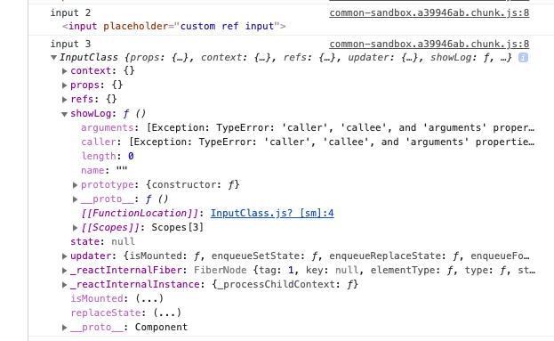

### Refs là gì:
* Theo react official: React supports a special attribute that you can attach to any component (DOM node and component).
 The ref attribute can be an object created by React.createRef() function or a callback function, or a string (in legacy API).
 When the ref attribute is a callback function, the function receives the underlying DOM element or class instance (depending on the type of element) as its argument.
 This allows you to have direct access to the DOM element or component instance.
 Use refs sparingly. If you find yourself often using refs to “make things happen” in your app, consider getting more familiar with top-down data flow.
 
 * Refs là một thuộc tính đặc biệt có thể attach vào bất kể một component nào (DOM node and component), thuộc tính ref có thể được tạo ra 
 bằng React.createRef(), hoặc dùng function (node) => refName = node, hoặc đơn giản là string
 #### 1. String refs: Là cách cũ nhất để tạo ra một refs và sẽ bị loại bỏ trong tương lai 
 ```javascript
 // String
 export default class index extends React.Component {
   constructor() {
     super();
     this.state = {sayings: "" };
   }
   update(e) {
     this.setState({sayings: this.refs.input.value});
   }
 
   render() {
     return (
       <div>
         Bob says <input type="text" ref="btalks" onChange={this.update.bind(this)} />
         {this.state.sayings}
       </div>
     );
   }
 }
 ```
 >If you’re currently using this.refs.textInput to access refs,
 we recommend using either the callback pattern or the createRef API instead.
 
 #### 2. Callback refs
 ```javascript
 class MyComponent extends React.Component {
   constructor(props) {
     super(props);
     this.state = { uppercase: false };
   }
   
   toggleInputCase = () => {
     const isUpper = this.state.uppercase;
     // Accessing the ref using this.inputField
     const value = this.inputField.value;
     this.inputField.value =
       isUpper
         ? value.toLowerCase()
         : value.toUpperCase();
     this.setState({ uppercase: !isUpper });
   }
   render() {
     return (
       <div>
         {/* Creating a callback ref and storing it in this.inputField */}
         <input type="text" ref={elem => this.inputField = elem} />
         <button type="button" onClick={this.toggleInputCase}>
           Toggle Case
         </button>
       </div>
     );
   }
   
 }
 ```
 
 #### 3. Using React.createRef()
 ```javascript
class MyComponent extends React.Component {
  constructor(props) {
    super(props);
    this.myRef = React.createRef();
  }
  render() {
    return <div ref={this.myRef} />;
  }
}

```
 
 
 #### 4. Some technical of Refs
 ##### a. Forward refs: 
 * Là kĩ thuật tự động truyền ref qua một component => đến một trong các component con của nó
 ```javascript
function FancyButton(props) {
  return (
    <button className="FancyButton" {...props}>
      {props.children}
    </button>
  );
}
```

- Xét vd trên: đây là các thông thường để tạo một custom component từ element, có thể lấy được hết các props từ cha
 đến thằng input nằm bên trong, tuy nhiên những API như focus(), blur(), click(), select(), setSelectionRange(), setRangeText()
 setCustomValidity(), checkValidity(), reportValidity()
thì forward ref sẽ giải quyết đc vấn đề này:

```javascript
import React from 'react'

const InputRef = React.forwardRef((props, ref) => (
    <>
      <input placeholder="custom ref input" ref={ref} {...props}/>
    </>
  ))

export default InputRef

// Using
function App() {
  let customRefInput = React.createRef();
  const [inputValue, setInputValue] = useState("");
  return (
    <div className="App">
      <h1>Hello React 17</h1>
      <h2>Start learing REF react</h2>
      <div>Custom input component</div>
      <Input value={inputValue} onChange={e => setInputValue(e.target.value)} />
      <div>Custom input component using forward ref</div>
      <InputRef ref={node => (customRefInput = node)} />
      <div>
        {/*Click button to focus ref input */}
        <button onClick={() => customRefInput.focus()}>Focus</button>
      </div>
    </div>
  );
}
```
 
##### b. Refs for class component
* Mỗi class component (function component không có) cũng có thuộc tính ref, ref trỏ đến đối tượng (instance)
được tạo ra từ class component
Từ đây có thể access vào các method có sẵn của component được gán ref cũng như các method tự định nghĩa, ví dự trong
tình huống này là method `showLog`


```javascript

export default class InputClass extends React.Component {
  showLog = () => {
    console.log("show log");
  };
  render() {
    return (
      <>
        <input placeholder="class input" />
      </>
    );
  }
}


function App() {
  let customRefInput = React.createRef();
  let customInput = React.createRef();
  const [inputValue, setInputValue] = useState("");
  return (
    <div className="App">
      <h1>Hello React 17</h1>
      <h2>Start learing REF react</h2>
      <Input
        value={inputValue}
        onChange={e => setInputValue(e.target.value)}
        // Không được show lo
        ref={node => console.log("input 1", node)}
      />
      <InputRef ref={node => console.log("input 2", node)} />
      <InputClass ref={node => console.log("input 3", node)}/>
    </div>
  );
}
```
* Và đây là implememt
```javascript
function App() {
  let customRefInput = React.createRef();
  let classInput = React.createRef();
  const [inputValue, setInputValue] = useState("");
  return (
    <div className="App">
      <h1>Hello React 17</h1>
      <h2>Start learing REF react</h2>
      <Input
        value={inputValue}
        onChange={e => setInputValue(e.target.value)}
        ref={node => console.log("input 1", node)}
      />
      <InputRef ref={node => (customRefInput = node)} />
      <InputClass ref={node => (classInput = node)} />
      <div>
        <button onClick={() => customRefInput.focus()}>Focus</button>
        <button onClick={() => customRefInput.blur()}>Blur</button>
        <button onClick={() => classInput.setState({ test: "test" })}>
          Reset state
        </button>
        <button onClick={() => classInput.setState({ test: "Change test" })}>
          Set state
        </button>
      </div>
    </div>
  );
}
```