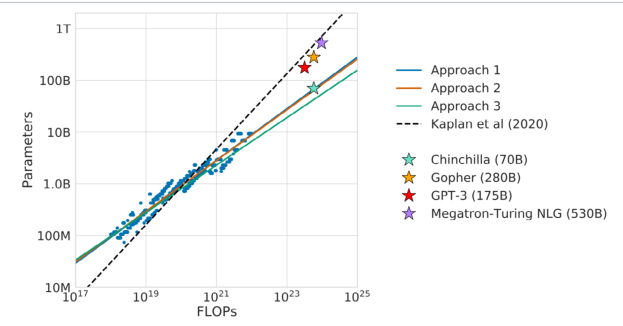

:::info 📚 Về bài dịch này
Đây là bản dịch tiếng Việt của **"Foundational Large Language Models and Text Generation"** (Tác giả: Unknown Author).
Bài được dịch tự động bởi **Aha! Mind Interpreter** — pipeline dịch sách kỹ thuật sử dụng Gemini Flash.

⚠️ *Bản dịch tự động — có thể có lỗi. Vui lòng đối chiếu với bản gốc tiếng Anh khi cần độ chính xác cao.*
:::

<!-- truncate -->

Foundational Large Language Models & Sinh Văn Bản

###### **Chuẩn bị dữ liệu**

Bước đầu tiên là chuẩn bị dữ liệu, bao gồm một vài bước quan trọng. Trước tiên, chúng ta làm sạch dữ liệu bằng cách áp dụng các kỹ thuật như lọc (filtering), loại bỏ trùng lặp (deduplication) và chuẩn hóa (normalization). Bước tiếp theo là tokenization, nơi tập dữ liệu được chuyển đổi thành các Token bằng cách sử dụng các kỹ thuật như Byte-Pair Encoding [8, 9] và Unigram tokenization. [8, 10] Tokenization tạo ra một bộ từ vựng (vocabulary), là tập hợp các Token duy nhất được LLM sử dụng. Bộ từ vựng này đóng vai trò là 'ngôn ngữ' của mô hình để xử lý và hiểu văn bản. Cuối cùng, dữ liệu thường được chia thành tập dữ liệu huấn luyện (training dataset) để huấn luyện mô hình và tập dữ liệu kiểm thử (test dataset) được dùng để đánh giá hiệu suất của mô hình.

###### **Huấn luyện và hàm mất mát**

Một vòng lặp huấn luyện Transformer điển hình bao gồm nhiều phần: Đầu tiên, các batch (lô) của chuỗi đầu vào được lấy mẫu từ một tập dữ liệu huấn luyện. Đối với mỗi chuỗi đầu vào, có một chuỗi mục tiêu (target sequence) tương ứng. Trong quá trình Pre-training không giám sát (unsupervised Pre-training), chuỗi mục tiêu được lấy từ chính chuỗi đầu vào. Batch các chuỗi đầu vào sau đó được đưa vào Transformer. Transformer tạo ra các chuỗi đầu ra dự đoán. Sự khác biệt giữa chuỗi dự đoán và chuỗi mục tiêu được đo lường bằng một hàm mất mát (loss function) (thường là cross entropy loss) [11]. Gradient của hàm mất mát này được tính toán, và một bộ tối ưu hóa (optimizer) sử dụng chúng để cập nhật các tham số của Transformer. Quá trình này được lặp lại cho đến khi Transformer hội tụ đến một mức hiệu suất nhất định hoặc cho đến khi nó đã được huấn luyện trên một số lượng Token được chỉ định trước.

Có nhiều cách tiếp cận khác nhau để xây dựng tác vụ huấn luyện cho Transformer tùy thuộc vào kiến trúc được sử dụng:

-   Các mô hình **Decoder-only** thường được Pre-training trên tác vụ mô hình hóa ngôn ngữ (language modeling task) (ví dụ, xem chú thích cuối trang [12, 13]). Chuỗi mục tiêu cho bộ giải mã (decoder) chỉ đơn giản là một phiên bản dịch chuyển của chuỗi đầu vào. Với một chuỗi huấn luyện như ‘the cat sat on the mat’, nhiều cặp đầu vào/mục tiêu khác nhau có thể được tạo ra cho mô hình. Ví dụ, đầu vào “the cat sat on” nên dự đoán “the” và sau đó đầu vào “the cat sat on the” nên dự đoán chuỗi mục tiêu “mat”.

-   Các mô hình **Encoder-only** (như BERT) [14] thường được Pre-training bằng cách làm hỏng chuỗi đầu vào theo một cách nào đó và yêu cầu mô hình cố gắng tái tạo lại nó. Một cách tiếp cận như vậy là masked language modeling (MLM). [14] Trong ví dụ của chúng ta, chuỗi đầu vào có thể là “The [MASK] sat on the mat” và chuỗi mục tiêu sẽ là câu gốc.

-   Các mô hình **Encoder-decoder** (như Transformer gốc) được huấn luyện trên các tác vụ giám sát (supervised tasks) dạng sequence-to-sequence như dịch thuật (chuỗi đầu vào “Le chat est assis sur le tapis” và chuỗi mục tiêu “The cat sat on the mat”), trả lời câu hỏi (trong đó chuỗi đầu vào là một câu hỏi và chuỗi mục tiêu là câu trả lời tương ứng), và tóm tắt (trong đó chuỗi đầu vào là một bài báo đầy đủ và chuỗi mục tiêu là bản tóm tắt tương ứng của nó). Các mô hình này cũng có thể được huấn luyện theo cách không giám sát (unsupervised way) bằng cách chuyển đổi các tác vụ khác sang định dạng sequence-to-sequence. Ví dụ, khi huấn luyện trên dữ liệu Wikipedia, chuỗi đầu vào có thể là phần đầu của một bài báo, và chuỗi mục tiêu bao gồm phần còn lại của bài báo.

Một yếu tố bổ sung cần xem xét trong quá trình huấn luyện là ‘độ dài ngữ cảnh’ (context length). Điều này đề cập đến số lượng Token trước đó mà mô hình có thể ‘ghi nhớ’ và sử dụng để dự đoán Token tiếp theo trong chuỗi. Độ dài ngữ cảnh dài hơn cho phép mô hình nắm bắt các mối quan hệ và sự phụ thuộc phức tạp hơn trong văn bản, có khả năng dẫn đến hiệu suất tốt hơn. Tuy nhiên, ngữ cảnh dài hơn cũng đòi hỏi nhiều tài nguyên tính toán và bộ nhớ hơn, điều này có thể làm chậm quá trình huấn luyện và Inference. Việc lựa chọn độ dài ngữ cảnh phù hợp bao gồm việc cân bằng các đánh đổi này dựa trên tác vụ cụ thể và tài nguyên sẵn có.

February 2025 21

Foundational Large Language Models & Sinh Văn Bản

February 2025 22

Foundational Large Language Models & Sinh Văn Bản

### **Sự phát triển của các Transformer**

Các phần tiếp theo sẽ cung cấp cái nhìn tổng quan về các kiến trúc Transformer khác nhau. Chúng bao gồm các Transformer chỉ có bộ mã hóa (encoder-only), bộ mã hóa-giải mã (encoder-decoder), cũng như chỉ có bộ giải mã (decoder-only). Chúng ta sẽ bắt đầu với GPT-1 và BERT, và kết thúc với dòng LLM mới nhất của Google mang tên Gemini.

##### **GPT-1**

GPT-1 (Generative pre-trained transformer version 1) [15] là một mô hình _decoder-only_ được OpenAI phát triển vào năm 2018. Mô hình này được huấn luyện trên tập dữ liệu BooksCorpus (chứa khoảng vài tỷ từ) và có khả năng tạo văn bản, dịch ngôn ngữ, viết các loại nội dung sáng tạo khác nhau, và trả lời câu hỏi một cách đầy đủ thông tin. Những đổi mới chính trong GPT-1 bao gồm:

- **Kết hợp Transformer và Pre-training không giám sát (unsupervised pre-training):** Pre-training không giám sát là quá trình huấn luyện một mô hình ngôn ngữ trên một kho dữ liệu lớn không được gán nhãn. Sau đó, dữ liệu có giám sát (supervised data) được sử dụng để Fine-tune mô hình cho một tác vụ cụ thể, chẳng hạn như dịch thuật hoặc phân loại cảm xúc. Trong các nghiên cứu trước đây, hầu hết các mô hình ngôn ngữ được huấn luyện bằng mục tiêu học có giám sát (supervised learning objective). Điều này có nghĩa là mô hình được huấn luyện trên một tập dữ liệu đã được gán nhãn, trong đó mỗi ví dụ có một nhãn tương ứng. Cách tiếp cận này có hai hạn chế chính. Thứ nhất, nó đòi hỏi một lượng lớn dữ liệu đã được gán nhãn, việc thu thập có thể tốn kém và mất thời gian. Thứ hai, mô hình chỉ có thể tổng quát hóa cho các tác vụ tương tự như các tác vụ mà nó đã được huấn luyện. Học chuỗi bán giám sát (semi-supervised sequence learning) là một trong những nghiên cứu đầu tiên cho thấy rằng Pre-training không giám sát kết hợp với huấn luyện có giám sát vượt trội hơn so với chỉ huấn luyện có giám sát.

Pre-training không giám sát khắc phục những hạn chế này bằng cách huấn luyện mô hình trên một kho dữ liệu lớn không được gán nhãn. Dữ liệu này có thể được thu thập dễ dàng và rẻ hơn so với dữ liệu đã được gán nhãn. Ngoài ra, mô hình có thể tổng quát hóa cho các tác vụ khác với các tác vụ mà nó đã được huấn luyện. Tập dữ liệu BooksCorpus là một kho văn bản không được gán nhãn lớn (5GB) đã được sử dụng để huấn luyện mô hình ngôn ngữ GPT-1. Tập dữ liệu này chứa hơn 7.000 cuốn sách chưa xuất bản, cung cấp cho mô hình một lượng lớn dữ liệu để học hỏi. Ngoài ra, kho dữ liệu này chứa các đoạn văn bản liên tục dài, giúp mô hình học được các phụ thuộc tầm xa (long-range dependencies). Nhìn chung, Pre-training không giám sát là một kỹ thuật mạnh mẽ có thể được sử dụng để huấn luyện các mô hình ngôn ngữ chính xác và có khả năng tổng quát hóa tốt hơn so với các mô hình chỉ được huấn luyện bằng học có giám sát.

- **Chuyển đổi đầu vào nhận biết tác vụ (task-aware input transformations):** Có nhiều loại tác vụ khác nhau như suy luận văn bản (textual entailment) và trả lời câu hỏi (question-answering) đòi hỏi một cấu trúc cụ thể. Ví dụ, suy luận văn bản yêu cầu một tiền đề (premise) và một giả thuyết (hypothesis); trả lời câu hỏi yêu cầu một tài liệu ngữ cảnh (context document); một _câu hỏi_ và các _câu trả lời_ có thể. Một trong những đóng góp của GPT-1 là chuyển đổi các loại tác vụ này, vốn yêu cầu đầu vào có cấu trúc, thành một đầu vào mà mô hình ngôn ngữ có thể phân tích cú pháp, mà không cần các kiến trúc dành riêng cho tác vụ (task-specific architectures) bổ sung trên kiến trúc đã được Pre-training. Đối với suy luận văn bản, tiền đề _p_ và giả thuyết _h_ được nối với nhau bằng một Token phân cách ($) ở giữa - [ _p, $, h_ ]. Đối với trả lời câu hỏi, tài liệu ngữ cảnh _c_ được nối với câu hỏi _q_ và một câu trả lời khả thi _a_ bằng một Token phân cách giữa câu hỏi và câu trả lời - [ _c,q,$,a_ ].

GPT-1 đã vượt trội hơn các mô hình trước đây trên một số Benchmark, đạt được kết quả xuất sắc. Mặc dù GPT-1 là một bước đột phá đáng kể trong xử lý ngôn ngữ tự nhiên (NLP), nó vẫn có một số hạn chế. Ví dụ, mô hình dễ tạo ra văn bản lặp lại, đặc biệt khi được cung cấp các Prompt nằm ngoài phạm vi dữ liệu huấn luyện của nó. Nó cũng không thể suy luận qua nhiều lượt hội thoại và không thể theo dõi các phụ thuộc dài hạn trong văn bản. Ngoài ra, tính mạch lạc và trôi chảy của nó bị giới hạn ở các chuỗi văn bản ngắn hơn, và các đoạn văn dài hơn sẽ thiếu tính mạch lạc. Bất chấp những hạn chế này, GPT-1 đã chứng minh sức mạnh của Pre-training không giám sát, đặt nền móng cho các mô hình lớn hơn và mạnh mẽ hơn dựa trên kiến trúc Transformer.

February 2025 24

Foundational Large Language Models & Text Generation

##### **BERT**

BERT [14], viết tắt của Bidirectional Encoder Representations from Transformers, tự phân biệt với các mô hình Transformer encoder-decoder truyền thống bằng cách là một kiến trúc encoder-only. Thay vì dịch hoặc tạo ra các chuỗi, BERT tập trung vào việc hiểu ngữ cảnh sâu sắc bằng cách huấn luyện trên mục tiêu mô hình ngôn ngữ bị che (masked language model objective). Trong thiết lập này, các từ ngẫu nhiên trong một câu được thay thế bằng một Token [MASK], và BERT cố gắng dự đoán từ gốc dựa trên ngữ cảnh xung quanh. Một khía cạnh đổi mới khác trong chế độ huấn luyện của BERT là tổn thất dự đoán câu tiếp theo (next sentence prediction loss), nơi nó học cách xác định xem một câu đã cho có theo sau một câu trước đó một cách logic hay không. Bằng cách huấn luyện trên các mục tiêu này, BERT nắm bắt được các phụ thuộc ngữ cảnh phức tạp từ cả bên trái và bên phải của một từ, và nó có thể phân biệt mối quan hệ giữa các cặp câu. Những khả năng như vậy làm cho BERT đặc biệt tốt trong các tác vụ yêu cầu hiểu ngôn ngữ tự nhiên, chẳng hạn như trả lời câu hỏi, phân tích cảm xúc và suy luận ngôn ngữ tự nhiên, cùng nhiều tác vụ khác. Vì đây là một mô hình encoder-only, BERT không thể tạo văn bản.

##### **GPT-2**

GPT-2 [12], phiên bản kế nhiệm của GPT-1, được OpenAI phát hành vào năm 2019. Đổi mới chính của GPT-2 là việc mở rộng quy mô trực tiếp, với số lượng tham số và kích thước tập dữ liệu huấn luyện đều tăng gấp mười lần:

- **Dữ liệu:** GPT-2 được huấn luyện trên một tập dữ liệu lớn (40GB) và đa dạng có tên WebText, bao gồm 45 triệu trang web từ Reddit với xếp hạng Karma ít nhất là ba. Karma là một chỉ số xếp hạng được sử dụng trên Reddit và giá trị ba có nghĩa là tất cả các bài đăng đều có chất lượng hợp lý.

February 2025 25

Foundational Large Language Models & Text Generation

- **Tham số:** GPT-2 có 1,5 tỷ tham số, lớn hơn một bậc độ lớn so với mô hình trước đó. Càng nhiều tham số, khả năng học của mô hình càng tăng. Các tác giả đã huấn luyện bốn mô hình ngôn ngữ với 117 triệu (tương đương GPT-1), 345 triệu, 762 triệu và 1,5 tỷ (GPT-2) tham số, và nhận thấy rằng mô hình có nhiều tham số nhất hoạt động tốt hơn trong mọi

Foundational Large Language Models & Text Generation

##### **GPT-3/3.5/4**

GPT-3, [13] hay phiên bản thứ ba của mô hình Generative Pre-trained Transformer, đại diện cho một bước tiến đáng kể so với phiên bản tiền nhiệm GPT-2, chủ yếu về quy mô, khả năng và tính linh hoạt. Sự khác biệt đáng chú ý nhất là kích thước khổng lồ của GPT-3, tự hào với 175 tỷ tham số, so với mô hình lớn nhất của GPT-2 chỉ có 1,5 tỷ tham số. Việc tăng kích thước mô hình này đã cho phép GPT-3 lưu trữ và truy xuất lượng thông tin khổng lồ hơn nữa, hiểu các hướng dẫn tinh tế và tạo ra văn bản mạch lạc, phù hợp với ngữ cảnh hơn trên các đoạn văn dài.

Trong khi GPT-2 có thể được Fine-tuning trên các tác vụ cụ thể với dữ liệu huấn luyện bổ sung, GPT-3 có thể hiểu và thực hiện các tác vụ chỉ với vài ví dụ, hoặc đôi khi thậm chí không cần bất kỳ ví dụ rõ ràng nào—chỉ dựa trên hướng dẫn được cung cấp. Điều này làm nổi bật khả năng hiểu và thích ứng linh hoạt hơn của GPT-3, giảm nhu cầu Fine-tuning dành riêng cho từng tác vụ vốn phổ biến hơn ở GPT-2.

Cuối cùng, quy mô mô hình lớn và kho dữ liệu huấn luyện đa dạng của GPT-3 đã dẫn đến khả năng khái quát hóa tốt hơn trên nhiều loại tác vụ. Điều này có nghĩa là ngay khi xuất xưởng, mà không cần huấn luyện thêm, GPT-3 thể hiện hiệu suất cải thiện trên nhiều thách thức NLP (Natural Language Processing - Xử lý Ngôn ngữ Tự nhiên) đa dạng, từ dịch thuật đến trả lời câu hỏi, so với GPT-2. Cũng cần lưu ý rằng cách tiếp cận phát hành đã khác biệt: trong khi OpenAI ban đầu đã giữ lại GPT-2 do lo ngại về việc lạm dụng, họ đã chọn cung cấp GPT-3 dưới dạng API thương mại, phản ánh cả tính hữu dụng của nó và lập trường đang phát triển của tổ chức về việc triển khai.

Huấn luyện theo hướng dẫn (Instruction tuning) sau đó được giới thiệu với InstructGPT [17], một phiên bản của GPT-3 đã được Fine-tuning, sử dụng Supervised Fine-Tuning, trên một tập dữ liệu về các minh họa hành vi mô hình mong muốn của con người. Đầu ra từ mô hình này sau đó được xếp hạng và nó tiếp tục được Fine-tuning bằng Reinforcement Learning from Human Feedback. Điều này đã dẫn đến cải thiện khả năng tuân thủ hướng dẫn trong mô hình. Một mô hình InstructGPT 1,3 tỷ tham số có đánh giá của con người tốt hơn so với mô hình GPT-3 175 tỷ tham số. Nó cũng cho thấy sự cải thiện về tính trung thực và giảm độc tính.

Tháng 2 năm 2025 27

Foundational Large Language Models & Text Generation

Các mô hình GPT-3.5, bao gồm GPT-3.5 turbo, cải tiến hơn GPT-3 vì nó có khả năng hiểu và tạo mã. Nó đã được tối ưu hóa cho hội thoại. Và nó có khả năng nhận Context Window lên đến 16.385 Token và có thể tạo ra đầu ra lên đến 4.096 Token.

GPT-4 mở rộng từ GPT-3.5 dưới dạng một mô hình đa phương thức (multimodal) lớn có khả năng xử lý đầu vào là hình ảnh và văn bản, đồng thời tạo ra đầu ra là văn bản. [19] Cụ thể, chấp nhận văn bản hoặc hình ảnh làm đầu vào và xuất ra văn bản. Mô hình này có kiến thức tổng quát rộng hơn và khả năng suy luận nâng cao. Nó có thể nhận Context Window lên đến 128.000 Token và có đầu ra tối đa là 4.096 Token. GPT-4 thể hiện tính linh hoạt đáng kinh ngạc bằng cách giải quyết các tác vụ phức tạp trong nhiều lĩnh vực đa dạng như toán học, lập trình, thị giác máy tính, y học, luật và tâm lý học – tất cả mà không cần hướng dẫn chuyên biệt. Hiệu suất của nó thường ngang bằng hoặc thậm chí vượt trội khả năng của con người và vượt trội đáng kể so với các mô hình trước đó như GPT-3.5.

##### **LaMDA**

LaMDA của Google, [20] viết tắt của ‘Language Model for Dialogue Applications’ (Mô hình Ngôn ngữ cho Ứng dụng Đối thoại), là một đóng góp khác vào lĩnh vực các mô hình ngôn ngữ quy mô lớn, được thiết kế chủ yếu để tham gia vào các cuộc hội thoại mở. Không giống như chatbot truyền thống hoạt động trong các miền (domain) hạn chế và được định nghĩa trước hơn, LaMDA được thiết kế để xử lý nhiều chủ đề đa dạng, mang lại các cuộc hội thoại tự nhiên và trôi chảy hơn. LaMDA được huấn luyện trên dữ liệu tập trung vào đối thoại để khuyến khích luồng hội thoại liên tục, không chỉ các phản hồi riêng lẻ, đảm bảo người dùng có thể có các cuộc đối thoại mở rộng và khám phá hơn.

Tháng 2 năm 2025 28

Foundational Large Language Models & Text Generation

Trong khi các mô hình GPT, đặc biệt là các phiên bản sau này như GPT-3, đã nỗ lực giải quyết vô số

( _Nopt_ ∝ _C_ [0.73] ), trong khi tăng kích thước tập dữ liệu chỉ 3,5 lần ( _Dopt_ ∝ _C_ [0.27] ).

Bài báo Chinchilla, [25] đã xem xét lại các quy luật mở rộng tối ưu tính toán và sử dụng ba phương pháp khác nhau để tìm ra rằng việc mở rộng gần như bằng nhau về tham số và dữ liệu là tối ưu khi tăng cường tính toán. Do đó, việc tăng cường tính toán gấp 100 lần nên dẫn đến việc tăng gấp mười lần cả kích thước dữ liệu và kích thước mô hình.

February 2025 31

Foundational Large Language Models & Text Generation

Figure 6. Overlaid predictions from three different approaches from Chinchilla paper, [25] along with

projections from Kaplan et al [24]

Để xác minh quy luật mở rộng đã cập nhật, DeepMind đã huấn luyện một mô hình 70 tỷ tham số (gọi là Chinchilla) sử dụng cùng ngân sách tính toán như mô hình Gopher đã được huấn luyện trước đó. Chinchilla đã vượt trội một cách đồng đều và đáng kể so với Gopher (280B), [21] GPT-3 (175B), [13] và Megatron-Turing NLG (530B) [26] trên một loạt các tác vụ đánh giá downstream. Do nhỏ hơn Gopher 4 lần, cả dung lượng bộ nhớ (tiếng Anh: memory footprint) và chi phí Inference của Chinchilla cũng nhỏ hơn.

Những phát hiện của Chinchilla đã có những tác động đáng kể đến sự phát triển của các LLM trong tương lai. Trọng tâm chuyển sang tìm cách mở rộng kích thước tập dữ liệu (trong khi vẫn duy trì chất lượng) song song với việc tăng số lượng tham số. Suy rộng xu hướng này cho thấy rằng kích thước tập dữ liệu huấn luyện có thể sớm bị giới hạn bởi lượng dữ liệu văn bản có sẵn. Điều này đã dẫn đến nghiên cứu mới của Muennighoff et al. [27] khám phá các quy luật mở rộng trong các chế độ bị giới hạn dữ liệu.

February 2025 32

Foundational Large Language Models & Text Generation

##### **PaLM**

_Pathways_ language model (PaLM) [28] là một Large Language Model dựa trên Transformer với 540 tỷ tham số, được phát triển bởi Google AI. Nó được huấn luyện trên một tập dữ liệu khổng lồ gồm văn bản và mã, và có khả năng thực hiện nhiều tác vụ khác nhau, bao gồm suy luận thông thường (tiếng Anh: common sense reasoning), suy luận số học (tiếng Anh: arithmetic reasoning), giải thích truyện cười, sinh mã và dịch thuật.

Tại thời điểm ra mắt, PaLM cũng có thể đạt được hiệu suất tiên tiến (tiếng Anh: state-of-the-art) trên nhiều Benchmark ngôn ngữ, ví dụ như GLUE và SuperGLUE. [29]

Một trong những tính năng chính của PaLM là khả năng mở rộng hiệu quả. Điều này là nhờ hệ thống Pathways, mà Google đã phát triển để phân phối quá trình huấn luyện các Large Language Model trên hai TPU v4 Pod.

###### **PaLM 2**

PaLM 2 [30] là phiên bản kế nhiệm của PaLM, được công bố vào tháng 5 năm 2023. Nhờ một số cải tiến về kiến trúc và huấn luyện, PaLM 2 thậm chí còn có khả năng hơn PaLM, với tổng số tham số ít hơn. Nó vượt trội trong các tác vụ suy luận nâng cao, bao gồm sinh mã, toán học, phân loại, trả lời câu hỏi và dịch thuật.

PaLM 2 cũng đã được chứng minh là hiệu quả hơn PaLM và trở thành nền tảng cho một số mô hình thương mại mà Google đã phát hành như một phần của Google Cloud Generative AI.

February 2025 33

Foundational Large Language Models & Text Generation

##### **Gemini**

Figure 7. Gemini can receive multi-modal inputs including text, audio, images, and video data. These are all

tokenized and fed into its transformer model. The transformer generates an output that can contain images

and text.

Gemini [31] (Hình 6) là một họ mô hình ngôn ngữ đa phương thức (tiếng Anh: multimodal language models) tiên tiến có thể nhận các chuỗi xen kẽ của văn bản, hình ảnh, âm thanh và video làm đầu vào. Nó được xây dựng dựa trên các bộ giải mã Transformer và có những cải tiến về kiến trúc để mở rộng quy mô cũng như tối ưu hóa Inference trên các Đơn vị Xử lý Tensor (TPU) của Google. Trong phiên bản hiện tại,

phân tích video và suy luận không gian. Đáng chú ý, nó đã cải thiện khả năng hiểu không gian, giúp nhận diện và chú thích đối tượng chính xác hơn, đặc biệt là với các vật thể nhỏ trong những cảnh phức tạp. Gemini 2.0 Flash được giới thiệu vào cuối năm 2024.

Tháng 2 năm 2025 36

Các Large Language Model Nền Tảng & Sinh Văn Bản

Gemini 2.0 Pro được định vị là một mô hình có năng lực cao cho nhiều loại tác vụ. Nó có thể đóng vai trò là "ngựa thồ" cho nhiều ứng dụng khác nhau, cân bằng giữa hiệu suất và hiệu quả.

Đây có thể là một phiên bản tiến hóa của mô hình Gemini Pro gốc với những cải tiến trên nhiều lĩnh vực.

Gemini 2.0 Nano: Tương tự như thế hệ trước, Nano tập trung vào việc triển khai trên thiết bị (on-device deployment). Nó được tối ưu hóa về hiệu quả tài nguyên và tốc độ, cho phép các khả năng AI hoạt động trực tiếp trên các thiết bị như điện thoại thông minh.

Gemini 2.0 Flash Thinking Experimental là một mô hình suy luận nhanh, hiệu suất cao, được tăng cường khả năng giải thích thông qua các "quá trình tư duy" (thought processes) hiển thị rõ ràng, đặc biệt xuất sắc trong các bài toán khoa học và toán học phức tạp; nó chấp nhận đầu vào là văn bản và hình ảnh, tạo ra đầu ra là văn bản, hỗ trợ Context Window đầu vào 1 triệu Token và đầu ra 64.000 Token, sử dụng thực thi mã (code execution), có giới hạn kiến thức (knowledge cutoff) đến tháng 8 năm 2024. Mô hình này phù hợp nhất cho các tác vụ phức tạp mà độ trễ (latency) không phải là mối quan tâm hàng đầu, và có sẵn thông qua Google AI Studio, Gemini API và Vertex AI, mặc dù hiện tại đang ở trạng thái triển khai thử nghiệm (experimental deployment).

##### **Gemma**

Hơn nữa, Gemma, một dòng mô hình mở (open model) tiên tiến, nhẹ và mới được phát triển gần đây, được xây dựng từ cùng nghiên cứu và công nghệ dùng để tạo ra các mô hình Gemini. [33] Mô hình Gemma đầu tiên tự hào có một bộ từ vựng lớn gồm 256.000 từ và đã được huấn luyện trên một tập dữ liệu khổng lồ gồm 6 nghìn tỷ Token. Điều này làm cho nó trở thành một bổ sung có giá trị cho bộ sưu tập các LLM có sẵn công khai. Ngoài ra, phiên bản 2B tham số rất thú vị vì nó có thể chạy hiệu quả trên một GPU duy nhất.

Tháng 2 năm 2025 37

Các Large Language Model Nền Tảng & Sinh Văn Bản

Gemma 2, [33] được phát triển bởi Google AI, đại diện cho một bước tiến đáng kể trong lĩnh vực các Large Language Model mở. Được thiết kế tập trung vào hiệu quả, mô hình 27 tỷ tham số này tự hào có hiệu suất tương đương với các mô hình lớn hơn nhiều như Llama 3 70B [33] trên các Benchmark tiêu chuẩn. Điều này khiến Gemma 2 trở thành một công cụ mạnh mẽ và dễ tiếp cận cho nhiều nhà phát triển AI. Khả năng tương thích của nó với các chuỗi công cụ Fine-tuning đa dạng, từ các giải pháp dựa trên đám mây đến các công cụ cộng đồng phổ biến, càng làm tăng tính linh hoạt của nó. Với hiệu suất mạnh mẽ, kiến trúc hiệu quả và tính dễ tiếp cận, Gemma 2 đóng vai trò quan trọng trong việc thúc đẩy đổi mới và dân chủ hóa các khả năng AI.

Gemma 3 đại diện cho bước tiến mới nhất của Google trong dòng mô hình mở của mình, được xây dựng dựa trên nghiên cứu và công nghệ cũng cung cấp sức mạnh cho các mô hình Gemini. Một tính năng chính của Gemma 3 là tính đa phương thức (multimodality), cho phép nó xử lý cả đầu vào văn bản và hình ảnh, đồng thời tạo ra đầu ra văn bản. Phiên bản này mở rộng đáng kể các khả năng với một Context Window lớn 128K và hỗ trợ đa ngôn ngữ rộng rãi, bao gồm hơn 140 ngôn ngữ. Để đáp ứng nhu cầu phần cứng và hiệu suất đa dạng, Gemma 3 có sẵn với nhiều kích thước khác nhau, bao gồm các mô hình tham số 1B, 4B, 12B và 27B. Các phiên bản này cho phép các nhà phát triển lựa chọn mô hình phù hợp nhất cho các ứng dụng cụ thể của họ, từ các thiết bị có tài nguyên hạn chế đến môi trường điện toán hiệu năng cao.

##### **LLaMA**

Các mô hình Llama là các mô hình ngôn ngữ dựa trên Transformer, có kiến trúc cấp cao tương tự như các Large Language Model (LLM) khác như GPT. Chúng chủ yếu dựa trên kiến trúc chỉ có bộ giải mã (decoder-only architecture), nghĩa là chúng tập trung vào việc dự đoán Token tiếp theo trong một chuỗi dựa trên các Token trước đó.

Tháng 2 năm 2025 38

Các Large Language Model Nền Tảng & Sinh Văn Bản

Meta đã phát hành một số phiên bản chính của Llama. Các mô hình Llama 1 gốc có nhiều kích thước khác nhau, từ 7B đến 65B tham số, và nổi bật với hiệu suất mạnh mẽ so với các mô hình mã nguồn mở (open-source models) cùng kích thước khác. Llama 2 [34] đại diện cho một bước tiến lớn, nổi bật với Context Window lớn hơn được mở rộng lên 4096 Token để xử lý các văn bản dài hơn, và quan trọng là nó đã được Fine-tuning cho các ứng dụng trò chuyện, cải thiện đáng kể khả năng đàm thoại của nó. Llama 2 được cung cấp trong các phiên bản tham số 7B, 13B và 70B, và không giống như Llama 1, nó được phát hành với giấy phép cho phép sử dụng thương mại. Llama 3 xây dựng dựa trên những tiến bộ này với hiệu suất được nâng cao trong suy luận, viết mã và kiến thức tổng quát, và dự kiến sẽ bao gồm nhiều kích thước hơn. Một trọng tâm chính của Llama 3 là tăng cường an toàn, với những nỗ lực nhằm giảm thiểu các đầu ra có hại thông qua các kỹ thuật huấn luyện và căn chỉnh (alignment techniques) được cải thiện. Llama 2 là một dòng các LLM đã được Pre-training và Fine-tuning, có kích thước từ 7B đến 70B tham số, với những cải tiến như tập dữ liệu huấn luyện lớn hơn 40%, độ dài Context Window tăng gấp đôi và Attention theo nhóm truy vấn (grouped-query attention). Phiên bản đã được Fine-tuning, Llama 2-Chat, xuất sắc trong đối thoại. Thế hệ tiếp theo, Llama 3.2, bao gồm các mô hình chỉ văn bản đa ngôn ngữ và các LLM thị giác (vision LLMs), với các phiên bản lượng tử hóa (quantized versions) để triển khai trên thiết bị. Llama 3.2 sử dụng Attention theo nhóm truy vấn và một bộ từ vựng 128K Token.

##### **Mixtral**

Được phát triển bởi Mistral AI [35], Mixtral 8x7B là một mô hình Sparse Mixture of Experts (SMoE) (tiếng Anh: Sparse Mixture of Experts). Mặc dù tổng số tham số của nó là 47B, nhưng nó chỉ sử dụng 13B tham số hoạt động trên mỗi Token trong quá trình Inference, dẫn đến Inference nhanh hơn và thông lượng (throughput) cao hơn. Mô hình này xuất sắc trong toán học, sinh mã và các tác vụ đa ngôn ngữ, thường vượt trội hơn LLaMA 2 70B trong các lĩnh vực này. Mixtral cũng hỗ trợ độ dài Context Window 32k Token, cho phép nó xử lý các chuỗi dài hơn đáng kể. Phiên bản được điều chỉnh theo hướng dẫn (instruction-tuned version) của nó, Mixtral 8x7B-Instruct, vượt trội hơn một số mô hình mã nguồn đóng (closed-source models) trên các Benchmark đánh giá của con người. Mistral cung cấp một số mô hình của mình dưới dạng mã nguồn mở (open source) theo giấy phép Apache 2.0, nhấn mạnh quyền truy cập mở vào trọng số mô hình (model weights). Ngoài ra, Mistral cung cấp một loạt các mô hình thông qua API của mình, với nhiều kích thước và khả năng khác nhau để phù hợp với các yêu cầu đa dạng.

Tháng 2 năm 2025 39

Các Large Language Model Nền

...sáng tạo của DeepSeek, được gọi là Group Relative Policy Optimization (GRPO), loại bỏ thành phần "critic" này. Thay vào đó, GRPO sử dụng một tập hợp các quy tắc được định nghĩa trước (đánh giá tính mạch lạc, đầy đủ và trôi chảy) để chấm điểm đầu ra của mô hình qua nhiều vòng. Mô hình học bằng cách so sánh hiệu suất của nó với mức trung bình của nhóm, học hỏi hiệu quả từ "tự chơi" (self-play) của chính nó mà không cần nhãn được cung cấp rõ ràng từ con người. Phương pháp pure-RL này, mặc dù thành công trong việc đạt được điểm suy luận cao (ngang bằng với "o1" trong cuộc thi toán AIME 2024), ban đầu lại tạo ra các đầu ra có khả năng đọc kém và lẫn lộn ngôn ngữ.

Để khắc phục những hạn chế này, DeepSeek đã phát triển một quy trình huấn luyện đa giai đoạn cho mô hình DeepSeek-R1 của họ. Quy trình này bắt đầu bằng Supervised Fine-tuning (SFT) trên một tập dữ liệu "khởi động nguội" (cold start) nhỏ, cung cấp nền tảng cơ bản về hiểu ngôn ngữ. Tiếp theo, pure-RL (sử dụng GRPO) được áp dụng để nâng cao khả năng suy luận, tương tự như mô hình R1-Zero. Quan trọng là, gần cuối giai đoạn RL, kỹ thuật lấy mẫu từ chối (rejection sampling) (ví dụ: lọc) được sử dụng. Mô hình tạo ra nhiều đầu ra, và chỉ những đầu ra tốt nhất, theo quy tắc GRPO, mới được chọn. Điều này tạo ra một tập dữ liệu "tổng hợp" chất lượng cao do chính mô hình tạo ra. Dữ liệu tổng hợp này sau đó được kết hợp với dữ liệu có giám sát từ mô hình nền tảng gốc (bao gồm các lĩnh vực như viết và kiến thức thực tế). Một vòng Fine-tuning cuối cùng và RL bổ sung được thực hiện, tận dụng cả dữ liệu tổng hợp và dữ liệu có giám sát, tinh chỉnh hiệu suất tổng thể và khả năng khái quát hóa của mô hình. Cách tiếp cận đa giai đoạn này tận dụng thế mạnh của từng phương pháp huấn luyện: SFT ban đầu cung cấp nền tảng ngôn ngữ cơ bản; pure-RL thúc đẩy kỹ năng suy luận mạnh mẽ; lấy mẫu từ chối tạo ra dữ liệu huấn luyện chất lượng cao; và các bước SFT và RL cuối cùng đảm bảo một mô hình hoàn thiện, toàn diện. Kết quả là mô hình DeepSeek-R1 ngang bằng hoặc vượt trội hơn mô hình o1 ở nhiều lĩnh vực. Suy luận Chain-of-Thought (CoT) tại thời điểm Inference có mối liên hệ nội tại với quá trình huấn luyện dựa trên RL này. Mô hình học cách tạo ra các bước suy luận trung gian trong quá trình huấn luyện, điều này rất cần thiết cho hiệu suất mạnh mẽ của nó trên các tác vụ phức tạp tại thời điểm Inference. Mặc dù cung cấp trọng số mô hình, các mô hình của DeepSeek vẫn là mã nguồn đóng do thiếu tính minh bạch về dữ liệu huấn luyện, các script xử lý và phương pháp quản lý dữ liệu.

##### **Các mô hình mã nguồn mở khác**

Bức tranh các LLM mã nguồn mở đang phát triển nhanh chóng, với số lượng mô hình ngày càng tăng mà cả mã nguồn và trọng số đã Pre-training đều có thể truy cập công khai. Dưới đây chúng ta sẽ nêu bật một số ví dụ nổi bật:

Tháng 2 năm 2025 41

Foundational Large Language Models & Text Generation

- **Qwen 1.5** [36] : Dòng LLM này từ Alibaba có sáu kích thước: 0.5B, 1.8B, 4B, 7B, 14B và 72B. Các mô hình Qwen 1.5 hỗ trợ đồng nhất độ dài Context lên đến 32k Token và thể hiện hiệu suất mạnh mẽ trên nhiều Benchmark khác nhau. Đáng chú ý, Qwen 1.5-72B vượt trội hơn LLaMA2-70B trên tất cả các Benchmark được đánh giá, thể hiện khả năng vượt trội trong hiểu ngôn ngữ, suy luận và toán học.

- **Yi** [37] : Được tạo bởi 01.AI, họ mô hình Yi bao gồm các mô hình nền tảng 6B và 34B đã Pre-training trên một tập dữ liệu tiếng Anh và tiếng Trung khổng lồ gồm 3.1 nghìn tỷ Token. Yi chú trọng chất lượng dữ liệu thông qua các quy trình làm sạch và lọc nghiêm ngặt. Mô hình 34B đạt hiệu suất tương đương GPT-3.5 trên nhiều Benchmark và có thể được phục vụ hiệu quả trên các GPU phổ thông với lượng tử hóa 4-bit. Yi cũng cung cấp các tiện ích mở rộng như mô hình với Context dài 200k, mô hình thị giác-ngôn ngữ (vision-language model - Yi-VL) và mô hình 9B được nâng cấp chiều sâu.

- **Grok 3:** Được phát triển bởi xAI, Grok-3 được phát hành dưới dạng Grok 3 (Think) và Grok 3 mini (Think). Cả hai mô hình đều được huấn luyện bằng học tăng cường. Grok 3 (Think) đã học cách tinh chỉnh các chiến lược giải quyết vấn đề, sửa lỗi thông qua việc quay lại (backtracking), đơn giản hóa các bước và tận dụng kiến thức đã thu thập được trong quá trình Pre-training. Với Context Window 1 triệu Token, nó lớn gấp 8 lần so với các mô hình Grok trước đây.

Tốc độ đổi mới với các LLM đã rất nhanh chóng và không có dấu hiệu chậm lại. Đã có nhiều đóng góp cho lĩnh vực này trong cả môi trường học thuật và thương mại. Với hơn 20.000 bài báo được xuất bản về LLM trên [arxiv.org, không thể kể tên tất cả](http://arxiv.org) các mô hình và nhóm đã đóng góp vào sự phát triển của LLM. Tuy nhiên, một danh sách rút gọn các mô hình mã nguồn mở đáng chú ý có thể bao gồm GPT-NeoX và GPT-J của EleutherAI, Alpaca của Stanford, Vicuna từ LMSYS, Grok từ xAI, Falcon từ TII, PHI từ Microsoft, NVLM từ Nvidia, DBRX từ Databricks, Qwen từ Alibaba, Yi từ [01.ai, Llama từ](http://01.ai) Meta đã đề cập ở trên và nhiều mô hình khác. Một số công ty đáng chú ý đang phát triển các mô hình Foundation LLM thương mại bao gồm Anthropic, Cohere, Character.ai, Reka, AI21, Perplexity, xAI và nhiều công ty khác ngoài Google và OpenAI đã được đề cập trong các phần trước. Điều quan trọng khi sử dụng một mô hình là phải xác nhận rằng giấy phép phù hợp với trường hợp sử dụng (use case) của chúng ta vì nhiều mô hình được cung cấp với các điều khoản sử dụng rất cụ thể.

Tháng 2 năm 2025 42

---

*Made by Anh Tu - Share to be share*
