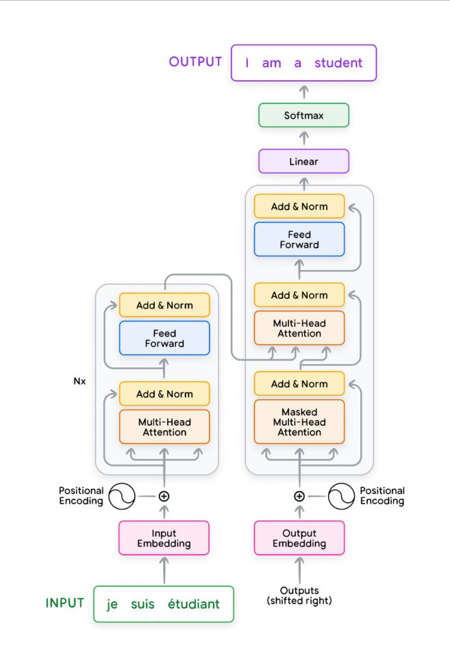
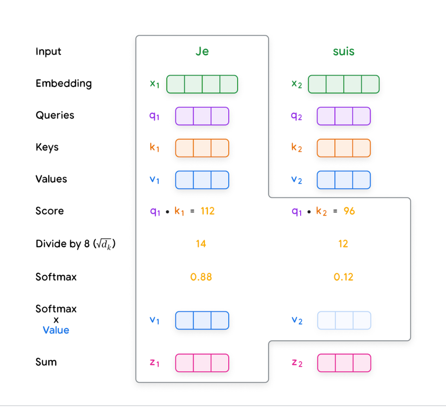
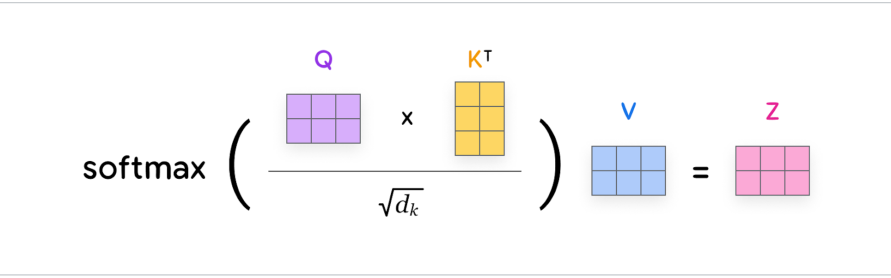
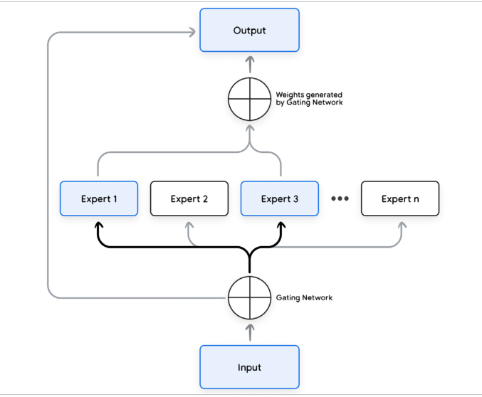

:::info 📚 Về bài dịch này
Đây là bản dịch tiếng Việt của **"Foundational Large Language Models and Text Generation"** (Tác giả: Unknown Author).
Bài được dịch tự động bởi **Aha! Mind Interpreter** — pipeline dịch sách kỹ thuật sử dụng Gemini Flash.

⚠️ *Bản dịch tự động — có thể có lỗi. Vui lòng đối chiếu với bản gốc tiếng Anh khi cần độ chính xác cao.*
:::

<!-- truncate -->

## Các Large Language Model nền tảng & Sinh văn bản

### **Large language models**

Một _mô hình ngôn ngữ_ dự đoán xác suất của một chuỗi các từ. Thông thường, khi được cung cấp một tiền tố văn bản, mô hình ngôn ngữ sẽ gán xác suất cho các từ tiếp theo. Ví dụ, với tiền tố “Thành phố nổi tiếng nhất ở Mỹ là…”, một mô hình ngôn ngữ có thể dự đoán xác suất cao cho các từ “New York” và “Los Angeles”, và xác suất thấp cho các từ “laptop” hoặc “apple”. Chúng ta có thể tạo một mô hình ngôn ngữ cơ bản bằng cách lưu trữ một bảng n-gram [2], trong khi các mô hình ngôn ngữ hiện đại thường dựa trên các mô hình mạng nơ-ron (neural models), chẳng hạn như Transformer.

Trước khi Transformer [1] ra đời, mạng nơ-ron hồi quy (RNNs) là phương pháp phổ biến để mô hình hóa chuỗi. Cụ thể, kiến trúc "bộ nhớ dài-ngắn hạn" (LSTM) và "đơn vị hồi quy có cổng" (GRU) rất phổ biến [3]. Lĩnh vực này bao gồm các bài toán ngôn ngữ như dịch máy, phân loại văn bản, tóm tắt văn bản và trả lời câu hỏi, cùng nhiều bài toán khác. RNNs xử lý các chuỗi đầu vào và đầu ra một cách tuần tự. Chúng tạo ra một chuỗi các trạng thái ẩn (hidden states) dựa trên trạng thái ẩn trước đó và đầu vào hiện tại. Bản chất tuần tự của RNNs khiến chúng tốn nhiều tài nguyên tính toán và khó song song hóa trong quá trình huấn luyện (mặc dù các nghiên cứu gần đây về mô hình không gian trạng thái (tiếng Anh: state space modeling) đang cố gắng khắc phục những thách thức này).

Mặt khác, Transformer là một loại mạng nơ-ron có thể xử lý các chuỗi Token song song nhờ cơ chế Self-Attention [1]. Điều này có nghĩa là Transformer có thể mô hình hóa ngữ cảnh dài hạn hiệu quả hơn và dễ song song hóa hơn so với RNNs. Điều này giúp chúng huấn luyện nhanh hơn đáng kể và mạnh mẽ hơn so với RNNs trong việc xử lý các phụ thuộc dài hạn trong các tác vụ chuỗi dài. Tuy nhiên, chi phí của Self-Attention trong các Transformer nguyên bản là tỷ lệ bậc hai với độ dài ngữ cảnh (context length), điều này giới hạn kích thước của ngữ cảnh. Trong khi đó, RNNs có độ dài ngữ cảnh về mặt lý thuyết là vô hạn. Mặc dù có độ dài ngữ cảnh vô hạn, trên thực tế chúng gặp khó khăn trong việc tận dụng nó do vấn đề gradient biến mất (vanishing gradient problem). Transformer đã trở thành phương pháp phổ biến nhất cho các bài toán mô hình hóa chuỗi và học chuyển giao (transfer learning) trong những năm gần đây.

Tháng 2 năm 2025 8

Mô hình ngôn ngữ lớn nền tảng & Tạo văn bản

Trong phần này, chúng ta sẽ thảo luận về phiên bản đầu tiên của mô hình Transformer và sau đó chuyển sang các mô hình và thuật toán tiên tiến hơn gần đây.

##### **Transformer**

_Kiến trúc Transformer_ được phát triển tại Google vào năm 2017 để sử dụng trong một mô hình dịch thuật [1]. Đây là một mô hình chuỗi-sang-chuỗi (sequence-to-sequence) có khả năng chuyển đổi các chuỗi từ một miền này sang các chuỗi trong một miền khác. Ví dụ, dịch các câu tiếng Pháp sang các câu tiếng Anh. Kiến trúc Transformer nguyên bản bao gồm hai phần: một bộ mã hóa (encoder) và một bộ giải mã (decoder). Bộ mã hóa chuyển đổi văn bản đầu vào (ví dụ: một câu tiếng Pháp) thành một biểu diễn (representation), sau đó được truyền đến bộ giải mã. Bộ giải mã sử dụng biểu diễn này để tạo ra văn bản đầu ra (ví dụ: bản dịch tiếng Anh) một cách tự hồi quy (autoregressively) [1]. Đáng chú ý, kích thước đầu ra của bộ mã hóa Transformer tỷ lệ tuyến tính với kích thước đầu vào của nó. Hình 1 minh họa thiết kế của kiến trúc Transformer nguyên bản.

Transformer bao gồm nhiều tầng. Một tầng trong mạng nơ-ron bao gồm một tập hợp các tham số thực hiện một biến đổi cụ thể trên dữ liệu. Trong sơ đồ, chúng ta có thể thấy một ví dụ về một số tầng bao gồm Multi-Head Attention, Add & Norm, Feed-Forward, Linear, Softmax, v.v. Các tầng có thể được chia nhỏ thành các tầng đầu vào, ẩn và đầu ra. Tầng đầu vào (ví dụ: Input/Output Embedding) là tầng nơi dữ liệu thô đi vào mạng. _Embedding đầu vào_ được sử dụng để biểu diễn các Token đầu vào cho mô hình. _Embedding đầu ra_ được sử dụng để biểu diễn các Token đầu ra mà mô hình dự đoán. Ví dụ, trong một mô hình dịch máy, embedding đầu vào sẽ biểu diễn các từ trong ngôn ngữ nguồn, trong khi embedding đầu ra sẽ biểu diễn các từ trong ngôn ngữ đích. Tầng đầu ra (ví dụ: Softmax) là tầng cuối cùng tạo ra đầu ra của mạng. Các tầng ẩn (ví dụ: Multi-Head Attention) nằm giữa các tầng đầu vào và đầu ra và là nơi điều kỳ diệu xảy ra!

Tháng 2 năm 2025 9

Mô hình ngôn ngữ lớn nền tảng & Tạo văn bản

Hình 1. Transformer nguyên bản [1] (Nguồn ảnh: [5])

Tháng 2 năm 2025 10

Mô hình ngôn ngữ lớn nền tảng & Tạo văn bản

Để hiểu rõ hơn về các tầng khác nhau trong Transformer, chúng ta hãy sử dụng tác vụ dịch từ tiếng Pháp sang tiếng Anh làm ví dụ. Tại đây, chúng ta sẽ giải thích cách một câu tiếng Pháp được đưa vào Transformer và một bản dịch tiếng Anh tương ứng được xuất ra. Chúng ta cũng sẽ mô tả từng thành phần bên trong Transformer từ Hình 1.

###### **Chuẩn bị đầu vào và Embedding**

Để chuẩn bị đầu vào ngôn ngữ cho Transformer, chúng ta chuyển đổi một chuỗi đầu vào thành các Token và sau đó thành các embedding đầu vào. Ở cấp độ cao, một embedding đầu vào là một vector đa chiều [68] biểu diễn ý nghĩa của mỗi Token trong câu. Embedding này sau đó được đưa vào Transformer để xử lý. Việc tạo ra một embedding đầu vào bao gồm các bước sau:

1.  **Chuẩn hóa** (Tùy chọn): Chuẩn hóa văn bản bằng cách loại bỏ các khoảng trắng thừa, dấu phụ, v.v.

2.  **Tokenization**: Phân tách câu thành các từ hoặc từ con và ánh xạ chúng tới các ID Token số nguyên từ một từ vựng.

3.  **Embedding**: Chuyển đổi mỗi ID Token thành vector đa chiều tương ứng của nó, thường sử dụng một bảng tra cứu (lookup table). Các vector này có thể được học trong quá trình huấn luyện.

4.  **Mã hóa vị trí (Positional Encoding)**: Thêm thông tin về vị trí của mỗi Token trong chuỗi để giúp Transformer hiểu thứ tự từ.

Các bước này giúp chuẩn bị đầu vào cho Transformer để chúng có thể hiểu rõ hơn ý nghĩa của văn bản.

Tháng 2 năm 2025 11

Mô hình ngôn ngữ lớn nền tảng & Tạo văn bản

###### **Multi-Head Attention**

Sau khi chuyển đổi các Token đầu vào thành các vector embedding, chúng ta đưa các embedding này vào module Multi-Head Attention (xem Hình 1). Self-Attention là một cơ chế quan trọng trong Transformer; nó cho phép chúng tập trung vào các phần cụ thể của chuỗi đầu vào liên quan đến tác vụ hiện tại và nắm bắt các phụ thuộc tầm xa (long-range dependencies) trong các chuỗi hiệu quả hơn so với các RNN truyền thống.

###### **Hiểu về Self-Attention**

Hãy xem xét câu sau: “Con hổ nhảy ra khỏi cây để uống nước vì nó khát.” Self-Attention giúp xác định mối quan hệ giữa các từ và cụm từ khác nhau trong câu. Ví dụ, trong câu này, “con hổ” và “nó” là cùng một đối tượng, vì vậy chúng ta sẽ mong đợi hai từ này có mối liên hệ mạnh mẽ. Self-Attention đạt được điều này thông qua các bước sau (Hình 2):

1.  **Tạo các query, key và value:** Mỗi embedding đầu vào được nhân với ba ma trận trọng số đã học (Wq, Wk, Wv) để tạo ra các vector query (Q), key (K) và value (V). Chúng giống như các biểu diễn chuyên biệt của mỗi từ.

    -   Query: Vector query giúp mô hình hỏi, “Những từ nào khác trong chuỗi có liên quan đến tôi?”

    -   Key: Vector key giống như một nhãn giúp mô hình xác định một từ có thể liên quan như thế nào đến các từ khác trong chuỗi.

    -   Value: Vector value chứa thông tin nội dung thực tế của từ.

2.  **Tính toán điểm số:** Các điểm số được tính toán để xác định mức độ mỗi từ nên ‘chú ý’ đến các từ khác. Điều này được thực hiện bằng cách lấy tích vô hướng (dot product) của vector query của một từ với các vector key của tất cả các từ trong chuỗi.

Tháng 2 năm 2025 12

Mô hình ngôn ngữ lớn nền tảng & Tạo văn bản

3.  **Chuẩn hóa:** Các điểm số được chia cho căn bậc hai của chiều vector key (dk) để đảm bảo ổn định, sau đó được đưa qua một hàm softmax để thu được các trọng số Attention. Các trọng số này cho biết mức độ mạnh mẽ mà mỗi từ được kết nối với các từ khác.

4.  **Các giá trị có trọng số:** Mỗi vector value được nhân với trọng số Attention tương ứng của nó.

Các kết quả này được tổng hợp lại, tạo ra một biểu diễn (representation) nhận biết ngữ cảnh cho mỗi từ.

Hình 2. Quá trình tính toán Self-Attention trong module Multi-Head Attention [1] (Nguồn ảnh: [5])

Tháng 2 năm 2025 13

Các Large Language Model Nền Tảng & Sinh Văn Bản

Trên thực tế, các phép tính này được thực hiện đồng thời bằng cách xếp chồng các vector query, key và value cho tất cả các Token vào các ma trận Q, K và V, sau đó nhân chúng với nhau như minh họa trong Hình 3.

Hình 3. Hoạt động cơ bản của Attention [1], với Q=query, K=Keys và V=Value, Z=Attention, d_k = chiều của query và key (Nguồn ảnh: [5])

###### **Multi-Head Attention: Sức mạnh từ sự đa dạng**

Multi-Head Attention sử dụng nhiều bộ ma trận trọng số Q, K, V. Các bộ này chạy song song, mỗi ‘head’ có khả năng tập trung vào các khía cạnh khác nhau của mối quan hệ đầu vào. Đầu ra từ mỗi head được nối (concatenate) và biến đổi tuyến tính (linearly transformed), mang lại cho mô hình một biểu diễn phong phú hơn về chuỗi đầu vào.

Việc sử dụng Multi-Head Attention cải thiện khả năng của mô hình trong việc xử lý các mẫu ngôn ngữ phức tạp và các phụ thuộc tầm xa (long-range dependencies). Điều này rất quan trọng đối với các tác vụ đòi hỏi sự hiểu biết sâu sắc về cấu trúc và nội dung ngôn ngữ, chẳng hạn như dịch máy, tóm tắt văn bản và trả lời câu hỏi. Cơ chế này cho phép Transformer xem xét nhiều cách diễn giải và biểu diễn khác nhau của đầu vào, từ đó nâng cao hiệu suất của nó trong các tác vụ này.

Tháng 2 năm 2025 14

Các Large Language Model Nền Tảng & Sinh Văn Bản

###### **Layer Normalization và Residual Connection**

Mỗi layer trong một Transformer, bao gồm một module Multi-Head Attention và một layer feed-forward, đều sử dụng Layer Normalization và Residual Connection. Điều này tương ứng với layer _Add and Norm_ trong Hình 1, trong đó ‘Add’ tương ứng với Residual Connection và ‘Norm’ tương ứng với Layer Normalization. Layer Normalization tính toán giá trị trung bình (mean) và phương sai (variance) của các activation để chuẩn hóa các activation trong một layer nhất định. Việc này thường được thực hiện để giảm covariate shift (tiếng Anh: covariate shift) cũng như cải thiện luồng gradient (gradient flow) nhằm đạt được sự hội tụ nhanh hơn trong quá trình huấn luyện và cải thiện hiệu suất tổng thể.

Residual Connection truyền đầu vào đến đầu ra của một hoặc nhiều layer. Điều này có tác dụng làm cho quy trình tối ưu hóa (optimization procedure) dễ học hơn và cũng giúp xử lý vấn đề vanishing và exploding gradients (tiếng Anh: vanishing and exploding gradients).

Layer _Add and Norm_ được áp dụng cho cả module Multi-Head Attention và layer feed-forward được mô tả trong phần tiếp theo.

###### **Layer Feed-Forward**

Đầu ra của module Multi-Head Attention và layer ‘Add and Norm’ tiếp theo được đưa vào layer feed-forward của mỗi khối Transformer. Layer này áp dụng một phép biến đổi theo vị trí (position-wise transformation) cho dữ liệu, độc lập với từng vị trí trong chuỗi, cho phép tích hợp thêm tính phi tuyến tính (non-linearity) và độ phức tạp vào các biểu diễn của mô hình. Layer feed-forward thường bao gồm hai phép biến đổi tuyến tính (linear transformations) với một hàm kích hoạt phi tuyến tính (non-linear activation function), chẳng hạn như ReLU hoặc GELU, ở giữa. Cấu trúc này bổ sung thêm sức mạnh biểu diễn cho mô hình. Sau khi được xử lý bởi layer feed-forward, dữ liệu trải qua một bước ‘Add and Norm’ khác, góp phần vào sự ổn định và hiệu quả của các mô hình Transformer sâu.

Tháng 2 năm 2025 15

Các Large Language Model Nền Tảng & Sinh Văn Bản

###### **Encoder và Decoder**

Kiến trúc Transformer gốc dựa trên sự kết hợp của các module encoder và decoder. Mỗi encoder và decoder bao gồm một chuỗi các layer, với

mạng cổng (gating network) phân tích đầu vào và tạo ra một phân phối xác suất trên các chuyên gia, cho biết mỗi chuyên gia nên đóng góp bao nhiêu vào kết quả cuối cùng. Các xác suất này sau đó được dùng để trọng số hóa đầu ra của các chuyên gia, và tổ hợp có trọng số này trở thành dự đoán cuối cùng. Điều này cho phép các chuyên gia khác nhau chuyên biệt hóa trong việc xử lý các loại dữ liệu hoặc các tác vụ con cụ thể, cải thiện hiệu suất tổng thể và, thông qua "kích hoạt thưa thớt" (sparse activation), có khả năng giảm chi phí tính toán bằng cách chỉ kích hoạt một tập hợp con các chuyên gia cho bất kỳ đầu vào nào.

Hình 4. Tập hợp các chuyên gia (Mixture of experts ensembling) [70]

Tháng 2 năm 2025 18

Large Language Model Nền Tảng & Sinh Văn Bản

###### **Các Mô Hình Suy Luận Lớn**

Đạt được khả năng suy luận mạnh mẽ trong các Large Model là một nỗ lực phức tạp, đòi hỏi sự kết hợp của các thiết kế kiến trúc, phương pháp đào tạo và chiến lược Prompting. Một khía cạnh quan trọng là việc tích hợp các thiên kiến quy nạp (inductive biases) ưu tiên các mẫu hình thuận lợi cho suy luận. Kiến trúc Transformer, với cơ chế Self-Attention của chúng, là nền tảng, cho phép mô hình đánh giá tầm quan trọng của các phần khác nhau trong chuỗi đầu vào khi tạo ra đầu ra. Tuy nhiên, các Transformer "nguyên bản" (vanilla Transformers) một mình không đủ cho suy luận phức tạp.

Chain-of-Thought Prompting khuyến khích mô hình tạo ra các bước suy luận trung gian trước khi đưa ra câu trả lời cuối cùng. Bằng cách cung cấp các ví dụ về suy luận từng bước trong Prompt, mô hình học cách phân tách các vấn đề phức tạp thành các vấn đề con nhỏ hơn, dễ quản lý hơn. Điều này mô phỏng quá trình suy luận của con người và cải thiện đáng kể hiệu suất trên các tác vụ yêu cầu Inference nhiều bước. Tree-of-Thoughts (tiếng Anh: Tree-of-Thoughts) đưa điều này tiến xa hơn, khám phá nhiều đường dẫn suy luận và sử dụng thuật toán tìm kiếm để tìm ra giải pháp hứa hẹn nhất. Kỹ thuật này hữu ích với cây trò chơi (game trees) hoặc các bài toán tổ hợp. Least-to-Most Prompting (tiếng Anh: Least-to-Most prompting) hướng dẫn mô hình giải quyết các vấn đề con, những vấn đề này ngày càng trở nên phức tạp hơn, và đầu ra của một vấn đề con được sử dụng làm một phần của Prompt cho vấn đề phức tạp hơn tiếp theo.

Fine-tuning trên các tập dữ liệu được thiết kế đặc biệt cho các tác vụ suy luận cũng rất quan trọng. Các tập dữ liệu này có thể chứa các câu đố logic, bài toán toán học hoặc các thử thách suy luận thông thường. Instruction tuning (tiếng Anh: Instruction tuning), nơi mô hình được đào tạo để tuân theo các hướng dẫn ngôn ngữ tự nhiên, tiếp tục nâng cao khả năng hiểu và phản hồi các Prompt suy luận phức tạp của nó. Reinforcement Learning from Human Feedback (RLHF) tinh chỉnh đầu ra của mô hình dựa trên sở thích của con người, cải thiện chất lượng và tính mạch lạc trong suy luận của nó. RLHF hỗ trợ trong các mô hình phần thưởng (reward models) đánh giá khả năng suy luận cũng như "tính hữu ích" (helpfulness).

Tháng 2 năm 2025 19

Large Language Model Nền Tảng & Sinh Văn Bản

Knowledge distillation (tiếng Anh: Knowledge distillation), chuyển giao kiến thức từ một mô hình "giáo viên" (teacher model) lớn hơn, có năng lực hơn sang một mô hình "học sinh" (student model) nhỏ hơn, hiệu quả hơn, có thể được sử dụng để cải thiện khả năng suy luận của các mô hình nhỏ hơn trong khi vẫn duy trì hiệu quả. Cách tiếp cận này cho phép mô hình học sinh học các mẫu suy luận của mô hình giáo viên mà không yêu cầu cùng một lượng tài nguyên tính toán. Trong quá trình Inference, các kỹ thuật như beam search (tiếng Anh: beam search), khám phá nhiều đầu ra ứng cử viên cùng lúc, có thể cải thiện chất lượng suy luận bằng cách xem xét các khả năng khác nhau. Temperature scaling (tiếng Anh: Temperature scaling), điều chỉnh tính ngẫu nhiên của đầu ra mô hình, cũng có thể ảnh hưởng đến sự cân bằng giữa khám phá và khai thác (exploration-exploitation trade-off) trong suy luận. Cuối cùng, việc tích hợp các nguồn kiến thức bên ngoài, chẳng hạn như đồ thị tri thức (knowledge graphs) hoặc cơ sở dữ liệu có cấu trúc, có thể cung cấp cho mô hình thông tin bổ sung để hỗ trợ quá trình suy luận của nó. Điều này có thể đạt được thông qua các kỹ thuật như Retrieval-Augmented Generation, nơi mô hình truy xuất thông tin liên quan từ một nguồn bên ngoài trước khi tạo ra đầu ra. Tất cả các kỹ thuật này, khi kết hợp lại trên nhiều lĩnh vực suy luận, tạo ra các Large Language Model suy luận hoạt động tốt nhất.

###### **Đào tạo Transformer**

Khi nói về các mô hình học máy, điều quan trọng là phải phân biệt giữa đào tạo (training) và Inference. Đào tạo thường đề cập đến việc sửa đổi các tham số của mô hình và liên quan đến các hàm mất mát (loss functions) và lan truyền ngược (backpropagation). Inference là khi mô hình chỉ được sử dụng để tạo ra đầu ra dự đoán, mà không cập nhật trọng số của mô hình. Các tham số mô hình được cố định trong quá trình Inference. Cho đến nay, chúng ta đã tìm hiểu cách các Transformer tạo ra đầu ra trong quá trình Inference. Tiếp theo, chúng ta sẽ tập trung vào cách đào tạo các Transformer để thực hiện một hoặc nhiều tác vụ đã cho.

Tháng 2 năm 2025 20

---

*Made by Anh Tu - Share to be share*
