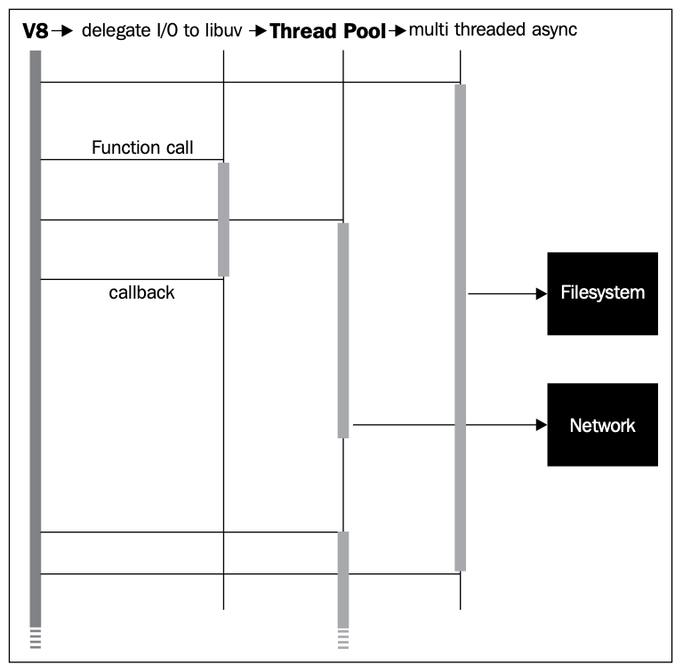

:::info 📚 Về bài viết này
Đây là nội dung được trích xuất từ **"Mastering NodeJS - PACKT"** (Tác giả: Unknown Author).
Bài được extract tự động bởi **Aha! Mind Interpreter**.
:::

<!-- truncate -->

# Understanding the Node Environment

_Node's goal is to provide an easy way to build scalable network programs._

_— Ryan Dahl, creator of Node.js_

The **WWW** ( **World Wide Web** ) makes it possible for hypermedia objects on the
Internet to interconnect, communicating through a standard set of Internet protocols,
commonly **HTTP** ( **Hyper Text Transfer Protocol** ). The growth in the complexity,
number, and type of web applications delivering curated collections of these objects
through the browser has increased interest in technologies that aid in the construction
and management of intricate networked applications. Node is one such technology.
By mastering Node you are learning how to build the next generation of software.

The hold that any one person has on information is tenuous. Complexity follows
scale; confusion follows complexity. As resolution blurs, errors happen.

Similarly, the activity graph describing all expected **I/O** ( **Input/Output** )
interactions an application may potentially form between clients and providers
must be carefully planned and managed, lest the capacity of both the system and
its creator be overwhelmed. This involves controlling two dimensions
of information: volume and shape.

As a network application scales, the volume of information it must recognize,
organize, and maintain increases. This volume, in terms of I/O streams, memory
usage, and **CPU** ( **Central Processing Unit** ) load, expands as more clients connect,
and even as they leave (in terms of persisting user-specific data).

www.EBooksWorld.ir

_Understanding the Node Environment_

This expansion of information volume also burdens the application developer, or
team of developers. Scaling issues begin to present themselves, usually demonstrating
a failure to accurately predict the behavior of large systems from the behavior of small
systems. Can a data layer designed for storing a few thousand records accommodate
a few million? Are the algorithms used to search a handful of records efficient enough
to search many more? Can this server handle 10,000 simultaneous client connections?
The edge of innovation is sharp and cuts quickly, presenting less time for deliberation
precisely when the cost of error is being magnified. The shape of objects comprising
the whole of an application becomes amorphous and difficult to understand,
particularly as ad hoc modifications are made, reactively, in response to dynamic
tension in the system. What is described in a specification as a small subsystem
may have been patched into so many other systems that its actual boundaries are
misunderstood. It becomes impossible to accurately trace the outline of the composite
parts of the whole.

Eventually an application becomes unpredictable. It is dangerous when one
cannot predict all future states of an application, or the side effects of change. Any
number of servers, programming languages, hardware architectures, management
styles, and so on, have attempted to subdue the intractable problem of risk
following growth, of failure menacing success. Oftentimes systems of even greater
complexity are sold as the cure.

Node chose clarity and simplicity instead. There is one thread, bound to an event
loop. Deferred tasks are encapsulated, entering and exiting the execution context
via callbacks. I/O operations generate evented data streams, these piped through
a single stack. Concurrency is managed by the system, abstracting away thread pools
and simplifying memory management. Dependencies and libraries are introduced
through a package management system, neatly encapsulated, and easy to distribute,
install, and invoke.

Experienced developers have all struggled with the problems that Node aims to solve:

  - How to serve many thousands of simultaneous clients efficiently

  - Scaling networked applications beyond a single server

  - Preventing I/O operations from becoming bottlenecks

  - Eliminating single points of failure, thereby ensuring reliability

  - Achieving parallelism safely and predictably

As each year passes, we see collaborative applications and software responsible
for managing levels of concurrency that would have been considered rare just
a few years ago. Managing concurrency, both in terms of connection handling
and application design, is the key to building scalable web architectures.

~~**[ 8 ]**~~

www.EBooksWorld.ir

_Chapter 1_

In this book we will study the techniques professional Node developers use to
tackle these problems. In this chapter, we will explore how a Node application
is designed, the shape and texture of its footprint on a server, and the powerful
base set of tools and features Node provides for developers. Throughout we will
examine progressively more intricate examples demonstrating how Node's simple,
comprehensive, and consistent architecture solves many difficult problems well.

### **Extending JavaScript**

When he designed Node, JavaScript was not Ryan Dahl's original language choice.
Yet, after exploring it, he found a very good modern language without opinions
on streams, the filesystem, handling binary objects, processes, networking, and
other capabilities one would expect to exist in a system's programming language.
JavaScript, strictly limited to the browser, had no use for, and had not implemented,
these features.

Dahl was guided by a few rigid principles:

  - A Node program/process runs on a single thread, ordering execution
through an event loop

  - Web applications are I/O intensive, so the focus should be on making I/O fast

  - Program flow is always directed through asynchronous callbacks

  - Expensive CPU operations should be split off into separate parallel processes,
emitting events as results arrive

  - Complex programs should be assembled from simpler programs

The general principle is, operations must never block. Node's desire for speed
(high concurrency) and efficiency (minimal resource usage) demands the reduction
of waste. A waiting process is a wasteful process, especially when waiting for I/O.

JavaScript's asynchronous, event-driven design fits neatly into this model.
Applications express interest in some future event and are notified when that event
occurs. This common JavaScript pattern should be familiar to you:

Window.onload = function() \{
// When all requested document resources are loaded,
// do something with the resulting environment
\}

element.onclick = function() \{
// Do something when the user clicks on this element
\}

~~**[ 9 ]**~~

www.EBooksWorld.ir

_Understanding the Node Environment_

The time it will take for an I/O action to complete is unknown, so the pattern is to
ask for notification when an I/O event is emitted, whenever that may be, allowing
other operations to be completed in the meantime.

Node adds an enormous amount of new functionality to JavaScript. Primarily, the
additions provide evented I/O libraries offering the developer system access not
available to browser-based JavaScript, such as writing to the filesystem or opening
another system process. Additionally, the environment is designed to be modular,
allowing complex programs to be assembled out of smaller and simpler components.

Let's look at how Node imported JavaScript's event model, extended it, and used
it in the creation of interfaces to powerful system commands.

##### **Events**

Many of the JavaScript extensions in Node emit events. These events are instances
of events.EventEmitter. Any object can extend EventEmitter, providing
the developer with an elegant toolkit for building tight asynchronous interfaces
to object methods.

Work through this example demonstrating how to set an EventEmitter object
as the prototype of a function constructor. As each constructed instance now has
the EventEmitter object exposed to its prototype chain, this provides a natural
reference to the event **API** ( **Application Programming Interface** ). The counter
instance methods can therefore emit events, and these can be listened for. Here we
emit the latest count whenever the counter.increment method is called, and bind
a callback to the incremented event, which simply prints the current counter value
to the command line:

var EventEmitter = require('events').EventEmitter;
var Counter = function(init) \{
this.increment = function() \{
init++;
this.emit('incremented', init);
\}
\}
Counter.prototype = new EventEmitter();
var counter = new Counter(10);
var callback = function(count) \{
console.log(count);
\}
counter.addListener('incremented', callback);

counter.increment(); // 11
counter.increment(); // 12

~~**[ 10 ]**~~

www.EBooksWorld.ir

_Chapter 1_

To remove the event listeners bound to counter, use counter.
removeListener('incremented', callback). For consistency with browser-based
JavaScript, counter.on and counter.addListener are interchangeable.

The addition of EventEmitter as an extensible object greatly increases the
possibilities of JavaScript on the server. In particular, it allows I/O data streams
to be handled in an event-oriented manner, in keeping with the Node's principle
of asynchronous, non-blocking programming:

var Readable = require('stream').Readable;
var readable = new Readable;
var count = 0;

readable._read = function() \{
if(++count > 10) \{
return readable.push(null);
\}
setTimeout(function() \{
readable.push(count + "\n");
\}, 500);
\};
readable.pipe(process.stdout);

In this program we are creating a Readable stream and piping any data pushed into
this stream to process.stdout. Every 500 milliseconds we increment a counter and
push that number (adding a newline) onto the stream, resulting in an incrementing
series of numbers being written to the terminal. When our series has reached its
limit (10), we push null onto the stream, causing it to terminate. Don't worry if you
don't fully understand how Readable is implemented here—streams will be fully
explained in the following chapters. Simply note how the act of pushing data onto
a stream causes a corresponding event to fire, how the developer can assign a custom
callback to handle this event, and how newly added data can be redirected to other
streams. Node is designed such that I/O operations are consistently implemented
as asynchronous, evented data streams.

It is also important to note the importance of this style of I/O. Because Node's event
loop need only commit resources to handling callbacks, many other instructions can
be processed in the down time between each interval.

As an exercise, re-implement the previous code snippet such that the emitted data
is piped to a file. You'll need to use fs.createWriteStream:

var fs = require('fs');
var writeStream = fs.createWriteStream("./counter", \{
flags : 'w',
mode: 0666
\});

~~**[ 11 ]**~~

www.EBooksWorld.ir

_Understanding the Node Environment_
##### **Modularity**

In his book _The Art of Unix Programming_, _Eric Raymond_ proposed the **Rule**
**of Modularity** :

_Developers should build a program out of simple parts connected by well defined_
_interfaces, so problems are local, and parts of the program can be replaced in_
_future versions to support new features. This rule aims to save time on debugging_
_complex code that is complex, long, and unreadable._

This idea of building complex systems out of small pieces, loosely joined is seen
in the management theory, theories of government, physical manufacturing, and
many other contexts. In terms of software development, it advises developers to
contribute only the simplest and most useful component necessary within a larger
system. Large systems are hard to reason about, especially if the boundaries of its
components are fuzzy.

One of the primary difficulties when constructing scalable JavaScript programs
is the lack of a standard interface for assembling a coherent program out of many
smaller ones. For example, a typical web application might load dependencies using
a sequence of &lt;script> tags in the &lt;head> section of an HTML document:

&lt;head>
&lt;script src="fileA.js">&lt;/script>
&lt;script src="fileB.js">&lt;/script>
&lt;/head>

There are many problems with this sort of solution:

1. All potential dependencies must be declared prior to being needed—
dynamic inclusion requires complicated hacks.
2. The introduced scripts are not forcibly encapsulated—nothing stops code
in both files from writing to the same global object. Namespaces can easily
collide, making arbitrary injection dangerous.
3. fileA cannot address fileB as a collection—an addressable context such as
fileB.method isn't available.
4. The &lt;script> method itself isn't systematic, precluding the design of useful
module services, such as dependency awareness or version control.
5. Scripts cannot be easily removed, or overridden.
6. Because of these dangers and difficulties, sharing is not effortless,
diminishing opportunities for collaboration in an open ecosystem.

Ambivalently inserting unpredictable code fragments into an application frustrates
attempts to predictably shape functionality. What is needed is a standard way to
load and share discreet program modules.

~~**[ 12 ]**~~

www.EBooksWorld.ir

_Chapter 1_

Accordingly, Node introduced the concept of the **package**, following the CommonJS
specification. A package is a collection of program files bundled with a manifest
file describing the collection. Dependencies, authorship, purpose, structure, and
other important meta-data are exposed in a standard way. This encourages the
construction of large systems from many small, interdependent systems. Perhaps
even more importantly, it encourages sharing:

_What I'm describing here is not a technical problem. It's a matter of people getting_
_together and making a decision to step forward and start building up something_
_bigger and cooler together._

  - _Kevin Dangoor_, creator of CommonJS

In many ways the success of Node is due to growth in the number and quality
of packages available to the developer community, distributed via Node's package
management system, **npm** . The design choices of this system, both social and
technical, have done much to help make JavaScript a viable professional option
for systems programming.

More extensive information on creating and managing Node packages can be found
in _Appendix A_, _Organizing Your Work_ . The key point is this: build programs out of
packages where possible, and share those packages when possible. The shape of
your applications will be clearer and easier to maintain. Importantly, the efforts of
thousands of other developers can be linked into applications via npm, directly by
inclusion, and indirectly as shared packages are tested, improved, refactored, and
repurposed by members of the Node community.

Contrary to popular belief, npm is not an abbreviation for **Node Package**
**Manager** (or even an acronym):

https://npmjs.org/doc/faq.html#If-npm-is-an-acronymwhy-is-it-never-capitalized

##### **The Network**

I/O in the browser is mercilessly hobbled, for very good reasons—if the JavaScript
on any given website could access your filesystem, or open up network connections
to any server, the WWW would be a less fun place.

For Node, I/O is of fundamental importance, and its focus from the start was to
simplify the creation of scalable systems with high I/O requirements. It is likely
that your first experience with Node was in writing an HTTP server.

~~**[ 13 ]**~~

www.EBooksWorld.ir

_Understanding the Node Environment_

Node supports several standard network protocols in addition to HTTP, such
as **TLS** / **SSL** ( **Transport Layer Security/Secure Sockets Layer** ), and **UDP** ( **User**
**Datagram Protocol** ). With these tools we can easily build scalable network programs,
moving well beyond the somewhat dated **AJAX** ( **Asynchronous JavaScript And**
**Xml** ) techniques familiar to the JavaScript developer.

Let's create a simple program that allows the user to send data between two
UDP servers:

var dgram = require('dgram');
var client = dgram.createSocket("udp4");
var server = dgram.createSocket("udp4");

var message = process.argv[2] || "message";

message = new Buffer(message);

server
.on("message", function (msg) \{
process.stdout.write("Got message: " + msg + "\n");
process.exit();

\})
.bind(41234);

client.send(message, 0, message.length, 41234, "localhost");

Assuming a program file name of udp.js a message can be sent via UDP by running
this program from the terminal like so:

node udp.js "my message"

Which will result in the following output:

Got message: my message

We first establish our UDP servers, one working as a broadcaster, the other as
a listener. process.argv contains useful command information, including
command-line arguments commencing at index(2), which in this case would
contain "my message". UDP requires messages to be Buffer objects, so we ensure
that some message exists and convert it.

A UDP server is an instance of EventEmitter, emitting a message event when
messages are received on the port it is bound. This server simply echoes the received
message. All that is left to do is send the message, which action is performed by
the client, passing along our message to port #41234.

~~**[ 14 ]**~~

www.EBooksWorld.ir

_Chapter 1_

Moving streams of data around the I/O layer of your application is simplified within
Node. It isn't difficult to share data streams across differing protocol servers, as data
streams are standardized via Node's interfaces. Protocol details are handled for you.

Let's continue to explore I/O, the process object, and events. First, let's dig into the
machine powering Node's core.

### **V8**

V8 is Google's JavaScript engine, written in C++. It compiles and executes JavaScript
code inside of a **VM** ( **Virtual Machine** ). When a webpage loaded into Google
Chrome demonstrates some sort of dynamic effect, like automatically updating
a list or news feed, you are seeing JavaScript, compiled by V8, at work.

While Node itself will efficiently manage I/O operations, its process object
refers to the V8 runtime. As such, it is important to understand how to configure
the V8 environment, especially as your application grows in size.

By typing node -h into a console, something like the following will be displayed:

We can see how a list of V8 options is accessible via the –-v8-options flag.

The list of configuration options for V8 is a long one, so we're not going to cover
each option here. As we progress through the book, relevant options will be
discussed with more depth. It is nevertheless useful to summarize some of the
options provided for managing system limits and memory, as well as those used
to configure JavaScript's command set, introducing some of the new features in
**ES6** ( **EcmaScript6** ), often referred to as **Harmony** .

The version of V8 used by your Node installation can be viewed by typing:

node –e "console.log(process.versions.v8)"

~~**[ 15 ]**~~

www.EBooksWorld.ir

_Understanding the Node Environment_
##### **Memory and other limits**

One very powerful V8 configuration option is important enough to make it into Node's
own collection: --max-stack-size. Let's look into some of the new powers a Node
developer has been given in being able to configure a specific JavaScript runtime.

Trying to break a system is an excellent way to discover its limits and shape. Let's
write a program that will crash V8:

var count = 0;
(function curse() \{
console.log(++count);
curse();
\})()

This self-contained, self-executing function will recursively call itself forever, or until
it is forced to stop. Each iteration of curse adds another frame to the call stack. This
uncontrolled growth will eventually cause the JavaScript runtime to collapse, citing
a RangeError: Maximum call stack size exceeded.

The purpose of --max-stack-size should now be clear. The direct V8 option
equivalent is –-stack_size, which is passed a value, in **KB** ( **Kilobytes** ), to raise this
limit. Experiment with the above program, noting the number of iterations possible
at different settings.

While it is likely that hitting this limit represents an incorrectly designed algorithm,
being able to expand the width of the operating space available to a Node process
adds to the collection of solutions available to developers.

On 32 bit and 64 bit machines V8's memory allocation defaults are, respectively,
700 MB and 1400 MB. In newer versions of V8, memory limits on 64 bit systems are
no longer set by V8, theoretically indicating no limit. However, the **OS** ( **Operating**
**System** ) on which Node is running can always limit the amount of memory V8 can
take, so the true limit of any given process cannot be generally stated.

V8 makes available the --max_old_space_size option, which allows control over
the amount of memory available to a process, accepting a value in MB. Should you
need to increase memory allocation, simply pass this option the desired value when
spawning a Node process.

It is often an excellent strategy to reduce the available memory allocation for a
given Node instance, especially when running many instances. As with stack limits,
consider whether massive memory needs are better delegated to a dedicated storage
layer, such as an in-memory database or similar.

~~**[ 16 ]**~~

www.EBooksWorld.ir

_Chapter 1_

An informative discussion with the V8 team regarding their views
on how memory should be allocated can be found here:

http://code.google.com/p/v8/issues/detail?id=847

One of the key advantages of modern high-level languages such as JavaScript is the
automatic management of memory through **GC** ( **Garbage Collection** ). GC strategies
are many and complex, yet all follow a simple core idea: every so often, free allocated
memory that is no longer being used.

The drawback of automatic GC is that it puts a slight brake on process speed. While
the clear advantages of automatic GC outweigh its drawbacks in the majority of
cases, there remains for the Node developer an opportunity to control some of its
behavior. This is primarily done via the flags –-nouse_idle_notification and
–-expose_gc.

Passing the –-nouse_idle_notification flag will tell V8 to ignore idle notification
calls from Node, which are requests to V8 asking it to run GC immediately, as
the Node process is currently idle. Because Node is aggressive with these calls
(efficiency breeds clean slates), an excess of GC may slow down your application.
Note that using this flag does not disable GC; GC simply runs less often. In the right
circumstances this technique can increase performance.

--expose_gc introduces a new global method to the Node process, gc(), which
allows JavaScript code to manually start the GC process. In conjunction with
–-nouse_idle_notification the developer can now control to some degree how
often GC runs. At any point in my JavaScript code I can simply call gc() and start
the collector.

Being able to adjust memory usage and GC is certainly useful. Remember that
application volume can rapidly rise in unpredictable ways. If the memory footprint
of your application holds steady near the very limits of V8's allocation, you should
begin to think about scaling horizontally. Use memory wisely, and split off new
Node instances where appropriate.

~~**[ 17 ]**~~

www.EBooksWorld.ir

_Understanding the Node Environment_
##### **Harmony**

JavaScript has never stopped evolving and it is now experiencing something of a
renaissance, helped in no small part by the popularity of Node. The language's next
version, named Harmony, introduces some significant new features and concepts.

More information on ES6 Harmony can be found at:
http://wiki.ecmascript.org/doku.php?id=harmony:harmony.

The available Harmony options are:

**Flag** **Description**

--harmony_typeof Enable semantics for typeof

--harmony_scoping Enable block scoping

--harmony_modules Enable modules (implies block scoping)

--harmony_proxies Enable proxies

--harmony_collections Enable collections (sets, maps, and weak maps)

--harmony Enable all features (except typeof)

It is beyond the scope of this book to discuss these new features in any depth.
Nonetheless, it should be stated that this ability to use the very latest JavaScript
features, now, through Node, offers the developer a great advantage—there is no
browser war on a server to hold back innovation.

For example, ES6's weakMap allows the use of non-strings as keys in a HashMap:

"use strict"
let owners = new WeakMap();
let task = \{
title : "Big Project"
\};
owners.set(task, 'John');
function owner(task) \{
if(owners.has(task)) \{
return console.log(owners.get(task));
\}
console.log("No owner for this task.");
\}
owner(task); // "John"
owner(\{\}); // "No owner for this task"

As an exercise, the reader might map (fixed) input streams to (variable) output
streams in a similar manner.

~~**[ 18 ]**~~

www.EBooksWorld.ir

_Chapter 1_
### **The process object**

By now it should be clear as to how Node is structured, in terms of V8, the event
loop, and so forth. We are now going to discuss, in detail, how instructions that you
write (a JavaScript program) are compiled by V8 into a list of instructions whose
execution context is accessible via the native Node process object.

The single thread forming the spine of Node's event loop is V8's event loop. When
I/O operations are initiated within this loop they are delegated to **libuv**, which
manages the request using its own (multi-threaded, asynchronous) environment.
libuv announces the completion of I/O operations, allowing any callbacks waiting
on this event to be re-introduced to the main V8 thread for execution:

~~**[ 19 ]**~~

www.EBooksWorld.ir

_Understanding the Node Environment_

Node's process object provides information on and control over the current running
process. It is an instance of EventEmitter, is accessible from any scope, and exposes
very useful low-level pointers. Consider the following program:

var size = process.argv[2];
var totl = process.argv[3] || 100;
var buff = [];
for(var i=0; i < totl; i++) \{
buff.push(new Buffer(size));
process.stdout.write(process.memoryUsage().heapTotal + "\n");
\}

**Downloading the example code:**

You can download the example code files for all Packt books you have
purchased from your account at http://www.packtpub.com. If you
purchased this book elsewhere, you can visit http://www.packtpub.
com/support and register to have the files e-mailed directly to you.

Assuming the program file is named process.js, it would be executed like so:

- node process.js 1000000 100

This execution context first fetches the two command-line arguments via process.
argv, builds a looping construct that grows memory usage depending on these
arguments, and emits memory usage data as each new allocation is made. The
program sends output to stdout, but could alternatively stream output to other
processes, or even a file:

- node process.js 1000000 100 > out.file

In fact, the familiar console.log is implemented in the Node core as a wrapper
around process.stdout.write:

console.log = function (d) \{
process.stdout.write(d + '\n');
\};

A Node process begins by constructing a single execution stack, with the global
context forming the base of the stack. Functions on this stack execute within their
own, local, context (sometimes referred to as scope), which remains enclosed within
the global context (which you'll hear referred to as closure). Because Node is evented,
any given execution context can commit the running thread to handling an eventual
execution context. This is the purpose of callback functions.

~~**[ 20 ]**~~

www.EBooksWorld.ir

_Chapter 1_

Consider the following schematic of a simple interface for accessing the filesystem:

If we were to instantiate Filesystem and call readDir a nested execution context
structure would be created: (global (fileSystem (readDir (anonymous function) ) )
). The concomitant execution stack is introduced to Node's single process thread.
This stack remains in memory until libuv reports that fs.readdir has completed,
at which point the registered anonymous callback fires, resolving the sole pending
execution context. As no further events are pending, and the maintenance of
closures no longer necessary, the entire structure can be safely torn down (in reverse,
beginning with anonymous), and the process can exit, freeing any allocated memory.
This method of building up and tearing down a single stack is what Node's event
loop is ultimately doing.

We'll explore the full suite of commands and attributes contained by the process
object as we continue to develop examples and libraries in this book.

### **The Read-Eval-Print Loop and executing** **a Node program**

Node's **REPL** ( **Read-Eval-Print-Loop** ) represents the Node shell. To enter the shell
prompt, enter Node via your terminal without passing a filename:

- node

You now have access to a running Node process, and may pass JavaScript
commands to this process. For example, after entering 2+2 the shell would send 4 to
stdout. Node's REPL is an excellent place to try out, debug, test, or otherwise play
with JavaScript code.

~~**[ 21 ]**~~

www.EBooksWorld.ir

_Understanding the Node Environment_

Because the REPL is a native object, programs can also use instances as a context in
which to run JavaScript interactively. For example, here we create our own custom
function sayHello, add it to the context of a REPL instance, and start the REPL,
emulating a Node shell prompt:

require('repl').start("> ").context.sayHello = function() \{
return "Hello"
\};

Entering sayHello() at the prompt will result in Hello being sent to stdout.

Let's take everything we've learned in this chapter and create an interactive REPL
which allows us to execute JavaScript on a remote server.

Create two files, repl_client.js and repl_server.js, using the following code,
and run each in its own terminal window, such that both terminal windows are
visible to you.

/* repl_client.js */
var net = require('net');
var sock = net.connect(8080);
process.stdin.pipe(sock);
sock.pipe(process.stdout);

/* repl_server.js */
var repl = require('repl')
var net = require('net')
net.createServer(function(socket) \{
repl
.start(\{
prompt : '> ',
input : socket,
output : socket,
terminal : true
\})
.on('exit', function () \{
socket.end()
\})
\}).listen(8080)

repl_client simply creates a new socket connection to port 8080 through net.
connect, and pipes any data coming from stdin (your terminal) through that socket.
Similarly, any data arriving from the socket is piped to stdout (your terminal).
It should be clear that we have created a way to take input and send it via a socket
to port 8080, listening for any data that the socket may send back to us.

~~**[ 22 ]**~~

www.EBooksWorld.ir

_Chapter 1_

repl_server closes the loop. We first create a new **TCP** ( **Transmission Control**
**Protocol** ) server with net.createServer, binding to port 8080 via .listen. The
callback passed to net.createServer will receive a reference to the bound socket.
Within the enclosure of that callback we instantiate a new REPL instance, giving it
a nice prompt (> here, but could be any string), indicating that it should both listen
for input from, and broadcast output to, the passed socket reference, indicating that
the socket data should be treated as terminal data (which has special encoding).

We can now type something like console.log("hello") into the client terminal,
and see hello displayed.

To confirm that the execution of our JavaScript commands is occurring in the server
instance, type console.log(process.argv) into the client, and the server will display
an object containing the current process path, which will be repl_server.js.

It should be clear from this demonstration that we have created a way to remotely
control Node processes. It is a short step from here to multi-node analytics tools,
remote memory management, automatic server administration, and so forth.

### **Summary**

In this chapter we've outlined the key problems Node's designers sought to solve,
and how their solution has made the creation of easily scalable, high-concurrency
networked systems easier for an open community of developers. We've seen how
JavaScript has been given very useful new powers, how its evented model has been
extended, and how V8 can be configured to further customize the JavaScript runtime.

Through examples, we've learned how I/O is handled by Node, how to program the
REPL, as well as how to manage inputs and outputs to the process object. The goal
of demonstrating how Node allows applications to be intelligently constructed out
of well-formed pieces in a principled way has begun. In the next chapter, we will
delve deeper into asynchronous programming, learn how to manage more complex
event chains, and develop more powerful programs using Node's model.

~~**[ 23 ]**~~

www.EBooksWorld.ir

---

*Made by Anh Tu - Share to be share*
