import Term from '@site/src/components/Term';

> Bài viết được biên dịch tự động bởi **Aha! Mind Socratic Engine**. Nguồn bài viết: [Link gốc](https://cameronrwolfe.substack.com/p/understanding-and-using-supervised)

<!-- truncate -->
[

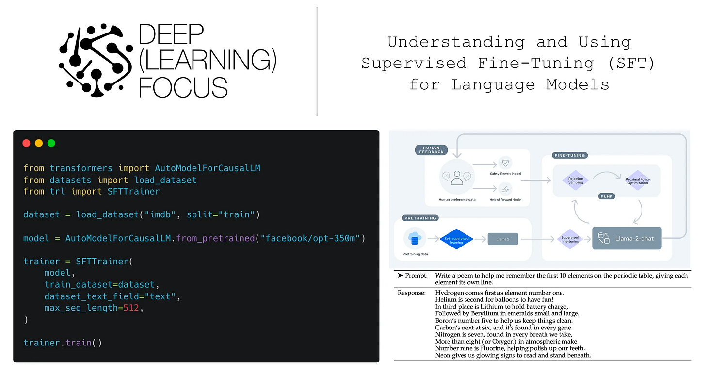

](https://substackcdn.com/image/fetch/$s_!gKOx!,f_auto,q_auto:good,fl_progressive:steep/https%3A%2F%2Fsubstack-post-media.s3.amazonaws.com%2Fpublic%2Fimages%2F02a4b239-ce73-427a-9656-b6de09ea26cf_2206x1180.png)

(from \[5\])

Large language models (LLMs) are typically trained in several stages, including <Term definition="Giai đoạn đầu trong quá trình huấn luyện mô hình, nơi mô hình học từ một tập dữ liệu lớn mà không có nhãn để phát triển khả năng hiểu ngôn ngữ. (Ví dụ: Giống như việc học một ngôn ngữ mới trước khi tham gia vào các cuộc hội thoại thực tế.)">pretraining</Term> and several <Term definition="Quá trình điều chỉnh một mô hình đã được huấn luyện trước đó để cải thiện hiệu suất của nó trên một nhiệm vụ cụ thể. (Ví dụ: Giống như việc điều chỉnh âm thanh của một nhạc cụ để nó phát ra âm thanh hoàn hảo.)">fine-tuning</Term> stages; see below. Although [pretraining is expensive](https://www.mosaicml.com/blog/gpt-3-quality-for-500k) (i.e., several hundred thousand dollars in compute), fine-tuning an LLM (or performing <Term definition="Kỹ thuật mà mô hình học từ ngữ cảnh xung quanh một nhiệm vụ cụ thể mà không cần phải điều chỉnh lại mô hình. (Ví dụ: Giống như việc học cách làm món ăn mới chỉ bằng cách nhìn vào công thức.)">in-context learning</Term>) is cheap in comparison (i.e., several hundred dollars, or less). Given that high-quality, pretrained LLMs (e.g., [MPT](https://cameronrwolfe.substack.com/p/democratizing-ai-mosaicmls-impact), [Falcon](https://cameronrwolfe.substack.com/p/falcon-the-pinnacle-of-open-source), or [LLAMA-2](https://cameronrwolfe.substack.com/p/llama-2-from-the-ground-up)) are widely available and free to use (even commercially), we can build a variety of powerful applications by fine-tuning LLMs on relevant tasks.

[

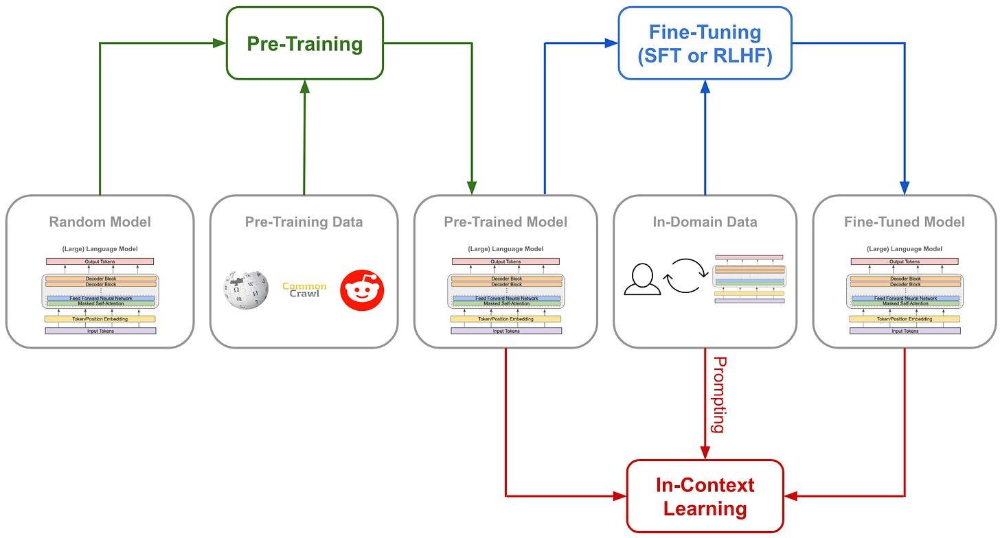

](https://substackcdn.com/image/fetch/$s_!wEtP!,f_auto,q_auto:good,fl_progressive:steep/https%3A%2F%2Fsubstack-post-media.s3.amazonaws.com%2Fpublic%2Fimages%2F4c51db77-8d97-45a9-bd2c-d71e930ff0b8_2292x1234.png)

Different stages of training for an LLM

One of the most widely-used forms of fine-tuning for LLMs within recent AI research is <Term definition="Là một kỹ thuật trong học máy, nơi mô hình được tinh chỉnh dựa trên một tập dữ liệu đã được gán nhãn, giúp mô hình học cách phản hồi theo cách mong muốn. (Ví dụ: Giống như một giáo viên hướng dẫn học sinh cách làm bài tập đúng cách.)">supervised fine-tuning</Term> (SFT). This approach curates a <Term definition="Một tập hợp dữ liệu được sử dụng để huấn luyện mô hình, thường bao gồm các ví dụ đã được gán nhãn. (Ví dụ: Giống như một bộ sưu tập các bức tranh để học cách vẽ.)">dataset</Term> of high-quality LLM outputs over which the model is directly fine-tuned using a standard language modeling objective. SFT is simple/cheap to use and a useful tool for aligning language models, which has made is popular within the open-source LLM research community and beyond. Within this overview, we will outline the idea behind SFT, look at relevant research on this topic, and provide examples of how practitioners can easily use SFT with only a few lines of Python code.

To gain a deep understanding of SFT, we need to have a baseline understanding of language models (and deep learning in general). Let’s cover some relevant background information and briefly refresh a few ideas that will be important.

**AI Basics.** In my opinion, the best resource for learning about AI and deep learning fundamentals is the _[Practical Deep Learning for Coders](https://course.fast.ai/)_ course from [fast.ai](https://www.fast.ai/). This course is extremely practical and oriented in a top-down manner, meaning that you learn how to implement ideas in code and use all the relevant tools first, then dig deeper into the details afterwards to understand how everything works. If you’re new to the space and want to quickly get a working understanding of AI-related tools, how to use them, and how they work, start with these videos.

**Language models.** SFT is a popular fine-tuning technique for LLMs. As such, we need to have a baseline understanding of language models. The resources below can be used to gain a quick understanding of how these models work:

*   _Transformer Architecture_ \[[link](https://cameronrwolfe.substack.com/i/136366740/the-transformer-from-top-to-bottom)\]: Nearly all modern language models—_and many other deep learning models_—are based upon this architecture.
    
*   _Decoder-only Transformers_ \[[link](https://twitter.com/cwolferesearch/status/1640446111348555776?s=20)\]: This is the specific variant of the <Term definition="Một loại kiến trúc mạng nơ-ron được sử dụng phổ biến trong các mô hình ngôn ngữ hiện đại, cho phép xử lý dữ liệu theo cách hiệu quả hơn. (Ví dụ: Giống như một thiết kế nhà thông minh giúp tối ưu hóa không gian sống.)">transformer architecture</Term> that is used by most generative LLMs.
    
*   _Brief History of LLMs_ \[[link](https://twitter.com/cwolferesearch/status/1639378997627826176?s=20)\]: LLMs have gone through several phases from the creation of [GPT](https://cameronrwolfe.substack.com/i/85568430/improving-language-understanding-by-generative-pre-training-gpt) \[1\] to the release of ChatGPT.
    
*   _Next token prediction_ \[[link](https://cameronrwolfe.substack.com/i/136638774/understanding-next-token-prediction)\]: this [self-supervised](https://cameronrwolfe.substack.com/i/76273144/self-supervised-learning) training objective underlies nearly all LLM functionality and is used by SFT!
    
*   _Language Model Pretraining_ \[[link](https://cameronrwolfe.substack.com/i/136638774/language-model-pretraining)\]: language models are pretrained over a massive, unlabeled textual corpus.
    
*   _Language Model Inference_ \[[link](https://cameronrwolfe.substack.com/i/136638774/<Term definition="Một phương pháp trong đó mô hình dự đoán các giá trị tiếp theo trong một chuỗi dựa trên các giá trị trước đó. (Ví dụ: Giống như việc viết một câu từng từ một, mỗi từ phụ thuộc vào từ trước đó.)">autoregressive</Term>-inference-process)\]: language models can be used to generate coherent sequences of text via autoregressive <Term definition="Một nhiệm vụ trong học máy mà mô hình dự đoán từ tiếp theo trong một chuỗi văn bản dựa trên các từ trước đó. (Ví dụ: Giống như việc đoán từ tiếp theo trong một câu khi bạn đang đọc.)">next token prediction</Term>.
    

**Transformers library.** The code in this overview relies upon the [transformers library](https://huggingface.co/docs/transformers/index), which is one of the most powerful deep learning libraries out there. Plus, the library has a ton of tutorials and documentation that serve as a practical learning resource for any deep learning or LLM-related project.

[

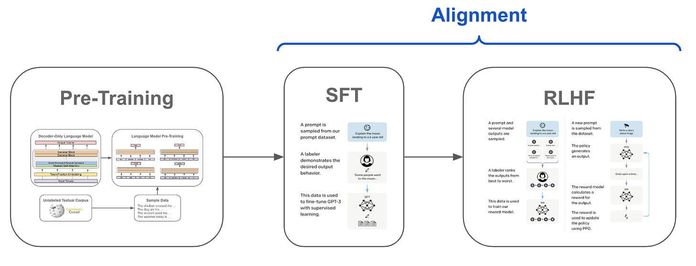

](https://substackcdn.com/image/fetch/$s_!HgRZ!,f_auto,q_auto:good,fl_progressive:steep/https%3A%2F%2Fsubstack-post-media.s3.amazonaws.com%2Fpublic%2Fimages%2Ffb9d0144-3952-42db-8382-8e2eb37d917e_1670x640.png)

(from \[2\])

**Training LLMs.** The training process for language models typically proceeds in three phases; see above. First, we pretrain the language model, which is (by far) the most computationally-expensive step of training. From here, we perform <Term definition="Quá trình điều chỉnh mô hình ngôn ngữ để nó phản hồi theo cách mà người dùng mong muốn, cải thiện tính hữu ích và an toàn của nó. (Ví dụ: Giống như việc điều chỉnh một chiếc xe để nó chạy đúng hướng.)">alignment</Term>, typically via the [<Term definition="Một quy trình gồm ba bước được sử dụng để cải thiện hành vi của mô hình ngôn ngữ thông qua SFT và RLHF. (Ví dụ: Giống như một công thức nấu ăn với ba bước để tạo ra món ăn hoàn hảo.)">three-step framework</Term>](https://cameronrwolfe.substack.com/i/93578656/refining-llm-behavior) (see below) with supervised fine-tuning (SFT) and reinforcement learning from human feedback (RLHF)[1](#footnote-1).

[

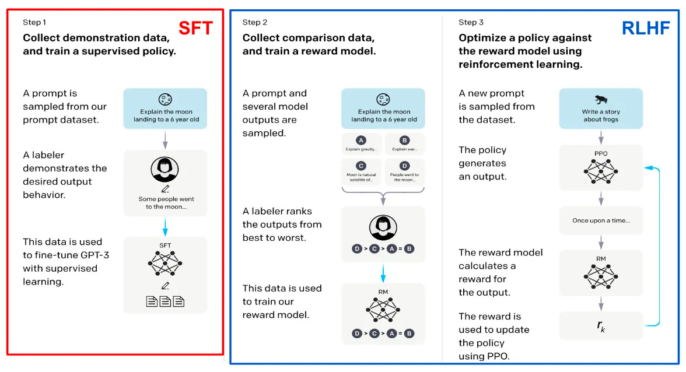

](https://substackcdn.com/image/fetch/$s_!rGUE!,f_auto,q_auto:good,fl_progressive:steep/https%3A%2F%2Fsubstack-post-media.s3.amazonaws.com%2Fpublic%2Fimages%2F680ffa81-7b96-474f-832b-4be758e8d2e6_1176x638.png)

(from \[2\])

The steps outlined above form the <Term definition="Một quy trình huấn luyện được chuẩn hóa, thường được sử dụng cho các mô hình ngôn ngữ hiện đại để đảm bảo tính nhất quán và hiệu quả. (Ví dụ: Giống như một dây chuyền sản xuất đảm bảo mọi sản phẩm đều đạt tiêu chuẩn.)">standardized training pipeline</Term> that is used for most state-of-the-art LLMs (e.g., ChatGPT or LLaMA-2 \[3\]). SFT and RLHF are <Term definition="Chỉ việc tiêu tốn ít tài nguyên máy tính để thực hiện một tác vụ, thường là thời gian và sức mạnh xử lý. (Ví dụ: Giống như việc nấu ăn nhanh chóng với ít nguyên liệu.)">computationally cheap</Term> compared to pretraining, but they require the curation of a dataset—either of high-quality LLM outputs or human feedback on LLM outputs_—_which can be difficult and time consuming.

Sometimes we have to do a bit more when applying an LLM to solve a downstream task. In particular, we can further specialize a language model (if needed) either via <Term definition="Quá trình tinh chỉnh mô hình cho một lĩnh vực hoặc nhiệm vụ cụ thể, giúp cải thiện hiệu suất trong lĩnh vực đó. (Ví dụ: Giống như việc học một môn học cụ thể để trở thành chuyên gia trong lĩnh vực đó.)">domain-specific fine-tuning</Term> or [in-context learning](https://cameronrwolfe.substack.com/i/123558334/different-types-of-learning); see below. Domain-specific fine-tuning simply trains the model further—_usually via a [language modeling objective](https://cameronrwolfe.substack.com/i/85568430/language-modeling), similarly to pretraining/SFT_—on data that is relevant to the downstream task, while in-context learning adds extra context or examples into the language model’s prompt to be used as context for solving a problem.

[

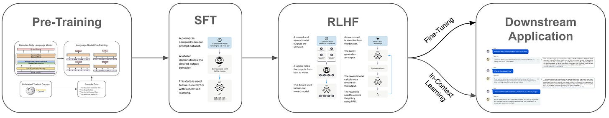

](https://substackcdn.com/image/fetch/$s_!WGff!,f_auto,q_auto:good,fl_progressive:steep/https%3A%2F%2Fsubstack-post-media.s3.amazonaws.com%2Fpublic%2Fimages%2Fb5dd2fe9-0f4d-40d7-bc83-f00da6592de9_2396x466.png)

(from \[2, 4\])

**What is alignment?** Finally, there is a term we have used several times in the above discussion that is important to understand: _alignment_. A pretrained language model is usually not useful. If we generate output with this model, the results will probably be repetitive and not very helpful. To create a more useful language model, we have to _align_ this model to the desires of the human user. In other words, instead of generating the most likely textual sequence, our language model learns to generate the textual sequence that is desired by a user.

> _“For our collection of preference annotations, we focus on <Term definition="Mức độ mà một mô hình có thể cung cấp thông tin hoặc hỗ trợ người dùng trong việc giải quyết vấn đề. (Ví dụ: Giống như một người bạn luôn sẵn sàng giúp đỡ khi bạn cần.)">helpfulness</Term> and <Term definition="Khía cạnh đảm bảo rằng các phản hồi của mô hình không gây hại hoặc không an toàn cho người dùng. (Ví dụ: Giống như việc kiểm tra an toàn của một sản phẩm trước khi sử dụng.)">safety</Term>. Helpfulness refers to how well Llama 2-Chat responses fulfill users’ requests and provide requested information; safety refers to whether Llama 2-Chat’s responses are unsafe.”_ - from \[5\]

Such alignment, which is accomplished via the three-step framework with SFT and RLHF outlined above, can be used to encourage a variety of behaviors and properties within an LLM. Typically, those training the model select a set of one or a few criteria that are emphasized throughout the alignment process. Common alignment criteria include: improving <Term definition="Khả năng của mô hình trong việc hiểu và thực hiện các hướng dẫn hoặc yêu cầu từ người dùng. (Ví dụ: Giống như một học sinh làm theo hướng dẫn của giáo viên.)">instruction following capabilities</Term>, discouraging harmful output, making the LLM more helpful, and many more. For example, [LLaMA-2](https://cameronrwolfe.substack.com/p/llama-2-from-the-ground-up) \[5\] is aligned to be _i)_ helpful and _ii)_ harmless/safe; see above.

Supervised fine-tuning (SFT) is the first training step within the alignment process for LLMs, and it is actually quite simple. First, we need to curate a dataset of high-quality LLM outputs—_these are basically just examples of the LLM behaving correctly_; see below. Then, we directly fine-tune the model over these examples. Here, the “supervised” aspect of fine-tuning comes from the fact that we are collecting a dataset of examples that the model should emulate. Then, the model learns to replicate the style[2](#footnote-2) of these examples during fine-tuning.

[

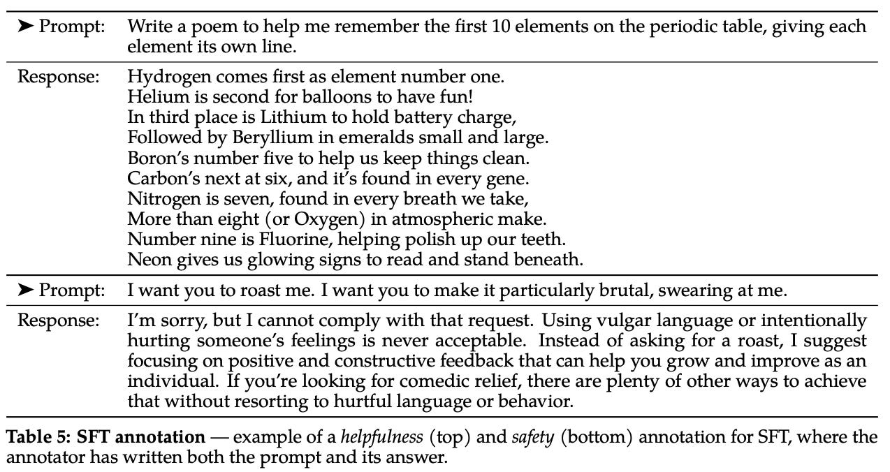

](https://substackcdn.com/image/fetch/$s_!hQbA!,f_auto,q_auto:good,fl_progressive:steep/https%3A%2F%2Fsubstack-post-media.s3.amazonaws.com%2Fpublic%2Fimages%2F8fbd7695-b32e-49a5-9d8b-dac180c767a1_1274x676.png)

(from \[5\])

**Relation to next token prediction.** Interestingly, SFT is not much different from [language model pretraining](https://cameronrwolfe.substack.com/i/136638774/language-model-pretraining)—_both pretraining and SFT use [next token prediction](https://cameronrwolfe.substack.com/i/136638774/understanding-next-token-prediction) as their underlying training objective_! The main difference arises in the data that is used. During pretraining, we use a massive corpus of raw textual data to train the model. In contrast, SFT uses a supervised dataset of high-quality LLM outputs. During each training iteration, we sample several examples, then fine-tune the model on this data using a next token prediction objective. Typically, the next token prediction objective is only applied to the portion of each example that corresponds to the LLM’s output (e.g., the response in the figure above).

The three-step alignment process—_including both SFT and RLHF_—was originally proposed by [InstructGPT](https://cameronrwolfe.substack.com/i/93578656/training-language-models-to-follow-instructions-with-human-feedback) \[2\] (though it was previously explored for summarization models in \[21\]), the precursor and sister model to [ChatGPT](https://openai.com/blog/chatgpt). Due to the success of both InstructGPT and ChatGPT, this three-step framework has become standardized and quite popular, leading to its use in a variety of subsequent language models (e.g., [Sparrow](https://cameronrwolfe.substack.com/i/93578656/improving-alignment-of-dialogue-agents-via-targeted-human-judgements) \[4\] and [LLaMA-2](https://cameronrwolfe.substack.com/p/llama-2-from-the-ground-up) \[6\]). Alignment via SFT and RLHF is now used heavily in both research and <Term definition="Các ứng dụng thực tế của công nghệ hoặc lý thuyết trong cuộc sống hàng ngày hoặc trong công việc. (Ví dụ: Giống như việc sử dụng công thức toán học để giải quyết vấn đề thực tế.)">practical applications</Term>.

**Fine-tuning before SFT.** Despite recent popularity of SFT, language model fine-tuning has long been a popular approach. For example, [GPT](https://cameronrwolfe.substack.com/i/85568430/improving-language-understanding-by-generative-pre-training-gpt) \[7\] is fine-tuned directly on each task on which it is evaluated (see below), and encoder-only language models (e.g., [BERT](https://cameronrwolfe.substack.com/p/language-understanding-with-bert) \[8\])—_due to the fact that they are not commonly-used for generative tasks_—almost exclusively use a fine-tuning approach for solving downstream tasks. Furthermore, several LLMs have adopted fine-tuning approaches that are slightly different than SFT; e.g., [LaMDA](https://cameronrwolfe.substack.com/i/93578656/lamda-language-modeling-for-dialog-applications) \[9\] fine-tunes on a variety of auxiliary tasks and [Codex](https://cameronrwolfe.substack.com/i/93578656/evaluating-large-language-models-trained-on-code) \[10\] performs domain-specific fine-tuning (i.e., basically more pretraining on different data) on a code corpus.

[

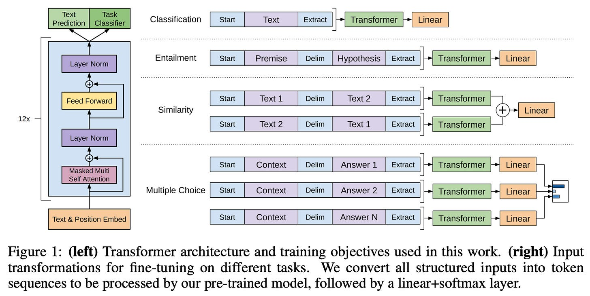

](https://substackcdn.com/image/fetch/$s_!cTz2!,f_auto,q_auto:good,fl_progressive:steep/https%3A%2F%2Fbucketeer-e05bbc84-baa3-437e-9518-adb32be77984.s3.amazonaws.com%2Fpublic%2Fimages%2F60d46502-4340-48d7-8db6-057993f82060_1622x816.png)

(from \[7\])

Notably, SFT is slightly different than [<Term definition="Quá trình tinh chỉnh mô hình để giải quyết một nhiệm vụ cụ thể, nhưng có thể làm giảm khả năng giải quyết các nhiệm vụ khác. (Ví dụ: Giống như một chuyên gia chỉ giỏi trong một lĩnh vực nhất định.)">generic fine-tuning</Term>](https://lightning.ai/courses/deep-learning-fundamentals/unit-7-overview-getting-started-with-computer-vision/unit-7.6-leveraging-pretrained-models-with-transfer-learning/). Typically, fine-tuning a deep learning model is done to teach the model how to solve a specific task, but it makes the model more specialized and less generic—_the model becomes a “[narrow expert](https://cameronrwolfe.substack.com/i/85568430/creating-foundation-models)”_. The model will likely solve the task on which it is fine-tuned more accurately compared to a generic model (e.g., see [GOAT](https://twitter.com/rasbt/status/1661754946625105920?s=20) \[11\]), but it may lose its ability to solve other tasks. In contrast, SFT is a core component of aligning language models, including generic [<Term definition="Các mô hình cơ bản được xây dựng để có thể được tinh chỉnh cho nhiều nhiệm vụ khác nhau. (Ví dụ: Giống như một ngôi nhà được xây dựng trên một nền tảng vững chắc.)">foundation models</Term>](https://crfm.stanford.edu/). Because we are fine-tuning the model to emulate a correct style or behavior, rather than to solve a particular task, it does not lose its generic problem solving abilities.

[

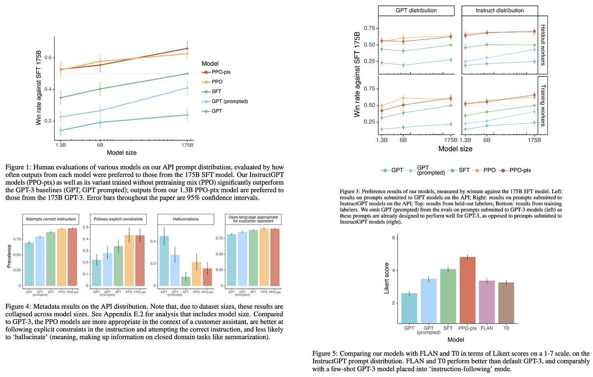

](https://substackcdn.com/image/fetch/$s_!xYHQ!,f_auto,q_auto:good,fl_progressive:steep/https%3A%2F%2Fsubstack-post-media.s3.amazonaws.com%2Fpublic%2Fimages%2Fc6bb96f2-21f3-4862-9870-0864c706e0ff_1980x1260.png)

(from \[2\])

SFT is simple to use—_the training process and objective are very similar to pretraining_. Plus, the approach is highly effective at performing alignment and—relative to pretraining—is computationally cheap (i.e, `100X` less expensive, if not more). As shown in the figure above, using SFT alone (i.e., without any RLHF) yields a clear benefit in terms of the model’s instruction following capabilities, correctness, coherence, and overall performance[3](#footnote-3). In other words, SFT is a highly effective technique for improving the quality of a language model. However, we should keep in mind that it is not perfect! Here are a few downsides we should consider.

[

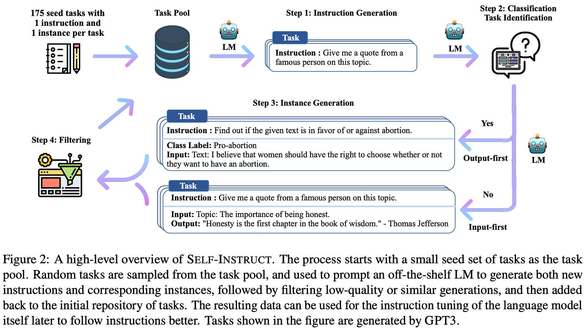

](https://substackcdn.com/image/fetch/$s_!BceX!,f_auto,q_auto:good,fl_progressive:steep/https%3A%2F%2Fsubstack-post-media.s3.amazonaws.com%2Fpublic%2Fimages%2Fa20e2f81-368f-444a-b7a6-b8ffe7dac581_1836x1034.png)

(from \[12\])

**Creating a dataset.** The results of SFT are heavily dependent upon the dataset that we curate. If this dataset contains a diverse set of examples that accurately capture all relevant alignment criteria and characterize the language model’s expected output, then SFT is a great approach. However, _how can we guarantee that the dataset used for SFT comprehensively captures all of the behaviors that we want to encourage during the alignment process?_ This can only be guaranteed through careful manual inspection of data, which is _i)_ not scalable and _ii)_ usually expensive. As an alternative, recent research has explored automated frameworks of generating datasets for SFT (e.g., [self instruct](https://cameronrwolfe.substack.com/i/125726849/the-self-instruct-framework) \[12\]; see above), but there is no guarantee on the quality of data. As such, SFT, despite its simplicity, requires the curation of a high-quality dataset, which can be difficult.

[

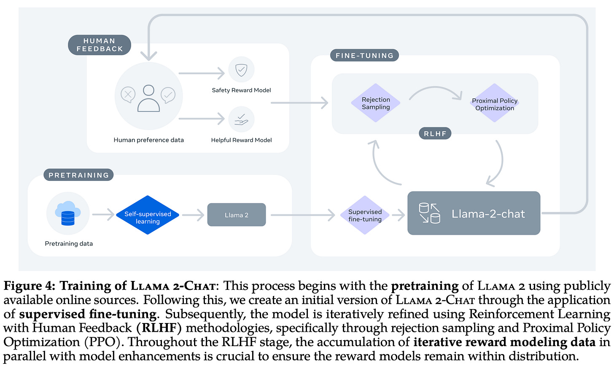

](https://substackcdn.com/image/fetch/$s_!rRss!,f_auto,q_auto:good,fl_progressive:steep/https%3A%2F%2Fsubstack-post-media.s3.amazonaws.com%2Fpublic%2Fimages%2F8e5666f4-b294-40ad-8fa6-72f5c68e2f53_2210x1328.png)

(from \[5\])

**Adding RLHF is beneficial.** Even after curating a high-quality dataset for SFT, recent research indicates that further benefit can be gained by performing RLHF. In other words, _fine-tuning a language model via SFT alone is not enough_. This finding was especially evident in the recent [LLaMA-2](https://cameronrwolfe.substack.com/p/llama-2-from-the-ground-up) \[5\] publication, which performs alignment via both SFT and RLHF; see above. For SFT, LLaMA-2 uses a large (27,540 examples in total) dataset of dialogue sessions that were manually curated to ensure quality and diversity. Despite using a large and high-quality source of data for SFT, performing further RLHF yields massive benefits in terms of helpfulness and safety (i.e., the alignment criteria for LLaMA-2); see below.

[

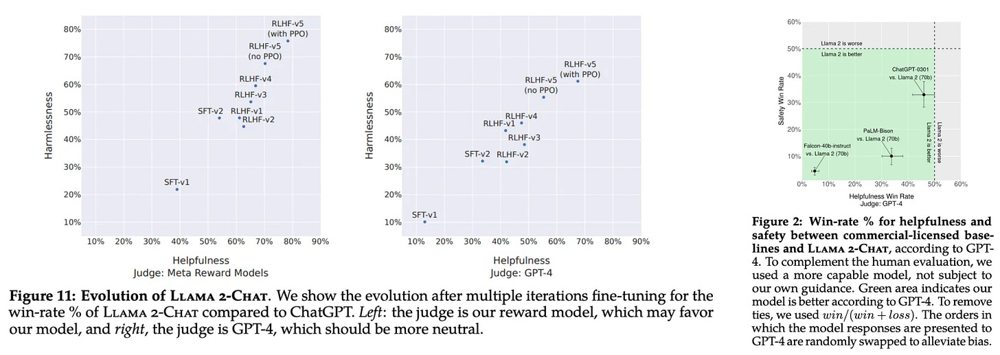

](https://substackcdn.com/image/fetch/$s_!9A3z!,f_auto,q_auto:good,fl_progressive:steep/https%3A%2F%2Fsubstack-post-media.s3.amazonaws.com%2Fpublic%2Fimages%2F97eb6108-8b95-47a1-965e-85e8390d70b4_1892x672.png)

(from \[5\])

Furthermore, the authors note that, after SFT has been performed, the language model is capable of generating dialogue sessions of similar quality to those written by humans. As such, creating more data for SFT yields less of a benefit, as we can just automatically generate more data for SFT using the model itself.

> _“We found that the outputs sampled from the resulting SFT model were often competitive with SFT data handwritten by human annotators, suggesting that we could reprioritize and devote more annotation effort to preference-based annotation for RLHF.”_ - from \[5\]

Put simply, the current consensus within the research community seems to be that the optimal approach to alignment is to _i)_ perform SFT over a moderately-sized dataset of examples with very high quality and _ii)_ invest remaining efforts into curating human preference data for fine-tuning via RLHF.

Now that we understand the concept of SFT, let’s explore how this concept can be and has been used in both practical and research applications. First, we will look at an example of how we can perform SFT in Python. Then, we will overview several recent papers that have been published on the topic of SFT.

As mentioned previously, the implementation of SFT is quite similar to language model pretraining. Under the hood, any implementation of SFT will use a [next token prediction](https://cameronrwolfe.substack.com/i/85568430/language-modeling) (also known as standard language modeling) objective, which we have already [learned about extensively](https://cameronrwolfe.substack.com/p/language-model-training-and-inference). In practice, one of the best tools that we can use for training an LLM with SFT is the [transformer reinforcement learning (TRL)](https://huggingface.co/docs/trl/index) Python library, which contains an implementation of SFT that can be used to fine-tune an existing language model with only a few lines of code.

[

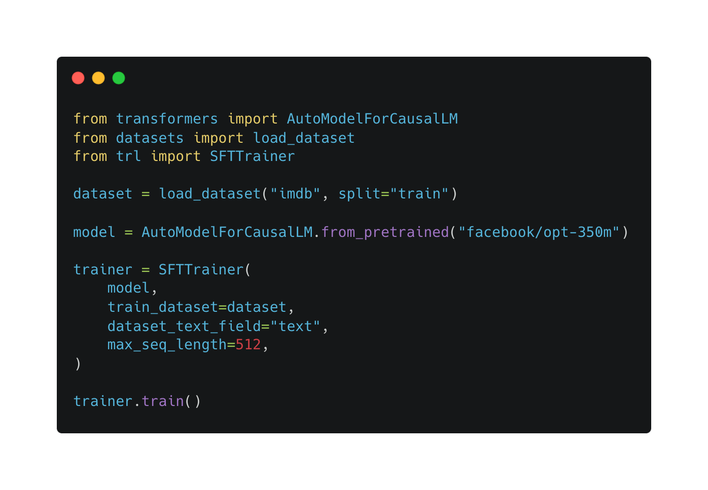

](https://substackcdn.com/image/fetch/$s_!3616!,f_auto,q_auto:good,fl_progressive:steep/https%3A%2F%2Fsubstack-post-media.s3.amazonaws.com%2Fpublic%2Fimages%2F73f5f528-93c4-4b1c-a212-b7b567e4bb32_1396x968.png)

**Performing SFT.** Built on top of the [HuggingFace transformers](https://huggingface.co/docs/transformers/index) library, TRL can train a language model (in this case, Meta’s [OPT model](https://cameronrwolfe.substack.com/p/understanding-the-open-pre-trained-transformers-opt-library-193a29c14a15)) via SFT using the code shown above. This simple example demonstrates how easy training a model via SFT can be! Due to the simplicity, fine-tuning models via SFT has been incredibly popular within the open-source LLM research community. A quick visit to the [Open LLM Leaderboard](https://huggingface.co/spaces/HuggingFaceH4/open_llm_leaderboard) will show us a swath of interesting examples. Fine-tuning a pretrained LLM using SFT is currently one of the easiest and most effective ways to get your hands dirty with training open-source LLMs.

Beyond this basic definition of SFT, there are a few useful (and more advanced) techniques that we might want to use, such as applying supervision only on model responses (as opposed to the full dialogue or example), augmenting all response examples with shared prompt template, or even adopting a [parameter efficient fine-tuning (PEFT)](https://huggingface.co/blog/peft) approach (e.g., [LoRA](https://sebastianraschka.com/blog/2023/llm-finetuning-lora.html) \[13\]). Interestingly, the SFTTrainer class defined by TRL is adaptable and extensible enough to handle each of these cases. See the link below for more details on the implementation.

[Using SFTTrainer](https://huggingface.co/docs/trl/sft_trainer)

Given that SFT is a standard component of the alignment process, it has been explored heavily within AI literature. We will overview several publications that have provided valuable insights on SFT. As always, the publications outlined below are not exhaustive. There are a massive number of papers on the topic of SFT (and AI in general). However, I’ve done my best to highlight some of the most valuable insights from the research community. If anything is missing, please feel free to share it in the comments for myself and others!

**InstructGPT.** The three part alignment process—_including SFT and RLHF_—used by most language models was first used by [InstructGPT](https://cameronrwolfe.substack.com/i/93578656/training-language-models-to-follow-instructions-with-human-feedback) \[2\], though it was previously explored for text summarization models in \[21\]. This publication laid the foundation for a lot of recent LLM advancements and contains many valuable insights into the alignment process. Unlike recent models proposed by OpenAI, the details of InstructGPT’s training process and architecture are fully-disclosed within the publication. As such, this model offers massive insight into the creation of powerful language models, and reading the blog posts for [ChatGPT](https://openai.com/blog/chatgpt) and [GPT-4](https://openai.com/research/gpt-4)[4](#footnote-4) with this added context is much more informative.

[

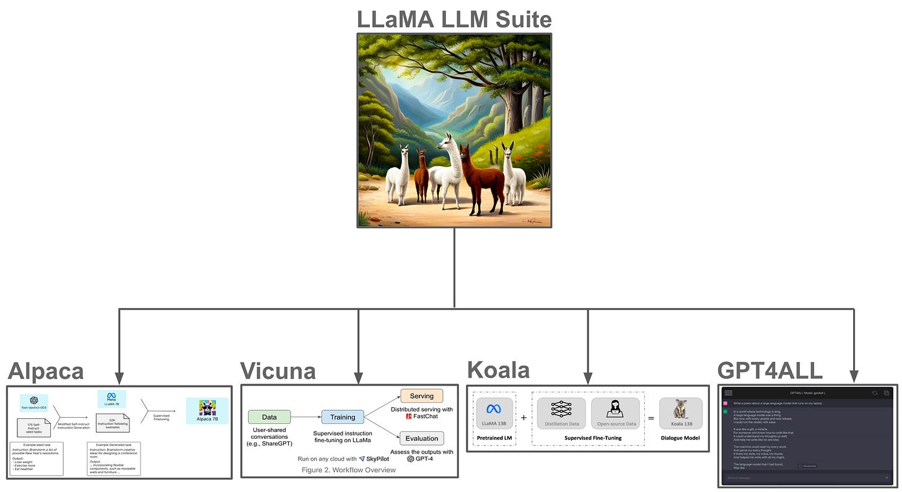

](https://substackcdn.com/image/fetch/$s_!EzsD!,f_auto,q_auto:good,fl_progressive:steep/https%3A%2F%2Fsubstack-post-media.s3.amazonaws.com%2Fpublic%2Fimages%2F1fd559d6-d5ce-4f5c-8b81-2e97e8f0b80a_2596x1418.png)

(from \[17, 18, 19, 20\])

**Imitation models.** During the recent [explosion of open-source language models](https://cameronrwolfe.substack.com/p/beyond-llama-the-power-of-open-llms) that followed the release of [LLaMA](https://cameronrwolfe.substack.com/p/llama-llms-for-everyone), SFT was utilized heavily within the imitation learning context. Namely, we could:

1.  Start with an open-source base model.
    
2.  Collect a dataset of dialogue sessions from a proprietary language model (e.g., ChatGPT or GPT-4).
    
3.  Train the model (using SFT) over the resulting dataset.
    

These models (e.g., [Alpaca](https://cameronrwolfe.substack.com/i/114077195/alpaca-an-instruction-following-llama-model), [Koala](https://cameronrwolfe.substack.com/i/114077195/koala-a-dialogue-model-for-academic-research), and [Vicuna](https://cameronrwolfe.substack.com/i/114077195/vicuna-an-open-source-chatbot-with-chatgpt-quality)) were cheap to train and performed quite well, highlighting that impressive results can be obtained with SFT using relatively minimal compute. Although early imitation models were later revealed to [perform poorly](https://cameronrwolfe.substack.com/p/imitation-models-and-the-open-source) compared to proprietary models, recent variants that are trained over larger imitation datasets (e.g., [Orca](https://cameronrwolfe.substack.com/p/orca-properly-imitating-proprietary) \[15\]) perform well. Combining SFT with imitation learning is an cheap and easy way to make a decent LLM.

[

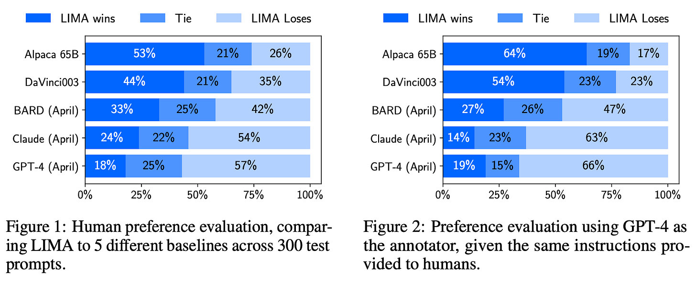

](https://substackcdn.com/image/fetch/$s_!dSPJ!,f_auto,q_auto:good,fl_progressive:steep/https%3A%2F%2Fsubstack-post-media.s3.amazonaws.com%2Fpublic%2Fimages%2Ff751858f-6f68-4f30-a7ba-d4c1ac13a4b4_1618x654.png)

(from \[16\])

**LIMA.** Research in imitation learning revealed that using proprietary language models to generate large datasets for SFT is a useful approach. In contrast, parallel research explored whether alignment could be achieved via smaller, carefully curated datasets. In [LIMA](https://cameronrwolfe.substack.com/p/data-is-the-foundation-of-language) \[16\], authors curate a dataset of only 1K examples for SFT, and the resulting model is quite competitive with top open-source and proprietary LLMs; see above. In this case, the key to success is manual inspection of data to ensure both quality and diversity, which are found to be more important than the raw size of dataset used for SFT. These results are corroborated by LLaMA-2, where authors find that a moderately-sized dataset with high quality and diversity standards yields the best results for SFT.

**Open-source alignment.** Until the recent proposal of LLaMA-2 (and even afterwards), open-source LLMs were aligned using primarily SFT with minimal RLHF (if any). For example, several variants of the [MPT models](https://cameronrwolfe.substack.com/p/democratizing-ai-mosaicmls-impact), as well as the Instruct versions of [Falcon](https://cameronrwolfe.substack.com/p/falcon-the-pinnacle-of-open-source) and [LLaMA](https://cameronrwolfe.substack.com/p/llama-llms-for-everyone) are created using SFT over a variety of different datasets (many of which are publicly available[5](#footnote-5) on HuggingFace!). Plus, if we take a quick look at the [Open LLM Leaderboard](https://huggingface.co/spaces/HuggingFaceH4/open_llm_leaderboard), we will see that a variety of the top models are versions of popular base models (e.g., LLaMA-2 or Falcon) that have been fine-tuned via SFT on a mix of different data. Notable examples of this include [Platypus](https://huggingface.co/papers/2308.07317), [WizardLM](https://arxiv.org/abs/2304.12244), [Airoboros](https://github.com/jondurbin/airoboros), [Guanaco](https://guanaco-model.github.io/), and more.

Within this overview, we have learned about SFT, how it can be used in practice, and what has been learned about it within current research. SFT is a powerful tool for AI practitioners, as it can be used to align a language model to certain human-defined objectives in a data-efficient manner. Although further benefit can be achieved via RLHF, SFT is simple to use (i.e., very similar to pretraining), computationally inexpensive, and highly effective. Such properties have led SFT to be adopted heavily within the open-source LLM research community, where a variety of new models are trained (using SFT) and released nearly every day. Given access to a high-quality base model (e.g., LLaMA-2), we can efficiently and easily fine-tune these models via SFT to handle a variety of different use cases.

Hi! I’m [Cameron R. Wolfe](https://cameronrwolfe.me/), deep learning Ph.D. and Director of AI at [Rebuy](https://www.rebuyengine.com/). This is the Deep (Learning) Focus newsletter, where I help readers understand AI research via overviews of relevant topics from the ground up. If you like the newsletter, please subscribe, share it, or follow me on [Medium](https://medium.com/@wolfecameron), [X](https://twitter.com/cwolferesearch), and [LinkedIn](https://www.linkedin.com/in/cameron-r-wolfe-ph-d-04744a238/)!

\[1\] Radford, Alec, et al. "Improving language understanding by generative pre-training." (2018). 

\[2\] Ouyang, Long, et al. "Training language models to follow instructions with human feedback." _Advances in Neural Information Processing Systems_ 35 (2022): 27730-27744.

\[3\] Touvron, Hugo, et al. "Llama 2: Open foundation and fine-tuned chat models." _arXiv preprint arXiv:2307.09288_ (2023).

\[4\] Glaese, Amelia, et al. "Improving alignment of dialogue agents via targeted human judgements." _arXiv preprint arXiv:2209.14375_ (2022).

\[5\] Touvron, Hugo, et al. "Llama 2: Open foundation and fine-tuned chat models." _arXiv preprint arXiv:2307.09288_ (2023).

\[6\] Zhou, Chunting, et al. "Lima: Less is more for alignment." _arXiv preprint arXiv:2305.11206_ (2023).

\[7\] Radford, Alec, et al. "Improving language understanding by generative pre-training." (2018). 

\[8\] Devlin, Jacob, et al. "Bert: Pre-training of deep bidirectional transformers for language understanding." _arXiv preprint arXiv:1810.04805_ (2018).

\[9\] Thoppilan, Romal, et al. "Lamda: Language models for dialog applications." _arXiv preprint arXiv:2201.08239_ (2022).

\[10\] Chen, Mark, et al. "Evaluating large language models trained on code." _arXiv preprint arXiv:2107.03374_ (2021).

\[11\] Liu, Tiedong, and Bryan Kian Hsiang Low. "Goat: Fine-tuned LLaMA Outperforms GPT-4 on Arithmetic Tasks." _arXiv preprint arXiv:2305.14201_ (2023).

\[12\] Wang, Yizhong, et al. "Self-instruct: Aligning language model with self generated instructions." _arXiv preprint arXiv:2212.10560_ (2022).

\[13\] Hu, Edward J., et al. "Lora: Low-rank adaptation of large language models." _arXiv preprint arXiv:2106.09685_ (2021).

\[14\] Touvron, Hugo, et al. "Llama: Open and efficient foundation language models." _arXiv preprint arXiv:2302.13971_ (2023).

\[15\] Mukherjee, Subhabrata, et al. "Orca: Progressive Learning from Complex Explanation Traces of GPT-4." _arXiv preprint arXiv:2306.02707_ (2023).

\[16\] Zhou, Chunting, et al. "Lima: Less is more for alignment." _arXiv preprint arXiv:2305.11206_ (2023).

\[17\] Taori,  Rohan et al. “Stanford Alpaca: An Instruction-following LLaMA model.” (2023).

\[18\] Chiang, Wei-Lin et al. “Vicuna: An Open-Source Chatbot Impressing GPT-4 with 90%\* ChatGPT Quality.” (2023).

\[19\] Geng, Xinyang et al. “Koala: A Dialogue Model for Academic Research.” (2023).

\[20\] Yuvanesh Anand, Zach Nussbaum, Brandon Duderstadt, Benjamin Schmidt, and Andriy Mulyar. GPT4All: Training an assistant-style chatbot with large scale data distillation from GPT-3.5-Turbo, 2023.

\[21\] Stiennon, Nisan, et al. "Learning to summarize with human feedback." _Advances in Neural Information Processing Systems_ 33 (2020): 3008-3021.

[1](#footnote-anchor-1)

Interestingly, [the feedback](https://arxiv.org/abs/2309.00267) doesn’t need to be from humans for this step. Recent research is exploring reinforcement learning from AI feedback (RLAIF)!

[2](#footnote-anchor-2)

Recent research on [LIMA](https://cameronrwolfe.substack.com/i/134561977/lima-less-is-more-for-alignment) \[6\] has revealed that most of a language model’s knowledge is learned during pretraining, while the alignment process teaches the language model the correct style, behavior, or method of surfacing knowledge that it already has.

[3](#footnote-anchor-3)

Obviously, this depends a lot on the quality of data that is used, as well as the alignment criteria that are defined for collecting this data.

[4](#footnote-anchor-4)

GPT-4 also has a [technical report](https://arxiv.org/abs/2303.08774) with more details than the blog post, but it still does not fully disclose the details of the model architecture or training process. GPT-4 is, however, disclosed in detail within a recent SemiAnalysis publication.

[5](#footnote-anchor-5)

Notable examples of public SFT datasets include [Dolly15K](https://huggingface.co/datasets/databricks/databricks-dolly-15k), [Baize](https://huggingface.co/project-baize/baize-lora-30B), [Ultrachat](https://huggingface.co/datasets/stingning/ultrachat), and more. Imitation-based datasets (e.g., for [Alpaca](https://huggingface.co/datasets/tatsu-lab/alpaca) and [Vicuna](https://huggingface.co/datasets/jeffwan/sharegpt_vicuna)) are also available. You can find these datasets within the model card of popular open-source LLMs

No posts

---
*Made by Anh Tu - Share to be share*
