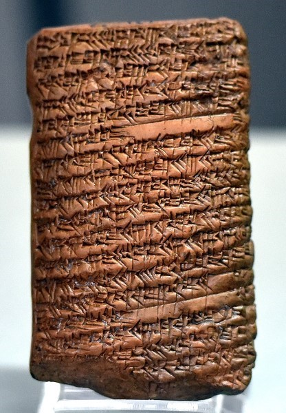
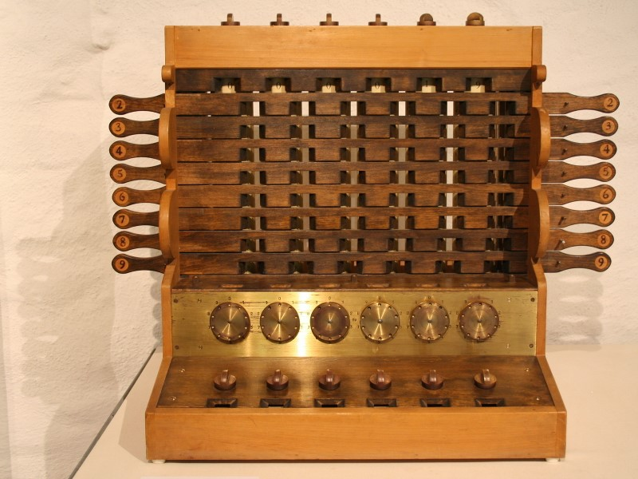
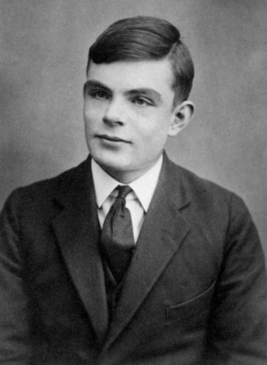
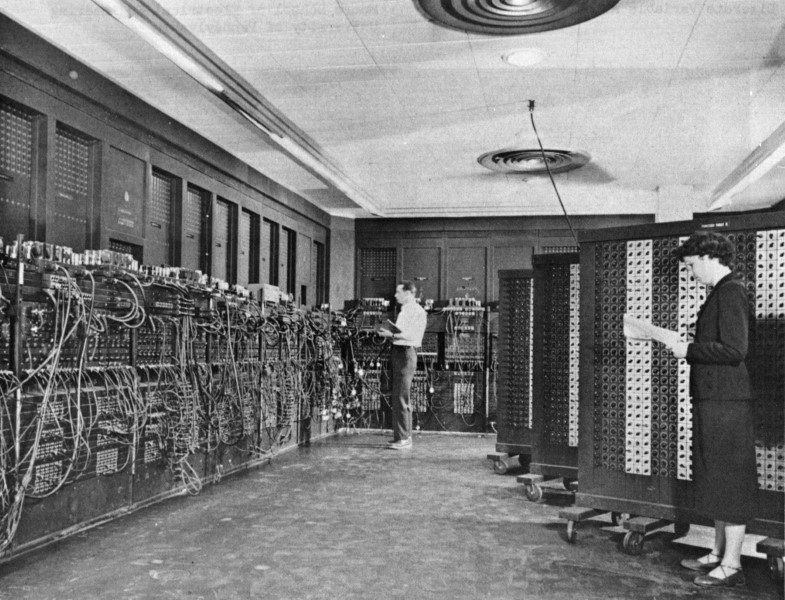
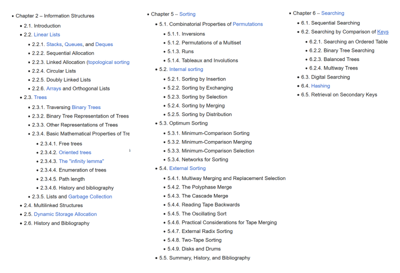
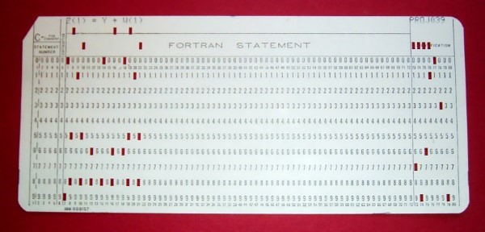
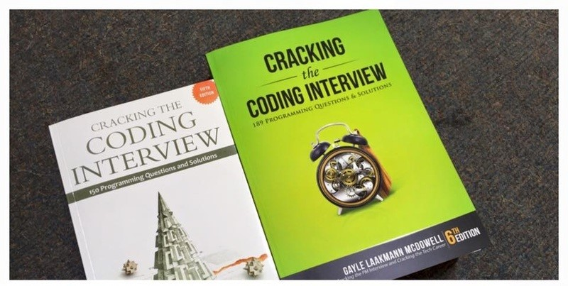

import Term from '@site/src/components/Term';

> Bài viết được biên dịch tự động bởi **Aha! Mind Socratic Engine**. Nguồn bài viết: [Link gốc](https://happycoding.io/tutorials/interviewing/history)

<!-- truncate -->
* * *

Previous:

Next:

* * *

## History

* * *

*   [Ancient History](#ancient-history)
*   [BC: Before Computers](#bc-before-computers)
*   [From Theory to Reality](#from-theory-to-reality)
*   [The Golden Age of Algorithms](#the-golden-age-of-algorithms)
*   [The Art of Computer Programming](#the-art-of-computer-programming)
*   [Up Hill Both Ways](#up-hill-both-ways)
*   [Taking It Personally](#taking-it-personally)
*   [<Term definition="Quá trình phỏng vấn để đánh giá ứng viên cho một vị trí công việc. (Ví dụ: Giống như một buổi hẹn hò để tìm hiểu nhau.)">Interviewing</Term>](#interviewing)
*   [The Interviewing Arms Race](#the-interviewing-arms-race)
*   [The Next Generation](#the-next-generation)
*   [More Info](#more-info)

* * *

<Term definition="Cách tổ chức và lưu trữ dữ liệu trong máy tính để dễ dàng truy cập và chỉnh sửa. (Ví dụ: Giống như cách bạn sắp xếp sách trong thư viện.)">Data structures</Term> and algorithms can be <Term definition="Gây cảm giác sợ hãi hoặc lo lắng, thường do sự phức tạp hoặc khó khăn của một vấn đề. (Ví dụ: Giống như một bài kiểm tra khó khiến học sinh cảm thấy lo lắng.)">intimidating</Term>, and their relationship with technical interviews can make the process feel even more <Term definition="Khó khăn và làm cho người khác cảm thấy sợ hãi hoặc không đủ khả năng để đối mặt. (Ví dụ: Như một ngọn núi cao mà bạn phải leo lên.)">daunting</Term>. But I think understanding the history of data structures and algorithms, and how they’ve been used in interviews over time, can help them feel more <Term definition="Dễ gần gũi, có thể tiếp cận hoặc hiểu được. (Ví dụ: Giống như một cuốn sách dễ đọc mà bạn có thể mở ra bất cứ lúc nào.)">approachable</Term>.

With that in mind, this page contains a brief history of data structures, algorithms, and tech interviews.

## Ancient History

Believe it or not, algorithms are old. _Really_ old.

Algorithms are step-by-step processes, and you probably use them every day. Recipes, driving directions, and furniture assembly instructions can all be thought of as algorithms. They’re step-by-step processes that you follow to accomplish a goal, which is what an <Term definition="Một chuỗi các bước hoặc quy trình để giải quyết một vấn đề hoặc thực hiện một nhiệm vụ. (Ví dụ: Giống như công thức nấu ăn mà bạn làm theo để tạo ra món ăn.)">algorithm</Term> is. With that framing, algorithms have been around since pretty much the beginning of humanity.

More formally, algorithms have been used in math for thousands of years. Ancient [Babylonian](https://en.wikipedia.org/wiki/Babylonian_mathematics), [Egyptian](https://en.wikipedia.org/wiki/Ancient_Egyptian_mathematics), [Indian](https://en.wikipedia.org/wiki/Indian_mathematics), and [Greek](https://en.wikipedia.org/wiki/Greek_mathematics) <Term definition="Môn học nghiên cứu các số, hình dạng, cấu trúc và sự thay đổi. (Ví dụ: Giống như ngôn ngữ của các con số và hình dạng.)">mathematics</Term> were all developed before the year zero, and they all contained step-by-step processes, or algorithms.

* * *

_Clay tablet from ancient Babylonia showing mathematical algorithms_

* * *

The term _algorithm_ itself comes from a Persian mathematician named [Muḥammad ibn Mūsā al-Khwārizmī](https://en.wikipedia.org/wiki/Muhammad_ibn_Musa_al-Khwarizmi). Back in the 9th century, he popularized an approach for doing math that we still use today: by writing numbers in <Term definition="Hệ thống biểu diễn số sử dụng các chữ số từ 0 đến 9, với vị trí của mỗi chữ số xác định giá trị của nó. (Ví dụ: Giống như cách bạn đếm bằng mười.)">decimal notation</Term> (as opposed to older notations like Roman numerals) and then applying step-by-step processes to them (like adding, subtracting, etc). This approach to math is called [<Term definition="Phương pháp tính toán sử dụng các chữ số trong hệ thống thập phân. (Ví dụ: Giống như cách bạn sử dụng máy tính để thực hiện phép toán.)">algorism</Term>](https://en.wikipedia.org/wiki/Algorism), and it originally came from a translation of his name.

From algorism, we got the more general term _algorithm_, which refers to any step-by-step process, especially in computation.

I could go down etymological rabbit holes all day, but the main takeaway is that algorithms are very old, and historically referred to any step-by-step process, especially in math.

## BC: Before Computers

At the risk of going down another etymological rabbit hole, the term [computer](https://en.wikipedia.org/wiki/Computer_\(occupation\)) originally referred to people who did math by hand, long before modern calculators and computers existed. Throughout history, human computers used physical devices to help with their calculations: think of [abacuses](https://en.wikipedia.org/wiki/Abacus) and [slide rules](https://en.wikipedia.org/wiki/Slide_rule).

In the 1600s, [<Term definition="Thiết bị cơ học được sử dụng để thực hiện các phép toán toán học. (Ví dụ: Giống như một chiếc máy tính cầm tay nhưng không có điện.)">mechanical calculators</Term>](https://en.wikipedia.org/wiki/Mechanical_calculator) were invented and subsequently improved. These survived until quite recently- you can still sometimes see them used as cash registers!

* * *

_Mechanical calculator_

* * *

In the 1800s, mechanical calculators began to evolve into what we think of as computers today. [Charles Babbage](https://en.wikipedia.org/wiki/Charles_Babbage) designed a set of machines called the [<Term definition="Một loại máy tính cơ học được thiết kế bởi Charles Babbage, có khả năng thực hiện nhiều phép toán và lập trình. (Ví dụ: Giống như một chiếc máy tính hiện đại nhưng chưa được hoàn thiện.)">analytical engine</Term>](https://en.wikipedia.org/wiki/Analytical_engine) that improved on traditional mechanical calculators because it could not only do one math operation at a time, but could be programmed using <Term definition="Thẻ giấy có các lỗ đục dùng để nhập dữ liệu vào máy tính trong quá khứ. (Ví dụ: Giống như thẻ bài mà bạn sử dụng để chơi trò chơi.)">punch cards</Term> to take the output of one operation and feed it into a new operation. The analytical engine supported many of the computational features we now take for granted: input / output, looping, and branching.

[Ada Lovelace](https://en.wikipedia.org/wiki/Ada_Lovelace) took an interest in the analytical engine, and translated an article on the topic from French to English. In the notes for that translation (which ended up being three times longer than the original article), she wrote an example algorithm that used the analytical engine to calculate [Bernoulli numbers](https://en.wikipedia.org/wiki/Bernoulli_number). This is generally considered the first computer algorithm.

* * *

_Ada Lovelace, the first computer programmer!_

* * *

The analytical engine is important because it helped shift the possibilities of technology, from simple mechanical calculators to more advanced computational devices. However, the analytical engine itself was never actually built! The design for it existed, but building it was too complicated and expensive for the time. Even today, it has still never been built.

Despite the analytical engine never being built, Charles Babbage predicted the subsequent obsession with <Term definition="Đánh giá mức độ hiệu quả của một thuật toán trong việc sử dụng tài nguyên tính toán. (Ví dụ: Giống như so sánh tốc độ của hai chiếc xe.)">algorithmic efficiency</Term>:

> _“As soon as an analytical engine exists, it will necessarily guide the future course of the science. Whenever any result is sought by its aid, the question will then arise—By what course of calculation can these results be arrived at by the machine in the shortest time?” - Charles Babbage_

So the dreaded interview question of _“can we make this algorithm more efficient?”_ dates all the way back to before the first computer existed!

## From Theory to Reality

The late 1800s and early 1900s saw progress in both math and engineering, and mechanical computers became more advanced. But they were still designed for very specific tasks, like predicting tides for ship navigation or calculating long-range ballistics for artillery targeting. They were also still analog, and “reprogramming” them meant physically rewiring them every time you wanted to use them for a different task.

In 1936, Alan Turing invented a theoretical device that he called an “automatic machine” or an “a-machine”, but that we now call a [<Term definition="Một mô hình lý thuyết về máy tính được Alan Turing phát triển, dùng để nghiên cứu khả năng tính toán. (Ví dụ: Giống như một mô hình lý thuyết cho mọi loại máy tính.)">Turing machine</Term>](https://en.wikipedia.org/wiki/Turing_machine). Turing machines are a way of thinking about math as a combination of _data_ and _instructions_. With this framing, Turing machines are no longer limited to specific tasks- they can do _anything_ that you can represent as data and step-by-step instructions. In other words, they can do anything that you can represent as an algorithm.

> _The existence of machines with this property has the important consequence that, considerations of speed apart, it is unnecessary to design various new machines to do various computing processes. They can all be done with one digital computer, suitably programmed for each case. - Alan Turing_

* * *

_Alan Turing_

* * *

World War 2 increased interest and investment in computer technology. Early computers were used for tasks like calculating bomb trajectories, simulating physics for Project Manhattan, and breaking encrypted messages.

At this point, computers were still analog, took up entire rooms, and had cool names like [Collosus](https://en.wikipedia.org/wiki/Colossus_computer) and [ENIAC](https://en.wikipedia.org/wiki/ENIAC). You didn’t really “program” these computers- they were designed for a particular task, and getting them to perform a different task still involved physically rewiring them.

* * *

_ENIAC, an early computer that took up an entire room_

* * *

Towards the end of the war, in 1945 [John von Neumman](https://en.wikipedia.org/wiki/John_von_Neumann) wrote a paper that built on Alan Turing’s ideas to describe an approach for computers to treat instructions (which up until this point had been physical connections) the same way they treated data (which was stored in early forms of what we’d now call memory).

This was a huge conceptual shift. Now instead of building a new computer for each specific task we needed to do, a single computer could take in _instructions_ to perform _any_ task.

If all of this sounds familiar, that’s because this is how every modern computer works! Modern devices use a system that’s now called the [von Neumman architecture](https://en.wikipedia.org/wiki/Von_Neumann_architecture), and almost every modern programming language is considered [Turing complete](https://en.wikipedia.org/wiki/Turing_completeness).

After the war, the next generation of computers was built with the von Neumman architecture. Then from mainframes that took up entire rooms, we got personal computers, and finally the <Term definition="Có mặt ở khắp mọi nơi, phổ biến và dễ thấy. (Ví dụ: Giống như không khí mà bạn không thể nhìn thấy nhưng luôn có mặt.)">ubiquitous</Term> devices we have today.

## The Golden Age of Algorithms

Like I said above, algorithms have been around forever, from the first time a proto-human followed a step-by-step process to accomplish a goal. More formally, they’ve been used in math throughout the centuries.

But the von Neumman architecture meant that now instead of designing an entirely new physical device every time a new problem emerged, computer scientists could focus on the _instructions_ that they gave these more general-purpose computers. These instructions could be published, shared, and reused, which kicked off a golden age of algorithm development.

In the 1950s and 1960s, [many algorithms we study today](https://en.wikipedia.org/wiki/Timeline_of_algorithms) were developed. [Merge sort](https://en.wikipedia.org/wiki/Merge_sort) was invented by John von Neumman himself! Data structures like [<Term definition="Một cấu trúc dữ liệu cho phép lưu trữ một tập hợp các phần tử cùng loại trong một không gian liên tiếp. (Ví dụ: Giống như một hàng ghế trong rạp chiếu phim.)">arrays</Term>](https://en.wikipedia.org/wiki/Array_\(data_structure\)), [<Term definition="Một cấu trúc dữ liệu cho phép ánh xạ giữa khóa và giá trị, giúp truy cập dữ liệu nhanh chóng. (Ví dụ: Giống như một danh bạ điện thoại với tên và số điện thoại.)">hash maps</Term>](https://en.wikipedia.org/wiki/Hash_table), [<Term definition="Một cấu trúc dữ liệu trong đó các phần tử được liên kết với nhau thông qua các con trỏ. (Ví dụ: Giống như một chuỗi hạt trên dây.)">linked lists</Term>](https://en.wikipedia.org/wiki/Linked_list), [<Term definition="Một cấu trúc dữ liệu cây, trong đó mỗi nút có tối đa hai con và được sắp xếp theo thứ tự. (Ví dụ: Giống như một cây phân nhánh với hai nhánh.)">binary search trees</Term>](https://happycoding.io/tutorials/interviewing/[Binary%20search%20trees]\(https://en.wikipedia.org/wiki/Binary_search_tree\)), and [<Term definition="Một cấu trúc dữ liệu theo nguyên tắc LIFO (Last In, First Out), nghĩa là phần tử được thêm vào sau sẽ được lấy ra trước. (Ví dụ: Giống như một chồng đĩa, đĩa nào được đặt lên trên cùng sẽ được lấy ra trước.)">stacks</Term>](https://en.wikipedia.org/wiki/Stack_\(abstract_data_type\)) were also developed during this time.

## The Art of Computer Programming

In the late 1960s and early 1970s, [Donald Knuth](https://en.wikipedia.org/wiki/Donald_Knuth) released a series of books that are collectively called [The Art of Computer Programming](https://en.wikipedia.org/wiki/The_Art_of_Computer_Programming). These books described the data structures and algorithms that had been developed during the preceding 20+ years.

Donald Knuth coined the phrase “analysis of algorithms” and also popularized the idea of using [<Term definition="Phương pháp đánh giá hiệu suất của thuật toán khi kích thước đầu vào trở nên rất lớn. (Ví dụ: Giống như dự đoán hành vi của một chiếc xe khi chạy với tốc độ cao.)">asymptotic analysis</Term>](https://en.wikipedia.org/wiki/Asymptotic_analysis), aka [<Term definition="Một ký hiệu dùng để mô tả tốc độ tăng trưởng của một thuật toán theo kích thước đầu vào. (Ví dụ: Giống như cách bạn đo tốc độ của một chiếc xe theo km/h.)">big O notation</Term>](https://en.wikipedia.org/wiki/Big_O_notation) to talk about algorithmic efficiency.

A few years later, [Niklaus Wirth](https://en.wikipedia.org/wiki/Niklaus_Wirth) wrote a book called [Data Structures + Algorithms = Programs](https://en.wikipedia.org/wiki/Algorithms_%2B_Data_Structures_%3D_Programs), which took the concepts from The Art of Computer Programming and made them more accessible, particularly in education.

* * *

_Chapters from The Art of Computer Programming by Donald Knuth_

* * *

These books influenced an entire generation of programmers and defined the way we study data structures and algorithms today. Reading through their chapter outlines is like reading the syllabus of any modern data structures and algorithms course!

## Up Hill Both Ways

Think about what programming looked like in these early days. Computers were large and expensive, and usually shared between multiple people. Entire companies, or entire university computer science departments, might have had a **single** computer that everyone shared!

That meant that writing and running a program was a long process. First, you wrote your code out by hand, doing your <Term definition="Quá trình tìm và sửa lỗi trong mã lệnh của chương trình. (Ví dụ: Giống như sửa chữa một chiếc xe bị hỏng.)">debugging</Term> in your head. After you had a hand-written program that you thought would work, then you typed it onto a series of punch cards: one punch card for each line of code. Then you’d take your punch cards to the shared computer, where you often had to wait in line behind other people running their own programs. If your program didn’t work, you’d have to start the process all over again.

* * *

_Punch card representing a line of Fortran code: `Z(1) = Y + W(1)`_

* * *

Although the process of writing, running, and debugging code has gotten much easier, a lot of the mentality required in these “golden years” survives today. Writing code by hand, working without a compiler or external resources, and debugging in your head- these are all major components of today’s tech interviews!

## Taking It Personally

From there, computers got smaller and more powerful. [Personal computers](https://en.wikipedia.org/wiki/History_of_personal_computers) finally became a thing. <Term definition="Ngôn ngữ được sử dụng để viết mã lệnh cho máy tính thực hiện các tác vụ. (Ví dụ: Giống như ngôn ngữ mà con người sử dụng để giao tiếp.)">Programming languages</Term> went from machine languages to more abstract languages. We got the internet, smart phones, social media, and all the good and bad that comes with the tech industry.

That pretty much brings us to today, where computer science is a huge, <Term definition="Liên quan đến nhiều lĩnh vực hoặc chuyên ngành khác nhau. (Ví dụ: Giống như một bữa tiệc với nhiều món ăn khác nhau.)">multidisciplinary</Term> industry.

## Interviewing

I personally find this history interesting, but you might be wondering what it has to do with interviewing. What I’m trying to show is that today’s interview process didn’t spring up out of nowhere. There’s a whole history to how we’ve done tech interviews, which I think can help understand how they work today.

In the early days (the 40s, 50s, and 60s), computer science wasn’t really its own <Term definition="Một lĩnh vực học tập hoặc nghiên cứu cụ thể. (Ví dụ: Giống như một nhánh cây trong một cái cây lớn.)">discipline</Term>. It was the stuff of complicated math and science, and the only people doing it were doctors, researchers, and engineers in highly specialized fields.

As time went on (the 70s and 80s), programming emerged as its own study. At this point, interviews were based more on experience than on <Term definition="Bài kiểm tra trong đó ứng viên phải viết mã trên bảng trắng để thể hiện kỹ năng lập trình. (Ví dụ: Giống như một bài kiểm tra miệng trước lớp học.)">whiteboard tests</Term>. Interviewers would read your resume and ask about projects you worked on. If you could talk about experience that was similar to the work you’d be doing at the company, you’d get the job. You might also be asked to write some example code on a piece of paper.

In the 1990s, as the internet became more popular, programming became more lucrative. More people were formally studying computer science in college and seeking jobs in the industry. The pen-and-paper interviews of the 80s gave way to whiteboard coding.

In the early 2000s, as Microsoft took over the world, it also took over the interviewing process. Microsoft became infamous for asking brain-teaser questions like _“why are manhole covers round?”_ and Fermi estimation questions like _“how many tennis balls can fit inside a school bus?”_ Other companies soon followed that trend.

* * *

_Manhole cover in Roswell, New Mexico_

* * *

That lasted for about ten years, until eventually everybody came to their senses about brain-teaser questions. In the early 2010s, Google’s head of people operations [Laszlo Bock](https://en.wikipedia.org/wiki/Laszlo_Bock) announced that Google would no longer ask brain-teaser questions at all.

Around this time, Google also switched from doing a ton of interviews for every candidate, to only doing 4 or 5. Sitting through 5 technical interviews is still stressful and a very long day, but it used to be even worse! Big tech companies also started using rubrics to assess candidates across the same set of categories instead of relying on stack-ranking and subjective yes/no decisions from individual interviewers.

Since then, most big tech companies have adopted the model of 4-5 technical whiteboard interviews, measured against a rubric. During Covid, most interview processes became fully virtual, where the whiteboard is now a shared text editor. But you still shouldn’t expect autocomplete or compiler errors!

## The Interviewing Arms Race

As the interviewing process of big tech companies has evolved, an entire meta-industry has evolved alongside it, devoted to helping people get through it (or at least claiming to help people get through it).

Books like Cracking the Coding Interview have been written about the process. Sites like Leetcode and Glassdoor are devoted to collecting interview questions. There are even services where you can pay a ton of money for a mock interview. (Side note: don’t do this. Mock interviews with your friends are free and more valuable!)

* * *

_Cracking the Coding Interview_

* * *

This has caused a bit of an arms race, where external sites post a company’s questions, so the company bans those questions and comes up with new ones. Then the new question gets posted and banned, and the process repeats all over again. Paradoxically, these interviewing resources might have made the process _harder_ as companies constantly try to stay ahead, and this is why the specifics of individual company processes are hard to pin down. However, the fundamentals have stayed relatively the same for the past 15 years or so.

I’ll talk more about these resources that try to capture interview questions in the next tutorial!

## The Next Generation

This arms race, coupled with people generally becoming more vocal about the problems with traditional whiteboard interviewing, have caused a pushback against the current interviewing process. More companies are starting to lean more heavily on project-based interviews, rather than making candidates jump through algorithmic brain-teaser hoops.

[Byteboard](https://byteboard.dev/) was founded (originally at Google) with the goal of improving the interview process. People have created [lists on GitHub](https://github.com/topics/hiring-without-whiteboards) collecting companies that don’t do whiteboard interviews.

I honestly believe big tech will shift towards this model over the next ten years or so. But for now, the best I can do is help people through the process we have now.

## More Info

For the sake of keeping this article short (okay, relatively short), I’ve oversimplified quite a bit. If you want to learn more about the history of computer science and tech interviewing, see these links for more info:

*   [Algorithm - Wikipedia](https://en.wikipedia.org/wiki/Algorithm) is a great starting point, especially the History section.
*   [List of pioneers in computer science - Wikipedia](https://en.wikipedia.org/wiki/List_of_pioneers_in_computer_science) is a who’s who of computer science. I recommend sorting by date and reading through to get a sense of how we got where we are today.
*   [List of computer term etymologies - Wikipedia](https://en.wikipedia.org/wiki/List_of_computer_term_etymologies) is a glossary of how a bunch of computer terms got their names.
*   [History of computing hardware - Wikipedia](https://en.wikipedia.org/wiki/History_of_computing_hardware)
*   [History of computer science - Wikipedia](https://en.wikipedia.org/wiki/History_of_computer_science)
*   [History of computers: A brief timeline - Live Science](https://www.livescience.com/20718-computer-history.html)
*   [What’s a Turing Machine? (And Why Does It Matter?)](https://medium.com/background-thread/whats-a-turing-machine-and-why-does-it-matter-1cd1b4606c6a)
*   [Turing’s Enduring Importance](https://www.technologyreview.com/2012/02/08/187598/turings-enduring-importance/)
*   [computer - Britannica](https://www.britannica.com/technology/computer) is a surprisingly in-depth article on computers.
*   [Timeline of Computer History](https://www.computerhistory.org/timeline/) is an interactive timeline.
*   [Has anyone here been programming seriously since the 70s and 80s? What was it like? How has your experience of the field changed?](https://old.reddit.com/r/learnprogramming/comments/3zki7n/has_anyone_here_been_programming_seriously_since/) is a Reddit post with fascinating replies.
*   [Computer programming in the punched card era - Wikipedia](https://en.wikipedia.org/wiki/Computer_programming_in_the_punched_card_era) describes what coding was like in the 60s and 70s.
*   [Punch Card Programming - Computerphile - YouTube](https://www.youtube.com/watch?v=KG2M4ttzBnY)
*   [What were interviews for programming positions like in the 70s and 80s? - Hacker News](https://news.ycombinator.com/item?id=30904621)
*   [What were interviews for programming positions like in the 70s and 80s? - Quora](https://www.quora.com/What-were-interviews-for-programming-postions-like-in-the-70s-and-80s)
*   [A History of Coding Interviews](https://betterprogramming.pub/a-history-of-coding-interviews-23b5e8f9c92f)

* * *

Previous:

Next:

---
*Made by Anh Tu - Share to be share*
