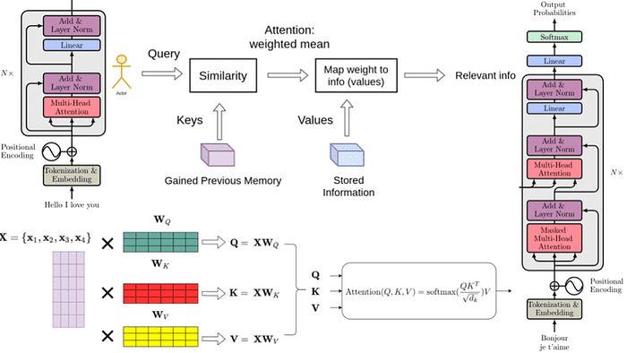
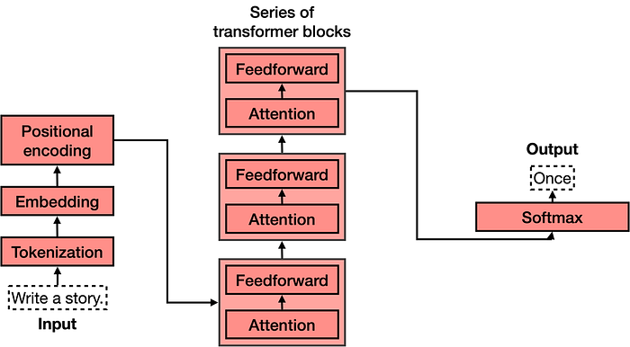
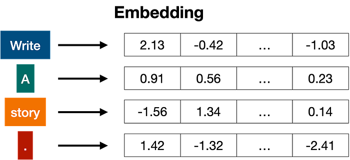
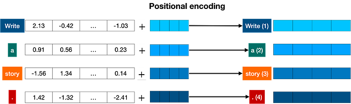
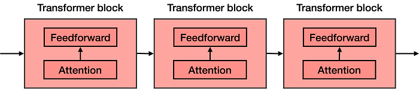
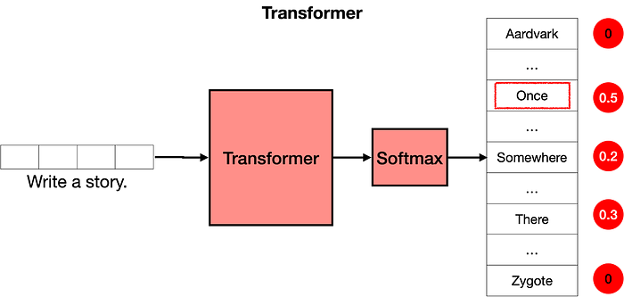

import Term from '@site/src/components/Term';

> Bài viết được biên dịch tự động bởi **Aha! Mind Socratic Engine**. Nguồn bài viết: [Link gốc](https://medium.com/@amanatulla1606/transformer-architecture-explained-2c49e2257b4c)

<!-- truncate -->

10 min read

Sep 1, 2023

Transformers are a new development in machine learning that have been <Term definition="Trở thành tâm điểm của sự chú ý hoặc gây ra một làn sóng bàn tán sôi nổi trong cộng đồng. (Ví dụ: Giống như một ban nhạc rock mới nổi vừa xuất hiện đã khiến cả phố phải ngoái nhìn.)">making a lot of noise</Term> lately. They are incredibly good at keeping track of context, and this is why the text that they write makes sense. In this chapter, we will go over their architecture and how they work.

Press enter or click to view image in full size

Transformer models are one of the most exciting new developments in machine learning. They were introduced in the paper Attention is All You Need. Transformers can be used to write stories, essays, poems, answer questions, translate between languages, chat with humans, and they can even pass exams that are hard for humans! But what are they? You’ll be happy to know that the architecture of transformer models is not that complex, it simply is a <Term definition="Việc nối các chuỗi hoặc các thành phần lại với nhau theo một thứ tự nhất định để tạo thành một dải liên tục. (Ví dụ: Giống như việc móc các toa tàu lại với nhau để tạo thành một đoàn tàu dài.)">concatenation</Term> of some very useful components, each of which has its own function. In this chapter, you will learn all of these components.

<Term definition="Tóm tắt một vấn đề phức tạp một cách cực kỳ ngắn gọn và súc tích. (Ví dụ: Giống như việc nén cả một cuốn tiểu thuyết dày cộp vào một dòng trạng thái Facebook.)">In a nutshell</Term>, what does a transformer do? Imagine that you’re writing a text message on your phone. After each word, you may get three words suggested to you. For example, if you type “Hello, how are”, the phone may suggest words such as “you”, or “your” as the next word. Of course, if you continue selecting the suggested word in your phone, you’ll quickly find that the message formed by these words makes no sense. If you look at each set of 3 or 4 consecutive words, it may make sense, but these words don’t concatenate to anything with a meaning. This is because the model used in the phone doesn’t carry the overall context of the message, it simply predicts which word is more likely to come up after the last few. Transformers, on the other hand, keep track of the context of what is being written, and this is why the text that they write makes sense.

The phone can suggest the next word to use in a text message, but does not have the power to generate <Term definition="Tính mạch lạc, chặt chẽ, các phần kết nối với nhau một cách logic và dễ hiểu. (Ví dụ: Giống như một bức tường gạch được xây khéo léo, các viên gạch khớp nhau hoàn hảo thay vì một đống gạch vụn.)">coherent</Term> text.

Press enter or click to view image in full size

_The phone can suggest the next word to use in a text message, but does not have the power to generate coherent text._

I have to be honest with you, the first time I found out that transformers build text one word at a time, I couldn’t believe it. First of all, this is not how humans form sentences and thoughts. We first form a basic thought, and then start <Term definition="Quá trình tinh chỉnh, loại bỏ những phần thô kệch để làm cho một sản phẩm hoặc ý tưởng trở nên sắc sảo và hoàn thiện hơn. (Ví dụ: Giống như việc mài một viên kim cương thô cho đến khi nó sáng bóng và có các góc cạnh hoàn hảo.)">refining</Term> it and adding words to it. This is also not how ML models do other things. For example, images are not built this way. Most neural network based graphical models form a rough version of the image, and slowly refine it or add detail until it is perfect. So why would a transformer model build text word by word? One answer is, because that works really well. A more satisfying one is that because transformers are so incredibly good at keeping track of the context, that the next word they pick is exactly what it needs to keep going with an idea.

And how are transformers trained? With a lot of data, all the data on the internet, in fact. So when you input the sentence “Hello, how are” into the transformer, it simply knows that, based on all the text in the internet, the best next word is “you”. If you were to give it a more complicated command, say, “Write a story.”, it may figure out that a good next word to use is “Once”. Then it adds this word to the command, and figures out that a good next word is “upon”, and so on. And word by word, it will continue until it writes a story.

**Command**: Write a story.  
**Response**: Once

**Next command:** Write a story. Once  
**Response**: upon

**Next command:** Write a story. Once upon  
**Response**: a

**Next command:** Write a story. Once upon a  
**Response:** time

**Next command:** Write a story. Once upon a time  
**Response**: there

Now that we know what transformers do, let’s get to their architecture. If you’ve seen the architecture of a transformer model, you may have <Term definition="Trạng thái cực kỳ kinh ngạc, sững sờ và thán phục trước một điều gì đó vĩ đại hoặc phức tạp. (Ví dụ: Giống như cảm giác lần đầu tiên bạn đứng trước kim tự tháp Ai Cập và không tin vào mắt mình.)">jumped in awe</Term> like I did the first time I saw it, it looks quite complicated! However, when you break it down into its most important parts, it’s not so bad. The transformer has 4 main parts:

*   <Term definition="Quá trình chia nhỏ một đoạn văn bản thành các đơn vị nhỏ nhất (từ, cụm từ, dấu câu) để máy tính có thể xử lý. (Ví dụ: Giống như việc tháo rời một mô hình Lego thành từng viên gạch riêng lẻ trước khi phân loại chúng.)">Tokenization</Term>
*   <Term definition="Kỹ thuật chuyển đổi các từ ngữ trừu tượng thành các dãy số (vector) để máy tính hiểu được ý nghĩa và mối quan hệ giữa chúng. (Ví dụ: Giống như việc gán cho mỗi món ăn một mã số dinh dưỡng (calo, đạm) để máy tính có thể so sánh độ 'khỏe mạnh' của chúng.)">Embedding</Term>
*   <Term definition="Cách đánh dấu vị trí của từng từ trong câu để mô hình biết từ nào đứng trước, từ nào đứng sau. (Ví dụ: Giống như việc đánh số thứ tự cho các quân bài trong một bộ bài để bạn biết quân nào được chia trước.)">Positional encoding</Term>
*   Transformer block (several of these)
*   <Term definition="Hàm toán học biến đổi các con số thô thành bảng xác suất (tổng bằng 1), giúp máy tính chọn ra kết quả khả thi nhất. (Ví dụ: Giống như một hội đồng giám khảo quy đổi điểm số thành tỉ lệ phần trăm cơ hội chiến thắng của mỗi thí sinh.)">Softmax</Term>

The fourth one, the transformer block, is the most complex of all. Many of these can be concatenated, and each one contains two main parts: The attention and the <Term definition="Một kiểu mạng thần kinh mà dữ liệu chỉ đi theo một chiều duy nhất từ đầu vào đến đầu ra, không có vòng lặp. (Ví dụ: Giống như một dây chuyền sản xuất một chiều, nguyên liệu vào đầu này và sản phẩm ra ở đầu kia.)">feedforward</Term> components.

Press enter or click to view image in full size

_The architecture of a transformer model_

## Tokenization

Tokenization is the most basic step. It consists of a large dataset of tokens, including all the words, punctuation signs, etc. The tokenization step takes every word, prefix, suffix, and punctuation signs, and sends them to a known token from the library.

Press enter or click to view image in full size

## Embedding

Once the input has been tokenized, it’s time to turn words into numbers. For this, we use an embedding. In a previous chapter you learned about how text embeddings send every piece of text to a vector (a list) of numbers. If two pieces of text are similar, then the numbers in their corresponding vectors are similar to each other (<Term definition="Thực hiện một phép toán trên từng phần tử tương ứng của các tập hợp dữ liệu (như vector hoặc ma trận). (Ví dụ: Giống như việc hai hàng học sinh đối diện nhau, mỗi người chỉ bắt tay với người đứng ngay trước mặt mình.)">componentwise</Term>, meaning each pair of numbers in the same position are similar). Otherwise, if two pieces of text are different, then the numbers in their corresponding vectors are different.

Press enter or click to view image in full size

_In general embeddings send every word (token) to a long list of numbers._

## Positional encoding

Once we have the vectors corresponding to each of the tokens in the sentence, the next step is to turn all these into one vector to process. The most common way to turn a bunch of vectors into one vector is to add them, componentwise. That means, we add each coordinate separately. For example, if the vectors (of length 2) are \[1,2\], and \[3,4\], their corresponding sum is \[1+3, 2+4\], which equals \[4, 6\]. This can work, but there’s a small <Term definition="Một lời cảnh báo hoặc lưu ý về những hạn chế, điều kiện cần thiết trước khi thực hiện một việc gì đó. (Ví dụ: Giống như dòng chữ 'Đọc kỹ hướng dẫn sử dụng trước khi dùng' trên vỏ hộp thuốc.)">caveat</Term>. Addition is <Term definition="Tính chất giao hoán trong toán học, nghĩa là khi thay đổi thứ tự các thành phần thì kết quả cuối cùng vẫn không đổi. (Ví dụ: Giống như việc pha cà phê sữa, bạn đổ sữa vào cà phê hay cà phê vào sữa thì kết quả vẫn là một ly cà phê sữa.)">commutative</Term>, meaning that if you add the same numbers in a different order, you get the same result. In that case, the sentence “I’m not sad, I’m happy” and the sentence “I’m not happy, I’m sad”, will result in the same vector, given that they have the same words, except in different order. This is not good. Therefore, we must come up with some method that will give us a different vector for the two sentences. Several methods work, and we’ll go with one of them: positional encoding. Positional encoding consists of adding a sequence of predefined vectors to the embedding vectors of the words. This ensures we get a unique vector for every sentence, and sentences with the same words in different order will be assigned different vectors. In the example below, the vectors corresponding to the words “Write”, “a”, “story”, and “.” become the modified vectors that carry information about their position, labeled “Write (1)”, “a (2)”, “story (3)”, and “. (4)”.

Press enter or click to view image in full size

_Positional encoding adds a positional vector to each word, in order to keep track of the positions of the words._

## Transformer block

Let’s recap what we have so far. The words come in and get turned into tokens (tokenization), tokenized words are turned into numbers (embeddings), then order gets taken into account (positional encoding). This gives us a vector for every token that we input to the model. Now, the next step is to predict the next word in this sentence. This is done with a really really large neural network, which is trained precisely with that goal, to predict the next word in a sentence.

## Get Amanatullah’s stories in your inbox

Join Medium for free to get updates from this writer.

Remember me for faster sign in

We can train such a large network, but we can vastly improve it by adding a key step: the attention component. Introduced in the <Term definition="Dùng để chỉ một công trình nghiên cứu hoặc bài báo có tầm ảnh hưởng cực lớn, đặt nền móng cho cả một lĩnh vực. (Ví dụ: Giống như hạt giống đầu tiên nảy mầm rồi từ đó mọc lên cả một khu rừng đại ngàn.)">seminal</Term> paper Attention is All you Need, it is one of the key ingredients in transformer models, and one of the reasons they work so well. Attention is explained in the previous section, but for now, imagine it as a way to add context to each word in the text.

The attention component is added at every block of the feedforward network. Therefore, if you imagine a large feedforward neural network whose goal is to predict the next word, formed by several blocks of smaller neural networks, an attention component is added to each one of these blocks. Each component of the transformer, called a transformer block, is then formed by two main components:

*   The attention component.
*   The feedforward component.

Press enter or click to view image in full size

_The transformer is a concatenation of many transformer blocks. Each one of these is composed by an attention component followed by a feedforward component (a neural network)._

## Attention

The next step is attention. As you learned attention mechanism deals with a very important problem: the problem of context. Sometimes, as you know, the same word can be used with different meanings. This tends to confuse language models, since an embedding simply sends words to vectors, without knowing which definition of the word they’re using.

Attention is a very useful technique that helps language models understand the context. In order to understand how attention works, consider the following two sentences:

*   Sentence 1: The bank of the river.
*   Sentence 2: Money in the bank.

As you can see, the word ‘bank’ appears in both, but with different definitions. In sentence 1, we are referring to the land at the side of the river, and in the second one to the institution that holds money. The computer has no idea of this, so we need to somehow inject that knowledge into it. What can help us? Well, it seems that the other words in the sentence can come to our rescue. For the first sentence, the words ‘the’, and ‘of’ do us no good. But the word ‘river’ is the one that is letting us know that we’re talking about the land at the side of the river. Similarly, in sentence 2, the word ‘money’ is the one that is helping us understand that the word ‘bank’ is now referring to the institution that holds money.

Press enter or click to view image in full size

_Attention helps give context to each word, based on the other words in the sentece (or text)._

In short, what attention does is it moves the words in a sentence (or piece of text) closer in the word embedding. In that way, the word “bank” in the sentence “Money in the bank” will be moved closer to the word “money”. Equivalently, in the sentence “The bank of the river”, the word “bank” will be moved closer to the word “river”. That way, the modified word “bank” in each of the two sentences will carry some of the information of the neighboring words, adding context to it.

The attention step used in transformer models is actually much more powerful, and it’s called <Term definition="Cơ chế cho phép mô hình 'nhìn' vào câu văn từ nhiều góc độ khác nhau cùng lúc để hiểu các mối quan hệ phức tạp. (Ví dụ: Giống như việc có 10 thám tử cùng soi xét một hiện trường, mỗi người tập trung vào một manh mối khác nhau.)">multi-head attention</Term>. In multi-head attention, several different embeddings are used to modify the vectors and add context to them. Multi-head attention has helped language models reach much higher levels of efficacy when processing and generating text.

## The Softmax Layer

Now that you know that a transformer is formed by many layers of transformer blocks, each containing an attention and a feedforward layer, you can think of it as a large neural network that predicts the next word in a sentence. The transformer outputs scores for all the words, where the highest scores are given to the words that are most likely to be next in the sentence.

The last step of a transformer is a softmax layer, which turns these scores into probabilities (that add to 1), where the highest scores correspond to the highest probabilities. Then, we can <Term definition="Hành động chọn ngẫu nhiên một kết quả từ một danh sách các khả năng dựa trên xác suất đã tính toán. (Ví dụ: Giống như việc thò tay vào một túi kẹo có nhiều màu và bốc ra một viên dựa trên số lượng mỗi màu.)">sample</Term> out of these probabilities for the next word. In the example below, the transformer gives the highest probability of 0.5 to “Once”, and probabilities of 0.3 and 0.2 to “Somewhere” and “There”. Once we sample, the word “once” is selected, and that’s the output of the transformer.

Press enter or click to view image in full size

_The softmax layer turns the scores into probabilities, and these are used to pick the next word in the text._

Now what? Well, we repeat the step. We now input the text “Write a story. Once” into the model, and most likely, the output will be “upon”. Repeating this step again and again, the transformer will end up writing a story, such as “Once upon a time, there was a …”.

## Post Training

Now that you know how transformers work, we still have a bit of work to do. Imagine the following: You ask the transformer “What is the capital of Algeria?”. We would love for it to answer “Algiers”, and move on. However, the transformer is trained on the entire internet. The internet is a big place, and it’s not necessarily the best question/answer <Term definition="Một kho lưu trữ tập trung, nơi chứa một lượng lớn dữ liệu, thông tin hoặc tài liệu. (Ví dụ: Giống như một thư viện khổng lồ chứa tất cả các loại sách trên đời để mọi người đến tra cứu.)">repository</Term>. Many pages, for example, would have long lists of questions without answers. In this case, the next sentence after “What is the capital of Algeria?” could be another question, such as “What is the population of Algeria?”, or “What is the capital of Burkina Faso?”. The transformer is not a human who thinks about their responses, it simply <Term definition="Bắt chước một cách máy móc các hành vi, phong cách hoặc dữ liệu mà nó được quan sát thấy. (Ví dụ: Giống như một con vẹt lặp lại lời chủ nói mà không thực sự hiểu ý nghĩa sâu xa của câu nói đó.)">mimics</Term> what it sees on the internet (or any dataset that has been provided). So how do we get the transformer to answer questions?

The answer is post-training. In the same way that you would teach a person to do certain tasks, you can get a transformer to perform tasks. Once a transformer is trained on the entire internet, then it is trained again on a large dataset which corresponds to lots of questions and their respective answers. Transformers (like humans), have a <Term definition="Sự thiên kiến hoặc xu hướng nghiêng về một phía nào đó dựa trên những gì đã học được, đôi khi gây thiếu khách quan. (Ví dụ: Giống như một trọng tài luôn có cảm tình với đội nhà nên thường thổi phạt nhẹ tay hơn cho họ.)">bias</Term> towards the last things they’ve learned, so post-training has proven a very useful step to help transformers succeed at the tasks they are asked to.

Post-training also helps with many other tasks. For example, one can post-train a transformer with large datasets of conversations, in order to help it perform well as a chatbot, or to help us write stories, poems, or even code.

---
*Made by Anh Tu - Share to be share*
