import Term from '@site/src/components/Term';

> Bài viết được biên dịch tự động bởi **Aha! Mind Socratic Engine**. Nguồn bài viết: [Link gốc](https://viblo.asia/p/tat-tan-tat-nhung-ki-thuat-prompt-engineering-huu-ich-nhat-cho-chatgpt-bXP4WzmqV7G)

<!-- truncate -->
chatGPT nói riêng hay mô hình ngôn ngữ lớn (LLM) nói chung, đã và đang đạt được những thành tựu cực kỳ quan trọng lĩnh vực ngôn ngữ tự nhiên, chúng dần dần xuất hiện ở mọi nơi và cho thấy một khả năng đáng ngạc nhiên trong việc khiến máy tính có thể giao tiếp với con người.

Kể từ thời điểm chatGPT công bố phát hành miễn phí, nó đã tạo nên một cơn sốt không chỉ trong lĩnh vực AI mà còn được chú ý trên toàn cầu. Nó không chỉ có khả năng trò chuyện, trả lời giống con người mà còn có thể làm được rất nhiều thứ khác mà bạn chưa hề biết.

Trong bài viết này, mình sẽ giới thiệu cho các bạn về <Term definition="Kỹ thuật thiết kế và tinh chỉnh câu lệnh đầu vào để điều khiển mô hình ngôn ngữ tạo ra kết quả chính xác và tối ưu nhất. (Ví dụ: Giống như việc học cách đặt câu hỏi khéo léo để một chuyên gia 'biết tuốt' trả lời đúng trọng tâm bạn cần.)">Prompt Engineering</Term>, một kỹ thuật có thể giúp bạn tối ưu sức mạnh của chatGPT hay LLMs.

## Large Language Model -- LLM là gì?

Mô hình ngôn ngữ lớn (Large Language Models) là các hệ thống trí tuệ nhân tạo được xây dựng để hiểu và tạo ra ngôn ngữ tự nhiên. Chúng được huấn luyện trên các tập dữ liệu lớn và đa dạng để học cách dự đoán từ tiếp theo trong văn bản. Một mô hình ngôn ngữ lớn có thể hiểu ngữ cảnh, xử lý ngôn ngữ tự nhiên và trả lời các câu hỏi.

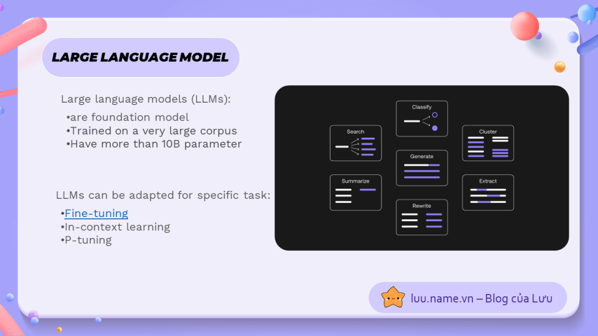

Thực chất, LLM cũng như những Language model trước kia như Bert hay XLNet, chỉ khác là qua thời gian, nhờ vào sự phát triển của công nghệ tính toán, ta có thể triển khai được những mô hình có kích thước gấp trăm/ ngàn lần trước kia, và đó là cách mà mô hình ngôn ngữ lớn ra đời -- những mô hình ngôn ngữ có trên 10 tỉ tham số.

Các bạn có thể tìm hiểu thêm về Large Language Model tại bài viết trước của mình:

## Cơn sốt LLM

Kể từ khi Google công bố kiến trúc <Term definition="Một kiến trúc mạng thần kinh đột phá dựa trên cơ chế 'chú ý' (attention) để xử lý dữ liệu ngôn ngữ theo trình tự hiệu quả. (Ví dụ: Giống như một người đọc sách có khả năng nhìn toàn bộ trang giấy cùng lúc thay vì đọc từng chữ từ trái sang phải.)">transformer</Term>, đánh dấu thời đại mới cho lĩnh vực xử lí ngôn ngữ tự nhiên, kéo theo hàng loạt các mô hình NLP tiên tiến qua các năm, có thể kể đến BERT 2019, GPT 2020, PaLM 2023,... và kèm theo đó là số lượng tham số trong mỗi mô hình cũng tăng theo cấp số nhân (hình bên phải)

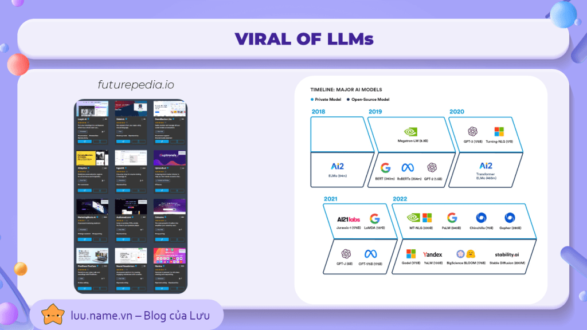

Và nếu như bạn truy cập vào trang web [futurepedia.io](http://futurepedia.io/), bạn sẽ dễ dàng nhìn thấy hàng trăm ứng dụng/website AI hỗ trợ các tác vụ liên quan đến NLP, và rất nhiều trong đó, đều dựa trên nền tảng LLM của openAI. Có thể nói, những ứng dụng từ LLM đang trở nên tràn ngập và giải quyết rất nhiều vấn đề cho người dùng.

Và không thể không đề cập tới, đứng phía sau việc xây dựng những ứng dụng này, chính là một kĩ thuật gọi là Prompt Engineering, một kĩ thuật không quá phức tạp nhưng lại mang về nhữung kết quả không ngờ với LLMs

## Prompt Engineering là gì?

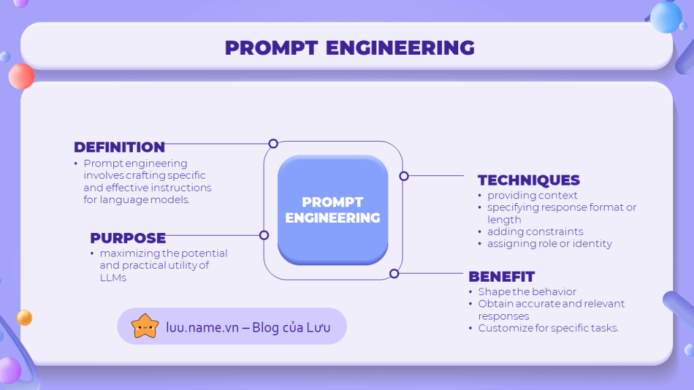

Như các bạn đã biết, LLM hoạt động như một hộp đen đã trược train trên một tập dữ liệu cực kỳ lớn, nó nhận vào một đoạn text và trả về một đoạn text khác dưới dạng phản hồi. Có nghĩa là, kết quả mà LLM hay chatGPT trả về, hoàn toàn phụ thuộc vào input mà ta đưa vào cho nó.

Prompt Engineering chính là một kĩ thuật giúp ra điều chỉnh các yếu tố trong đoạn text input để tối ưu hóa đầu vào LLM và khai thác tối đa hiệu quả của LLM mà ta nhận được qua output.

Một số kĩ thuật prompt engineering đơn giản và dễ thấy nhất, chính là cunng cấp ngữ cảnh trong input, hay thêm một số điều kiện và ràng buộc cho output mà ta muốn nhận được. mình sẽ nói rõ hơn về điều này ở phần sau.

Bằng việc hiểu rõ và sử dụng các kĩ thuật prompt engineering, ta có thể định hình output mong muốn, chọn lọc các thông tin và tùy biến LLM để thực hiện nhiều loại nhiệm vụ nhất định.

## Cách xây dựng một câu prompt hoàn chỉnh

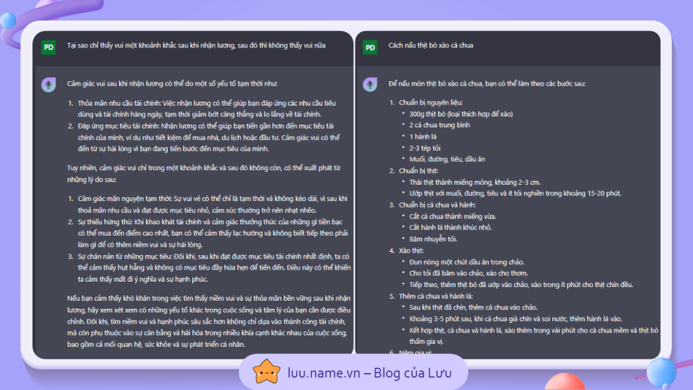

Hãy nhìn vào hai ví dụ trên, đây là những thứ mình thường làm khi sử dụng chatGPT, hâu hết là để giải đáp những việc lặt vặt thôi. Nhưng nếu chỉ có vậy thì cần gì prompt engineering nhỉ? Đúng vậy, những gì chatGPT có thể làm còn nhiều hơn thế, và đây là các để bạn khai thác điều đó.

Hãy lấy một ví dụ, mình đang muốn xây dựng một ứng dụng quản lý tài chính cá nhân cho một lượng lớn người dùng, và mình muốn chatGPT gợi ý cho mình những <Term definition="Một khung làm việc hoặc bộ quy chuẩn có sẵn giúp việc phát triển ứng dụng trở nên nhanh chóng và có cấu trúc. (Ví dụ: Giống như bộ khung xương của một ngôi nhà, giúp thợ xây lắp ghép các phần khác vào đúng vị trí một cách dễ dàng.)">framework</Term> có thể sử dụng để đáp ứng nhu cầu cho ứng dụng của mình.

### 1\. <Term definition="Mệnh lệnh hoặc chỉ dẫn cụ thể trong câu lệnh để AI biết chính xác nhiệm vụ cần thực hiện. (Ví dụ: Giống như tờ hướng dẫn sử dụng đi kèm khi bạn mua một món đồ nội thất lắp ráp.)">Instruction</Term>

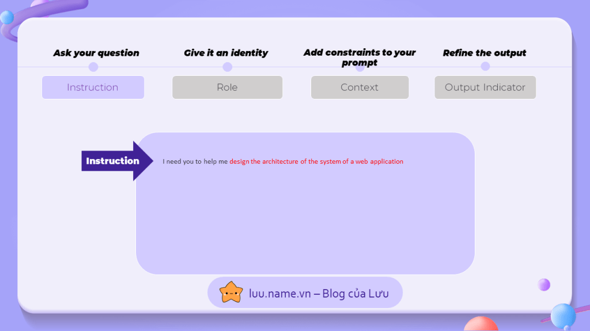

Việc đầu tiên, cũng chính là việc đơn giản nhất, hãy viết điều bạn muốn, đây được xem như là một "hướng dẫn" cho chatGPT. Nguyên tắc của hướng dẫn là: càng chi tiết càng tốt. Vì vậy, ngoài việc yêu cầu thiết kế kiến trúc cho ứng dụng, mình còn mô tả thêm về chi tiết của ứng dụng mà mình định xây dựng

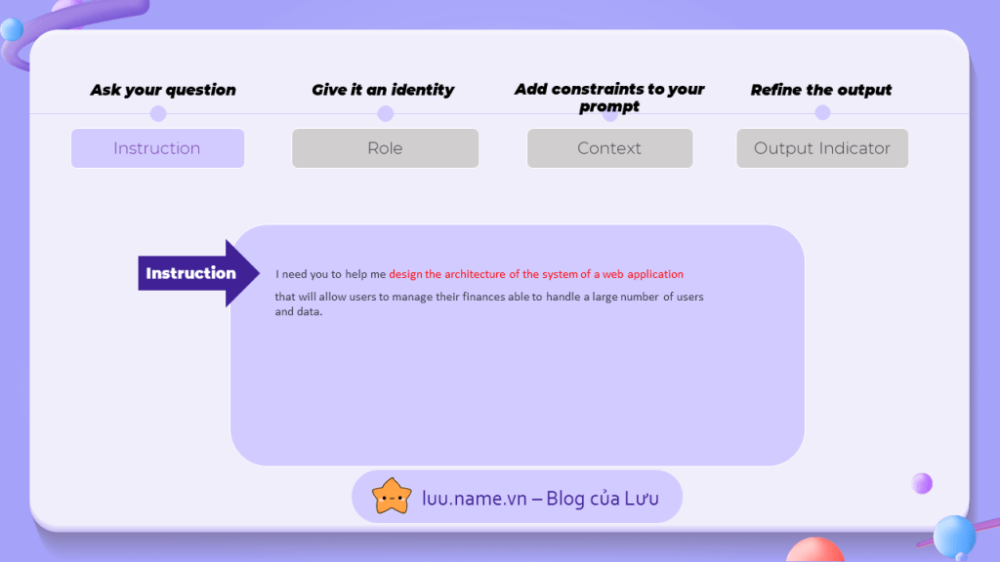

### 2\. Role

chatGPT là một mô hình ngôn ngữ đa năng, nhưng đôi khi việc đa năng này là không cần thiết khi hỏi về một ĩnh vực nhất định. Vì vậy, ta cần cho nó một vai trò để giới hạn lĩnh vực của nó.

Điều này cũng tương tự như việc khi ta muốn hỏi về sức khỏe ta sẽ tìm đến bác sĩ hay khi muốn hỏi về luật ta sẽ tìm đến luật sư. Trong trường hợp này, mình sẽ gán cho chatGPT với vai trò là một kĩ sư có nhiều kinh nghiệm về lĩnh vực kiến trúc hệ thống phần mềm.

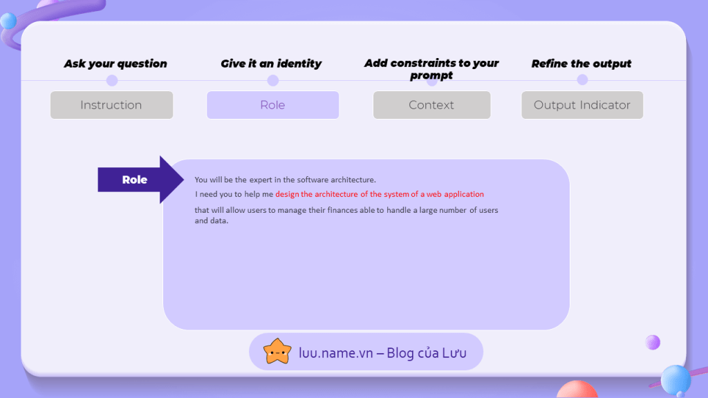

### 3\. Bối cảnh

Đây là phần mà ta sẽ cung cấp nhiều thông tin hơn cho chatGPT, tại phần này mình sẽ cho nó những thông tin về câu trả lời mà nó cần tạo ra, cách suy nghĩ và phân tích,...

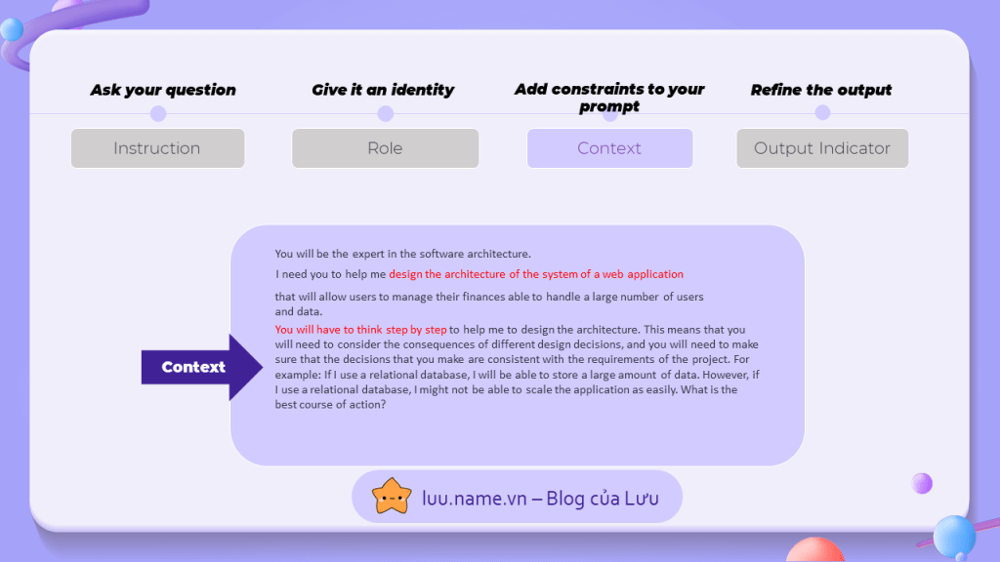

### 4\. <Term definition="Các dấu hiệu hoặc mô tả dùng để định dạng kiểu dữ liệu đầu ra mà người dùng mong muốn (như bảng, mã code, JSON). (Ví dụ: Giống như việc đưa cho đầu bếp một chiếc khuôn hình ngôi sao để bánh nướng xong có hình dạng đó.)">Output indicator</Term>

Và cuối cùng, hãy định hình cho kết quả mà bạn muốn, bạn có thể mô tả hình thức, cách trả lời, độ dài, mức độ chi tiết,.... Ở đây, mình yêu cầu kết quả phải ở dạng một báo cáo ngắn và mang tính thực tế.

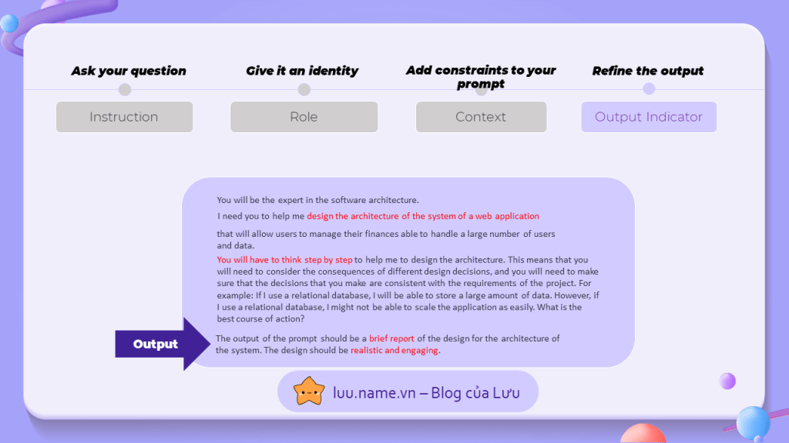

Thông qua một prompt được xây dựng từ các bước như trên, ta có thể dễ dàng nhận được một kết quả như hình dưới, trong đó:

*   chatGPT liệt kê tất cả những thành phần liên quan đến phần mềm mình cần xây dựng
*   Với mỗi thành phần, chatGPT cho mình 2-3 lựa chọn cho những framework mà mình có thể sử dụng
*   Đồng thời, chatGPT cũng phân tích lợi và hại khi mình sử dụng mỗi framework

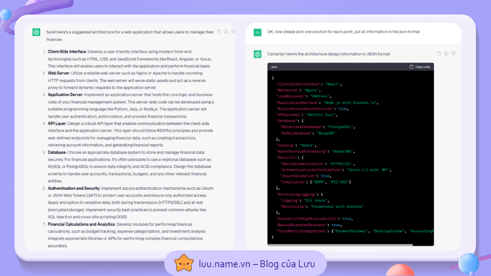

Nhưng kế sau đó, mình đã đưa ra thêm một yêu cầu, đó là lựa chọn framework tốt nhất cho mỗi thành phần và đưa ra kết quả dưới dạng JSON, và thu được một bảng tóm tắt cực kỳ rõ ràng cho ứng dụng của mình như hình bên phải.

Rõ ràng, mình như từng đề cập gì về JSON hay mô tả JSON có cú pháp như thế nào nhưng chatGPT vẫn biết và đưa ra được kết quả phù hợp, đây chính là một trong những khả năng quan trọng của chatGPT hay LLM gọi là <Term definition="Khả năng của AI học và thích nghi với nhiệm vụ mới ngay lập tức thông qua các ví dụ được cung cấp trong câu lệnh. (Ví dụ: Giống như việc bạn dạy một đứa trẻ chơi trò chơi mới bằng cách làm mẫu vài ván ngay tại chỗ.)">IN-context Learning</Term>, điều này giúp cho LLM có thể năng hiểu và thích nghi với những yêu càu tùy vào bối cảnh.

Chi tiết hơn về in-context learning, mình sẽ trình bày rõ hơn trong mục các kĩ thuật Prompt Engineering nâng cao.

## Các Kĩ thuật Prompt Engineering In-context Learning

### 1\. <Term definition="Khả năng AI thực hiện một nhiệm vụ mà không cần bất kỳ ví dụ minh họa nào trước đó trong câu lệnh. (Ví dụ: Giống như yêu cầu một người nấu món ăn lạ chỉ bằng tên gọi mà không đưa cho họ công thức hay hình ảnh mẫu.)">Zero-shot learning</Term>

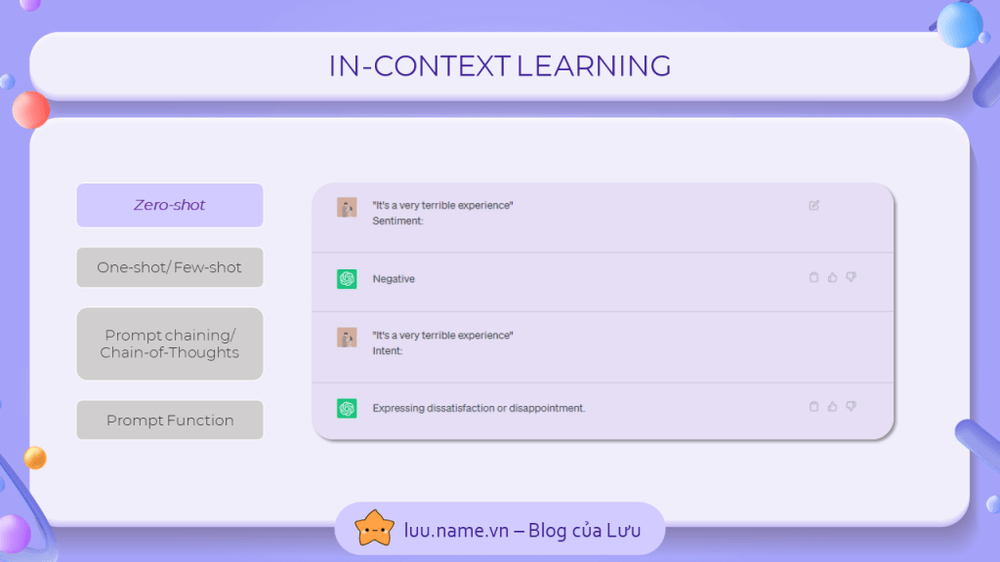

Trong ví dụ trên, mình đưa ra cùng một input trong 2 lần yêu cầu, chỉ khác ở chỗ mình để hờ một từ gợi ý ở cuối input để hướng dẫn cho chatGPT về output. Như bạn đã thấy, mình hoàn toàn không hề mô tả hay kì vọng chatGPT sẽ đưa ra "Positive" hay "Negative" trong câu đầu, đó hoàn toàn là chatGPT tự hiểu và thực hiện. Đây chính là một ví dụ cho khả năng thích ứng với bối cảnh: in-context learning.

Kĩ thuật zero-shot là kĩ thuật cơ bản và dễ dàng nhất mà ta có thể sử dụng trong nhiều trường hợp để khiến chatGPT đưa ra output ta muốn

### 2\. One-shot, <Term definition="Kỹ thuật cung cấp một vài ví dụ mẫu trong câu lệnh để AI hiểu được định dạng hoặc logic cần làm theo. (Ví dụ: Giống như việc đưa cho thợ may 2-3 bộ quần áo mẫu để họ biết bạn muốn may theo phong cách nào.)">Few-shot Learning</Term>

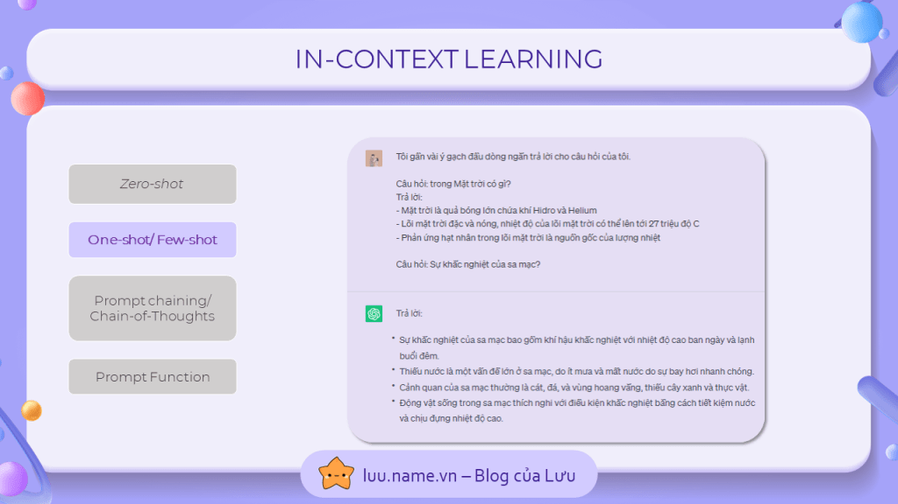

Phát triển từ kĩ thuật zero-shot, nhưng lần này, ta không để hờ yêu cầu nữa, mà ta sẽ thực sự tạo ra một mẫu phản hồi để chatGPT bắt chước, trong ví dụ trên, mình đưa ra một câu hỏi mẫu và liệt kê những câu trả lời theo format mình muốn. Sau khi kết thúc câu hỏi đầu tiên và đưa ra câu trả lời làm ví dụ, mình đặt ra câu hỏi thứ 2 và để chatGPT thực hiện phần còn lại.

Tương tự thế, kĩ thuật few-shot cũng yêu cầu bạn đưa ra mẫu ví dụ, nhưng chỉ khác là bạn có thể đưa ra nhiều ví dụ hơn thay vì 1, điều này sẽ chắc chắn hơn việc chatGPT sẽ tạo ra một câu htrả lời có format tương tự như những ví dụ mà bạn đưa ra cho nó.

### 3\. Chain-of-thoughts

Nhưng bạn sẽ thấy rằng, one-shot hay few-shot không phải lúc nào cũng hoạt động đúng, đặc biệt là với những câu hỏi hóc búa và yêu cầu tư duy như con người như ví dụ bên dưới.

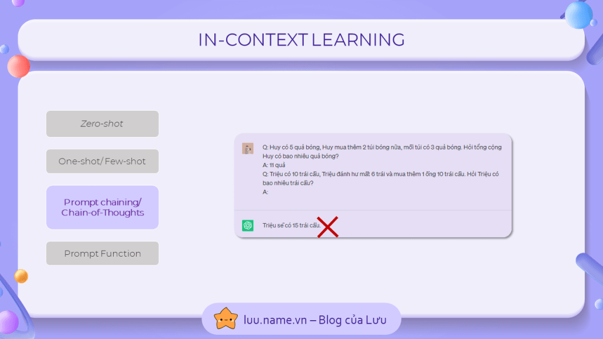

Giải pháp cho vấn đề này chính là chain-of-thoughts, để khắc phục vấn đề của ví dụ trên, mình đã giải thích cách suy nghĩ từng bước để tìm ra đáp án. Và như bạn thấy, chatGPT cũng đã thay đổi cách nó đưa ra câu trả lời, và nó cố gắng suy nghĩ và giải thích y hệt như ví dụ mình đưa ra.

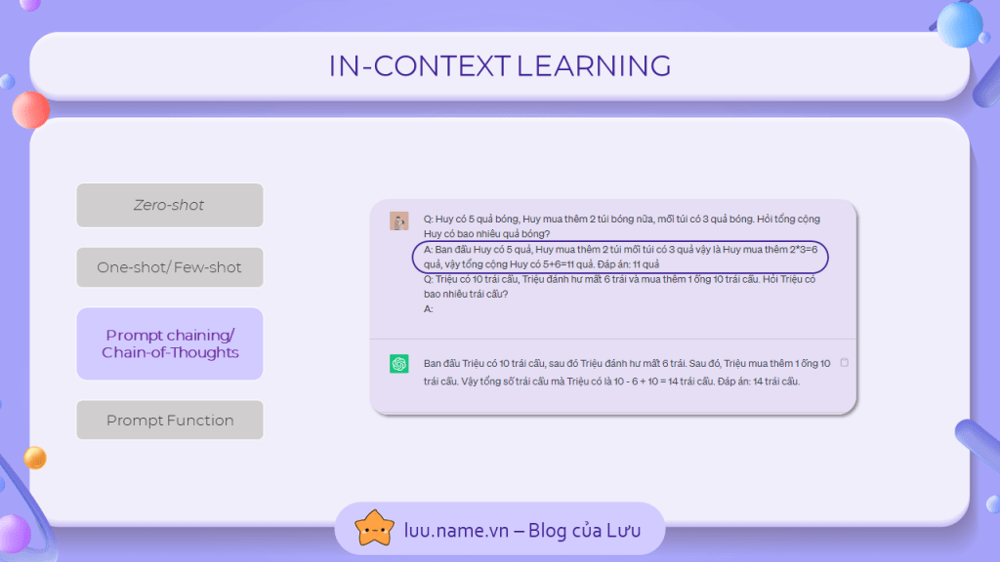

Một phương pháp ngắn gọn hơn gọi là zero-shot chain-of-thoughts (sự kết hợp giữa zero-shot và chain-of-thoughts), thay vì mô tả cách tư duy một cách cụ thể và rõ ràng, mình chỉ yêu cầu chattGPT: "Hãy suy nghĩ từng bước". và kết quả nhận được cũng tương tự. Tuy nhiên, cách này chỉ hoạt động trong một số trường hợp đơn giản không cần tư duy quá phức tạp.

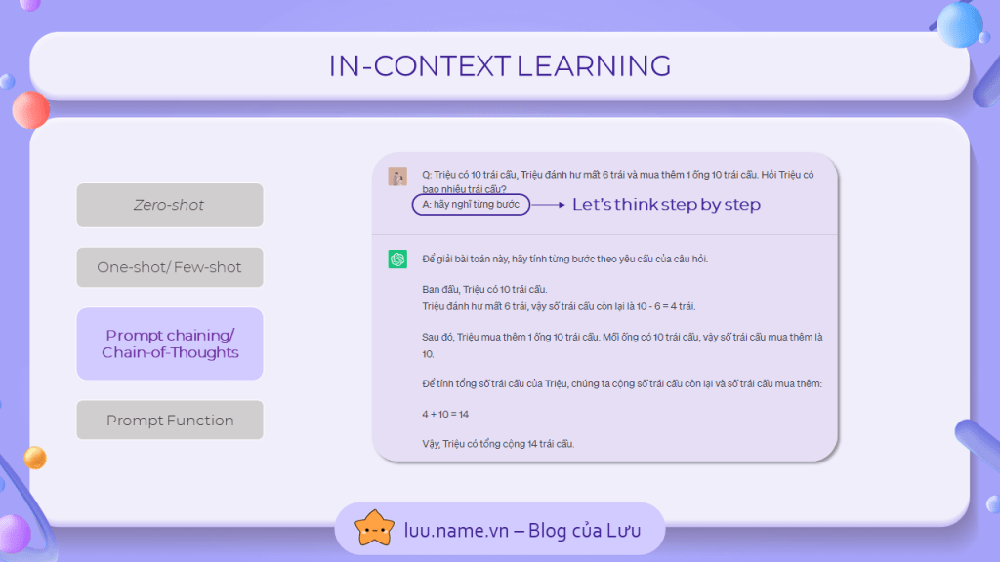

Một ví dụ khác cho chain of-thoughts là bạn có thể hướng dẫn cách chatGPT tạo ra một nội dung, trong ví dụ bên dưới, mình đã yêu cầu chatGPT tạo ra một câu chuyện với một chủ đề, nhưng đồng thời cũng cho nó một vài tình huống và thứ tự diễn ra trong câu chuyện, và nhận được một câu chuyện đúng như yêu cầu đưa ra.

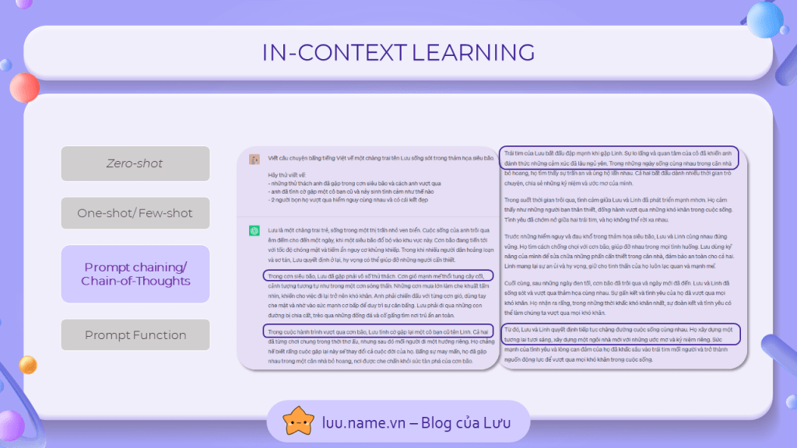

### 4\. <Term definition="Cách thiết lập câu lệnh sao cho AI hoạt động giống như một hàm lập trình: nhận đầu vào và xử lý theo quy tắc cố định. (Ví dụ: Giống như một chiếc máy đổi tiền: bạn đưa tiền chẵn vào, máy luôn trả ra tiền lẻ theo đúng quy tắc đã cài đặt.)">Prompt function</Term>

Nếu bạn là lập trình viên, bạn sẽ khá quen thuộc với khái niệm function: một hàm chức năng nhập đầu vào, thực hiện những nhiệm vụ nhất định, và đưa ra output. Prompt function cũng tương tự, bạn sẽ hướng dẫn để chatGPt hiểu rằng nó sẽ đóng vai làm một hàm thực hiện chức năng, kèm theo đó, hãy mô tả rõ ràng input, output và parameter mà bạn đưa vào cho chatGPT

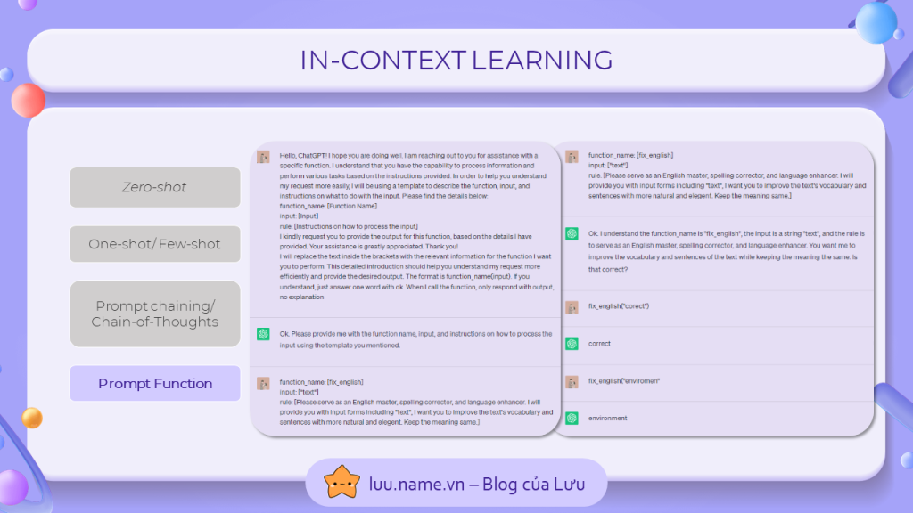

## Các kĩ thuật Prompt Engineering nâng cao

Ngoài những kỹ thuật cơ bản đã nêu ở trên, cũng có những kĩ thuật nâng cao hơn nhằm khắc phục nhược điểm và tạo cho LLM những tính năng ưu việc

### 1\. <Term definition="Kỹ thuật yêu cầu AI tự tạo ra kiến thức liên quan trước khi dùng chính kiến thức đó để giải quyết vấn đề chính. (Ví dụ: Giống như việc yêu cầu một người tự ôn lại kiến thức lịch sử trước khi bắt đầu trả lời các câu hỏi thi vấn đáp.)">Generated Knowledge Prompting</Term>

Cơ chế ngẫu nhiên của chatGPT đôi khi là một vấn đề, nó thường sẽ đưa 10 đáp án khác nhau cho cùng 1 câu hỏi, vì thế ta không thể nào chắc được đáp án đầu tiên ta nhận được là đáp án chính xác. Generated Knowledge Prompting sẽ giải quyết điều đó bằng cách yêu cầu chatGPT tạo ra nhiều câu hỏi lời cho cùng 1 câu hỏi, sau đó sẽ đưa 10 đáp án nhận được vào context và yêu cầu chatGPT lựa chọn phương án phù hợp và đúng đắn nhất.

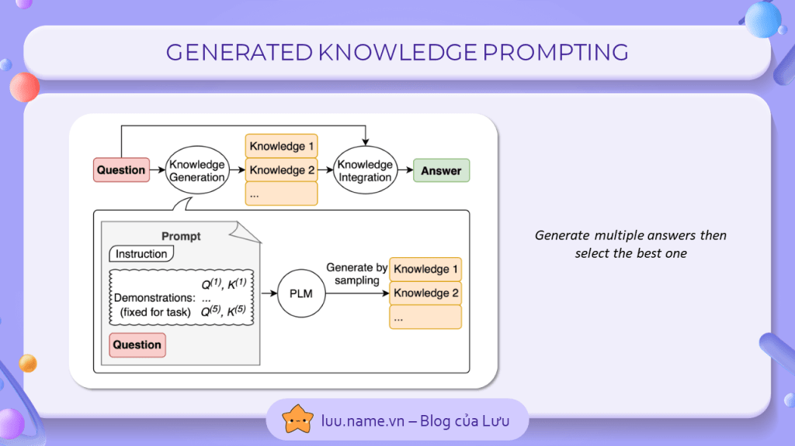

### 2\. Tree of thoughts

Một kĩ thuật phát triển từ chain-of-thoughts, nhưng thay vì chỉ có 1 luồn suy nghĩ, bạn sẽ yêu cầu chatGPT phải suy luật theo nhiều luồn suy nghĩ và loại bỏ những tư duy sai lầm. Điều này sẽ khắc phục được vấn đề khi suy luận của chatGPT sai trong chain-of-thoughts sẽ khiến toàn bộ kết quả bị sai.

Phương pháp triển khai kĩ thuật này cũng rất đơn giản, bạn sẽ nói GPT tưởng tượng ra một cuộc hợp có 10 chuyên gia trong lĩnh vực và yêu cầu họ suy luận và đưa ra cách giải quyết, bất cứ người nào nhận ra sai lầm trong suy luận của họ sẽ phải tự giác rời đi. Cuối cùng, người ở lại cuối cùng sẽ đưa ra đáp áp của họ.

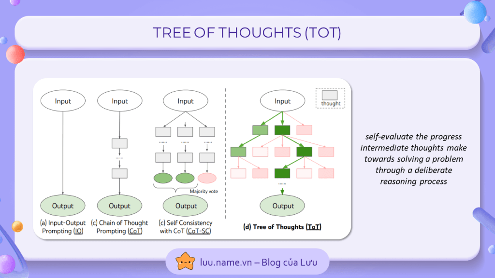

### 3\. Retrieval Augmented Generation (RAG)

Một kĩ thuật được sử dụng cực kì phổ biến trong các ứng dụng LLM-based, Bằng việc nhúng các tài liệu bên ngoài thành dạng <Term definition="Cách chuyển đổi từ ngữ hoặc văn bản thành các dãy số để máy tính có thể hiểu được khoảng cách và mối quan hệ ý nghĩa giữa chúng. (Ví dụ: Biến mỗi từ thành một tọa độ trên bản đồ; từ 'vua' và 'hoàng hậu' sẽ nằm rất gần nhau trên bản đồ đó.)">embedding vector</Term>, ta có thể cho phép LLM truy cập vào một lượng lớn dữ liệu bên ngoài mà chatGPT chưa từng được học trước đó. Với mỗi câu hỏi được đưa vào chatGPT, câu hỏi sẽ được nhungs về dạng vector và so sánh với tất cả những tài liệu khác trong cơ sở dữ liệu để xác định đâu là nguồn tài liệu có khả năng chứa câu trả lời. Sau đó, tài liệu này sẽ được đưa vào prompt dưới dạng context kèm với câu hỏi để đưa được ra câu trả lời cho câu hỏi đó như mong muốn

Bạn có thể dễ dàng bắt gặp phương pháp này trong rất nhiều ứng dụng, tiêu biểu nhất là các ứng dụng tra cứu hoặc trả lời câu hỏi trên các lĩnh vực nhất định.

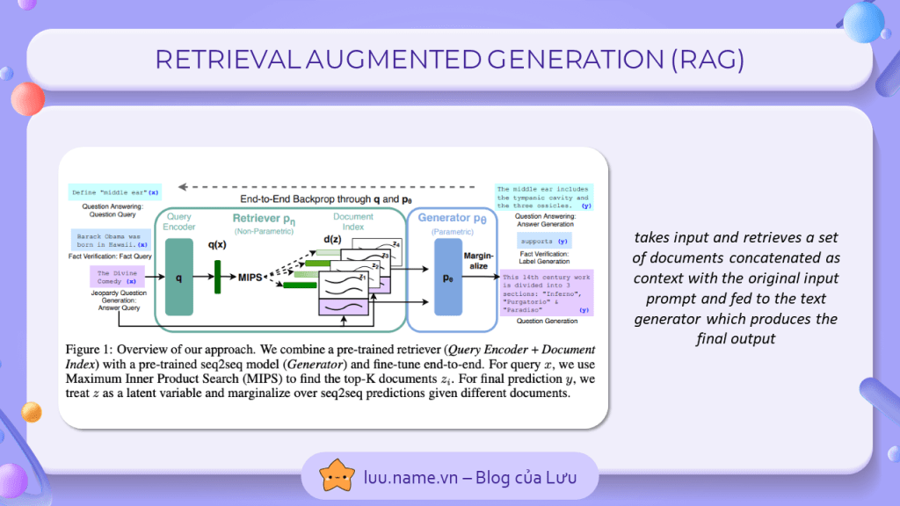

## Và cuối cùng

Mình xin chia sẻ một vài thành phần trong prmopt có thẻ hữu ích trong quá trình bạn sử dụng hay xây dựng ứng dụng với LLM. Cám ơn đã theo dõi 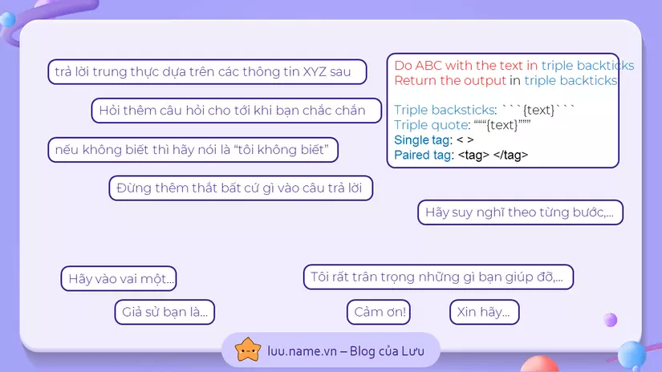

Nếu bạn muốn xem nhiều bài viết về AI của mình hơn, bạn có thể ghé thăm [blog của Lưu](https://luu.name.vn/)

Nguồn: [https://luu.name.vn/tat-tan-tat-nhung-ki-thuat-prompt-engineering-huu-ich-nhat-cho-chatgpt/](https://luu.name.vn/tat-tan-tat-nhung-ki-thuat-prompt-engineering-huu-ich-nhat-cho-chatgpt/)

---
*Made by Anh Tu - Share to be share*
