import Term from '@site/src/components/Term';

> Bài viết được biên dịch tự động bởi **Aha! Mind Socratic Engine** và đã được tinh chỉnh lại theo văn phong sư phạm. Nguồn bài viết: [Link gốc](https://learn.microsoft.com/en-us/azure/machine-learning/how-to-understand-automated-ml?view=azureml-api-2)

<!-- truncate -->

Khi chạy một thử nghiệm **Automated Machine Learning (AutoML)** trên Azure, hệ thống sẽ tự động tạo ra rất nhiều công việc (jobs), mỗi công việc tương ứng với một mô hình (model) được huấn luyện. Tuy nhiên, vấn đề đặt ra là: **Làm sao để biết mô hình nào là tốt nhất?** 

Đó là lúc chúng ta cần đến các **chỉ số đánh giá (evaluation metrics)** và **biểu đồ (charts)**. Bài viết này sẽ hướng dẫn bạn cách đọc hiểu và phân tích kết quả của các mô hình phân loại (classification), hồi quy (regression), dự báo (forecasting) và cả mô hình hình ảnh (image models).

> **💡 Root Cause Analysis:** Trước đây, các Data Scientist phải tự vẽ biểu đồ và tính toán chỉ số cho từng mô hình bằng tay, cực kỳ tốn thời gian. AutoML giải quyết vấn đề này bằng cách tự động sinh ra các báo cáo trực quan, giúp chúng ta nhanh chóng đưa ra quyết định dựa trên dữ liệu (data-driven decisions).

---

## 1. Cách xem kết quả chạy mô hình (View job results)

Sau khi thử nghiệm AutoML hoàn tất, bạn có thể xem lịch sử chạy thông qua Azure Machine Learning Studio hoặc dùng Python SDK. 

**Các bước cơ bản trên Azure ML Studio:**
1. Đăng nhập vào [Azure ML Studio](https://ml.azure.com/) và vào Workspace của bạn.
2. Chọn menu **Jobs** ở bên trái.
3. Nhấp vào thử nghiệm bạn vừa chạy.
4. Chọn một job AutoML cụ thể trong bảng.
5. Chuyển sang tab **Models** và chọn thuật toán (Algorithm name) bạn muốn xem.
6. Mở tab **Metrics** để xem các biểu đồ đánh giá.

---

## 2. Các chỉ số phân loại (Classification Metrics)

Trong bài toán phân loại (Classification), hệ thống dự đoán dữ liệu thuộc về một danh mục nào đó (VD: Email rác hay không rác). Azure AutoML sử dụng thư viện `scikit-learn` để tính toán.

### 2.1. Đánh đổi: Binary vs Multiclass (Nhị phân vs Đa lớp)

Khi đánh giá, chúng ta thường sử dụng các phương pháp tính trung bình để gom điểm của nhiều lớp lại:
- **Macro**: Tính trung bình cộng của tất cả các lớp (không phân biệt lớp đông hay lớp ít). Giúp ưu tiên các lớp thiểu số (minority class).
- **Micro**: Tính tổng toàn bộ True Positives, False Negatives, False Positives của mọi lớp, sau đó mới tính điểm.
- **Weighted**: Tính trung bình có trọng số dựa trên số lượng mẫu thực tế của từng lớp.

> **⚖️ Trade-off (Đánh đổi):** Nếu dữ liệu của bạn bị mất cân bằng (Imbalanced Data - ví dụ: 99% email thường, 1% email rác), dùng **Macro** sẽ giúp bạn đánh giá khả năng mô hình bắt được email rác tốt hơn, trong khi **Weighted** có thể bị "kéo" bởi 99% email thường, khiến điểm số trông có vẻ cao nhưng thực tế mô hình lại nhận diện email rác kém.

### 2.2. Các khái niệm cốt lõi (Definition Anatomy)

*   **Accuracy (Độ chính xác):** Tỷ lệ các dự đoán đúng trên tổng số dự đoán. Range: `[0, 1]`.
*   **Precision (Độ chuẩn xác):** Trong tất cả các mẫu mà mô hình đoán là Dương tính (Positive), có bao nhiêu mẫu thực sự là Dương tính? 
*   **Recall (Độ phủ):** Trong tất cả các mẫu thực sự là Dương tính, mô hình đã bắt được bao nhiêu phần trăm?
*   **F1 Score:** Điểm trung bình điều hòa (Harmonic mean) giữa Precision và Recall.

> **💡 Mẹo nhớ:** **Precision** là "đoán phát nào, trúng phát đó" (tránh nhận nhầm). **Recall** là "thà giết lầm còn hơn bỏ sót" (tránh bỏ lót). Trong thực tế, bạn phải đánh đổi giữa 2 chỉ số này tùy bài toán (VD: Chẩn đoán ung thư cần Recall cao, Lọc spam cần Precision cao).

### 2.3. Ma trận nhầm lẫn (Confusion Matrix)

Confusion Matrix là biểu đồ trực quan nhất để xem mô hình đang "nhầm lẫn" giữa các lớp như thế nào. Trục y là giá trị thực tế (True class), trục x là giá trị dự đoán (Predicted class). 

*   **Raw view:** Xem số lượng mẫu thực tế để phát hiện mất cân bằng dữ liệu.
*   **Normalized view:** Xem tỷ lệ phần trăm phân loại đúng/sai của từng lớp.

Mô hình càng tốt thì màu càng đậm (giá trị càng cao) ở **đường chéo chính** (từ góc trên trái xuống góc dưới phải).

**Ví dụ:**
- **Mô hình tốt:**

- **Mô hình kém:**
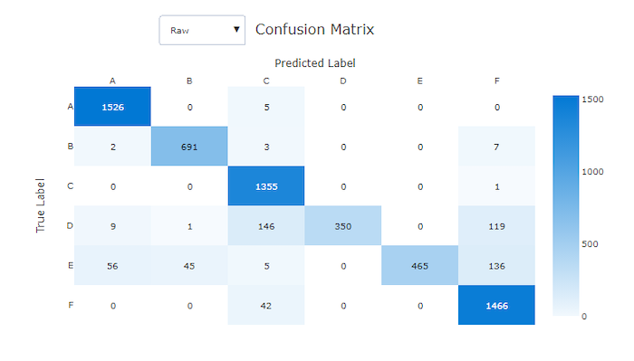

### 2.4. Đường cong ROC (ROC Curve) & AUC

Đường cong ROC (Receiver Operating Characteristic) thể hiện sự đánh đổi giữa **True Positive Rate (TPR - Recall)** và **False Positive Rate (FPR)** khi ta thay đổi ngưỡng quyết định (threshold). 
*   **AUC (Area Under the Curve):** Diện tích dưới đường cong ROC. Càng gần 1 càng tốt.
*   Mô hình tốt sẽ có đường cong cong hẳn lên góc trên cùng bên trái. Mô hình đoán ngẫu nhiên sẽ là đường chéo `y = x`.

- **Mô hình tốt:**

- **Mô hình kém:**

### 2.5. Precision-Recall Curve

Đường cong PR hữu ích hơn ROC khi dữ liệu bị **mất cân bằng nặng**. Nó cho thấy mô hình duy trì Precision tốt đến mức nào khi ta cố gắng tăng Recall.

- **Mô hình tốt:**
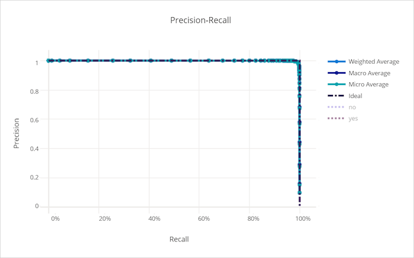
- **Mô hình kém:**
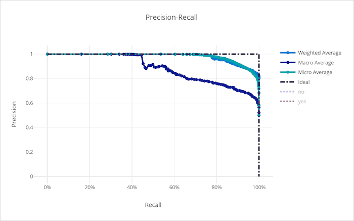

### 2.6. Các biểu đồ mở rộng (Cumulative Gains, Lift, Calibration)

*   **Cumulative Gains Curve:** Đánh giá phần trăm mẫu Positive mà ta tìm được nếu xét theo xác suất dự đoán từ cao xuống thấp.
    
    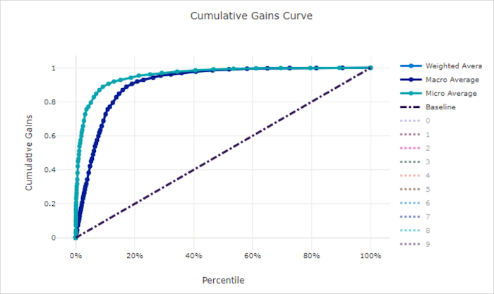
*   **Lift Curve:** Đo lường mô hình này "tốt hơn bao nhiêu lần" so với việc chọn ngẫu nhiên.
    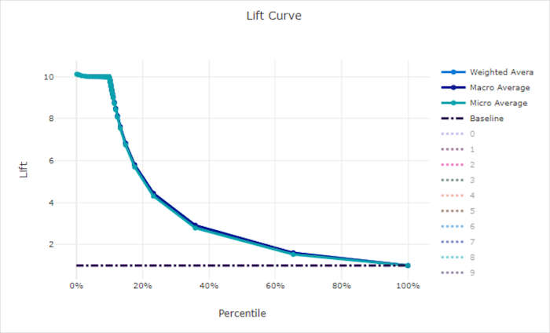
    
*   **Calibration Curve:** Đo độ "tự tự tin" của mô hình. Một mô hình được tinh chỉnh tốt sẽ có độ tự tin (confidence) sát với tỷ lệ đúng thực tế (đường chéo `y=x`). Mô hình kém có thể "quá tự tin" hoặc "kém tự tin".
    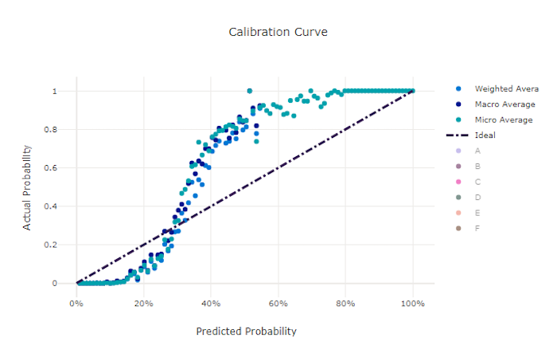
    

---

## 3. Các chỉ số Hồi quy và Dự báo (Regression & Forecasting Metrics)

Thay vì dự đoán một danh mục, Regression dự đoán một **con số liên tục** (VD: Giá nhà, nhiệt độ). 

*   **MAE (Mean Absolute Error):** Trung bình trị tuyệt đối của sai số. Càng gần 0 càng tốt. Dễ hiểu vì giữ nguyên đơn vị.
*   **RMSE (Root Mean Squared Error):** Căn bậc hai của trung bình bình phương sai số. Phạt nặng các lỗi dự đoán sai lệch lớn.
*   **R2 Score:** Hệ số xác định. Mức độ phương sai của biến mục tiêu được giải thích bởi mô hình. Càng gần 1 càng tốt.

> **💡 Lưu ý về Chuẩn hóa (Normalization):** AutoML chia các sai số (Error) cho **Khoảng giá trị (Range)** của dữ liệu để ra `normalized_error`. Điều này giúp so sánh công bằng giữa các mô hình huấn luyện trên các tập dữ liệu có thang đo khác nhau.

### 3.1. Biểu đồ Residuals (Phần dư)

Residuals = `Dự đoán - Thực tế`. Biểu đồ này thể hiện phân phối của sai số. Mô hình tốt có hình chuông (chuẩn) với đỉnh tại 0. Mô hình xấu sẽ bị lệch (bias).

- **Mô hình tốt:**
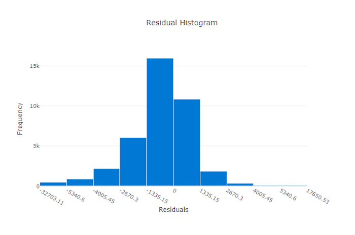
- **Mô hình kém:**
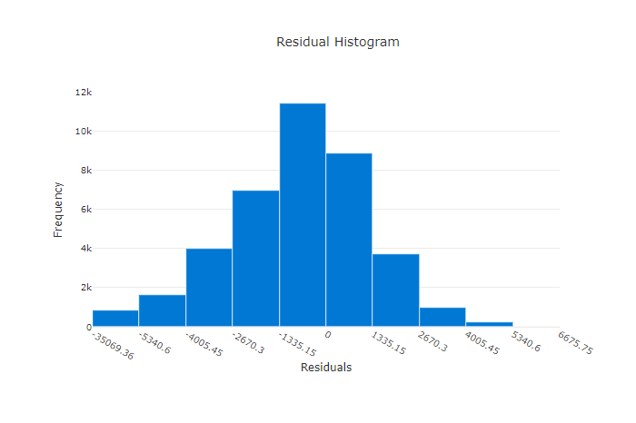

### 3.2. Predicted vs. True (Dự đoán vs. Thực tế)

Vẽ giá trị thực tế (trục x) so với giá trị dự đoán (trục y). Lý tưởng nhất là các điểm phân bố dọc theo đường chéo `y = x`.

- **Mô hình tốt:**

- **Mô hình kém:**
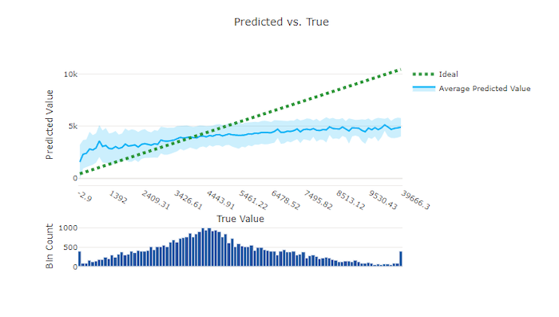

### 3.3. Forecast Horizon (Tầm nhìn dự báo)

Dành riêng cho Time-series (Chuỗi thời gian). Biểu đồ thể hiện dự đoán của mô hình theo thời gian so với dữ liệu thực tế, cùng với dải màu tím thể hiện khoảng tin cậy (confidence interval).

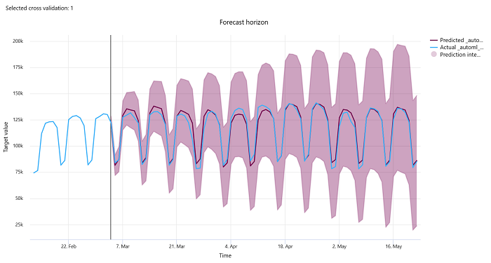

---

## 4. Các chỉ số mô hình Hình ảnh (Image Models - Preview)

Mô hình hình ảnh tính toán hiệu suất ở **cấp độ Epoch** (mỗi vòng lặp huấn luyện đi qua toàn bộ dữ liệu).

*   **Image Classification (Phân loại ảnh):** Dùng `Accuracy` hoặc `IoU` (Intersection over Union) làm thước đo chính. Cung cấp báo cáo phân loại (Classification Report) ở epoch tốt nhất.
    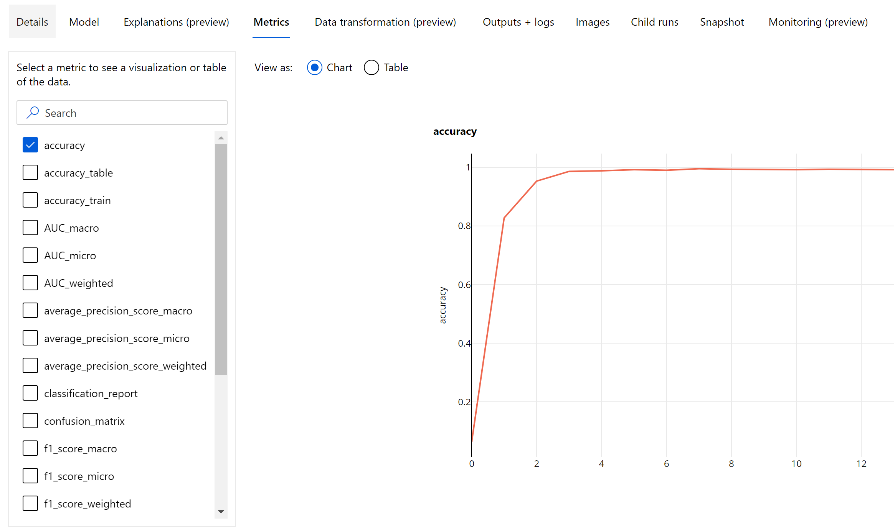
    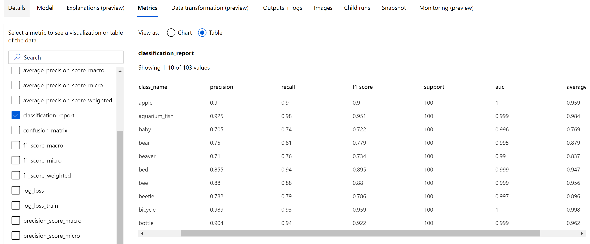

*   **Object Detection (Phát hiện đối tượng) & Instance Segmentation:** Dùng chỉ số **mAP** (mean Average Precision). mAP đo lường diện tích đè lên nhau (IoU) giữa khung hộp dự đoán (Bouding Box) và khung thực tế (Ground-truth). 
    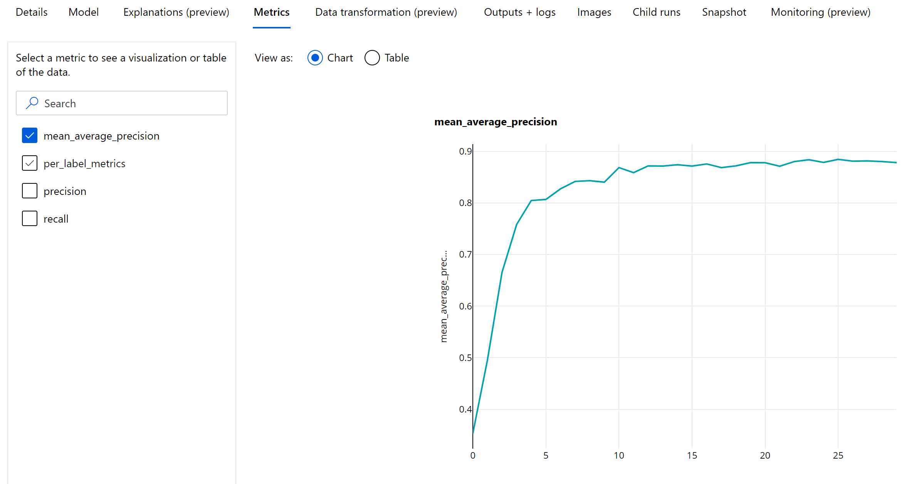

---

## 5. Bảng điều khiển Responsible AI (Trí tuệ nhân tạo có trách nhiệm)

Azure ML không chỉ dừng lại ở chỉ số đo lường hiệu năng. Hệ thống cung cấp **Responsible AI Dashboard** giúp bạn:
1.  Đánh giá tính công bằng (Fairness assessment) - Đảm bảo mô hình không thiên vị (bias) một nhóm cụ thể.
2.  Khám phá dữ liệu (Data exploration).
3.  Diễn giải học máy (Machine learning interpretability) - Giải thích mô hình dùng đặc trưng (feature) nào để ra quyết định.
4.  Phân tích lỗi (Error analysis).

> Cần hiểu rằng: Một mô hình có độ chính xác cao chưa chắc đã là một mô hình "có đạo đức" và "có thể giải thích được" (Explainable AI). 

Để biết thêm chi tiết, hãy tham khảo các Notebook mẫu của Azure hoặc [tài liệu chính thức về Responsible AI.](https://learn.microsoft.com/en-us/azure/machine-learning/how-to-responsible-ai-insights-ui?view=azureml-api-2)

---
*Made by Anh Tu - Share to be share*
