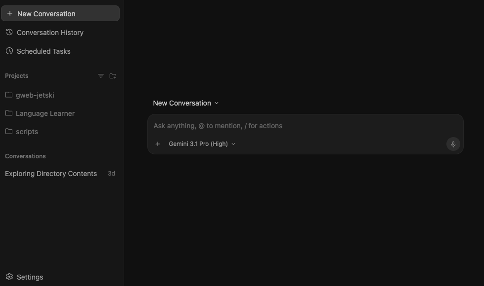
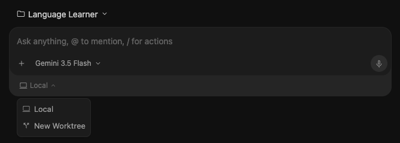

import Term from '@site/src/components/Term';

> Bài viết được biên dịch tự động bởi **Aha! Mind Socratic Engine**. Nguồn bài viết: [Link gốc](https://antigravity.google/blog/google-io-2026-feature-deep-dive?app=antigravity-ide)

<!-- truncate -->
### Core Agent Features

#### <Term definition="Các tác vụ hoặc AI con được tạo ra bởi AI chính để giải quyết một công việc chuyên biệt cụ thể. (Ví dụ: Giống như việc tổ trưởng thuê thêm các cộng tác viên chuyên môn hóa để làm hộ các việc vặt.)">Subagents</Term>

Antigravity now supports subagents beyond just the single specialized browser subagent. Subagents are now modular, specialized, or <Term definition="Trạng thái hoàn toàn trống trơn, chưa có thiết lập, dữ liệu hay định hướng gì từ trước. (Ví dụ: Giống như một cuốn sổ tay mới tinh chưa viết một chữ nào, sẵn sàng để bạn vẽ gì lên cũng được.)">blank-slate</Term> assistant agents <Term definition="Được tạo ra tự động bằng mã code thay vì do con người click chuột thủ công trên giao diện. (Ví dụ: Giống như việc phân thân trong game bằng cách bấm một phím tắt, nhân vật phụ tự động xuất hiện.)">spawned programmatically</Term> by the main agent. They can be built-in roles, generic clones (take on the same prompt and environment as the main agent), or dynamically registered <Term definition="Thực hiện ngay trong lúc chương trình đang chạy (runtime) mà không cần dừng lại để cấu hình hay biên dịch trước. (Ví dụ: Giống như việc bạn vừa chạy xe vừa thay lốp mà không cần dừng xe lại.)">on the fly</Term> (i.e. the main agent defines the subagent’s goal as required by the currently active task). Subagents inherit tool configurations and security permissions from the main agents, ensuring they have the rights to perform the designated tasks, but no more.

Subagents allow for parallelization with workspace isolation, meaning chunkier tasks get completed quicker, and often better since the main agent’s <Term definition="Giới hạn lượng thông tin (từ ngữ, dữ liệu) tối đa mà một mô hình AI có thể nhớ và xử lý trong một lượt trò chuyện. (Ví dụ: Giống như bộ nhớ ngắn hạn của con người, chỉ nhớ được một số lượng trang sách nhất định đang mở trước mắt.)">context window</Term> is not polluted with multiple active threads of work.

#### <Term definition="Xử lý bất đồng bộ, cho phép một tác vụ chạy ngầm mà không bắt toàn bộ hệ thống phải dừng lại chờ đợi nó hoàn thành. (Ví dụ: Giống như việc bạn bỏ đồ vào máy giặt rồi đi nấu cơm, thay vì đứng im chờ máy giặt xong mới làm việc khác.)">Asynchronous</Term> Task Management

Historically, some operations (ex. installing npm packages) would take a long time and block the agent from doing future work (ex. writing the application code). Antigravity’s agents now support asynchronous task management, which means that these long-running operations are <Term definition="Đẩy bớt công việc nặng nhọc sang một bộ phận hoặc tiến trình khác xử lý để giảm tải cho hệ thống chính. (Ví dụ: Giống như việc bạn thuê shipper giao hàng hộ để bạn rảnh tay tập trung sản xuất sản phẩm.)">offloaded</Term> to a background process so they do not block the main agent's active loop or the user interface.

Subagents can also be run as asynchronous background tasks! In such a world, the main agent’s handler invokes the subagents and immediately <Term definition="Nhường quyền điều khiển hoặc tài nguyên hệ thống lại cho luồng khác hoặc cho người dùng. (Ví dụ: Giống như việc tài xế xe buýt nhường vô lăng cho tài xế phụ để vào cabin nghỉ ngơi.)">yields control</Term> back to the user. The background task sets up an intercepting message client to catch and stream subagent responses back to the main agent’s progress log in real-time. The background task then loops and polls the subagent states periodically. Once all subagents have finished their execution, the background task concludes.

#### JSON <Term definition="Các điểm neo trong mã nguồn cho phép chèn thêm code tùy biến vào trước hoặc sau một sự kiện cụ thể. (Ví dụ: Giống như việc bạn gắn thêm một chiếc chuông báo động vào tay nắm cửa, cứ hễ ai vặn cửa là chuông tự kêu.)">Hooks</Term>

Hooks allow users to execute custom local shell scripts at critical stages of an Antigravity agent's execution cycle, such as before a tool execution (can help customize arguments), after a tool execution (useful for logging), before a model call (to inject system instructions), after a model call (to override exit rules), or at agent loop stopping conditions (to force checks or block termination). Antigravity now supports both global hooks and workspace-specific hooks, with the latter taking precedence if it exists, stored in json files. See the [documentation](https://antigravity.google/docs/hooks) for details on schemas and expected file locations.

### Agent Management

We are introducing the core agent management <Term definition="Đơn vị cấu trúc cơ bản nhất, cốt lõi nhất trong lập trình, không thể chia nhỏ hơn được nữa. (Ví dụ: Giống như những viên gạch Lego cơ bản nhất dùng để xây nên cả một tòa lâu đài phức tạp.)">primitive</Term> of a “project.” A project controls the settings (ie. how should the agent behave overall?), available resources (ie. what does the agent have access to?), and permissions (ie. is the agent allowed to take a certain action?) for all agents that are invoked within that project.

Since agents are no longer tied to a single repository for organization and management reasons, users can make multiple local folders available to the agents in a particular project. Projects allow users to have appropriately <Term definition="Được giới hạn phạm vi hoạt động hoặc quyền hạn trong một ranh giới nhất định. (Ví dụ: Giống như việc cấp thẻ ra vào chỉ có hiệu lực trong tầng 1 của tòa nhà chứ không lên được tầng khác.)">scoped</Term> settings and permissions for different agents, as opposed to requiring the user to adopt the most broad permissions out of any task for _all_ agents. By default, each project adopts your global permissions. These can be augmented at the project level, and settings must be explicitly set at the project level. The default settings are an Antigravity-defined set of standard, conservative settings.

If you have a simple <Term definition="Tác vụ chỉ xảy ra một lần duy nhất rồi thôi, không lặp lại định kỳ. (Ví dụ: Giống như việc bạn thuê thợ sửa ống nước bị hỏng một lần, chứ không ký hợp đồng bảo trì hàng tháng.)">one-off</Term> task that doesn’t require a project, you can also start a “standalone” agent (using “New Conversation” without selecting a project). These agents will adopt your global permissions and the Antigravity-defined standard settings, with the resulting conversations appearing in a separate section in the left side panel.

Standalone conversations are grouped separately on the left side panel.

Speaking of the left side panel, it has been revamped to allow for easier sorting and identification. You can now group conversations by project, status, or recency, change the display name of projects, and toggle on <Term definition="Tính năng của Git cho phép bạn làm việc trên nhiều nhánh (branch) khác nhau cùng một lúc trong các thư mục riêng biệt trên máy tính. (Ví dụ: Giống như việc bạn nhân bản văn phòng làm việc ra thành nhiều phòng khác nhau để vừa tiếp khách vừa họp nội bộ mà không bị lẫn lộn đồ đạc.)">worktree</Term> names. Speaking of which, Antigravity 2.0 comes with **native Git worktree support**! Just select “New Worktree” when starting a conversation, and Antigravity will handle first <Term definition="Quá trình chuẩn bị, thiết lập và cấp phát tài nguyên (máy chủ, mạng, thư mục) sẵn sàng để sử dụng. (Ví dụ: Giống như việc ban tổ chức dựng sẵn sân khấu, lắp loa đài trước khi ca sĩ đến biểu diễn.)">provisioning</Term> a worktree in the background before starting the conversation in that new worktree path, keeping your active directory clean. Fun fact: if the main agent delegates to multiple subagents that need to work in isolation, it autonomously creates the worktrees for those conversations and handles cleanup automatically.

Native Git worktrees can be created easily when starting a new conversation.

### Scheduled Tasks

Scheduled Tasks allow you to set <Term definition="Trình lập lịch tự động chạy các tác vụ theo thời gian được định sẵn. (Ví dụ: Giống như chiếc đồng hồ báo thức gọi bạn dậy đúng giờ mỗi sáng một cách tự động.)">crons</Term> for prompts that you would like agents to tackle periodically, without requiring your manual prompting or invocation. These could be for daily digests on open pull requests, hourly checks on live deployments, monthly reports on system architecture changes, and more.

You simply set the schedule, prompt, and project, and the agents will launch in the background accordingly, with resulting conversations appearing in the sidebar. You can continue interacting with any of these agents, allowing for a seamless handoff from asynchronous to <Term definition="Quy trình vận hành tự động của AI nhưng vẫn cần có sự can thiệp, giám sát hoặc phê duyệt của con người ở những bước quan trọng. (Ví dụ: Giống như xe tự lái nhưng vẫn cần tài xế đặt tay hờ lên vô lăng để xử lý tình huống khẩn cấp.)">human-in-the-loop</Term>:

Agents invoked by Scheduled Tasks are fixed to use [Gemini 3.5 Flash](https://antigravity.google/blog/gemini-3-5-flash-in-google-antigravity), and we will explore adding model selection in the future.

### Voice

Studies show that humans average 50 words-per-minute by typing and 150 words-per-minute by talking. More and more Googlers are adopting voice as their preferred input <Term definition="Dạng thức hoặc kênh giao tiếp mà hệ thống sử dụng (như văn bản, giọng nói, hình ảnh). (Ví dụ: Giống như các giác quan của con người: mắt để nhìn (hình ảnh), tai để nghe (âm thanh), miệng để nói.)">modality</Term>. In Antigravity 2.0, we are introducing live transcription using the latest Gemini Audio models to all tiers. Just click the mic icon next to text input boxes in the product and prompt away. One of the most powerful aspects of the new Gemini Audio model is that it is able to convert <Term definition="Cách nói chuyện dài dòng, lan man, lộn xộn không có cấu trúc rõ ràng. (Ví dụ: Giống như một người say rượu kể chuyện, đi từ chủ đề này sang chủ đề khác mà không có điểm dừng.)">rambling</Term> speech into clearly phrased text. Now you don’t have to spend time on stylistic edits of the input before sending the prompt to the model. You are also able to make any edits before sending the prompt if you want to add additional information or there were minor errors in the transcription.

play\_arrow

Live voice transcription.

### New Slash Commands

We are also introducing a number of new “slash commands,” which are quick ways to provide additional guidance to the agent directly in the prompt box.

1.  **/goal** — Tells the agent to run until the specified task is completely finished, not asking for intermediate input from the user. The agent will automatically approve its own implementation plan, not ask for clarifications, and will return once it determines that the task has been completed.
2.  **/<Term definition="Yêu cầu đối phương chất vấn, hỏi dồn dập để làm rõ mọi khía cạnh của vấn đề. (Ví dụ: Giống như một buổi bảo vệ luận án trước hội đồng giám khảo khó tính, họ hỏi dồn dập để bạn lộ ra kẽ hở.)">grill-me</Term>** — To some degree, agents are only as good as the prompts provided to them, and it is common for users to miss important details or to overlook providing critical guidance. With this command, the agent will ask clarification questions back to the user to align on the specific details of the task specification and plan before starting to implement.
3.  **/schedule** — Run a prompt as a one-time event in the future (capped at 15 minutes) or on some recurring schedule (via Scheduled Tasks). Just provide details on the desired schedule as natural language in the prompt. An example of a one-time call would be `/schedule in 5 minutes check if the build has finished` while you can set a cron like `/schedule every hour run the health check script, up to 3 times`.
4.  **/browser** — One of the most loved features of Antigravity is the ability for the agent to autonomously launch, <Term definition="Kích hoạt hoặc điều khiển một cơ cấu, thiết bị thực hiện hành động vật lý hoặc mô phỏng. (Ví dụ: Giống như việc bạn nhấn nút để cánh tay robot bắt đầu gắp đồ vật.)">actuate</Term>, and observe the browser via a specialized subagent. This has been particularly helpful for users building <Term definition="Quá trình tạo ra một sản phẩm hoàn toàn mới từ con số không, đòi hỏi sự sáng tạo đột phá. (Ví dụ: Giống như việc phát minh ra chiếc xe hơi đầu tiên trên thế giới, thay vì chỉ nâng cấp một chiếc xe hơi có sẵn.)">zero-to-one</Term> apps. However, we have also heard the feedback that the main agent was still not capable enough to determine exactly _when_ to be using the browser (as opposed to using other tools such as web search). This led to frustration where the browser got in the way of the user, especially when the human was in the loop. So, we are moving browser use to a slash command. When used, the agent will diligently use the browser, and when not, it will not consider browser-related tools at all. We recognize that this puts some burden back to the user to remember to use /browser, but we believe this is the appropriate design pattern until we get a stronger signal on the main agent’s ability to do so autonomously.

### Looking Forward

This was not even the full list. We put in a significant amount of work on general UI polish, built a lot of new custom UI/UX for the new agent features, and worked on performance improvements to make your experience as snappy as possible.

This is also just the start. There are many ways that Antigravity can continue to extend: non-code resources, remote environments, additional surfaces, etc. We are exploring them all, keeping a clear eye on security and trust as we do so.

Try these features out in Antigravity 2.0 today:

---
*Made by Anh Tu - Share to be share*
