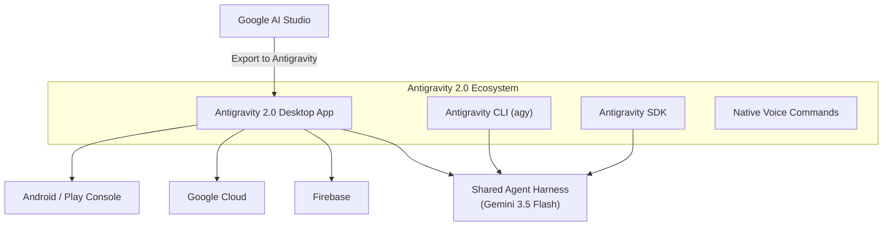
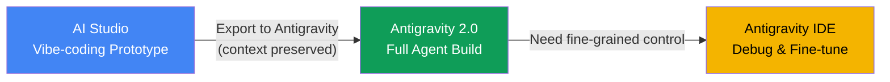

import Term from '@site/src/components/Term';

> Source: [Google Antigravity 2.0: Từ IDE sang nền tảng Agent-First toàn diện](https://viblo.asia/p/google-antigravity-20-tu-ide-sang-nen-tang-agent-first-toan-dien-13VM9DWGVY7) — Viblo MayFest 2026.

<!-- truncate -->

## Agenda

**Estimated reading time:** ~12 minutes

### Learning Outcomes:

- Understand what Google Antigravity 2.0 is and why Google built a separate product from the existing IDE
- Explain the 4 components of the Antigravity 2.0 ecosystem (Desktop App, CLI, SDK, Voice)
- Distinguish when to use Antigravity IDE vs. Antigravity 2.0 for different development workflows
- Evaluate the trade-offs of the "agent-first" development paradigm against traditional code editing

---

## Glossary and Vocabulary

**1. Technical Terms:**

| Term | Vietnamese Meaning and Quick Explain |
| :--- | :--- |
| **Agent-First** | Triết lý thiết kế đặt AI agent làm trung tâm. Mọi tính năng xoay quanh việc tối ưu cho agent hoạt động thay vì con người gõ code trực tiếp. |
| **Orchestration** | Điều phối — Quản lý nhiều agent/service hoạt động đồng bộ để đạt mục tiêu chung. Tương tự nhạc trưởng điều khiển dàn nhạc. |
| **Subagent** | Agent con — AI phụ được sinh ra bởi agent chính để xử lý một task chuyên biệt, tránh làm "ô nhiễm" context window. |
| **Harness** | Khung chạy dùng chung — Bộ khung thực thi kết nối và điều phối các agent một cách thống nhất. |
| **SLA** | Service Level Agreement — Cam kết chất lượng dịch vụ giữa provider và khách hàng (uptime, response time). |
| **Paradigm** | Mô hình tư duy nền tảng — Cách tiếp cận cốt lõi được chấp nhận rộng rãi trong một lĩnh vực. |

**2. Vocabulary Support (B1+):**

| Word | Meaning in Context |
| :--- | :--- |
| **Standalone (adj)** | Độc lập, tự vận hành mà không phụ thuộc ứng dụng khác. |
| **Traction (n)** | Đà tăng trưởng, mức độ đón nhận ban đầu từ thị trường. |
| **Fine-grained (adj)** | Chi tiết, tỉ mỉ đến từng thành phần nhỏ nhất. |
| **Gutted (adj)** | Bị lược bỏ các phần cốt lõi, trở nên trống rỗng. |
| **Deprecation (n)** | Việc ngưng hỗ trợ một tính năng/sản phẩm cũ, khuyến cáo chuyển sang phiên bản mới. |

---

## 1. Problem Statement and Solution

### 1.1. The Status Quo Before Antigravity 2.0

Three friction points in the AI-assisted coding workflow as of early 2026:

1. **Single-agent bottleneck** — Most AI coding tools (Cursor, Windsurf, Antigravity IDE v1) run a single agent per session. Complex tasks requiring parallel execution (refactoring module A while writing tests for module B) force sequential workflows.
2. **No background automation** — Developers cannot schedule agents to run without an open IDE. Routine tasks (PR reviews, deployment checks, dependency audits) still require manual invocation.
3. **Prototype-to-production gap** — Rapid prototyping in tools like Google AI Studio produces throwaway code. The context (conversation history, dependencies, intent) is lost when moving to a local development environment.

### 1.2. What Antigravity 2.0 Solves

On May 19, 2026, at Google I/O, Google announced **Antigravity 2.0** — a <Term definition="Phần mềm hoạt động độc lập, không cần phụ thuộc vào ứng dụng hay nền tảng lớn hơn.">standalone</Term> desktop application that shifts from being an IDE to an **<Term definition="Triết lý thiết kế đặt các tác nhân AI tự trị làm trung tâm, mọi tính năng đều xoay quanh việc tối ưu cho AI agent hoạt động.">agent-first</Term> <Term definition="Việc quản lý, điều phối và sắp xếp các agent hoạt động nhịp nhàng với nhau để đạt mục tiêu chung.">orchestration</Term> platform**.

It addresses all three friction points above: parallel multi-agent execution, scheduled background tasks, and a seamless "Export to Antigravity" pipeline from AI Studio.

:::warning[Critical Distinction]
**Antigravity IDE is NOT deprecated.** Both products coexist with separate icons on the dock and serve different use cases. Google confirmed this at I/O 2026 after community backlash.
:::

---

## 2. Architecture and Ecosystem

Google released 4 components simultaneously at I/O 2026:



### 2.1. Antigravity 2.0 Desktop App

The standalone agent-optimized desktop application. No traditional file tree, no VS Code extensions — the interface centers entirely on **agent conversations and orchestration**.

Core capabilities:

- **Parallel agents** — Run multiple agents concurrently on different tasks within the same project
- **Dynamic <Term definition="Agent con được sinh ra bởi agent chính để xử lý task chuyên biệt, giúp tránh 'ô nhiễm' context window của agent chính.">subagents</Term>** — The main agent spawns specialized subagents on the fly, each with workspace isolation via Git worktrees
- **Scheduled tasks** — Cron-based automation: agents run in the background on a schedule without an open app (daily PR digests, hourly deployment checks)
- **Project-based management** — Settings, permissions, and resources scoped per project rather than global

Powered by **Gemini 3.5 Flash** — a model co-developed with Antigravity, optimized for coding tasks.

### 2.2. Antigravity CLI

Terminal interface that **replaces Gemini CLI** (deprecation deadline: **June 18, 2026**).

Key technical changes:

| Aspect | Gemini CLI (legacy) | Antigravity CLI (`agy`) |
| :--- | :--- | :--- |
| **Language** | Node.js | Go (lower <Term definition="Khoảng thời gian trễ từ khi gửi yêu cầu đến khi nhận phản hồi.">latency</Term>) |
| **Execution** | Synchronous, single-agent | <Term definition="Cơ chế xử lý bất đồng bộ, cho phép hệ thống thực hiện nhiều tác vụ song song.">Asynchronous</Term>, multi-agent background |
| **Agent Engine** | Separate | Shared <Term definition="Khung chạy dùng chung giúp kiểm soát, thực thi và kết nối các agent một cách thống nhất.">harness</Term> with Desktop App |
| **Extensibility** | Limited | Custom skills auto-registered as slash commands |

Basic usage:

```bash
# Start agent with a prompt
agy -p "Refactor authentication module to TypeScript strict mode"

# Monitor progress in real-time
agy status

# Pipe output for scripting
agy -p "Generate test cases" --output json | jq '.tests[]'
```

Notable slash commands: `/goal` (autonomous mode), `/grill-me` (clarification interview), `/schedule` (cron setup), `/browser` (web interaction).

### 2.3. Antigravity SDK

For developers building custom agents on Google's infrastructure:

- **Agent templates** — Pre-built templates for enterprise use cases
- **Google Cloud integration** — Direct connection to GCP projects
- **Gemini Enterprise Agent Platform** — Deploy agents with <Term definition="Cam kết chất lượng dịch vụ giữa nhà cung cấp và khách hàng về uptime, response time.">SLA</Term> and <Term definition="Nhật ký ghi lại toàn bộ lịch sử thao tác trên hệ thống để phục vụ kiểm tra bảo mật.">audit logs</Term>

### 2.4. Native Voice Commands

Voice input integration using the latest Gemini Audio models. The model converts <Term definition="Cách nói chuyện dài dòng, lan man, không có cấu trúc rõ ràng.">rambling</Term> speech into clearly phrased text — users average 150 words-per-minute by talking vs. 50 by typing.

---

## 3. Key Workflow: AI Studio to Antigravity Pipeline

One of the most notable additions — **Export to Antigravity** in Google AI Studio:



What "Export to Antigravity" preserves:

- Entire project source code and dependencies
- Conversation history and AI context
- All session state (no copy-paste required)

This pipeline also supports **Native Android Development**: prototype an Android app with Kotlin + Jetpack Compose in AI Studio, then export to Antigravity or publish directly to the Google Play Console Internal Test Track.

---

## 4. Pricing and Plans

| Plan | Price | Antigravity Usage Limit | Notes |
| :--- | :--- | :--- | :--- |
| Google AI Free | Free | Limited | Basic access |
| Google AI Pro | $19.99/month | Standard | - |
| **Google AI Ultra (new)** | **$100/month** | **5x Pro** | New entry point for heavy users |
| Google AI Ultra (top) | $200/month (was $250) | 20x Pro | Price reduced from $250; includes Project Genie |

Google moved from daily prompt limits to a **compute-used model** — limits based on task complexity rather than prompt count.

:::info
The $100 bonus credits promotion for Ultra subscribers expired on May 25, 2026.
:::

---

## 5. Antigravity IDE vs. Antigravity 2.0: Decision Matrix

| Criteria | Antigravity IDE | Antigravity 2.0 |
| :--- | :--- | :--- |
| **Interface** | VS Code fork — file tree, terminal, extensions | Standalone agent command center |
| **Primary workflow** | <Term definition="Mức độ chi tiết, tỉ mỉ đến từng thành phần nhỏ nhất.">Fine-grained</Term> code editing, manual control | Natural language task description, agent execution |
| **Agent model** | Single agent in IDE context | Multi-agent parallel + scheduled |
| **Best for** | Complex codebase navigation, debugging, refactoring | Prototyping, multi-repo tasks, automated workflows |
| **Extension support** | Full VS Code extensions | None (purpose-built UI) |
| **Background execution** | No | Yes (cron, scheduled tasks) |

**Practical combined workflow:**

> Prototype in AI Studio → Export to Antigravity 2.0 (agent builds full feature) → Switch to Antigravity IDE when you need to debug or <Term definition="Việc tinh chỉnh, tối ưu hóa các thông số nhỏ để đạt hiệu suất cao nhất.">fine-tune</Term> specific code.

---

## 6. Competitive Landscape: Antigravity 2.0 vs. Cursor 3

Both platforms bet on the same thesis: developers become **<Term definition="Người điều phối, chỉ huy và kết nối các thành phần hoạt động đồng bộ.">orchestrators</Term>** rather than **<Term definition="Người trực tiếp viết code chi tiết hoặc hiện thực hóa ý tưởng thành sản phẩm.">implementers</Term>**.

| Dimension | Cursor 3 (April 2026) | Antigravity 2.0 (May 2026) |
| :--- | :--- | :--- |
| **Philosophy** | Additive — agent layer on top of IDE | Platform pivot — separate from IDE |
| **Orchestration** | Agents Window inside editor | Standalone mission control |
| **Automation** | Task-based, prompt-driven | Cron-based scheduled tasks + async |
| **Ecosystem lock-in** | VS Code / JetBrains | Google Cloud / Firebase / Android |
| **Maturity** | Battle-tested, 1M+ users | Newer, experimental |

**Trade-offs:**

- **Cursor 3** excels as a daily-driver for teams already using VS Code. Stable, refined, production-ready.
- **Antigravity 2.0** excels at autonomous, long-running, background workflows and is the natural choice for teams deep in the Google Cloud ecosystem. More experimental, less proven at scale.

---

## 7. Limitations and Trade-offs

No technology is free of cost. Considerations before adopting Antigravity 2.0:

1. **Ecosystem dependency** — Deep integration with Google Cloud, Firebase, and Android is a strength for Google shops but creates vendor lock-in for teams using AWS, Azure, or multi-cloud setups.
2. **Forced migration** — Gemini CLI users must migrate to Antigravity CLI by June 18, 2026. This is not optional for free-tier users.
3. **Maturity gap** — Cursor 3 has over a million active users and extensive enterprise adoption. Antigravity 2.0 is brand new. Expect rough edges.
4. **No editor in 2.0** — Developers who want file tree navigation, VS Code extensions, or direct line-by-line editing must keep the separate Antigravity IDE installed.
5. **Pricing complexity** — The dual Ultra tier ($100 vs. $200) with compute-used limits can be confusing. Usage-based billing is harder to predict than flat-rate.

---

## 8. Discussion Questions

1. **Orchestrator vs. Implementer** — If developers shift from writing code to directing agents, what skills become more valuable? What skills become less relevant?
2. **Ecosystem lock-in** — Google bundles Antigravity deeply with GCP, Firebase, and Android. Is this integration a competitive advantage or a walled garden? Compare with Cursor's platform-agnostic approach.
3. **IDE coexistence** — Google chose to maintain two separate products (IDE and 2.0) rather than merging them. What are the UX trade-offs of this decision? Would a single unified product be better?

---

## References

| Source | Type | URL |
| :--- | :--- | :--- |
| Google Blog — Antigravity 2.0 Announcement | Tier 1 (Official) | [blog.google](https://blog.google) |
| Antigravity Official Docs — I/O 2026 Feature Deep Dive | Tier 1 (Official) | [antigravity.google](https://antigravity.google/blog/google-io-2026-feature-deep-dive) |
| Antigravity Pricing Page | Tier 1 (Official) | [antigravity.google](https://antigravity.google) |
| OsTechNix — Gemini CLI Deprecation | Tier 2 (Tech Blog) | [ostechnix.com](https://ostechnix.com) |
| Analytics Vidhya — Antigravity 2.0 Overview | Tier 2 (Tech Blog) | [analyticsvidhya.com](https://analyticsvidhya.com) |
| TheNewStack — Google AI Pricing Changes | Tier 2 (Tech Blog) | [thenewstack.io](https://thenewstack.io) |
| Viblo — Bài viết gốc tiếng Việt | Tier 3 (Community) | [viblo.asia](https://viblo.asia/p/google-antigravity-20-tu-ide-sang-nen-tang-agent-first-toan-dien-13VM9DWGVY7) |

---
*Made by Anh Tu - Share to be share*
