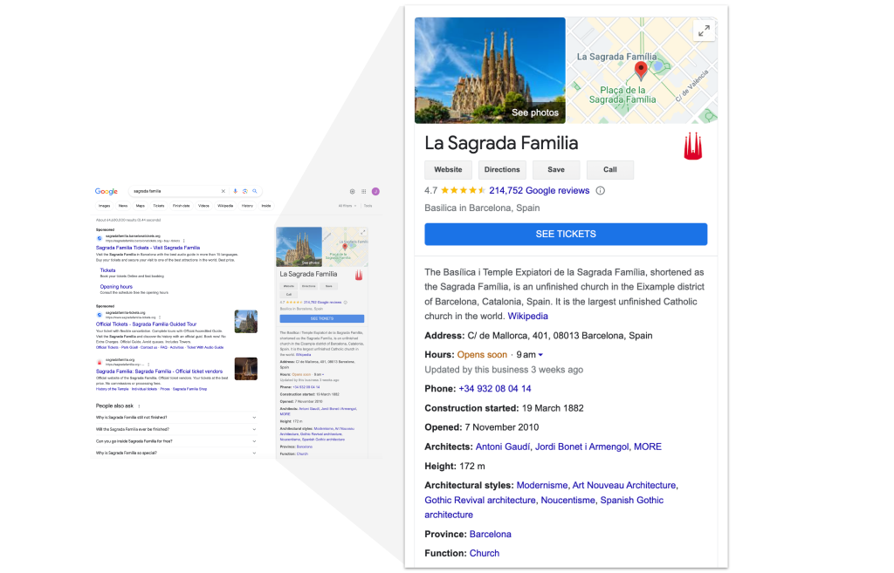
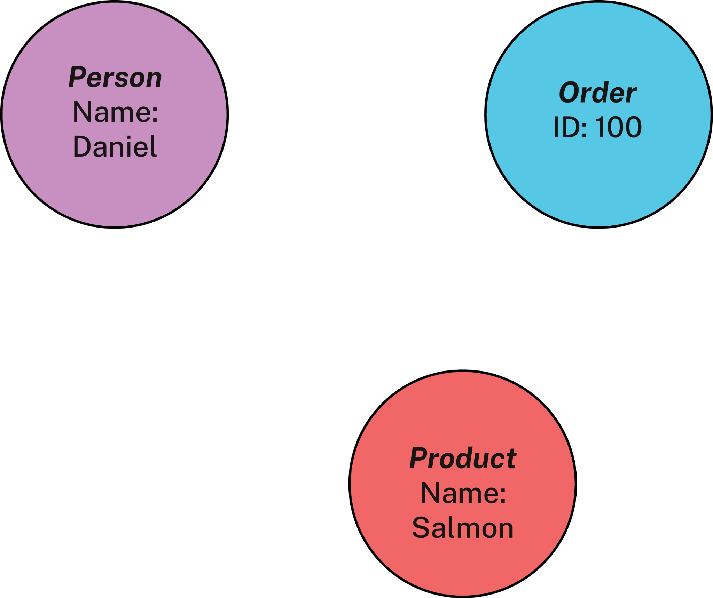
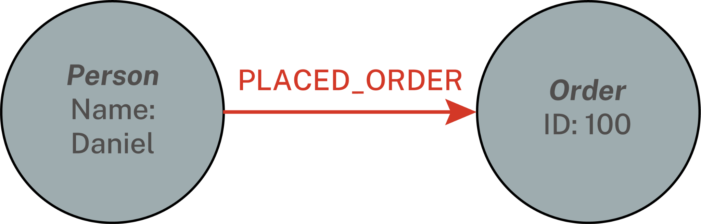
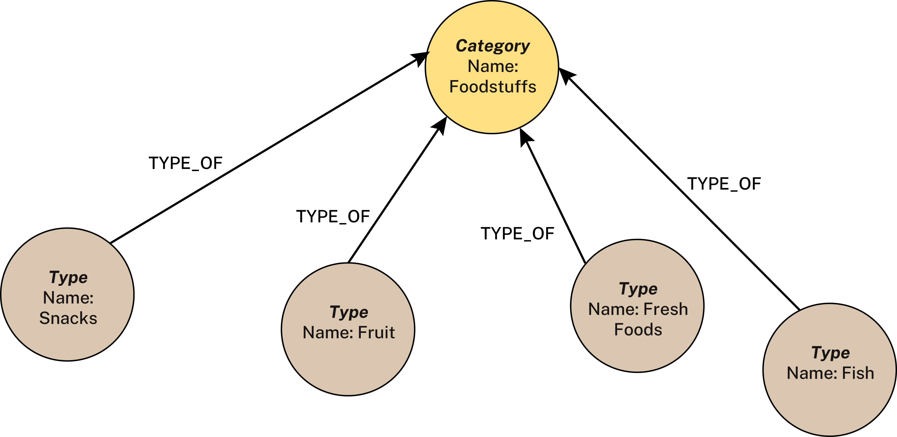
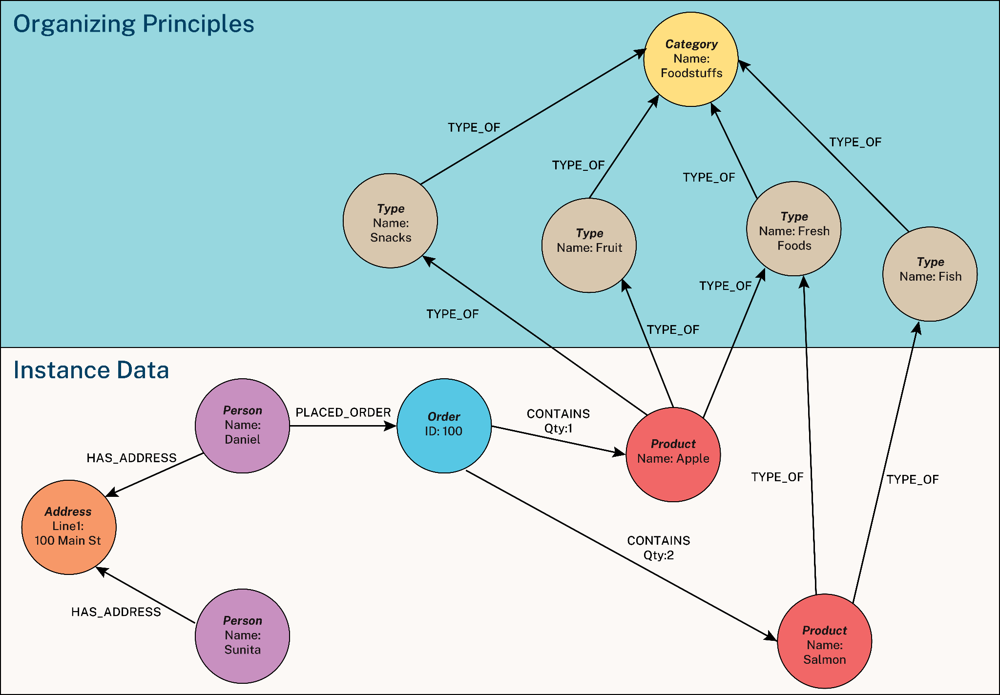
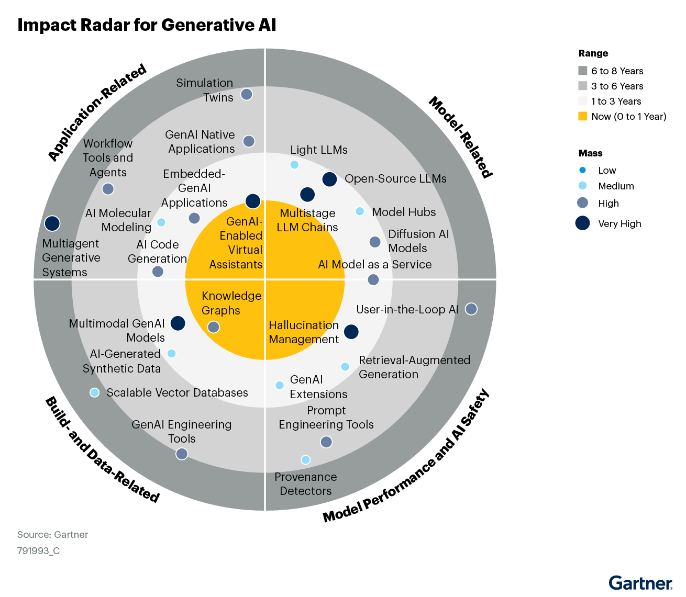
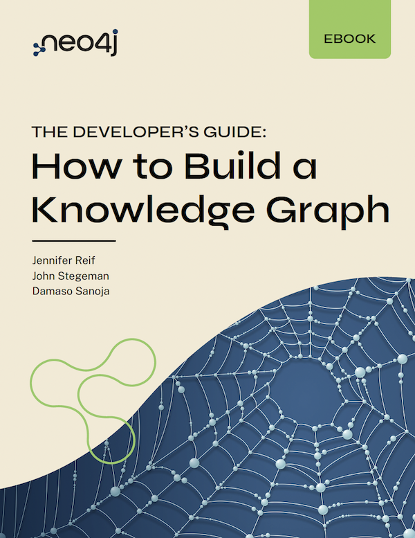

import Term from '@site/src/components/Term';

> Bài viết được biên dịch tự động bởi **Aha! Mind Socratic Engine**. Nguồn bài viết: [Link gốc](https://neo4j.com/blog/knowledge-graph/what-is-knowledge-graph/)

<!-- truncate -->
A [knowledge graph](https://neo4j.com/use-cases/knowledge-graph/) is an organized representation of real-world entities and their relationships. It is typically stored in a graph database, which natively stores the relationships between data entities. Entities in a <Term definition="Mô hình biểu diễn dữ liệu dưới dạng mạng lưới, kết nối các đối tượng thực tế và mối quan hệ giữa chúng để máy tính hiểu được ngữ cảnh. (Ví dụ: Giống như một bản đồ tư duy khổng lồ liên kết mọi thông tin liên quan đến nhau thay vì để rời rạc.)">knowledge graph</Term> can represent objects, events, situations, or concepts. The relationships between these entities capture the context and meaning of how they are connected.

A knowledge graph stores data and relationships alongside frameworks known as <Term definition="Các nguyên tắc tổ chức, đóng vai trò như bộ khung quy tắc hoặc danh mục giúp định hình cấu trúc linh hoạt cho dữ liệu. (Ví dụ: Giống như sơ đồ phân loại sách trong thư viện giúp thủ thư biết cuốn sách nào thuộc thể loại nào.)">organizing principles</Term>. They can be thought of as rules or categories around the data that provide a flexible, conceptual structure to drive deeper data insights. The usefulness of a knowledge graph lies in the way it organizes the principles, data, and relationships to surface new knowledge for your user or business. The design is useful for many usage patterns, including real-time applications, search and discovery, and [grounding generative AI](https://neo4j.com/generativeai/) for question-answering.

Sometimes, people overcomplicate the concept of a knowledge graph. You might hear about enterprise-wide structures that <Term definition="Gom tụ, hợp nhất nhiều nguồn dữ liệu hoặc tài nguyên rải rác về một mối duy nhất để dễ quản lý và tối ưu hóa. (Ví dụ: Giống như việc dồn tiền lẻ từ nhiều túi áo quần khác nhau vào một chiếc ví duy nhất.)">consolidate</Term> and connect information across <Term definition="Tình trạng dữ liệu bị cô lập, giữ riêng trong từng phòng ban hoặc hệ thống, không thể chia sẻ hay kết nối với bên ngoài. (Ví dụ: Giống như các hòn đảo biệt lập giữa đại dương, không có cầu nối hay thuyền bè qua lại để trao đổi hàng hóa.)">data silos</Term> and various sources. While that _does_ describe a knowledge graph (one that can <Term definition="Làm nền móng vững chắc, nâng đỡ hoặc làm cơ sở cho một hệ thống, lý thuyết hoặc ca sử dụng nào đó. (Ví dụ: Giống như móng nhà chịu lực cho toàn bộ tòa nhà phía trên.)">underpin</Term> a data integration use case), it describes one with a wide scope. Thinking only in terms of bridging large datasets and multiple data sources can make creating and implementing knowledge graphs seem complicated and time-consuming. But knowledge graphs don’t need to be broad or elaborate. You can [build one](https://neo4j.com/books/developers-guide-how-to-build-knowledge-graph/) with a much smaller scope to solve a use-case-specific problem.

## **How Knowledge Graphs Work**

You may have heard of knowledge graphs in the context of search engines. The [Google Knowledge Graph](https://blog.google/products/search/introducing-knowledge-graph-things-not/) changed how we search for and find information on the Web. It <Term definition="Tích lũy, thu thập một lượng lớn thông tin, dữ liệu hoặc tài sản qua thời gian. (Ví dụ: Giống như việc tích tiểu thành đại, gom từng hạt cát để xây nên một lâu đài cát khổng lồ.)">amasses</Term> facts about people, places, and things into an organized network of entities. When you do a Google search for information, it uses the connections between entities to surface the most relevant results in context, for example, in the box Google calls the “[knowledge panel](https://support.google.com/knowledgepanel/answer/9163198?hl=en).”

The Google knowledge panel of La Sagrada Familia includes an image of the site, a map, a description, address, hours of operation, the architects who built it, its height, and more.

The entities in the Google knowledge graph represent the world as we know it, marking a shift from “strings to things.” Behind this simple phrase is the profound concept of treating information on the web as entities rather than a bunch of text. Since information is organized as a network of entities, Google can tap into the collective intelligence of the knowledge graph to return results tailored to the _meaning_ of your query rather than a simple keyword match.

### Read a complimentary Gartner® report on knowledge graphs for AI

## **Key Characteristics**

Now that you understand how knowledge graphs organize and access data with context, let’s look at the building blocks of a knowledge graph data model. The definition of knowledge graphs varies depending on whom you ask, but we can distill the essence into three key components: nodes, relationships, and organizing principles.

### Nodes

**_Nodes_** denote and store details about entities, such as people, places, objects, or institutions. Each node has a (or sometimes several) label to identify the node type and may optionally have one or more properties (attributes). Nodes are also sometimes called _vertices_.

For example, the nodes in an e-commerce knowledge graph typically represent entities such as people (customers and prospects), products, and orders:

### Relationships

**_Relationships_** link two nodes together: they show how the entities are related. Like nodes, each relationship has a label identifying the relationship type and may optionally have one or more properties. Relationships are also sometimes called _edges_.

In the e-commerce example, relationships exist between the customer and order nodes, capturing the “placed order” relationship between customers and their orders:

### Organizing Principle(s)

**_Organizing Principles_** are a framework, or schema, that organizes nodes and relationships according to fundamental concepts essential to the use cases at hand. Unlike many data designs, knowledge graphs easily incorporate multiple organizing principles.

Organizing principles range from simple (product line -> product category -> product <Term definition="Hệ thống phân loại dữ liệu theo cấu trúc phân cấp từ tổng quát đến chi tiết (cha - con). (Ví dụ: Giống như cây gia phả hoặc cách phân loại sinh vật (Giới - Ngành - Lớp - Bộ - Họ - Chi - Loài).)">taxonomy</Term>) to complex (a complete business vocabulary that explains the data in the graph). Think of an organizing principle as a conceptual map or metadata layer overlaying the data and relationships in the graph.

The model uses the same node-and-relationship structure as the rest of the knowledge graph to describe the organizing principles – which means you can write queries that draw from both instance data and organizing principles.

In the e-commerce example, an organizing principle might be product types and categories:

### What About <Term definition="Bản đặc tả hình thức về các khái niệm và mối quan hệ trong một lĩnh vực cụ thể, giúp máy tính hiểu sâu sắc ngữ nghĩa của dữ liệu. (Ví dụ: Giống như một cuốn từ điển bách khoa toàn thư định nghĩa rõ ràng mọi mối quan hệ họ hàng trong một gia tộc lớn.)">Ontologies</Term>?

When learning about knowledge graphs, you might come across articles on **_ontologies_** and wonder where they fit in. An ontology is a formal specification of the concepts and the relationships between them for a given subject area; semantic networks are a common way to represent ontologies. Put simply, ontologies are a type of organizing principle.

Ontologies can be complex and require a great deal of effort to define and maintain. When deciding whether an ontology is needed, it’s critical to consider the problems you’re trying to solve with a knowledge graph. In many cases, it won’t be necessary. In the e-commerce example, using a product taxonomy as the organizing principle is sufficient for a product recommendation use case.

Think of the knowledge graph as a growing, evolving system to simplify your design in the early stages and deliver value sooner. If you pick the right technology to implement your knowledge graph, you can expand and evolve the graph as your needs change. In this way, you can add ontologies when your use case requires them rather than forcing yourself to build them up-front.

## **Knowledge Graph Example**

Let’s see what a knowledge graph might look like. Below is a simple knowledge graph of the e-commerce example that shows nodes as circles and relationships between them as arrows. The organizing principles are also stored as nodes and relationships, so the illustration uses some color shading to show which nodes and relationships are the instance data and which are the organizing principles:

An example knowledge graph showing nodes as circles and relationships as arrows. The instance data and organizing principles are highlighted for display.

## **Knowledge Graphs and Graph Databases**

Creating a knowledge graph involves conceptually mapping the graph data model and then implementing it in a database. There are many databases to choose from, but choosing the right one can simplify the design process, speed up development and implementation, and make it easier to adapt to future changes and improvements.

### <Term definition="Loại đồ thị dữ liệu mà cả các nút (đối tượng) và các cạnh (mối quan hệ) đều có thể chứa các thuộc tính (cặp key-value) chi tiết. (Ví dụ: Giống như việc dán thêm các nhãn ghi chú chi tiết (tuổi, màu sắc, ngày mua) lên cả các đồ vật và các sợi dây nối chúng.)">Property Graphs</Term>

Native property graph databases, such as [Neo4j](https://neo4j.com/product/neo4j-graph-database/), are a logical choice for implementing knowledge graphs. They natively store information as nodes, relationships, and properties, allowing for an intuitive [visualization](https://neo4j.com/product/bloom/) of highly interconnected data structures. The physical database matches the conceptual data model, making designing and developing the knowledge graph easier. When you use property graphs, you get:

*   **Simplicity and ease of design:** Property graphs allow for straightforward data modeling when designing the knowledge graph. Because the conceptual and physical models are very similar (often the same), the transition from design to implementation is more straightforward (and easy to explain to non-technical users).
*   **Flexibility:** It’s easy to add new data, properties, relationship types, and organizing principles without extensive refactoring or code rewrites. As needs change, you can iterate and incrementally expand the knowledge graph’s data, relationships, and organization.
*   **Performance:** Property graphs offer superior query performance compared to alternatives like RDF databases or relational databases, especially for complex <Term definition="Quá trình duyệt hoặc đi xuyên qua các nút và mối quan hệ trong đồ thị để tìm kiếm thông tin theo một lộ trình nhất định. (Ví dụ: Giống như việc đi bộ len lỏi qua các con hẻm trong thành phố để tìm đường ngắn nhất từ nhà đến trường.)">traversals</Term> and many-to-many relationships. This performance comes from storing the relationships between entities directly in the database rather than re-generating them using joins in queries. A native property graph database traverses relationships by following pointers in memory, making queries that traverse even complex chains of many relationships very fast.
*   **Developer-friendly Code:** Property graphs support an intuitive and expressive ISO query language standard, [GQL](https://neo4j.com/blog/cypher-and-gql/gql-international-standard/), which means you have less code to write, debug, and maintain than SQL or SPARQL. Neo4j’s Cypher is the most widely used implementation of GQL.

### Property Graph Vs. Triple Stores (RDF)

People sometimes think of [property graphs and triple stores](https://neo4j.com/blog/knowledge-graph/rdf-vs-property-graphs-knowledge-graphs/) as equally viable options for building a knowledge graph, but triple stores (also known as RDF databases) have considerable disadvantages.

Based on the Resource Description Framework (RDF), triple stores use a granular approach to design and storage. Triple stores express all data in the form of subject-predicate-object “triples.” This model does not support relationships with properties or multiple same-typed relationships between entities. To accommodate real-world use cases, you will need to implement workarounds. Common workarounds include turning relationships into objects (called _reification_) or using _singleton properties_ to capture properties using extra “type-of” relationships. These workarounds mean larger databases, additional complexity in the physical model, and poor query performance.

Because <Term definition="Kỹ thuật biến một mối quan hệ (vốn trừu tượng) thành một thực thể vật lý cụ thể trong cơ sở dữ liệu để có thể gán thuộc tính cho nó. (Ví dụ: Giống như việc biến hành động 'kết hôn' thành một 'tờ giấy đăng ký kết hôn' vật lý để bạn có thể viết ngày tháng, nơi ký lên đó.)">reification</Term> and singleton properties force tough decisions about the design up front, triple stores don’t lend themselves to solving real-world problems that involve messy data domains. Knowledge graphs built on a triple store are more challenging to design, time-consuming to implement, and difficult to change.

### Property Graph Vs. Relational Databases

Relational databases and other non-native graph approaches suffer similar design friction. Neither relational nor document databases store relationships – they must be <Term definition="Được tổng hợp hoặc tạo ra một cách nhân tạo bằng cách kết hợp các thành phần riêng lẻ lại với nhau tại thời điểm chạy (runtime). (Ví dụ: Giống như việc lắp ráp các mảnh đồ chơi Lego thành một con robot hoàn chỉnh ngay khi cần chơi, thay vì đúc sẵn nó.)">synthesized</Term> at runtime with joins or value lookups in query code. Since the relationships reside in the code rather than with the dataset, each application and data use must have its own implementation. SQL (the relational database query language) forces you to define every join in the query itself. As a result, the knowledge graph becomes more difficult to manage and yields poor runtime performance as the number of relationships expands.

## **Knowledge Graph Use Cases**

Knowledge graphs offer a powerful tool for storing and organizing data to enable a more sophisticated understanding of that data. To understand how companies have done this, let’s look at examples of using knowledge graphs to tackle particular problems. Though not a comprehensive list of use cases, it’s a set of concrete examples demonstrating knowledge graphs in real-world applications.

### Generative AI for Enterprise Search Applications

In **[generative AI](https://neo4j.com/generativeai/)** applications**,** knowledge graphs capture and organize key domain-specific or proprietary company information. Knowledge graphs are not limited to structured data; they can handle less organized data as well.

[GraphRAG](https://neo4j.com/blog/genai/graphrag-manifesto/), a technique that grounds large language models with knowledge graphs, is emerging as the foundation of AI applications that use proprietary domain data (these are known as RAG applications). A knowledge graph grounding increases response accuracy and improves explainability with the context provided by data relationships. Industry leaders [such as Deloitte](https://www2.deloitte.com/content/dam/Deloitte/nl/Documents/risk/deloitte-nl-risk-responsible-enterprise-decisions-with-knowledge-enriched-generative-ai-whitepaper-download.pdf) highlight the critical role of knowledge graphs for building enterprise-grade GenAI. Gartner places knowledge graphs having a “high mass,” being an impactful technology for GenAI today:

This Impact Radar from Gartner highlights knowledge graphs as a high-impact technology within the Generative AI landscape (Credit: Gartner)

### Fraud Detection and Analytics in Financial Services, Banking, and Insurance

In **[Fraud Detection and Analytics](https://neo4j.com/use-cases/fraud-detection/)**[,](https://neo4j.com/use-cases/fraud-detection/) the knowledge graph represents a network of transactions, their participants, and relevant information about them. Companies can use this knowledge graph to quickly identify suspicious activity, investigate suspected fraud, and evolve their knowledge graph to keep up with changing fraud patterns. Algorithms such as pathfinding and community detection provide key signals to machine learning algorithms that can uncover more sophisticated fraud networks.

### Master Data Management

In **[Master Data Management](https://neo4j.com/use-cases/master-data-management/)** (e.g., for **Customer 360** use cases), the knowledge graph provides an organized, resolved (i.e., “de-duped”), and comprehensive database of a company’s customers and the company’s interactions with them.

This organized view of customers is especially important for companies with multiple divisions or applications interacting with customers. Without a knowledge graph, it can be difficult or impossible to obtain an accurate view of the customer. A knowledge graph links customer behaviors across multiple applications through an organizing principle that identifies them as coming from the same customer.

### Supply Chain Management

In **[Supply Chain Management](https://neo4j.com/blog/supply-chain-and-logistics/supply-chain-forecasting/)**, a knowledge graph represents the network of suppliers, raw materials, products, and logistics that work together to supply a company’s operations and customers. This end-to-end supply chain visibility allows managers to identify weak points and predict where disruptions may occur. Graph algorithms such as [shortest path](https://neo4j.com/blog/graph-data-science/graph-algorithms-neo4j-shortest-path/) optimize the supply chain in real time by finding the most direct route between A and B.

### Investigative Journalism

In **[Investigative Journalism](https://neo4j.com/blog/news/electiongraph-report-2/)****,** knowledge graphs capture key entities (companies, people, bank accounts, etc.) and activities under investigation. Organizing these entities in relation to one another makes it possible to find hidden patterns, such as distant relationships between entities that shouldn’t be present.

Investigators may use techniques such as <Term definition="Quá trình xác định và hợp nhất các bản ghi dữ liệu khác nhau nhưng thực chất cùng trỏ về một thực thể duy nhất trong đời thực. (Ví dụ: Giống như việc nhận diện tài khoản Facebook 'Nguyen Van A' và email 'anv@gmail.com' thực chất là cùng một người ngoài đời.)"><Term definition="Một đối tượng cụ thể, tồn tại độc lập trong thế giới thực (như con người, địa điểm, sự vật) được đưa vào cơ sở dữ liệu. (Ví dụ: Giống như một danh từ cụ thể trong một câu văn, đại diện cho một chủ thể rõ ràng.)">entity</Term> resolution</Term> to reveal entities hiding behind fake or <Term definition="Các danh tính giả, công ty 'vỏ bọc' được dựng lên nhằm che giấu chủ thể thực sự đứng sau các hoạt động tài chính hoặc pháp lý. (Ví dụ: Giống như những chiếc mặt nạ hóa trang giúp thủ phạm ẩn mình trong đám đông để thực hiện hành vi mờ ám.)">shell identities</Term> to mask their activities. Algorithms like community detection and link prediction also provide insight and areas for further investigation.

### Drug Discovery in Healthcare Research

Knowledge graphs store information about the research subject in [medical and other research](https://neo4j.com/case-studies/basecamp-research/) use cases. For example, the knowledge graph could have protein and genome sequences together with environmental and chemical data, revealing intricate patterns and expanding our knowledge of proteins.

## **Getting Started With Knowledge Graphs**

Knowledge graphs are organized representations of real-world entities and their relationships, overlaid with one or more organizing principles that frame the information in context to drive insight from the data. Knowledge graphs underpin insightful applications and artificial intelligence solutions across many use cases.

Master the concepts and get hands-on experience with building your first knowledge graph.

The guide covers how to build, manage, query, analyze, and visualize your knowledge graph for applications and analytics.

## **Learning Resources**

*   [Semantics workshops](https://github.com/jbarrasa/goingmeta) on GitHub.
*   [Ontology-Based Reasoning 101](https://www.youtube.com/watch?v=05Wkg1p34ek).
*   [Ontology-driven Knowledge Graph Construction](https://www.youtube.com/watch?v=05Wkg1p34ek).
*   [GraphAcademy](https://graphacademy.neo4j.com/) for knowledge graph fundamentals using a property graph model in the Neo4j Graph Database.

---
*Made by Anh Tu - Share to be share*
