:::info 📚 Nguồn tài liệu
Bài viết này tổng hợp và phân tích chuyên sâu nội dung từ cuốn **"AI Agent, the Illustrated Guidebook"**, kết hợp với phương pháp sư phạm 4MAT để tạo thành tài liệu tra cứu toàn diện bằng tiếng Việt.
:::

<!-- truncate -->

## Agenda

**Thời gian đọc ước tính:** ~45 phút

### Learning outcome

Sau khi đọc bài này, bạn có thể:

- **Giải thích** được sự khác biệt cốt lõi giữa LLM, RAG và AI Agent
- **Phân tích** được 6 Building Block cấu thành một AI Agent hoạt động tốt
- **Nhận diện** và áp dụng được 5 Agentic Design Pattern phổ biến
- **Phân loại** mức độ tự trị (autonomy) của một hệ thống AI theo thang 5 cấp độ
- **Lựa chọn** kiến trúc agent phù hợp cho từng bài toán thực tế

---

## Glossary & Vocabulary

### Technical Terms

| Term | Vietnamese Meaning & Quick Explain |
| :--- | :--- |
| **AI Agent** | Tác nhân AI tự trị — hệ thống có thể tự lý luận, lập kế hoạch và hành động |
| **Agentic** | Có tính tự trị, chủ động hành động thay vì chỉ phản hồi thụ động |
| **Orchestration** | Điều phối — quản lý và phân công nhiệm vụ cho nhiều agent |
| **ReAct Pattern** | Reason + Act — vòng lặp Suy nghĩ → Hành động → Quan sát |
| **Guardrail** | Rào chắn an toàn — ràng buộc giúp agent không đi chệch hướng |
| **Multi-Agent System** | Hệ thống đa tác nhân — nhiều agent chuyên biệt phối hợp với nhau |
| **RAG** | Retrieval-Augmented Generation — tăng cường LLM bằng tri thức bên ngoài |
| **MCP** | Model Context Protocol — giao thức kết nối tool từ xa cho agent |
| **CrewAI** | Framework orchestration multi-agent phổ biến viết bằng Python |
| **LangGraph** | Framework biểu diễn agent workflow dưới dạng đồ thị có hướng |
| **Hallucination** | Ảo giác AI — LLM tự bịa thông tin không có thật |
| **Autonomy** | Tính tự trị — khả năng hoạt động độc lập không cần chỉ dẫn từng bước |

### Vocabulary Support (B1+)

| Word | Meaning in Context |
| :--- | :--- |
| **Autonomous** (adj) | Tự trị, không cần giám sát liên tục |
| **Retrieve** (v) | Truy xuất, lấy thông tin từ nguồn bên ngoài |
| **Orchestrate** (v) | Điều phối, sắp xếp các thành phần phối hợp nhịp nhàng |
| **Iterate** (v) | Lặp lại và cải thiện theo từng vòng |
| **Constraint** (n) | Ràng buộc, giới hạn áp đặt lên hệ thống |
| **Delegate** (v) | Giao nhiệm vụ cho người/agent khác thực hiện |
| **Hierarchical** (adj) | Phân cấp, có tổ chức theo tầng bậc |

---

## 1. WHY — Vì sao cần AI Agent?

### 1.1. Giới hạn của LLM đơn thuần

Một LLM (*Large Language Model*) thông thường như GPT-4 hay Gemini, dù cực kỳ thông minh, vẫn tồn tại một giới hạn cơ bản: **nó chỉ phản hồi khi được hỏi**.

Hãy xem xét bài toán thực tế: tạo một báo cáo nghiên cứu về các xu hướng AI mới nhất. Với một LLM tiêu chuẩn, quy trình sẽ như sau:


1. Bạn yêu cầu tóm tắt các bài nghiên cứu AI gần đây
2. Xem xét phản hồi và nhận ra cần các nguồn tài liệu cụ thể
3. Yêu cầu thêm danh sách bài báo kèm trích dẫn
4. Phát hiện một số nguồn đã lỗi thời, tinh chỉnh lại câu hỏi
5. Sau nhiều vòng lặp, mới nhận được output hữu ích

Quá trình này **tốn thời gian, lặp đi lặp lại, và đòi hỏi con người đóng vai trò ra quyết định ở mỗi bước**. LLM ở đây thông minh nhưng thụ động — nó không thể tự truy cập web, gọi API, hay tự tìm nạp thông tin mới mà không có con người khởi xướng từng bước.

### 1.2. RAG mở rộng tri thức, nhưng chưa đủ

RAG (*Retrieval-Augmented Generation*) giải quyết một phần vấn đề: nó truy xuất tài liệu bên ngoài (từ vector database, công cụ tìm kiếm...) và đưa chúng vào LLM dưới dạng context trước khi sinh ra câu trả lời.

RAG giúp LLM không còn bị giới hạn bởi training data. Tuy nhiên, RAG vẫn **thiếu tính tự trị (autonomy)** — nó không thể tự quyết định: "Tôi có cần thêm dữ liệu không? Tôi nên gọi công cụ nào? Kết quả này đã đủ tốt chưa?"

### 1.3. AI Agent: Thêm tầng tự trị (Autonomy)

Với AI Agent, bài toán báo cáo nghiên cứu ở trên sẽ diễn ra hoàn toàn khác:

- **Research Agent** tự động tìm kiếm và truy xuất các bài nghiên cứu từ arXiv, Semantic Scholar
- **Filtering Agent** quét các bài báo, xác định những bài liên quan nhất dựa trên số trích dẫn, ngày xuất bản, từ khóa
- **Summarization Agent** trích xuất key insights và cô đọng thành báo cáo dễ đọc
- **Formatting Agent** định cấu trúc báo cáo cuối cùng, đảm bảo layout chuyên nghiệp

Các agent không chỉ thực thi end-to-end mà còn **tự tinh chỉnh (self-refine)** output — tất cả đều không cần sự can thiệp của con người ở mỗi bước.


> **Trade-off cần nhớ:** Tính tự trị cao hơn đi kèm rủi ro lớn hơn: agent có thể bị hallucination, rơi vào vòng lặp vô hạn, hoặc đưa ra quyết định sai. Đó là lý do tại sao **Guardrails** là một trong 6 building block không thể thiếu.

---

## 2. WHAT — AI Agent là gì?

### 2.1. Định nghĩa

> **AI Agent là các hệ thống tự trị (autonomous systems) có khả năng suy luận (reason), tư duy, lập kế hoạch (plan), xác định các nguồn tài liệu liên quan và trích xuất thông tin từ chúng khi cần thiết, thực hiện hành động, và thậm chí tự sửa lỗi nếu có sự cố xảy ra.**


**Definition Anatomy — giải phẫu từng từ khóa:**

- **Autonomous systems** (*hệ thống tự trị*): "Autonomous" có gốc từ tiếng Hy Lạp — "auto" (tự mình) + "nomos" (luật). Một hệ thống tự trị **tự điều hành theo luật lệ của chính nó**, không cần chỉ thị từng bước từ bên ngoài.
- **Reason** (*suy luận*): Khả năng phân tích thông tin, rút ra kết luận logic và đánh giá các phương án trước khi hành động.
- **Plan** (*lập kế hoạch*): Chia nhỏ mục tiêu lớn thành các bước nhỏ có thứ tự, có thể thực thi được.
- **Self-correct** (*tự sửa lỗi*): Khi một bước thất bại, agent không dừng lại — nó phân tích lỗi và thử phương án khác.

### 2.2. So sánh: LLM vs. RAG vs. Agent

| Tiêu chí | LLM | RAG | AI Agent |
| :--- | :--- | :--- | :--- |
| **Tri thức** | Giới hạn trong training data | Truy xuất tài liệu bên ngoài khi cần | Kết hợp cả hai + tự quyết định khi nào cần |
| **Hành động** | Chỉ tạo text | Chỉ tạo text (nhưng dựa trên context đầy đủ hơn) | Gọi tools, thực thi code, gọi API |
| **Tự trị** | Không — phản hồi thụ động | Không — cần human trigger từng bước | Có — tự lập kế hoạch và thực thi |
| **Vòng lặp** | Không | Không | Có — lặp lại cho đến khi hoàn thành |
| **Phép ví von** | Bộ não | Bộ não + thư viện | Người trợ lý thực thụ |


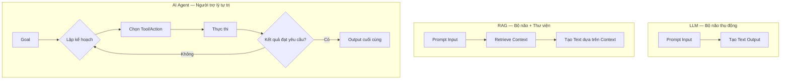

---

## 3. Sáu Building Blocks của AI Agent

Để một AI Agent hoạt động đáng tin cậy và thực sự hữu ích, nó cần được xây dựng trên 6 nền tảng cốt lõi này:

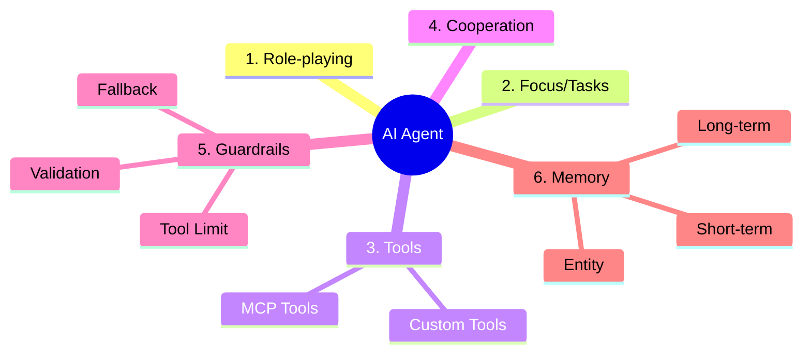

### 3.1. Role-playing — Phân vai

**Định nghĩa:** Việc gán cho agent một danh tính, chuyên môn và vai trò cụ thể trước khi nó bắt đầu thực thi nhiệm vụ.

**Tại sao nó quan trọng?**

Một trợ lý AI chung chung sẽ đưa ra những câu trả lời mơ hồ, không có chiều sâu chuyên môn. Nhưng khi bạn định nghĩa nó là một **"Senior Contract Lawyer"** (luật sư hợp đồng cấp cao), agent sẽ:

- Phản hồi với **độ chính xác pháp lý** cao hơn
- Sử dụng **ngôn ngữ pháp lý** phù hợp
- Chủ động cảnh báo về các rủi ro pháp lý tiềm ẩn mà người dùng không đề cập


**Cơ chế hoạt động:** Việc phân vai (*role assignment*) định hình quá trình **suy luận (reasoning)** và **truy xuất (retrieval)** của agent. Nó giúp LLM kích hoạt đúng "vùng tri thức" trong training data thay vì cố gắng trả lời từ góc nhìn tổng quát.

**Quy tắc thực tiễn:** Vai trò càng cụ thể, output càng sắc bén và phù hợp. "Senior Contract Lawyer chuyên về luật Sở hữu trí tuệ tại Việt Nam" sẽ cho kết quả tốt hơn "Luật sư".

**Trade-off:** Role assignment quá hẹp có thể khiến agent từ chối xử lý các tác vụ nằm ngoài "vai diễn" của nó dù hoàn toàn có thể làm được.

---

### 3.2. Focus/Tasks — Sự tập trung

**Định nghĩa:** Giới hạn phạm vi nhiệm vụ mà một agent chịu trách nhiệm, tránh tình trạng agent "làm tất cả mọi thứ".

**Tại sao nó quan trọng?**

Giao cho một agent quá nhiều nhiệm vụ hoặc quá nhiều dữ liệu không liên quan **không giúp ích gì — trái lại còn gây hại**. Sự quá tải (overload) dẫn đến:
- Nhầm lẫn giữa các domain kiến thức
- Output thiếu nhất quán
- Hallucination tăng vọt

Ví dụ: Một **Marketing Agent** chỉ nên tập trung vào thông điệp, giọng điệu (tone) và đối tượng khán giả — **không phải** định giá hay phân tích thị trường. Đó là nhiệm vụ của agent khác.

**Nguyên tắc thiết kế:** Thay vì bắt một agent "làm mọi thứ", hãy dùng **nhiều agent chuyên biệt**, mỗi agent có phạm vi hẹp và rõ ràng. Các agent chuyên biệt luôn cho **hiệu suất tốt hơn** so với agent đa nhiệm.

**Trade-off:** Nhiều agent chuyên biệt hơn đồng nghĩa với chi phí orchestration cao hơn và cần cơ chế phối hợp (xem Building Block số 4 — Cooperation).

---

### 3.3. Tools — Công cụ

**Định nghĩa:** Các hàm hoặc API bên ngoài mà agent có thể gọi để tương tác với thế giới thực — những gì LLM thuần túy không thể làm.

**Tại sao nó quan trọng?**

LLM vận hành bằng ngôn ngữ, nhưng thế giới thực cần **hành động**: lấy dữ liệu theo thời gian thực, thực thi code, ghi file, gọi API. Tools (*công cụ*) lấp đầy khoảng trống này.

Một AI Research Agent, ví dụ, hưởng lợi từ:
- **Công cụ tìm kiếm web** → truy xuất ấn phẩm gần đây
- **Mô hình tóm tắt** → cô đọng các bài nghiên cứu dài
- **Trình quản lý trích dẫn** → định dạng tài liệu tham khảo chính xác

**Nguyên tắc vàng:** More tools ≠ Better results. Nếu thêm các công cụ không cần thiết (ví dụ: thêm speech-to-text vào một Research Agent), nó có thể làm agent bối rối và **giảm hiệu suất**.


**3.3.1. Custom Tools — Công cụ tự xây dựng**

Khi các tool có sẵn không đủ, bạn cần xây dựng **Custom Tool**. Trong CrewAI, quy trình chuẩn là:

1. Định nghĩa schema input bằng **Pydantic** — đảm bảo type-safety
2. Kế thừa từ `BaseTool` và implement method `_run`
3. Xử lý lỗi trong `_run` để agent không bị crash khi tool thất bại

Ví dụ: `CurrencyConverterTool` — gọi ExchangeRate API theo thời gian thực, xử lý lỗi nếu mã tiền tệ không hợp lệ.


**3.3.2. MCP Tools — Công cụ qua giao thức MCP**

MCP (*Model Context Protocol*) là bước tiến hóa tiếp theo: thay vì nhúng tool trực tiếp vào từng agent, bạn expose tool như một **MCP Server** có thể tái sử dụng — nhiều agent và flow khác nhau có thể truy cập qua một server duy nhất.

Lợi ích:
- **Decoupling:** Agent không cần biết implementation chi tiết của tool
- **Reusability:** Một MCP tool có thể dùng cho nhiều agent, nhiều dự án
- **Versioning:** Nâng cấp tool ở một chỗ, tất cả agent hưởng lợi

Ví dụ: `CurrencyConverterTool` được expose tại `http://localhost:8081/sse`, bất kỳ CrewAI agent nào cũng có thể kết nối bằng `MCPServerAdapter`.


---

### 3.4. Cooperation — Hợp tác

**Định nghĩa:** Khả năng nhiều agent chuyên biệt phối hợp, chia sẻ thông tin và tinh chỉnh output của nhau để đạt kết quả chung.

**Tại sao nó quan trọng?**

Các hệ thống Multi-Agent hoạt động tốt nhất khi các agent **cộng tác và trao đổi feedback** với nhau, thay vì một agent đơn lẻ làm mọi thứ.

Hãy xem xét một hệ thống phân tích tài chính vận hành bằng AI:
- **Agent 1** thu thập dữ liệu thị trường
- **Agent 2** đánh giá rủi ro từ dữ liệu đó
- **Agent 3** xây dựng chiến lược đầu tư dựa trên kết quả đánh giá
- **Agent 4** viết báo cáo tổng hợp

Sự cộng tác theo pipeline này mang lại kết quả **thông minh và chính xác hơn** so với một agent đơn lẻ cố gắng làm cả 4 nhiệm vụ.

**Best practice:** Thiết kế các workflow nơi agent có thể **trao đổi insights** và **cùng nhau tinh chỉnh** câu trả lời. Output của agent này là input của agent tiếp theo.


**Trade-off:** Cooperation phức tạp hơn làm tăng độ trễ (latency) và chi phí token. Cần cân nhắc kỹ liệu từng agent trong pipeline có thực sự cần thiết không.

---

### 3.5. Guardrails — Rào chắn an toàn

**Định nghĩa:** Các ràng buộc và kiểm tra được thiết lập để ngăn agent đi chệch hướng, hallucinate, hoặc thực hiện các hành động không mong muốn.

**Tại sao nó quan trọng?**

Agent rất mạnh mẽ, nhưng nếu không có constraints, chúng có thể:
- **Hallucinate** — bịa thông tin và trình bày như sự thật
- **Loop endlessly** — rơi vào vòng lặp vô hạn không thoát ra được
- **Make wrong tool calls** — gọi API sai hoặc với tham số không hợp lệ


**3 loại Guardrail phổ biến:**

**1. Giới hạn việc sử dụng tool (Tool Use Limits)**
Ngăn agent lạm dụng API hoặc tạo ra các query không liên quan. Ví dụ: giới hạn số lần gọi web search trong một session, đặt timeout cho mỗi tool call.

**2. Validation Checkpoint (Điểm kiểm tra)**
Đảm bảo output đáp ứng các tiêu chí được định nghĩa trước khi chuyển sang bước tiếp theo. Ví dụ: kiểm tra JSON schema của output trước khi truyền sang agent tiếp theo.

**3. Fallback Mechanism (Cơ chế dự phòng)**
Nếu một agent thất bại trong việc hoàn thành task, một agent khác hoặc human reviewer có thể can thiệp thay vì để toàn bộ pipeline sụp đổ.

**Ví dụ thực tế:** Một trợ lý pháp lý AI cần guardrail để tránh trích dẫn các luật đã lỗi thời hoặc đưa ra các tuyên bố sai sự thật — đây là nơi validation checkpoint phát huy tác dụng.

**Trade-off:** Guardrail chặt chẽ quá có thể làm agent không đủ linh hoạt để xử lý các edge case hợp lệ. Cần cân bằng giữa safety và flexibility.

---

### 3.6. Memory — Bộ nhớ

**Định nghĩa:** Khả năng lưu trữ và truy xuất thông tin từ các tương tác trước đó, cho phép agent cải thiện theo thời gian và duy trì context mạch lạc.

**Tại sao nó quan trọng?**

Không có memory, một agent sẽ phải **bắt đầu lại từ đầu** trong mỗi lần chạy — mọi context từ các tương tác trước đó đều bị mất. Điều này tương tự như mỗi buổi sáng thức dậy và không nhớ gì về ngày hôm qua.

**3 loại Memory trong AI Agent:**

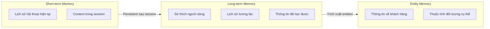

**1. Short-term Memory** (*Bộ nhớ ngắn hạn*)
Chỉ tồn tại trong quá trình execution của session hiện tại. Ví dụ: nhớ lại lịch sử hội thoại gần đây để giữ context mạch lạc trong một cuộc trò chuyện.

**2. Long-term Memory** (*Bộ nhớ dài hạn*)
Vẫn tồn tại sau khi kết thúc execution. Ví dụ: ghi nhớ sở thích của người dùng qua nhiều lần tương tác, lưu trữ kiến thức đã học được từ các task trước.

**3. Entity Memory** (*Bộ nhớ thực thể*)
Lưu trữ thông tin về các đối tượng cụ thể được thảo luận. Ví dụ: trong một CRM agent, ghi nhớ thông tin chi tiết về từng khách hàng (lịch sử mua hàng, vấn đề đã gặp, sở thích...).

**Ví dụ thực tế:** Trong một hệ thống gia sư AI, memory cho phép agent nhớ lại các bài học trước đó, tùy chỉnh feedback theo trình độ hiện tại của học sinh, và tránh bị lặp lại kiến thức đã dạy.

**Trade-off:** Long-term memory cần giải pháp lưu trữ bên ngoài (vector database, Zep AI...), tăng thêm dependency và chi phí hạ tầng.


---

## 4. Năm Agentic Design Patterns

Các Design Pattern (*mẫu thiết kế*) là những blueprint đã được kiểm chứng để giải quyết các bài toán lặp đi lặp lại trong kiến trúc phần mềm. Với AI Agent, có 5 pattern nền tảng:

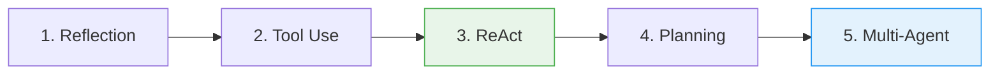

*Mũi tên biểu thị mức độ phức tạp tăng dần. ReAct và Multi-Agent là hai pattern được sử dụng phổ biến nhất trong thực tế.*

### 4.1. Reflection Pattern

**Cơ chế:** AI tự xem xét lại output của chính nó, phát hiện lỗi sai và iterate cho đến khi tạo ra response đạt yêu cầu.

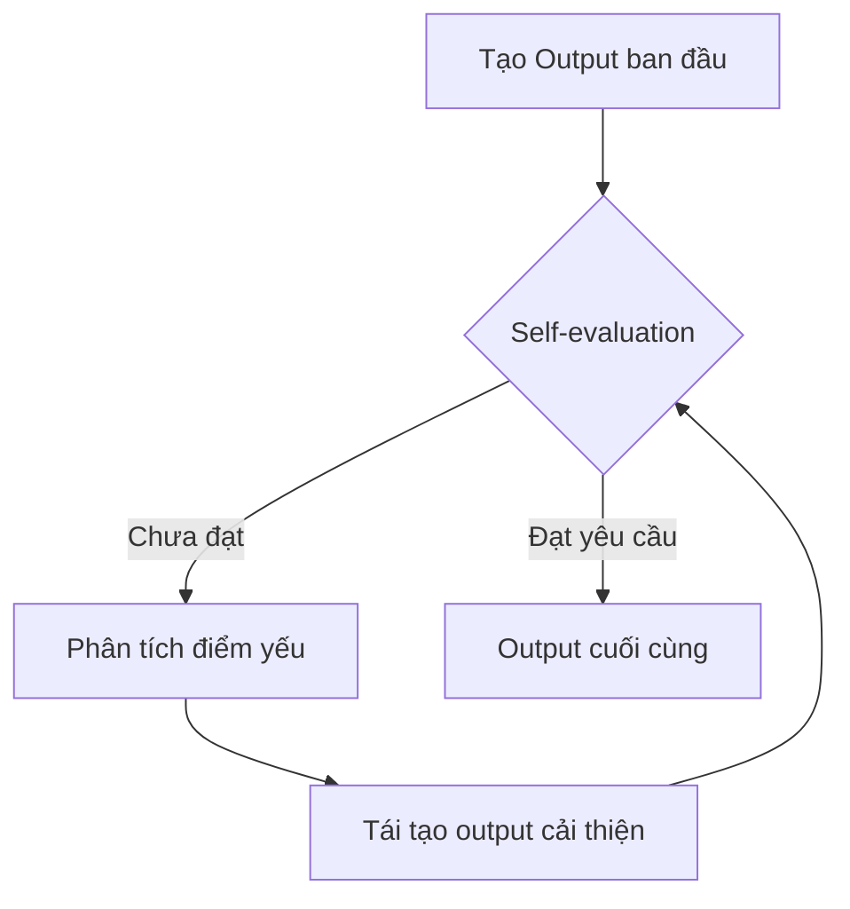

**Khi nào dùng:** Khi chất lượng output quan trọng hơn tốc độ. Reflection phù hợp với các task như viết code, soạn thảo văn bản pháp lý, phân tích tài chính — những nơi một lỗi nhỏ có thể gây hậu quả lớn.

**Ví dụ thực tế:** Một Code Review Agent dùng Reflection để tự kiểm tra code mình vừa viết, tìm ra bugs tiềm ẩn trước khi trả về cho người dùng.

---

### 4.2. Tool Use Pattern

**Cơ chế:** Agent được trang bị một tập hợp các tool và có thể tự quyết định khi nào cần dùng tool nào để thu thập thêm thông tin.


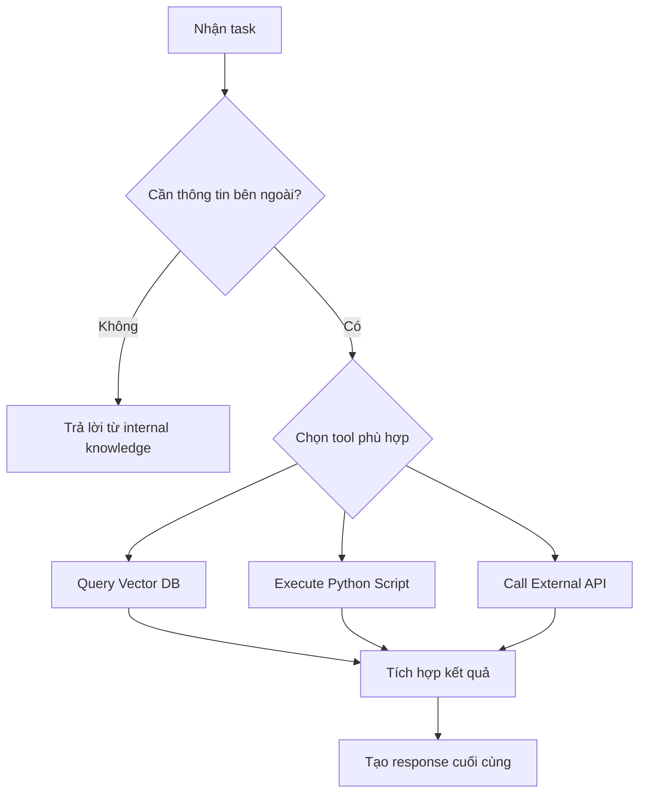

**Khi nào dùng:** Khi LLM cần dữ liệu thời gian thực, thực thi tính toán, hoặc tương tác với hệ thống bên ngoài — những gì internal knowledge không thể cung cấp.

**Điều kiện tiên quyết:** Mỗi tool phải có schema rõ ràng (tên, mô tả, input/output) để LLM biết khi nào và cách gọi nó một cách chính xác.

---

### 4.3. ReAct Pattern (Reason and Act)

**Cơ chế:** Kết hợp cả Reflection lẫn Tool Use trong một vòng lặp liên tục: **Thought → Action → Observation**, lặp lại cho đến khi tìm ra giải pháp cuối cùng.

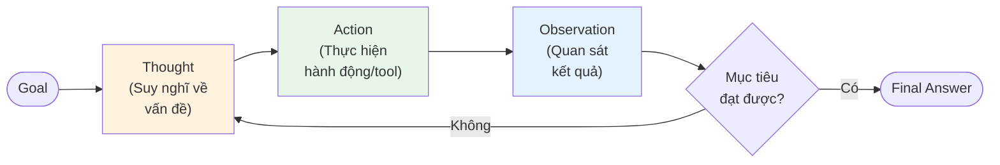

Cách agent lý luận trong thực tế:
1. **Thought:** "Tôi cần tìm tỷ giá EUR/USD hiện tại"
2. **Action:** Gọi `CurrencyConverterTool(from='EUR', to='USD')`
3. **Observation:** Nhận kết quả "1 EUR = 1.089 USD"
4. **Thought:** "Đã có dữ liệu, giờ tôi có thể tính toán..."

**Tầm quan trọng:** ReAct kết hợp **chain-of-thought** (chuỗi suy nghĩ có logic) với **tool calling** (hành động thực tế). Đây là pattern mà **CrewAI sử dụng mặc định** cho hầu hết các agent.


**Ví dụ output thực tế từ một CrewAI agent:**
```
Thought: I need to research the latest AI papers on reasoning.
Action: web_search
Action Input: "AI reasoning papers 2025 arXiv"
Observation: Found 15 relevant papers published in the last 30 days...
Thought: I should filter for the most cited ones...
```

Đây chính là ReAct pattern đang hoạt động.

---

### 4.4. Planning Pattern

**Cơ chế:** Thay vì giải quyết một task trong một lượt duy nhất, agent tạo ra một **roadmap** bằng cách chia nhỏ các task lớn và phác thảo các objective trước khi bắt đầu thực thi.

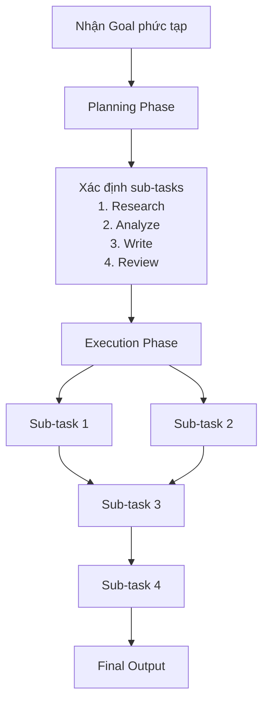

**Khi nào dùng:** Khi task quá phức tạp hoặc dài hơi để giải quyết trong một bước. Planning đặc biệt hữu ích khi cần phân bổ nguồn lực (agent nào làm gì, theo thứ tự nào).

**Trong CrewAI:** Đặt `planning=True` khi khởi tạo Crew để kích hoạt Planning Pattern. CrewAI sẽ tự động tạo một bước lập kế hoạch trước khi bắt đầu thực thi.


**Trade-off:** Planning thêm một bước xử lý và tốn thêm token. Với những task đơn giản, planning có thể là overhead không cần thiết.

---

### 4.5. Multi-Agent Pattern

**Cơ chế:** Nhiều agent chuyên biệt phối hợp, mỗi agent đảm nhận một role và task cụ thể, có thể truy cập các tool riêng và delegate task cho agent khác khi cần.

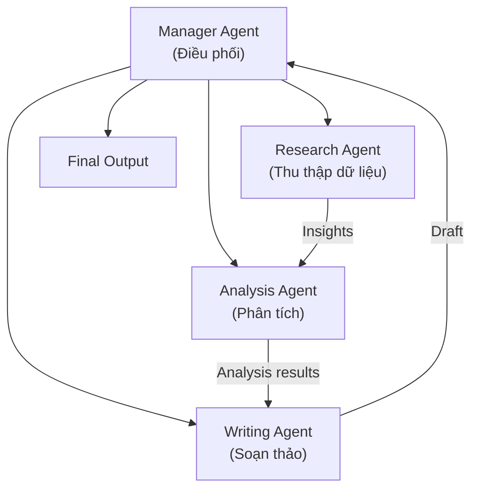

**Khi nào dùng:**
- Task quá phức tạp cho một agent đơn lẻ
- Cần các chuyên môn khác nhau trong cùng một pipeline
- Muốn xử lý song song để tăng tốc độ

**Khi KHÔNG nên dùng:**
- Task đơn giản, không cần chuyên môn hóa
- Khi overhead điều phối lớn hơn lợi ích của việc chia nhỏ
- Khi không có đủ token budget để chạy nhiều agent


---

## 5. Năm Levels of Agentic AI

Không phải mọi "AI Agent" đều như nhau. Mức độ tự trị của chúng nằm trên một thang từ 1 đến 5:


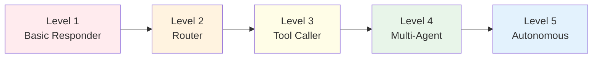

| Level | Tên | Vai trò con người | Vai trò LLM | Ví dụ |
| :---: | :--- | :--- | :--- | :--- |
| **1** | Basic Responder | Điều hướng toàn bộ flow | Chỉ là generic responder | Chatbot Q&A đơn giản |
| **2** | Router Pattern | Định nghĩa các path/function | Quyết định đi theo path nào | Customer service routing |
| **3** | Tool Calling | Định nghĩa tập tool | Quyết định khi nào & cách gọi tool | GitHub Copilot, Cursor |
| **4** | Multi-Agent | Thiết lập hierarchy, role, tool | Kiểm soát execution flow, điều phối | CrewAI, AutoGen |
| **5** | Autonomous | Chỉ định mục tiêu ban đầu | Tự generate & execute code mới | AI Developer agents |

**Level 1 — Basic Responder:** Con người điều hướng toàn bộ. LLM chỉ nhận input và tạo output, không có quyền kiểm soát flow. Đây là cấp độ cơ bản nhất, thực chất chỉ là LLM thông thường.

**Level 2 — Router Pattern:** Con người định nghĩa trước các path tồn tại. LLM ra quyết định cơ bản về việc đi theo function hoặc path nào. Ví dụ: LLM phân tích intent của user và routing đến đúng module xử lý.


**Level 3 — Tool Calling:** Con người định nghĩa tập hợp các tool. LLM quyết định **khi nào** nên dùng tool và **với argument gì**. Đây là cấp độ phổ biến nhất hiện tại trong các AI assistant.

**Level 4 — Multi-Agent Pattern:** Một manager agent điều phối nhiều sub-agent, quyết định các bước tiếp theo một cách lặp đi lặp lại. Con người chỉ thiết lập hierarchy, role và tool ban đầu. LLM kiểm soát toàn bộ execution flow từ đó trở đi.


**Level 5 — Autonomous Pattern:** Cấp độ tiên tiến nhất — LLM tự động generate và execute code mới một cách độc lập, hoạt động như một AI developer độc lập. Đây là pattern được dùng trong các hệ thống như Devin (AI software engineer).


---

## 6. Ba Dự Án Thực Chiến — Phân Tích Sâu

### 6.1. Dự án 1: Agentic RAG

**Mục tiêu:** Xây dựng pipeline RAG với khả năng agentic — có thể lấy context **một cách động** từ nhiều nguồn khác nhau (vector database hoặc internet), thay vì RAG truyền thống chỉ truy vấn một nguồn cố định.

**Tech Stack & Lý do chọn:**
- **CrewAI** — orchestration agent pipeline
- **Firecrawl** — web search với khả năng crawl content đầy đủ (khác với search API thông thường chỉ trả về snippet)
- **LitServe (LightningAI)** — deployment lightweight, phù hợp cho inference API

**Sự khác biệt với RAG thông thường:**

| RAG thông thường | Agentic RAG |
| :--- | :--- |
| Luôn truy vấn vector DB | Agent tự quyết định: dùng vector DB hay search web? |
| Một nguồn dữ liệu cố định | Nhiều nguồn, chọn động theo context |
| Không tự đánh giá kết quả | Agent có thể retry hoặc chuyển nguồn nếu kết quả kém |

**Architecture:**

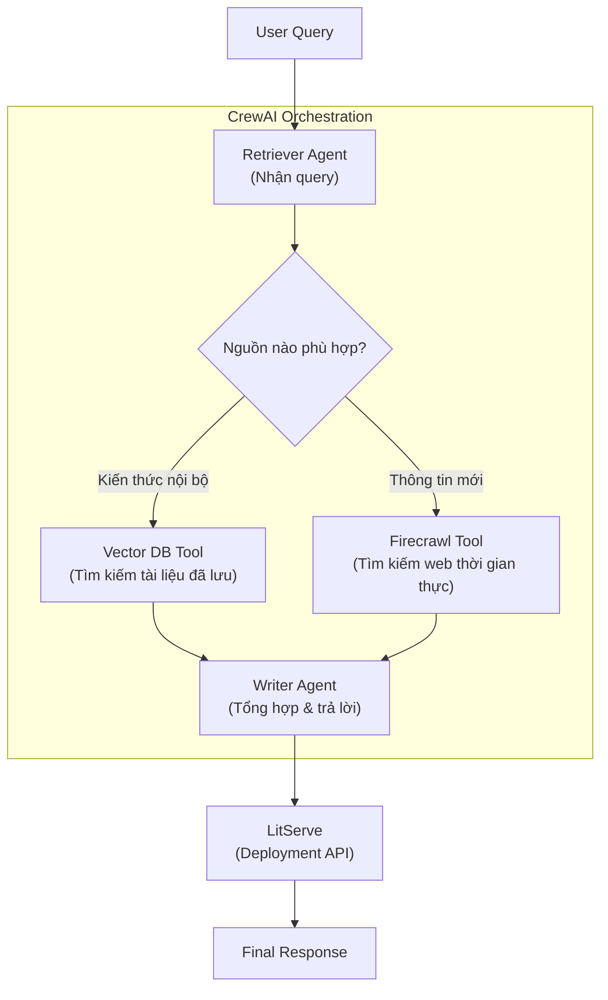

**Workflow chi tiết:**
1. **Retriever Agent** tiếp nhận query của người dùng
2. Agent tự **đánh giá** liệu vector DB hay web search phù hợp hơn
3. Gọi **tool tương ứng** (hoặc cả hai) để lấy context
4. **Writer Agent** nhận insights từ Retriever, tạo câu trả lời cuối cùng
5. LitServe serve toàn bộ pipeline như một REST API

**Hình minh họa từ sách:**


**Các bước triển khai chính:**
- **Setup LLM:** Sử dụng Qwen 3 qua Ollama (chạy local, không cần cloud API)
- **Define Research Agent:** Nhận query, truy xuất context bằng vector DB tool + Firecrawl tool
- **Define Writer Agent:** Nhận insights từ Research Agent, tạo câu trả lời
- **Setup Crew:** Đặt hai agent vào Crew, định nghĩa sequence execution
- **LitServe Integration:** Wrap Crew trong `decode_request → predict → encode_response`

**Limitations:**
- Khi cả hai nguồn (vector DB và web) đều không có đủ context → agent có thể hallucinate
- Cần thiết lập Firecrawl API key riêng (có giới hạn miễn phí)
- Độ trễ cao hơn RAG truyền thống do thêm bước agent decision

---

### 6.2. Dự án 2: Financial Analyst + MCP Server

**Mục tiêu:** Xây dựng AI Agent giúp thu thập, phân tích và tạo ra insights về xu hướng thị trường chứng khoán, được expose như một **MCP tool** có thể gọi trực tiếp từ Cursor IDE.

**Tech Stack & Lý do chọn:**
- **CrewAI** — orchestration 3-agent pipeline
- **DeepSeek-R1 (Ollama)** — LLM local với khả năng reasoning mạnh, phù hợp cho phân tích tài chính
- **Cursor** — MCP host, cho phép gọi agent trực tiếp từ IDE
- **Matplotlib + Pandas + Yahoo Finance** — visualization và data fetching

**Tại sao MCP?** Thay vì build một UI riêng, MCP cho phép developer gọi Financial Analyst trực tiếp từ Cursor IDE — nơi họ đang làm việc. Đây là **zero-friction integration**.

**Architecture:**

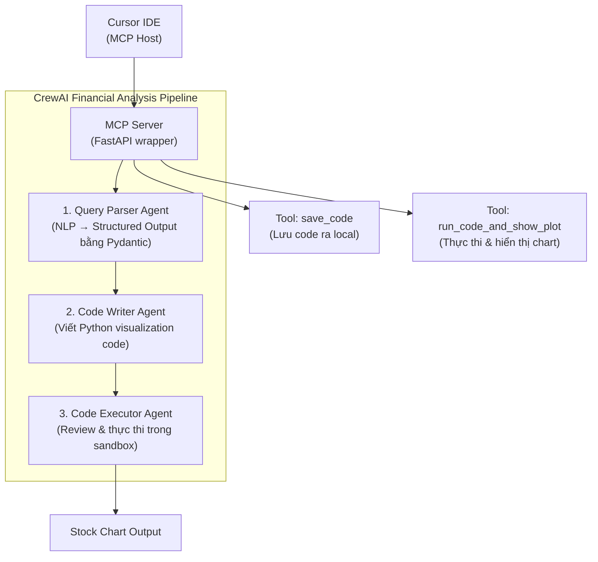

**Ba agent trong pipeline:**

**1. Query Parser Agent** — Nhận query bằng ngôn ngữ tự nhiên ("Phân tích cổ phiếu AAPL 6 tháng qua") và extract structured output bằng Pydantic. Kết quả: `{ticker: 'AAPL', period: '6M', analysis_type: 'trend'}`. Điều này đảm bảo input sạch và có cấu trúc cho các agent tiếp theo.

**2. Code Writer Agent** — Nhận structured output từ Parser, viết Python code sử dụng Pandas, Matplotlib và Yahoo Finance để visualize dữ liệu chứng khoán.

**3. Code Executor Agent** — Review code vừa được tạo, thực thi trong **sandbox environment** (CrewAI code interpreter tool) để đảm bảo an toàn. Không execute code chưa được review.

**Hình minh họa từ sách:**


**Cấu trúc MCP Server:**
```python
# Tạo MCP server expose 3 tools:
# 1. financial_analyst(query: str) → Chạy toàn bộ crew
# 2. save_code(code: str) → Lưu code vào local directory
# 3. run_code_and_show_plot(code: str) → Thực thi và tạo plot
```

**Tích hợp với Cursor:**
```
File → Preferences → Cursor Settings → MCP → Add new global MCP server
```
Sau khi thêm config JSON, Cursor có thể gọi Financial Analyst như một native tool.

**Tại sao pattern này quan trọng:** Đây là blueprint để biến **bất kỳ CrewAI workflow nào thành một MCP tool**. Pattern này có thể tái sử dụng cho mọi domain: legal research, SEO analysis, data engineering...

**Limitations:**
- DeepSeek-R1 local cần phần cứng mạnh (GPU hoặc Apple Silicon)
- Code execution trong sandbox vẫn có thể bị lỗi nếu agent generate code dùng library không được cài đặt sẵn
- Yahoo Finance data có thể bị delay hoặc rate-limited

---

### 6.3. Dự án 3: Human-like Memory Agent

**Mục tiêu:** Xây dựng AI Agent có bộ nhớ giống con người — nhớ được thông tin từ các session trước, extract facts tự động, và cá nhân hóa phản hồi theo lịch sử người dùng.

**Bài toán cốt lõi:** Nếu một AI Agent được deploy lên production mà không có memory, mọi tương tác sẽ giống như gặp một người lạ. Agent không biết bạn thích gì, đã nói gì, đã học gì ở lần trước.

**Tech Stack & Lý do chọn:**
- **Zep AI** — memory layer chuyên biệt, tự động extract và lưu trữ facts từ hội thoại
- **Microsoft AutoGen** — orchestration framework hỗ trợ Conversable Agent
- **Qwen 3 (Ollama)** — LLM local

**Sự khác biệt giữa Stateless vs. Stateful Agent:**

| Stateless Agent | Stateful Agent (với Memory) |
| :--- | :--- |
| Mỗi session là trang giấy trắng | Nhớ context từ session trước |
| Không biết user là ai | Cá nhân hóa theo profile user |
| Không học từ lịch sử | Cải thiện theo thời gian |
| Đơn giản hơn để triển khai | Cần memory layer bổ sung |

**Architecture:**

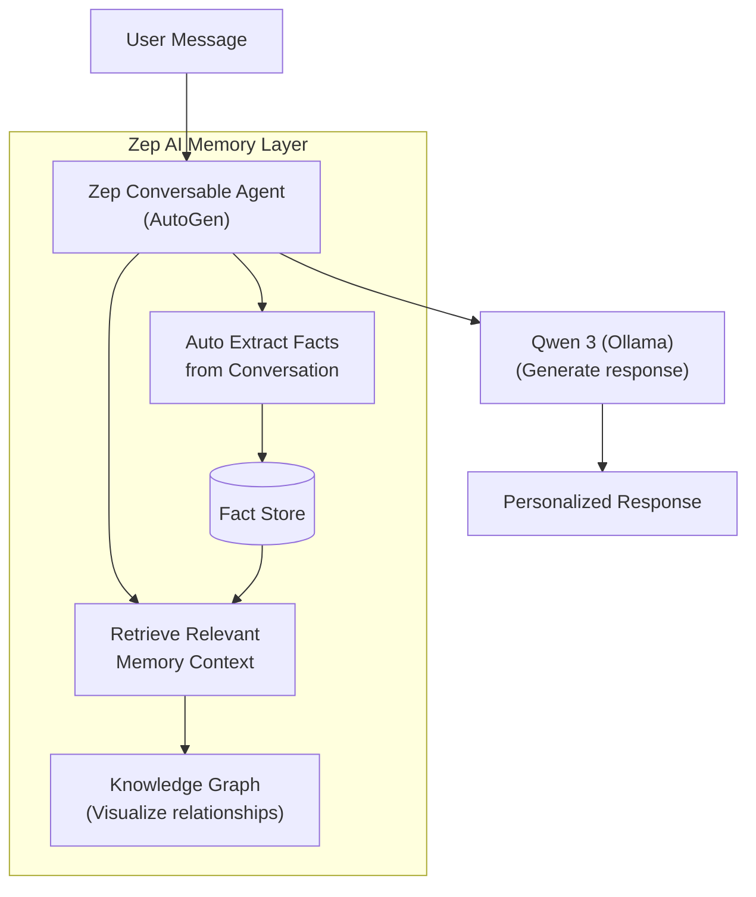

**Quy trình hoạt động:**

1. **User gửi message** → Zep Conversable Agent nhận
2. **Auto Extract Facts:** Zep tự động phân tích hội thoại và extract các facts quan trọng
   - Ví dụ: từ "Tôi là kỹ sư Python 3 năm kinh nghiệm" → fact: `{role: 'Python Engineer', experience: 3}`
3. **Retrieve Memory:** Trước khi generate response, agent query Zep để lấy relevant memories từ các session trước
4. **Generate Response:** Qwen 3 tạo response dựa trên cả current message + retrieved memory context
5. **Update Memory:** Facts mới từ cuộc hội thoại này được lưu vào Zep cho các session sau

**Hình minh họa từ sách:**


**Knowledge Graph Visualization:**
Zep Cloud cung cấp UI để visualize cách tri thức tiến hóa qua nhiều session — biểu diễn dưới dạng một knowledge graph, nơi các entities (người dùng, chủ đề, sự kiện) được kết nối với nhau theo quan hệ.

**Các component chính:**
- **Zep Client:** Kết nối tới Zep Cloud
- **User Session:** Mỗi user có session ID riêng, một user có thể có nhiều session
- **Zep Conversable Agent:** Kế thừa từ AutoGen `ConversableAgent`, tự động fetch live memory context với mỗi query
- **Stand-in Human Agent:** Quản lý tương tác chat trong AutoGen

**Limitations:**
- Cần Zep Cloud account (có free tier nhưng giới hạn)
- Fact extraction tự động có thể extract facts sai nếu hội thoại không rõ ràng
- Privacy concern: mọi hội thoại đều được phân tích và lưu trữ

---

## 7. Panorama — 9 Dự Án Quick Reference

### #2 — Voice RAG Agent

**Tech Stack:** LiveKit (orchestration), AssemblyAI (speech-to-text), Cartesia (text-to-speech SOTA), LlamaIndex (RAG)

**Workflow:**
1. Lắng nghe âm thanh real-time
2. Transcribe âm thanh qua AssemblyAI
3. Voice Activity Detection (VAD) bằng Silero để phát hiện khi nào người dùng đang nói
4. Truy vấn tài liệu của bạn qua LlamaIndex để soạn câu trả lời
5. Phát lại câu trả lời bằng giọng nói qua Cartesia

**Điểm đặc biệt:** Toàn bộ pipeline là real-time — từ lúc user nói đến lúc nghe được câu trả lời bằng giọng nói.


---

### #3 — Multi-Agent Flight Finder

**Tech Stack:** CrewAI, Browserbase (headless browser), DeepSeek-R1 (Ollama), Streamlit UI

**Workflow:**
1. Parse query bằng ngôn ngữ tự nhiên ("SF đến New York ngày 21/9") → tạo Kayak URL
2. Flight Search Agent dùng Browserbase tool mô phỏng human browsing trên Kayak
3. Extract top 5 chuyến bay, tìm thêm chi tiết cho từng chuyến
4. Summarization Agent tổng hợp kết quả
5. Streamlit UI hiển thị kết quả real-time

**Điểm đặc biệt:** `planning=True` — sử dụng Planning Pattern, Browserbase mô phỏng hành vi người thật duyệt web thay vì gọi API.


---

### #5 — Brand Monitoring System

**Tech Stack:** Bright Data (enterprise scraping), CrewAI, DeepSeek-R1 (Ollama), Streamlit

**Workflow:**
1. Dùng Bright Data SERP API để scrape brand mentions trên nhiều platform (X, Instagram, YouTube, website)
2. Platform-specific scrapers của Bright Data thu thập content đầy đủ
3. Mỗi platform có Crew riêng với 2 agent: Analysis Agent + Writer Agent
4. Merge tất cả insights từ các platform để tạo báo cáo cuối cùng

**Điểm đặc biệt:** Multi-Crew architecture — mỗi platform có Crew độc lập chạy song song, sau đó merge kết quả.


---

### #6 — Multi-Agent Hotel Finder

**Tech Stack:** CrewAI, Browserbase (headless browser), Kayak, DeepSeek-R1 (Ollama), Streamlit

**Workflow:** Tương tự Flight Finder nhưng cho khách sạn — parse query → tạo Kayak URL → browse với Browserbase → extract top 5 khách sạn → summarize.

**Điểm đặc biệt:** Có thể mở rộng thành một Travel Booking Assistant toàn diện khi kết hợp với Flight Finder.


---

### #7 — Multi-Agent Deep Researcher

**Tech Stack:** Linkup (deep web research platform), CrewAI, DeepSeek-R1 (Ollama), MCP Server, Cursor

**Workflow:**
1. User gửi query
2. Web Search Agent thực hiện deep web search qua Linkup
3. Research Analyst xác minh và deduplicate kết quả
4. Technical Writer soạn thảo phản hồi mạch lạc kèm citations
5. Expose thông qua MCP tool để gọi từ Cursor

**Điểm đặc biệt:** Linkup có khả năng cạnh tranh với Perplexity, toàn bộ stack chạy local.


---

### #9 — Multi-Agent Book Writer

**Tech Stack:** Firecrawl (SERP scraping), CrewAI Flows, Qwen 3 (Ollama), LightningAI

**Workflow:**
1. **Outline Crew** (Research Agent + Outline Agent): Scrape dữ liệu liên quan đến tiêu đề sách, quyết định số chương và tiêu đề → output dạng Pydantic schema
2. **Nhiều Writer Crew chạy song song**: Mỗi Crew gồm Research Agent + Write Agent, viết một chương
3. Merge tất cả chương thành Markdown file hoàn chỉnh

**Điểm đặc biệt:** CrewAI Flows điều phối parallel execution — nhiều chương được viết đồng thời, giảm thời gian từ hàng giờ xuống ~2 phút.


---

### #10 — Multi-Agent Content Creation System

**Tech Stack:** Motia (unified backend framework), Firecrawl, DeepSeek-R1 (Ollama), Typefully

**Workflow:**
1. User gửi URL → API Step nhận input
2. Firecrawl scrape content và convert sang Markdown
3. X Agent và LinkedIn Agent chạy **song song** tạo nội dung phù hợp từng platform
4. Lưu nháp lên Typefully để review trước khi publish

**Điểm đặc biệt:** Motia cho phép mix nhiều ngôn ngữ (Python và TypeScript) trong cùng một workflow. Có thể deploy lên cloud với một cú click.


---

### #11 — Documentation Writer Flow

**Tech Stack:** CrewAI Flows, DeepSeek-R1 (Ollama)

**Workflow:**
1. User chỉ định GitHub repo URL
2. **Planning Crew** (Code Explorer Agent + Doc Planner Agent): Phân tích codebase → tạo documentation outline dạng Pydantic output
3. **Documentation Crew** (Doc Writer Agent + Doc Reviewer Agent): Viết draft → review → đảm bảo consistency, accuracy, completeness
4. Lưu các file documentation vào local directory

**Điểm đặc biệt:** Hai-phase pipeline (Plan first, then Write) giúp documentation có cấu trúc nhất quán.


---

### #12 — Multi-Agent News Generator

**Tech Stack:** Cohere Command R 7B (ultra-fast), CrewAI, Serper (web search)

**Workflow:**
1. User gửi query
2. **Senior Research Analyst Agent** dùng Serper tool fetch kết quả từ internet, consolidate
3. **Content Writer Agent** chuyển kết quả thành bài báo tin tức trau chuốt, sẵn sàng publish
4. Output: bài báo đầy đủ kèm citations

**Điểm đặc biệt:** Cohere Command R 7B cực nhanh — phù hợp với use-case news generation cần tốc độ cao.


---

## 8. Discussion Questions

Những câu hỏi sau đây không có "đáp án đúng tuyệt đối" — chúng đòi hỏi tư duy phân tích và phụ thuộc vào context cụ thể của từng dự án:

**1. Khi nào nên dùng Multi-Agent thay vì Single Agent mạnh hơn?**

Dùng Multi-Agent khi task cần **nhiều chuyên môn khác nhau** trong cùng pipeline (VD: research + analysis + writing), hoặc khi muốn **xử lý song song** để tăng tốc. Dùng Single Agent mạnh khi task tương đối đơn giản và chi phí orchestration (token, độ trễ, độ phức tạp) lớn hơn lợi ích phân chia.

**2. ReAct pattern có thể gây infinite loop không? Làm sao phòng tránh?**

Có. Agent có thể mắc kẹt trong Thought → Action → Observation mà không tiến đến Final Answer nếu tool luôn trả về kết quả không đủ. Cách phòng tránh: đặt `max_iterations` cứng, thiết lập timeout cho từng tool call, và thêm Guardrail kiểm tra xem agent có đang lặp lại action giống nhau không.

**3. Human-in-the-loop nên được đặt ở đâu trong agent workflow?**

Tùy vào mức độ rủi ro của từng bước. Các bước high-stakes (thực thi payment, gửi email đại trà, xóa dữ liệu) cần human approval. Các bước low-stakes (research, summarize) có thể để agent tự quyết. Nguyên tắc: **Human-in-the-loop ở những điểm không thể undo được**.

**4. Trade-off giữa local LLM (Ollama/DeepSeek) và cloud LLM khi dùng trong Agent?**

| | Local LLM | Cloud LLM |
| :--- | :--- | :--- |
| **Chi phí** | Phần cứng mạnh, nhưng không per-token | Trả theo usage, dễ bùng phí khi pipeline phức tạp |
| **Privacy** | Dữ liệu không rời máy | Dữ liệu gửi lên cloud |
| **Performance** | Phụ thuộc phần cứng | Nhất quán, thường nhanh hơn |
| **Reliability** | Không phụ thuộc internet | Phụ thuộc uptime của provider |

**5. Long-term Memory nên lưu ở đâu để production-ready?**

Không nên lưu trong RAM hoặc local file. Các lựa chọn production-grade: **Zep AI** (memory layer chuyên biệt), **Redis** (cho caching và session storage), **PostgreSQL + pgvector** (cho semantic search trên memory). Quan trọng nhất: memory cần được **indexed** để retrieval nhanh, không phải scan toàn bộ.

---

## References

- Cuốn sách gốc: **"AI Agent, the Illustrated Guidebook"**
- CrewAI Documentation: [docs.crewai.com](https://docs.crewai.com)
- AutoGen Documentation: [microsoft.github.io/autogen](https://microsoft.github.io/autogen)
- Zep AI: [getzep.com](https://www.getzep.com)
- LitServe: [lightning.ai/docs/litserve](https://lightning.ai/docs/litserve)
- Linkup Platform: [linkup.so](https://www.linkup.so)
- Firecrawl: [firecrawl.dev](https://www.firecrawl.dev)
- Motia Framework: [motia.dev](https://motia.dev)

---

*Made by Anh Tu - Share to be share*
