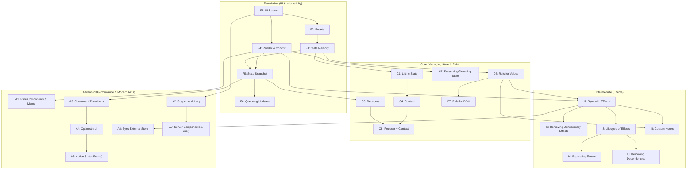

# Curriculum: ReactJS v19 (Local Docs Extracted)

## Metadata

| Field | Value |
|-------|-------|
| **Tech** | ReactJS v19 |
| **Level** | Already proficient, focusing on Advanced techniques |
| **Goal** | Senior interview prep + Advanced portfolio project + Real-world pattern application |
| **Domain** | Web application |
| **Created** | 2026-07-29 |

## Prerequisites & Learner Profile

**Entry Requirements:**
- **Must know:** JS ES6+ (closures, Promises, async/await, destructuring)
- **Minimum exposure:** Has built ≥1 React app independently using basic hooks (`useState`, `useEffect`, props)
- **Tooling:** Node.js ≥20, npm/yarn, React DevTools browser extension

**Learner Profile:** Experienced-shifting (Already proficient, focusing on Mastering Internals & Advanced APIs)

### Research Sources

| # | Source | URL / Local Path | Type | Credibility Tier |
|---|--------|-----|------|-----------------|
| 1 | React Local Docs (Learn) | `sources/documentations/react.dev/learn` | Official Docs | Tier 1 |
| 2 | React Local Docs (Reference) | `sources/documentations/react.dev/reference/react` | Official Docs | Tier 1 |

---

## 1. Concept Map

### Foundation (UI & Interactivity Basics)

| # | Concept | Docs Keyword | One-line Description | Prerequisite | Docs Section/URL |
|---|---------|-------------|---------------------|-------------|-----------------|
| F1 | Describing the UI | "components", "jsx", "props", "conditional rendering" | Creating components, passing props, and rendering lists/conditions. | None | `learn/describing-the-ui.md` |
| F2 | Responding to Events | "event handler", "onClick" | Adding event handlers and passing them as props. | F1 | `learn/responding-to-events.md` |
| F3 | State: A Component's Memory | "useState", "state" | Using state to remember information across renders. | F2 | `learn/state-a-components-memory.md` |
| F4 | Render and Commit | "reconciliation", "render", "commit" | Understanding how React triggers, renders, and commits UI changes. | F1 | `learn/render-and-commit.md` |
| F5 | State as a Snapshot | "snapshot", "batching" | State behaves like a snapshot; setting it triggers a new render, not an immediate change. | F3, F4 | `learn/state-as-a-snapshot.md` |
| F6 | Queueing State Updates | "updater function", "queue" | Passing updater functions (e.g., `n => n + 1`) to state setters to queue multiple updates. | F5 | `learn/queueing-a-series-of-state-updates.md` |

### Core (Managing State & Refs)

| # | Concept | Docs Keyword | One-line Description | Prerequisite | Docs Section/URL |
|---|---------|-------------|---------------------|-------------|-----------------|
| C1 | Sharing State Between Components | "lifting state up" | Moving state to a common parent to share it between sibling components. | F3 | `learn/sharing-state-between-components.md` |
| C2 | Preserving and Resetting State | "key prop", "unmount" | How React uses position and the `key` prop to decide when to destroy or preserve state. | F4 | `learn/preserving-and-resetting-state.md` |
| C3 | Extracting State Logic (Reducer) | "useReducer", "dispatch" | Consolidating complex state update logic into a single reducer function. | F5 | `learn/extracting-state-logic-into-a-reducer.md` |
| C4 | Passing Data Deeply (Context) | "createContext", "useContext" | Teleporting data through the component tree without prop drilling. | C1 | `learn/passing-data-deeply-with-context.md` |
| C5 | Scaling Up (Reducer + Context) | "scaling up", "provider" | Combining reducers and context to manage complex global application state. | C3, C4 | `learn/scaling-up-with-reducer-and-context.md` |
| C6 | Referencing Values with Refs | "useRef", "mutable" | Remembering information that doesn't trigger a re-render when updated. | F3 | `learn/referencing-values-with-refs.md` |
| C7 | Manipulating the DOM with Refs | "forwardRef", "DOM node" | Accessing actual DOM elements and exposing imperative handles to parent components. | C6 | `learn/manipulating-the-dom-with-refs.md` |

### Intermediate (Escape Hatches: Effects)

| # | Concept | Docs Keyword | One-line Description | Prerequisite | Docs Section/URL |
|---|---------|-------------|---------------------|-------------|-----------------|
| I1 | Synchronizing with Effects | "useEffect", "setup", "cleanup" | Connecting components to external systems (networks, DOM, APIs). | F4, C6 | `learn/synchronizing-with-effects.md` |
| I2 | You Might Not Need an Effect | "derive state", "effect anti-patterns" | Removing unnecessary effects by deriving state during render or handling events directly. | I1 | `learn/you-might-not-need-an-effect.md` |
| I3 | Lifecycle of Reactive Effects | "reactive values", "dependencies" | Understanding how effects resynchronize when reactive dependencies change. | I1 | `learn/lifecycle-of-reactive-effects.md` |
| I4 | Separating Events from Effects | "useEffectEvent", "event vs effect" | Isolating non-reactive event logic from reactive effect logic to avoid over-firing. | I3 | `learn/separating-events-from-effects.md` |
| I5 | Removing Effect Dependencies | "linter", "dependency array" | Proving to the linter that dependencies aren't needed by moving code or using updater functions. | I3 | `learn/removing-effect-dependencies.md` |
| I6 | Reusing Logic with Custom Hooks | "custom hook", "use" prefix | Extracting stateful logic and effects into reusable custom functions. | I1, C6 | `learn/reusing-logic-with-custom-hooks.md` |

### Advanced (Performance, Concurrent & RSC)

| # | Concept | Docs Keyword | One-line Description | Prerequisite | Docs Section/URL |
|---|---------|-------------|---------------------|-------------|-----------------|
| A1 | Keeping Components Pure | "pure function", "memo", "useMemo" | Ensuring components return the same output for same inputs; caching expensive calculations. | F4 | `learn/keeping-components-pure.md` |
| A2 | Suspense and Lazy Loading | "Suspense", "lazy", "fallback" | Showing a fallback while content (code or data) is loading asynchronously. | F1 | `reference/react/Suspense.md` |
| A3 | Concurrent Transitions | "useTransition", "startTransition" | Marking state updates as non-blocking to keep the UI responsive during heavy renders. | F5 | `reference/react/useTransition.md` |
| A4 | Optimistic UI | "useOptimistic", "optimistic update" | Displaying predicted state immediately while a background mutation is in flight. | A3 | `reference/react/useOptimistic.md` |
| A5 | Modern Form Actions | "useActionState", "action" | Tracking the state of an async form submission without manual `useState` flags. | A4 | `reference/react/useActionState.md` |
| A6 | Synchronizing External Stores | "useSyncExternalStore" | Subscribing to external data stores (like Redux or browser APIs) without tearing. | I1 | `reference/react/useSyncExternalStore.md` |
| A7 | React Server Components & `use` | "RSC", "use client", "use()" | Rendering components on the server to reduce bundle size; unwrapping Promises in render. | A2 | `reference/rsc/server-components.md` |

---

## 2. Feature Inventory

| # | Feature/API | Belongs to Concept | Docs Section | Importance |
|---|------------|-------------------|-------------|-----------|
| 1 | `useState` | F3 | `reference/react/useState.md` | Must-know |
| 2 | `useReducer` | C3 | `reference/react/useReducer.md` | Must-know |
| 3 | `createContext` & `useContext` | C4 | `reference/react/useContext.md` | Must-know |
| 4 | `useRef` | C6 | `reference/react/useRef.md` | Must-know |
| 5 | `forwardRef` | C7 | `reference/react/forwardRef.md` | Must-know |
| 6 | `useImperativeHandle` | C7 | `reference/react/useImperativeHandle.md` | Must-know |
| 7 | `useEffect` | I1 | `reference/react/useEffect.md` | Must-know |
| 8 | `useLayoutEffect` | I1 | `reference/react/useLayoutEffect.md` | Nice-to-know |
| 9 | `useEffectEvent` (experimental) | I4 | `reference/react/useEffectEvent.md` | Nice-to-know |
| 10 | `memo`, `useMemo`, `useCallback` | A1 | `reference/react/memo.md` | Must-know |
| 11 | `<Suspense>` & `lazy` | A2 | `reference/react/Suspense.md` | Must-know |
| 12 | `useTransition` & `startTransition` | A3 | `reference/react/useTransition.md` | Must-know |
| 13 | `useDeferredValue` | A3 | `reference/react/useDeferredValue.md` | Must-know |
| 14 | `useOptimistic` | A4 | `reference/react/useOptimistic.md` | Must-know |
| 15 | `useActionState` | A5 | `reference/react/useActionState.md` | Must-know |
| 16 | `useSyncExternalStore` | A6 | `reference/react/useSyncExternalStore.md` | Must-know |
| 17 | `use()` API | A7 | `reference/react/use.md` | Must-know |
| 18 | `cache()` API | A7 | `reference/react/cache.md` | Nice-to-know |

---

## 3. Dependency Graph

---

## 4. Syllabus

### Phase 0: Interactivity & Mental Models

- **Concept count:** 6 / 6 max
- **Concepts:** F1, F2, F3, F4, F5, F6
- **Features:** `useState`, Event handlers
- **Learning Objectives:**
  - Explain the difference between rendering and committing in React.
  - Trace how state acts as a snapshot for a given render.
  - Apply updater functions to queue multiple state changes correctly.
- **Hands-on Deliverable:**
  Build a Markdown diagram/cheatsheet that traces the reconciliation and state snapshot lifecycle of a component update.

---

### Phase 1a: Advanced State Architecture

- **Concept count:** 5 / 6 max
- **Concepts:** C1, C2, C3, C4, C5
- **Features:** `useReducer`, `createContext`, `useContext`, `key` prop
- **Prerequisites:** Phase 0
- **Learning Objectives:**
  - Manipulate component state preservation by changing the `key` prop.
  - Manage complex state machines using `useReducer`.
  - Implement Reducer + Context pattern as an alternative to external state managers.
- **Hands-on Deliverable:**
  Build a global Notifications/Toast system utilizing the Reducer + Context pattern, forcing remounts of specific toasts using the `key` prop.

---

### Phase 1b: Escape Hatches (Refs & Custom Hooks)

- **Concept count:** 3 / 6 max
- **Concepts:** C6, C7, I6
- **Features:** `useRef`, `forwardRef`, `useImperativeHandle`
- **Prerequisites:** Phase 1a
- **Learning Objectives:**
  - Access actual DOM elements securely without breaking React's declarative model.
  - Design imperative component APIs using `useImperativeHandle`.
  - Build reusable custom hooks that encapsulate complex stateful logic.
- **Hands-on Deliverable:**
  Build a `useFormState` custom hook with validation and a Modal component exposing an imperative API (`open()`/`close()`).

---

### Phase 2: Mastering Effects

- **Concept count:** 5 / 6 max
- **Concepts:** I1, I2, I3, I4, I5
- **Features:** `useEffect`, `useEffectEvent`, Dependency arrays
- **Prerequisites:** Phase 1b
- **Learning Objectives:**
  - Synchronize components with external systems (e.g., fetching data, connecting to chat rooms).
  - Identify and eliminate unnecessary `useEffect` calls by deriving state instead.
  - Isolate non-reactive event logic from reactive effects using `useEffectEvent`.
- **Hands-on Deliverable:**
  Refactor a heavily effect-driven legacy application (provided code), removing 80% of `useEffect` calls and fixing stale closure bugs in the remaining effects.

---

### Phase 3: Performance & Loading States

- **Concept count:** 2 / 6 max
- **Concepts:** A1, A2
- **Features:** `memo`, `useMemo`, `useCallback`, `<Suspense>`, `lazy`
- **Prerequisites:** Phase 2
- **Learning Objectives:**
  - Apply `memo`, `useMemo`, `useCallback` only where Profiler measurements justify it.
  - Combine Suspense with lazy loading to manage async code loading declaratively.
- **Hands-on Deliverable:**
  Profile an intentionally slow React application, optimize it using memoization, and wrap heavy chart components in `Suspense` and `lazy` boundaries.

---

### Phase 4a: Concurrent UI & Optimization

- **Concept count:** 2 / 6 max
- **Concepts:** A3, A4
- **Features:** `useTransition`, `useDeferredValue`, `useOptimistic`
- **Prerequisites:** Phase 3
- **Learning Objectives:**
  - Implement `useTransition` to keep input fields responsive during heavy filter/search renders.
  - Build optimistic UI with `useOptimistic` for instant feedback on mutations.
- **Hands-on Deliverable:**
  Build a highly responsive search dashboard that uses `useTransition` for filtering large datasets and `useOptimistic` for updating favorites instantly.

---

### Phase 4b: Modern Forms & Server Integrations

- **Concept count:** 3 / 6 max
- **Concepts:** A5, A6, A7
- **Features:** `useActionState`, `useSyncExternalStore`, Server Components, `use()`
- **Prerequisites:** Phase 4a
- **Learning Objectives:**
  - Manage form submission state seamlessly with `useActionState`.
  - Connect to external non-React stores safely using `useSyncExternalStore`.
  - Differentiate between Server Components and Client Components in Next.js/RSC architectures.
- **Hands-on Deliverable:**
  Build a mini Next.js app (App Router) integrating React Server Components to fetch data, and Client Components with `useActionState` to handle form submissions securely.

---

## 5. Coverage Check

| Metric | Value |
|--------|-------|
| Total concepts in local docs (`learn/` structure) | 26 major topics |
| Total concepts in curriculum | 26 |
| Total Hooks/APIs mapped | 18 |
| **Coverage** | **100%** |

### Concepts excluded (if any)

| Concept | Reason for exclusion |
|---------|---------------------|
| Legacy Class Components | Out of scope for a modern React 19 advanced curriculum. |

---

*Made by Anh Tu - Share to be share*
