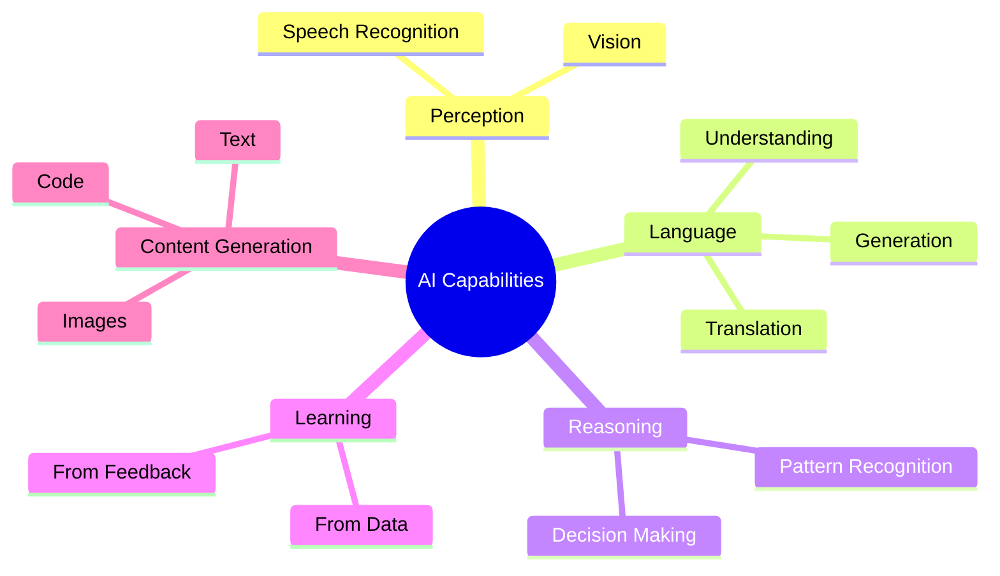
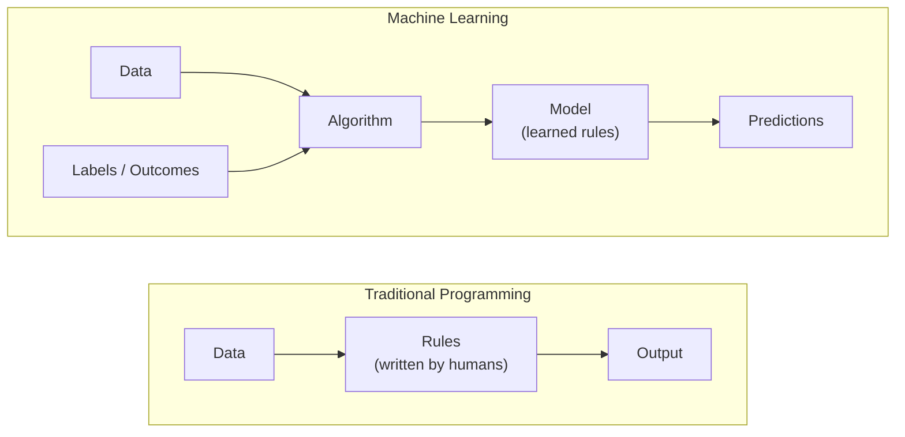

# 1. What is Artificial Intelligence?

## 1.1 Agenda

**Estimated reading time:** ~8 minutes

### Learning Outcomes

- Articulate *(diễn đạt chính xác)* a technically precise definition of Artificial Intelligence
- Distinguish *(phân biệt)* AI from Traditional Programming with concrete examples
- Identify real-world AI applications relevant to your industry

---

## 1.2 Glossary

| Term | Quick Explanation |
| :--- | :--- |
| **Artificial Intelligence (AI)** | Hệ thống máy tính mô phỏng trí tuệ con người — lý luận, học hỏi, ra quyết định. |
| **Rule-based System** | Chương trình dùng luật `if-then` do con người viết tay. |
| **Inference** | Quá trình AI áp dụng kiến thức đã học để đưa ra dự đoán trên dữ liệu mới. |
| **Deterministic** | Hệ thống luôn cho cùng một output với cùng input. Lập trình truyền thống là deterministic; AI thì probabilistic *(theo xác suất)*. |

---

## 2. Problem Statement

Traditional *(truyền thống)* software hits a hard ceiling *(giới hạn cứng)* on certain problem classes:

1. **Combinatorial explosion** *(bùng nổ tổ hợp)*: Writing explicit *(tường minh)* rules for every scenario is intractable *(bất khả thi)*. A fraud detection system with thousands of `if` conditions still misses new patterns it has never seen.
2. **Brittleness** *(tính giòn — dễ vỡ khi điều kiện thay đổi)*: Rules break when the world changes. A price model hard-coded for 2020 fails after supply chain disruptions *(gián đoạn chuỗi cung ứng)* in 2022.
3. **Non-generalizing** *(không tổng quát hóa được)*: A spam filter defined by blacklisted *(danh sách đen)* keywords fails against obfuscated *(cố tình viết sai)* text like "fr€€ m0ney."

**The shift:** Instead of asking a developer to enumerate *(liệt kê)* all rules, AI extracts rules *automatically* from examples in data.

---

## 3. What is Artificial Intelligence?

### 3.1 Technical Definition

> **Artificial Intelligence (AI)** is the discipline *(lĩnh vực nghiên cứu)* of designing computational systems that can perform tasks requiring cognitive *(nhận thức)* functions typically associated with human intelligence — including *perception* *(nhận thức cảm quan)*, *language understanding*, *reasoning* *(lý luận)*, and *learning from experience*.

### 3.2 Core AI Capabilities

Each capability maps directly to an **AI Workload** covered in [Workshop 1.3 — AI Workloads](./03-ai-workloads.md).

---

## 4. AI vs. Traditional Programming

### 4.1 The Fundamental Inversion

The *location of intelligence* *(nơi trú ngụ của logic quyết định)* moves from the developer's mind into the data.

### 4.2 Side-by-Side Comparison

| Dimension *(chiều so sánh)* | Traditional Programming | AI / Machine Learning |
| :--- | :--- | :--- |
| **Logic source** | Human expert writes rules | Algorithm extracts *(trích xuất)* rules from data |
| **Flexibility** | Rigid *(cứng nhắc)* — changes require code updates | Adaptive *(thích nghi)* — improves as new data arrives |
| **Transparency** | Fully auditable *(có thể kiểm tra toàn bộ)* | Can be a "black box" |
| **Failure mode** | Fails on unknown edge cases *(tình huống ngoài luật)* | Degrades *(suy giảm)* gracefully but can be biased *(thiên lệch)* |

### 4.3 Concrete Examples

| Task | Traditional Approach | ML Approach |
| :--- | :--- | :--- |
| **Spam Filter** | Blacklist specific keywords | Learn statistical *(thống kê)* signatures from 100,000 labeled emails |
| **Bank Fraud** | Flag any transaction over $10,000 | Build a behavioral *(hành vi)* model per user — flag deviations *(sai lệch)* from their baseline *(hành vi thông thường)* |

### 4.4 When NOT to Use AI

| Use AI when... | Use Traditional Programming when... |
| :--- | :--- |
| Problem too complex for enumerated *(liệt kê từng trường hợp)* rules | Logic is well-defined *(xác định rõ ràng)* and rarely changes |
| Large datasets available | Need 100% deterministic, auditable *(có thể kiểm chứng)* output |
| Pattern recognition in unstructured data *(dữ liệu phi cấu trúc — ảnh, text, âm thanh)* | Regulatory compliance *(tuân thủ quy định pháp lý)* requires full explainability |

---

## 5. Discussion Questions

**Q1 — Boundary of AI:**
A traditional navigation app shows fixed routes. A modern one reroutes in real-time based on predicted *(dự đoán)* traffic. At what point does the app cross from "software" into "AI"? What specific capability creates that boundary *(ranh giới)*?

**Q2 — The Transparency Trade-off:**
A bank uses a rule: *"Reject if credit score < 650."* A competitor uses an ML model with 20% higher accuracy but cannot explain individual *(từng cá thể)* decisions. From a regulatory *(quy định pháp lý)* standpoint, which is preferable, and under what conditions would you change that preference?

**Q3 — The Data Dependency Problem:**
If a hiring AI is trained on 10 years of biased *(thiên lệch)* historical hiring decisions, what does it learn? What does this imply about the claim that "AI is objective because it's just math"?

---

*Made by Anh Tu - Share to be share*
