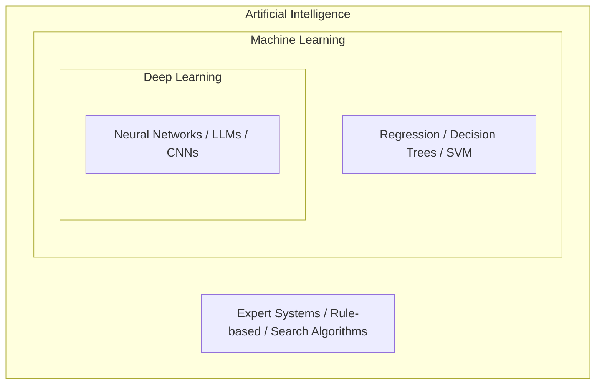
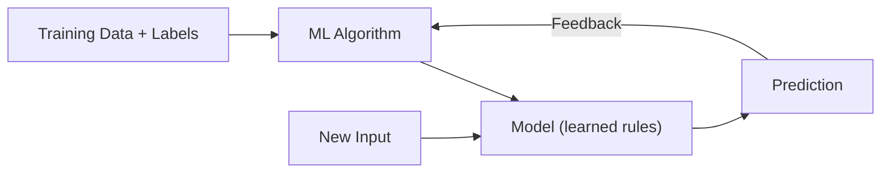
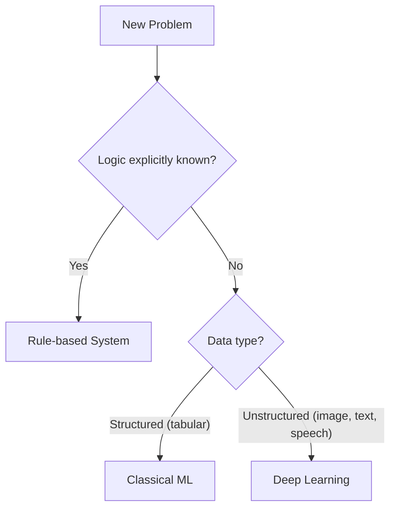

# 2. AI, Machine Learning, and Deep Learning

## 2.1 Agenda

**Estimated reading time:** ~10 minutes

### Learning Outcomes

- Describe the containment *(bao hàm)* hierarchy: AI ⊃ ML ⊃ DL
- Explain why each layer exists and what problem it solves
- Select the most appropriate *(phù hợp)* layer for a given problem

---

## 2.2 Glossary

| Term | Quick Explanation |
| :--- | :--- |
| **Algorithm** | Quy trình từng bước để máy học pattern từ dữ liệu. |
| **Neural Network** | Mô hình tính toán gồm các lớp node kết nối — cơ sở của Deep Learning. |
| **Feature Engineering** | Bước tiền xử lý thủ công: con người tự chọn đặc trưng *(features)* quan trọng từ dữ liệu thô. |
| **Representation Learning** | Khả năng tự học đặc trưng từ dữ liệu — đặc điểm nổi bật của Deep Learning. |

---

## 3. Problem Statement

A single label — "Artificial Intelligence" — is applied to systems ranging from a 1990s chess engine to GPT-4. This ambiguity *(sự mơ hồ)* causes practitioners *(người thực hành)* to misdiagnose *(chẩn đoán sai)* requirements — proposing deep learning when classical ML would achieve 95% of the performance at 10% of the cost.

---

## 4. The Containment Hierarchy

Each inner ring is a *specialization* *(chuyên biệt hóa)* of the outer — not a replacement.

---

## 5. Artificial Intelligence (Outer Ring)

> **AI** is the broadest category — any technique that enables a machine to mimic *(bắt chước)* cognitive *(nhận thức)* functions, including rule-based systems and learning-based systems.

Systems in the AI ring but **outside** ML: expert systems, Minimax chess engines, Dijkstra's pathfinding *(tìm đường)* — all encode *(mã hóa)* logic manually, with no learning from data.

---

## 6. Machine Learning (Middle Ring)

> **ML** is a subset of AI where systems improve performance through exposure *(tiếp xúc)* to data, without being explicitly *(tường minh)* programmed for every scenario.

**Core limitation:** Classical ML requires **Feature Engineering** — the manual process of deciding which aspects of raw data are informative *(có giá trị thông tin)*. This bottleneck *(điểm nghẽn cổ chai)* is what Deep Learning addresses.

---

## 7. Deep Learning (Inner Ring)

> **Deep Learning** is a subset of ML using multi-layered *(nhiều tầng)* neural networks to learn hierarchical *(phân cấp)* representations directly from raw data — bypassing *(bỏ qua)* Feature Engineering.

For an image classification task, layers learn progressively *(dần dần)* abstract features:

### 7.1 Classical ML vs. Deep Learning

| Dimension | Classical ML | Deep Learning |
| :--- | :--- | :--- |
| **Feature engineering** | Manual *(thủ công)* | Automatic *(tự động)* |
| **Data need** | Moderate *(vừa phải)* | Large — millions of samples |
| **Compute cost** | Low | High — requires GPUs |
| **Interpretability** *(khả năng giải thích)* | Transparent | Opaque *(mờ đục — black box)* |
| **Best for** | Structured tabular data *(dữ liệu bảng có cấu trúc)* | Unstructured data *(phi cấu trúc — ảnh, text, audio)* |

---

## 8. Practical Decision Framework

---

## 9. Discussion Questions

**Q1 — Classification Challenge:**
A startup claims "AI" matches candidates to roles via a scoring formula with manually set weights. Is this AI? ML? DL? Justify with definitions.

**Q2 — The Data Constraint:**
A hospital builds a rare-disease diagnostic *(chẩn đoán)* tool with only 500 confirmed *(được xác nhận)* cases. Which layer is appropriate? What technique compensates *(bù đắp)* for the data constraint? *(Hint: transfer learning.)*

**Q3 — Interpretability Trade-off:**
A bank must explain every loan rejection *(từ chối khoản vay)* by regulation. DL achieves 92% accuracy; a Decision Tree achieves 85%. Which do you deploy and why?

---

*Made by Anh Tu - Share to be share*
