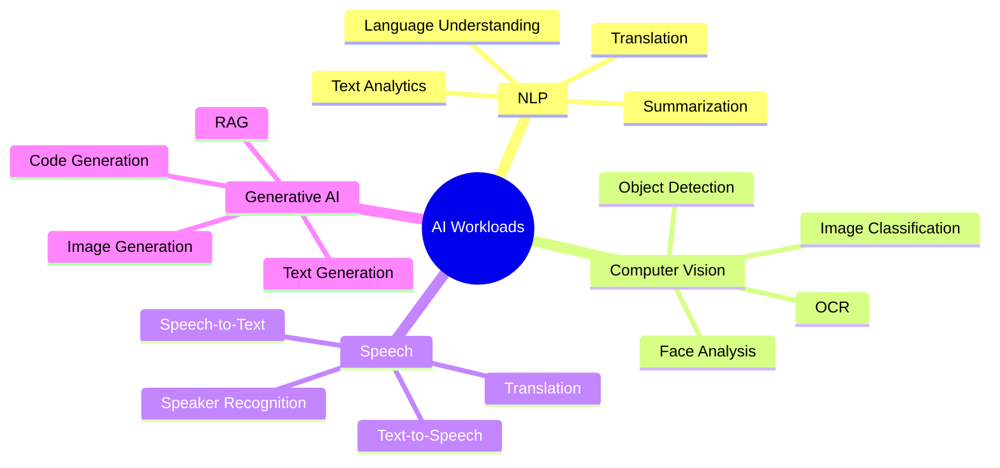
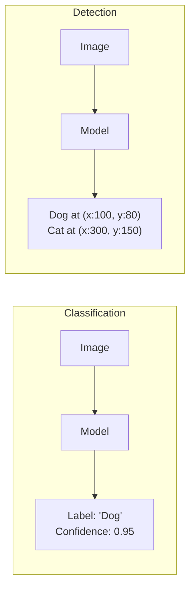
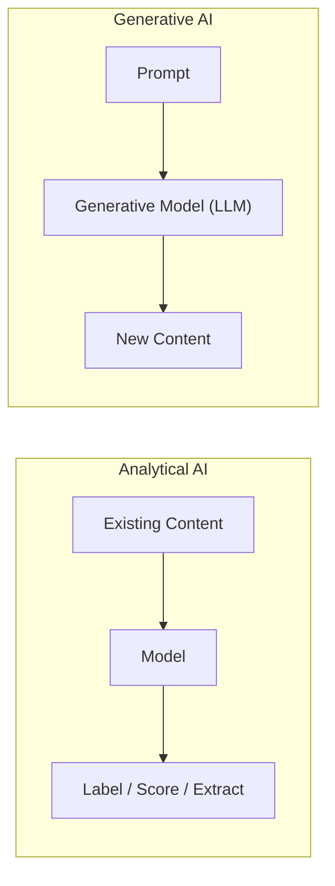

# 3. Common AI Workloads

## 3.1 Agenda

**Estimated reading time:** ~12 minutes

### Learning Outcomes

- Define each of the four AI workload categories in the AI-900 exam scope
- Map specific capabilities to the correct workload family
- Identify which Azure AI service addresses each workload
- Match a business problem to the correct workload and service

---

## 3.2 Glossary

| Term | Quick Explanation |
| :--- | :--- |
| **AI Workload** | Nhóm bài toán thực tế mà AI giải quyết — phân loại theo *kiểu dữ liệu đầu vào* và *kiểu kết quả đầu ra*. |
| **NLP** | Natural Language Processing — AI xử lý ngôn ngữ tự nhiên (text và speech). |
| **OCR** | Optical Character Recognition — kỹ thuật trích xuất *(extract)* text từ ảnh. |
| **LLM** | Large Language Model — mô hình ngôn ngữ lớn, huấn luyện *(trained)* trên dữ liệu văn bản khổng lồ (GPT-4, Gemini...). |
| **Prompt** | Câu lệnh đầu vào *(input)* người dùng cung cấp cho mô hình Generative AI. |
| **Sentiment Analysis** | Phân tích cảm xúc — phân loại text là tích cực, tiêu cực, hay trung lập. |
| **Named Entity Recognition (NER)** | Nhận diện thực thể — tự động xác định tên người, địa điểm, tổ chức trong văn bản. |
| **RAG** | Retrieval-Augmented Generation — kỹ thuật kết hợp LLM với cơ sở kiến thức riêng để giảm hallucination *(bịa thông tin)*. |

---

## 4. Problem Statement

AI capabilities are diverse — applying the wrong technique wastes resources and produces poor results. Common decision errors:

1. Using a generic *(chung chung)* text classifier when the task requires entity extraction *(trích xuất thực thể)*.
2. Treating all "image problems" as image *classification* when the requirement is *object detection* *(phát hiện và định vị vật thể)*.
3. Selecting Generative AI for tasks needing deterministic *(tất định — cùng input, cùng output)*, auditable *(có thể kiểm chứng)* output — introducing hallucination risk.

**The AI-900 exam tests your ability to match workloads to problems** — not to implement algorithms.

---

## 5. The Four AI Workload Families

---

## 6. Workload 1: Natural Language Processing (NLP)

> **NLP** enables systems to process *(xử lý)*, understand, and generate human language — in both written and spoken form.

### 6.1 Core Capabilities

| Capability | What It Does | Example |
| :--- | :--- | :--- |
| **Sentiment Analysis** | Classifies emotional *(cảm xúc)* tone | "This product is terrible" → Negative |
| **Named Entity Recognition** | Extracts structured entities *(thực thể có cấu trúc)* | "Apple in Cupertino" → ORG: Apple, LOC: Cupertino |
| **Key Phrase Extraction** | Identifies significant *(quan trọng)* concepts | Article → ["machine learning", "model drift"] |
| **Language Detection** | Identifies the language of input text | "Xin chào" → Vietnamese (vi), confidence: 0.99 |
| **Text Classification** | Assigns predefined *(định sẵn)* categories | Support ticket → ["billing", "urgent"] |
| **Text Summarization** | Condenses *(cô đọng)* long text | 10-page contract → 3-paragraph summary |
| **Machine Translation** | Converts text between languages | "Bonjour" → "Hello" (FR → EN) |
| **Question Answering** | Extracts answers from a document | Doc + "What is the deadline?" → "March 31, 2025" |

### 6.2 Azure Service: Azure AI Language

Consolidates *(hợp nhất)* the following under a unified *(thống nhất)* API:
- Text Analytics (sentiment, entities, key phrases, language detection)
- Conversational Language Understanding (CLU) — **successor to *(kế thừa của)* the deprecated LUIS**
- Custom Text Classification
- Summarization (extractive and abstractive *(trích xuất và tổng hợp)*)
- Question Answering — **successor to the deprecated QnA Maker**

> **Deprecation Note:** LUIS and QnA Maker are both retired *(đã ngừng hoạt động)*. Azure AI Language is the current unified service. The AI-900 exam may still reference them historically.

---

## 7. Workload 2: Computer Vision

> **Computer Vision** enables systems to interpret *(giải nghĩa)* and extract structured meaning from images and video.

### 7.1 Core Capabilities

| Capability | What It Does | Example |
| :--- | :--- | :--- |
| **Image Classification** | Assigns a single label *(nhãn)* to an entire image | Photo → "Cat" |
| **Object Detection** | Detects and localizes *(định vị)* multiple objects with bounding boxes *(hộp giới hạn)* | Photo → [Car at (x:120, y:80)], [Person at (...)] |
| **OCR (Read API)** | Extracts text from images and documents | Scanned invoice *(hóa đơn)* → structured JSON |
| **Image Captioning** | Generates a natural language description *(mô tả)* | Photo → "A dog sitting on a park bench" |
| **Image Tagging** | Assigns a set of keywords | Photo → ["outdoor", "animal", "dog"] |
| **Face Detection** | Locates human faces | Photo → [Face at (x:300, y:100)] |
| **Facial Recognition** | Identifies specific *(cụ thể)* individuals | Face → "Person ID: P-2041 (confidence: 0.97)" |
| **Spatial Analysis** | Tracks movement and occupancy *(mức độ chiếm dụng)* in video | Video → "Zone A: 12 people, avg dwell: 4.2 min" |

### 7.2 Classification vs. Detection — A Critical Distinction

- **Classification** answers: *"What is in this image?"*
- **Detection** answers: *"What is in this image, and **where** is it?"*

A manufacturing defect *(lỗi sản xuất)* system that must *locate* the position of a defect requires detection, not classification.

### 7.3 Azure Services

| Service | Primary Use |
| :--- | :--- |
| **Azure AI Vision** | Image Analysis, OCR/Read API, Spatial Analysis |
| **Azure AI Face** | Face detection, verification *(xác minh)*, identification |
| **Azure AI Custom Vision** | Train your own image classifier or detector |
| **Azure AI Document Intelligence** | Document-specific OCR + field extraction *(formerly Form Recognizer)* |

---

## 8. Workload 3: Speech

> **Speech AI** converts between spoken audio and text, recognizes who is speaking, and synthesizes *(tổng hợp)* human-like voice output.

### 8.1 Core Capabilities

| Capability | What It Does | Example |
| :--- | :--- | :--- |
| **Speech-to-Text (STT)** | Transcribes *(phiên âm)* spoken audio into text | Call recording → verbatim *(nguyên văn)* transcript |
| **Text-to-Speech (TTS)** | Converts text into natural-sounding audio | Text → MP3 in a custom neural voice |
| **Speech Translation** | Translates spoken audio in real-time | Vietnamese speech → English text |
| **Speaker Recognition** | Identifies or verifies *(xác minh)* a speaker's identity | Audio → "Is this the registered user?" → Yes/No |
| **Pronunciation Assessment** | Evaluates pronunciation accuracy | Student says "algorithm" → Score: 72/100 |
| **Custom Speech** | Fine-tunes *(tinh chỉnh)* transcription for domain-specific *(chuyên biệt theo lĩnh vực)* vocabulary | Medical dictation *(đọc ghi)* → trained to recognize drug names |

### 8.2 Azure Service: Azure AI Speech

All capabilities are consolidated under **Azure AI Speech**, accessed via a single SDK/API across real-time, batch, and embedded *(nhúng vào thiết bị)* deployment modes.

---

## 9. Workload 4: Generative AI

> **Generative AI** refers to AI systems that produce *new, original content* — text, images, code, audio, or video — based on learned patterns *(pattern đã học)*, guided by a prompt.

### 9.1 What Makes Generative AI Different

Unlike the previous three workloads — which *analyze* existing content — Generative AI *creates* new content.

### 9.2 Core Capabilities

| Capability | What It Does | Example |
| :--- | :--- | :--- |
| **Text Generation** | Produces coherent *(mạch lạc)* text from a prompt | "Summarize this contract in 3 bullets" → summary |
| **Code Generation** | Writes code from natural language instructions | "Write a Python sort function" → code |
| **Image Generation** | Creates images from text descriptions | "A futuristic city at sunset" → image |
| **RAG** | Grounds *(neo đậu)* LLM responses in a private knowledge base to reduce hallucination | Company FAQ + user query → cited *(có trích dẫn)* answer |
| **Abstractive Summarization** | Generates a summary in new words *(không chỉ trích xuất)* | 50-page report → 1-page narrative *(tường thuật)* |
| **Conversational Q&A** | Answers questions in natural language dialogue | "What's my order status?" → contextual *(theo ngữ cảnh)* answer |

### 9.3 Azure Service: Azure OpenAI Service

- Access to GPT-4, GPT-4o, DALL-E, Whisper, and Embeddings models
- Enterprise-grade *(cấp doanh nghiệp)* security, compliance *(tuân thủ quy định)*, and content filtering *(lọc nội dung)*
- Integration with **Azure AI Foundry** for building production *(triển khai thực tế)* generative AI applications

---

## 10. Business Problem → Workload Mapping

This table is the most exam-critical *(quan trọng nhất với thi)*  section. AI-900 frequently presents a business scenario and asks you to select the correct Azure service.

| Business Problem | Data Type | Workload | Azure Service |
| :--- | :--- | :--- | :--- |
| Analyze customer reviews for satisfaction trends | Text | NLP — Sentiment Analysis | Azure AI Language |
| Digitize *(số hóa)* paper forms into database records | Document images | CV — OCR | Azure AI Document Intelligence |
| Transcribe *(ghi lại)* doctor-patient consultations | Audio | Speech — STT + Custom Speech | Azure AI Speech |
| Build a chatbot answering from company documents | Text | Generative AI — RAG | Azure OpenAI + AI Search |
| Detect defective *(bị lỗi)* products on assembly line *(dây chuyền sản xuất)* | Images | CV — Object Detection | Azure AI Custom Vision |
| Verify employee identity from voice on a call | Audio | Speech — Speaker Recognition | Azure AI Speech |
| Auto-tag thousands of product photos | Images | CV — Image Tagging | Azure AI Vision |
| Translate real-time meeting speech across languages | Audio | Speech — Translation | Azure AI Speech |

---

## 11. Discussion Questions

**Q1 — Multi-workload Pipeline:**
A hospital wants a tool that: (1) processes doctors' handwritten notes, (2) extracts patient symptoms and medications mentioned, (3) flags high-risk drug combinations. How many distinct *(riêng biệt)* AI workloads are involved? Map each step to the appropriate workload category.

**Q2 — Hallucination Risk:**
A legal firm uses an LLM to answer "What was the ruling *(phán quyết)* in Case #45-2023?" The LLM occasionally generates plausible-sounding but factually incorrect answers. What architectural *(kiến trúc)* pattern reduces this risk? Which Azure services implement it?

**Q3 — The OCR Edge Case:**
Your team debates: use **Azure AI Vision** (image captioning) vs. **Azure AI Document Intelligence** to extract invoice data. Both process images. What is the fundamental difference in what each service extracts, and which is correct for this task?

---

*Made by Anh Tu - Share to be share*
