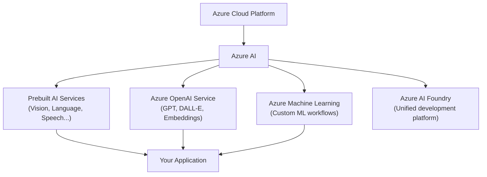
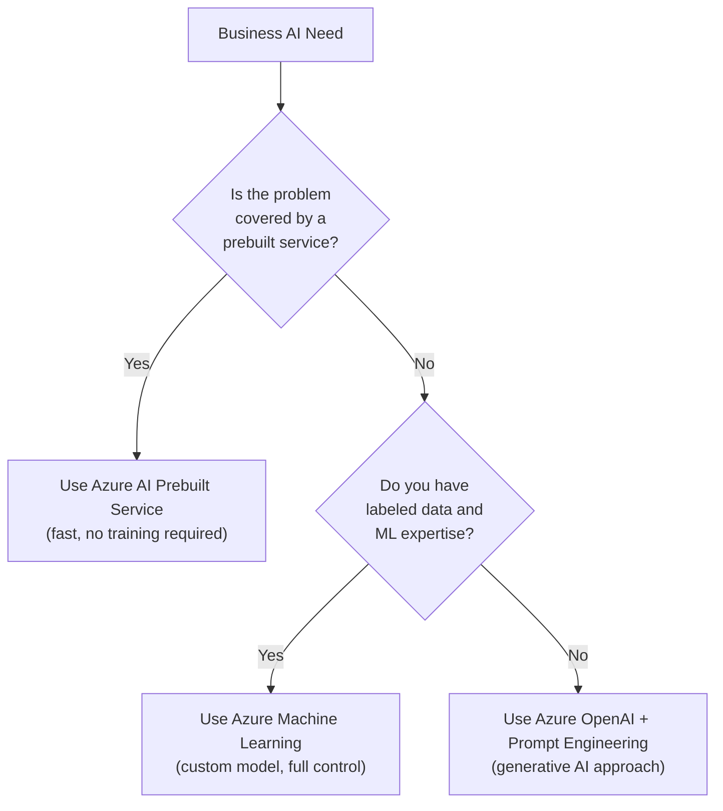

# 1. What is Azure AI?

## 1.1 Agenda

**Estimated reading time:** ~8 minutes

### Learning Outcomes

- Define Azure AI and its position within the broader Azure cloud platform
- Explain the five key benefits of using managed *(được quản lý bởi Microsoft)* AI services
- Describe the role of Azure AI Foundry as the unified *(thống nhất)* development platform
- Articulate the difference between *prebuilt AI services* and *custom ML*

---

## 1.2 Glossary

| Term | Quick Explanation |
| :--- | :--- |
| **Azure** | Nền tảng điện toán đám mây *(cloud computing)* của Microsoft — cung cấp hạ tầng, dữ liệu và ứng dụng như dịch vụ. |
| **Managed Service** | Dịch vụ mà Microsoft vận hành và bảo trì hạ tầng — người dùng chỉ cần gọi API, không cần tự dựng server. |
| **API** | Application Programming Interface — giao diện lập trình cho phép ứng dụng của bạn gọi tính năng AI qua HTTP request. |
| **Azure AI Foundry** | Nền tảng tập trung để xây dựng, triển khai *(deploy)* và quản lý ứng dụng AI trên Azure (trước đây là Azure AI Studio). |
| **Prebuilt Model** | Mô hình AI đã được Microsoft huấn luyện *(train)* sẵn — người dùng gọi trực tiếp qua API mà không cần training lại. |
| **Responsible AI** | Bộ nguyên tắc và công cụ đảm bảo AI được phát triển và triển khai một cách công bằng, an toàn và có trách nhiệm. |

---

## 2. Problem Statement

Building AI from scratch *(từ đầu)* requires:

1. **Deep ML expertise** — Data scientists who can design, train, and tune models.
2. **Massive infrastructure** — GPUs, storage, orchestration *(điều phối)* systems.
3. **Continuous maintenance** — Models degrade *(suy giảm hiệu năng)* over time and need retraining.
4. **Security & compliance overhead** *(gánh nặng tuân thủ)* — Enterprise-grade *(cấp doanh nghiệp)* data protection and regulatory requirements.

**Azure AI removes all four barriers** through managed services — Microsoft handles the infrastructure, model maintenance, security, and compliance. Your team integrates AI via API calls.

---

## 3. What is Azure AI?

### 3.1 Definition

> **Azure AI** is Microsoft's collection of artificial intelligence services, tools, and infrastructure that enables organizations to add AI capabilities to their applications — without requiring deep data science expertise or building AI models from scratch.

### 3.2 Position in the Azure Ecosystem

### 3.3 Azure AI Foundry

**Azure AI Foundry** (formerly *(trước đây là)* Azure AI Studio) is the central workbench *(bàn làm việc trung tâm)* for building AI applications on Azure. It provides:

- **Model Catalog** *(Danh mục mô hình)*: Access to models from Microsoft, OpenAI, Meta, Hugging Face, and others.
- **Prompt Flow**: Visual orchestration *(điều phối trực quan)* of AI workflows.
- **Evaluation & Safety tools**: Test model quality and apply content filters *(bộ lọc nội dung)* before deployment.
- **Agent capabilities**: Build AI agents that act autonomously *(hành động tự chủ)* on multi-step tasks.

---

## 4. Why Use Azure AI?

### 4.1 Five Key Benefits

| Benefit | What It Means |
| :--- | :--- |
| **Scalability** *(Khả năng mở rộng)* | Scale from a prototype *(nguyên mẫu)* to millions of requests without re-architecting *(thiết kế lại)* your system. |
| **Security & Compliance** | Built-in encryption *(mã hóa)*, role-based access control *(RBAC)*, and compliance with GDPR, HIPAA, ISO 27001. |
| **Integration** | Native connectivity *(kết nối gốc)* to Azure Storage, Azure SQL, Azure Functions, and 300+ other Azure services. |
| **Speed to Market** *(Tốc độ ra thị trường)* | Add AI features in days via API — no need to train models from scratch. |
| **Responsible AI** | Microsoft's built-in fairness *(công bằng)*, transparency *(minh bạch)*, and accountability *(trách nhiệm)* tools across all services. |

### 4.2 Managed vs. Custom: When to Choose Each

| Factor | Prebuilt AI Services | Custom ML (Azure ML) |
| :--- | :--- | :--- |
| **Time to implement** | Hours to days | Weeks to months |
| **ML expertise needed** | Minimal | Significant |
| **Customization** | Limited | Full control |
| **Data required** | None (use pretrained *(đã huấn luyện trước)* models) | Large labeled dataset needed |
| **Best for** | Common tasks (sentiment, OCR, translation) | Domain-specific *(chuyên biệt theo lĩnh vực)* problems |

---

## 5. Azure AI Service Categories

Workshop 2 covers the core prebuilt AI services, organized by the AI workload they serve:

| Category | Azure Service | Workload |
| :--- | :--- | :--- |
| **Language** | Azure AI Language | NLP — text analytics, Q&A, classification |
| **Language** | Azure AI Translator | NLP — real-time translation |
| **Speech** | Azure AI Speech | Speech-to-text, TTS, speaker recognition |
| **Vision** | Azure AI Vision | Image analysis, OCR, spatial analysis |
| **Vision** | Azure AI Document Intelligence | Document-specific OCR + field extraction |
| **Safety** | Azure AI Content Safety | Detect & filter harmful content |
| **Multimodal** | Azure AI Content Understanding | Extract insights from multimodal *(đa phương thức — text, ảnh, audio, video)* unstructured data |

Each service is covered in detail in [Workshop 2.2 — Azure AI Services](./02-azure-ai-services.md).

---

## 6. Discussion Questions

**Q1 — Build vs. Buy:**
A fintech *(công nghệ tài chính)* startup wants to add sentiment analysis to customer feedback. Their CTO proposes training a custom ML model; their engineer proposes using Azure AI Language's prebuilt sentiment API. What factors should drive this decision? Under what conditions would the custom approach be justified *(được biện minh)*?

**Q2 — The Managed Service Trade-off:**
Using a managed service means Microsoft controls the underlying *(bên dưới)* model. If Microsoft updates the model, your application's behavior may change without your intervention *(can thiệp)*. What governance *(quản trị)* practices should your team implement to detect and respond to such changes?

**Q3 — Responsible AI as a Feature:**
A company pitches *(quảng bá)* to an enterprise client: "We use Azure AI, which has built-in Responsible AI." Is this claim sufficient *(đủ)* to satisfy *(đáp ứng)* the client's AI governance requirements? What additional *(bổ sung)* responsibilities remain with the *application developer*, regardless of *(bất kể)* the platform?

---

*Made by Anh Tu - Share to be share*
