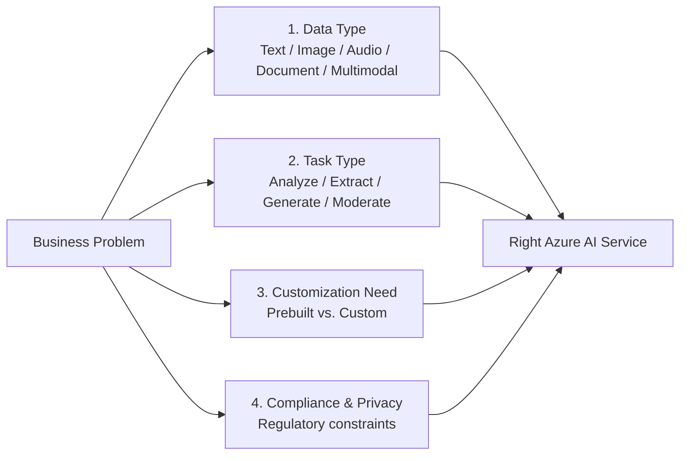
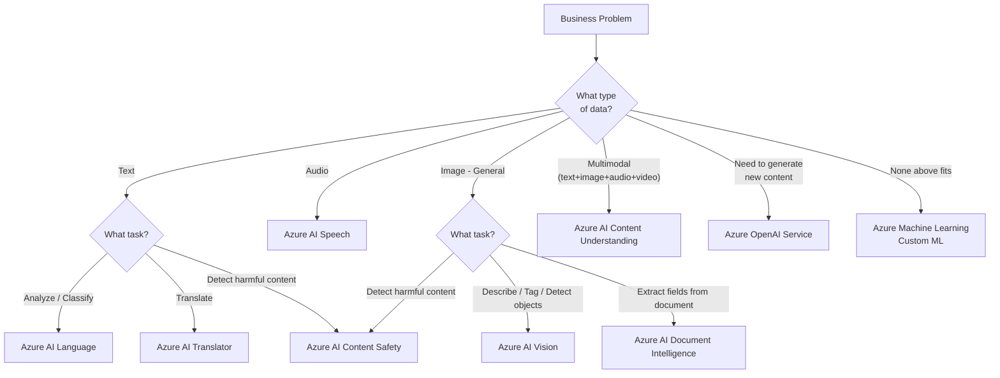

# 3. Choosing the Right Azure AI Service

## 3.1 Agenda

**Estimated reading time:** ~8 minutes

### Learning Outcomes

- Apply a structured decision framework *(khung ra quyết định)* to map business problems to Azure AI services
- Identify the four key decision factors when selecting a service
- Distinguish between services that overlap in capability but differ in purpose
- Recognize when *no* prebuilt service fits and custom ML is required

---

## 3.2 Glossary

| Term | Quick Explanation |
| :--- | :--- |
| **Decision Factor** | Tiêu chí *(criterion)* dùng để so sánh và chọn giữa các giải pháp. |
| **Latency** | Độ trễ — thời gian từ khi gửi request đến khi nhận response. Quan trọng với real-time applications. |
| **Throughput** | Thông lượng — số lượng request có thể xử lý trong một đơn vị thời gian. |
| **Customization** | Khả năng tinh chỉnh *(fine-tune)* hoặc huấn luyện lại dịch vụ cho domain riêng của bạn. |
| **Compliance** | Tuân thủ các quy định pháp lý như GDPR *(quy định bảo vệ dữ liệu của EU)*, HIPAA *(y tế Mỹ)*, PCI-DSS *(thanh toán)*. |

---

## 4. The Four Decision Factors

When selecting an Azure AI service, evaluate four dimensions:

### Factor 1: Data Type

The primary filter *(bộ lọc đầu tiên)*. Match the input data type to the service family:

| Data Type | Service Family |
| :--- | :--- |
| Plain text | Azure AI Language, Azure AI Translator |
| Audio | Azure AI Speech |
| General images *(ảnh tổng quát)* | Azure AI Vision |
| Document images *(ảnh tài liệu — PDF, hóa đơn, form)* | Azure AI Document Intelligence |
| Multimodal *(text + image + audio + video)* | Azure AI Content Understanding |
| Any content (text or image) requiring safety filtering | Azure AI Content Safety |

### Factor 2: Task Type

Within the same data type, the *task* determines the service:

| Task | Service |
| :--- | :--- |
| Understand and classify text | Azure AI Language |
| Translate text between languages | Azure AI Translator |
| Convert audio ↔ text | Azure AI Speech |
| Describe or tag images | Azure AI Vision |
| Extract structured fields from documents | Azure AI Document Intelligence |
| Detect harmful content | Azure AI Content Safety |
| Generate new content | Azure OpenAI Service |

### Factor 3: Customization Need

| Need | Approach |
| :--- | :--- |
| Standard accuracy is sufficient *(đủ)* | Use prebuilt service directly via API |
| Need domain-specific *(chuyên biệt)* vocabulary or terminology | Fine-tune: Custom Speech, Custom Translator, Custom Text Classification |
| Need custom extraction from proprietary *(độc quyền)* documents | Custom model in Azure AI Document Intelligence |
| Standard service doesn't address the problem | Azure Machine Learning (custom ML) |

### Factor 4: Compliance & Privacy

Certain regulated *(được quy định)* industries impose *(áp đặt)* additional constraints:

| Regulation | Industry | Key Requirement |
| :--- | :--- | :--- |
| **GDPR** | All EU-data handling | Data residency *(nơi lưu trữ dữ liệu)*, right to erasure *(quyền xóa dữ liệu)* |
| **HIPAA** | Healthcare | Patient data must not be sent to external APIs without a BAA *(Business Associate Agreement)* |
| **PCI-DSS** | Payments | Cardholder data must be masked *(che đi)* before processing |

Azure AI services are GDPR-compliant and Azure offers HIPAA-eligible *(đủ điều kiện HIPAA)* configurations — but the application developer must still implement data handling correctly.

---

## 5. Decision Flowchart

---

## 6. Common Exam Scenarios

These are the most frequently tested *(thường gặp nhất trong thi)* service selection scenarios in AI-900:

| Scenario | Correct Service | Why — Not the Other One |
| :--- | :--- | :--- |
| Extract invoice fields (total, vendor, date) from scanned PDFs | **Document Intelligence** | Vision's Read API returns raw text — no field mapping |
| Detect whether a customer review is positive or negative | **AI Language** — Sentiment Analysis | Translator only converts language, not sentiment |
| Build a chatbot for an internal HR policy document | **AI Language** — Question Answering | Not Azure OpenAI — no generative hallucination risk needed for exact answers |
| Convert call recordings to text with legal terminology | **AI Speech** + Custom Speech | Base STT may misrecognize *(nhận nhầm)* legal jargon *(biệt ngữ pháp lý)* |
| Moderate *(kiểm duyệt)* user-uploaded photos in a social app | **AI Content Safety** | Vision describes content — Safety moderates it |
| Translate 10,000 product descriptions overnight | **AI Translator** — Document/Batch mode | Real-time Text Translation is for interactive *(tương tác trực tiếp)* use |
| Identify speaker identity from audio in a security system | **AI Speech** — Speaker Recognition | STT only transcribes — it does not identify *who* is speaking |

---

## 7. Trade-offs: Prebuilt vs. Custom

No single service is universally *(luôn luôn)* the best choice. Key trade-offs *(đánh đổi)*:

| Trade-off | Prebuilt Service | Custom Model |
| :--- | :--- | :--- |
| **Speed** | Days to integrate | Weeks/months to train |
| **Cost** | Per-call pricing *(tính theo số lần gọi)* | Compute + training cost + hosting |
| **Accuracy** | General-purpose *(mục đích chung)* — may underperform in niche *(ngách)* domains | Domain-optimized — higher accuracy for specific use case |
| **Maintenance** | Microsoft updates the model | You own model versioning and retraining |
| **Risk** | Microsoft model changes may affect *(ảnh hưởng)* behavior | Full control — no external dependency *(phụ thuộc bên ngoài)* |

---

## 8. Discussion Questions

**Q1 — The Ambiguous Scenario:**
A retail chain wants to process 500,000 product return forms monthly. Each form is a scanned image containing: (1) a handwritten description of the defect, (2) a printed barcode, and (3) a checkbox indicating return reason. Which Azure AI service(s) would you combine, and how would you architect *(thiết kế kiến trúc)* the pipeline?

**Q2 — The Compliance Blocker:**
A hospital in the EU wants to use Azure AI Language to analyze clinical notes for patterns that predict *(dự đoán)* patient readmission *(nhập viện lại)*. The legal team flags GDPR concerns because patient names appear in the notes. Which Azure AI Language capability can address *(giải quyết)* this concern before sending data to the API? What if the hospital is in the US and subject to HIPAA?

**Q3 — Build vs. Buy — The Hidden Cost:**
A company chooses Azure AI Language's prebuilt sentiment API over building a custom model because it's "faster and cheaper." Six months later, Microsoft updates the underlying model, and the API now returns different sentiment scores for the same inputs. Their dashboards *(bảng điều khiển)* and SLA metrics break. What processes should the team have had in place *(đặt sẵn)* to prevent this? What does this reveal about the true cost of prebuilt AI services?

---

*Made by Anh Tu - Share to be share*
