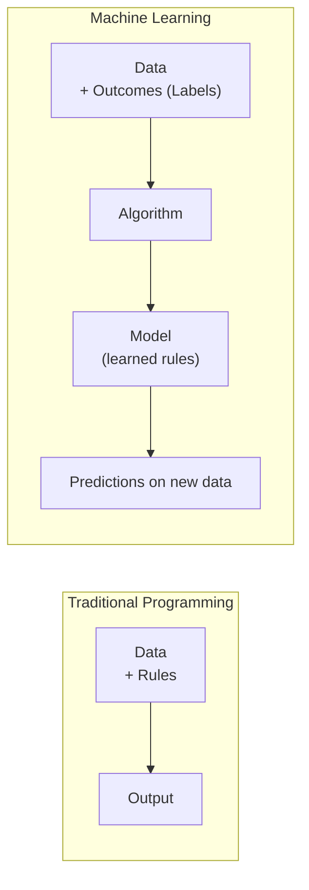
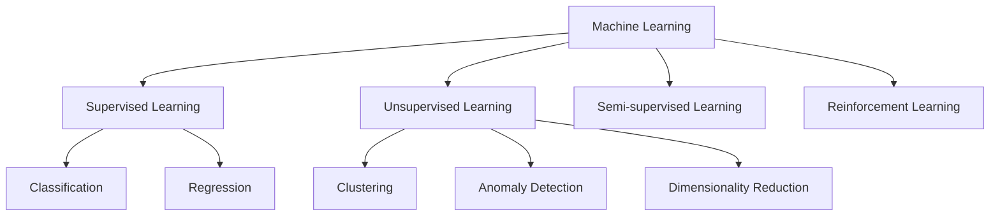
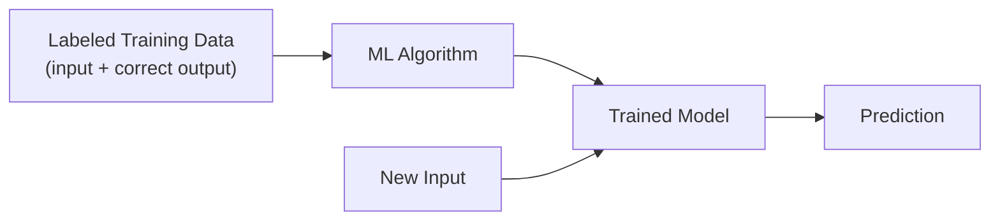
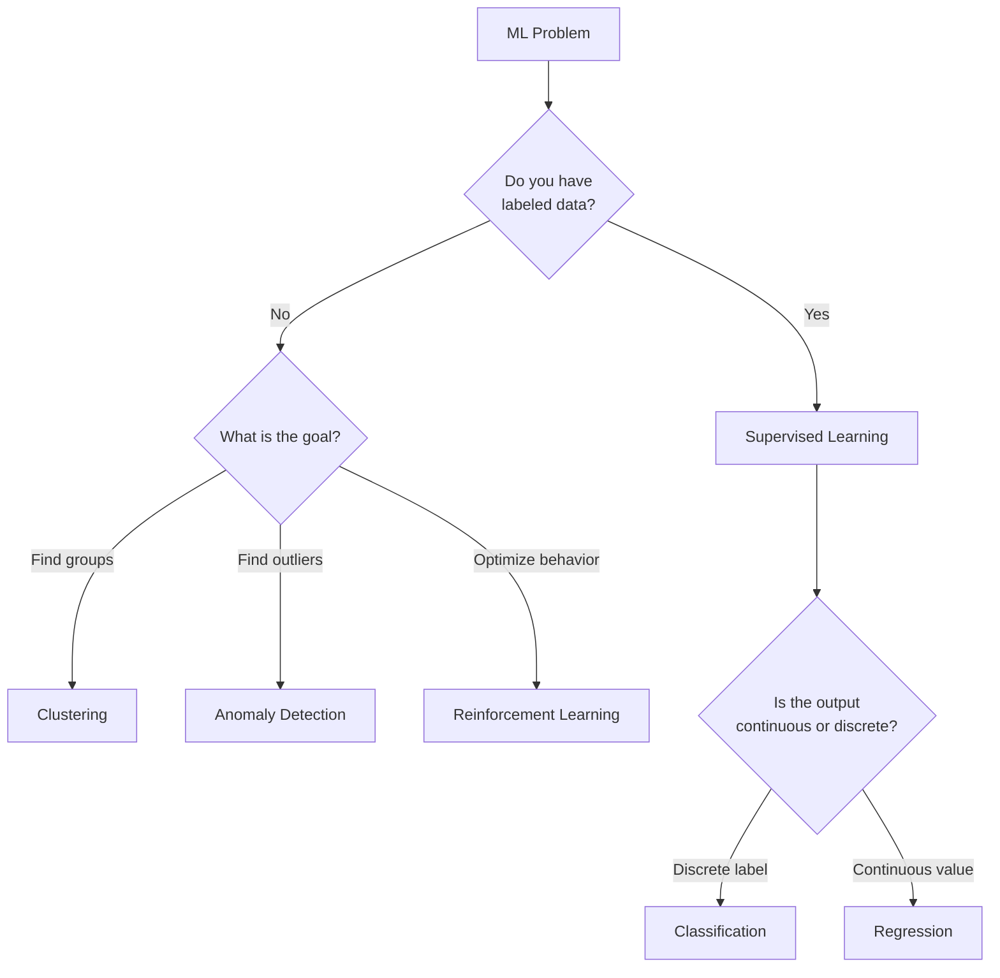

# 1. What is Machine Learning?

## 1.1 Agenda

**Estimated reading time:** ~10 minutes

### Learning Outcomes

- Define Machine Learning with technical precision and distinguish it from AI broadly
- Describe the three main learning paradigms and when each applies
- Identify the specific problem types within supervised learning (classification vs. regression)
- Explain why data quality is more critical than algorithm choice

---

## 1.2 Glossary

| Term | Quick Explanation |
| :--- | :--- |
| **Supervised Learning** | Học có giám sát — thuật toán học từ dữ liệu đã được gán nhãn *(labeled data)*: biết cả input lẫn expected output. |
| **Unsupervised Learning** | Học không giám sát — tìm pattern trong dữ liệu chưa có nhãn *(unlabeled data)*, không biết output trước. |
| **Reinforcement Learning** | Học tăng cường — agent *(tác nhân)* học bằng cách thử nghiệm *(trial and error)* và nhận phần thưởng *(reward)* hoặc hình phạt *(penalty)*. |
| **Label** | Nhãn — kết quả đúng *(ground truth)* được gán cho mỗi mẫu dữ liệu trong supervised learning. |
| **Feature** | Đặc trưng — biến đầu vào *(input variable)* dùng để dự đoán. Ví dụ: diện tích nhà, số phòng, vị trí → đều là features để dự đoán giá nhà. |
| **Classification** | Bài toán phân loại — dự đoán một nhãn rời rạc *(discrete label)* từ tập hữu hạn. Ví dụ: spam/not spam, cat/dog/car. |
| **Regression** | Bài toán hồi quy — dự đoán một giá trị liên tục *(continuous value)*. Ví dụ: giá nhà, nhiệt độ ngày mai. |
| **Clustering** | Phân cụm — nhóm các điểm dữ liệu tương đồng với nhau mà không cần biết nhãn trước. |
| **Anomaly Detection** | Phát hiện bất thường — xác định điểm dữ liệu khác biệt đáng kể so với phần còn lại. |

---

## 2. Problem Statement

Traditional *(truyền thống)* software requires a developer to anticipate *(lường trước)* and encode *(mã hóa)* every possible decision path. This breaks down when:

- The rules are too complex to enumerate *(liệt kê đầy đủ)* — e.g., "what makes an email spam?"
- The environment changes — a fraud pattern from 2020 is different from 2025
- The data is unstructured *(phi cấu trúc)* — images, audio, free text cannot be processed by `if-then` logic

Machine Learning solves this by **inverting the paradigm** *(đảo ngược mô hình)*: instead of writing rules, you provide data + outcomes, and the algorithm learns the rules.

---

## 3. What is Machine Learning?

### 3.1 Definition

> **Machine Learning (ML)** is a subset of Artificial Intelligence where computational systems learn to improve their performance on a specific task *automatically* through exposure *(tiếp xúc)* to data, without being explicitly *(tường minh)* programmed for every scenario.

### 3.2 Definition Anatomy

- **"Subset of AI"** — ML is one approach within the broader *(rộng hơn)* AI field. Rule-based systems are also AI but not ML.
- **"Automatically"** — The key word. The model's internal parameters *(tham số nội tại)* adjust themselves through training, without a human writing new rules.
- **"Exposure to data"** — ML systems require data to function. More quality data typically means better performance.
- **"Without being explicitly programmed"** — The developer writes the *learning algorithm*, not the *decision logic*. The decision logic *emerges *(xuất hiện)* from the data*.

### 3.3 The Core Inversion

---

## 4. Types of Machine Learning

### 4.1 Overview

> **AI-900 scope:** Focuses primarily *(chủ yếu)* on Supervised and Unsupervised learning. Semi-supervised and Reinforcement Learning are introduced conceptually *(theo khái niệm)* only.

### 4.2 Supervised Learning

**Definition:** The algorithm learns from **labeled data** — each training example has both an input and a known correct output.

**Two core problem types:**

| Problem Type | Output | Example |
| :--- | :--- | :--- |
| **Classification** | Discrete label *(nhãn rời rạc)* from a finite set | Email → Spam / Not Spam |
| **Regression** | Continuous numeric *(số liên tục)* value | Square meters → House price |

**Classification examples:**

- Binary *(nhị phân)*: Spam vs. not spam, fraud vs. legitimate
- Multi-class *(đa lớp)*: Image → "cat", "dog", or "car"
- Multi-label *(đa nhãn)*: News article → ["sports", "finance"] simultaneously *(đồng thời)*

**Regression examples:**

- House price prediction given area, location, number of rooms
- Expected *(kỳ vọng)* sales revenue next quarter
- Patient hospital stay duration *(thời gian lưu viện)* in days

### 4.3 Unsupervised Learning

**Definition:** The algorithm finds patterns in **unlabeled data** — there are no correct answers provided *(được cung cấp)*. The model must discover *(khám phá)* structure on its own.

| Task | What It Does | Example |
| :--- | :--- | :--- |
| **Clustering** | Groups similar *(tương đồng)* data points | Customer segmentation *(phân khúc)* by purchasing behavior |
| **Anomaly Detection** | Flags data points that deviate *(lệch)* significantly from the norm *(chuẩn)* | Unusual transaction in banking |
| **Dimensionality Reduction** | Compresses *(nén)* high-dimensional data while preserving *(giữ nguyên)* information | Visualizing complex datasets in 2D |

### 4.4 Reinforcement Learning (Conceptual)

An **agent** *(tác nhân)* learns by interacting with an environment *(môi trường)*:
- Takes an **action** *(hành động)*
- Receives a **reward** *(phần thưởng)* or **penalty** *(hình phạt)*
- Updates its strategy *(chiến lược)* to maximize *(tối đa hóa)* cumulative *(tích lũy)* reward

**Examples:** Game-playing AI (AlphaGo), robot navigation *(điều hướng)*, recommendation system optimization.

> **AI-900 note:** Reinforcement Learning is not directly tested. Understanding the concept at a high level is sufficient *(đủ)*.

---

## 5. Choosing the Right Learning Type

---

## 6. Real-World Examples by Learning Type

| Scenario | Type | Why |
| :--- | :--- | :--- |
| Email spam detection | Supervised — Classification | Known labels: spam or not spam |
| House price prediction | Supervised — Regression | Output is a continuous number |
| Customer segmentation *(phân khúc khách hàng)* | Unsupervised — Clustering | No predefined groups; model discovers them |
| Credit card fraud detection | Unsupervised — Anomaly Detection | Fraudulent *(gian lận)* transactions are rare outliers *(điểm ngoại lai)* |
| Game-playing AI (Chess, Go) | Reinforcement Learning | Agent learns strategy through millions of games |
| Product recommendation | Can be Supervised or Unsupervised | Supervised if user ratings available; collaborative filtering *(lọc cộng tác)* if not |

---

## 7. Discussion Questions

**Q1 — Labeling Cost:**
A company wants to build a sentiment classifier *(bộ phân loại cảm xúc)* for 1 million customer reviews. Manual labeling *(gán nhãn thủ công)* costs $0.10/review. Their budget is $5,000. What problem does this create, and what approaches could address the labeling bottleneck *(điểm nghẽn gán nhãn)* without collecting 1M labeled examples?

**Q2 — Choosing the Type:**
A hospital wants to group patients by disease progression *(tiến triển bệnh)* patterns to tailor treatment plans — but they have no historical records linking patient profiles to specific outcomes. Which learning type is appropriate? What are the risks of applying the wrong type here?

**Q3 — The Label Quality Problem:**
A bank trains a fraud detection model using historical transaction *(giao dịch)* records where the "fraud" label was determined by a human investigator *(điều tra viên)*. If investigators only flagged *(đánh dấu)* 60% of actual fraud cases (the other 40% were missed), what does the model learn? How does this propagate *(lan truyền)* bias into production systems?

---

*Made by Anh Tu - Share to be share*
