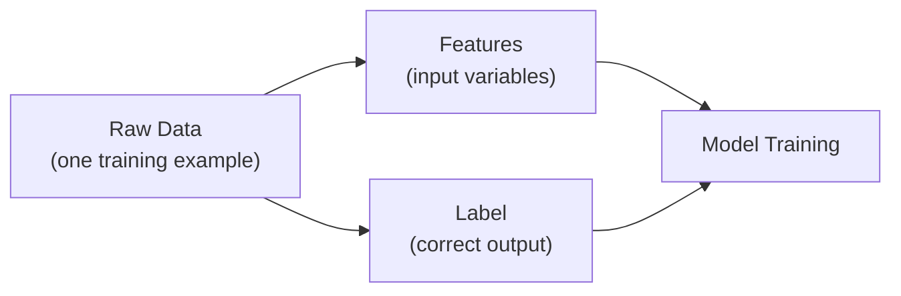
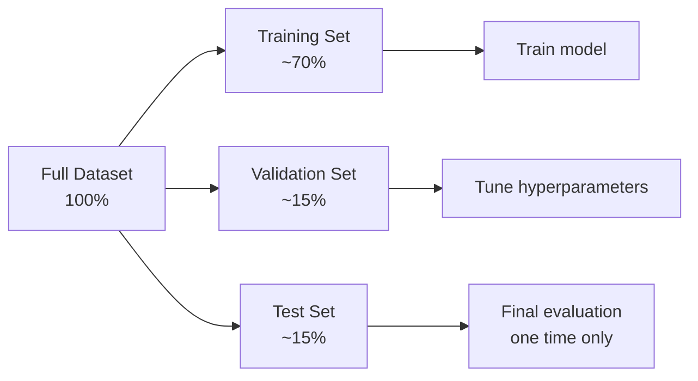
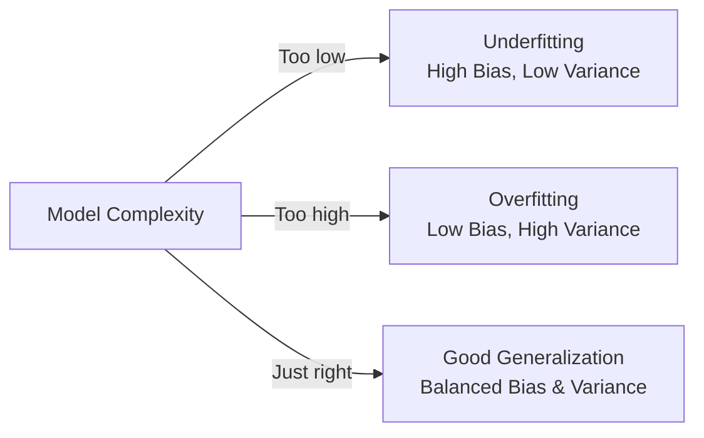

# 2. ML Terminology and Model Evaluation

## 2.1 Agenda

**Estimated reading time:** ~12 minutes

### Learning Outcomes

- Define and correctly use essential ML terminology in context
- Explain overfitting and underfitting with concrete *(cụ thể)* examples
- Interpret *(giải thích)* a confusion matrix and derive key metrics from it
- Distinguish *(phân biệt)* classification metrics from regression metrics

---

## 2.2 Glossary

| Term | Quick Explanation |
| :--- | :--- |
| **Training Data** | Tập dữ liệu huấn luyện — dùng để dạy model học pattern. |
| **Validation Data** | Tập dữ liệu kiểm thử trong quá trình phát triển — dùng để chọn hyperparameter *(siêu tham số)* tốt nhất. |
| **Test Data** | Tập dữ liệu kiểm tra cuối cùng — chỉ dùng một lần để đánh giá *(evaluate)* hiệu năng thực sự của model. |
| **Overfitting** | Học quá khớp — model "thuộc lòng" training data, mất khả năng tổng quát hóa *(generalize)* sang dữ liệu mới. |
| **Underfitting** | Học chưa đủ — model quá đơn giản *(simple)*, không nắm bắt được pattern thực sự trong dữ liệu. |
| **Bias** | Sai số hệ thống *(systematic error)* — model liên tục dự đoán sai theo cùng một hướng. |
| **Variance** | Phương sai — model nhạy cảm *(sensitive)* quá mức với nhiễu *(noise)* trong training data. |
| **Confusion Matrix** | Ma trận nhầm lẫn — bảng so sánh nhãn dự đoán *(predicted)* vs. nhãn thực *(actual)* cho bài toán classification. |
| **Precision** | Độ chính xác — trong số những gì model dự đoán là Positive, bao nhiêu % thực sự là Positive? |
| **Recall** | Độ nhạy — trong số tất cả Positive thực sự, model phát hiện được bao nhiêu %? |
| **F1-score** | Trung bình điều hòa *(harmonic mean)* của Precision và Recall — cân bằng cả hai. |
| **MAE** | Mean Absolute Error — trung bình sai số tuyệt đối *(absolute error)* trong regression. |
| **RMSE** | Root Mean Squared Error — tương tự MAE nhưng phạt nặng *(penalizes)* các sai số lớn hơn. |

---

## 3. Core Terminology

### 3.1 Features and Labels

**Example — House Price Prediction:**

| Area (m²) | Bedrooms | District | Age (years) | → **Price (VND)** |
| :--- | :--- | :--- | :--- | :--- |
| 80 | 3 | Quận 1 | 5 | → 5,200,000,000 |
| 120 | 4 | Bình Thạnh | 15 | → 4,800,000,000 |

- **Features:** Area, Bedrooms, District, Age — the input variables *(biến đầu vào)* the model uses
- **Label:** Price — the target output *(kết quả cần dự đoán)* the model learns to predict

### 3.2 Training, Validation, and Test Split

A dataset must be divided into three non-overlapping *(không chồng lấp)* subsets *(tập con)*:

| Split | Purpose | When Used |
| :--- | :--- | :--- |
| **Training** | Model learns patterns | During training |
| **Validation** | Tune hyperparameters *(siêu tham số)*, select best model version | Repeatedly during development |
| **Test** | Unbiased *(không thiên lệch)* final evaluation | Once, at the end |

> **Critical rule:** The test set must **never** be used during training or tuning. Using it multiple times introduces *data leakage* *(rò rỉ dữ liệu)* — an optimistic *(lạc quan quá mức)* bias in reported performance.

---

## 4. Overfitting and Underfitting

### 4.1 The Bias-Variance Trade-off

### 4.2 Overfitting *(Học quá khớp)*

**What happens:** The model memorizes *(học thuộc lòng)* training data — including its noise *(nhiễu)* and outliers *(ngoại lệ)* — instead of learning general patterns.

**Symptoms *(Dấu hiệu)*:**
- Training accuracy: very high (e.g., 99%)
- Validation/test accuracy: significantly lower (e.g., 72%)
- The gap between training and test performance is large

**Causes:**
- Model is too complex *(phức tạp)* for the amount of data (e.g., deep neural network on 100 samples)
- Training too long (too many epochs *(vòng lặp huấn luyện)*)
- No regularization *(chuẩn hóa)* applied

**Solutions:** More training data, regularization (Dropout, L1/L2), simpler model, early stopping *(dừng sớm)*.

### 4.3 Underfitting *(Học chưa đủ)*

**What happens:** The model is too simple *(đơn giản)* to capture *(nắm bắt)* the actual patterns in the data.

**Symptoms:**
- Training accuracy: low (e.g., 65%)
- Validation accuracy: also low and similar to training accuracy
- Model performs poorly everywhere *(ở khắp nơi)*

**Causes:**
- Model too simple (e.g., linear regression on a non-linear *(phi tuyến)* problem)
- Too few training epochs *(vòng lặp không đủ)*
- Important features missing

**Solutions:** More complex model, better feature engineering, longer training.

---

## 5. Model Evaluation: Classification

### 5.1 Confusion Matrix

For a binary *(nhị phân)* classification problem:

|  | **Predicted Positive** | **Predicted Negative** |
| :--- | :--- | :--- |
| **Actual Positive** | TP *(True Positive — đúng Dương)* | FN *(False Negative — bỏ sót)* |
| **Actual Negative** | FP *(False Positive — báo nhầm)* | TN *(True Negative — đúng Âm)* |

**Intuition for each cell:**
- **TP:** Model predicted spam, it IS spam → correct *(đúng)*
- **TN:** Model predicted not spam, it IS NOT spam → correct *(đúng)*
- **FP (Type I Error):** Model predicted spam, but it was a normal email → false alarm *(báo động giả)*
- **FN (Type II Error):** Model predicted not spam, but it WAS spam → missed *(bỏ sót)* — often the more dangerous error

### 5.2 Key Classification Metrics

| Metric | Formula (conceptual) | Meaning |
| :--- | :--- | :--- |
| **Accuracy** | (TP + TN) / All | % of all predictions that are correct |
| **Precision** | TP / (TP + FP) | Of everything flagged *(bị đánh dấu)* Positive, how many are truly *(thực sự)* Positive? |
| **Recall (Sensitivity)** | TP / (TP + FN) | Of all actual Positives, how many did the model catch *(phát hiện)*? |
| **F1-score** | Harmonic mean of Precision & Recall | Balanced metric when both FP and FN matter |

### 5.3 When to Prioritize Which Metric

| Scenario | Prioritize | Reason |
| :--- | :--- | :--- |
| Disease screening *(sàng lọc bệnh)* | **Recall** | Missing a sick patient (FN) is more dangerous than a false alarm (FP) |
| Spam filter | **Precision** | Filtering a legitimate *(hợp lệ)* email (FP) is worse than letting spam through |
| Fraud detection | **F1-score** | Both missing fraud (FN) and blocking good transactions (FP) are costly *(tốn kém)* |
| General classification | **Accuracy** | When classes are balanced *(cân bằng)* and no asymmetric *(bất đối xứng)* cost |

> **AI-900 note:** You need to understand the *conceptual meaning* of Precision, Recall, F1, and Accuracy — not the formulas. Know which metric to prioritize given a business scenario.

---

## 6. Model Evaluation: Regression

For regression tasks, error *(sai số)* metrics measure the distance between predicted *(dự đoán)* and actual *(thực tế)* values:

| Metric | What It Measures | Key Property |
| :--- | :--- | :--- |
| **MAE** *(Mean Absolute Error)* | Average absolute *(tuyệt đối)* distance between predictions and actual values | Easy to interpret *(dễ hiểu)*; treats all errors equally |
| **RMSE** *(Root Mean Squared Error)* | Square root of average squared errors | Penalizes *(phạt nặng)* large errors more than MAE |
| **R² (R-squared)** | How much of the variance *(phương sai)* in the output is explained *(giải thích)* by the model | 1.0 = perfect fit; 0.0 = no better than predicting the mean |

**Intuition:** If a house price model has MAE = 200,000,000 VND, on average *(trung bình)* each prediction is off by 200 million dong.

---

## 7. Discussion Questions

**Q1 — The Overfitting Trap:**
A data science team builds a fraud detection model that achieves 99.5% accuracy on the training set and 68% on the test set. The CEO is excited about the training accuracy. How do you explain to the CEO why this is a problem, and what specifically *(cụ thể)* is happening inside the model?

**Q2 — Metric Selection:**
A hospital deploys a COVID-19 screening *(sàng lọc)* tool that classifies patients as "likely infected" or "unlikely infected." False Negatives (infected patients sent home) and False Positives (healthy patients quarantined *(cách ly)*) have very different costs. Which metric should the team optimize, and what is the ethical *(đạo đức)* implication *(hệ quả)* of choosing wrong?

**Q3 — Data Leakage:**
A team builds a loan default *(vỡ nợ)* prediction model and reports 95% accuracy. During review, you discover the training data includes a column called `"account_closed_after_default"` — a field filled in *after* the default event occurred. Why is this a critical error, and how would you detect it in a real project?

---

*Made by Anh Tu - Share to be share*
