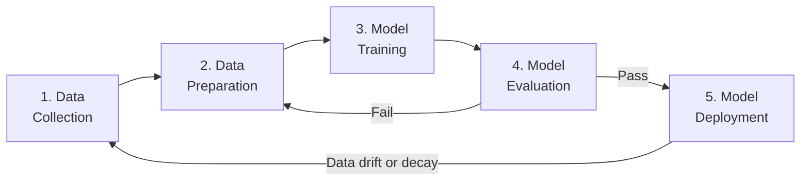
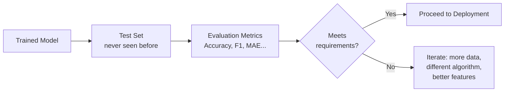

# 3. The Machine Learning Lifecycle

## 3.1 Agenda

**Estimated reading time:** ~10 minutes

### Learning Outcomes

- Describe the five phases of the ML lifecycle and the purpose of each
- Explain why ML is an iterative *(lặp đi lặp lại)* process, not a linear *(tuyến tính)* one
- Identify common failure points *(điểm thất bại)* in each phase
- Connect each lifecycle phase to relevant *(liên quan)* Azure ML capabilities

---

## 3.2 Glossary

| Term | Quick Explanation |
| :--- | :--- |
| **Data Pipeline** | Luồng xử lý dữ liệu tự động *(automated)* — thu thập, làm sạch và chuyển đổi dữ liệu liên tục. |
| **ETL** | Extract, Transform, Load — quy trình chuẩn để di chuyển và biến đổi *(transform)* dữ liệu. |
| **Feature Engineering** | Quá trình biến đổi dữ liệu thô *(raw)* thành các đặc trưng *(features)* có giá trị thông tin cao. |
| **Hyperparameter** | Siêu tham số — cài đặt *(setting)* của thuật toán được chọn trước khi training (ví dụ: learning rate, số lớp mạng). Khác với parameter *(tham số)* — được học trong training. |
| **Endpoint** | Điểm cuối — URL của REST API dùng để gọi model đã được triển khai *(deployed)*. |
| **Data Drift** | Hiện tượng dữ liệu thực tế *(production data)* dần khác biệt so với training data theo thời gian — khiến model suy giảm hiệu năng. |
| **Model Registry** | Kho lưu trữ *(repository)* các phiên bản *(versions)* model với metadata đầy đủ — dùng để quản lý và rollback *(quay lại phiên bản cũ)*. |

---

## 3. The Five-Phase ML Lifecycle

The lifecycle is **iterative** *(lặp đi lặp lại)* — not a one-way pipeline. When a deployed model degrades *(suy giảm)*, the team loops back to earlier phases.

---

## 4. Phase 1: Data Collection

**Goal:** Gather sufficient *(đủ)*, relevant *(liên quan)*, and representative *(mang tính đại diện)* data for the business problem.

### 4.1 Common Data Sources

| Source | Examples |
| :--- | :--- |
| Transactional databases *(cơ sở dữ liệu giao dịch)* | CRM records, e-commerce orders, banking transactions |
| APIs and web data | Social media feeds, weather APIs, financial market data |
| IoT sensors *(cảm biến)* | Temperature, vibration, pressure from industrial machines |
| Human-labeled datasets | Annotated *(được gán nhãn)* images, transcribed *(được phiên âm)* audio |
| Azure examples | Azure SQL Database, Azure Data Lake Storage, Azure Blob Storage |

### 4.2 Data Quality Dimensions

| Dimension *(chiều)* | What It Means | Problem When Missing |
| :--- | :--- | :--- |
| **Completeness** *(Đầy đủ)* | No critical missing values *(giá trị bị thiếu)* | Biased *(thiên lệch)* or broken model |
| **Accuracy** *(Chính xác)* | Data reflects reality *(thực tế)* | Model learns wrong patterns |
| **Relevance** *(Liên quan)* | Data relates to the problem being solved | Noise overwhelms *(lấn át)* signal |
| **Volume** *(Khối lượng)* | Sufficient samples for the model to generalize *(tổng quát hóa)* | Overfitting on small samples |
| **Freshness** *(Tươi mới)* | Data is current *(cập nhật)* enough to reflect today's patterns | Data drift from the start |

> **Key principle:** Garbage in, garbage out *(Rác vào, rác ra)*. Even the best algorithm fails on poor-quality data.

---

## 5. Phase 2: Data Preparation

**Goal:** Transform raw *(thô)* data into a clean, structured, feature-rich *(giàu đặc trưng)* format suitable for training.

### 5.1 Common Preparation Tasks

| Task | What It Addresses |
| :--- | :--- |
| **Handling missing values** | Fill with mean/median *(điền bằng giá trị trung bình/trung vị)*, drop rows, or flag as unknown |
| **Removing duplicates** *(Xóa bản sao)* | Prevent model from counting the same sample twice |
| **Normalization / Scaling** | Bring numeric features to comparable *(có thể so sánh được)* ranges — e.g., age (0-100) vs. income (0-10,000,000) |
| **Encoding categorical variables** | Convert text categories *(danh mục text)* to numbers — e.g., ["cat", "dog"] → [0, 1] |
| **Feature engineering** | Create new informative *(có giá trị thông tin)* features from raw data — e.g., from timestamp: extract day_of_week, is_weekend |
| **Train/validation/test split** | Divide dataset so model performance can be measured fairly *(công bằng)* |
| **Handling outliers** *(Xử lý ngoại lệ)* | Remove or cap extreme values that could distort *(làm méo)* training |

### 5.2 The 80/20 Rule of ML Projects

> In practice, data scientists spend ~80% of their time on data collection and preparation, and only ~20% on model training. **The bottleneck *(điểm nghẽn)* is almost always the data, not the algorithm.**

---

## 6. Phase 3: Model Training

**Goal:** Use an algorithm to learn patterns from the prepared training data.

### 6.1 Key Concepts

| Concept | Explanation |
| :--- | :--- |
| **Algorithm selection** | Choose based on problem type (classification → logistic regression, random forest; regression → linear regression, gradient boosting) |
| **Hyperparameter tuning** *(Tinh chỉnh siêu tham số)* | Adjust settings like learning rate *(tốc độ học)*, tree depth *(độ sâu cây)*, regularization strength |
| **Compute resources** | CPU for simple models; GPU clusters *(cụm GPU)* for deep learning |
| **Experiment tracking** *(Theo dõi thí nghiệm)* | Log *(ghi lại)* each run's configuration, metrics, and artifacts *(kết quả)* for reproducibility *(khả năng tái hiện)* |

### 6.2 For AI-900: What You Need to Know

> You do not need to implement algorithms or understand their mathematical *(toán học)* details. For AI-900, understand: *"What is the role of an algorithm? It learns patterns from training data to make predictions on new data."*

---

## 7. Phase 4: Model Evaluation

**Goal:** Measure whether the model generalizes *(tổng quát hóa)* well to unseen data before deploying it.

### 7.1 Evaluation Process

### 7.2 Common Failure Modes in Evaluation

| Failure | Description | Consequence *(Hậu quả)* |
| :--- | :--- | :--- |
| **Data leakage** *(Rò rỉ dữ liệu)* | Test data "seen" during training or feature engineering | Over-optimistic *(lạc quan quá mức)* reported accuracy |
| **Wrong metric** | Using accuracy on an imbalanced *(mất cân bằng)* dataset (e.g., 99% negatives) | Model predicts "always negative" and looks great |
| **Distribution shift** *(Dịch chuyển phân phối)* | Test data comes from a different time period or region than training | Misleading *(gây hiểu nhầm)* good performance; fails in production |

---

## 8. Phase 5: Model Deployment

**Goal:** Make the trained model accessible *(có thể truy cập)* to applications and end users in a scalable *(có thể mở rộng)*, secure, and reliable *(đáng tin cậy)* manner.

### 8.1 Deployment Options

| Option | Description | When to Use |
| :--- | :--- | :--- |
| **Real-time endpoint** *(Điểm cuối thời gian thực)* | REST API that responds to individual requests in milliseconds | Online fraud detection, chatbots |
| **Batch inference** *(Suy diễn hàng loạt)* | Process large volumes of data on a schedule | Nightly report generation, bulk scoring *(chấm điểm hàng loạt)* |
| **Edge deployment** *(Triển khai tại biên)* | Model runs on device (phone, IoT sensor) without internet | Manufacturing defect detection offline |

### 8.2 Post-Deployment Monitoring

Deployment is not the end of the lifecycle. Critical concerns after deployment:

| Concern | What Happens | Response |
| :--- | :--- | :--- |
| **Data drift** *(Trôi dạt dữ liệu)* | Input data distribution changes over time | Retrain *(huấn luyện lại)* model on fresh data |
| **Concept drift** *(Trôi dạt khái niệm)* | The relationship between features and labels changes | Redesign *(thiết kế lại)* features or model |
| **Performance degradation** *(Suy giảm hiệu năng)* | Accuracy drops below acceptable threshold *(ngưỡng)* | Trigger *(kích hoạt)* retraining pipeline |
| **Security & compliance** | Model exposed to adversarial *(đối nghịch)* inputs or PII | Monitor and audit *(kiểm toán)* API calls |

---

## 9. Discussion Questions

**Q1 — The Lifecycle in Practice:**
A retail company builds a demand forecasting *(dự báo nhu cầu)* model trained on 3 years of sales data. Six months after deployment, predictions become increasingly inaccurate *(không chính xác)*. Walk through each lifecycle phase and identify where the problem likely originates *(bắt nguồn)* and what corrective *(sửa chữa)* action should be taken.

**Q2 — Data Preparation Trade-off:**
Your dataset has 100,000 rows, of which 8,000 have missing values in the "customer_age" column. Option A: drop all 8,000 rows. Option B: fill with the mean age. Option C: add a binary *(nhị phân)* flag `age_is_missing = 1/0` and fill with the mean. What are the implications *(hệ quả)* of each approach for model quality, and which would you recommend for a credit risk *(rủi ro tín dụng)* model?

**Q3 — Deployment Decision:**
A hospital wants to deploy a sepsis *(nhiễm khuẩn huyết)* prediction model that will alert *(cảnh báo)* doctors in real-time when a patient's vital signs *(dấu hiệu sinh tồn)* suggest early sepsis. Compare real-time endpoint vs. batch inference for this use case: what are the technical and clinical *(lâm sàng)* implications of each choice?

---

*Made by Anh Tu - Share to be share*
