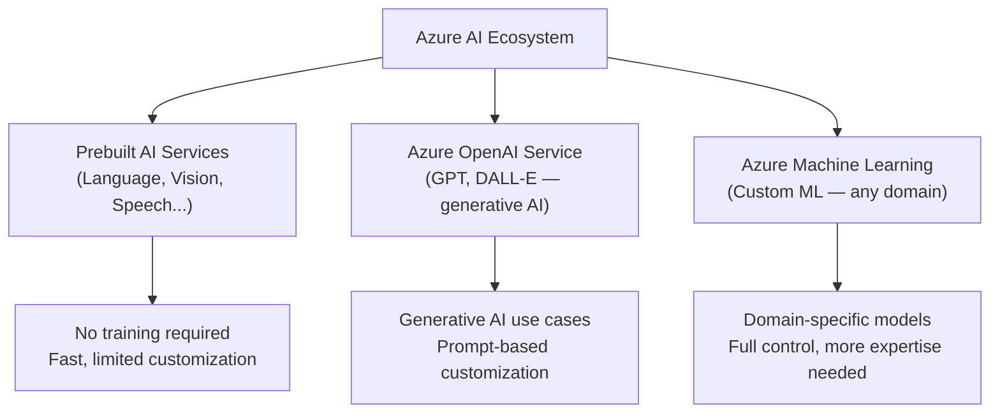
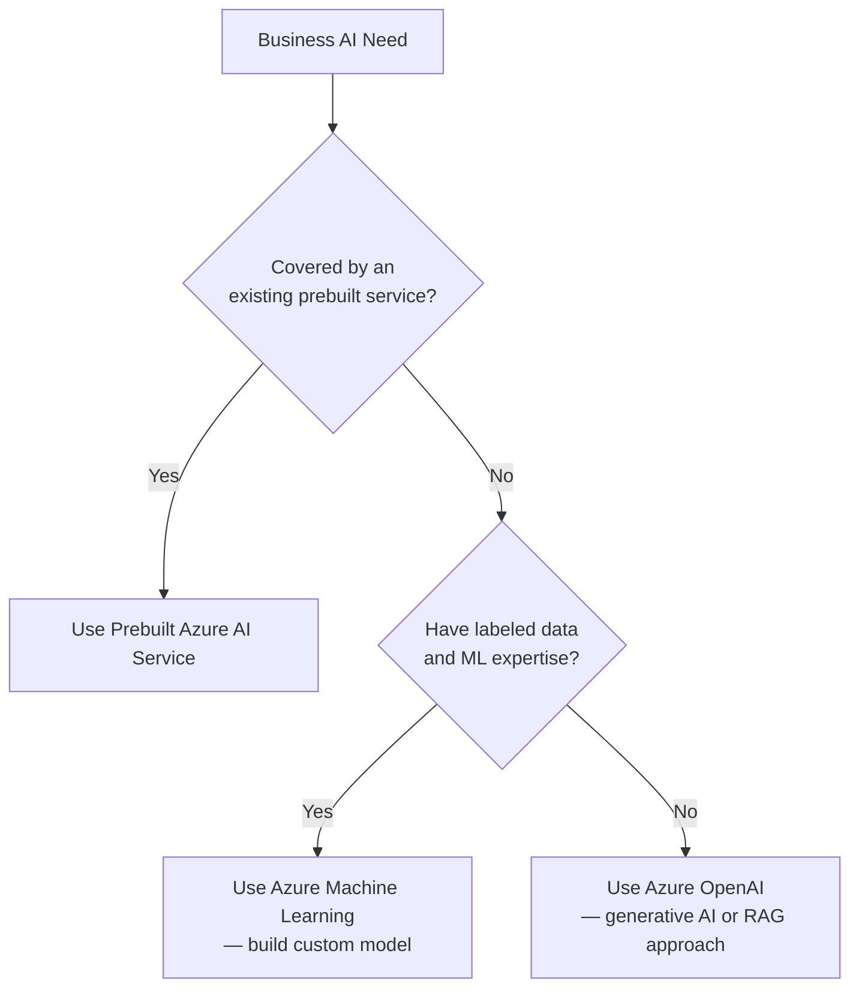

# 1. Azure Machine Learning Overview

## 1.1 Agenda

**Estimated reading time:** ~10 minutes

### Learning Outcomes

- Define Azure Machine Learning and its role within the Azure AI ecosystem
- Describe the key components of the Azure ML workspace
- Distinguish *(phân biệt)* Azure ML from Azure AI prebuilt services
- Identify when to use Azure ML over prebuilt AI services

---

## 1.2 Glossary

| Term | Quick Explanation |
| :--- | :--- |
| **Azure Machine Learning (Azure ML)** | Dịch vụ đám mây được quản lý *(managed cloud service)* của Microsoft để xây dựng, huấn luyện *(train)*, triển khai *(deploy)* và giám sát *(monitor)* các model ML tùy chỉnh. |
| **Workspace** *(Không gian làm việc)* | Đơn vị tổ chức *(organizational unit)* cấp cao nhất trong Azure ML — chứa mọi thứ: dữ liệu, thí nghiệm *(experiments)*, model, và endpoints. |
| **Compute** *(Tài nguyên tính toán)* | Hạ tầng tính toán *(computing infrastructure)* — CPU/GPU cluster — dùng để chạy training và inference. |
| **Pipeline** | Luồng công việc tự động *(automated workflow)* kết nối các bước ML (data prep → train → evaluate) thành một chuỗi tái sử dụng *(reusable)*. |
| **MLOps** | Machine Learning Operations — thực hành *(practices)* tích hợp DevOps vào ML để tự động hóa *(automate)*, giám sát và quản lý vòng đời model trong production. |
| **Model Registry** *(Kho model)* | Nơi lưu trữ và quản lý phiên bản *(version)* các model đã được huấn luyện, kèm metadata và metrics. |
| **Inference** *(Suy diễn)* | Quá trình model đã được triển khai *(deployed)* áp dụng kiến thức đã học để đưa ra dự đoán trên dữ liệu mới. |

---

## 2. Problem Statement

Building custom ML models from scratch presents *(đặt ra)* several enterprise-level *(cấp doanh nghiệp)* challenges:

1. **Infrastructure complexity** — Provisioning *(cấp phát)* GPUs, managing distributed training *(huấn luyện phân tán)*, and scaling clusters require deep infrastructure expertise.
2. **Reproducibility** *(Khả năng tái hiện)* — Without tracking, experiments are hard to reproduce *(tái tạo)* or audit *(kiểm toán)*.
3. **Collaboration** — Data scientists, ML engineers, and ops teams work with different tools, leading to silos *(sự cô lập)*.
4. **Governance** *(Quản trị)* — Production ML requires versioning, monitoring, and compliance *(tuân thủ)* — all operationally expensive *(tốn kém)* to build manually.

Azure Machine Learning addresses all four by providing a **unified *(thống nhất)*, managed platform** for the entire ML lifecycle.

---

## 3. What is Azure Machine Learning?

### 3.1 Definition

> **Azure Machine Learning** is a managed cloud service that provides the infrastructure *(hạ tầng)*, tools, and workflows for teams to build, train, evaluate, deploy, and monitor custom Machine Learning models at scale *(ở quy mô lớn)*.

### 3.2 Position in the Azure AI Ecosystem

### 3.3 Azure ML Workspace — Key Components

The **workspace** *(không gian làm việc)* is the root resource *(tài nguyên gốc)* that contains everything:

| Component | Description |
| :--- | :--- |
| **Data assets** *(Tài sản dữ liệu)* | Registered datasets with versioning and lineage *(dõi dấu vết)* tracking |
| **Compute targets** | CPU/GPU clusters for training; inference clusters for deployment |
| **Experiments & runs** *(Thí nghiệm và lần chạy)* | Tracked training runs with metrics, logs, and artifacts *(kết quả)* |
| **Model registry** | Versioned *(có phiên bản)* catalog of trained models with metadata |
| **Endpoints** | REST API endpoints *(điểm cuối API)* for real-time or batch inference |
| **Pipelines** | Reusable, automated *(tự động hóa)* ML workflow definitions |
| **Environments** *(Môi trường)* | Containerized *(đóng gói)* dependency configurations for reproducibility |

---

## 4. Azure ML vs. Prebuilt AI Services

This is the most critical distinction *(sự phân biệt quan trọng nhất)* for AI-900:

| Dimension | Prebuilt AI Services | Azure Machine Learning |
| :--- | :--- | :--- |
| **What you get** | Ready-to-call API for common tasks | Platform to build *your own* models |
| **Training required** | No — model already trained *(đã huấn luyện sẵn)* | Yes — you train on your own data |
| **Customization** | Limited (fine-tuning only for some services) | Full control over algorithm, features, architecture |
| **Data needed** | None (for standard features) | Your own labeled dataset |
| **Expertise required** | Minimal ML knowledge | Data science skills needed |
| **Time to implement** | Hours to days | Weeks to months |
| **Best for** | Common tasks: sentiment, OCR, translation | Domain-specific *(chuyên biệt)* problems not covered by prebuilt services |

### 4.1 Decision Rule

---

## 5. Benefits of Azure Machine Learning

| Benefit | Detail |
| :--- | :--- |
| **Scalability** *(Mở rộng)* | Automatically provision *(cấp phát)* and release GPU clusters — no idle *(nhàn rỗi)* infrastructure costs |
| **Experiment tracking** | Log metrics, parameters, and model artifacts automatically across every training run |
| **Collaboration** | Shared workspace for teams — data scientists, ML engineers, and stakeholders *(các bên liên quan)* |
| **Responsible AI** | Built-in Fairness, Explainability *(khả năng giải thích)*, and Error Analysis dashboards |
| **Security & Compliance** | RBAC *(Role-Based Access Control)*, private networking *(mạng riêng tư)*, audit logs, GDPR/HIPAA support |
| **MLOps** | CI/CD *(Continuous Integration/Deployment)* pipelines for automated model retraining and promotion *(thăng hạng model)* |

---

## 6. Discussion Questions

**Q1 — The Right Tool:**
A logistics company wants to predict package delivery times using 5 years of historical shipping data (origin, destination, package weight, carrier, weather). The data has 12 million records with a custom feature set unique to their network. Should they use Azure AI Language, Azure ML, or Azure OpenAI Service? Justify with specific *(cụ thể)* reasons.

**Q2 — MLOps Necessity:**
A bank deploys a credit scoring model using Azure ML. The model was accurate when deployed in January. By August, the model's predictions diverge *(sai lệch)* noticeably from actual outcomes, but no one detects *(phát hiện)* this until customers complain *(phàn nàn)*. What MLOps practices should have been in place? What specific Azure ML features address each practice?

**Q3 — Cost vs. Control:**
A startup is choosing between Azure AI Language (prebuilt sentiment API at $1/1000 calls) and Azure ML (custom sentiment model requiring 2 months of development + GPU training costs). The startup processes 500,000 reviews per month, but their reviews are highly domain-specific *(chuyên biệt)* — technical jargon *(thuật ngữ chuyên ngành)* the prebuilt model misclassifies 25% of the time. How would you frame *(đặt vấn đề)* the build-vs-buy analysis?

---

*Made by Anh Tu - Share to be share*
