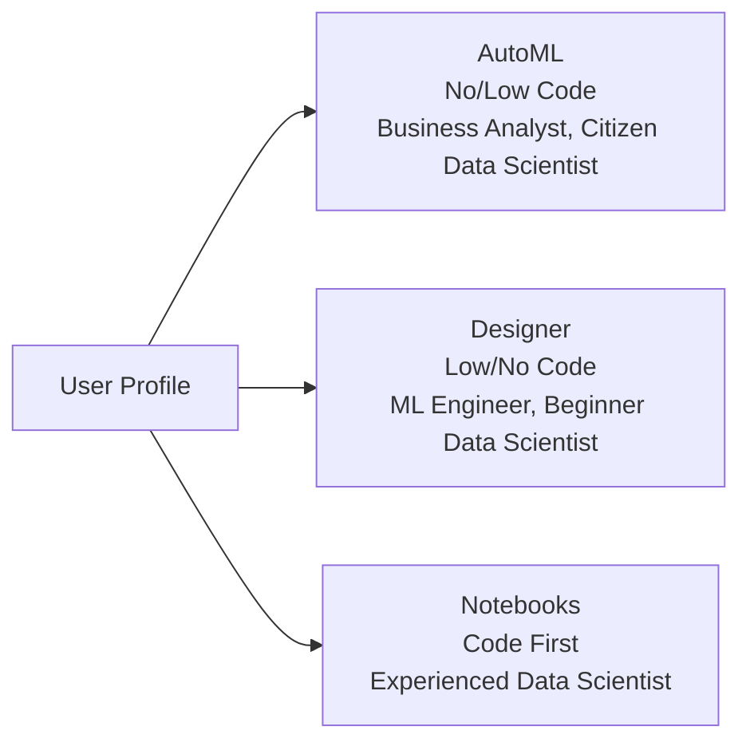
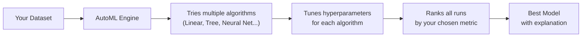
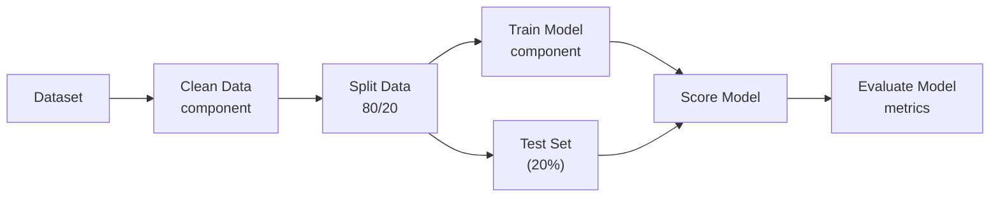

# 2. Azure ML Development Tools and Responsible AI

## 2.1 Agenda

**Estimated reading time:** ~12 minutes

### Learning Outcomes

- Describe the three development approaches in Azure ML and when to use each
- Explain what AutoML does and what it does not do
- Identify the Responsible AI capabilities built into Azure ML
- Understand the basics of model deployment and monitoring in Azure ML

---

## 2.2 Glossary

| Term | Quick Explanation |
| :--- | :--- |
| **AutoML** | Automated Machine Learning — tự động chọn thuật toán *(algorithm)* và tinh chỉnh hyperparameter *(siêu tham số)* thay cho data scientist. |
| **Designer** | Giao diện kéo-thả *(drag-and-drop)* trong Azure ML Studio để xây dựng pipeline ML không cần viết code. |
| **Jupyter Notebook** | Môi trường phát triển tương tác *(interactive)* — kết hợp code, kết quả và văn bản trong cùng một tài liệu. |
| **Explainability** *(Khả năng giải thích)* | Khả năng giải thích *tại sao* model đưa ra một dự đoán cụ thể — quan trọng cho regulated industries *(lĩnh vực bị quy định)*. |
| **Feature Importance** *(Mức độ quan trọng của đặc trưng)* | Điểm đánh giá *(score)* cho mỗi feature — cho biết feature nào đóng góp nhiều nhất vào dự đoán của model. |
| **Fairness** *(Công bằng)* | Đảm bảo model không phân biệt đối xử *(discriminate)* bất công dựa trên các thuộc tính nhạy cảm *(sensitive attributes)* như giới tính, sắc tộc, tuổi. |
| **Endpoint** | Điểm cuối API *(REST API)* — giao diện để gọi model đã triển khai từ ứng dụng bên ngoài. |
| **Real-time Inference** *(Suy diễn thời gian thực)* | Model trả lời từng request ngay lập tức — phù hợp với ứng dụng cần phản hồi nhanh *(low latency)*. |
| **Batch Inference** *(Suy diễn hàng loạt)* | Model xử lý nhiều inputs cùng lúc theo lịch trình *(scheduled)* — phù hợp cho khối lượng lớn không cần realtime. |

---

## 3. Three Development Approaches in Azure ML

Azure ML offers three approaches to building models, each targeting *(hướng đến)* a different user profile *(hồ sơ người dùng)*:

---

## 4. Approach 1: Automated Machine Learning (AutoML)

### 4.1 What AutoML Does

> **AutoML** automates the most time-consuming *(tốn nhiều thời gian nhất)* parts of the ML workflow — algorithm selection and hyperparameter tuning *(tinh chỉnh)* — by running multiple experiments and ranking *(xếp hạng)* models by performance.

### 4.2 What AutoML Provides

| Output | Description |
| :--- | :--- |
| **Best model** | The algorithm and configuration *(cấu hình)* that performed best on your metric |
| **Model explanations** | Feature importance *(mức độ quan trọng)* chart showing which features drove predictions |
| **Fairness assessment** | Checks for prediction disparities *(chênh lệch)* across demographic *(nhân khẩu học)* groups |
| **All run history** | Full experiment log *(nhật ký)* — every algorithm tried, every metric achieved |

### 4.3 When to Use AutoML

| Use AutoML when... | Avoid AutoML when... |
| :--- | :--- |
| You need a baseline model quickly *(nhanh)* | You need a highly optimized *(tối ưu cao)* custom architecture |
| ML expertise *(chuyên môn)* on the team is limited | The problem requires novel *(mới lạ)* feature engineering beyond the dataset |
| Rapid prototyping *(tạo mẫu nhanh)* before committing to a model | Interpretability *(khả năng giải thích)* of every decision step is mandatory |
| Standard task types: classification, regression, forecasting *(dự báo)* | Research-grade *(cấp nghiên cứu)* model development |

### 4.4 Supported Task Types

- Classification *(Phân loại)*
- Regression *(Hồi quy)*
- Time-series Forecasting *(Dự báo chuỗi thời gian)*
- Natural Language Processing (Text classification, NER — via BERT-based *(dựa trên BERT)* models)
- Computer Vision (image classification, object detection — via deep learning)

---

## 5. Approach 2: Azure ML Designer

### 5.1 What Designer Is

> **Azure ML Designer** is a visual, drag-and-drop interface for building ML pipelines without writing code. Components *(thành phần)* represent data operations, algorithms, and evaluation steps — connected by a visual canvas *(vùng vẽ)*.

### 5.2 Designer Canvas Architecture

### 5.3 When to Use Designer

| Use Designer when... | Avoid Designer when... |
| :--- | :--- |
| Building standard ML workflows *(luồng công việc)* without coding | You need custom *(tùy chỉnh)* algorithms not available as components |
| Rapid visual prototyping with stakeholders *(các bên liên quan)* | Complex feature engineering requiring custom code |
| Training and teaching ML workflows | High-performance requirements needing code-level *(cấp độ code)* optimization |
| Beginners learning ML pipeline structure | Production pipelines that need version control *(kiểm soát phiên bản)* and CI/CD |

---

## 6. Approach 3: Notebooks (Code-First)

### 6.1 What Notebooks Provide

> **Notebooks** in Azure ML are managed Jupyter environments connected to Azure ML compute, with direct access to the workspace SDK *(Software Development Kit)* for full programmatic *(lập trình đầy đủ)* control.

**Capabilities:**
- Full Python/R support with any library (scikit-learn, TensorFlow, PyTorch, XGBoost...)
- Direct access to registered datasets, experiments, and model registry via the Azure ML SDK
- GPU compute available for deep learning training
- Git integration *(tích hợp Git)* for version control

### 6.2 When to Use Notebooks

| Use Notebooks when... | Avoid Notebooks when... |
| :--- | :--- |
| Custom algorithms or complex feature engineering | Team has no coding experience |
| Deep learning models (CNN, Transformer, LLM fine-tuning *(tinh chỉnh LLM)*) | Standard task covered by AutoML or Designer |
| Research-grade experiments requiring fine control | Quick prototype where low-code is sufficient *(đủ)* |
| Full MLOps pipeline as code *(pipeline dưới dạng code)* | |

---

## 7. Responsible AI in Azure ML

Responsible AI *(AI có trách nhiệm)* is embedded *(được tích hợp sẵn)* across all three development approaches. Azure ML provides:

### 7.1 Responsible AI Dashboard

A unified *(thống nhất)* dashboard covering:

| Tool | What It Shows |
| :--- | :--- |
| **Model Explainability** | Which features most influence *(ảnh hưởng)* predictions — globally and per-instance *(từng cá thể)* |
| **Fairness Analysis** | Prediction disparities *(sự chênh lệch)* across sensitive groups (gender, age, location) |
| **Error Analysis** | Where the model fails — which data cohorts *(nhóm dữ liệu)* have the highest error rate |
| **Counterfactual Analysis** | "What would need to change for a different prediction?" — critical *(quan trọng)* for explainability in regulated contexts |
| **Data Analysis** | Distribution *(phân phối)* checks comparing training vs. test data |

### 7.2 Responsible AI in the ML Lifecycle

| Lifecycle Phase | Responsible AI Action |
| :--- | :--- |
| **Data Collection** | Check for representation *(đại diện)* bias across demographic groups |
| **Data Preparation** | Detect and mitigate *(giảm thiểu)* class imbalance *(mất cân bằng lớp)* |
| **Model Training** | Apply fairness constraints *(ràng buộc)* if needed |
| **Model Evaluation** | Run Error Analysis to find systematic failures |
| **Deployment** | Set content filters and access policies |
| **Monitoring** | Continuously monitor for fairness degradation *(suy giảm)* over time |

---

## 8. Model Deployment and Monitoring in Azure ML

### 8.1 Deployment Options

| Type | Use Case | Latency *(Độ trễ)* |
| :--- | :--- | :--- |
| **Managed Online Endpoint** *(Điểm cuối trực tuyến)* | Real-time predictions — e.g., fraud detection | Milliseconds |
| **Batch Endpoint** *(Điểm cuối hàng loạt)* | Process large datasets on schedule — e.g., nightly *(hằng đêm)* scoring | Minutes to hours |
| **Kubernetes Endpoint** | Production at very large scale *(quy mô rất lớn)*, hybrid *(kết hợp)* cloud/on-prem | Configurable *(có thể cấu hình)* |

### 8.2 Post-Deployment Monitoring

Azure ML integrates with **Application Insights** and native monitoring to track:

- **Data drift** *(Trôi dạt dữ liệu)*: Input distribution changes detected by comparing production data to training data
- **Prediction drift** *(Trôi dạt dự đoán)*: Output distribution changes without obvious *(rõ ràng)* input drift
- **Model performance metrics**: Accuracy, latency, and error rates in production
- **Alerts** *(Cảnh báo)*: Trigger retraining pipelines when metrics fall below defined thresholds *(ngưỡng)*

---

## 9. Discussion Questions

**Q1 — AutoML Limitations:**
A team celebrates *(ăn mừng)* because AutoML found a model with 94% accuracy on their customer churn *(rời bỏ)* prediction task with no ML expertise required. The Responsible AI dashboard shows the model has a fairness issue: it predicts "will churn" at twice the rate *(tốc độ)* for customers in rural *(nông thôn)* areas vs. urban *(đô thị)* areas — even when other factors are controlled. Is 94% accuracy still a success? What should the team do?

**Q2 — Explainability Requirement:**
A bank must justify *(biện minh)* every loan rejection to regulators *(cơ quan quản lý)*, citing *(trích dẫn)* specific reasons. A Gradient Boosting model trained in Azure ML achieves 90% accuracy. What Azure ML Responsible AI tool would help provide per-loan *(từng khoản vay)* explanations, and what is the distinction between *global* *(toàn cục)* and *local* *(cục bộ)* explainability in this context?

**Q3 — Choosing the Development Approach:**
Your team has three members: a business analyst with no coding skills, a data scientist with 3 years of Python experience, and an ML engineer focused on CI/CD. They need to: (1) quickly prototype a classification model this week, (2) productionize *(đưa lên production)* it with automated retraining next month, and (3) present *(trình bày)* results to executives *(ban lãnh đạo)* who need to understand the model logic. Map each need to the appropriate *(phù hợp)* Azure ML development approach and justify *(lý giải)*.

---

*Made by Anh Tu - Share to be share*
