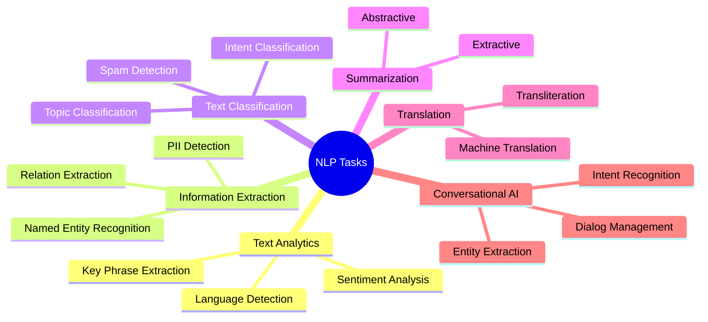
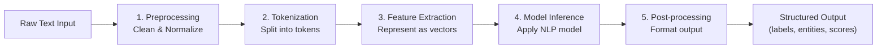

# 1. NLP Concepts and Pipeline

## 1.1 Agenda

**Estimated reading time:** ~11 minutes

### Learning Outcomes

- Define Natural Language Processing and articulate *(diễn đạt chính xác)* why it is a distinct *(riêng biệt)* challenge for machines
- Identify the six core NLP tasks and give a concrete example for each
- Describe the stages of an NLP pipeline and the purpose of each stage
- Recognize the responsible AI considerations unique *(đặc thù)* to NLP systems

---

## 1.2 Glossary

| Term | Quick Explanation |
| :--- | :--- |
| **Token** | Đơn vị nhỏ nhất mà NLP xử lý — thường là một từ hoặc một phần của từ *(subword)*. "Machine learning" → ["Machine", "learning"] |
| **Tokenization** | Quá trình chia văn bản thành các token để model xử lý. |
| **Stop Words** | Từ phổ biến *(common words)* có ít giá trị phân biệt *(discriminative value)* — như "the", "is", "a" — thường bị lọc bỏ trong preprocessing. |
| **Embedding** | Biểu diễn *(representation)* của từ dưới dạng vector số nhiều chiều — từ tương nghĩa *(semantically similar)* có vector gần nhau. |
| **Intent** *(Ý định)* | Mục đích đằng sau một câu nói của người dùng. "Book a flight to Hanoi" → intent: `book_flight`. |
| **Entity** *(Thực thể)* | Thông tin cụ thể được trích xuất từ text. "Book a flight to **Hanoi** on **Friday**" → entities: `location=Hanoi`, `date=Friday`. |
| **Corpus** *(Kho ngữ liệu)* | Tập hợp lớn văn bản được dùng để huấn luyện *(train)* hoặc đánh giá *(evaluate)* mô hình NLP. |
| **Transformer** | Kiến trúc *(architecture)* deep learning dùng cơ chế attention *(chú ý)* — nền tảng của GPT, BERT, và hầu hết LLM hiện đại. |

---

## 2. Problem Statement

Human language is ambiguous *(mơ hồ)*, contextual *(phụ thuộc ngữ cảnh)*, and constantly evolving *(liên tục thay đổi)*. These properties make it fundamentally *(về bản chất)* difficult for machines:

1. **Ambiguity:** "Bank" can mean a financial institution *(tổ chức tài chính)* or a river bank. Context determines *(xác định)* meaning.
2. **Implicit context:** "It was too hot to eat" — what was too hot? The food or the weather? Humans infer *(suy luận)* automatically; machines struggle *(gặp khó khăn)*.
3. **Synonymy and paraphrase** *(Đồng nghĩa và diễn đạt khác)*: "The CEO resigned" and "The top executive stepped down" convey *(truyền đạt)* the same meaning with no shared keywords.
4. **Cultural and domain variation:** Medical jargon *(biệt ngữ y tế)*, slang *(tiếng lóng)*, and regional dialects *(phương ngữ)* create enormous vocabulary variation.

NLP uses ML and deep learning to address these challenges — not by encoding rules, but by learning patterns from massive text corpora *(kho ngữ liệu khổng lồ)*.

---

## 3. What is Natural Language Processing?

### 3.1 Definition

> **Natural Language Processing (NLP)** is a subfield of AI that focuses on enabling machines to *understand*, *interpret* *(diễn giải)*, and *generate* human language — in both written and spoken form — with sufficient *(đủ)* accuracy to be useful in real-world applications.

### 3.2 Definition Anatomy

- **"Understand"** — Extract the *meaning* from text, not just the literal *(nghĩa đen)* words. This includes intent, sentiment, and implied *(ẩn ý)* context.
- **"Interpret"** — Map unstructured *(phi cấu trúc)* language to structured *(có cấu trúc)* data usable by software (e.g., intent + entities for a booking system).
- **"Generate"** — Produce coherent *(mạch lạc)*, contextually appropriate *(phù hợp ngữ cảnh)* language as output — the defining capability of LLMs.
- **"Both written and spoken"** — NLP spans text and speech; Azure AI Speech handles the audio-to-text conversion *(chuyển đổi)* before NLP models process it.

---

## 4. Core NLP Tasks

### 4.1 Overview



### 4.2 Core Tasks Explained

| Task | What It Extracts | Example |
| :--- | :--- | :--- |
| **Sentiment Analysis** | Emotional tone *(cảm xúc)* of text | Review: "Terrible service, never again." → Negative (0.03 Positive) |
| **Aspect-based Sentiment** *(Cảm xúc theo khía cạnh)* | Sentiment for specific *(cụ thể)* aspects of an entity | "Great camera but terrible battery life" → camera: Positive, battery: Negative |
| **Key Phrase Extraction** | Most informative *(có giá trị thông tin nhất)* concepts | Article → ["supply chain disruption", "Q3 earnings", "margin pressure"] |
| **Language Detection** | Language of input text | "Xin chào" → Vietnamese (vi), confidence: 0.99 |
| **Named Entity Recognition (NER)** | Structured entities *(thực thể có cấu trúc)* | "Elon Musk launched SpaceX in 2002" → PERSON: Elon Musk, ORG: SpaceX, DATE: 2002 |
| **Relation Extraction** *(Trích xuất quan hệ)* | Semantic relationships *(quan hệ ngữ nghĩa)* between entities | "Elon Musk founded SpaceX" → (Elon Musk) **[FOUNDED]** (SpaceX) |
| **PII Detection** | Personally Identifiable Information *(dữ liệu nhận dạng cá nhân)* | "Call me at 0912-345-678" → PHONE: [REDACTED] |
| **Text Classification** | Predefined *(định sẵn)* labels for text | Support ticket → Category: "billing", Priority: "urgent" |
| **Summarization — Extractive** *(Trích xuất)* | Selects *(chọn lọc)* the most important sentences | Returns *actual* sentences from the document — no new text generated |
| **Summarization — Abstractive** *(Tổng hợp)* | Generates *(tạo ra)* a new summary in different words | Generates sentences *not in* the original document |
| **Machine Translation** | Converts text between languages | "Bonjour monde" → "Hello world" (FR → EN) |
| **Transliteration** *(Phiên âm)* | Converts script *(chữ viết)* without translating meaning | "Nguyễn Văn An" → "Nguyen Van An" — same pronunciation, different script |
| **Intent Recognition** | User's goal *(mục tiêu)* in a conversational utterance *(lượt nói)* | "Book a table for two tonight" → intent: `reserve_table` |

---

## 5. The NLP Pipeline



### 5.1 Pipeline Stages

| Stage | What Happens | Example |
| :--- | :--- | :--- |
| **Preprocessing** | Remove noise *(nhiễu)*: lowercase, strip *(loại bỏ)* HTML tags, normalize *(chuẩn hóa)* whitespace, handle contractions *(viết tắt)* | "Don't CLICK HERE!!!" → "do not click here" |
| **Tokenization** | Split text into tokens; handle punctuation *(dấu câu)* and special characters | "I'm running." → ["I", "'m", "running", "."] |
| **Feature Extraction** | Convert tokens into numeric representations *(biểu diễn số)* the model can process | Word embeddings *(embedding từ)*, TF-IDF, BERT subword tokens |
| **Model Inference** | Apply the trained NLP model to produce predictions | Sentiment model outputs: Positive: 0.91, Negative: 0.09 |
| **Post-processing** | Format output into structured *(có cấu trúc)* data for the application | Return JSON with `{"sentiment": "positive", "score": 0.91}` |

> **AI-900 note:** You need to understand the *role* of each pipeline stage, not implement *(thực hiện)* them. Know that "preprocessing is why NLP models need clean text" and "tokenization determines how the model sees words."

### 5.2 Deep Dive: Feature Extraction Techniques

Feature Extraction is the step that converts human-readable tokens into numbers a model can compute. Three techniques are important to understand conceptually:

#### TF-IDF *(Term Frequency – Inverse Document Frequency)*

> **Ý tưởng:** Từ nào *xuất hiện nhiều trong một tài liệu* nhưng *ít xuất hiện trong toàn bộ corpus* → từ đó có giá trị phân biệt *(discriminative)* cao.

| Component | Formula Intuition | Example |
| :--- | :--- | :--- |
| **TF** *(Tần suất trong tài liệu)* | The word appears 5 times in a 100-word document → TF = 0.05 | "ngân hàng" in a banking article = high TF |
| **IDF** *(Nghịch đảo tần suất trong corpus)* | Word appears in only 3 of 10,000 documents → IDF is high | "ngân hàng" appears in almost every finance doc → IDF is low |
| **TF-IDF score** | TF × IDF | High score = important AND distinctive *(phân biệt)* word |

**Limitation:** TF-IDF treats each word independently *(độc lập)* — it does not understand that "bank" and "financial institution" mean the same thing.

#### Word Embedding *(Nhúng từ)*

> **Ý tưởng:** Biểu diễn mỗi từ bằng một vector số nhiều chiều sao cho các từ **có nghĩa liên quan** thì có **vector gần nhau** trong không gian vector *(vector space)*.

```
"king"  → [0.82, 0.41, -0.23, 0.95, ...] (300 dimensions)
"queen" → [0.80, 0.39, -0.28, 0.94, ...] (similar vector)
"car"   → [-0.12, 0.73, 0.56, -0.44, ...] (distant vector)
```

The famous *(nổi tiếng)* example that shows embeddings capture semantic relationships *(quan hệ ngữ nghĩa)*:

```
king − man + woman ≈ queen
```

This works because the difference *(sự khác biệt)* between "king" and "man" in vector space encodes the concept of "royalty *(hoàng tộc)* minus gender." Word Embeddings are why modern NLP models understand synonyms *(từ đồng nghĩa)* and analogies *(tương tự)*.

#### Subword Tokenization and the OOV Problem

**Problem:** Classic tokenization breaks on rare *(hiếm gặp)* or new words. A model trained before 2020 has never seen "COVID-19" — it's Out-of-Vocabulary *(OOV — ngoài từ điển)*. The model cannot represent it.

**Subword solution:** Break unknown words into known *(đã biết)* subword units *(đơn vị subword)*:

```
"COVID-19"  → ["CO", "##VID", "-", "19"]
"unhappiness" → ["un", "##happi", "##ness"]
```

This is how BERT, GPT, and modern LLMs handle any word — including brand names, technical terms, and neologisms *(từ mới)* — without needing to retrain on new vocabulary.

---

## 6. Responsible AI for NLP

NLP systems carry unique *(đặc thù)* responsible AI risks:

| Risk | Explanation | Mitigation *(Biện pháp giảm thiểu)* |
| :--- | :--- | :--- |
| **Bias in training data** | If training text reflects historical discrimination *(phân biệt đối xử)*, the model inherits *(kế thừa)* those biases | Audit *(kiểm tra)* training corpora; use fairness metrics across demographic groups |
| **PII exposure** *(Lộ dữ liệu cá nhân)* | Text fed to an NLP API may contain sensitive personal information | Apply PII detection and redaction *(che đi)* before sending to any external API |
| **Language bias** *(Thiên lệch ngôn ngữ)* | Models trained primarily *(chủ yếu)* on English data perform worse on other languages | Use multilingual *(đa ngôn ngữ)* models; test explicitly on target languages |
| **Hallucination in generation** | Generative NLP may produce confident *(tự tin)* but factually wrong *(sai thực tế)* outputs | Apply RAG; add human review *(xem xét con người)* for high-stakes outputs |
| **Harmful content amplification** *(Khuếch đại nội dung có hại)* | A language model can generate or reinforce *(củng cố)* toxic *(độc hại)* content at scale | Apply content filters *(bộ lọc nội dung)* and Azure AI Content Safety |

---

## 7. Discussion Questions

**Q1 — Ambiguity in Practice:**
A bank deploys a sentiment analysis system to classify customer complaint emails. A customer writes: "I can't believe how fast my loan was approved — I'm shocked!" The word "shocked" often correlates *(tương quan)* with negative sentiment *(cảm xúc tiêu cực)*. How should the NLP system handle this? What does this case reveal about the limits of word-level *(cấp độ từ)* sentiment analysis?

**Q2 — PII Risk:**
A company uses Azure AI Language's NER and Sentiment Analysis API to analyze customer service transcripts *(bản ghi)* — which contain customer names, phone numbers, and health information. The data is sent raw *(thô)* to the API. What Responsible AI violation *(vi phạm)* is occurring, and what specific Azure AI Language capability should be applied first in the pipeline?

**Q3 — Extractive vs. Abstractive Summarization:**
A law firm needs to summarize lengthy court decisions *(bản án dài)* for clients who are non-lawyers. A junior developer proposes using extractive summarization. A senior engineer counters *(phản biện)* that abstractive summarization is necessary. What is the fundamental difference, and why does the use case *(tình huống sử dụng)* favor *(ủng hộ)* one over the other?

---

*Made by Anh Tu - Share to be share*
