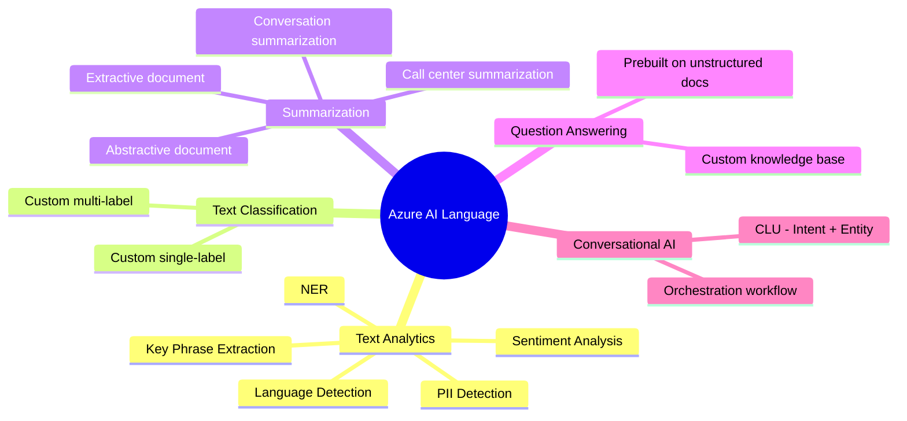
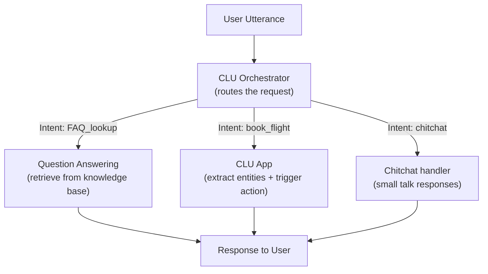
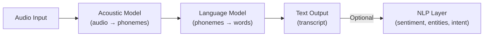

# 2. Azure NLP Services in Depth

## 2.1 Agenda

**Estimated reading time:** ~12 minutes

### Learning Outcomes

- Explain the full capability set of Azure AI Language beyond basic *(cơ bản)* text analytics
- Describe how Conversational Language Understanding (CLU) processes *(xử lý)* intents and entities
- Map Azure AI Speech capabilities to the correct *(đúng)* business scenario
- Apply the service selection framework *(khung chọn dịch vụ)* to NLP-specific exam scenarios

---

## 2.2 Glossary

| Term | Quick Explanation |
| :--- | :--- |
| **Utterance** *(Lượt nói)* | Một câu hoặc đoạn nói của người dùng gửi vào hệ thống conversational AI. Ví dụ: "Book me a flight to Da Nang next Monday." |
| **CLU** | Conversational Language Understanding — dịch vụ nhận dạng *(recognize)* intent và entity từ conversational utterance. Kế thừa *(successor)* của LUIS. |
| **Knowledge Base** *(Kho tri thức)* | Tập hợp cặp câu hỏi-đáp *(Q&A pairs)* dùng để xây dựng chatbot hỏi-đáp *(FAQ bot)*. |
| **Custom Training** *(Huấn luyện tùy chỉnh)* | Quá trình cung cấp dữ liệu của riêng mình để tinh chỉnh *(fine-tune)* dịch vụ cho domain cụ thể. |
| **Confidence Score** *(Điểm tin cậy)* | Xác suất *(probability)* mà model dự đoán cho một kết quả — từ 0.0 đến 1.0. |
| **Phoneme** *(Âm vị)* | Đơn vị âm thanh *(sound unit)* nhỏ nhất có thể phân biệt *(distinguish)* nghĩa. Tiếng Anh có ~44 phoneme. Ví dụ: "cat" = /k/ + /æ/ + /t/ — 3 phoneme. |
| **Neural Voice** | Giọng nói tổng hợp *(synthetic voice)* cực kỳ tự nhiên, tạo bằng deep learning — gần như không thể phân biệt với giọng người thật. |
| **Diarization** *(Phân biệt người nói)* | Kỹ thuật xác định và gán nhãn *(label)* từng người nói trong một cuộc hội thoại nhiều người. |
| **Custom Speech** | Phiên bản Azure AI Speech được tinh chỉnh *(fine-tuned)* trên dữ liệu âm thanh của domain cụ thể — tăng độ chính xác *(accuracy)* cho thuật ngữ chuyên ngành. |
| **Dialog Turn** *(Lượt hội thoại)* | Một cặp hỏi-đáp trong cuộc hội thoại nhiều bước *(multi-turn)*. Hệ thống phải nhớ *(remember)* ngữ cảnh *(context)* từ các lượt trước. |

---

## 3. Azure AI Language — Full Capability Map

Workshop 2 introduced Azure AI Language at an overview *(tổng quan)* level. Workshop 5 covers the internal structure and the capabilities critical for building real NLP applications.

### 3.1 Capability Groupings



### 3.2 Custom vs. Prebuilt Capabilities

| Capability | Prebuilt *(Dùng ngay)* | Custom *(Cần training)* |
| :--- | :--- | :--- |
| Sentiment Analysis | Yes | No |
| NER | Yes (general entities) | Yes (domain-specific entities) |
| Text Classification | No | Yes (your own categories) |
| Question Answering | No | Yes (your own Q&A pairs) |
| Conversational Language Understanding | No | Yes (your intents and entities) |
| Summarization | Yes | No |
| Language Detection | Yes | No |
| PII Detection | Yes | Yes (custom entity types) |

---

## 4. Deep Dive: Conversational Language Understanding (CLU)

### 4.1 What CLU Does

> **CLU** extracts two structured pieces of information from a user's natural language utterance *(lượt nói)* — the **intent** *(ý định)* and the **entities** *(thực thể)* — enabling conversational applications to take the correct *(đúng)* action.

### 4.2 Intent + Entity Extraction

**Example utterance:** *"Book a window seat on a flight to Da Nang on Friday for two people."*

```
Intent:    book_flight          (confidence: 0.97)
Entities:
  seat_type:    "window seat"
  destination:  "Da Nang"
  date:         "Friday"
  passenger_count: "two"
```

The application uses the intent to decide *what action to take* and the entities to fill in *the parameters* *(tham số)* of that action.

### 4.3 CLU vs. LUIS (Deprecated *(Đã ngừng hỗ trợ)*)

| Dimension | LUIS *(Deprecated)* | CLU *(Current)* |
| :--- | :--- | :--- |
| **Status** | Retired *(đã ngừng)* — migrated *(di chuyển)* to CLU | Current service — actively supported |
| **Training approach** | Separate service with its own portal | Unified in Azure AI Language |
| **Multilingual support** | Limited | Native *(tự nhiên)* multilingual support |
| **Orchestration** | Manual integration *(tích hợp thủ công)* | Built-in workflow orchestration *(điều phối)* |

> **Exam note:** AI-900 may still reference LUIS in historical context *(ngữ cảnh lịch sử)*. Know that CLU is its successor and all new projects should use CLU.

### 4.4 CLU Orchestration Workflow — How It Ties Together

A real conversational application rarely *(hiếm khi)* uses only CLU or only Question Answering — it needs **both**, coordinated *(phối hợp)* by an **Orchestration Workflow**:



**Dialog Management** *(Quản lý hội thoại)* is the layer that makes multi-turn *(nhiều lượt)* conversations possible:

| Problem | Dialog Management Solution |
| :--- | :--- |
| User says "him" — who is "him"? | Track *(theo dõi)* previous entities across turns *(các lượt trước)* — resolve pronouns from context |
| User changes topic mid-conversation | Detect *(phát hiện)* intent shift; decide whether to switch *(chuyển)* or confirm *(xác nhận)* |
| Slot filling *(điền vào các slot)* | Chatbot collects multiple entities over several turns: "Where?" → "When?" → "How many?" |
| Fallback *(Dự phòng)* | When no intent is recognized, route to a human agent *(đại lý)* or ask for clarification *(làm rõ)* |

> **Exam note:** Azure AI Language — CLU + Orchestration handles **Dialog Management** for multi-turn scenarios. It is the Azure service behind intelligent chatbots that remember context *(nhớ ngữ cảnh)* across turns.

---

## 4.5 Question Answering (Custom)

Build a knowledge base *(kho tri thức)* from:
- Manually entered Q&A pairs
- Existing documents *(tài liệu hiện có)* (FAQ pages, PDFs, Word docs, URLs)
- Chitchat *(trò chuyện)* templates (friendly greetings)

The service uses NLP to find the best-matching *(khớp nhất)* answer for user questions, returning:
- The answer text
- A confidence score
- The source *(nguồn gốc)* Q&A pair

---

## 5. Deep Dive: Azure AI Speech

### 5.1 The Speech Processing Pipeline



For Speech-to-Text, the process involves two stages: acoustic modeling *(mô hình âm học)* (audio → phonemes *(âm vị)*) and language modeling *(mô hình ngôn ngữ)* (phonemes → words). Custom Speech improves both layers for domain-specific *(chuyên biệt theo lĩnh vực)* vocabulary.

### 5.2 Speech Capabilities Deep Dive

| Capability | Key Detail | When to Use Custom |
| :--- | :--- | :--- |
| **Real-time STT** | Streams *(truyền)* audio and returns transcript as spoken | Use Custom Speech when domain has specialized vocabulary |
| **Batch STT** | Sends a stored audio file to Azure and retrieves the transcript later *(lấy kết quả sau)* — the application does not wait *(không cần chờ)* for the result synchronously *(đồng bộ)* | For large volumes of recorded audio — call center archives |
| **TTS — Neural Voices** | 400+ prebuilt neural voices across 140+ languages | When brand consistency *(nhất quán thương hiệu)* is important — use Custom Neural Voice |
| **Speaker Diarization** | Labels each speaker in a multi-person conversation | Call center transcription to separate agent *(đại lý)* from customer |
| **Pronunciation Assessment** | Scores pronunciation at phoneme, word, and sentence level | Language learning apps, accent training |
| **Keyword Spotting** *(Phát hiện từ khóa)* | Detects a specific word/phrase to trigger *(kích hoạt)* an action | Wake-word detection ("Hey Cortana"), always-on monitoring |
| **Speech Translation** | Translates spoken audio to text/audio in another language | Real-time multilingual meetings, conference interpretation *(phiên dịch)* |

### 5.2b TTS: Concatenative vs. Neural Voice

Not all Text-to-Speech is equal. Understanding the difference helps explain why Neural Voices sound human:

| Dimension | Concatenative TTS *(Tổng hợp nối)* | Neural Voice |
| :--- | :--- | :--- |
| **How it works** | Stitches *(ghép)* together pre-recorded audio fragments *(đoạn)* | Generates speech waveform *(dạng sóng)* end-to-end from text using deep learning |
| **Sound quality** | Robotic *(cứng nhắc)*, audible seams *(rõ chỗ nối)* between fragments | Natural prosody *(ngữ điệu tự nhiên)*, emotion, and rhythm |
| **Flexibility** | Fixed voice recordings — can't adapt tone *(giọng điệu)* | Adjustable *(có thể điều chỉnh)* speed, pitch *(cao độ)*, and speaking style |
| **Azure example** | Legacy TTS (deprecated) | Azure AI Speech — Neural Voices (400+) |
| **Custom Neural Voice** | N/A | Train on your brand's voice samples — creates a unique branded voice |

### 5.3 Custom Speech — When and Why

Custom Speech improves STT accuracy when:

| Scenario | Problem with Base STT | Custom Speech Solution |
| :--- | :--- | :--- |
| Medical transcription | Misrecognizes drug names, dosages *(liều lượng)*, procedures *(thủ thuật)* | Train on medical vocabulary dataset |
| Legal proceedings *(thủ tục pháp lý)* | Struggles with legal Latin terms, case citations *(trích dẫn)* | Train on legal corpus |
| Manufacturing | Factory noise, technical part names | Acoustic + language model adaptation |
| Accented speech | Regional accents reduce accuracy | Train on representative *(đại diện)* accent samples |

---

## 6. NLP Service Selection — Exam Scenarios

These are the most testable *(dễ ra đề thi nhất)* distinctions in AI-900:

| Scenario | Correct Service + Capability | Why Not the Alternative |
| :--- | :--- | :--- |
| Classify customer support tickets into 15 custom categories | AI Language — **Custom Text Classification** | Prebuilt NER extracts entities, not custom categories |
| Build a chatbot that answers questions from a 200-page HR policy PDF | AI Language — **Question Answering** (custom KB) | Not CLU — CLU is for intent/entity, not document Q&A |
| Detect when a user says "cancel" in an ongoing phone call | AI Speech — **Keyword Spotting** | STT transcribes everything; keyword spotting listens specifically *(cụ thể)* |
| Extract all person names and company names from contracts | AI Language — **NER** (prebuilt) | Sentiment analysis extracts tone, not structured entities |
| Identify which of three speakers is speaking in a recorded meeting | AI Speech — **Speaker Diarization** | Speaker Recognition verifies identity; Diarization separates speakers |
| Detect if a customer review contains the customer's home address | AI Language — **PII Detection** | NER identifies location entities; PII Detection specifically flags sensitive data |
| Understand what a user wants to do in a booking chatbot | AI Language — **CLU** | Question Answering retrieves facts; CLU recognizes intent for action |

---

## 7. Discussion Questions

**Q1 — CLU vs Question Answering:**
A developer is building a bank's internal chatbot. Use case A: "Customers ask: what is the penalty *(phí phạt)* for early loan repayment *(trả nợ sớm)?* — answer found in the bank's FAQ document." Use case B: "Customer says: 'I want to open a savings account' — the chatbot must route them to the account opening flow *(luồng mở tài khoản)*." Which Azure AI Language capability handles each, and why?

**Q2 — Custom Speech ROI:**
A Vietnamese media company wants to transcribe 10,000 hours of archived broadcast footage *(cảnh quay lưu trữ)*. The base Azure AI Speech STT returns 85% accuracy on Vietnamese broadcasting language. Custom Speech would improve this to 97% but requires 40 hours of labeled audio data *(dữ liệu âm thanh được gán nhãn)* and 2 weeks of ML engineering time. How would you calculate *(tính toán)* whether the investment *(đầu tư)* in Custom Speech is justified *(được biện minh)*?

**Q3 — The Privacy Pipeline:**
A telehealth *(y tế từ xa)* company uses Azure AI Speech for real-time transcription of doctor-patient calls, then pipes *(đưa)* the transcript into Azure AI Language for sentiment and keyword analysis. The transcript contains patient names, diagnoses *(chẩn đoán)*, and medications *(thuốc)*. Design the responsible data handling pipeline *(quy trình xử lý dữ liệu có trách nhiệm)* — which Azure AI capabilities should be applied at each step, and in what order?

---

*Made by Anh Tu - Share to be share*
