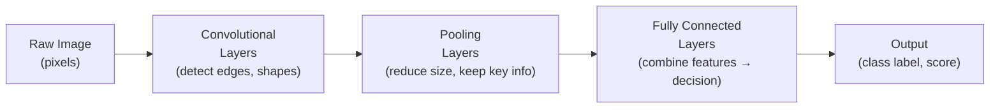
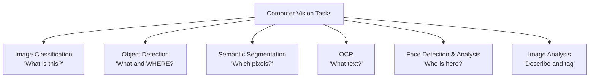
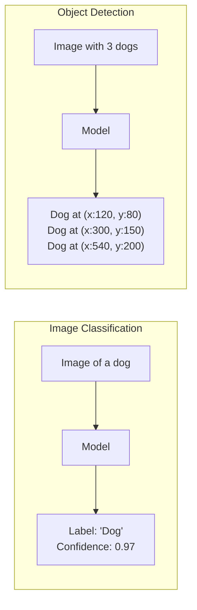

# 1. Computer Vision Concepts

## 1.1 Agenda

**Estimated reading time:** ~11 minutes

### Learning Outcomes

- Define Computer Vision and articulate *(diễn đạt)* why visual understanding is difficult for machines
- Describe how Convolutional Neural Networks (CNNs) process images conceptually
- Distinguish *(phân biệt)* between the six core CV tasks and know when each applies
- Identify the most exam-critical *(quan trọng nhất cho thi)* distinctions: classification vs. detection, OCR vs. Document Intelligence, Vision vs. Face

---

## 1.2 Glossary

| Term | Quick Explanation |
| :--- | :--- |
| **Pixel** | Đơn vị nhỏ nhất của ảnh kỹ thuật số *(digital image)* — một điểm màu sắc trong lưới điểm *(grid of dots)*. Ảnh 1920×1080 có hơn 2 triệu pixel. |
| **CNN** | Convolutional Neural Network — kiến trúc deep learning *(kiến trúc học sâu)* chuyên biệt để xử lý ảnh, sử dụng các bộ lọc *(filters)* trượt *(sliding)* qua ảnh để phát hiện đặc trưng *(detect features)*. |
| **Feature Map** | Kết quả *(output)* của mỗi lớp CNN — biểu diễn *(representation)* của các đặc trưng *(features)* như cạnh, góc, và hình dạng được phát hiện từ ảnh. |
| **Bounding Box** *(Hộp giới hạn)* | Hình chữ nhật *(rectangle)* được vẽ quanh đối tượng được phát hiện trong object detection — xác định vị trí và kích thước *(size)* của đối tượng. |
| **Confidence Score** | Xác suất *(probability)* mà model gán cho mỗi dự đoán — từ 0.0 đến 1.0. |
| **IoU** *(Intersection over Union)* | Tỷ lệ diện tích phần giao nhau *(intersection)* trên phần hợp nhất *(union)* giữa Bounding Box dự đoán và Bounding Box thực tế — dùng để đo độ chính xác của Object Detection. |
| **Transfer Learning** *(Học chuyển giao)* | Kỹ thuật lấy một model đã được huấn luyện trên hàng triệu ảnh (ví dụ: ResNet) và chỉ huấn luyện lại *(retrain)* lớp cuối cùng cho dữ liệu cụ thể của bạn — tiết kiệm thời gian và dữ liệu (Core của Custom Vision). |
| **OCR** | Optical Character Recognition — kỹ thuật trích xuất *(extract)* văn bản *(text)* từ hình ảnh. |
| **Spatial Analysis** *(Phân tích không gian)* | Phân tích chuyển động *(movement)*, mật độ *(density)*, và hành vi *(behavior)* của người hoặc đối tượng trong video theo thời gian thực *(real-time)*. |
| **Semantic Segmentation** *(Phân đoạn ngữ nghĩa)* | Gán nhãn *(label)* cho từng pixel — mỗi pixel được phân loại *(classify)* vào một danh mục *(category)* cụ thể (người, xe, đường...). |

---

## 2. Problem Statement

An image is simply *(đơn giản chỉ là)* a grid of millions of numbers (pixel values *(giá trị pixel)*). There are no inherent *(vốn có)* labels, no semantic *(ngữ nghĩa)* meaning encoded in the data. For a machine:

- **Viewpoint variation** *(Thay đổi góc nhìn)*: The same chair photographed from above, the side, or behind looks entirely *(hoàn toàn)* different at the pixel level.
- **Intraclass variation** *(Đa dạng trong cùng lớp)*: "Dog" includes Chihuahuas and Great Danes — vastly *(rất)* different pixel patterns.
- **Occlusion** *(Che khuất)*: A person partially *(một phần)* hidden behind a wall is still recognizable to humans but difficult for naïve algorithms.
- **Illumination** *(Ánh sáng)*: The same object under different lighting conditions *(điều kiện ánh sáng)* has completely different pixel values.

Computer Vision uses deep learning — specifically CNNs — to learn robust *(bền vững)*, viewpoint-invariant *(bất biến với góc nhìn)* representations from data rather than hand-coded rules.

---

## 3. How CNNs Work (Conceptual)

### 3.1 The Core Idea

### 3.2 Unpacking the Operations

Why is it called "Convolutional"? What does "Pooling" do?

| Operation | Intuition *(Trực giác)* | Example |
| :--- | :--- | :--- |
| **Convolution** *(Tích chập)* | A small grid (e.g., 3x3 filter) slides over the image. It acts as a magnifying glass looking for a *specific pattern* (like a vertical line or an eye). | Filter 1 looks for vertical edges; Filter 2 looks for horizontal edges. If the pattern is found, the output value is high. |
| **Pooling (Max Pooling)** | Reduces the size of the image by only keeping the most prominent *(nổi bật nhất)* feature in a region. | Look at a 2x2 area; keep only the brightest pixel. This makes the model faster and tolerant *(chịu đựng)* to small shifts in position. |
| **Fully Connected Layer** | Traditional neural network layer at the very end. It looks at all the detected features (eyes, nose, fur) and votes on the final category. | "If Fur=High AND Snout=High → Vote=Dog" |

### 3.2 What Each Layer Learns

CNNs learn a **hierarchy *(phân cấp)* of visual features** automatically from training data:

| Layer Depth *(Độ sâu)* | Features Learned |
| :--- | :--- |
| **Early layers** *(Lớp đầu)* | Low-level: edges *(cạnh)*, corners *(góc)*, color gradients *(độ dốc màu)* |
| **Middle layers** *(Lớp giữa)* | Mid-level: textures *(kết cấu)*, patterns, shapes (circles, curves) |
| **Deep layers** *(Lớp sâu)* | High-level: object parts (eyes, wheels, letters), semantic concepts |

This hierarchical feature learning *(học đặc trưng theo thứ bậc)* is why CNNs outperform *(vượt trội)* all previous approaches on image tasks — they learn *what to look for* rather than being told.

### 3.4 The Magic of Transfer Learning

Training a CNN from scratch *(từ đầu)* takes millions of images (like ImageNet) and massive GPU compute. How can Azure Custom Vision train a model on your 50 photos in minutes?

**Transfer Learning:** A pre-trained model already knows how to see edges, shapes, and textures (the early/middle layers). Custom Vision freezes these layers and only retrains the *very last* Fully Connected layer to recognize your specific objects (e.g., your specific factory defects).

> **AI-900 note:** You do not need to understand the mathematics *(toán học)* of CNNs. Understand: "CNNs learn to detect increasingly *(ngày càng)* abstract visual features layer by layer. Deep Learning made modern Computer Vision possible."

---

## 4. The Six Core Computer Vision Tasks

### 4.1 Overview

### 4.2 Task Comparison Table

| Task | Input | Output | Business Example |
| :--- | :--- | :--- | :--- |
| **Image Classification** | Whole image | Single label *(một nhãn)* + confidence | Product photo → "Defective / Non-defective" |
| **Object Detection** | Whole image | Multiple bounding boxes + labels + confidence | Traffic camera → [Car at (x,y), Pedestrian at (x,y)] |
| **Semantic Segmentation** | Whole image | Per-pixel *(từng pixel)* label map | Medical scan → pixels labeled as [tumor, healthy tissue, background] |
| **Instance Segmentation** | Whole image | Per-pixel mask *per object* | Medical scan → [Tumor 1 mask, Tumor 2 mask] *(Separates touching objects)* |
| **OCR** | Image with text | Extracted text strings + position | Scanned form → "Invoice No: INV-2024-001" |
| **Face Detection** | Image with people | Face bounding boxes + attributes *(thuộc tính)* | Photo → [Face at (x,y): age~34, emotion: happy] |
| **Image Analysis** | Whole image | Tags, captions, color, content moderation | Photo → Tags: [outdoor, mountain, snow]; Caption: "A skier on a mountain slope" |

### 4.3 The Critical Distinction: Classification vs. Detection

This is the most frequently *(thường xuyên nhất)* tested distinction in AI-900:

| Question | Use Classification | Use Detection |
| :--- | :--- | :--- |
| "Is there a defect in this product?" | ✅ | — |
| "Where exactly is the defect on the product?" | — | ✅ |
| "Is this X-ray of a patient positive for pneumonia?" | ✅ | — |
| "Which region *(vùng)* of the X-ray shows pneumonia?" | — | ✅ |
| "Count the cars in this parking lot *(bãi đỗ xe)*" | — | ✅ (must locate each) |

### 4.4 Key Metrics for Object Detection

If your model draws a box around a car, how do we know if the box is "correct"?

1. **Confidence Threshold *(Ngưỡng tin cậy)*:** The model says "I am 85% sure this is a car." If you set the threshold to 90%, the model ignores it (reduces False Positives, increases False Negatives).
2. **IoU (Intersection over Union):** Compares the predicted bounding box to the actual ground truth box. 
   - `IoU = Area of Overlap / Total Area Combined`
   - Typically, IoU > 0.5 is considered a "correct" detection.

---

## 5. OCR in Computer Vision

### 5.1 Read API vs. Document Intelligence

This is the second most critical *(quan trọng thứ hai)* distinction for AI-900:

| Dimension | Azure AI Vision — Read API | Azure AI Document Intelligence |
| :--- | :--- | :--- |
| **What it does** | Extracts raw text *(văn bản thô)* from any image | Extracts *structured fields* *(trường có cấu trúc)* from document images |
| **Output** | Plain text strings + bounding boxes | Key-value pairs *(cặp khóa-giá trị)*, tables, document structure |
| **Intelligence level** | "What text is written here?" | "This is an invoice — here is the vendor name, total amount, due date" |
| **Best for** | Digitizing *(số hóa)* free-form text, scanned books | Processing business documents (invoices, forms, receipts, IDs) |
| **Example** | Scanned letter → raw text transcript | Invoice image → `{"vendor": "ABC Corp", "total": "5,200,000", "date": "2024-03-15"}` |

### 5.2 When OCR Alone Is Not Enough

A manufacturing plant scans 500 incoming invoices daily. Their ERP system needs the vendor name *(tên nhà cung cấp)*, line items *(hạng mục)*, totals *(tổng cộng)*, and due dates *(ngày đáo hạn)* extracted automatically.

- **Vision Read API** returns all the text on the invoice as raw strings — the application still needs custom logic *(logic tùy chỉnh)* to find which string is the vendor name.
- **Document Intelligence** (Invoice model) returns a structured JSON with labeled fields — no custom parsing *(phân tích cú pháp)* logic needed.

### 5.3 The Handwriting Challenge

Extracting printed text is largely a solved problem. Handwriting *(chữ viết tay)* is significantly harder:
- **Cursive connections *(chữ thảo nối liền)*:** Characters blend together, making tokenization/segmentation difficult.
- **Stylistic variance:** Everyone writes differently.
- **Context dependence:** An illegible squiggle *(nét ngoệch ngoạc không đọc được)* might be a doctor's signature or a crucial medical term. Azure's Read API uses deep learning language models alongside visual models to *infer* *(suy luận)* ambiguous handwriting based on the surrounding text.

---

## 6. Face Detection and Analysis

### 6.1 Capability Distinction

| Capability | What It Does | Example |
| :--- | :--- | :--- |
| **Face Detection** *(Phát hiện khuôn mặt)* | Locates faces in an image — returns bounding boxes and basic attributes *(thuộc tính cơ bản)* | Photo → Face at (x:200, y:150), estimated age: 28, emotion: neutral |
| **Face Verification** *(Xác minh)* | "Are these two photos the same person?" — compares two face images | Security checkpoint: Live photo vs. ID photo → Match: 0.95 |
| **Face Identification** *(Nhận dạng)* | "Which known person is this?" — matches face against a trained group | Employee photo → Person ID: EMP-2041 (confidence: 0.92) |
| **Liveness Detection** *(Phát hiện sự sống)* | "Is this a real person or a photo/video spoof *(giả mạo)*?" | Anti-spoofing *(chống giả mạo)* for secure face login |

### 6.2 Responsible AI — Face API

Face AI carries significant *(đáng kể)* responsible AI risks:

| Risk | Detail |
| :--- | :--- |
| **Demographic bias** *(Thiên lệch nhân khẩu học)* | Some face recognition models show higher error rates for darker skin tones and women |
| **Privacy** *(Riêng tư)* | Mass surveillance *(giám sát hàng loạt)* using face identification violates *(vi phạm)* privacy rights |
| **Access controls** | Azure Face API requires approval for use cases involving identification — Microsoft implements Limited Access *(Quyền truy cập hạn chế)* for high-risk capabilities |

---

## 7. Discussion Questions

**Q1 — Classification vs. Detection:**
A smart retail shelf system *(hệ thống kệ hàng thông minh)* must: (1) check whether a product slot *(ô sản phẩm)* is empty or full, and (2) alert when a specific product brand is placed in the wrong section. Which CV task handles requirement (1) and which handles (2)? Are they the same task?

**Q2 — OCR for Compliance *(Tuân thủ)*:**
A bank in Vietnam must digitize *(số hóa)* 50,000 paper loan applications from the 1990s. Each form contains handwritten *(viết tay)* customer names, addresses, and loan amounts. Both Azure AI Vision (Read API) and Azure AI Document Intelligence are proposed. Which is more appropriate and why? What challenge does *handwriting* *(chữ viết tay)* introduce that affects *(ảnh hưởng)* either option?

**Q3 — Face Identification Governance:**
A company proposes using Azure Face Identification to automatically log *(ghi lại)* employee attendance *(chấm công)* by scanning cameras at office entrances. List at least three responsible AI questions the company must answer before deploying this system — covering privacy *(quyền riêng tư)*, consent *(sự đồng ý)*, accuracy disparities *(chênh lệch độ chính xác)*, and data retention *(lưu giữ dữ liệu)*.

---

*Made by Anh Tu - Share to be share*
