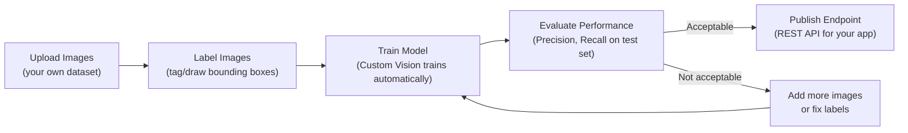
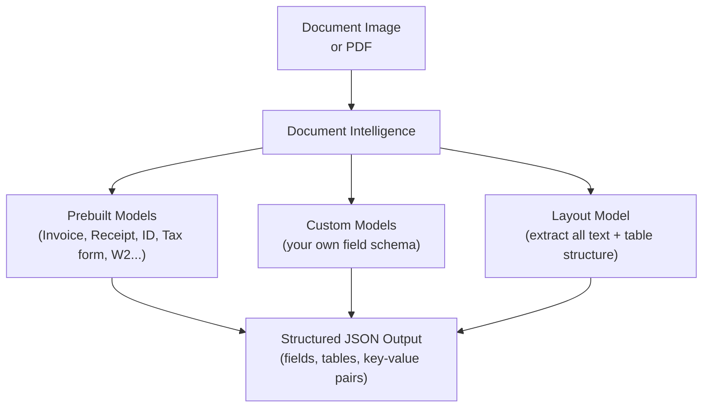

# 2. Azure Vision Services in Depth

## 2.1 Agenda

**Estimated reading time:** ~12 minutes

### Learning Outcomes

- Map each CV task to the correct Azure Vision service
- Explain when to use Custom Vision vs. Azure AI Vision (prebuilt)
- Identify the most testable *(dễ ra đề nhất)* service selection scenarios for Computer Vision in AI-900
- Describe the responsible AI considerations specific to vision systems deployed in production

---

## 2.2 Glossary

| Term | Quick Explanation |
| :--- | :--- |
| **Azure AI Vision** | Dịch vụ prebuilt *(đã có sẵn)* của Microsoft để phân tích ảnh và video — Image Analysis, OCR/Read API, và Spatial Analysis. |
| **Custom Vision** | Dịch vụ cho phép bạn tự huấn luyện *(train)* model phân loại ảnh *(image classification)* hoặc phát hiện đối tượng *(object detection)* tùy chỉnh bằng dữ liệu của mình. |
| **Azure AI Face** | Dịch vụ chuyên biệt cho Face Detection, Face Verification, và Face Identification. |
| **Azure AI Document Intelligence** | Dịch vụ OCR thông minh *(intelligent OCR)* chuyên biệt cho tài liệu — trích xuất *(extract)* trường dữ liệu có cấu trúc từ hóa đơn, form, ID... |
| **Spatial Analysis** *(Phân tích không gian)* | Tính năng trong Azure AI Vision — phân tích video để đếm người, đo dwell time *(thời gian ở lại)*, và theo dõi *(track)* chuyển động. |
| **Custom Neural Voice** | Mô hình giọng nói *(voice model)* tùy chỉnh huấn luyện từ các mẫu âm thanh *(audio samples)* để tạo giọng mang bản sắc thương hiệu *(brand voice)*. |
| **Prebuilt Document Model** | Model Document Intelligence đã được Microsoft huấn luyện sẵn cho các loại tài liệu phổ biến: hóa đơn *(invoice)*, biên lai *(receipt)*, tờ khai thuế *(tax form)*, CCCD... |
| **Limited Access** *(Quyền truy cập hạn chế)* | Chính sách của Microsoft yêu cầu phê duyệt *(approval)* trước khi dùng các tính năng Face nhạy cảm *(sensitive)* như identification và liveness detection. |

---

## 3. Azure Vision Services — Overview

| Service | Primary Capability | Prebuilt or Custom |
| :--- | :--- | :--- |
| **Azure AI Vision** | Image Analysis (tag, caption, detect objects), OCR (Read API), Spatial Analysis | Prebuilt |
| **Azure AI Face** | Face detection, verification, identification, liveness | Prebuilt + Limited Access |
| **Azure AI Custom Vision** | Train your own image classifier or object detector | Custom (you provide data + labels) |
| **Azure AI Document Intelligence** | Structured field extraction from document images | Prebuilt models + Custom models |

---

## 4. Azure AI Vision (Image Analysis)

### 4.1 Capabilities

| Feature | What It Returns | Example |
| :--- | :--- | :--- |
| **Image Tagging** | Set of keyword tags *(thẻ từ khóa)* with confidence scores | `["outdoor", "mountain", "snow", "skiing"] confidence: [0.99, 0.97, 0.95, 0.88]` |
| **Image Captioning** | Natural language description of the image | "A person skiing down a snow-covered mountain slope" |
| **Object Detection** | Bounding boxes + labels for multiple objects | `[Person at (120,80), Skis at (130,200)]` |
| **Background Removal** | Separates foreground *(tiền cảnh)* from background *(hậu cảnh)* | Product photo with transparent background |
| **Smart Crop** | Automatically identifies *(xác định)* the most important region | Crop thumbnail *(ảnh thu nhỏ)* to focal point |
| **Read API (OCR)** | Extracts all text from image with layout *(bố cục)* information | Scanned page → text + position of each word |
| **Spatial Analysis** | Detects and tracks people in video frames | Video → "Zone A: 8 people, avg dwell: 3.2 min" |
| **Content Moderation** | Flags adult *(nội dung người lớn)*, racy *(khiêu khích)*, or violent *(bạo lực)* content | Image → `{"isAdultContent": false, "adultScore": 0.02}` |

### 4.2 Spatial Analysis Use Cases (Video vs. Image)

Object Detection (Image Analysis) looks at a *single* static image. **Spatial Analysis** is designed for **video streams** — it tracks objects *across time*. This allows it to calculate metrics that are impossible with single images:

| Industry | Use Case | Metric *(Chỉ số)* Tracked |
| :--- | :--- | :--- |
| **Retail** | Measure time customers spend at product displays | Dwell time *(thời gian dừng)* per display zone |
| **Airports** | Count passengers in security queues *(hàng chờ)* | Queue length *(độ dài hàng)*, wait time *(thời gian chờ)* |
| **Hospitals** | Monitor *(giám sát)* social distancing compliance *(tuân thủ)* | Distance between individuals *(khoảng cách)* |
| **Manufacturing** | Enforce *(thực thi)* PPE *(thiết bị bảo hộ)* usage in restricted *(hạn chế)* zones | Presence of hard hat, safety vest |

---

## 5. Azure AI Custom Vision

### 5.1 When Prebuilt Is Not Enough

The prebuilt Azure AI Vision models are trained on general *(chung)* image datasets. They recognize broad categories *(danh mục rộng)* — dogs, cats, cars — but fail at domain-specific *(chuyên biệt)* tasks:

| General Vision Fails When... | Custom Vision Solution |
| :--- | :--- |
| Classify proprietary *(độc quyền)* product SKUs by photo | Train classifier on your product photos with SKU labels |
| Detect defects specific to your manufacturing process | Train detector on images of your specific defect patterns |
| Identify rare species *(loài hiếm)* or custom object types | Provide labeled examples → Custom Vision learns the pattern |

### 5.2 Custom Vision Workflow

**Step 1: Labeling Best Practices**
A model is only as good as its labels. "Garbage in, garbage out."
- Draw bounding boxes *tightly* *(chặt chẽ)* around objects.
- Ensure balanced classes (don't have 500 images of defect A and only 10 of defect B).
- Include background variations and different lighting.

**Step 2: Evaluation Metrics**
Custom Vision provides two key metrics. You must understand the trade-off:
- **Precision *(Độ chuẩn xác)*:** Of all the objects the model *claimed* were defects, what percentage actually were? (Low precision = many False Positives / "Crying wolf").
- **Recall *(Độ bao phủ)*:** Of all the *actual* defects in reality, what percentage did the model find? (Low recall = many False Negatives / "Missed defects").

> **Exam Tip:** In medical diagnosis or safety inspection, **Recall is more important** (you'd rather have a false alarm than miss a tumor). In automated sorting, Precision might be more important.

### 5.3 Custom Vision vs. Azure ML (Custom Vision)

| Dimension | Azure AI Custom Vision | Azure Machine Learning |
| :--- | :--- | :--- |
| **Expertise needed** | Minimal *(tối thiểu)* — no ML coding | Data science skills required |
| **Supported tasks** | Image classification + Object detection only | Any ML task |
| **Control** | Limited — fixed architecture *(kiến trúc cố định)* | Full control over model architecture |
| **Time to model** | Hours | Days to weeks |
| **Best for** | Domain-specific vision without ML team | Advanced custom CV with specific architecture needs |

---

## 6. Azure AI Document Intelligence

### 6.1 Service Architecture

### 6.2 Prebuilt Models

| Model | Document Type | Key Fields Extracted |
| :--- | :--- | :--- |
| **Invoice** | Business invoices *(hóa đơn doanh nghiệp)* | Vendor name, invoice date, line items, subtotal, tax, total amount |
| **Receipt** | Retail receipts *(biên lai bán lẻ)* | Merchant name, transaction date, items purchased, total |
| **ID Document** | Passports *(hộ chiếu)*, driver's licenses, ID cards | Name, date of birth, document number, expiry date |
| **Tax Form (W-2, 1099)** | US tax documents | Employer info, wages, federal tax withheld |
| **Business Card** | Business cards *(danh thiếp)* | Name, company, email, phone, address |

### 6.3 The Layout Model *(Mô hình bố cục)*

If your document doesn't fit a prebuilt model, but you don't want to train a custom model, the **Layout Model** is the bridge. It extracts:
- Text and bounding boxes (like OCR)
- **Selection marks** (checkboxes, radio buttons)
- **Table structures** (rows, columns, headers) — crucial because standard OCR scrambles *(làm lộn xộn)* tabular data if it just reads left-to-right.

### 6.4 Custom Model — When to Use

Use a custom Document Intelligence model when:
- Your document type is not covered by prebuilt models
- Your forms have a unique layout *(bố cục)* or proprietary fields
- You need to extract specific data not in the standard schema

**Example:** A Vietnamese logistics company uses a custom manifest *(bản kê khai)* form — standard Invoice model doesn't match their field names and layout. Custom Document Intelligence model can be trained on just 5–10 labeled examples of their specific form.

---

## 7. Service Selection — Vision Exam Scenarios

| Scenario | Correct Service | Why |
| :--- | :--- | :--- |
| Extract invoice date and total from 500 scanned PDFs | **Document Intelligence** — Invoice model | Vision Read API returns raw text with no field mapping |
| Count the number of people in a mall entrance every 15 minutes from video | **Azure AI Vision** — Spatial Analysis | Object Detection processes single frames; Spatial Analysis works on video streams *(luồng video)* |
| Build a system to classify 30 types of fabric defects in a textile *(dệt may)* factory | **Azure AI Custom Vision** — Object Detection | Prebuilt Vision has no domain knowledge of textile defects |
| Auto-tag thousands of marketing photos with general keywords | **Azure AI Vision** — Image Tagging | General tags are exactly what the prebuilt model provides |
| Verify that a new bank customer's selfie *(ảnh tự chụp)* matches their uploaded ID photo | **Azure AI Face** — Face Verification | Custom Vision handles classification; Face Verification does identity comparison |
| Detect whether customers are wearing helmets in a construction zone video | **Azure AI Custom Vision** — Object Detection | Prebuilt Vision can detect "person" but not domain-specific safety gear compliance |
| Read handwritten serial numbers *(số sê-ri)* from equipment tags in a factory | **Azure AI Vision** — Read API | Document Intelligence is for structured documents; Read API handles general text in images |

---

## 8. Responsible AI for Computer Vision

### 8.1 Key Risks

| Risk | Scenario | Mitigation |
| :--- | :--- | :--- |
| **Surveillance misuse** *(Lạm dụng giám sát)* | Using Spatial Analysis to monitor employees' every movement | Limit *(giới hạn)* to aggregate *(tổng hợp)* metrics; disclose *(công khai)* monitoring to employees |
| **Facial recognition bias** | Higher error rates for certain demographics affect job applicants | Test across demographic groups; require human review for consequential *(có hệ quả)* decisions |
| **Consent for data collection** | Capturing faces without individual knowledge *(sự biết)* | Post clear notices *(thông báo rõ ràng)*; comply with local privacy laws |
| **Data retention** *(Lưu giữ dữ liệu)* | Storing biometric *(sinh trắc học)* data longer than needed | Define *(xác định)* and enforce *(thực thi)* retention policies |
| **Model accuracy in safety-critical *(an toàn quan trọng)* contexts** | PPE detection triggering safety interlocks *(liên động an toàn)* | Set appropriate *(phù hợp)* confidence thresholds; require human confirmation *(xác nhận)* |

### 8.2 Microsoft's Stance on Face Attributes

In recent years, Microsoft has restricted *(hạn chế)* the Azure AI Face API due to Responsible AI concerns:
- **Retired capabilities:** Detecting gender, age, and emotional states from faces is no longer supported for new customers. Microsoft determined that inferring *(suy luận)* these attributes from physical appearance lacks scientific basis and risks stereotyping *(định kiến)*.
- **Limited Access:** Features like Face Identification and Liveness Detection require an explicit application process. Microsoft will only approve use cases that align with ethical *(đạo đức)* principles.

---

## 9. Discussion Questions

**Q1 — Spatial Analysis Ethics *(Đạo đức)*:**
A retailer installs Spatial Analysis cameras to measure dwell time at product displays. The data reveals *(tiết lộ)* that certain demographic groups spend significantly more time in specific aisles *(lối đi)*. Marketing wants to use this data to target *(nhắm mục tiêu)* advertising *(quảng cáo)* by demographic. What responsible AI concerns does this raise, and what policies should the retailer put in place before using the system this way?

**Q2 — Custom Vision vs. Prebuilt:**
A hospital uses Azure AI Vision image tagging to categorize *(phân loại)* medical imaging results — and finds that tags like "mass," "opacity *(độ mờ đục)*," and "lesion *(tổn thương)*" appear inconsistently *(không nhất quán)*. A radiologist *(bác sĩ X-quang)* says the model misses *(bỏ sót)* subtle *(tinh tế)* findings *(phát hiện)* that are obvious to trained eyes. What is the root cause *(nguyên nhân gốc rễ)* of this failure, and which Azure service should replace the current approach?

**Q3 — Document Intelligence at Scale:**
A Vietnamese insurance company *(công ty bảo hiểm)* processes 2,000 claim forms *(mẫu yêu cầu bồi thường)* daily, each containing a mix of handwritten and printed Vietnamese text, plus a stamp *(con dấu)* and signature *(chữ ký)*. Evaluate the suitability *(sự phù hợp)* of: (a) Azure AI Vision Read API, (b) Document Intelligence prebuilt Receipt model, (c) Document Intelligence Custom model. Which combination *(sự kết hợp)* would you recommend, and what are the key risks?

---

*Made by Anh Tu - Share to be share*
