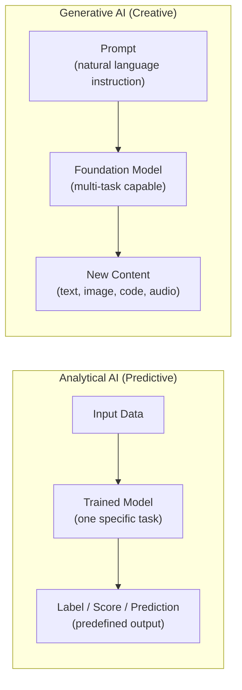
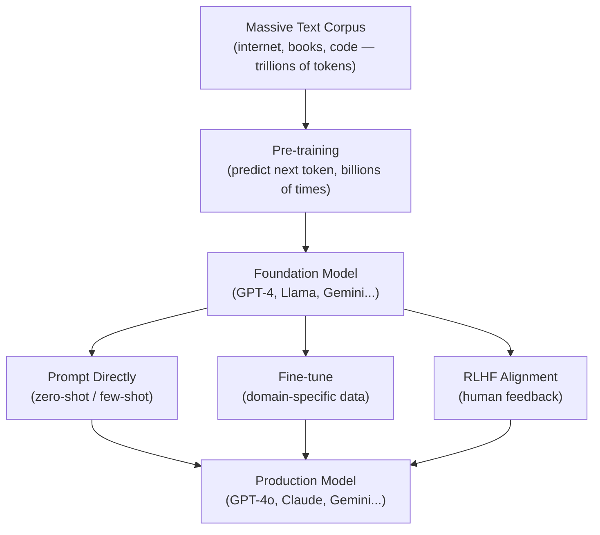
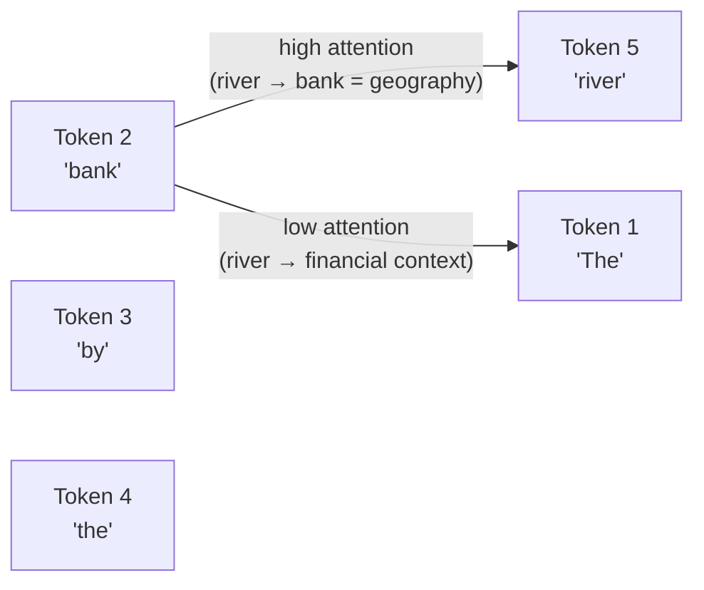
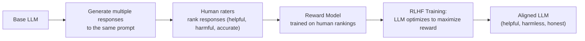

# 1. What is Generative AI?

## 1.1 Agenda

**Estimated reading time:** ~12 minutes

### Learning Outcomes

- Define Generative AI and explain the paradigm shift *(sự thay đổi mô hình)* from analytical AI
- Describe how Large Language Models work conceptually — training, tokens, and prediction
- Explain the Transformer architecture at a high level without mathematics
- Identify the key generative modalities *(phương thức tạo sinh)* — text, image, code, audio
- Distinguish between a *foundation model* and a *fine-tuned model*

---

## 1.2 Glossary

| Term | Quick Explanation |
| :--- | :--- |
| **Generative AI** | AI tạo ra nội dung mới *(new content)* — văn bản, ảnh, code, âm thanh — thay vì chỉ phân loại *(classify)* hoặc dự đoán *(predict)* nhãn từ dữ liệu có sẵn. |
| **LLM** | Large Language Model — mô hình ngôn ngữ lớn huấn luyện *(trained)* trên hàng nghìn tỷ *(trillions)* từ văn bản từ internet, sách, code... |
| **Token** | Đơn vị xử lý *(processing unit)* của LLM — thường là một từ hoặc một phần của từ. "AI is amazing" ≈ 4 tokens. GPT-4 xử lý tối đa *(max)* 128,000 tokens mỗi lần. |
| **Transformer** | Kiến trúc *(architecture)* deep learning sử dụng cơ chế "attention" *(chú ý)* để mô hình hóa *(model)* mối quan hệ giữa tất cả tokens trong ngữ cảnh *(context)* — nền tảng của GPT, BERT, và LLM hiện đại. |
| **Context Window** *(Cửa sổ ngữ cảnh)* | Số token tối đa model có thể "nhớ" và xử lý trong một lần — bao gồm cả prompt và output. |
| **Foundation Model** *(Mô hình nền tảng)* | Mô hình lớn được huấn luyện tổng quát *(generally)* trên dữ liệu khổng lồ — có thể fine-tune *(tinh chỉnh)* cho nhiều tác vụ *(tasks)* khác nhau. |
| **Fine-tuning** *(Tinh chỉnh)* | Quá trình huấn luyện lại *(retraining)* một phần foundation model trên dữ liệu domain-specific *(chuyên biệt)* để cải thiện hiệu năng cho một tác vụ cụ thể. |
| **Hallucination** *(Ảo giác)* | Hiện tượng model tự tin *(confidently)* tạo ra thông tin sai *(incorrect)* hoặc bịa đặt *(fabricated)* — không có cơ sở trong dữ liệu thực tế. |
| **Multimodal** | Mô hình có thể xử lý *(process)* và tạo ra *(generate)* nhiều loại dữ liệu khác nhau: text + ảnh + audio trong cùng một model. |

---

## 2. Problem Statement

Traditional AI systems are **closed-world** *(thế giới đóng)*: they learn to solve one specific task — classify an email, detect an object, predict a number. Every new task requires a new model, new training data, and new deployment.

Generative AI represents an **open-world** *(thế giới mở)* paradigm *(mô hình)*:
- A single foundation model can answer questions, write essays, generate code, translate languages, and summarize documents.
- The same model can be adapted *(thích ứng)* to new tasks through *prompting* *(nhắc nhở)* — no retraining required.
- The output is not a predefined label but *new, original content*.

This shift is why Generative AI has disrupted *(làm gián đoạn và thay đổi)* software development, creative industries, and knowledge work simultaneously *(đồng thời)*.

---

## 3. Generative AI vs. Analytical AI

### 3.1 The Core Distinction



### 3.2 Comparison Table

| Dimension | Analytical AI | Generative AI |
| :--- | :--- | :--- |
| **Task scope** | One model, one task | One model, many tasks |
| **Output type** | Predefined labels or values | New, original content |
| **How to customize** | Retrain on new labeled data | Prompt engineering or fine-tuning |
| **Data needed to use** | Pre-trained: just call API | Pre-trained: just provide a prompt |
| **Failure mode** | Wrong prediction | Hallucination, bias, harmful content |
| **Human role** | Define labels and training data | Design prompts; review and validate outputs |

---

## 4. Large Language Models — How They Work

### 4.1 The Training Process (Conceptual)



### 4.2 The Core LLM Task: Next-Token Prediction

At its core *(về cơ bản)*, every LLM is trained on a deceptively simple *(đơn giản một cách đánh lừa)* task:

> **Given the preceding *(đứng trước)* tokens, predict the next token.**

This simple objective *(mục tiêu đơn giản)*, applied billions of times across a trillion-token corpus *(kho dữ liệu)*, forces the model to learn:
- Grammar and syntax *(ngữ pháp và cú pháp)*
- Facts about the world *(sự kiện thực tế)*
- Reasoning patterns *(mẫu suy luận)*
- Code logic and structure *(cấu trúc code)*
- Narrative and argumentation *(tường thuật và lập luận)*

**Example prediction chain:**

```
"The capital of Vietnam is"
  → Next token options: [Hanoi: 0.94, Ho: 0.03, Da: 0.01, ...]
  → Model selects: "Hanoi"
```

The model does not *know* this fact in the human sense — it has learned that in its training data, "The capital of Vietnam is" is almost always followed by "Hanoi."

### 4.3 The Transformer Architecture (Conceptual)

Before Transformers *(trước khi có Transformer)* (pre-2017), language models processed text sequentially *(tuần tự)* — one word at a time, often "forgetting" *(quên)* context from many words ago.

The Transformer introduced the **self-attention mechanism** *(cơ chế tự chú ý)*, which allows the model to consider *(xem xét)* the relationship between *every* pair of tokens simultaneously *(đồng thời)*:



In the sentence "The bank by the river," the attention mechanism links "bank" most strongly to "river" — resolving *(giải quyết)* the ambiguity. This is why LLMs handle context *(ngữ cảnh)* so much better than previous models.

> **AI-900 note:** You need to know: "Transformers use attention to relate all words in a context simultaneously — this enables long-range *(tầm xa)* language understanding." No mathematical detail required.

---

## 5. What LLMs Can Generate

### 5.1 Generative Modalities

| Modality *(Phương thức)* | What Can Be Generated | Azure Service |
| :--- | :--- | :--- |
| **Text** | Articles, summaries, Q&A, translations, classification, code | Azure OpenAI — GPT-4, GPT-4o |
| **Code** | Python, SQL, JavaScript, bash scripts, API calls | Azure OpenAI — GPT-4o (coding), GitHub Copilot |
| **Images** | Photos, illustrations *(minh họa)*, art from text prompts | Azure OpenAI — DALL-E 3 |
| **Audio** | Transcription *(phiên âm)*, translation from audio | Azure OpenAI — Whisper |
| **Embeddings** *(Nhúng vector)* | Semantic *(ngữ nghĩa)* vector representations for search and retrieval | Azure OpenAI — text-embedding-3 |

### 5.2 Foundation Model vs. Fine-tuned Model

| | Foundation Model | Fine-tuned Model |
| :--- | :--- | :--- |
| **Training** | Pre-trained on general corpus *(kho dữ liệu chung)* | Foundation model + additional domain-specific training |
| **Strengths** | Broad *(rộng)* capabilities, works out-of-the-box *(dùng ngay)* | Higher accuracy on target domain |
| **Customization cost** | None to use; adjust via prompt | Requires labeled domain data + compute cost |
| **When to use** | General-purpose tasks, rapid prototyping *(thử nghiệm nhanh)* | Critical accuracy needed for specialized domain |
| **Azure example** | GPT-4o via API | Fine-tuned GPT on your company's support transcripts |

---

## 6. RLHF — Aligning LLMs with Human Values

Raw LLMs trained only on next-token prediction can produce harmful *(có hại)*, biased *(thiên lệch)*, or unhelpful *(vô ích)* outputs. **Reinforcement Learning from Human Feedback (RLHF)** *(Học tăng cường từ phản hồi con người)* is the technique used to align *(căn chỉnh)* LLMs:



RLHF is why ChatGPT and Claude feel like cooperative *(hợp tác)* assistants rather than raw autocomplete *(tự điền)* engines. It also introduces the *alignment tax* — a slight *(nhỏ)* reduction in raw capability in exchange for *(để đổi lấy)* safety.

---

## 7. Discussion Questions

**Q1 — The Closed vs. Open World Shift:**
A traditional ML team built 12 separate *(riêng biệt)* models over 2 years for 12 business tasks: sentiment, intent, classification, summarization, translation, FAQ, etc. A new colleague *(đồng nghiệp)* proposes replacing all 12 with a single GPT-4o deployment. What are the valid *(hợp lệ)* arguments for and against this consolidation *(hợp nhất)*? What tasks would specifically benefit *(hưởng lợi cụ thể)* from staying as dedicated *(chuyên dụng)* ML models?

**Q2 — The Hallucination Problem:**
A legal tech *(công nghệ pháp lý)* company deploys GPT-4 to help lawyers draft *(soạn)* case summaries. A lawyer notices that the model correctly summarizes 95% of the case — but in one paragraph, it cites *(trích dẫn)* a court ruling *(phán quyết tòa án)* that does not exist in the source document, with full *(đầy đủ)* case numbers and dates. The lawyer signs and submits *(nộp)* the brief *(bản tóm tắt)*. What is the underlying *(cơ bản)* mechanism that caused this failure, and what architectural *(kiến trúc)* change to the system would reduce this risk significantly *(đáng kể)*?

**Q3 — Foundation Model Governance *(Quản trị)*:**
Your company signs up for Azure OpenAI Service and begins using GPT-4o for customer-facing *(hướng đến khách hàng)* applications. Six months later, Microsoft releases GPT-4.1 and automatically migrates *(di chuyển)* your deployment. Some customer-facing responses change in tone *(giọng điệu)* and accuracy. (a) What governance practice should your team have implemented from day one to detect *(phát hiện)* this? (b) What does this scenario reveal about the hidden operational costs *(chi phí vận hành ẩn)* of depending on a managed foundation model?

---

*Made by Anh Tu - Share to be share*
