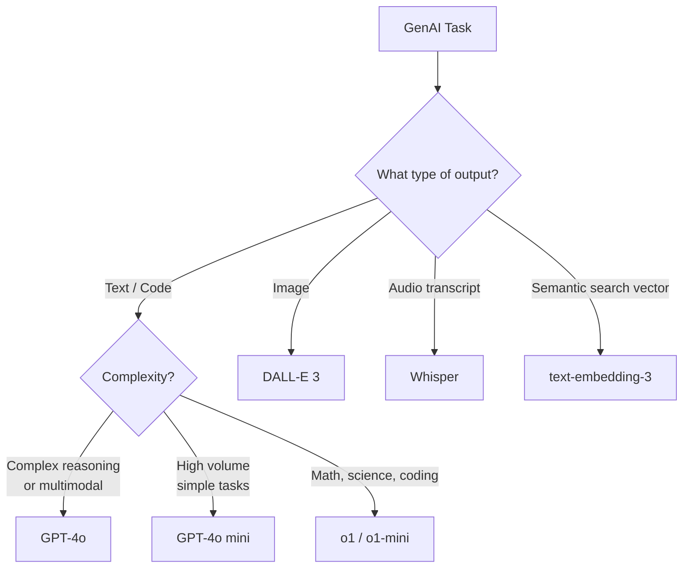
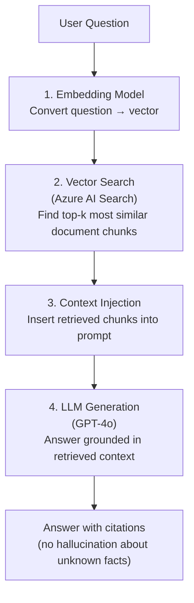

# 2. Azure OpenAI Service and Prompt Engineering

## 2.1 Agenda

**Estimated reading time:** ~14 minutes

### Learning Outcomes

- Describe the Azure OpenAI Service model catalog and when to use each model
- Apply core prompt engineering techniques to improve output quality
- Explain the RAG *(Retrieval-Augmented Generation)* pattern and why it reduces hallucination
- Understand how Azure AI Foundry integrates with Azure OpenAI for production applications
- Identify the exam-critical distinctions between Azure OpenAI and Azure AI Language

---

## 2.2 Glossary

| Term | Quick Explanation |
| :--- | :--- |
| **Prompt** *(Lệnh nhắc)* | Đầu vào *(input)* dạng ngôn ngữ tự nhiên mà người dùng hoặc ứng dụng gửi cho model — bao gồm hướng dẫn *(instructions)*, ngữ cảnh *(context)*, và câu hỏi hoặc yêu cầu *(request)*. |
| **Prompt Engineering** | Kỹ thuật thiết kế *(design)* prompt để dẫn dắt *(guide)* model tạo ra output chất lượng cao, chính xác *(accurate)*, và có định dạng *(formatted)* phù hợp. |
| **System Message** *(Tin nhắn hệ thống)* | Phần đầu của prompt xác định *(define)* vai trò *(role)*, hành vi *(behavior)*, và ràng buộc *(constraints)* của model. |
| **Temperature** | Tham số kiểm soát *(control parameter)* độ ngẫu nhiên *(randomness)* của output — 0.0 = tất định *(deterministic)*; 2.0 = sáng tạo *(creative)* nhưng không ổn định *(unstable)*. |
| **RAG** | Retrieval-Augmented Generation — mô hình kết hợp *(combine)* LLM với cơ sở kiến thức bên ngoài *(external knowledge base)* để giảm hallucination và cung cấp *(provide)* câu trả lời có nguồn gốc *(cited)*. |
| **Embedding** *(Nhúng vector)* | Biểu diễn văn bản dưới dạng vector số — các đoạn văn tương nghĩa *(semantically similar)* có vector gần nhau, dùng để tìm kiếm ngữ nghĩa *(semantic search)*. |
| **Azure AI Search** | Dịch vụ tìm kiếm *(search service)* của Azure — kết hợp với Azure OpenAI để lưu trữ *(store)* và truy xuất *(retrieve)* vector embeddings trong RAG pipeline. |
| **Deployment** *(Triển khai model)* | Trong Azure OpenAI, mỗi model phải được triển khai vào một endpoint riêng *(specific endpoint)* trước khi có thể gọi *(call)* từ ứng dụng. |
| **Token Usage** *(Mức tiêu thụ token)* | Azure OpenAI tính phí *(charge)* dựa trên số token xử lý — bao gồm cả prompt tokens và completion tokens. |

---

## 3. Azure OpenAI Service — Overview

### 3.1 What It Provides

> **Azure OpenAI Service** is Microsoft's managed service that provides access to OpenAI's foundation models through Azure's enterprise-grade infrastructure *(hạ tầng cấp doanh nghiệp)* — with added security, compliance *(tuân thủ)*, private networking *(mạng riêng tư)*, and responsible AI controls.

**Key differentiator from openai.com directly:**

| Dimension | OpenAI API (direct) | Azure OpenAI Service |
| :--- | :--- | :--- |
| **Data privacy** | Data may be used for model training | Your data is **not** used to train OpenAI models |
| **Compliance** | Limited | GDPR, HIPAA-eligible, ISO 27001, SOC 2 |
| **Network** | Public internet only | Azure Private Link *(mạng nội bộ)*, VPN integration |
| **SLA** | Limited | Enterprise SLA *(cam kết mức dịch vụ doanh nghiệp)* |
| **Content filtering** | Basic | Azure AI Content Safety built-in |
| **Responsible AI** | Self-managed | Microsoft oversight + Azure tools |

---

## 4. Available Models and When to Use Each

### 4.1 Model Catalog

| Model Family | Current Version | Best For |
| :--- | :--- | :--- |
| **GPT-4o** | Latest flagship *(hàng đầu)* | Complex reasoning *(suy luận phức tạp)*, multimodal input (text+image), long context tasks |
| **GPT-4o mini** | Smaller, faster, cheaper | High-volume *(khối lượng lớn)* applications where cost and latency matter |
| **o1 / o1-mini** | Reasoning models | Math, science, coding problems requiring step-by-step *(từng bước)* logic |
| **DALL-E 3** | Image generation | Text-to-image generation — marketing assets, product visualization |
| **Whisper** | Audio transcription | Speech-to-text with high accuracy across 50+ languages |
| **text-embedding-3** | Embedding generation | Semantic search, RAG retrieval, document clustering |

### 4.2 Model Selection Decision



---

## 5. Prompt Engineering

### 5.1 Why Prompts Matter

The same model with different prompts can produce:
- A well-structured *(có cấu trúc)* executive summary
- A five-sentence bullet list *(danh sách gạch đầu dòng)*
- A hallucinated *(bịa đặt)* answer full of confident nonsense *(vô nghĩa)*

Prompt engineering is the skill of crafting *(tạo ra)* inputs that reliably *(đáng tin cậy)* produce the desired output.

### 5.2 The Anatomy of an Effective Prompt

```
[System Message]
You are a financial analyst assistant. Respond only with information present in the provided document.
Use precise numbers when available. Output in JSON.

[Context / Grounding data]
<document>
Q3 Revenue: 4,200,000 USD. Net profit margin: 12.3%. YoY growth: 8.2%.
</document>

[Instruction]
Extract the three key financial metrics from the document above.

[Output format]
{"metric": "value", "metric": "value", "metric": "value"}
```

### 5.3 Core Techniques

| Technique | Description | When to Use |
| :--- | :--- | :--- |
| **Zero-shot prompting** | No examples given — just the task description | General tasks the model already handles well |
| **Few-shot prompting** *(Nhắc với vài ví dụ)* | Provide 2–5 input/output examples before the actual query | Complex formatting, domain-specific *(chuyên biệt)* output style |
| **Chain-of-thought** *(Chuỗi suy nghĩ)* | Ask model to "think step by step" before answering | Math, logic, multi-step reasoning |
| **System message role-setting** | Set the model's persona and constraints in the system prompt | Restrict *(giới hạn)* model to specific domain, tone, or format |
| **Temperature control** | Set `temperature=0` for deterministic *(tất định)* output | Factual Q&A, JSON extraction; `temperature=0.7–1.0` for creative tasks |
| **Output format specification** | Specify JSON, Markdown, bullet list, table in the prompt | When output feeds *(đưa vào)* a downstream system *(hệ thống phía sau)* |

### 5.4 Prompt Anti-patterns *(Mẫu prompt xấu)*

| Anti-pattern | Problem | Fix |
| :--- | :--- | :--- |
| Vague instruction *(Hướng dẫn mơ hồ)* | "Summarize this" → model chooses length and format | "Summarize in 3 bullet points, each ≤15 words" |
| No constraint on scope | Model answers beyond the document, hallucinating | "Only use information from the provided document" |
| No output format | Inconsistent *(không nhất quán)* format breaks downstream processing | Specify: JSON, table, numbered list |
| Asking contradictory things | "Be creative but always accurate" | Separate creative and factual tasks into separate prompts |

---

## 6. RAG — Retrieval-Augmented Generation

### 6.1 The Core Problem RAG Solves

LLMs have **two critical limitations** for enterprise *(doanh nghiệp)* use:

1. **Knowledge cutoff** *(Giới hạn kiến thức)*: GPT-4's training data has a cutoff date. It cannot answer questions about events after that date.
2. **No access to private data** *(Không truy cập được dữ liệu riêng)*: The model has no knowledge of your company's internal documents, policies, or proprietary *(độc quyền)* databases.

**Without RAG:** *"What is the return policy for product SKU-2847?"*
→ Model guesses *(đoán)* or says "I don't know" or — worst — hallucinates a plausible-sounding but wrong policy.

**With RAG:** The system retrieves *(lấy)* the actual product policy document and grounds *(neo đậu)* the answer in real content.

### 6.2 How RAG Works



### 6.3 RAG Component Architecture

| Component | Azure Service | Role |
| :--- | :--- | :--- |
| **Document store** *(Kho tài liệu)* | Azure Blob Storage | Store raw documents (PDFs, Word, HTML) |
| **Embedding model** | Azure OpenAI — text-embedding-3 | Convert documents and queries *(truy vấn)* into vectors |
| **Vector index** *(Chỉ mục vector)* | Azure AI Search | Store embeddings; find nearest *(gần nhất)* neighbors for a query |
| **LLM** | Azure OpenAI — GPT-4o | Generate the final answer from retrieved context |
| **Orchestration** *(Điều phối)* | Azure AI Foundry — Prompt Flow | Wire *(kết nối)* all components into a testable *(kiểm tra được)* pipeline |

### 6.4 RAG vs. Fine-tuning: When to Use Each

| Approach | RAG | Fine-tuning |
| :--- | :--- | :--- |
| **What it adds** | Knowledge from external documents at query time | New behavior or style baked *(mã hóa)* into model weights |
| **Data required** | Documents (no labels needed) | Labeled input-output examples |
| **Knowledge freshness** *(Tươi mới)* | Real-time — update documents without retraining | Stale *(cũ)* — requires retraining when knowledge changes |
| **Best for** | Q&A over company knowledge base, factual tasks | Custom tone *(giọng điệu)*, format, or domain-specific language style |
| **Cost** | Retrieval + LLM per call | One-time training cost + larger model serving *(phục vụ)* cost |

---

## 7. Azure AI Foundry — The Production Platform

**Azure AI Foundry** (formerly *(trước đây là)* Azure AI Studio) is the central *(trung tâm)* platform for building, testing, and deploying production generative AI applications:

| Feature | Description |
| :--- | :--- |
| **Model Catalog** *(Danh mục model)* | Browse and deploy models from OpenAI, Meta (Llama), Mistral, Hugging Face, and Microsoft |
| **Prompt Flow** | Visual tool to design, test, and deploy multi-step *(nhiều bước)* AI workflows (including RAG) |
| **Playground** *(Sân chơi thử nghiệm)* | Interactive testing of prompts and models before building an application |
| **Evaluation tools** | Measure *(đo)* output quality: groundedness *(độ bám sát tài liệu)*, relevance, coherence, fluency |
| **Content Filters** | Built-in Azure AI Content Safety filters *(bộ lọc)* applied to all inputs and outputs |
| **Agent capabilities** | Build AI agents *(tác tử AI)* that can call tools, search the web, and execute multi-step tasks |

---

## 8. Azure OpenAI vs. Azure AI Language — Critical Distinction

This is one of the most tested *(bị thi nhiều nhất)* service selection pairs *(cặp)* in AI-900:

| Scenario | Correct Service | Reason |
| :--- | :--- | :--- |
| Extract sentiment from 10,000 customer reviews with consistent *(nhất quán)* labeling | **Azure AI Language** | Deterministic *(tất định)*, structured output — no generative risk |
| Generate a personalized *(cá nhân hóa)* product description from specifications | **Azure OpenAI** | Requires creative generation *(tạo sinh sáng tạo)*, not extraction |
| Build a chatbot that answers from a company FAQ document | **Azure AI Language — Question Answering** | Extracts exact answers; no hallucination risk |
| Build a chatbot that answers conversationally from a knowledge base | **Azure OpenAI + RAG** | Generative answers grounded in retrieved documents |
| Classify support tickets into 20 custom categories | **Azure AI Language — Custom Text Classification** | Fixed taxonomy *(phân loại cố định)*; no generation needed |
| Summarize a 50-page report into 3 paragraphs with different emphasis each time | **Azure OpenAI** | Requires flexible *(linh hoạt)* abstractive summarization |
| Identify all person names in a legal contract | **Azure AI Language — NER** | Structured entity extraction; Azure OpenAI adds unnecessary cost and variability *(sự biến đổi)* |

---

## 9. Discussion Questions

**Q1 — The Prompt Engineering Gap:**
A junior developer deploys GPT-4o for a customer support chatbot. The system prompt *(lệnh nhắc hệ thống)* is: *"You are a helpful assistant."* The chatbot begins answering competitor *(đối thủ cạnh tranh)* comparison questions *(câu hỏi so sánh)* unfavorably *(bất lợi)* for the company, citing *(viện dẫn)* prices that are inaccurate. Identify three specific prompt engineering improvements that would address this, and explain the mechanism *(cơ chế)* behind each.

**Q2 — RAG Architecture Decision:**
A bank wants GPT-4o to answer employee questions about internal HR policies *(chính sách nhân sự)*. The policies are updated quarterly *(hàng quý)* and some contain confidential salary bands *(dải lương bí mật)*. Should they use RAG or fine-tuning? Design the access control *(kiểm soát truy cập)* layer that ensures junior employees cannot retrieve senior-level *(cấp cao)* salary information through the chatbot.

**Q3 — Temperature and Reliability:**
A fintech company uses GPT-4o with `temperature=0.9` to generate automated investment summaries *(bản tóm tắt đầu tư)* published to customers. A compliance *(tuân thủ)* officer flags that the same input produces different summaries on different days, causing regulatory *(quy định)* inconsistency. What is the root cause, and what temperature setting and additional *(bổ sung)* constraints should be applied?

---

*Made by Anh Tu - Share to be share*
