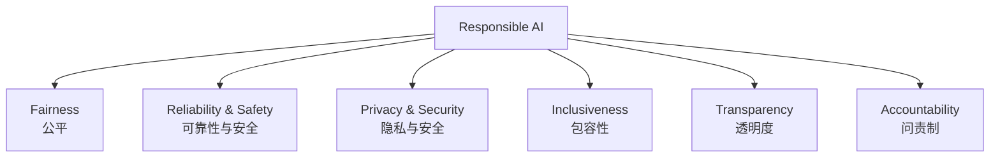
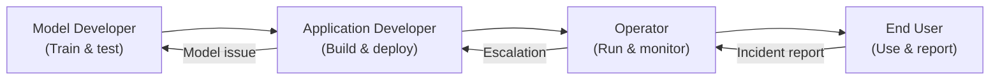

# 1. Microsoft's Responsible AI Principles

## 1.1 Agenda

**Estimated reading time:** ~13 minutes

### Learning Outcomes

- Define Responsible AI and articulate *(diễn đạt)* why it is a non-optional concern in modern AI development
- Describe each of Microsoft's 6 Responsible AI principles with a concrete example
- Identify real-world failures caused by violating *(vi phạm)* each principle
- Analyze *(phân tích)* scenarios where principles conflict *(xung đột)* and must be balanced *(cân bằng)*

---

## 1.2 Glossary

| Term | Quick Explanation |
| :--- | :--- |
| **Responsible AI** | Thực hành *(practice)* thiết kế, phát triển và triển khai *(deploy)* AI theo cách **công bằng**, **đáng tin cậy**, **bảo mật**, **bao trùm**, **minh bạch** và **có trách nhiệm** — để AI mang lại lợi ích cho con người và xã hội. |
| **Bias** *(Thiên lệch)* | Sai số hệ thống *(systematic error)* khiến AI đưa ra kết quả bất công *(unfair)* cho một nhóm người. Ví dụ: model tuyển dụng *(hiring)* từ chối *(reject)* ứng viên nữ nhiều hơn nam trong cùng điều kiện. |
| **Explainability** *(Khả năng giải thích)* | Khả năng lý giải *(reason)* tại sao model đưa ra một quyết định cụ thể — quan trọng khi quyết định ảnh hưởng đến cá nhân *(individual)*. |
| **Data minimization** *(Tối thiểu hóa dữ liệu)* | Nguyên tắc chỉ thu thập *(collect)* và lưu trữ *(store)* dữ liệu cá nhân cần thiết cho mục đích cụ thể — không thu thập dư thừa *(excess)*. |
| **Audit trail** *(Dấu vết kiểm toán)* | Lịch sử ghi lại *(log)* đầy đủ các quyết định, thay đổi, và hành động của hệ thống — giúp điều tra khi có sự cố *(incident)*. |
| **Disparate impact** *(Tác động không đồng đều)* | Khi một chính sách hoặc hệ thống AI tác động *(impact)* không công bằng đến các nhóm khác nhau — ngay cả khi không có ý định phân biệt đối xử *(discrimination)*. |
| **Oversight** *(Giám sát)* | Cơ chế *(mechanism)* đảm bảo con người có thể kiểm tra *(review)*, can thiệp *(intervene)*, và điều chỉnh *(adjust)* hành vi của hệ thống AI. |

---

## 2. Why Responsible AI Matters

### 2.1 The Stakes

AI systems now influence *(ảnh hưởng)* hiring decisions *(quyết định tuyển dụng)*, loan approvals *(phê duyệt vay)*, medical diagnoses *(chẩn đoán y tế)*, criminal sentencing *(bản án hình sự)*, and content that billions of people see daily. A biased *(thiên lệch)*, unreliable *(không đáng tin cậy)*, or opaque *(mờ đục)* AI system at scale causes systemic *(hệ thống)* harm far greater than any individual *(cá nhân)* human error.

### 2.2 Real-World AI Failures (What Happens Without Responsible AI)

| Year | Incident | Principle Violated |
| :--- | :--- | :--- |
| 2014 | Amazon's internal hiring AI downgraded *(hạ điểm)* résumés with the word "women's" | **Fairness** |
| 2016 | COMPAS recidivism *(tái phạm)* algorithm incorrectly flagged Black defendants as high-risk at twice the rate of white defendants | **Fairness + Accountability** |
| 2019 | Healthcare algorithm steered *(hướng)* sicker Black patients away from care programs due to cost proxy *(ủy quyền chi phí)* bias | **Fairness + Reliability** |
| 2021 | Deepfake audio used to impersonate *(giả danh)* a CEO, authorizing *(cho phép)* a $35M bank transfer | **Security + Accountability** |
| 2023 | LLM-generated legal brief cited *(trích dẫn)* non-existent *(không tồn tại)* court cases — submitted to federal court | **Reliability + Transparency** |

---

## 3. Microsoft's 6 Responsible AI Principles

---

## 4. Principle 1: Fairness *(Công bằng)*

### 4.1 Definition

> **Fairness** means AI systems should treat all people equitably *(công bằng)* — producing outcomes *(kết quả)* that do not systematically *(một cách hệ thống)* disadvantage *(gây bất lợi)* individuals or groups based on characteristics *(đặc điểm)* such as gender, race, age, nationality, or disability.

### 4.2 Types of Bias in AI

| Bias Type | Where It Enters | Example |
| :--- | :--- | :--- |
| **Historical bias** *(Thiên lệch lịch sử)* | Training data reflects past discrimination | Hiring model trained on historical hires replicates *(lặp lại)* past gender imbalances |
| **Representation bias** *(Thiên lệch đại diện)* | Training data underrepresents *(đại diện thiếu)* certain groups | Facial recognition less accurate for darker skin tones — not in training data |
| **Measurement bias** *(Thiên lệch đo lường)* | Proxy variable *(biến ủy quyền)* correlates with protected attribute | Using zip code *(mã bưu chính)* for credit scoring proxies *(thay thế)* for race |
| **Aggregation bias** *(Thiên lệch tổng hợp)* | Model trained on one group applied to another | Medical model trained on male patients performs worse for female patients |

### 4.3 Fairness vs. Accuracy Trade-off

> Optimizing purely *(hoàn toàn)* for accuracy can worsen *(làm tệ hơn)* fairness. If 95% of historical loan approvals went to Group A, a model that learns this pattern will be 95% accurate — and unfair.

**Practice:** Use group-level *(cấp độ nhóm)* fairness metrics alongside *(cùng với)* individual accuracy metrics. Accept *(chấp nhận)* a small accuracy reduction to achieve equitable outcomes *(kết quả công bằng)*.

---

## 5. Principle 2: Reliability & Safety *(Độ tin cậy & An toàn)*

### 5.1 Definition

> **Reliability & Safety** means AI systems should perform consistently *(nhất quán)* and as intended *(như dự định)* across the full range of conditions they may encounter — including edge cases *(trường hợp biên)*, adversarial inputs *(đầu vào đối nghịch)*, and distribution shifts *(dịch chuyển phân phối)*.

### 5.2 Key Dimensions

| Dimension | What It Means | Failure Example |
| :--- | :--- | :--- |
| **Robustness** *(Tính vững chắc)* | Performs well even on inputs slightly different *(hơi khác)* from training distribution | Autonomous *(tự động)* vehicle fails to detect pedestrian *(người đi bộ)* in rain *(mưa)* |
| **Fail-safe** *(An toàn khi lỗi)* | Defaults to a safe state when uncertain *(không chắc chắn)* | Medical diagnostic AI flags ambiguous *(mơ hồ)* cases for human review |
| **Predictable behavior** *(Hành vi có thể dự đoán)* | Same inputs produce consistent outputs | Generative AI produces dramatically *(đáng kể)* different summaries of the same document |
| **Monitoring** | Detects performance degradation *(suy giảm)* post-deployment | Model accuracy drops 15% after distribution shift — detected only after 3 months |

### 5.3 Reliability vs. Capability Trade-off

More capable *(có năng lực hơn)* AI systems are often less predictable. A rule-based *(dựa trên quy tắc)* system is 100% predictable but limited *(hạn chế)*; a deep learning system is more capable but may fail in unexpected *(bất ngờ)* ways. **Responsible AI requires being explicit *(rõ ràng)* about where this trade-off sits *(nằm)* for each deployment.**

---

## 6. Principle 3: Privacy & Security *(Quyền riêng tư & Bảo mật)*

### 6.1 Definition

> **Privacy & Security** means AI systems must protect *(bảo vệ)* individual privacy and resist *(chống lại)* security attacks throughout the entire lifecycle *(vòng đời)* — from data collection to deployment.

### 6.2 Privacy Risks in AI

| Phase | Risk | Mitigation *(Biện pháp)* |
| :--- | :--- | :--- |
| **Data Collection** | Collecting more PII than needed | Data minimization; collect only what is necessary |
| **Training** | Model memorizes *(ghi nhớ)* training examples including PII | Differential privacy *(quyền riêng tư vi phân)* techniques |
| **Inference** *(Suy diễn)* | API calls send user data to external model | Private endpoints; process data in-region *(trong khu vực)* |
| **Output** | Model reproduces *(tái tạo)* PII from training data | PII detection before sending to external API |
| **Storage** | Logs contain sensitive data longer than needed | Retention policies *(chính sách lưu giữ)*; automatic deletion *(xóa tự động)* |

### 6.3 Key Regulations *(Quy định)* to Know

| Regulation | Scope | Key AI Requirement |
| :--- | :--- | :--- |
| **GDPR** *(EU)* | All EU personal data | Right to explanation *(quyền giải thích)* for automated decisions; right to erasure *(xóa)*; data residency |
| **HIPAA** *(US)* | Healthcare data | PHI *(Protected Health Information)* cannot be sent to external AI APIs without BAA *(Business Associate Agreement)* |
| **AI Act** *(EU, 2024)* | High-risk AI systems | Mandatory *(bắt buộc)* conformity assessment *(đánh giá sự phù hợp)*; human oversight requirements |

---

## 7. Principle 4: Inclusiveness *(Tính bao trùm)*

### 7.1 Definition

> **Inclusiveness** means AI systems should be designed to work well for — and empower *(trao quyền)* — all people, regardless of *(bất kể)* ability, culture, language, socioeconomic status *(tình trạng kinh tế xã hội)*, age, or location.

### 7.2 Inclusion Dimensions

| Dimension | What It Requires |
| :--- | :--- |
| **Accessibility** *(Khả năng tiếp cận)* | AI-powered features work with screen readers *(trình đọc màn hình)*, keyboard navigation, and assistive technologies |
| **Language equity** *(Công bằng ngôn ngữ)* | NLP models perform consistently across languages — not just English |
| **Digital divide** *(Khoảng cách số)* | AI benefits should not be limited to those with high-speed internet or expensive devices |
| **Cultural sensitivity** *(Nhạy cảm văn hóa)* | AI should not impose *(áp đặt)* one cultural norm as a universal standard |
| **Ability diversity** | Speech recognition works for different accents, speech impediments *(khiếm khuyết ngôn ngữ)*, and pace *(tốc độ)* |

### 7.3 Inclusiveness vs. Performance Trade-off

A model may achieve 95% accuracy overall *(tổng thể)* but only 78% for non-English speakers. Reporting only the aggregate *(tổng hợp)* number hides *(che giấu)* this gap. **Responsible AI requires disaggregated *(phân tách)* evaluation across user subgroups.**

---

## 8. Principle 5: Transparency *(Minh bạch)*

### 8.1 Definition

> **Transparency** means AI systems and their limitations should be understandable *(có thể hiểu được)* to all stakeholders — developers, users, regulators, and the people affected *(bị ảnh hưởng)* by AI decisions.

### 8.2 Layers of Transparency

| Layer | Who It Serves | Example |
| :--- | :--- | :--- |
| **Model transparency** | Data scientists, regulators | Which features *(đặc trưng)* most influence *(ảnh hưởng)* loan approval predictions? |
| **Decision transparency** | End users affected by decisions | "Your loan was declined because your debt-to-income *(tỷ lệ nợ/thu nhập)* ratio exceeds our threshold *(ngưỡng)*." |
| **System transparency** | Developers, operators | What data was used to train this model? What are its known limitations? |
| **Process transparency** | Regulators, auditors | How was the model tested for bias? Who approved the deployment? |
| **User-level disclosure** *(Tiết lộ)* | All users | "You are interacting with an AI system, not a human." |

### 8.3 Transparency Note (Microsoft's Tool)

Microsoft publishes **Transparency Notes** for each Azure AI service — documents that explain:
- What the service does and doesn't do
- Known limitations and failure cases
- Appropriate *(phù hợp)* and inappropriate use cases
- Data and privacy practices

> **Practice:** Before deploying any Azure AI service, read its Transparency Note. This is also an AI-900 exam topic.

---

## 9. Principle 6: Accountability *(Trách nhiệm)*

### 9.1 Definition

> **Accountability** means there should be clear *(rõ ràng)* human ownership *(quyền sở hữu)* and responsibility for AI systems — including establishing oversight *(thiết lập giám sát)*, defining who answers for failures, and creating mechanisms *(cơ chế)* to detect and correct *(sửa chữa)* problems.

### 9.2 The Accountability Chain

Each party *(bên)* in the chain has defined responsibilities. "The AI did it" is not a valid defense *(bào chữa)* — humans at each layer are accountable for the decisions made within their scope *(phạm vi)*.

### 9.3 Accountability Mechanisms

| Mechanism | What It Provides |
| :--- | :--- |
| **Audit trails** *(Dấu vết kiểm toán)* | Record *(ghi lại)* every AI decision with timestamp, input, output, model version |
| **Human-in-the-loop** | High-stakes decisions require human review before action |
| **Override capability** *(Khả năng ghi đè)* | Humans can always reverse *(đảo ngược)* or override *(ghi đè)* an AI decision |
| **Incident response** *(Phản hồi sự cố)* | Clear *(rõ ràng)* process to identify, report, and remediate *(khắc phục)* AI failures |
| **Governance board** *(Hội đồng quản trị)* | Cross-functional *(liên chức năng)* team responsible for reviewing high-risk AI deployments |

---

## 10. When Principles Conflict

The six principles are not always compatible *(tương thích)*:

| Conflict | Example | Resolution Approach |
| :--- | :--- | :--- |
| **Fairness vs. Accuracy** | Enforcing *(áp đặt)* equal false positive rates across groups reduces *(giảm)* overall accuracy | Define *(xác định)* which fairness criterion matters most for this use case |
| **Transparency vs. Security** | Publishing model details enables adversarial attacks *(tấn công đối nghịch)* | Selective *(chọn lọc)* disclosure — share enough for oversight, not enough to exploit *(khai thác)* |
| **Privacy vs. Fairness** | Fairness analysis needs demographic data; collecting it raises *(đặt ra)* privacy concerns | Anonymized *(ẩn danh)* demographic proxies *(đại diện)* or consent-based *(dựa trên đồng ý)* collection |
| **Reliability vs. Inclusiveness** | Optimizing for the majority group improves average reliability but reduces equity | Stratified *(phân tầng)* testing across subgroups; set minimum *(tối thiểu)* performance thresholds for all |

> **AI-900 key insight:** Responsible AI is not a checklist — it is an ongoing *(liên tục)* balancing act *(hành động cân bằng)* requiring human judgment *(phán xét)* at every stage.

---

## 11. Discussion Questions

**Q1 — Fairness Definition Conflict:**
A bank's loan approval model is audited *(kiểm toán)*. Auditor A argues the model is unfair because the approval rate *(tỷ lệ phê duyệt)* for Group A is 70% vs. 55% for Group B *(demographic parity *(ngang bằng nhân khẩu học)* violation)*. Auditor B argues it is fair because both groups have the same default rate *(tỷ lệ vỡ nợ)* among those approved *(equalized odds *(cơ hội bình đẳng)*)*. Can both auditors be correct simultaneously *(đồng thời)*? What does this reveal about the concept of "fair AI"?

**Q2 — Transparency Limits:**
A hospital uses an AI triage *(phân loại)* system to prioritize *(ưu tiên)* patients in the emergency room *(phòng cấp cứu)*. Patients ask what factors influenced their priority score. The hospital's legal team argues that full transparency creates liability *(trách nhiệm pháp lý)* risk and enables gaming *(gian lận)*. A patient rights advocate argues opacity *(sự mờ đục)* violates patients' rights. How should the hospital balance *(cân bằng)* transparency with these legitimate *(hợp lý)* competing concerns?

**Q3 — Accountability Without Precedent *(Tiền lệ)*:**
In 2023, an LLM hallucinated court case citations in a legal brief filed by a lawyer. The judge found *(phát hiện)* the lawyer responsible — not the AI vendor *(nhà cung cấp)*, not Microsoft, not OpenAI. Do you agree with this assignment of accountability *(phân công trách nhiệm)*? What obligations *(nghĩa vụ)* does each party — the lawyer, the law firm *(công ty luật)*, the AI vendor, and the platform provider — have under an accountability framework *(khung trách nhiệm)*?

---

*Made by Anh Tu - Share to be share*
