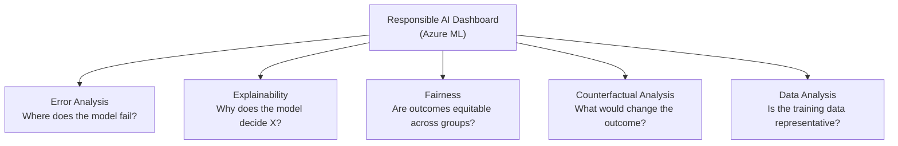

# 2. Azure Tools for Responsible AI

## 2.1 Agenda

**Estimated reading time:** ~11 minutes

### Learning Outcomes

- Map each Responsible AI principle to specific *(cụ thể)* Azure tools that implement it
- Describe the five components of the Azure ML Responsible AI Dashboard
- Explain how Transparency Notes function as a governance *(quản trị)* artifact *(tài liệu)*
- Apply the Responsible AI lifecycle *(vòng đời)* framework across all AI workload types

---

## 2.2 Glossary

| Term | Quick Explanation |
| :--- | :--- |
| **Responsible AI Dashboard** | Bảng điều khiển *(dashboard)* tích hợp *(integrated)* trong Azure ML — tổng hợp *(consolidate)* 5 công cụ RAI thành một giao diện *(interface)* để phân tích model về công bằng, giải thích, và lỗi. |
| **Fairlearn** | Thư viện mã nguồn mở *(open-source library)* của Microsoft — phân tích *(analyze)* model để phát hiện *(detect)* sự chênh lệch *(disparity)* hiệu năng giữa các nhóm nhân khẩu học *(demographic groups)*. |
| **InterpretML** | Thư viện giải thích *(explainability library)* mã nguồn mở của Microsoft — cung cấp *(provide)* cả giải thích toàn cục *(global)* lẫn cục bộ *(local)* cho mọi ML model. |
| **SHAP** | SHapley Additive exPlanations — phương pháp tính toán *(compute)* đóng góp *(contribution)* của từng feature vào dự đoán *(prediction)* cụ thể của model. |
| **Error Analysis** | Công cụ xác định *(identify)* các nhóm dữ liệu *(data cohorts)* có tỷ lệ lỗi *(error rate)* cao bất thường — giúp phát hiện failure modes *(chế độ thất bại)* có hệ thống *(systematic)*. |
| **Counterfactual Analysis** *(Phân tích phản thực)* | "Điều gì phải thay đổi trong input để output thay đổi?" — ví dụ: "Nếu thu nhập tăng thêm 5 triệu, vay sẽ được duyệt không?" |
| **Transparency Note** *(Ghi chú minh bạch)* | Tài liệu chính thức *(official document)* của Microsoft mô tả cách hoạt động *(how it works)*, giới hạn *(limitations)*, và trường hợp sử dụng phù hợp *(appropriate use cases)* của mỗi dịch vụ Azure AI. |
| **Content credential** *(Thông tin xác thực nội dung)* | Metadata được nhúng *(embedded)* vào file media để xác minh *(verify)* tính xác thực *(authenticity)* — giúp phân biệt nội dung AI-generated với nội dung thật. |

---

## 3. Responsible AI Principle → Azure Tool Mapping

| Principle | Azure Tool / Feature |
| :--- | :--- |
| **Fairness** | Fairlearn, RAI Dashboard — Fairness Analysis |
| **Reliability & Safety** | Azure ML — Error Analysis, Model Monitoring; Azure AI Content Safety |
| **Privacy & Security** | Azure AI Language — PII Detection; Azure Private Link; RBAC; Encryption at rest & transit |
| **Inclusiveness** | Azure AI Speech — Custom Speech for accent support; multilingual model testing in RAI Dashboard |
| **Transparency** | InterpretML, RAI Dashboard — Model Explainability; Transparency Notes; Counterfactual Analysis |
| **Accountability** | Azure ML — Audit Logs, Model Registry with lineage *(dõi nguồn gốc)*; Azure Monitor; Azure Policy |

---

## 4. Azure ML Responsible AI Dashboard

The **Responsible AI Dashboard** in Azure Machine Learning is the flagship *(hàng đầu)* tool for operationalizing *(vận hành hóa)* RAI for custom ML models. It brings five components into a single integrated *(tích hợp)* workflow:

### 4.1 Component 1: Error Analysis

> **What it does:** Identifies subgroups *(nhóm con)* of your data where the model has disproportionately *(không cân xứng)* high error rates *(tỷ lệ lỗi)*.

**Why it matters:** A model with 92% overall accuracy may have 45% error rate for patients over 75, or for low-income applicants. Aggregate *(tổng hợp)* accuracy hides these systematic failures *(thất bại có hệ thống)*.

**Output:** Decision tree *(cây quyết định)* of data cohorts ranked by error rate — showing *where* the model breaks, not just *how often*.

### 4.2 Component 2: Model Explainability

> **What it does:** Shows which features most influence *(ảnh hưởng)* the model's predictions — globally *(toàn cục)* and per-instance *(từng cá thể)*.

| Explainability Type | Level | Question Answered |
| :--- | :--- | :--- |
| **Global *(Toàn cục)*** | Entire model | "Overall, which features drive *(dẫn dắt)* this model's predictions?" |
| **Local *(Cục bộ)*** | Single prediction | "Why did this specific person's loan get rejected?" |

**Technology:** Uses InterpretML and SHAP values internally. No ML expertise required to interpret the visual dashboard.

### 4.3 Component 3: Fairness Analysis

> **What it does:** Compares model performance *(hiệu năng)* across demographic groups *(nhóm nhân khẩu)* — identifying *(xác định)* where outcomes are inequitable *(bất công bằng)*.

**Fairness metrics available:**

| Metric | Definition | Exam Tip |
| :--- | :--- | :--- |
| **Demographic parity** *(Ngang bằng nhân khẩu)* | Equal positive outcome rate across groups | Focuses on equal outcomes regardless of qualifications *(điều kiện)* |
| **Equal opportunity** *(Cơ hội bình đẳng)* | Equal True Positive Rate *(tỷ lệ dương đúng)* across groups | Focuses on equal treatment of qualified individuals *(cá nhân đủ điều kiện)* |
| **Equalized odds** *(Cơ hội cân bằng)* | Equal TPR *and* FPR across groups | Strictest fairness criterion *(tiêu chí)* — hardest to achieve *(đạt được)* |

### 4.4 Component 4: Counterfactual Analysis

> **What it does:** Generates "what-if" scenarios — what minimal *(tối thiểu)* changes to the input would flip *(đảo ngược)* the model's prediction.

**Application in regulated industries:**
- Banking: "Your loan was declined. If your income were 10% higher, you would be approved." → actionable *(có thể hành động)* transparency for the user
- Healthcare: "This patient is predicted low-risk. If their blood pressure rises above 140, the prediction changes." → identifies *(xác định)* sensitive thresholds for clinical monitoring *(giám sát lâm sàng)*

### 4.5 Component 5: Data Analysis

> **What it does:** Profiles *(phân tích)* the dataset to identify *(xác định)* class imbalance *(mất cân bằng lớp)*, missing *(thiếu)* values, and distribution differences between training *(huấn luyện)* and test *(kiểm tra)* sets.

**Key checks:**
- Feature distribution *(phân phối)* per cohort — is the model seeing the same distribution it was trained on?
- Label distribution — is the dataset skewed *(nghiêng)* toward one class?
- Coverage *(độ bao phủ)* across demographic attributes

---

## 5. Azure AI Content Safety

For generative AI and any user-generated content platform, **Azure AI Content Safety** provides real-time *(thời gian thực)* content moderation *(kiểm duyệt nội dung)*:

### 5.1 Content Safety Capabilities

| Capability | What It Detects |
| :--- | :--- |
| **Text moderation** | Hate, violence, sexual, self-harm content in text |
| **Image moderation** | Harmful content in images — adult, violent, or sensitive visuals |
| **Prompt Shields** | Jailbreak attempts *(cố gắng vượt rào)* and indirect prompt injection attacks |
| **Groundedness Detection** | Ungrounded *(không có cơ sở)* claims in RAG outputs — catches hallucinations *(ảo giác)* |
| **Protected Material Detection** | Identifies if generated content matches *(khớp)* copyrighted text or code |
| **Custom Categories** | Define *(xác định)* your own content categories for domain-specific moderation |

### 5.2 Safety Severity Levels

Azure AI Content Safety returns a **severity score (0–6)** per category:

| Score | Meaning | Default Action |
| :--- | :--- | :--- |
| 0 | Safe | Allow |
| 2 | Low severity | Allow (log for review) |
| 4 | Medium severity | Block or require human review |
| 6 | High severity | Block immediately |

Developers set *(thiết lập)* custom thresholds *(ngưỡng)* per category based on application context *(ngữ cảnh ứng dụng)*.

---

## 6. Transparency Notes

**Transparency Notes** are official Microsoft documents published for each Azure AI service. They are the primary *(chính)* mechanism *(cơ chế)* through which Microsoft operationalizes *(vận hành)* the Transparency principle.

### 6.1 Structure of a Transparency Note

| Section | Content |
| :--- | :--- |
| **What is [service]?** | Plain-language *(ngôn ngữ đơn giản)* description of what the service does |
| **Key terms** | Definitions of technical concepts *(khái niệm kỹ thuật)* relevant to the service |
| **Use cases** | Scenarios where the service is appropriate *(phù hợp)* |
| **Limitations** | Known failure modes, accuracy variations *(biến đổi)* by language/accent/demographic |
| **Not appropriate uses** | Explicitly *(rõ ràng)* prohibited *(bị cấm)* or inadvisable *(không nên)* applications |
| **Data, privacy, security** | What data is processed, retained *(giữ lại)*, and how it is protected *(bảo vệ)* |

### 6.2 Exam Note

> AI-900 may ask: *"What Azure tool helps you understand the limitations and appropriate uses of an AI service before deploying it?"* → **Transparency Note**.

---

## 7. Responsible AI Across the AI Lifecycle

The RAI principles and tools apply at every phase of the AI development lifecycle:

| Phase | RAI Activity | Key Tool / Action |
| :--- | :--- | :--- |
| **Problem Definition** | Define *(xác định)* intended use and explicitly *(rõ ràng)* out-of-scope *(ngoài phạm vi)* uses | AI Impact Assessment *(Đánh giá tác động)* |
| **Data Collection** | Check representation *(đại diện)* across demographic groups | Data Analysis (RAI Dashboard) |
| **Data Preparation** | Detect class imbalance; remove *(xóa)* unnecessary *(không cần thiết)* PII | Fairlearn; PII Detection |
| **Model Training** | Apply fairness constraints *(ràng buộc)*; log all experiments | RAI Dashboard; Azure ML Experiment Tracking |
| **Model Evaluation** | Disaggregated *(phân tách)* evaluation by subgroup *(nhóm con)*; error analysis | Error Analysis; Fairness Analysis |
| **Pre-deployment** | Red-team *(kiểm tra đối nghịch)* the system; read *(đọc)* Transparency Note | Prompt Shields; Transparency Notes |
| **Deployment** | Content filters; user disclosure *(tiết lộ)* that it's AI | Content Safety; System Message design |
| **Post-deployment** | Monitor *(giám sát)* for drift *(trôi dạt)*, fairness degradation *(suy giảm)*; maintain *(duy trì)* audit logs | Azure Monitor; Model Monitor in Azure ML |

---

## 8. Discussion Questions

**Q1 — RAI Dashboard in Production:**
A bank deploys a mortgage *(thế chấp)* approval model. Six months after launch, a journalist publishes an article showing that approval rates differ by 22 percentage points between ZIP codes in predominantly *(chủ yếu)* minority *(thiểu số)* vs. majority *(đa số)* neighborhoods. What RAI Dashboard component would have detected this before deployment? What specific metric would you have examined?

**Q2 — Content Safety Calibration *(Hiệu chỉnh)*:**
A children's education platform *(nền tảng giáo dục trẻ em)* uses Azure OpenAI with maximum safety filters. A teacher reports that students cannot discuss the historical *(lịch sử)* context of wars *(chiến tranh)* because any mention of "violence" triggers *(kích hoạt)* the maximum severity block. Meanwhile *(trong khi đó)*, a corporate productivity tool *(công cụ năng suất)* uses minimal *(tối thiểu)* filters because users are all adults. Both use the same Azure AI Content Safety service. What does this illustrate about the role of **application context** in Responsible AI, and who bears *(chịu)* the responsibility for appropriate *(phù hợp)* configuration?

**Q3 — Transparency Note as Due Diligence *(Thẩm định)*:**
A developer deploys Azure AI Face to a client's HR system for "automated interview assessment *(đánh giá phỏng vấn tự động)*" — scoring candidates on facial expressions *(biểu cảm khuôn mặt)*. If the developer had read the Azure AI Face Transparency Note, what would they have found? Is this a valid use case for the service? What accountability *(trách nhiệm)* does the developer bear if the system causes discriminatory *(phân biệt đối xử)* outcomes *(kết quả)*?

---

*Made by Anh Tu - Share to be share*
