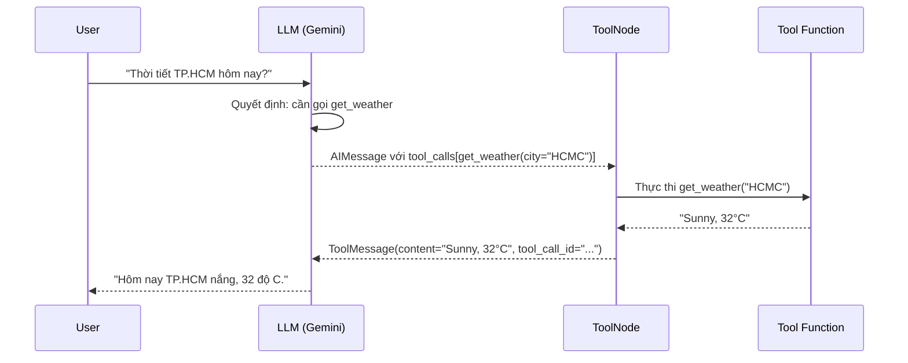

# 1.3. Tools: Công Cụ Của Agent

## Agenda

**Thời gian đọc ước tính:** ~15 phút

### Learning outcome:

- Định nghĩa được **Tool** là gì và tại sao agent không thể thiếu nó.
- Tạo được **custom tool** với Zod schema và 3 kiểu return value khác nhau.
- Giải thích được sự khác biệt giữa **string**, **object**, và **Command** return.
- Phân biệt được **static tools** và **dynamic tool selection** — khi nào dùng cái nào.

---

## Glossary & Vocabulary

**1. Technical Terms (Thuật ngữ kỹ thuật):**

| Term | Vietnamese Meaning & Quick Explain |
| :--- | :--- |
| **Tool** | Công cụ — callable function với input/output được định nghĩa rõ ràng, LLM gọi khi cần. |
| **Tool Schema** | Lược đồ công cụ — Zod schema định nghĩa tên, mô tả, và kiểu dữ liệu của input. |
| **ToolMessage** | Kết quả trả về của tool sau khi thực thi, gửi ngược lại cho LLM. |
| **ToolNode** | Prebuilt node trong LangGraph — thực thi tools song song, xử lý lỗi tự động. |
| **bindTools()** | Phương thức gắn tool schema vào LLM để nó "biết" có những tools nào. |
| **tool_calls** | Mảng trong AIMessage — chứa danh sách tool LLM muốn gọi kèm arguments. |
| **Command** | Object trong LangGraph cho phép tool cập nhật trực tiếp graph state. |
| **Dynamic Tool Selection** | Cơ chế lọc tools tại runtime dựa trên quyền, context, hoặc feature flags. |

**2. Vocabulary Support (Từ vựng học thuật/B1+):**

| Word | Meaning in Context |
| :--- | :--- |
| **Callable (adj)** | Có thể gọi được — nói về function hoặc object có thể thực thi như một function. |
| **Schema (n)** | Lược đồ — cấu trúc dữ liệu được khai báo trước, dùng để validate input/output. |
| **Invoke (v)** | Gọi thực thi — chạy một function hoặc tool với arguments cụ thể. |
| **Middleware (n)** | Lớp trung gian — code chạy trước/sau một operation để transform hoặc filter. |
| **Short-circuit (v)** | Dừng sớm — bỏ qua các bước còn lại khi một điều kiện đã thỏa mãn. |

---

## 1. Vấn đề & Giải pháp

**Vấn đề (Problem Statement):**

- LLM thuần túy bị giới hạn trong context window — không truy cập được dữ liệu real-time (giá cổ phiếu, thời tiết, database).
- LLM không thực thi được code, không ghi file, không gọi API bên ngoài.
- Không có cơ chế chuẩn hóa để LLM "biết" khi nào và cách nào tương tác với hệ thống bên ngoài.

**Giải pháp (Solution):**

Tools là cầu nối giữa LLM và thế giới bên ngoài. Mỗi tool là một function được mô tả bằng **schema** — LLM đọc `name` và `description` để quyết định có cần gọi tool không, đọc `schema` để biết phải truyền argument gì.

:::info Ai thực thi tool?

LLM chỉ **quyết định** gọi tool nào với argument gì — phát ra `tool_calls` trong `AIMessage`. Việc **thực thi** function thực tế là do ứng dụng của bạn (hoặc `ToolNode`) đảm nhiệm. Tách biệt này là thiết kế có chủ ý để kiểm soát side effects.

:::

---

## 2. Kiến Trúc Tool Trong Agent Loop



**Chuỗi sự kiện:**

1. LLM nhận câu hỏi, quyết định cần thông tin thời tiết.
2. LLM phát ra `tool_calls` trong `AIMessage` — đây là **ý định**, không phải lệnh thực thi.
3. `ToolNode` nhận `AIMessage`, gọi function thực tế.
4. Kết quả được đóng gói thành `ToolMessage` và gửi lại cho LLM.
5. LLM tổng hợp và trả lời người dùng.

---

## 3. Tạo Tool Cơ Bản

### 3.1. Basic Tool Definition

```typescript
// filename: tools/basic.ts

import * as z from "zod";
import { tool } from "@langchain/core/tools";

// Schema Zod = "hợp đồng" giữa LLM và function
// LLM đọc description để biết WHEN để gọi tool này
const searchDatabase = tool(
  ({ query, limit }) => `Found ${limit} results for '${query}'`,
  {
    name: "search_database",
    // description QUAN TRỌNG: LLM dùng để quyết định có nên gọi không
    description: "Search the customer database for records matching the query.",
    schema: z.object({
      query: z.string().describe("Search terms to look for"),
      limit: z.number().describe("Maximum number of results to return"),
    }),
  }
);
```

**Hai thành phần bắt buộc:**
- **Function implementation:** Logic thực tế (gọi API, query DB, tính toán...)
- **Tool metadata:** `name`, `description`, `schema` — LLM chỉ thấy phần này

### 3.2. Gắn Tools Vào LLM

```typescript
// filename: agent/setup.ts

import { ChatGoogleGenerativeAI } from "@langchain/google-genai";

const model = new ChatGoogleGenerativeAI({
  model: "gemini-2.5-flash",
  temperature: 0,
});

// bindTools = gửi tool schema cho LLM qua system prompt ẩn
// LLM sẽ output tool_calls khi cần dùng tool
const modelWithTools = model.bindTools([searchDatabase]);

const response = await modelWithTools.invoke("Tìm 5 khách hàng tên Nguyễn");
console.log(response.tool_calls);
// [{ name: "search_database", args: { query: "Nguyễn", limit: 5 }, id: "..." }]
```

---

## 4. Ba Kiểu Return Value

Lựa chọn return type ảnh hưởng trực tiếp đến cách LLM xử lý kết quả tiếp theo.

### 4.1. Return String — Kết Quả Dạng Văn Bản

Dùng khi kết quả là text thuần túy, LLM cần đọc và tổng hợp:

```typescript
// filename: tools/string-return.ts

const getWeather = tool(
  ({ city }) => `It is currently sunny in ${city}.`,  // String return
  {
    name: "get_weather",
    description: "Get current weather for a city.",
    schema: z.object({ city: z.string() }),
  }
);
```

**Luồng xử lý:**
- Return value → tự động chuyển thành `ToolMessage.content`
- LLM nhận `ToolMessage`, đọc text, quyết định bước tiếp
- Không thay đổi graph state

### 4.2. Return Object — Kết Quả Có Cấu Trúc

Dùng khi LLM cần truy cập từng field riêng lẻ để suy luận:

```typescript
// filename: tools/object-return.ts

const getWeatherData = tool(
  ({ city }) => ({
    city,
    temperature_c: 32,
    humidity: 85,
    conditions: "sunny",
    // LLM có thể đọc từng field: temperature_c, humidity...
  }),
  {
    name: "get_weather_data",
    description: "Get structured weather data for a city.",
    schema: z.object({ city: z.string() }),
  }
);
```

**Khi nào dùng:** Downstream reasoning cần truy cập fields cụ thể thay vì đọc text tự do.

### 4.3. Return Command — Cập Nhật Graph State

Dùng khi tool cần thay đổi state của agent, không chỉ trả dữ liệu:

```typescript
// filename: tools/command-return.ts

import { Command } from "@langchain/langgraph";
import { ToolMessage, type ToolRuntime } from "@langchain/core/tools";

const setUserLanguage = tool(
  async ({ language }, config: ToolRuntime) => {
    // Command.update = cập nhật graph state trực tiếp
    return new Command({
      update: {
        preferredLanguage: language,  // Cập nhật state key "preferredLanguage"
        messages: [
          new ToolMessage({
            content: `Language set to ${language}.`,
            // toolCallId phải khớp với ID trong AIMessage.tool_calls
            tool_call_id: config.toolCallId,
          }),
        ],
      },
    });
  },
  {
    name: "set_language",
    description: "Set the preferred response language for this session.",
    schema: z.object({ language: z.string() }),
  }
);
```

:::tip Khi nào dùng Command?

Khi tool không chỉ **truy xuất** dữ liệu mà còn **thay đổi** trạng thái hệ thống: set preferences, update user data, trigger side effects. Với parallel tool calls, dùng reducers để tránh xung đột khi nhiều tools cùng cập nhật một key.

:::

---

## 5. ToolNode: Thực Thi Tools Trong LangGraph

`ToolNode` là prebuilt node xử lý việc thực thi tools tự động — song song, với error handling:

```typescript
// filename: agent/toolnode-example.ts

import { ToolNode } from "@langchain/langgraph/prebuilt";
import { tool } from "@langchain/core/tools";
import * as z from "zod";

const getWeather = tool(
  ({ city }) => `Sunny, 32°C in ${city}`,
  {
    name: "get_weather",
    description: "Get weather for a city.",
    schema: z.object({ city: z.string() }),
  }
);

const convertCurrency = tool(
  ({ amount, from, to }) => `${amount} ${from} = ${amount * 25000} ${to}`,
  {
    name: "convert_currency",
    description: "Convert currency amount.",
    schema: z.object({
      amount: z.number(),
      from: z.string(),
      to: z.string(),
    }),
  }
);

// ToolNode nhận mảng tools — tự động lookup và thực thi
const toolNode = new ToolNode([getWeather, convertCurrency]);
```

**ToolNode tự động:**
- Thực thi nhiều tool calls **song song** (`Promise.all` internally)
- Xử lý lỗi và trả về error message cho LLM thay vì crash
- Map `tool_call_id` đúng vào từng `ToolMessage`

---

## 6. Dynamic Tool Selection

Không phải lúc nào cũng nên cung cấp toàn bộ tools cho LLM — quá nhiều tools làm tăng context, tăng lỗi. Dynamic selection cho phép lọc tools theo runtime conditions.

### 6.1. Filter Theo User Role

```typescript
// filename: middleware/tool-filter.ts

import { createMiddleware } from "langchain";
import * as z from "zod";

const contextSchema = z.object({
  userRole: z.enum(["admin", "editor", "viewer"]),
});

const roleBasedTools = createMiddleware({
  name: "RoleBasedTools",
  contextSchema,
  wrapModelCall: (request, handler) => {
    const userRole = request.runtime.context.userRole;

    let filteredTools = request.tools;

    if (userRole === "admin") {
      // Admin: toàn bộ tools
    } else if (userRole === "editor") {
      // Editor: bỏ delete tools
      filteredTools = request.tools.filter((t) => t.name !== "delete_data");
    } else {
      // Viewer: chỉ read-only tools
      filteredTools = request.tools.filter(
        (t) => (t.name as string).startsWith("read_")
      );
    }

    return handler({ ...request, tools: filteredTools });
  },
});
```

### 6.2. Runtime Tool Registration (MCP / External)

Khi tools được load từ MCP server hoặc database tại runtime:

```typescript
// filename: middleware/dynamic-tools.ts

import { createMiddleware, tool } from "langchain";
import * as z from "zod";

// Tool được tạo động tại runtime (ví dụ: load từ MCP server)
const dynamicCalculator = tool(
  ({ expression }) => String(eval(expression)),
  {
    name: "calculate",
    description: "Evaluate a math expression.",
    schema: z.object({ expression: z.string() }),
  }
);

const dynamicToolMiddleware = createMiddleware({
  name: "DynamicToolMiddleware",
  wrapModelCall: (request, handler) => {
    // Thêm dynamic tool vào request trước khi gửi cho LLM
    return handler({
      ...request,
      tools: [...request.tools, dynamicCalculator],
    });
  },
  wrapToolCall: (request, handler) => {
    // Handle execution của dynamic tool
    if (request.toolCall.name === "calculate") {
      return handler({ ...request, tool: dynamicCalculator });
    }
    return handler(request);
  },
});
```

**Trade-off:**

| | Static Tools | Dynamic Selection |
| :--- | :--- | :--- |
| **Setup** | Đơn giản | Phức tạp hơn |
| **Context window** | Lớn hơn (tất cả tools) | Nhỏ hơn (chỉ tools cần thiết) |
| **Phù hợp khi** | Tool set nhỏ, cố định | Multi-tenant, RBAC, MCP |

---

## 7. Prebuilt Tools

LangChain cung cấp sẵn nhiều tools thông dụng trong `@langchain/community`:

```typescript
// filename: tools/prebuilt.ts

import { TavilySearchResults } from "@langchain/community/tools/tavily_search";
import { Calculator } from "@langchain/community/tools/calculator";

// Web search tool — cần TAVILY_API_KEY trong env
const searchTool = new TavilySearchResults({
  maxResults: 5,
});

// Calculator — tính toán an toàn, không dùng eval()
const calculator = new Calculator();

const modelWithTools = model.bindTools([searchTool, calculator]);
```

Danh sách đầy đủ: [LangChain Tools & Toolkits](https://docs.langchain.com/oss/javascript/integrations/tools)

---

## Discussion Questions

1. **Tại sao `description` lại quan trọng hơn `name` trong tool schema?** LLM dùng thông tin nào để quyết định gọi tool?

2. **Return `string` vs `object` vs `Command` — điều gì xảy ra với mỗi loại trong graph state?** Khi nào bạn cần `Command`?

3. **Với parallel tool calls** (LLM gọi 2 tools cùng lúc cùng update một state key), điều gì xảy ra nếu không có reducer? Cách fix?

4. **Dynamic tool selection có trade-off gì** so với static tools? Trong hệ thống production multi-tenant, bạn sẽ chọn approach nào?

---

## References

- [LangChain Tools (JS)](https://docs.langchain.com/oss/javascript/langchain/tools) — **Nguồn chính của bài này**
- [LangGraph — Workflows and Agents: ToolNode](https://docs.langchain.com/oss/javascript/langgraph/workflows-agents#toolnode) — ToolNode prebuilt
- [LangChain Tools & Toolkits Integration](https://docs.langchain.com/oss/javascript/integrations/tools) — Danh sách prebuilt tools

---

*Made by Anh Tu - Share to be share*
