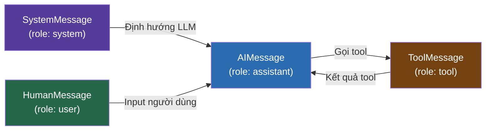

# 1.4. Messages: Ngôn Ngữ Của Agent

## Agenda

**Thời gian đọc ước tính:** ~12 phút

### Learning outcome:

- Phân biệt được 4 loại **Message** và biết khi nào dùng loại nào.
- Hiểu được **message history** là short-term memory của agent.
- Đọc được thông tin quan trọng từ `AIMessage`: `tool_calls`, `usage_metadata`.
- Biết cách dùng `ToolMessage` để đóng vòng lặp agent sau khi tool thực thi.

---

## Glossary & Vocabulary

**1. Technical Terms (Thuật ngữ kỹ thuật):**

| Term | Vietnamese Meaning & Quick Explain |
| :--- | :--- |
| **Message** | Thông điệp — đơn vị cơ bản truyền dữ liệu giữa người dùng, agent, và tools. |
| **Role** | Vai trò — xác định nguồn gốc của message: `system`, `user`, `assistant`, `tool`. |
| **SystemMessage** | Hướng dẫn khởi tạo — định hình hành vi, tông giọng, và giới hạn của LLM. |
| **HumanMessage** | Input từ người dùng — text, ảnh, audio, file. |
| **AIMessage** | Response từ LLM — chứa text, tool_calls, và usage metadata. |
| **ToolMessage** | Kết quả thực thi tool — gửi lại cho LLM để tiếp tục suy luận. |
| **tool_call_id** | ID khớp giữa `AIMessage.tool_calls[i].id` và `ToolMessage.tool_call_id`. |
| **usage_metadata** | Metadata sử dụng token: input_tokens, output_tokens, total_tokens. |
| **Multimodal** | Đa phương thức — content không chỉ là text mà còn là ảnh, audio, video. |
| **ContentBlock** | Khối nội dung có cấu trúc — LangChain standard format cho multimodal content. |

**2. Vocabulary Support (Từ vựng học thuật/B1+):**

| Word | Meaning in Context |
| :--- | :--- |
| **Stateless (adj)** | Không có trạng thái — mỗi lần gọi LLM là độc lập, không nhớ lần trước. |
| **Payload (n)** | Dữ liệu chính — phần nội dung thực sự của message (content). |
| **Serialize (v)** | Tuần tự hóa — chuyển object thành dạng có thể lưu/truyền (JSON). |
| **Provider-agnostic (adj)** | Không phụ thuộc vào nhà cung cấp — hoạt động với Gemini, OpenAI, Claude. |
| **Reasoning (n)** | Suy luận — quá trình LLM "suy nghĩ" trước khi trả lời (hiển thị trong thinking blocks). |

---

## 1. Vấn đề & Giải pháp

**Vấn đề (Problem Statement):**

- LLM là stateless — mỗi API call là độc lập, không có "bộ nhớ" tự động.
- Mỗi provider (OpenAI, Anthropic, Google) có format message riêng → code không portable.
- Khi agent dùng tools, cần cơ chế chuẩn để truyền tool results trở lại cho LLM.

**Giải pháp (Solution):**

LangChain chuẩn hóa tất cả interactions qua 4 loại Message objects. Code viết một lần, chạy được với mọi LLM provider. Message history được duy trì bằng cách **append** vào array và gửi toàn bộ lên LLM mỗi lần — đây chính là short-term memory của agent.

---

## 2. Bốn Loại Message



### 2.1. SystemMessage — Định Hướng LLM

`SystemMessage` là tập lệnh khởi tạo — đặt "tính cách", giới hạn, và bối cảnh cho LLM trước khi nhận input người dùng:

```typescript
// filename: messages/system.ts

import { SystemMessage, HumanMessage } from "@langchain/core/messages";
import { ChatGoogleGenerativeAI } from "@langchain/google-genai";

const model = new ChatGoogleGenerativeAI({
  model: "gemini-2.5-flash",
  temperature: 0,
});

// SystemMessage định hình toàn bộ session
const systemMsg = new SystemMessage(`
You are a senior TypeScript developer specializing in LangChain.js.
Always provide code examples with TypeScript type annotations.
Point out potential bugs and suggest improvements.
`);

const response = await model.invoke([
  systemMsg,
  new HumanMessage("How do I create a retry mechanism for tools?"),
]);
```

**Thứ tự quan trọng:** `SystemMessage` phải đứng **đầu tiên** trong message array.

### 2.2. HumanMessage — Input Người Dùng

`HumanMessage` đại diện cho mọi input từ người dùng — text, ảnh, audio, hoặc file:

```typescript
// filename: messages/human.ts

import { HumanMessage } from "@langchain/core/messages";

// Text content — cách dùng phổ biến nhất
const textMsg = new HumanMessage("Phân tích đoạn code này giúp tôi.");

// Với metadata (name, id)
const namedMsg = new HumanMessage({
  content: "Hello!",
  name: "alice",          // Tên người gửi — hữu ích trong multi-user scenarios
  id: "msg_abc123",       // ID để track message
});

// String shortcut — tương đương HumanMessage("...")
const response = await model.invoke("What is machine learning?");
```

**Multimodal input** — gửi ảnh cùng text:

```typescript
// filename: messages/multimodal.ts

// Provider-native format (hoạt động với Gemini, OpenAI)
const imageMsg = new HumanMessage({
  content: [
    { type: "text", text: "Describe this architecture diagram:" },
    {
      type: "image_url",
      image_url: { url: "https://example.com/architecture.png" },
    },
  ],
});

// LangChain standard format — provider-agnostic
const standardMsg = new HumanMessage({
  contentBlocks: [
    { type: "text", text: "What's wrong with this code?" },
    { type: "image", url: "https://example.com/screenshot.png" },
  ],
});
```

### 2.3. AIMessage — Response Của LLM

`AIMessage` là response từ LLM — luôn được `await model.invoke()` trả về. Đây là loại message phức tạp nhất vì chứa nhiều thông tin:

```typescript
// filename: messages/ai.ts

import { ChatGoogleGenerativeAI } from "@langchain/google-genai";

const model = new ChatGoogleGenerativeAI({ model: "gemini-2.5-flash" });
const modelWithTools = model.bindTools([searchTool]);

const response = await modelWithTools.invoke(
  "Search for LangChain.js tutorials"
);

// response là AIMessage object
console.log(response.content);        // Text response (nếu không có tool call)
console.log(response.tool_calls);     // Mảng tool calls LLM muốn thực hiện
console.log(response.usage_metadata); // Thống kê token sử dụng
console.log(response.id);             // Message ID duy nhất
```

**Đọc tool_calls:**

```typescript
// filename: messages/read-tool-calls.ts

import { AIMessage } from "@langchain/core/messages";

// Kiểm tra AIMessage có tool calls không
const hasToolCalls = (msg: AIMessage) =>
  (msg.tool_calls?.length ?? 0) > 0;

for (const toolCall of response.tool_calls ?? []) {
  console.log(`Tool: ${toolCall.name}`);
  // toolCall.args = arguments LLM đã chọn
  console.log(`Args: ${JSON.stringify(toolCall.args)}`);
  // toolCall.id = phải khớp với ToolMessage.tool_call_id
  console.log(`ID: ${toolCall.id}`);
}
```

**Đọc token usage — kiểm soát chi phí:**

```typescript
// filename: messages/usage.ts

const response = await model.invoke("Hello!");
const usage = response.usage_metadata;

console.log(`Input: ${usage?.input_tokens} tokens`);
console.log(`Output: ${usage?.output_tokens} tokens`);
console.log(`Total: ${usage?.total_tokens} tokens`);
// Estimate cost với Gemini 2.5 Flash pricing
```

:::info Manually Insert AIMessage

Đôi khi cần tạo `AIMessage` thủ công và chèn vào history (few-shot example, pre-fill response). LangChain cho phép điều này vì AIMessage chỉ là object — provider không phân biệt được:

```typescript
const fewShotHistory = [
  new HumanMessage("2 + 2 = ?"),
  new AIMessage("4"),   // Few-shot example thủ công
  new HumanMessage("3 * 7 = ?"),
];
```

:::

### 2.4. ToolMessage — Kết Quả Của Tool

`ToolMessage` đóng vòng lặp agent: sau khi tool thực thi, kết quả được gói vào `ToolMessage` để gửi lại cho LLM:

```typescript
// filename: messages/tool-message.ts

import { AIMessage, ToolMessage, HumanMessage } from "@langchain/core/messages";

// Giả lập AIMessage có tool call
const aiMessage = new AIMessage({
  content: [],
  tool_calls: [{
    name: "get_weather",
    args: { city: "Ho Chi Minh City" },
    id: "call_abc123"   // ID này PHẢI khớp với ToolMessage.tool_call_id
  }],
});

// ToolMessage: kết quả của tool execution
const toolMessage = new ToolMessage({
  content: "Sunny, 32°C, humidity 85%",
  tool_call_id: "call_abc123",  // Khớp với AIMessage.tool_calls[0].id
  name: "get_weather",           // Tên tool đã chạy
});

// Message history hoàn chỉnh để gửi tiếp cho LLM
const messages = [
  new HumanMessage("Thời tiết HCM hôm nay?"),
  aiMessage,      // Bước 1: LLM muốn gọi get_weather
  toolMessage,    // Bước 2: Kết quả get_weather
  // → LLM tiếp tục từ đây để trả lời người dùng
];

const finalResponse = await model.invoke(messages);
```

**Quy tắc bắt buộc:**

`ToolMessage.tool_call_id` phải khớp chính xác với `AIMessage.tool_calls[i].id`. Nếu không khớp → LLM không biết tool nào đã trả về kết quả gì → response sai.

---

## 3. Message History — Short-term Memory

LLM là stateless. Để có "bộ nhớ" trong một session, cần **gửi toàn bộ lịch sử** mỗi lần gọi:

```typescript
// filename: agent/conversation.ts

import { ChatGoogleGenerativeAI } from "@langchain/google-genai";
import {
  SystemMessage,
  HumanMessage,
  AIMessage,
} from "@langchain/core/messages";

const model = new ChatGoogleGenerativeAI({ model: "gemini-2.5-flash" });

// Khởi tạo history với system message
const history = [
  new SystemMessage("You are a helpful coding assistant."),
];

// Turn 1
history.push(new HumanMessage("Tôi đang học LangChain.js"));
const reply1 = await model.invoke(history);
history.push(reply1);  // AIMessage được append vào history

// Turn 2 — LLM "nhớ" context từ turn 1 nhờ message history
history.push(new HumanMessage("Tool nào tôi nên học đầu tiên?"));
const reply2 = await model.invoke(history);
// reply2 sẽ reference đến "LangChain.js" từ turn 1
```

**Visualize history tại mỗi bước:**

```
Turn 1 — Gửi cho LLM:
  [SystemMessage, HumanMessage("Tôi đang học LangChain.js")]

Turn 2 — Gửi cho LLM:
  [SystemMessage, HumanMessage("Tôi đang học LangChain.js"),
   AIMessage("..."), HumanMessage("Tool nào tôi nên học đầu tiên?")]
```

:::tip Context Window Limit

Message history tăng dần theo mỗi turn → tốn token → có thể vượt context limit của LLM. Giải pháp: trimming và summarization — xem **Bài 1.7 — Short-term Memory**.

:::

---

## 4. Các Cách Tạo Message

LangChain hỗ trợ 3 format — chọn theo context:

```typescript
// filename: messages/formats.ts

// Format 1: Message objects — explicit, type-safe (khuyến nghị)
const messages1 = [
  new SystemMessage("You are helpful."),
  new HumanMessage("Hello!"),
];

// Format 2: OpenAI dict format — tương thích với existing code
const messages2 = [
  { role: "system",    content: "You are helpful." },
  { role: "user",      content: "Hello!" },
  { role: "assistant", content: "Hi there!" },
];

// Format 3: String shortcut — chỉ cho single-turn, không có history
const response = await model.invoke("Quick one-off question");

// Cả 3 format đều hoạt động với model.invoke()
await model.invoke(messages1);
await model.invoke(messages2);
```

---

## Discussion Questions

1. **Tại sao `ToolMessage.tool_call_id` phải khớp với `AIMessage.tool_calls[i].id`?** Điều gì xảy ra nếu ID không khớp?

2. **LLM là stateless — vậy "bộ nhớ" của agent đến từ đâu?** Describe cách message history hoạt động và giới hạn của nó.

3. **AIMessage có thể vừa có `content` vừa có `tool_calls` không?** Trong trường hợp nào?

4. **Khi nào nên dùng `ContentBlock` format thay vì provider-native format?** Trade-off giữa portability và feature coverage?

---

## References

- [LangChain Messages (JS)](https://docs.langchain.com/oss/javascript/langchain/messages) — **Nguồn chính của bài này**
- [LangChain Short-term Memory](https://docs.langchain.com/oss/javascript/langchain/short-term-memory) — Quản lý message history
- [LangChain Tools](https://docs.langchain.com/oss/javascript/langchain/tools) — ToolMessage trong context tool calling

---

*Made by Anh Tu - Share to be share*
