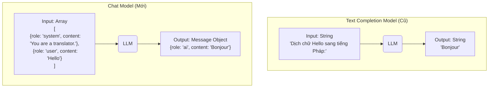
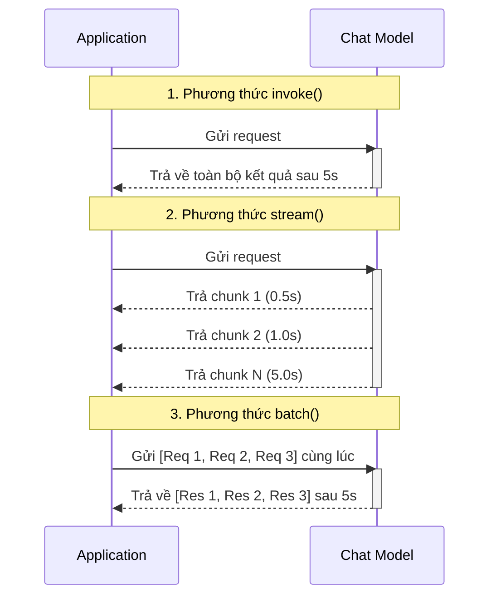

# 1.5. Models: Chọn Và Cấu Hình LLM

## Agenda

**Thời gian đọc ước tính:** ~15 phút

### Learning outcome:

- **Khởi tạo** được Chat Model thông qua hàm `initChatModel` với các tham số cấu hình nâng cao.
- **Phân biệt** được sự khác nhau giữa kiến trúc Chat Model và Completion Model truyền thống.
- **Giải thích** được cơ chế hoạt động của 3 phương thức invocation: `invoke()`, `stream()`, và `batch()`.
- **Áp dụng** được Retry Logic (*Cơ chế thử lại*) để tăng độ ổn định cho hệ thống.
- **Thiết kế** được luồng Dynamic Model Selection (*Lựa chọn mô hình động*) để tối ưu hóa chi phí.

---

## Glossary & Vocabulary

**1. Technical Terms (Thuật ngữ kỹ thuật):**

| Term | Vietnamese Meaning & Quick Explain |
| :--- | :--- |
| **Chat Model** | Mô hình ngôn ngữ giao tiếp qua định dạng danh sách tin nhắn (khác với Text Completion model cũ chỉ nhận một chuỗi text). |
| **Temperature** | Tham số kiểm soát độ sáng tạo/ngẫu nhiên (0.0 = kết quả cố định, 1.0 = kết quả sáng tạo). |
| **maxTokens** | Giới hạn số lượng token tối đa mà LLM được phép sinh ra trong một phản hồi. |
| **maxRetries** | Số lần hệ thống tự động thử lại khi gặp lỗi mạng hoặc giới hạn tỷ lệ (rate limit). |
| **invoke()** | Phương thức gọi model và chờ nhận về toàn bộ kết quả trong một lần duy nhất (blocking). |
| **stream()** | Phương thức trả về kết quả từng phần (chunk) ngay trong lúc model đang suy luận. |
| **batch()** | Phương thức gửi nhiều yêu cầu độc lập cùng một lúc để xử lý song song, tiết kiệm thời gian. |
| **Concurrency Limit** | Giới hạn số lượng yêu cầu xử lý đồng thời khi sử dụng phương thức batch. |

**2. Vocabulary Support (Từ vựng học thuật/B1+):**

| Word | Meaning in Context (Nghĩa trong ngữ cảnh) |
| :--- | :--- |
| **Versatile (adj)** | Đa năng — nói về khả năng thực hiện nhiều loại tác vụ khác nhau của một mô hình. |
| **Deterministic (adj)** | Tất định — kết quả luôn giống nhau nếu đầu vào không đổi (thường xảy ra khi temperature = 0). |
| **Resilience (n)** | Khả năng phục hồi — ứng dụng không bị sập (crash) khi gặp lỗi kết nối API tạm thời. |
| **Progressively (adv)** | Tuần tự, dần dần — hiển thị kết quả ra màn hình từng chữ một khi dùng stream. |
| **Interoperability (n)** | Khả năng tương tác — khả năng mã nguồn chạy được với nhiều nhà cung cấp mô hình khác nhau. |

---

## Vấn đề & Giải pháp

**Vấn đề (Problem Statement):**

1. Ứng dụng của bạn được xây dựng chặt chẽ với OpenAI API, nhưng doanh nghiệp yêu cầu chuyển sang sử dụng Google Gemini để giảm chi phí. Nếu không có một lớp trừu tượng (abstraction layer), bạn sẽ phải viết lại toàn bộ logic gọi API.
2. Các dịch vụ LLM thỉnh thoảng sẽ gặp tình trạng quá tải, gây ra lỗi timeout hoặc HTTP 429 (Too Many Requests). Ứng dụng sẽ bị treo nếu không có cơ chế tự động xử lý các gián đoạn này.
3. Trải nghiệm người dùng (UX) bị ảnh hưởng nghiêm trọng nếu hệ thống bắt người dùng phải chờ 15 giây nhìn màn hình trống trơn chỉ để nhận lại một đoạn văn bản dài.

**Giải pháp (Solution):**

LangChain cung cấp một giao diện chuẩn hóa (Standardized Interface) cho mọi **Chat Models**. Bằng cách lập trình dựa trên giao diện chung này, bạn chỉ cần thay đổi một chuỗi cấu hình duy nhất để chuyển đổi giữa OpenAI, Anthropic, hay Google. Hơn nữa, LangChain tích hợp sẵn cơ chế **tự động thử lại** (Exponential Backoff) và hỗ trợ **streaming** một cách tự nhiên, giải quyết triệt để các bài toán về tính ổn định và trải nghiệm người dùng.

---

## Chat Model là gì?

Khái niệm về mô hình ngôn ngữ đã tiến hóa qua nhiều giai đoạn. Để hiểu rõ `Chat Model`, chúng ta cần so sánh nó với người tiền nhiệm là `Completion Model`.

### Định nghĩa kỹ thuật

**Chat Model** là một loại mô hình ngôn ngữ lớn được thiết kế đặc biệt để nhận đầu vào là một danh sách các đối tượng tin nhắn (Message Objects) có vai trò rõ ràng, và trả về một đối tượng tin nhắn tương ứng.

**Giải phẫu định nghĩa (Definition Anatomy):**
- **Danh sách tin nhắn** (*List of messages*): Đầu vào không phải là một chuỗi văn bản dài, mà là một mảng tuần tự các tin nhắn.
- **Vai trò rõ ràng** (*Explicit roles*): Mỗi tin nhắn được gắn nhãn với một vai trò như System (Hệ thống), Human (Người dùng), hoặc AI (Trợ lý).

### Trực quan hóa: Chat Model vs Completion Model



Sự khác biệt cốt lõi nằm ở cấu trúc dữ liệu. Chat Model phản ánh đúng bản chất của một cuộc hội thoại, giúp LLM hiểu rõ bối cảnh (context) và nhân vật đang phát biểu, từ đó mang lại kết quả suy luận chính xác hơn nhiều so với Completion Model truyền thống.

---

## Khởi Tạo Model & Cấu Hình Tham Số

Trong LangChain.js hiện đại, cách thực hành tốt nhất để khởi tạo một mô hình là sử dụng hàm `initChatModel`. Hàm này cung cấp khả năng Interoperability (*Khả năng tương tác*) tuyệt vời, cho phép bạn khởi tạo bất kỳ mô hình nào thông qua một định danh chuỗi.

### Khởi tạo cơ bản và nâng cao

```typescript
// filename: models/init.ts

import { initChatModel } from "langchain/chat_models/universal";

// 1. Khởi tạo cơ bản cho tác vụ tạo nội dung (Content Generation)
const creativeModel = await initChatModel("gemini-2.5-flash", {
  modelProvider: "google-genai",
  temperature: 0.7, // Nhiệt độ cao giúp kết quả sáng tạo, đa dạng hơn
});

// 2. Khởi tạo nâng cao cho AI Agent (Tác vụ đòi hỏi tính chính xác)
const agentModel = await initChatModel("gemini-2.5-flash", {
  modelProvider: "google-genai",
  temperature: 0,       // Rất quan trọng: Set bằng 0 để LLM tuân thủ nghiêm ngặt logic
  maxTokens: 2048,      // Giới hạn độ dài tối đa của phản hồi
  maxRetries: 10,       // Tăng số lần thử lại cho mạng không ổn định (Mặc định: 6)
  timeout: 120_000,     // Timeout tính bằng milliseconds (120 giây)
});
```

**Tại sao Temperature phải bằng 0 đối với Agent?**
Khi đóng vai trò là một Agent, LLM cần đưa ra các quyết định logic: phân tích công cụ, truyền tham số, và quyết định luồng đi. Nếu `temperature` cao (ví dụ: 0.8), tính ngẫu nhiên sẽ làm LLM "sáng tạo" ra những tên công cụ không tồn tại trong hệ thống, hoặc truyền sai cấu trúc dữ liệu, dẫn đến ứng dụng bị sập. Bằng cách thiết lập `temperature = 0`, mô hình trở nên Deterministic (*Tất định*), luôn đưa ra cùng một quyết định cho cùng một ngữ cảnh.

---

## Ba Phương Thức Invocation (Thực Thi)

LangChain cung cấp 3 cách khác nhau để thực thi một mô hình, mỗi cách phục vụ một bài toán riêng biệt.

### Luồng hoạt động của 3 phương thức



### 1. Invoke (Thực thi đồng bộ)

Phương thức `invoke` sẽ khóa (block) luồng xử lý cho đến khi LLM hoàn thành toàn bộ câu trả lời. Phương thức này thích hợp cho các tác vụ xử lý nền (background jobs) hoặc khi câu trả lời dự kiến rất ngắn.

```typescript
// filename: models/invoke.ts

import { SystemMessage, HumanMessage } from "@langchain/core/messages";

const messages = [
  new SystemMessage("You translate English to French."),
  new HumanMessage("I love building reliable AI applications."),
];

const response = await agentModel.invoke(messages);
console.log(response.content); 
// "J'adore créer des applications IA fiables."
```

### 2. Stream (Thực thi luồng)

Streaming là kỹ thuật trả về kết quả từng phần (chunk) Progressively (*Dần dần*) ngay trong quá trình LLM đang tính toán. Đây là phương pháp bắt buộc cho mọi giao diện Chat UI hiện đại để giảm thời gian chờ phản hồi đầu tiên (Time to First Token).

```typescript
// filename: models/stream.ts

const stream = await agentModel.stream("Giải thích nguyên lý hoạt động của API trong 5 câu.");

// Lặp qua từng mảnh dữ liệu (chunk) ngay khi nó được tạo ra
for await (const chunk of stream) {
  // In ra màn hình từng chữ, không có dấu xuống dòng
  process.stdout.write(chunk.content.toString());
}
```

### 3. Batch (Thực thi song song)

Khi bạn cần xử lý một lượng lớn dữ liệu (ví dụ: dịch 100 đoạn văn bản), việc gọi `invoke` trong một vòng lặp `for` sẽ rất chậm vì chúng chạy tuần tự. Phương thức `batch` giải quyết vấn đề này bằng cách gửi nhiều yêu cầu cùng lúc.

```typescript
// filename: models/batch.ts

const questions = [
  "Why do parrots have colorful feathers?",
  "How do airplanes fly?",
  "What is quantum computing?",
];

// Gửi 3 câu hỏi cùng lúc, nhận về mảng kết quả
const responses = await agentModel.batch(questions, {
  maxConcurrency: 2, // Giới hạn số lượng yêu cầu đồng thời để tránh lỗi rate limit
});

responses.forEach((res, index) => {
  console.log(`Answer ${index + 1}: ${res.content.slice(0, 50)}...`);
});
```

*Lưu ý:* Tham số `maxConcurrency` (*Giới hạn đồng thời*) rất quan trọng khi dùng batch. Nếu bạn gửi 1000 yêu cầu cùng lúc mà không có giới hạn, máy chủ LLM sẽ lập tức khóa tài khoản của bạn vì lỗi spam.

---

## Connection Resilience: Khả Năng Chịu Lỗi

Bất kỳ hệ thống phân tán nào cũng có thể gặp sự cố mạng. LangChain tích hợp Resilience (*Khả năng phục hồi*) ngay trong lõi của Chat Model thông qua thuật toán **Exponential Backoff**.

Khi cấu hình `maxRetries: 5`, nếu có lỗi xảy ra, LangChain sẽ không thử lại ngay lập tức mà sẽ đợi một khoảng thời gian tăng dần (ví dụ: 1s, 2s, 4s, 8s, 16s). Điều này giúp tránh việc làm quá tải thêm một máy chủ vốn đã đang bận rộn.

**Phân loại lỗi tự động:**
- **Sẽ tự động thử lại:** Lỗi timeout mạng (Network timeout), Lỗi quá tải máy chủ (HTTP 500, 502, 503, 504), Lỗi giới hạn tỷ lệ truy cập (HTTP 429 Too Many Requests).
- **Không tự động thử lại:** Lỗi sai khóa API (HTTP 401 Unauthorized), Lỗi yêu cầu không đúng định dạng (HTTP 400 Bad Request), Lỗi tài nguyên không tồn tại (HTTP 404).

---

## Dynamic Model Selection (Lựa chọn mô hình động)

Sử dụng mô hình đắt tiền như GPT-4o hay Gemini 1.5 Pro cho những câu lệnh đơn giản như "Xin chào" là sự lãng phí tài nguyên. Ngược lại, dùng mô hình rẻ tiền như Gemini 1.5 Flash cho những suy luận phức tạp sẽ dẫn đến kết quả kém chất lượng.

Giải pháp là xây dựng cơ chế **Dynamic Model Selection**, tự động định tuyến yêu cầu đến mô hình phù hợp dựa trên độ phức tạp của ngữ cảnh.

```typescript
// filename: models/dynamic-routing.ts

import { RunnableBranch, RunnableLambda } from "@langchain/core/runnables";
import { initChatModel } from "langchain/chat_models/universal";

// 1. Khởi tạo hai mô hình
const cheapModel = await initChatModel("gemini-2.5-flash", { modelProvider: "google-genai" });
const expensiveModel = await initChatModel("gemini-1.5-pro", { modelProvider: "google-genai" });

// 2. Viết hàm đánh giá độ phức tạp
const isComplexRequest = (messages: any[]) => {
  // Tiêu chí: Lịch sử hội thoại dài hơn 5 tin nhắn, hoặc tin nhắn cuối cùng rất dài
  const lastMessageContent = messages[messages.length - 1].content.toString();
  return messages.length > 5 || lastMessageContent.length > 1000;
};

// 3. Sử dụng RunnableBranch để định tuyến động
const dynamicModelRouter = RunnableBranch.from([
  [
    (messages) => isComplexRequest(messages),
    expensiveModel, // Nếu điều kiện đúng (phức tạp) -> Dùng mô hình đắt tiền
  ],
  cheapModel,       // Ngược lại (đơn giản) -> Dùng mô hình rẻ tiền (Fallback)
]);

// 4. Thực thi luồng
const simpleResponse = await dynamicModelRouter.invoke([{ role: "user", content: "Hi" }]);
// Sử dụng cheapModel

const complexResponse = await dynamicModelRouter.invoke([
  { role: "user", content: "Hãy viết cho tôi một bản kế hoạch kinh doanh chi tiết gồm 10 trang..." }
]);
// Tự động chuyển sang expensiveModel
```

Cách tiếp cận này giúp các hệ thống quy mô lớn tiết kiệm được đến 70% chi phí API mà vẫn đảm bảo được chất lượng phản hồi ở những tình huống quan trọng.

---

## Discussion Questions

1. **Trade-off giữa `invoke` và `stream`:** Phương thức `stream` cung cấp UX tốt hơn, nhưng nó mang lại những khó khăn nào cho lập trình viên khi muốn lưu trữ lịch sử hội thoại vào cơ sở dữ liệu?
2. Tại sao lỗi `HTTP 401 (Unauthorized)` lại bị loại trừ khỏi cơ chế tự động thử lại (Retry) của LangChain? Việc thử lại lỗi này sẽ gây ra hậu quả gì?
3. Với bài toán `Dynamic Model Selection`, ngoài việc đếm số lượng tin nhắn hoặc độ dài ký tự, bạn có thể đề xuất một cơ chế đánh giá độ khó của câu lệnh tinh vi hơn không? (Gợi ý: Sử dụng thêm một LLM siêu nhỏ).

---

## Tài liệu tham khảo

- [LangChain Models (JS)](https://docs.langchain.com/oss/javascript/langchain/models) - Tài liệu gốc từ LangChain.
- [Exponential Backoff](https://en.wikipedia.org/wiki/Exponential_backoff) - Khái niệm về thuật toán thử lại mạng.

---

*Made by Anh Tu - Share to be share*
