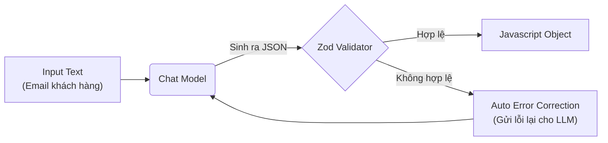

# 1.6. Structured Output: Trả Lời Đúng Format

## Agenda

**Thời gian đọc ước tính:** ~18 phút

### Learning outcome:

- **Hiểu** được sự cần thiết của Structured Output trong việc tích hợp trí tuệ nhân tạo vào hệ thống phần mềm truyền thống.
- **Thiết kế** được các lược đồ dữ liệu chặt chẽ bằng thư viện Zod.
- **Sử dụng** được phương thức `withStructuredOutput` để trích xuất dữ liệu.
- **Phân biệt** được cơ chế Provider Strategy (Hỗ trợ trực tiếp) và Tool Calling Strategy (Gọi công cụ mô phỏng).
- **Phân tích** được cơ chế tự động sửa lỗi (Intelligent Error Handling) của LangChain.

---

## Glossary & Vocabulary

**1. Technical Terms (Thuật ngữ kỹ thuật):**

| Term | Vietnamese Meaning & Quick Explain |
| :--- | :--- |
| **Structured Output** | Kết quả đầu ra có cấu trúc (thường là định dạng JSON), thay vì văn bản tự nhiên (Natural Language). |
| **Zod Schema** | Lược đồ Zod — thư viện TypeScript dùng để định nghĩa, mô tả và xác thực cấu trúc dữ liệu. |
| **Provider Strategy** | Phương pháp ép định dạng dựa trên sự hỗ trợ trực tiếp từ API của các nhà cung cấp như OpenAI, Gemini. |
| **Tool Calling Strategy** | Phương pháp fallback cho các mô hình không hỗ trợ trả về JSON tự nhiên. Hệ thống sẽ ép mô hình gọi một "công cụ ảo" mang theo tham số là cấu trúc cần thiết. |
| **Fallback** | Phương án dự phòng — cách hệ thống xử lý khi phương pháp chính thất bại hoặc không khả dụng. |

**2. Vocabulary Support (Từ vựng học thuật/B1+):**

| Word | Meaning in Context (Nghĩa trong ngữ cảnh) |
| :--- | :--- |
| **Predictable (adj)** | Có thể dự đoán được — Kết quả đầu ra luôn tuân theo một quy tắc nhất định, đảm bảo tính nhất quán. |
| **Constrain (v)** | Ép buộc / Giới hạn — Buộc LLM phải tuân theo định dạng khắt khe mà không được phép diễn giải lan man. |
| **Propagate (v)** | Lan truyền — Trong lập trình, "let exceptions propagate" nghĩa là không bắt lỗi (catch), để lỗi tự dội ngược ra ngoài. |
| **Seamlessly (adv)** | Một cách mượt mà — Tích hợp hệ thống mà không gây ra xung đột dữ liệu. |

---

## Vấn đề & Giải pháp

**Vấn đề (Problem Statement):**

1. LLM vốn được huấn luyện để giao tiếp bằng ngôn ngữ tự nhiên. Tuy nhiên, các hệ thống cơ sở dữ liệu (như SQL, MongoDB) và các API hiện đại (REST, GraphQL) chỉ chấp nhận dữ liệu có cấu trúc định sẵn (như JSON, XML).
2. Khi bạn yêu cầu LLM trích xuất tên khách hàng từ email, nó thường trả về nội dung thừa thãi: *"Dạ vâng, thông tin tôi tìm thấy là: Tên: Nguyễn Văn A. Chúc bạn một ngày tốt lành!"*.
3. Nếu bạn dùng mã nguồn truyền thống (ví dụ: `JSON.parse()`) để xử lý câu trả lời trên, ứng dụng sẽ lập tức báo lỗi và sụp đổ vì chuỗi trả về không phải là JSON hợp lệ.

**Giải pháp (Solution):**

Tính năng **Structured Output** (*Đầu ra có cấu trúc*) của LangChain giải quyết triệt để vấn đề này. Nó đóng vai trò như một bộ lọc Constrain (*Giới hạn*), ép buộc mô hình ngôn ngữ phải bỏ qua mọi lời chào hỏi lề thói, chỉ trả về duy nhất một đối tượng JSON tuân thủ tuyệt đối cấu trúc mà lập trình viên đã định nghĩa từ trước.

---

## Structured Output Hoạt Động Như Thế Nào?

### Định nghĩa kỹ thuật

**Structured Output** là một cơ chế ép buộc mô hình ngôn ngữ dịch văn bản tự nhiên phi cấu trúc thành dữ liệu có kiểu định sẵn (typed data) thông qua việc áp dụng các lược đồ xác thực.

**Giải phẫu định nghĩa (Definition Anatomy):**
- **Phi cấu trúc** (*Unstructured*): Văn bản tự do, ngôn ngữ con người nói chuyện hàng ngày, không có quy tắc cố định.
- **Kiểu định sẵn** (*Typed data*): Dữ liệu mà các trường (fields) đều được xác định rõ là chuỗi (string), số (number), hay mảng (array).
- **Lược đồ xác thực** (*Validation schemas*): Bản thiết kế quy định cấu trúc dữ liệu (như một bản thiết kế bản vẽ kỹ thuật).

### Luồng xử lý dữ liệu



Quy trình này không chỉ tạo ra dữ liệu, mà còn đảm bảo dữ liệu đó là Predictable (*Có thể dự đoán được*) 100% để ứng dụng có thể xử lý Seamlessly (*Mượt mà*).

---

## Zod: Định Nghĩa Hợp Đồng Dữ Liệu

Bước cốt lõi đầu tiên của Structured Output là định nghĩa Schema validation (*Xác thực lược đồ*). LangChain.js tích hợp sâu với **Zod**, một thư viện khai báo kiểu dữ liệu hàng đầu trong thế giới TypeScript.

Lược đồ Zod đóng vai trò là "hợp đồng dữ liệu". Mô hình phải đọc hợp đồng này để biết nó cần phải trích xuất những gì.

```typescript
// filename: structured-output/schema.ts

import * as z from "zod";

// Định nghĩa lược đồ thông tin cơ bản của một Diễn viên (Actor)
const ActorSchema = z.object({
  name: z.string().describe("Tên đầy đủ của diễn viên"),
  role: z.string().describe("Vai diễn của họ trong phim"),
});

// Định nghĩa lược đồ Phim (Movie) chứa các lược đồ con lồng nhau
const MovieSchema = z.object({
  title: z.string().describe("Tên chính thức của bộ phim"),
  year: z.number().describe("Năm phát hành phim (ví dụ: 2010)"),
  director: z.string().describe("Tên đạo diễn phim"),
  rating: z.number().max(10).describe("Điểm đánh giá phim trên thang 10"),
  cast: z.array(ActorSchema).describe("Danh sách các diễn viên chính"),
});
```

**Tại sao hàm `.describe()` lại bắt buộc?**
Trong TypeScript thông thường, Zod chỉ dùng để kiểm tra kiểu (Type Checking). Nhưng trong LangChain, hàm `.describe()` chính là những lời nhắc (Prompt) ngầm mà bạn gửi cho LLM. Nếu không có phần mô tả này, LLM sẽ không hiểu trường `rating` cần lấy từ hệ thống nào (thang 10, thang 5, hay điểm chữ A/B/C).

---

## Trích Xuất Cơ Bản: `withStructuredOutput`

Khi bạn chỉ có nhu cầu gọi API một lần độc lập (không nằm trong luồng Agent phức tạp), phương thức `withStructuredOutput` là công cụ sắc bén nhất.

```typescript
// filename: structured-output/basic-extraction.ts

import { initChatModel } from "langchain/chat_models/universal";

const model = await initChatModel("gemini-2.5-flash", { 
  modelProvider: "google-genai",
  temperature: 0 
});

// 1. Gắn lược đồ dữ liệu vào mô hình
const extractorModel = model.withStructuredOutput(MovieSchema, {
  name: "movie_extractor",
});

// 2. Thực thi phương thức invoke() với văn bản tự nhiên
const response = await extractorModel.invoke(
  "Tóm tắt phim Inception (2010) do Christopher Nolan làm đạo diễn. Phim được đánh giá 8.8 điểm. Leonardo DiCaprio đóng vai Cobb, còn Elliot Page đóng vai Ariadne."
);

// 3. Kết quả là một đối tượng JavaScript chuẩn xác
console.log(response.title); // Inception
console.log(response.year); // 2010
console.log(response.cast[0].name); // Leonardo DiCaprio
```

Trong ví dụ trên, mô hình đã bỏ qua toàn bộ các từ nối và cấu trúc ngữ pháp, chỉ nhặt ra đúng các giá trị cần thiết và gán vào đúng trường tương ứng.

### Truy xuất thông tin Token Usage

Phương thức `withStructuredOutput` theo mặc định sẽ lột bỏ lớp vỏ tin nhắn gốc và chỉ trả về payload dữ liệu (Object). Nếu bạn cần đo lường chi phí thông qua Token Usage, bạn cần cấu hình tham số `includeRaw: true`.

```typescript
// filename: structured-output/raw-usage.ts

const extractorModelRaw = model.withStructuredOutput(MovieSchema, { 
  name: "movie_extractor",
  includeRaw: true 
});

const response = await extractorModelRaw.invoke("Tóm tắt phim Inception...");

console.log(response.parsed); // Đối tượng MovieSchema
console.log(response.raw.usage_metadata); // Thông tin về số lượng token tiêu thụ
```

---

## ResponseFormat trong Agent: Hai Chiến Lược Định Dạng

Khi triển khai AI Agent bằng LangGraph, việc ép kiểu dữ liệu được thực hiện thông qua tham số `responseFormat`. Dưới mui xe, LangChain áp dụng một trong hai chiến lược xử lý tùy thuộc vào năng lực của LLM.

### 1. Provider Strategy (Hỗ trợ trực tiếp)

Các mô hình hiện đại (như Gemini 1.5, GPT-4o, Claude 3.5) có khả năng sinh ra định dạng JSON một cách tự nhiên nhờ được tối ưu ở mức hệ thống máy chủ (Native Server Support). LangChain cung cấp hàm `providerStrategy` để tận dụng sức mạnh này.

Đây là phương pháp **nhanh nhất, rẻ nhất và đáng tin cậy nhất**.

```typescript
// filename: structured-output/provider-strategy.ts

import { createAgent, providerStrategy } from "langchain";

const agent = createAgent({
    model: "gemini-2.5-flash", 
    responseFormat: providerStrategy(MovieSchema)
});
```

### 2. Tool Calling Strategy (Gọi công cụ mô phỏng)

Đối với các mô hình mã nguồn mở cũ hơn (như Llama 2, Mistral bản thấp) không hỗ trợ tính năng định dạng JSON, LangChain phải dùng một thủ thuật Fallback (*Phương án dự phòng*). 

Hệ thống sẽ tạo ra một công cụ "ảo" (ví dụ: công cụ tên `SaveMovie`). Nó lừa mô hình rằng: *"Nhiệm vụ của bạn là đọc đoạn văn bản này, và gọi công cụ `SaveMovie` bằng cách truyền các tham số tương ứng"*. Khi mô hình gọi công cụ, hệ thống sẽ thu thập các tham số đó làm kết quả.

```typescript
// filename: structured-output/tool-strategy.ts

import { createAgent, toolStrategy } from "langchain";

const agent = createAgent({
    model: "ollama-llama2", 
    responseFormat: toolStrategy(MovieSchema, {
        // Thông báo hiển thị trong lịch sử hội thoại khi việc trích xuất thành công
        toolMessageContent: "Đã trích xuất thông tin phim thành công, tiến hành bước tiếp theo!" 
    })
});
```

---

## Tự Động Sửa Lỗi (Intelligent Error Handling)

Một trong những tính năng xuất sắc nhất của kiến trúc LangChain Agent là cơ chế tự động sửa lỗi (Auto Error Correction) khi sử dụng định dạng dữ liệu có cấu trúc.

Điều gì xảy ra nếu LLM đọc sai ngữ cảnh và trả về trường `rating` là 15 (trong khi ZodSchema định nghĩa `max(10)`)?

1. Zod xác thực thất bại và ném ra lỗi (Validation Error).
2. LangChain ngăn không cho lỗi Propagate (*Lan truyền*) ra làm sập ứng dụng.
3. LangChain đóng gói nội dung lỗi đó vào một tin nhắn và gửi ngược lại cho LLM:
   *"Lỗi phân tích cú pháp. Tham số `rating` không được lớn hơn 10. Hãy sửa lại lỗi của bạn."*
4. LLM đọc thông báo lỗi, nhận thức được sự sai sót, và **tự động sinh lại câu trả lời mới** với tham số đã sửa chữa.

Bạn hoàn toàn có thể kiểm soát vòng lặp này bằng hàm `handleError`:

```typescript
// filename: structured-output/error-handling.ts

const ProductRatingSchema = z.object({
  rating: z.number().min(1).max(5),
  review: z.string()
});

const responseFormat = toolStrategy(ProductRatingSchema, {
    handleError: (error) => {
        // Tùy chỉnh thông báo lỗi để nhắc nhở LLM tốt hơn
        if (error.name === "ToolInputParsingException") {
            return "Hãy cẩn thận, điểm đánh giá sản phẩm chỉ được nằm trong khoảng từ 1 đến 5.";
        }
        
        // Trả về false nếu bạn KHÔNG MUỐN LLM thử lại, mà muốn lỗi văng thẳng ra ngoài ứng dụng
        // return false;
    }
});
```

**Trade-off của `handleError: false`:**
Trong một số ứng dụng tài chính nhạy cảm, nếu LLM trích xuất sai số tiền giao dịch, bạn thà để hệ thống báo lỗi (crash) để con người can thiệp, còn hơn là để LLM tự "đoán" lại số tiền và ghi đè dữ liệu. Trong trường hợp đó, bạn sẽ thiết lập `handleError: false`.

---

## Discussion Questions

1. **Structured Output vs Regular Expressions:** Structured Output giải quyết vấn đề gì mà kỹ thuật biểu thức chính quy (Regex) không thể làm được khi bóc tách dữ liệu từ các văn bản phi cấu trúc phức tạp?
2. So sánh **Provider Strategy** và **Tool Calling Strategy**. Nếu bạn đang phát triển ứng dụng trên môi trường ngoại tuyến (offline) bằng mô hình Llama 3, chiến lược nào sẽ khả thi và tại sao?
3. Việc sử dụng hàm `.describe()` quá dài trong lược đồ Zod có thể ảnh hưởng tiêu cực đến hiệu suất hoặc chi phí Token như thế nào?

---

## Tài liệu tham khảo

- [LangChain Structured Output (JS)](https://docs.langchain.com/oss/javascript/langchain/structured-output) - Hướng dẫn chính thức về xử lý dữ liệu đầu ra.
- [Zod Documentation](https://zod.dev/) - Thư viện khai báo và xác thực dữ liệu TypeScript.

---

*Made by Anh Tu - Share to be share*
