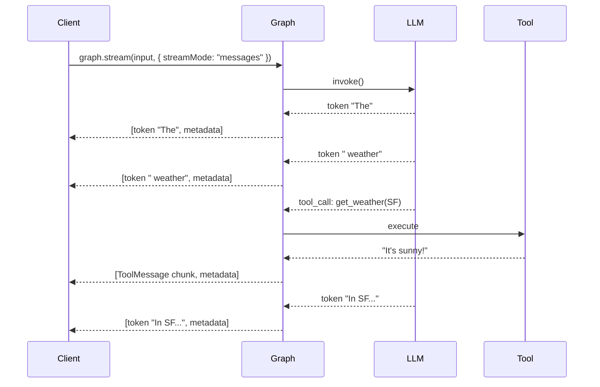

# 2.1. Streaming: Real-time Agent Response

## Agenda

**Thời gian đọc ước tính:** ~20 phút

### Learning outcome:

- Giải thích được tại sao Streaming quan trọng hơn đối với UX của agent so với chatbot thông thường.
- Phân biệt được 4 stream mode cốt lõi: `updates`, `values`, `messages`, `custom` — và biết khi nào dùng mode nào.
- Implement được tool streaming với **async generator** (`async function*`) để emit progress events.
- Nhận biết được khi nào nên dùng `nostream` tag để kiểm soát luồng dữ liệu ra client.

---

## Glossary & Vocabulary

**1. Technical Terms (Thuật ngữ kỹ thuật):**

| Term | Vietnamese Meaning & Quick Explain |
| :--- | :--- |
| **Streaming** | Truyền dữ liệu dần dần — thay vì đợi toàn bộ response xong mới gửi, server gửi từng phần nhỏ ngay khi có. |
| **Stream Mode** | Chế độ streaming — xác định *loại dữ liệu* nào được phát ra qua stream (state updates, LLM tokens, custom data...). |
| **Token** | Đơn vị nhỏ nhất LLM xử lý — thường là 1 từ hoặc vài ký tự. LLM sinh ra từng token một, không phải cả câu một lúc. |
| **Async Generator** | Hàm bất đồng bộ tạo ra nhiều giá trị theo thời gian — dùng `async function*` và `yield` trong JavaScript. |
| **`updates` mode** | Stream cập nhật state sau mỗi bước — chỉ phần thay đổi, kèm tên node. |
| **`values` mode** | Stream toàn bộ state sau mỗi bước — bao gồm cả những field không thay đổi. |
| **`messages` mode** | Stream từng LLM token dưới dạng tuple `[token, metadata]` từ bất kỳ node nào có gọi LLM. |
| **`custom` mode** | Stream dữ liệu tuỳ ý từ bên trong node — qua `config.writer()`. |
| **`tools` mode** | Stream lifecycle events của tool execution: `on_tool_start`, `on_tool_event`, `on_tool_end`, `on_tool_error`. |
| **`nostream` tag** | Tag đặc biệt để loại trừ LLM call khỏi `messages` stream — hữu ích cho internal processing. |
| **`thread_id`** | ID phân biệt session — kết hợp với checkpointer để lưu state giữa các lần stream. |

**2. Vocabulary Support (Từ vựng học thuật/B1+):**

| Word | Meaning in Context |
| :--- | :--- |
| **Progressive (adj)** | Dần dần, từng bước một — hiển thị output khi nó được tạo ra. |
| **Latency (n)** | Độ trễ — thời gian từ khi gửi request đến khi nhận được phản hồi đầu tiên. |
| **Emit (v)** | Phát ra, gửi đi — node "emits" data vào stream. |
| **Lifecycle (n)** | Vòng đời — chuỗi các trạng thái một đối tượng trải qua từ lúc khởi tạo đến khi kết thúc. |
| **Tuple (n)** | Cặp giá trị — trong streaming, `[token, metadata]` là một 2-tuple. |

---

## 1. Vấn đề & Giải pháp

**Vấn đề (Problem Statement):**

- Agent LLM thường mất vài giây đến hàng chục giây để hoàn thành một tác vụ. Nếu không có streaming, người dùng nhìn vào màn hình trống và không biết điều gì đang xảy ra.
- Trong agent loop, LLM có thể gọi nhiều tool theo chuỗi. Nếu chỉ nhận output ở cuối, người dùng không theo dõi được tiến trình nào đang chạy.
- Không phải mọi output đều cần stream đến client — một số LLM call chỉ phục vụ internal processing (VD: phân loại intent) và stream ra sẽ gây nhiễu.

**Giải pháp (Solution):**

LangGraph cung cấp hệ thống streaming nhiều tầng với các **stream modes** độc lập. Developer chọn *chính xác loại dữ liệu nào* cần phát ra — từ state updates thô, đến từng token LLM, đến custom progress events từ tool.

---

## 2. Streaming Là Gì?

**Định nghĩa kỹ thuật:**

> Streaming là cơ chế cho phép LangGraph phát ra dữ liệu **liên tục trong quá trình thực thi** graph, thay vì chỉ trả về kết quả cuối cùng sau khi toàn bộ quá trình hoàn tất.

**Definition Anatomy — Giải phẫu định nghĩa:**

- **liên tục trong quá trình thực thi** (*incrementally during execution*): Đây là điểm cốt lõi phân biệt streaming với polling. Dữ liệu được đẩy ra ngay khi có — không phải sau khi graph chạy xong.
- **stream modes** (*chế độ luồng*): Mỗi mode là một "kênh" khác nhau. Bạn có thể nghe nhiều kênh cùng lúc bằng cách pass array: `streamMode: ["updates", "messages"]`.

**Luồng hoạt động của Streaming trong Agent:**



**Cài đặt:**

```bash
npm install @langchain/langgraph @langchain/google-genai @langchain/core zod
```

---

## 3. Bốn Stream Mode Cốt Lõi

### 3.1. `updates` — Stream state updates sau mỗi bước

Mode đơn giản nhất. Sau mỗi node hoàn thành, phát ra **phần state đã thay đổi** kèm tên node.

```typescript
// filename: agent/stream-updates.ts

import { StateGraph, StateSchema, START, END } from "@langchain/langgraph";
import * as z from "zod";

const State = new StateSchema({
  topic: z.string(),
  joke: z.string().default(""),
});

const graph = new StateGraph(State)
  .addNode("refineTopic", (state) => {
    return { topic: state.topic + " and cats" };
  })
  .addNode("generateJoke", (state) => {
    return { joke: `Why did ${state.topic} cross the road?` };
  })
  .addEdge(START, "refineTopic")
  .addEdge("refineTopic", "generateJoke")
  .addEdge("generateJoke", END)
  .compile();

// Chỉ nhận phần thay đổi — không phải toàn bộ state
for await (const chunk of await graph.stream(
  { topic: "ice cream" },
  { streamMode: "updates" }
)) {
  for (const [nodeName, state] of Object.entries(chunk)) {
    console.log(`Node "${nodeName}" updated:`, state);
  }
}
```

```
// Output mong đợi:
Node "refineTopic" updated: { topic: "ice cream and cats" }
Node "generateJoke" updated: { joke: "Why did ice cream and cats cross the road?" }
```

**Khi dùng `updates`:** Dashboard theo dõi tiến trình của agent — bạn thấy từng bước mà không bị ngập trong toàn bộ state.

### 3.2. `values` — Stream toàn bộ state sau mỗi bước

Tương tự `updates` nhưng phát ra **snapshot đầy đủ** của state sau mỗi bước.

```typescript
// filename: agent/stream-values.ts

for await (const chunk of await graph.stream(
  { topic: "ice cream" },
  { streamMode: "values" }
)) {
  // chunk là toàn bộ state object tại thời điểm đó
  console.log(`topic: ${chunk.topic}, joke: ${chunk.joke}`);
}
```

```
// Output mong đợi:
topic: ice cream and cats, joke:
topic: ice cream and cats, joke: Why did ice cream and cats cross the road?
```

**Trade-off `updates` vs `values`:**

| | `updates` | `values` |
|:---|:---|:---|
| **Dữ liệu nhận được** | Chỉ phần thay đổi | Toàn bộ state |
| **Bandwidth** | Thấp hơn | Cao hơn |
| **Khi dùng** | Log từng bước, progress tracking | Debug, cần snapshot đầy đủ tại mỗi bước |

### 3.3. `messages` — Stream từng LLM token

Mode này hoạt động như thế nào: mỗi khi LLM được gọi từ bất kỳ node nào trong graph, các token được phát ra **ngay khi LLM sinh ra** — dưới dạng tuple `[messageChunk, metadata]`.

```typescript
// filename: agent/stream-messages.ts

import { ChatGoogleGenerativeAI } from "@langchain/google-genai";
import { StateGraph, StateSchema, type GraphNode, START } from "@langchain/langgraph";
import * as z from "zod";

const model = new ChatGoogleGenerativeAI({ model: "gemini-2.5-flash" });

const MyState = new StateSchema({
  topic: z.string(),
  joke: z.string().default(""),
});

const callModel: GraphNode<typeof MyState> = async (state) => {
  const response = await model.invoke([
    { role: "user", content: `Generate a short joke about ${state.topic}` },
  ]);
  return { joke: response.content as string };
};

const graph = new StateGraph(MyState)
  .addNode("callModel", callModel)
  .addEdge(START, "callModel")
  .compile();

// messages mode trả về tuple [token, metadata]
// metadata.langgraph_node cho biết token đến từ node nào
for await (const [messageChunk, metadata] of await graph.stream(
  { topic: "ice cream" },
  { streamMode: "messages" }
)) {
  if (messageChunk.content) {
    // In từng token ngay khi nhận — không cần đợi toàn bộ câu
    process.stdout.write(messageChunk.content as string);
  }
}
```

#### Lọc token theo node cụ thể

Khi graph có nhiều LLM calls, dùng `metadata.langgraph_node` để chỉ lấy token từ node mong muốn:

```typescript
// filename: agent/stream-filter-by-node.ts

for await (const [msg, metadata] of await graph.stream(
  { topic: "cats" },
  { streamMode: "messages" }
)) {
  // Chỉ lấy token từ node "writePoem", bỏ qua "writeJoke"
  if (msg.content && metadata.langgraph_node === "writePoem") {
    process.stdout.write(msg.content as string);
  }
}
```

#### `nostream` tag — Loại trừ LLM call khỏi stream

Dùng khi LLM được gọi để xử lý nội bộ (VD: classify intent, extract structured data) và không cần stream kết quả ra client:

```typescript
// filename: agent/nostream-example.ts

import { ChatGoogleGenerativeAI } from "@langchain/google-genai";
import { StateGraph, StateSchema, START } from "@langchain/langgraph";
import * as z from "zod";

// Model này stream token ra client
const streamModel = new ChatGoogleGenerativeAI({ model: "gemini-2.5-flash" });

// Model này xử lý nội bộ — không stream ra client
// nostream tag ngăn tokens của model này xuất hiện trong messages stream
const internalModel = new ChatGoogleGenerativeAI({
  model: "gemini-2.5-flash",
}).withConfig({
  tags: ["nostream"],
});

const State = new StateSchema({
  topic: z.string(),
  answer: z.string().optional(),
  internalNotes: z.string().optional(),
});

const writeAnswer = async (state: typeof State.State) => {
  // Tokens từ streamModel SẼ xuất hiện trong stream
  const r = await streamModel.invoke([
    { role: "user", content: `Reply briefly about ${state.topic}` },
  ]);
  return { answer: r.content };
};

const analyzeInternally = async (state: typeof State.State) => {
  // Tokens từ internalModel SẼ KHÔNG xuất hiện trong stream
  // Vì có tag "nostream"
  const r = await internalModel.invoke([
    { role: "user", content: `Analyze this topic for internal notes: ${state.topic}` },
  ]);
  return { internalNotes: r.content };
};
```

### 3.4. `custom` — Stream dữ liệu tuỳ ý

Khi cần phát ra bất kỳ dữ liệu nào từ bên trong node — progress update, intermediate results, log messages:

```typescript
// filename: agent/stream-custom.ts

import {
  StateGraph, StateSchema, type GraphNode,
  START, type LangGraphRunnableConfig
} from "@langchain/langgraph";
import * as z from "zod";

const State = new StateSchema({
  query: z.string(),
  answer: z.string().default(""),
});

// config.writer() là cách gửi dữ liệu custom vào stream
const processQuery: GraphNode<typeof State> = async (state, config) => {
  // Thông báo bắt đầu — client nhận được ngay lập tức
  config.writer({ status: "Đang phân tích câu hỏi...", progress: 0.1 });

  // Giả lập fetch data
  await new Promise(r => setTimeout(r, 500));
  config.writer({ status: "Đang tìm kiếm tài liệu...", progress: 0.5 });

  await new Promise(r => setTimeout(r, 500));
  config.writer({ status: "Đang tổng hợp câu trả lời...", progress: 0.9 });

  return { answer: `Câu trả lời cho: ${state.query}` };
};

const graph = new StateGraph(State)
  .addNode("processQuery", processQuery)
  .addEdge(START, "processQuery")
  .compile();

// Nhận dữ liệu custom — bao gồm status updates từ config.writer()
for await (const chunk of await graph.stream(
  { query: "AI agent là gì?" },
  { streamMode: "custom" }
)) {
  console.log(`[${chunk.progress * 100}%] ${chunk.status}`);
}
```

```
// Output mong đợi:
[10%] Đang phân tích câu hỏi...
[50%] Đang tìm kiếm tài liệu...
[90%] Đang tổng hợp câu trả lời...
```

---

## 4. Tool Progress Streaming — `tools` Mode

Mode nâng cao, đặc biệt hữu ích cho UI: stream lifecycle events của từng tool execution.

### 4.1. Tool progress events

| Event | Khi nào xảy ra | Dữ liệu |
| :--- | :--- | :--- |
| `on_tool_start` | Tool bắt đầu chạy | `name`, `input`, `toolCallId` |
| `on_tool_event` | Tool yield intermediate data | `name`, `data`, `toolCallId` |
| `on_tool_end` | Tool hoàn thành | `name`, `output`, `toolCallId` |
| `on_tool_error` | Tool throw lỗi | `name`, `error`, `toolCallId` |

### 4.2. Định nghĩa tool với async generator

Để emit `on_tool_event`, tool phải là **async generator** — dùng `async function*` và `yield` cho intermediate data:

```typescript
// filename: agent/tools/search-flights.ts

import { tool } from "@langchain/core/tools";
import * as z from "zod";

const searchFlights = tool(
  // async function* thay vì async function thông thường
  async function* (input) {
    const airlines = ["Vietnam Airlines", "Vietjet", "Bamboo"];
    const completed: string[] = [];

    for (let i = 0; i < airlines.length; i++) {
      await new Promise(r => setTimeout(r, 500)); // giả lập API call

      completed.push(airlines[i]);

      // Mỗi yield phát ra một on_tool_event
      // Cho phép client hiển thị progress bar real-time
      yield {
        message: `Đang tìm kiếm chuyến bay ${airlines[i]}...`,
        progress: (i + 1) / airlines.length,
        completed,
      };
    }

    // return value trở thành ToolMessage.content cuối cùng
    return JSON.stringify({
      flights: [
        { airline: "Vietnam Airlines", price: 1200000, duration: "2h" },
        { airline: "Vietjet", price: 890000, duration: "2h 10m" },
      ],
    });
  },
  {
    name: "search_flights",
    description: "Tìm kiếm chuyến bay đến điểm đến chỉ định.",
    schema: z.object({
      destination: z.string().describe("Thành phố đích"),
      date: z.string().describe("Ngày bay (YYYY-MM-DD)"),
    }),
  }
);
```

### 4.3. Consume tool events phía server

```typescript
// filename: agent/stream-tools.ts

// Kết hợp "updates" và "tools" để nhận cả state updates lẫn tool events
for await (const [mode, chunk] of await graph.stream(
  { messages: [{ role: "user", content: "Tìm vé bay Hà Nội → TP.HCM ngày 25/12" }] },
  { streamMode: ["updates", "tools"] }
)) {
  if (mode === "tools") {
    switch (chunk.event) {
      case "on_tool_start":
        console.log(`Tool bắt đầu: ${chunk.name}`, chunk.input);
        break;
      case "on_tool_event":
        // Dữ liệu intermediate từ yield trong async generator
        console.log(`Tool tiến hành: ${chunk.name}`, chunk.data);
        break;
      case "on_tool_end":
        console.log(`Tool hoàn thành: ${chunk.name}`, chunk.output);
        break;
      case "on_tool_error":
        console.error(`Tool lỗi: ${chunk.name}`, chunk.error);
        break;
    }
  }

  if (mode === "updates") {
    console.log("State update:", chunk);
  }
}
```

### 4.4. `tools` mode vs `custom` mode — Khi nào dùng gì?

| | `tools` mode | `custom` mode |
|:---|:---|:---|
| **Cơ chế** | Tự động emit lifecycle events | Thủ công qua `config.writer()` |
| **Nguồn dữ liệu** | Chỉ từ tool execution | Từ bất kỳ đâu trong node hoặc tool |
| **Code thay đổi** | Chỉ cần đổi `async function` → `async function*` | Cần thêm `config.writer()` calls |
| **Khi dùng** | Progress bars, tool status UI | Freeform progress, không map được vào tool lifecycle |

---

## 5. Kết hợp Nhiều Stream Modes

Pass array vào `streamMode` để nhận nhiều loại dữ liệu cùng lúc. Output sẽ là tuple `[mode, chunk]`:

```typescript
// filename: agent/stream-multiple.ts

for await (const [streamMode, chunk] of await graph.stream(
  { messages: [{ role: "user", content: "Thời tiết Hà Nội hôm nay?" }] },
  { streamMode: ["updates", "messages", "custom"] }
)) {
  switch (streamMode) {
    case "updates":
      // State changes sau mỗi node
      console.log("[STATE]", chunk);
      break;
    case "messages":
      // LLM tokens
      const [token] = chunk as [any, any];
      if (token.content) process.stdout.write(token.content);
      break;
    case "custom":
      // Custom progress events từ config.writer()
      console.log("[CUSTOM]", chunk);
      break;
  }
}
```

---

## 6. Streaming với Thread ID và Checkpointer

`thread_id` là bắt buộc khi dùng checkpointer — giúp group toàn bộ state của một conversation:

```typescript
// filename: agent/stream-with-thread.ts

import { MemorySaver } from "@langchain/langgraph";

const memory = new MemorySaver();
const app = workflow.compile({ checkpointer: memory });

// thread_id xác định "session" — cùng thread_id sẽ tiếp nối conversation
const config = {
  configurable: { thread_id: "user-123-session-abc" },
};

// Lần 1: hỏi câu đầu tiên
for await (const [token] of await app.stream(
  { messages: [{ role: "user", content: "Thủ đô Việt Nam là gì?" }] },
  { ...config, streamMode: "messages" }
)) {
  if (token.content) process.stdout.write(token.content as string);
}

// Lần 2: cùng thread_id → agent nhớ lịch sử
// "Thủ đô đó có bao nhiêu dân số?" — agent biết "thủ đô" là Hà Nội
for await (const [token] of await app.stream(
  { messages: [{ role: "user", content: "Thủ đô đó có bao nhiêu dân số?" }] },
  { ...config, streamMode: "messages" }
)) {
  if (token.content) process.stdout.write(token.content as string);
}
```

---

## 7. Disable Streaming cho Model Cụ thể

Khi application mix nhiều model có và không support streaming:

```typescript
// filename: agent/disable-streaming.ts

import { ChatGoogleGenerativeAI } from "@langchain/google-genai";

// streaming: false — model này sẽ không phát token theo thời gian thực
// Dùng khi model không hỗ trợ streaming hoặc bạn cần batch output
const model = new ChatGoogleGenerativeAI({
  model: "gemini-2.5-flash",
  streaming: false,
});
```

---

## Discussion Questions

1. **`updates` vs `values` trong multi-agent scenario:** Nếu agent A và agent B chạy song song và cùng cập nhật `messages` field trong state, bạn sẽ nhận được gì trong `updates` stream? Trong `values` stream? Cái nào dễ bị race condition hơn?

2. **`nostream` tag có trade-off gì?** Nếu LLM call dùng `nostream` bị lỗi, bạn có biết không? Mechanism nào giúp debug một call đã bị loại khỏi stream?

3. **Async generator và `on_tool_event`:** Nếu tool không yield gì (chạy xong ngay và return), bạn vẫn nhận được `on_tool_start` và `on_tool_end` không? Tại sao điều này quan trọng cho UI?

4. **Thread ID và memory isolation:** Nếu 2 user khác nhau cùng dùng `thread_id: "abc"`, điều gì xảy ra với conversation history của họ? Đây là bug hay feature? Thiết kế hệ thống multi-tenant cần handle điều này như thế nào?

---

## References

- [LangChain — Streaming](https://docs.langchain.com/oss/javascript/langchain/streaming) — Overview và stream modes từ LangChain agent perspective
- [LangGraph — Streaming](https://docs.langchain.com/oss/javascript/langgraph/streaming) — **Nguồn chính** — tất cả stream modes, tool progress, subgraph streaming
- [LangChain — Event Streaming](https://docs.langchain.com/oss/javascript/langchain/event-streaming) — `streamEvents()` v3 API với typed projections

---

*Made by Anh Tu - Share to be share*
