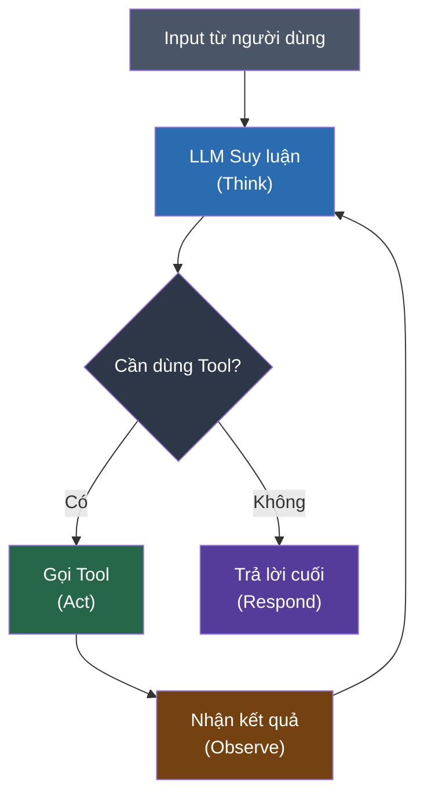

# 1.1. Chatbot vs AI Agent

## Agenda

**Thời gian đọc ước tính:** ~15 phút

### Learning outcome:

- Phân biệt được **Chatbot** và **AI Agent** dựa trên bản chất kiến trúc, không chỉ theo cảm tính.
- Giải thích được **Agent Loop** (vòng lặp tác nhân) và 4 giai đoạn cốt lõi của nó.
- Xác định được khi nào nên dùng **Workflow** (quy trình định sẵn) và khi nào nên dùng **Agent** (tác nhân tự trị).
- Hiểu được 5 **Agentic Pattern** cơ bản trong tài liệu chính thức LangChain.

---

## Glossary & Vocabulary

**1. Technical Terms (Thuật ngữ kỹ thuật):**

| Term | Vietnamese Meaning & Quick Explain |
| :--- | :--- |
| **Agent** | Tác nhân — Hệ thống AI tự động xác định quy trình và công cụ cần dùng để giải quyết bài toán. |
| **Workflow** | Luồng làm việc — Chuỗi bước thực thi được định nghĩa trước, cố định về thứ tự. |
| **Agent Loop** | Vòng lặp tác nhân — Chu trình liên tục: nhận input → suy luận → hành động → quan sát → lặp lại. |
| **LLM** | Large Language Model — Mô hình ngôn ngữ lớn (GPT-4o, Gemini Flash, Claude). |
| **Tool Calling** | Gọi công cụ — Cơ chế cho phép LLM yêu cầu thực thi một hàm bên ngoài (search, calculator...). |
| **Structured Output** | Đầu ra có cấu trúc — LLM trả về JSON theo schema định trước thay vì text tự do. |
| **ToolNode** | Node công cụ — Thành phần trong LangGraph thực thi tool calls song song và xử lý lỗi tự động. |

**2. Vocabulary Support (Từ vựng học thuật/B1+):**

| Word | Meaning in Context |
| :--- | :--- |
| **Predetermined (adj)** | Được định trước, không thay đổi trong runtime. |
| **Autonomy (n)** | Tính tự trị — khả năng tự quyết định mà không cần can thiệp từ bên ngoài. |
| **Synthesize (v)** | Tổng hợp — kết hợp nhiều kết quả thành một output duy nhất. |
| **Resilience (n)** | Khả năng phục hồi — hệ thống tiếp tục hoạt động dù một phần bị lỗi. |
| **Augment (v)** | Tăng cường — gắn thêm khả năng (tools, memory) cho LLM vốn chỉ xử lý text. |

---

## 1. Vấn đề & Giải pháp

**Vấn đề (Problem Statement):**

- Chatbot truyền thống chỉ phản hồi dựa trên input trực tiếp — không thể chủ động thực hiện chuỗi hành động nhiều bước.
- LLM thuần túy không truy cập được dữ liệu thời gian thực (web, database), không thực thi code.
- Khi bài toán phức tạp và không thể định nghĩa sẵn từng bước cụ thể, chatbot / workflow cứng nhắc thất bại.

**Giải pháp (Solution):**

AI Agent mở rộng LLM bằng 3 augmentation (*tăng cường*) cốt lõi: **Tool Calling**, **Structured Output**, và **Memory**. Agent có thể tự xác định cần làm gì, gọi tool nào, và lặp lại quá trình cho đến khi đạt mục tiêu.

---

## 2. Chatbot vs AI Agent: Ranh Giới Kiến Trúc

Theo tài liệu chính thức LangChain, ranh giới giữa Chatbot và Agent không phải là "thông minh hơn" mà là **kiểu kiến trúc khác nhau**:

| | Chatbot / Workflow | AI Agent |
| :--- | :--- | :--- |
| **Luồng thực thi** | Cố định, định nghĩa trước | Động, tự quyết định |
| **Tool usage** | Không có hoặc hardcoded | Tự chọn tool phù hợp |
| **Xử lý bài toán mới** | Thất bại nếu chưa được lập trình | Tự điều chỉnh chiến lược |
| **Ví dụ** | FAQ bot, form wizard | Research assistant, coding assistant |

> **Nguồn:** [LangChain - Workflows and Agents](https://docs.langchain.com/oss/javascript/langgraph/workflows-agents)
>
> *"Workflows have predetermined code paths and are designed to operate in a certain order. Agents are dynamic and define their own processes and tool usage."*

---

## 3. Agent Loop: Cơ Chế Hoạt Động Cốt Lõi

Agent không chạy tuyến tính từ đầu đến cuối. Nó vận hành theo **vòng lặp phản hồi** (feedback loop):



**4 giai đoạn trong Agent Loop:**

1. **Think (Suy luận):** LLM nhận toàn bộ context (lịch sử hội thoại, kết quả tool trước đó) → quyết định bước tiếp theo.
2. **Act (Hành động):** Nếu cần tool, LLM phát ra `tool_calls` — đây là instruction, *không phải* lệnh thực thi trực tiếp.
3. **Observe (Quan sát):** ToolNode (*node thực thi tool*) chạy function thực tế, trả về kết quả dưới dạng `ToolMessage`.
4. **Repeat (Lặp lại):** LLM nhận `ToolMessage`, tiếp tục suy luận. Vòng lặp dừng khi không còn `tool_calls`.

:::info LLM không trực tiếp chạy code

Đây là điểm quan trọng: LLM chỉ **quyết định** gọi tool nào với tham số nào. Việc thực thi code thực tế do `ToolNode` đảm nhiệm. Tách biệt này giúp kiểm soát side effects và xử lý lỗi.

:::

---

## 4. LLM Augmentations: Ba Tăng Cường Nền Tảng

Theo LangChain, agent được xây dựng từ LLM cơ bản + các augmentation:


**3 augmentation cốt lõi:**

**Tool Calling** — Gắn tool vào LLM để nó có thể tương tác với thế giới bên ngoài:

```typescript
// filename: agent/tools.ts

import { tool } from "@langchain/core/tools";
import * as z from "zod";

// Tool schema = "hợp đồng" giữa LLM và function
// LLM đọc `description` để biết khi nào gọi tool này
const searchWeb = tool(
  async ({ query }) => {
    // Thực thi thực sự: gọi API search
    return `Search results for: ${query}`;
  },
  {
    name: "search_web",
    description: "Search the internet for current information",
    schema: z.object({
      query: z.string().describe("The search query"),
    }),
  }
);

// Gắn tool vào LLM — từ đây LLM "biết" có tool này
const llmWithTools = llm.bindTools([searchWeb]);
```

**Structured Output** — Buộc LLM trả về JSON đúng schema, thay vì text tự do:

```typescript
// filename: agent/schemas.ts

import * as z from "zod";

// Zod schema = type-safe contract cho output của LLM
const ClassifyResult = z.object({
  intent: z.enum(["question", "bug", "billing"]),
  urgency: z.enum(["low", "medium", "high"]),
  summary: z.string(),
});

// LLM sẽ trả về object đúng type ClassifyResult
const structuredLlm = llm.withStructuredOutput(ClassifyResult);
const result = await structuredLlm.invoke("I was charged twice!");
// result.intent === "billing", result.urgency === "high"
```

**Memory (Short-term)** — Giữ lại lịch sử hội thoại trong context window:

Xem chi tiết tại **Bài 1.6 — Memory**.

---

## 5. Năm Agentic Patterns Cơ Bản

LangChain phân loại các kiến trúc phổ biến thành 5 pattern. Hiểu pattern trước khi viết code giúp tránh over-engineering.

### 5.1. Prompt Chaining (Xâu chuỗi prompt)

Mỗi LLM call xử lý output của call trước. Dùng khi bài toán chia được thành bước nhỏ, tuần tự.


**Khi dùng:** Dịch tài liệu → kiểm tra chính tả → format output.

### 5.2. Parallelization (Song song hóa)

Nhiều LLM call chạy đồng thời trên cùng một tác vụ hoặc các subtask độc lập.


**Khi dùng:** Chấm điểm tài liệu theo nhiều tiêu chí cùng lúc.

### 5.3. Routing (Phân luồng)

Workflow phân tích input rồi chuyển đến process chuyên biệt.


**Khi dùng:** Hệ thống hỗ trợ khách hàng phân loại câu hỏi (giá cả / hoàn trả / lỗi kỹ thuật).

### 5.4. Orchestrator-Worker (Điều phối viên - Nhân viên)

Orchestrator (*điều phối viên*) phân chia task và giao cho worker (*nhân viên*), sau đó tổng hợp kết quả.


**Khi dùng:** Viết báo cáo nhiều chương — orchestrator lên kế hoạch, mỗi worker viết một chương.

### 5.5. Evaluator-Optimizer (Đánh giá - Tối ưu)

Một LLM tạo response, một LLM khác đánh giá. Nếu chưa đạt, feedback được gửi lại và quá trình lặp.


**Khi dùng:** Dịch thuật cần độ chính xác cao, code review tự động.

---

## 6. Workflow hay Agent? — Khi Nào Dùng Gì

:::tip Trade-off cốt lõi

**Workflow** cho predictability (*tính dự đoán*). **Agent** cho flexibility (*tính linh hoạt*). Chọn sai sẽ trả giá bằng complexity không cần thiết hoặc hệ thống thiếu khả năng xử lý edge cases.

:::

| Tiêu chí | Dùng Workflow | Dùng Agent |
| :--- | :--- | :--- |
| **Bài toán có thể định nghĩa sẵn** | Có | Không |
| **Số bước thực thi** | Cố định | Thay đổi tùy bài toán |
| **Yêu cầu về cost** | Thấp hơn (ít LLM calls) | Cao hơn (nhiều vòng lặp) |
| **Yêu cầu về reliability** | Cao — dễ test, dễ debug | Thấp hơn — khó predict |
| **Ví dụ thực tế** | ETL pipeline, notification system | Research assistant, coding agent |

**Quyết định thực tế:**

Nếu có thể viết pseudocode rõ ràng cho từng bước → dùng **Workflow**. Nếu bước tiếp theo phụ thuộc vào kết quả thực tế của bước trước theo cách không thể dự đoán trước → dùng **Agent**.

---

## Discussion Questions

1. **LangChain phân biệt Workflow và Agent theo tiêu chí gì?** Tại sao tiêu chí đó quan trọng hơn là "LLM có hay không có"?

2. **Agent Loop có thể chạy vô tận không?** Trong production, cần mechanism nào để ngăn infinite loop? (Gợi ý: xem `recursionLimit` trong LangGraph)

3. **Trade-off của Orchestrator-Worker:** Nếu một worker gặp lỗi, toàn bộ workflow có bị ảnh hưởng không? Làm thế nào để xử lý partial failure?

4. **Khi nào Evaluator-Optimizer trở nên phản tác dụng?** (Gợi ý: nghĩ về cost, latency và điều kiện dừng)

---

## References

- [LangChain - Workflows and Agents](https://docs.langchain.com/oss/javascript/langgraph/workflows-agents) — Tài liệu chính thức phân loại patterns
- [LangGraph Quickstart](https://docs.langchain.com/oss/javascript/langgraph/quickstart) — Build agent đầu tiên từng bước
- Yao et al. (2022). *ReAct: Synergizing Reasoning and Acting in Language Models* — Paper gốc về Agent Loop

---

*Made by Anh Tu - Share to be share*
