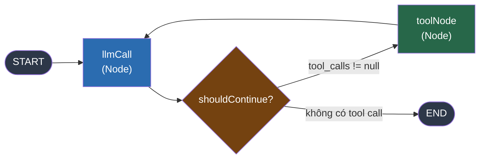

# 1.2. Agent Loop Trong Code

## Agenda

**Thời gian đọc ước tính:** ~20 phút

### Learning outcome:

- Tự tay build được **agent đầu tiên** hoạt động thực sự với LangGraph.js.
- Hiểu được 3 thành phần cốt lõi: **StateGraph**, **Node**, **Edge**.
- Phân biệt được **Graph API** (khai báo rõ ràng) và **Functional API** (linh hoạt hơn).
- Đọc hiểu được luồng thực thi của agent qua `tool_calls` và `ToolMessage`.

---

## Glossary & Vocabulary

**1. Technical Terms (Thuật ngữ kỹ thuật):**

| Term | Vietnamese Meaning & Quick Explain |
| :--- | :--- |
| **StateGraph** | Đồ thị trạng thái — cấu trúc chính của LangGraph, chứa các Node và Edge. |
| **Node** | Nút — một hàm thực thi một bước cụ thể trong agent. Nhận state, trả về state update. |
| **Edge** | Cạnh — kết nối giữa các Node, định nghĩa luồng thực thi. |
| **Conditional Edge** | Cạnh có điều kiện — node tiếp theo được chọn dựa trên output của node hiện tại. |
| **State** | Trạng thái — shared memory của toàn bộ agent, mọi node đều có thể đọc và cập nhật. |
| **ToolMessage** | Thông điệp công cụ — kết quả trả về sau khi tool được thực thi. |
| **AIMessage** | Thông điệp AI — response từ LLM, có thể chứa `tool_calls`. |
| **START / END** | Điểm bắt đầu / kết thúc đặc biệt trong LangGraph graph. |
| **Checkpointer** | Cơ chế lưu state sau mỗi node — cho phép resume nếu bị gián đoạn. |

**2. Vocabulary Support (Từ vựng học thuật/B1+):**

| Word | Meaning in Context |
| :--- | :--- |
| **Compile (v)** | Biên dịch/Khởi tạo — trong LangGraph: `graph.compile()` tạo ra runnable agent. |
| **Invoke (v)** | Gọi thực thi — chạy agent với input ban đầu. |
| **Arithmetic (n)** | Số học, phép tính (cộng, trừ, nhân, chia). |
| **Conditional (adj)** | Có điều kiện — phụ thuộc vào một giá trị để quyết định hướng đi. |
| **Schema (n)** | Lược đồ — cấu trúc dữ liệu được định nghĩa trước (dùng Zod trong TypeScript). |

---

## 1. Vấn đề & Giải pháp

**Vấn đề (Problem Statement):**

- Agent Loop trong lý thuyết (Think → Act → Observe → Repeat) cần được hiện thực hóa thành code có kiểm soát.
- Nếu tự implement vòng lặp thủ công: khó debug, không có persistence, không handle lỗi tốt.
- Cần framework chuẩn hóa luồng thực thi và state management.

**Giải pháp (Solution):**

LangGraph cung cấp `StateGraph` — mô hình graph (đồ thị) cho phép định nghĩa agent như một tập hợp Node (bước xử lý) và Edge (luồng điều hướng). State được chia sẻ qua toàn bộ graph, mỗi node đọc và cập nhật một phần của state.

---

## 2. Kiến Trúc LangGraph



**Giải thích luồng:**

1. `START` → `llmCall`: LLM nhận messages, quyết định trả lời hoặc gọi tool.
2. `llmCall` → `shouldContinue` (Conditional Edge): Nếu response có `tool_calls` → đến `toolNode`. Nếu không → `END`.
3. `toolNode` → `llmCall`: Sau khi tool chạy xong, trả kết quả lại cho LLM tiếp tục suy luận.

---

## 3. Build Agent Theo Graph API

Graph API là cách khai báo rõ ràng từng node và edge. Phù hợp khi cần kiểm soát và debug dễ dàng.

### 3.1. Cài đặt

```bash
npm install @langchain/langgraph @langchain/google-genai @langchain/core zod
```

### 3.2. Bước 1 — Định nghĩa Tools và Model

```typescript
// filename: agent/tools.ts

import { ChatGoogleGenerativeAI } from "@langchain/google-genai";
import { tool } from "@langchain/core/tools";
import * as z from "zod";

// Dùng Gemini Flash — tiết kiệm chi phí, đủ mạnh cho demo
const model = new ChatGoogleGenerativeAI({
  model: "gemini-1.5-flash",
  temperature: 0,
});

// Định nghĩa 3 tools số học đơn giản
const add = tool(({ a, b }) => a + b, {
  name: "add",
  description: "Add two numbers",
  schema: z.object({
    a: z.number().describe("First number"),
    b: z.number().describe("Second number"),
  }),
});

const multiply = tool(({ a, b }) => a * b, {
  name: "multiply",
  description: "Multiply two numbers",
  schema: z.object({
    a: z.number().describe("First number"),
    b: z.number().describe("Second number"),
  }),
});

const divide = tool(({ a, b }) => a / b, {
  name: "divide",
  description: "Divide two numbers",
  schema: z.object({
    a: z.number().describe("First number"),
    b: z.number().describe("Second number"),
  }),
});

// toolsByName cho phép lookup O(1) khi ToolNode cần thực thi
const toolsByName = {
  [add.name]: add,
  [multiply.name]: multiply,
  [divide.name]: divide,
};
const tools = Object.values(toolsByName);

// bindTools = gắn tool schema vào LLM → LLM "biết" mình có những tools này
const modelWithTools = model.bindTools(tools);
```

### 3.3. Bước 2 — Định nghĩa State

```typescript
// filename: agent/state.ts

import {
  StateGraph,
  StateSchema,
  MessagesValue,
  ReducedValue,
  GraphNode,
  ConditionalEdgeRouter,
  START,
  END,
} from "@langchain/langgraph";
import { z } from "zod/v4";

// MessagesValue = reducer đặc biệt: append messages thay vì overwrite
// ReducedValue cho llmCalls = cộng dồn thay vì thay thế
const MessagesState = new StateSchema({
  messages: MessagesValue,
  llmCalls: new ReducedValue(
    z.number().default(0),
    { reducer: (x, y) => x + y }  // Mỗi lần llmCall += 1
  ),
});
```

:::info Tại sao cần Reducer?

Khi nhiều node cùng update một key trong state, LangGraph cần biết cách **merge** các updates đó. `MessagesValue` dùng reducer `addMessages` — append vào array thay vì replace. Nếu không có reducer, node sau sẽ xóa hết messages của node trước.

:::

### 3.4. Bước 3 — Node: LLM Call

```typescript
// filename: agent/nodes.ts

import { SystemMessage } from "@langchain/core/messages";

// GraphNode<typeof MessagesState> = TypeScript type safety cho node function
const llmCall: GraphNode<typeof MessagesState> = async (state) => {
  const response = await modelWithTools.invoke([
    new SystemMessage(
      "You are a helpful assistant tasked with performing arithmetic."
    ),
    // Spread toàn bộ message history vào context — đây là short-term memory
    ...state.messages,
  ]);

  return {
    messages: [response],
    llmCalls: 1,  // Reducer sẽ cộng 1 vào llmCalls hiện tại
  };
};
```

### 3.5. Bước 4 — Node: Tool Execution

```typescript
// filename: agent/nodes.ts (tiếp)

import { AIMessage, ToolMessage } from "@langchain/core/messages";

const toolNode: GraphNode<typeof MessagesState> = async (state) => {
  const lastMessage = state.messages.at(-1);

  // Guard clause: chỉ thực thi nếu message cuối là AIMessage có tool_calls
  if (lastMessage == null || !AIMessage.isInstance(lastMessage)) {
    return { messages: [] };
  }

  const result: ToolMessage[] = [];

  // Lặp qua từng tool_call trong AIMessage
  // LLM có thể yêu cầu nhiều tool cùng lúc
  for (const toolCall of lastMessage.tool_calls ?? []) {
    const selectedTool = toolsByName[toolCall.name];
    // tool.invoke(toolCall) = thực thi function với args từ LLM
    const observation = await selectedTool.invoke(toolCall);
    result.push(observation);
  }

  return { messages: result };
};
```

### 3.6. Bước 5 — Conditional Edge: Khi Nào Dừng?

```typescript
// filename: agent/routing.ts

import { END } from "@langchain/langgraph";

// ConditionalEdgeRouter trả về tên node tiếp theo hoặc END
const shouldContinue: ConditionalEdgeRouter<typeof MessagesState, "toolNode"> = (state) => {
  const lastMessage = state.messages.at(-1);

  if (!lastMessage || !AIMessage.isInstance(lastMessage)) {
    return END;
  }

  // Có tool_calls → LLM muốn gọi tool → tiếp tục vòng lặp
  if (lastMessage.tool_calls?.length) {
    return "toolNode";
  }

  // Không có tool_calls → LLM đã trả lời xong → dừng
  return END;
};
```

### 3.7. Bước 6 — Compile và Chạy Agent

```typescript
// filename: agent/index.ts

import { StateGraph, START, END } from "@langchain/langgraph";
import { HumanMessage } from "@langchain/core/messages";

const agent = new StateGraph(MessagesState)
  .addNode("llmCall", llmCall)
  .addNode("toolNode", toolNode)
  // START → llmCall: điểm bắt đầu cố định
  .addEdge(START, "llmCall")
  // llmCall → shouldContinue → (toolNode | END): điều hướng có điều kiện
  .addConditionalEdges("llmCall", shouldContinue, ["toolNode", END])
  // toolNode → llmCall: vòng lặp agent
  .addEdge("toolNode", "llmCall")
  .compile();

// Chạy agent
const result = await agent.invoke({
  messages: [new HumanMessage("What is (3 + 4) * 2?")],
});

// In kết quả
for (const message of result.messages) {
  console.log(`[${message.getType()}]: ${message.content}`);
}
```

**Output mong đợi:**

```
[human]: What is (3 + 4) * 2?
[ai]: (tool_calls: add(3,4))
[tool]: 7
[ai]: (tool_calls: multiply(7,2))
[tool]: 14
[ai]: The result is 14.
```

---

## 4. Build Agent Theo Functional API

Functional API dùng `task` và `entrypoint` thay vì graph. Code trông gần với JavaScript/TypeScript thuần hơn, phù hợp khi logic phức tạp và conditional routing nhiều.

```typescript
// filename: agent/functional.ts

import { task, entrypoint, addMessages } from "@langchain/langgraph";
import {
  SystemMessage,
  HumanMessage,
  type BaseMessage,
} from "@langchain/core/messages";
import type { ToolCall } from "@langchain/core/messages/tool";

// task = unit nhỏ nhất, được theo dõi riêng trong tracing
const callLlm = task({ name: "callLlm" }, async (messages: BaseMessage[]) => {
  return modelWithTools.invoke([
    new SystemMessage("You are a helpful assistant for arithmetic."),
    ...messages,
  ]);
});

const callTool = task({ name: "callTool" }, async (toolCall: ToolCall) => {
  const selectedTool = toolsByName[toolCall.name];
  return selectedTool.invoke(toolCall);
});

// entrypoint = entry point của toàn bộ agent
const agent = entrypoint({ name: "agent" }, async (messages: BaseMessage[]) => {
  let modelResponse = await callLlm(messages);

  // while loop tường minh thay vì addConditionalEdges ẩn
  while (true) {
    if (!modelResponse.tool_calls?.length) {
      break;  // Không có tool_calls → thoát vòng lặp
    }

    // Chạy song song tất cả tool_calls bằng Promise.all
    const toolResults = await Promise.all(
      modelResponse.tool_calls.map((toolCall) => callTool(toolCall))
    );

    // addMessages = merge messages cũ + AIMessage + ToolMessages
    messages = addMessages(messages, [modelResponse, ...toolResults]);
    modelResponse = await callLlm(messages);
  }

  return messages;
});

// Chạy
const result = await agent.invoke([new HumanMessage("What is (3 + 4) * 2?")]);
```

---

## 5. Graph API vs Functional API

| | Graph API | Functional API |
| :--- | :--- | :--- |
| **Khai báo** | Tường minh (`addNode`, `addEdge`) | Ẩn trong logic hàm |
| **Debug / Visualization** | Dễ hơn — graph có thể visualize | Khó hơn — logic ẩn trong `while` |
| **Parallel execution** | Qua `Send` API | Qua `Promise.all` |
| **Phù hợp khi** | Luồng phức tạp, cần observability | Prototype nhanh, logic đơn giản |
| **TypeScript support** | Tốt | Tốt |

:::tip Khuyến nghị cho người mới

Bắt đầu với **Graph API** — tường minh hơn, dễ debug hơn, và các tài liệu ví dụ chính thức của LangChain đều dùng Graph API.

:::

---

## 6. Full Code Example

```typescript
// filename: agent/full-example.ts

import { ChatGoogleGenerativeAI } from "@langchain/google-genai";
import { tool } from "@langchain/core/tools";
import {
  StateGraph,
  StateSchema,
  MessagesValue,
  ReducedValue,
  GraphNode,
  ConditionalEdgeRouter,
  START,
  END,
} from "@langchain/langgraph";
import {
  SystemMessage,
  HumanMessage,
  AIMessage,
  ToolMessage,
} from "@langchain/core/messages";
import { z } from "zod/v4";

// --- Model ---
const model = new ChatGoogleGenerativeAI({
  model: "gemini-1.5-flash",
  temperature: 0,
});

// --- Tools ---
const add = tool(({ a, b }) => a + b, {
  name: "add",
  description: "Add two numbers",
  schema: z.object({ a: z.number(), b: z.number() }),
});
const multiply = tool(({ a, b }) => a * b, {
  name: "multiply",
  description: "Multiply two numbers",
  schema: z.object({ a: z.number(), b: z.number() }),
});
const toolsByName = { add, multiply };
const modelWithTools = model.bindTools([add, multiply]);

// --- State ---
const MessagesState = new StateSchema({
  messages: MessagesValue,
  llmCalls: new ReducedValue(z.number().default(0), {
    reducer: (x, y) => x + y,
  }),
});

// --- Nodes ---
const llmCall: GraphNode<typeof MessagesState> = async (state) => ({
  messages: [
    await modelWithTools.invoke([
      new SystemMessage("You are a helpful arithmetic assistant."),
      ...state.messages,
    ]),
  ],
  llmCalls: 1,
});

const toolNode: GraphNode<typeof MessagesState> = async (state) => {
  const last = state.messages.at(-1);
  if (!last || !AIMessage.isInstance(last)) return { messages: [] };

  const results: ToolMessage[] = [];
  for (const call of last.tool_calls ?? []) {
    results.push(await toolsByName[call.name].invoke(call));
  }
  return { messages: results };
};

// --- Routing ---
const shouldContinue: ConditionalEdgeRouter<typeof MessagesState, "toolNode"> = (
  state
) => {
  const last = state.messages.at(-1);
  if (!last || !AIMessage.isInstance(last)) return END;
  return last.tool_calls?.length ? "toolNode" : END;
};

// --- Graph ---
const agent = new StateGraph(MessagesState)
  .addNode("llmCall", llmCall)
  .addNode("toolNode", toolNode)
  .addEdge(START, "llmCall")
  .addConditionalEdges("llmCall", shouldContinue, ["toolNode", END])
  .addEdge("toolNode", "llmCall")
  .compile();

// --- Invoke ---
const result = await agent.invoke({
  messages: [new HumanMessage("What is (3 + 4) * 2?")],
});

for (const msg of result.messages) {
  console.log(`[${msg.getType()}]: ${msg.content}`);
}
```

---

## Discussion Questions

1. **Tại sao `toolNode` cần check `AIMessage.isInstance(lastMessage)`?** Điều gì xảy ra nếu bỏ kiểm tra này?

2. **`MessagesValue` dùng reducer nào?** Hậu quả là gì nếu thay bằng Zod array thông thường không có reducer?

3. **Agent có thể rơi vào infinite loop không?** LangGraph có cơ chế nào ngăn điều này? (Gợi ý: tìm hiểu `recursionLimit` trong `compile()` options)

4. **Graph API vs Functional API:** Khi nào Functional API có lợi thế hơn? Hãy đưa ra một scenario cụ thể.

---

## References

- [LangGraph Quickstart (JS)](https://docs.langchain.com/oss/javascript/langgraph/quickstart) — Nguồn chính của bài này
- [LangGraph — Thinking in LangGraph](https://docs.langchain.com/oss/javascript/langgraph/thinking-in-langgraph) — Mental model khi build với LangGraph
- [LangChain — Workflows and Agents](https://docs.langchain.com/oss/javascript/langgraph/workflows-agents) — Phân loại patterns
- [`@langchain/langgraph` API Reference](https://reference.langchain.com/javascript/langchain-langgraph/) — TypeScript type definitions

---

*Made by Anh Tu - Share to be share*
